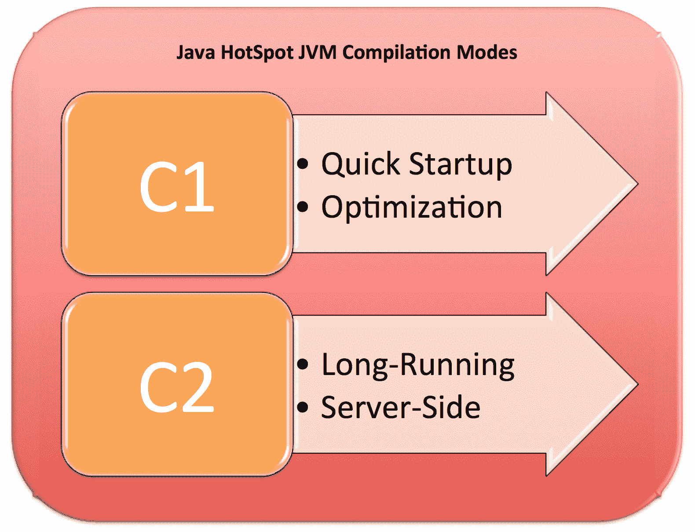
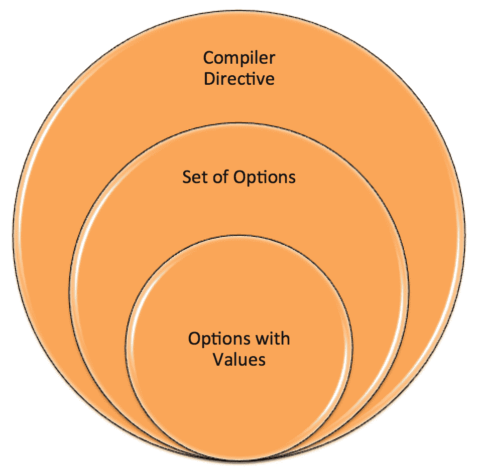
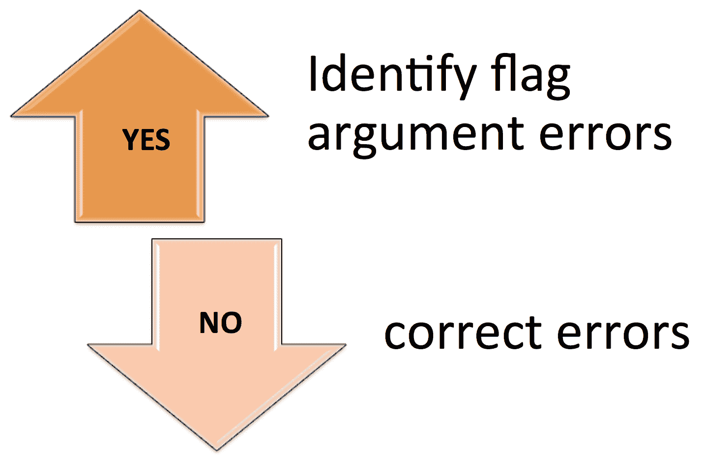
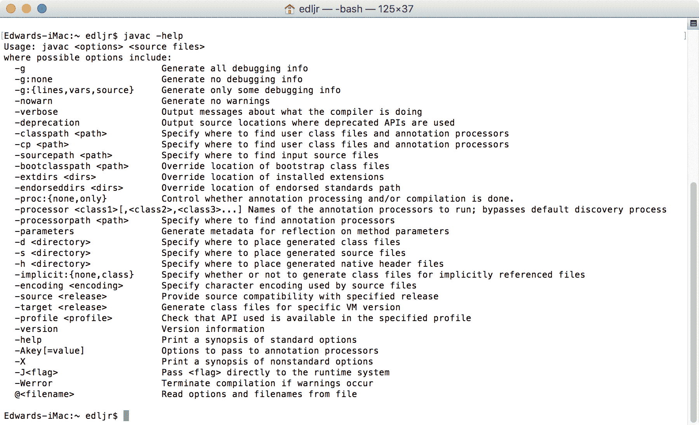
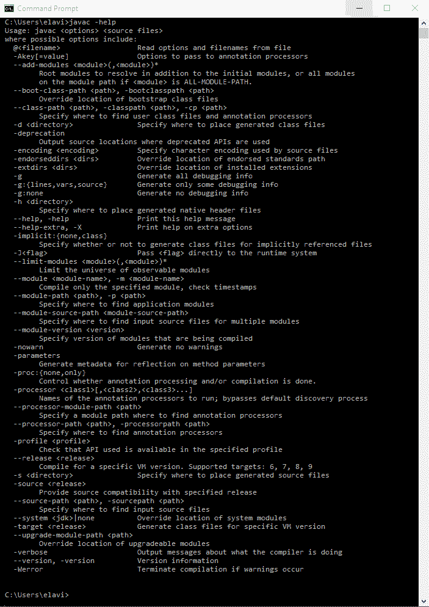

# 命令行标志

在上一章中，我们查看了 JDK 的几种安全变化。 Java 的安全增强功能为开发人员提供了能够编写和维护实现安全性的应用程序。 更具体地说，我们提供了数据报传输层安全性，密钥库，提高安全应用程序性能，TLS ALPN，利用 Ghash 和 RSA 的 CPU 指令，TLS 的 OCSP 装订，以及基于 DRBG 的`SecureRandom`实现。

在本章中，我们将探讨现代 Java 平台的几个更改，其中包含命令行标志的常见主题。 更具体地说，我们将涵盖以下概念：

*   统一的 JVM 日志记录
*   编译控制器
*   诊断命令
*   堆分析代理
*   删除你的 jhat
*   命令行标志参数验证
*   编写旧平台版本
*   基于实验 Java 的 JIT 编译器

# 技术要求

本章和随后的章节具有 Java 11\. Java 平台的**标准版**（ **SE** ）可以从 Oracle 的官方网站下载（ [http://www.oracle。 com / technetwork / java / javase / downloads / index.html](http://www.oracle.com/technetwork/java/javase/downloads/index.html) ）。

IDE 软件包就足够了。 来自 JetBrains 的 Intellij Idea 用于与本章相关的所有编码以及随后的章节。 可以从网站下载 Intellij Idea 的社区版本（ [https://www.jetbrains.com/idea/features/](https://www.jetbrains.com/idea/features/) ）。

# 统一的 JVM 日志记录

在 Java 9 中引入了为 JVM 创建统一的日志记录模式。以下是该努力的目标的全面列表：

*   为所有日志记录操作创建一个 JVM-宽的命令行选项
*   使用分类标记进行日志记录
*   允许消息有多个标签，也称为标记集
*   提供六个级别的日志记录：
*   错误
*   警告
*   信息
*   调试
*   痕迹
*   发展

*   选择基于级别记录的消息
*   可选地直接登录到控制台或文件：
*   一次打印一行，不支持同一行内的交织
*   允许多行日志的输出（不交错）
*   格式化所有日志消息，以便它们很容易被人类阅读
*   添加装饰品，如正常运行时间，级别和标签
*   与级别一样，选择基于装饰记录的消息
*   要将 java 前 9 `tty>print`登录转换为使用统一的日志记录作为输出
*   允许使用`jcmd`和`MBeans`允许动态消息配置
*   允许启用和禁用各个日志消息的能力
*   添加能力确定打印装饰的顺序

JVM 的统一日志记录更改可以分为以下五类：

*   命令行选项
*   装饰
*   水平
*   输出
*   标签

让我们简要看看每个类别。

# 命令行选项

新的命令行选项`-Xlog`是 Java 日志记录框架的一个重要组成部分。 此命令行选项具有广泛的参数和可能性。 基本语法简单地`-Xlog`，后跟一个选项。

这是正式的基本语法：

```
-Xlog[:option]
```

以下是`all`选项的基本示例：

```
-Xlog:all
```

以下是用于配置新的，统一日志记录的广泛命令行语法：

```
-Xlog[:option]
option := [<what>][:[<output>][:[<decorators>][:<outputoptions>]]]
'help'
'disable' 
what := <selector>[,...]
selector := <tag-set>[*][=<level>]
tag-set := <tag>[+..]
'all'
tag := name of tag
level := trace
debug
info
warning
error 
output := 'stderr'
'stdout'
[file=]<filename>
decorators := <decorator>[,...]
'none' 
decorator := time
uptime
timemillis
uptimemillis
timenanos
uptimenanos
pid
tid
level
tags
output-options := <output_option>[,...]
output-option := filecount=<file count>
filesize=<file size in kb>
parameter=value
```

以下`-Xlog`示例之后是描述：

```
-Xlog:all
```

在前面的示例中，我们正在讲述 JVM 采取以下操作：

*   记录所有消息
*   使用`info`级别
*   提供输出到`stdout`

使用此示例，所有`warning`消息仍将输出到`stderr`。

以下示例，在`debug`级别日志消息：

```
-Xlog:gc+rt*=debug
```

在前面的示例中，我们正在讲述 JVM 采取以下操作：

*   记录标记为的所有消息，最小值`gc`和`rt`标签
*   使用`debug`级别
*   提供输出到`stdout`

以下示例将输出推向外部文件：

```
-Xlog:disable - Xlog:rt=debug:rtdebug.txt
```

在前面的示例中，我们正在讲述 JVM 采取以下操作：

*   禁用除了标记为`rt`标记的所有邮件
*   使用`debug`级别
*   为命名为`rtdebug.txt`的文件提供输出

# 装饰

在 Java 的日志记录框架的背景下，装饰是关于日志消息的元数据。 以下是可用的装饰品的字母列表：

*   `level`：与记录消息相关的级别
*   `pid`：PID =处理器标识符
*   `tags`：与记录的消息相关联的标签集
*   `tid`：time =线程标识符
*   `time`：指使用 ISO-8601 格式的当前日期和时间
*   `timemillis`：当前时间以毫秒为单位
*   `timenanos`：纳秒的当前时间
*   `uptime`：时间，在秒和毫秒，因为 JVM 开始
*   `uptimemillis`：时间，以毫秒为单位，因为 JVM 开始
*   `uptimenanos`：时间，纳秒，因为 JVM 开始

装饰可以超越或包含在统一的日志记录输出中。 无论使用哪些装饰，它们都会以以下顺序出现在输出中：

1.  `time`
2.  `uptime`
3.  `timemillis`
4.  `uptimemillis`
5.  `timenanos`
6.  `uptimenanos`
7.  `pid`
8.  `tid`
9.  `level`
10.  `tags`

# 水平

记录的消息与详细级别单独关联。 如前所述，级别是 **error** ，**警告**，**信息**， **debug** ， **trace** ，**和**开发**。 以下图表显示了如何在记录多少信息时级别的冗长程度。 开发级别仅用于开发目的，在产品上的应用程序中不可用：**


日志消息的详细程度

# 使用 Xlog 输出

Java Logging Framework 支持三种类型的输出，具有与`-Xlog`命令行语法的直接使用示例：

在以下示例中，我们为`stderr`提供输出：

```
-Xlog:all=warning:stderr:none
```

以下示例为`stdout`提供输出：

```
-Xlog:all=warning:stdout:none
```

以下示例将输出写入文本文件：

```
-Xlog:all=warning:file=logmessages.txt:none
```

# 标签

新的日志记录框架包括在 JVM 中标识的一组标记。 如果需要，可以在源代码中更改这些标记。 标签应该是自我识别的，例如垃圾收集的`gc`。

当多个标签分组时，它们形成标记集。 当我们通过源代码添加自己的标签时，每个标记应与标记集关联。 这将有助于确保标签保持有组织，并且很容易是人类可读的。

# 编译控制器

控制 **java 虚拟机**（ **jvm** ）编译器似乎可能是一个不必要的任务，但对于许多开发人员来说，这是测试的一个重要方面。 这是通过依赖于方法的编译器标志来完成的。

在本节中，我们将立即开始查看 JVM 编译模式，然后查看可以使用 Java 平台控制的编译器。

# 编译模式

现代 Java 平台的变化包括 **C1** 和 **C2** JVM 编译器的粒度控制。 如下图所示，Java Hotspot JVM 有两个 JIT 编译模式 **C1** 和 **C2** ：



Java Hotspot JVM 编译模式

**c1** 和 **c2** 编译模式使用不同的编译技术，如果在相同的代码基础上使用，可以产生不同的机器代码。

# C1 编译模式

Java Hotspot VM 内的 C1 编译模式通常用于具有以下特征的应用程序：

*   快速启动
*   增加优化
*   客户端

# C2 编译模式

使用以下列出的特征的应用程序使用第二个编译模式 C2：

*   长次
*   服务器端

# 分层编译

分层编译允许我们使用 **C1** 和 **C2** 编译模式。 从 Java 8 开始，分层编译是默认进程。 如本文所示，启动时使用 **C1** 模式以帮助提供更优化。 然后，一旦应用程序充分加热，就采用 **C2** 模式：


分层编译

# Java 11 中的编译器控件

Java 借助能够有限控制 JVM 编译器并在运行时进行更改。 这些额外的能力不会降低性能。 这允许测试和测试优化的更大保真度，因为我们可以运行小编译器测试，而无需重新启动整个 JVM。

要控制编译器操作，我们需要创建指令文件。 这些文件包含编译器指令，该指令由具有值的一组选项组成。 指令文件基本上使用 JSON 的子集：



编译器指令结构

**JavaScript 对象符号**（ **JSON** ）格式用于数据交换。 该指令文件具有以下格式与 JSON 的差异：

*   `int`和`doubles`是唯一支持的数字格式
*   双向斜杠（`//`）可用于注释行
*   尾随逗号（`,`）可以在数组和对象中使用
*   不支持转义字符
*   选项名称格式化为字符串，不必引用

您可以在 [http://www.json.org](http://www.json.org) 中了解更多有关 JSON 的信息。

我们可以使用命令行的以下语法添加我们的指令文件：

```
-XX:CompilerDirectivesFile=<file>
```

以下是指令文件的 shell 示例：

```
[ // Open square bracket marks the start of the directives file

{ // Open curly brace marks the start of a directive block
  // A directives block that applies specifically to the C1 mode
  c1: {
        // directives go here
      },

  // A directives block that applies specifically to the C2 mode
  c2: {
        // directives go here
      },

  // Here we can put a directives that do not apply to
  // a specific compiler mode
},

{ // can have multiple directive blocks

  c1: {
        // directives go here
      }

  c2: {
        // directives go here
      }
}
] // Close square bracket marks the start of the directives file
```

# 诊断命令

七个新的诊断命令，添加到现代 Java 平台中，以增强诊断 JDK 和 JVM 的能力。 这里详述了新的诊断命令。

`print_codegenlist`命令打印当前排队以进行编译的方法。 由于 C1 和 C2 编译模式在单独的队列上，因此需要发出该命令到特定队列。

`dump_codelist` diagnostic 命令将为已编译方法打印以下列出的信息：

*   完整签名
*   地址范围
*   状态：
*   活
*   不传入
*   僵尸

此外，`dump_codelist`诊断命令允许输出指向`stdout`或指定的文件。 输出可以是 XML 表单或标准文本。

`print_codeblocks`命令允许我们打印以下内容：

*   代码缓存大小
*   代码缓存列表
*   代码缓存中的块列表
*   代码块的地址

`datadump_request`诊断命令将转储请求发送到 **java 虚拟机工具界面**（ **jvmti** ）。 这取代了 **Java 虚拟机调试接口**（ **JVMDI** ）和 **Java 虚拟机分析接口**（ **JVMPI** ）。

使用`set_vmflag`命令，我们可以在 JVM 或库中设置命令行标志或选项。

`print_class_summary`诊断命令打印所有加载类的列表以及其继承的结构。

`print_utf8pool`命令打印所有 UTF-8 字符串常量。

# 堆分析代理

最近从 Java 平台中删除了 JVM TI `hprof`代理。 以下是与此更改相关的关键项：

*   **工具接口**（ **ti** ）：这是一个本机编程接口，允许工具控制在 Java 虚拟机内运行的应用程序的执行。 该界面还允许陈述询问。 此工具的完整名称是 Java 虚拟机床界面或 JVM TI。
*   **堆分析**（ **hprof** ）：这是一个内部 JDK 工具，用于分析 JVM 对 CPU 和堆的使用。 最常见的曝光开发人员必须`hprof`是在崩溃后生成的文件。 生成的文件包含堆转储。

Java 11 JDK 不包含`hprof`代理。 它在很大程度上被删除，因为有优越的替代品可用。 以下是其相关功能的表：

| **hprof 功能** | **替代** |
| 分配探查器
（堆=站点） | Java VisualVM. |
| CPU Profiler
（CPU = Samples）
（CPU =时间） | Java VisualVM
Java Flight Recorder |
| 堆转储
（堆=转储） | 内部 JVM 功能：

*   `GC.heap_dump(icmd <pid> GC.heap_dump)`
*   `jmap -dump`

 |

有趣的是，当 HPROF 最初创造时，它并非旨在用于生产。 实际上，它仅适用于 **JVM 工具接口**的代码。 因此，随着现代 Java 平台的出现，HPROF 库（`libhprof.so`）将不再是 JDK 的一部分。

# 删除你的 jhat

**java 堆分析工具**（ **jhat** ）用于解析 Java 堆转储文件。 此堆转储文件解析工具的语法如下：

```
jhat
    [-stack <bool>]
    [-refs <bool>]
    [-port <port>]
    [-baseline <file>]
    [-debug <int>]
    [-version]
    [-h|-help]
   <file>
```

以下是快速查看与 jhat 命令关联的选项：

| **选项** | **描述** | **默认** |
| `-J<flag>` | 这将`<flag>`传递给运行时系统 | N / A. |
| `-stack<bool>` | 这会切换对象分配调用堆栈的跟踪 | `true` |
| `-refs<bool>` | 这会切换对对象的引用的跟踪 | `true` |
| `-port<port>` | 这表示 JHAT HTTP 服务器的端口 | `7000` |
| `-exclude<exclude-filename>` | 这排除了来自可访问对象的指示文件 | N / A. |
| `-baseline<filename>` | 这指定了基准堆转储以用于比较 | N / A. |
| `-debug<int>` | 这设置了输出的冗长 | N / A. |
| `-version ` | 这只是输出 jhat 释放号码 | N / A. |
| `-h`
`-help` | 这提供了帮助文本 | N / A. |

JHAT 以实验形式的 JDK-6 自 Java 平台是 Java 平台的一部分。 它不受支持，并被视为过时。 从 Java 9 开始，该工具不再是 JDK 的一部分。

# 命令行标志参数验证

在本章中，您已经获得了大部分命令行标志与 Java 平台的使用情况。 采取了一致的努力，以确保验证了具有参数的所有 JVM 命令行标志。 这项努力的主要目标是：

*   避免 JVM 崩溃
*   提供错误消息以通知您无效的标志参数

您可以从下图中看到，没有尝试自动更正标志参数错误; 相反，只是为了识别错误并阻止 JVM 崩溃：



标志参数错误

此处提供示例错误消息，并表示标志参数超出范围。 在 JVM 初始化期间执行的标志参数范围检查期间将显示此错误：

```
exampleFlag UnguardOnExecutionViolation = 4 is outside the allowed range [0 . . . 3]
```

以下是对 Java 平台的此更改的一些细节：

*   在当前`globals.hpp`源文件上展开，以确保记录完整的标志默认值和允许的范围
*   定义一个框架，以支持将来添加新的 JVM 命令行标志：
*   这将包括值范围和值集
*   这将确保有效检查将适用于所有新添加的命令行标志

*   修改宏表：
*   为可选范围添加 min / max
*   添加约束条目：
    *   每次标志变化时都会执行约束检查
    *   在 JVM 运行时将继续检查所有可管理的标志

# 编写旧平台版本

Java Compiler `javac`在 Java 9 中更新，以确保它可用于编译 Java 程序以在用户选择的 Java 平台上运行。 正如您在下面的屏幕截图中看到，`javac`有几个选项，包括`-source`和`-target`。 以下屏幕截图中显示的`javac`来自 Java 8：



Java 8 中的 Javac 选项

`-source`选项用于指示编译器接受的 Java 版本。 `-target`选项通知您将生成哪个版本的类文件`javac`。 默认情况下，`javac`在最新的 Java 版本和平台 API 中生成类文件。 当编译的应用程序使用仅在最近的平台版本中使用的 API 时，这会导致问题。 这将使应用程序不符合在旧平台版本上运行的应用程序，尽管存在与`-source`和`-target`选项指定的内容。

要解决上述问题，Java 中可以使用新的命令行选项。 此选项是`--release`选项，并且在使用时，将自动配置`javac`以生成与特定平台版本链接的类文件。 以下屏幕截图显示了当前 Java 平台的`javac`选项。 如您所见，新的`--release`选项包括：



Java 18.9 中的 Javac 选项

以下是新选项的语法：

```
javac --release <release> <source files>
```

# 基于实验 Java 的 JIT 编译器

Java 的基于 Java 的**在 Java 10 中启用了**（ **JIT** ）编译器，以便它可以用作 Linux / X64 平台的实验 JIT 编译器。 基于 Java 的 JIT 编译器称为 Graal。

这种变化是希望实验将作为向 JDK 添加 JIT 编译器的概念证明。

# 概括

在本章中，我们对现代 Java 平台进行了多次更改，具有命令行标志的共同主题。 具体而言，我们涵盖统一的 JVM 日志记录，编译器控件，新诊断命令，删除 HPROF 堆分析代理，删除 JHAT，命令行标志参数验证以及编译旧平台版本的能力。

在下一章中，我们将专注于 Java 中提供的附加实用程序的最佳实践。 这些将包括 UTF-8，Unicode 7.0，Linux 等。

# 问题

1.  在 Java 9 中引入的模式是什么？JVM 日志记录？
2.  伐木五类有哪些？
3.  什么是装饰品？
4.  日志中的冗长程度是多少？
5.  哪个冗长水平最高？
6.  哪个冗长水平是最低的？
7.  如何更改日志标签？

8.  什么用于控制 JVM？
9.  Java Hotspot JVM 的 JIT 编译模式是什么？
10.  哪种编译模式具有快速启动？

# 进一步阅读

以下是您可以参考的信息列表：

*   *使用干净的代码 java se 9 [视频]* ，可在 [https://www.packtpub.com/application-development/getting-started-clean-code-java-se-9 - 视频](https://www.packtpub.com/application-development/getting-started-clean-code-java-se-9-video)。