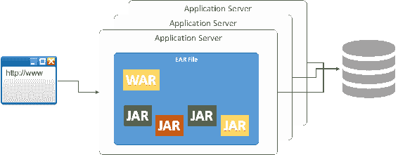
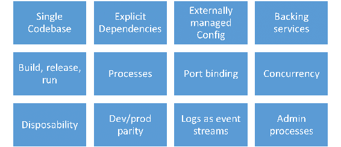

# 云本机简介

云计算的出现和移动设备的普及导致了面向消费者的公司（如亚马逊、Netflix、优步、谷歌和 Airbnb）的崛起，这些公司重新定义了整个客户体验。这些公司已经在云上构建了他们的应用程序（包括 web 和移动界面），使用的功能或服务允许他们根据需求进行放大或缩小，随时可用，并随时准备处理所有级别的故障。

传统企业正在关注这些面向消费者的公司，并希望采用他们的一些最佳实践。他们这样做是为了帮助扩展其快速发展的企业应用程序，使他们能够利用云的弹性和可伸缩性。

在深入研究云计算之前，让我们先看看本章的内容。本章将介绍以下主题：

*   为什么要使用云计算？
*   什么是云本机？
*   12 因素应用程序简介
*   为什么要从单片应用程序转向基于分布式微服务的应用程序？
*   构建基于分布式微服务的应用程序的优势

# 为什么要使用云计算？

让我们看一下以下几点，以了解为什么我们需要使用云本机：

*   云应用的第一波浪潮是关于成本节约和业务敏捷性（特别是在基础设施资源调配和廉价存储方面）。随着云应用的增加，企业开始发现**基础设施即服务**（**IaaS**）和**平台即服务**（**PaaS**）服务及其在构建利用云的弹性和可伸缩性的应用程序中的利用，始终接受云平台固有的故障。
*   许多企业正在数字计划领域采用全新的微服务设计和开发。在处理**物联网**（**物联网**）、移动设备、SaaS 集成和在线商业模式时，企业与市场中的利基参与者合作。这些新时代的商业模式是作为企业端的创新系统而设计和开发的。这些模型被快速迭代，以识别并冒泡出客户的需求、他们的偏好、哪些有效，哪些无效。
*   企业也在开发基于其产品线的数字服务。产品通过物联网进行了增强，使其能够发布有关产品性能的数据。对数据进行整理和分析，以确定预测性维护、使用模型和外部因素等模式。对来自客户的数据进行整理和汇总，以构建用于产品增强和新功能的新模型。许多新的数字服务使用云本地模型。
*   这些现代数字解决方案使用来自不同提供商的 API，例如用于定位的 Google 地图、用于身份验证的 Facebook/Google 以及用于社交协作的 Facebook/Twitter。将所有这些 API 与企业业务的特性和功能混搭在一起，可以让它们为客户构建独特的主张。所有这些集成都发生在 API 级别。移动应用程序不是为数千万用户设计的，而是为数千万用户设计的。这意味着，随着负载的增加，底层应用程序功能应该能够扩展，为客户提供无缝体验。
*   扩大企业资源规模的一种方法是，随着负载的增加或出现故障，在服务/环境供应方面进行繁重的工作。另一种方法是将底层服务的繁重工作卸给云平台提供商。这是构建利用云提供商平台服务的云本机应用程序的最佳时机，使企业能够卸载可伸缩性的关键方面，并专注于价值生成部分。

# 什么是云本机？

当应用程序的设计和架构利用云计算平台支持的底层 IaaS 和 PaaS 服务时，它们被称为**云本地应用程序**。

这意味着要构建可靠的系统应用程序，例如“五个 9”（99.999%），在“三个 9”（99.9%）的基础设施和应用程序组件上运行。我们需要设计应用程序组件来处理故障。为了处理此类故障，我们需要一种结构化的可伸缩性和可用性方法。为了支持整个规模的应用程序，所有的部分都需要自动化。

云的采用通常发生在一系列步骤中，企业在开始构建云本机应用程序之前就开始探索服务。这种采用始于开发/测试环境向云端的移动，在云端，快速资源调配是业务和开发人员社区的**关键问题**。一旦企业完成了环境配置阶段，下一步/模型将在以下章节中讨论企业应用程序迁移到云本机模型。

# 升降

传统上，企业从 IaaS 服务开始其云计算之旅。他们将业务应用程序的工作负载从本地数据中心转移到云计算平台上的同等租用容量。这是采用云计算平台的第一波浪潮，企业从资本支出模式转变为运营支出模式。

顾名思义，IaaS 专注于基础设施计算节点、网络和存储。在这个模型中，企业可以利用云的弹性，根据传入的需求或负载添加或删除计算节点。**虚拟机**（**虚拟机**）抽象出底层硬件，并提供只需点击几下即可向上或向下扩展虚拟机数量的能力。

企业通常在第一波中使用 IaaS，原因如下：

*   **资源的可变性**：能够随意添加/删除资源，从而提高业务灵活性
*   **实用新型**：IaaS 提供每小时出租的基本资源，允许更多的可预测性和运营成本模式

# 土生土长

一旦企业开始适应 IaaS，下一轮采用将 PaaS 作为应用程序工作负载的一部分。在此阶段，企业开始发现具有以下好处的服务：

*   **平台服务替换**：这涉及到识别企业潜在的平台功能，提升和转移工作负载，并用云提供商提供的同等平台服务替换。例如：
    *   将应用程序消息传递系统替换为云提供商提供的排队系统（如 AWS SQS）
    *   用等效的托管数据服务（如 AWS RDS）替换数据存储或**关系数据库管理系统**（**RDMBS**）
    *   用托管目录或安全服务（如 AWS 目录和 AWS IAM）替换安全或目录服务
    *   这些服务使企业能够消除所有操作工作，如数据存储备份、可用性、可扩展性和冗余，并用提供所有这些功能的托管服务取代它们

*   **应用服务替代**：企业发现可以替代自身平台或实用服务的新服务。例如：
    *   使用云提供商提供的等效 DevOps 服务（如 AWS CodePipeline、AWS CodeCommit 或 AWS CodeDeploy）替换构建和发布服务或产品
    *   用等效的应用程序平台服务（如 AWS API 网关、AWS SWF 和 AWS SES）替换应用程序服务或产品
    *   用等效的应用程序分析服务（如 AWS 数据管道和 AWS EMR）替换分析工作负载服务

一旦应用程序开始采用平台服务，应用程序就开始抽象出**商用现货**（**COTS**）产品（如消息、通知、安全、工作流和 API 网关）提供的特性或功能并用同等的功能平台服务取代它们。例如，与托管和运行消息传递 IaaS 不同，移动到等效的平台服务意味着移动到一种只为发送的消息数量付费的模式，而不产生任何额外的运营成本。这种模式带来了显著的节约，因为您从租用和运营产品转向只在使用时租用产品的模式。

# 无服务器

一旦企业采用 PaaS 来构建应用程序，下一步就是将应用程序逻辑抽象为一系列较小的函数并进行部署。这些函数作为对来自用户或代理的事件的反应被调用，从而导致这些函数计算传入事件并返回结果。这是最高级别的抽象，应用程序被划分为一系列函数，这些函数彼此独立部署。这些函数使用异步通信模型相互通信。云计算平台提供了 AWS Lambda 和 Azure 等功能，以实现无服务器化。

# 云本地和微服务

为了能够采用 IaaS 和 PaaS 服务，需要改变应用程序的设计和架构。

在基础平台（读作：ApplicationServer）上设计企业应用程序的模型意味着应用程序的可伸缩性和可用性的繁重工作是平台的责任。企业开发人员将专注于使用标准化的 JEE 模式和开发组件（表示、业务、数据和集成）来构建功能齐全的事务应用程序。应用程序可扩展的程度受到底层平台的能力（节点群集和分布式缓存）的限制：

单片应用

作为单片应用程序构建的业务应用程序通常具有以下特征：

*   整个应用程序逻辑打包到单个 EAR 文件中
*   应用程序重用是通过共享 jar 派生的
*   应用程序更改是提前几个月计划的，通常是每季度一次大的推进
*   有一个数据库包含应用程序的整个架构
*   有数千个测试用例表示回归量
*   应用程序的设计、开发和部署需要多个团队之间的协调和重要的管理

随着社交互动和移动用户的出现，应用程序用户和数据的规模开始呈指数级增长。企业很快发现，该平台在以下方面正成为瓶颈：

*   **业务敏捷性**：由于应用程序的整体性，管理应用程序平台和不断更改特性/功能的运营成本受到阻碍。即使是一个小的特性更改，整个回归测试周期和跨服务器集群的部署都在侵蚀创新的总体速度。
    移动革命意味着问题不仅存在于频道层，还渗透到记录层的集成和系统。除非企业在这些层面上解决问题，否则创新能力和市场竞争力将受到威胁。
*   **成本**：为了应对不断增长的需求，IT 运营团队正在添加新的服务器实例来处理负载。但是，对于每一个新实例，复杂性都会随着许可证成本（取决于核心数量）的增加而增加。与世界上的 facebook 不同，每获得一个用户，每个用户的企业成本都在增加。

此时，企业开始关注开源产品，以及现代应用程序是如何在面向消费者的公司中构建的，这些公司为数百万用户提供服务，处理 PB 级数据，并部署到云端。

面向消费者的公司在其生命周期的早期就遇到了这些障碍。大量创新导致了新的开源产品的设计和开发，以及云计算的设计模式。

在这种背景下，研究了**面向服务架构**（**SOA**）的整个前提，企业研究了应用程序架构如何采用设计独立、离散、可与其他服务集成和组合的自治服务的原则。这导致了微服务模型的兴起，它与云服务模型进行了很好的调整和集成，在云服务模型中，一切都可以作为服务和 HTTP 端点使用。

微服务是面向服务体系结构（SOA）的一种专门化和实现方法，用于构建灵活、独立部署的软件系统

–维基百科

设计和开发微服务时要记住，可以通过组合这些服务来构建业务应用程序。微服务的设计遵循以下原则：

*   **单一责任原则**：每个微服务在受限域上下文中只执行一项业务责任。从软件的角度来看，系统需要分解为多个组件，其中每个组件都成为一个微服务。微服务必须是轻量级的，以便于更小的内存占用和更快的启动时间。
*   **不共享**：微服务是自主的、自包含的、无状态的，通过基于容器的封装模型管理服务状态（内存/存储）。私有数据由服务管理，并且对来自任何其他服务的数据没有争用。无状态的微服务比有状态的微服务扩展得更好，启动速度更快，因为在关闭时不需要备份状态，也不需要在启动时激活状态。
*   **无功**：适用于负载并发或响应时间较长的微服务。异步通信和回调模型允许优化资源利用率，从而提高微服务的可用性和吞吐量。
*   **外部化配置**：将配置服务器中的配置外部化，这样就可以按环境按层次结构进行维护。
*   **一致**：根据编码标准和命名约定指南，服务应以一致的风格编写。
*   **弹性**：服务应该处理由技术原因（连接和运行时）和业务原因（无效输入）引起的异常，而不是崩溃。断路器和大容量标头等模式有助于隔离和控制故障。
*   **好市民**：微服务应该通过 JMX API 或 HTTP API 报告其使用统计数据、访问次数、平均响应时间等。
*   **版本化**：微服务可能需要支持不同客户端的多个版本，直到所有客户端迁移到更高版本。在支持新特性和 bug 修复方面，应该有一个明确的版本策略。
*   **独立部署**：每个微服务都应该是可独立部署的，不会影响应用程序的完整性：

从单片应用程序到基于微服务的应用程序

微服务的设计、开发和部署注意事项将在后续章节中详细介绍。我们将了解如何为电子商务产品构建服务。我相信每个人都非常熟悉电子商务，并且很容易理解产品要求。

# 12 因素应用程序

为了构建可跨云提供商部署的分布式、基于微服务的应用程序，Heroku 的工程师提出了 12 个需要由任何现代云本地应用程序实现的因素：

*   **单个代码库**：应用程序必须有一个代码库，在版本控制中对每个可多次部署（开发、测试、暂存和生产环境）的应用程序（读取：microservice）进行跟踪。两个微服务不共享相同的代码库。此模型允许灵活地更改和部署服务，而不会影响应用程序的其他部分。
*   **依赖项**：应用程序必须明确声明其代码依赖项，并将其添加到应用程序或微服务中。依赖项打包为 microservice JAR/WAR 文件的一部分。这有助于隔离微服务之间的依赖关系，并通过同一 JAR 的多个版本减少任何副作用。
*   **配置**：将应用配置数据移出应用或微服务，通过配置管理工具进行外部化。应用程序或微服务将根据其运行的环境选择配置，从而允许相同的部署单元跨环境传播。
*   **支持服务**：所有外部资源，访问权限应为可寻址 URL。例如，SMTP URL、数据库 URL、服务 HTTP URL、队列 URL 和 TCP URL。这允许 URL 外部化到配置中，并针对每个环境进行管理。
*   **构建、发布和运行**：构建、发布和运行的整个过程被视为三个独立的步骤。这意味着，作为构建的一部分，应用程序被构建为一个不可变的实体。此不可变实体将根据环境（开发、测试、暂存或生产）选择相关配置来运行流程。
*   **流程**：微服务建立在无共享模式之上，遵循无共享模式。这意味着服务是无状态的，状态被外部化为缓存或数据存储。这允许无缝的可伸缩性，并允许负载平衡或代理向服务的任何实例发送请求。
*   **端口绑定**：微服务构建在容器中。该服务将通过端口（包括 HTTP）导出和绑定其所有接口。
*   **并发**：微服务进程被扩展，这意味着为了处理增加的流量，更多的微服务进程被添加到环境中。在微服务流程中，可以使用反应式模型来优化资源利用率。
*   **可处置性**：我们的想法是构建一个不可变的微服务，并承担一项责任，从而以更快的启动时间最大化健壮性。不变性也有助于服务的可处置性。
*   **开发/生产奇偶校验**：应用程序生命周期中的开发、测试、登台和生产环境尽可能保持相似，以避免以后出现任何意外。
*   **日志**：在不可变的微服务实例中，作为服务处理的一部分生成的日志是状态的候选。这些日志应被视为事件流，并推送到日志聚合器基础结构。
*   **管理流程**：微服务实例是长期运行的流程，除非被终止或替换为新版本，否则将继续运行。所有其他管理和管理任务均被视为一次性流程：

12 因子应用程序

遵循这 12 个因素的应用程序不会对外部环境做出任何假设，允许它们部署在任何云提供商平台上。这使得同一组工具/流程/脚本可以跨环境运行，并以一致的方式部署分布式微服务应用程序。

# 支持微服务的服务生态系统

为了成功运行微服务，需要某些启用组件/服务。这些使能服务可以标记为 PaaS，用于支持微服务的构建、发布、部署和运行。

在云本机模型中，这些服务作为 PaaS 服务从云提供商自身获得：

*   **Service discovery**: When the application is decomposed into a microservices model, a typical application may be composed of hundreds of microservices. With each microservice running multiple instances, we soon have thousands of microservice instances running. In order to discover the service endpoint, it is pertinent to have a service registry that can be queried to discover all of the instances of the microservice. In addition, the service registry tracks the heartbeat of every service instance to make sure that all services are up and running.
    Further, the service registry helps in load balancing the requests across the service instances. We can have two models for load balancing:
    *   客户端负载平衡：
        *   服务使用者向注册表请求服务实例
        *   服务注册表返回运行服务的服务列表
    *   服务器端负载平衡：
        *   服务端点被 Nginx、API 网关或另一个反向代理从使用者隐藏

    该领域的典型产品是领事和动物园管理员：

服务注册中心

*   **Config server**: The microservice needs to be initialized with multiple parameters (for example, database URL, queue URL, functional parameters, and dependency flags). Managing properties in file or environment variables beyond a certain number can become unwieldy. To manage these properties across environments, all such configurations are managed externally in a configuration server. At boot time, microservices will load the properties by invoking the API on the config server.
    Microservices also make use of listeners to listen for any changes to the properties on the config server. Any runtime change of properties can be picked up immediately by the microservices. The properties are typically categorized at multiple levels:
    *   **服务特定属性**：保留与微服务相关的所有属性
    *   **共享属性**：保留可能在服务之间共享的属性
    *   **公共属性**：持有跨服务的公共属性

    配置服务器可以在源代码管理系统中备份这些属性。这一领域的典型产品是 Concur、Netflix Archaius 和 Spring Cloud Config server：

配置服务器

*   **Service management/monitoring**: An average business application typically tends to get decomposed into about 400 microservices. Even if we ran two to three instances of these microservices, we would be talking about managing over 1,000  instances of our microservices. Without an automated model, managing/monitoring these services becomes an operational challenge. The following are the key metrics that need to be managed and monitored:
    *   **服务健康**：每个服务都需要发布其健康状态。需要对这些服务进行管理/跟踪，以识别缓慢或失效的服务。
    *   **服务度量**：每个服务还发布吞吐量度量数据，如 HTTP 请求/响应的数量、请求/响应大小和响应延迟。
    *   **进程信息**：每个服务将发布 JVM 度量数据（如堆利用率、线程数量和进程状态），这些数据通常作为 Java VisualVM 的一部分提供。
    *   **将事件记录为流**：每个服务也可以将日志事件发布为一组流事件。

    所有这些信息都是从服务中提取出来的，并绑定在一起以管理和监视应用程序服务环境。需要进行两种类型的分析事件相关性和纠正决策。警报和驱动服务是服务监控系统的一部分。例如，如果需要维护一定数量的服务实例，且数量减少（由于健康检查，服务不可用），则启动服务可以将该事件作为指示器，以添加相同服务的另一个实例。

    此外，为了通过微服务模型跟踪服务调用流，可以使用第三方软件帮助创建已识别的请求，并跟踪服务调用如何通过微服务。此软件通常将代理部署到容器上，容器将代理编织到服务中并跟踪服务度量：

服务度量

*   **容器管理/编排**：微服务环境的另一个关键基础设施部分是容器管理和编排。这些服务通常捆绑在一个容器中，并部署在 PaaS 环境中。该环境可以基于 OpenShift 模型、Cloud Foundry 模型或纯 VM 模型，具体取决于它们是部署在私有云还是公共云上。要部署和管理容器之间的依赖关系，需要容器管理和编排软件。通常，它应该能够理解容器之间的相互依赖关系，并将容器部署为应用程序。例如，如果应用程序有四个部分，一个用于 UI，两个用于业务服务，一个用于数据存储，那么所有这些容器都应该标记在一起，并作为一个单元部署，具有相互依赖性和正确的实例化顺序。
*   **日志聚合**：12 个因素中有 1 个将日志视为事件流。容器应该是无状态的。日志语句通常是有状态的事件，需要在容器的生命周期之外持久化。因此，容器中的所有日志都被视为事件流，可以推/拉到集中的日志存储库中。所有日志都是聚合的，可以在这些日志上运行各种模型以获得各种警报。您可以通过这些日志跟踪安全和故障事件，这些日志可以提供给服务管理/监控系统，以便采取进一步的行动：

日志聚合

*   **API 网关/管理**：服务简单，遵循单一责任模式。问题出现了：谁来处理其他问题，如服务身份验证、服务计量、服务节流、服务负载平衡和服务免费/高级模型？这就是 API 网关或管理软件的作用所在。API 网关代表微服务处理所有此类问题。API 网关提供了多个用于管理服务端点的选项，还可以提供转换、路由和中介功能。与典型的企业服务总线相比，API 网关更加轻量级。

API 管理网关

*   **DevOps**：另一个关键方面是持续集成/部署管道，以及需要设置基于微服务的应用程序的自动化操作。在开发人员编写代码时，它会经历一系列步骤，这些步骤需要自动化，并使用选通标准进行映射，以允许发布经过回归测试的代码：

开发生命周期

# 微服务采用

企业内部的微服务采用是由数字转型这一共同主题驱动的，无论他们是否希望在创新系统中重新构建现有的单片应用程序，以提高业务灵活性和减少技术债务，或者开发新的应用程序，使他们能够快速创新和尝试不同的商业模式。

# 整体变换

企业已经在应用服务器集群上运行基于 JEE 原则的渠道应用程序。这些应用程序多年来积累了大量的技术债务，已成为一个重大问题—庞大、笨拙且难以持续更改。

随着商业环境竞争的加剧和渠道的扩散，企业正在寻求更快的创新并提供无缝的客户体验。另一方面，他们不想放弃对现有应用程序的现有投资。

在这个场景中，企业正在执行多个程序，以将现有应用程序重新考虑并重新构建为现代的、分布式的、基于微服务的模型，这些模型提供了快速迭代的通用性，并且是经得起未来考验的。

企业正以双管齐下的方式解决这一问题：

1.  将提供核心生态系统的基础平台设置为一组服务，以部署和运行微服务。这些服务包括配置管理、服务发现、弹性计算、容器管理、安全性、管理和监视、DevOps 管道等。企业通常会在使用公共云和建立私有云之间权衡。云平台的选择取决于相关行业和企业战略的成熟度。
2.  第二种方法是在单片应用程序上进行芯片设计，一次一个功能块，并将核心业务逻辑迁移到微服务模型。GUI 部分使用 AngularJS 和 ReactJS 等框架分别迁移到 SPA 模型。例如，许多电子商务企业已经将其目录和搜索服务转移到弹性云提供商。只有当客户单击结账时，他们才会将客户带到内部数据中心。

一旦企业建立了与平台服务相关的生态系统，就很容易添加更多基于微服务的功能，从而在业务敏捷性和创新方面提供所需的动力。

我们将在[第 12 章](12.html)、*数字转换*中详细介绍数字转换。

# 总结

在本章中，我们介绍了什么是云本机编程以及为什么要使用它。我们看到了企业在云本地应用程序方面的各种采用模式。我们讨论了分布式应用程序的 12 个因素，以及基于微服务的云本地支持设计的使用。我们介绍了构建基于微服务的应用程序的支持生态系统。

随着本书的深入，我们将介绍如何设计、构建和运行云本机应用程序。我们还将介绍使用两个云提供商平台 AWS 和 Azure 进行的云本地应用程序开发。我们将利用他们的平台服务构建一个云本地应用程序。

我们还将介绍云本机应用程序 DevOps 的操作方面、部署、监视和管理。最后，我们将介绍如何将现有的单片应用程序转换为现代分布式云本地应用程序。在下一章中，我们将深入讨论创建第一个云本机应用程序。