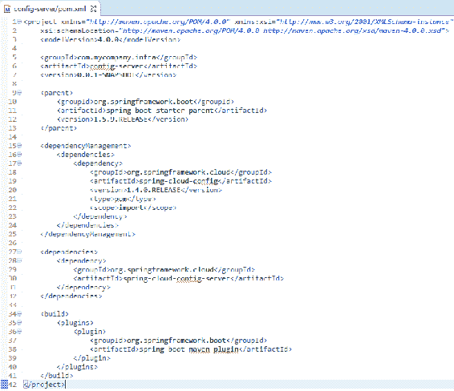
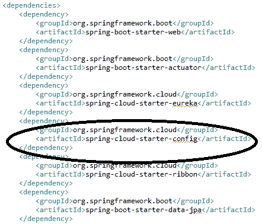
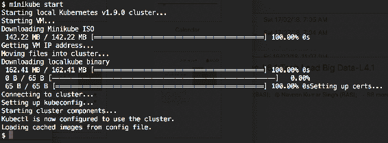
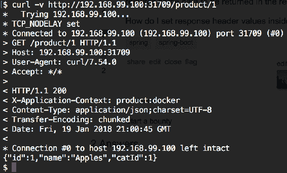
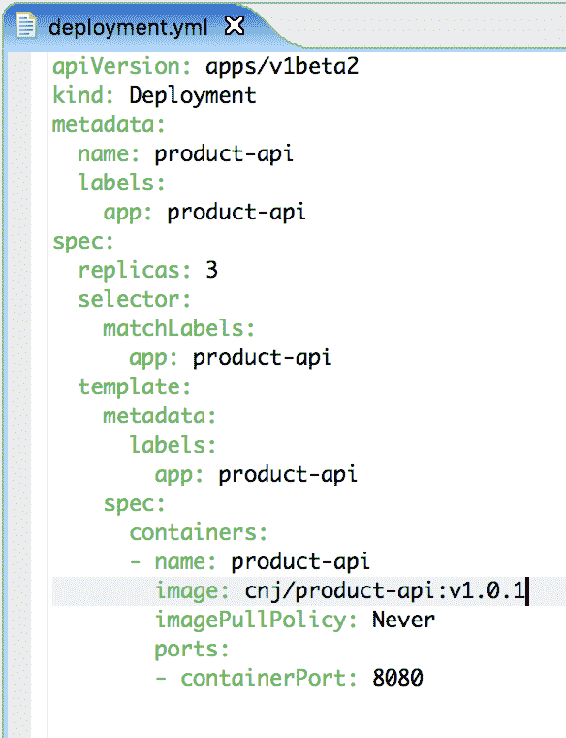
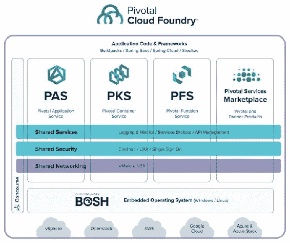
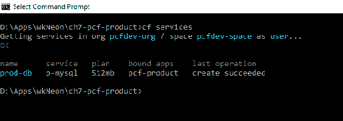
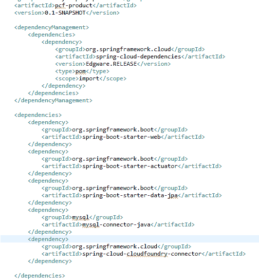
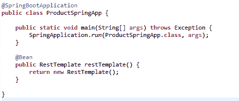

# 云本机应用程序运行时

在使用部署管道（如 Jenkins）开发、测试和部署应用程序之后，在本章中，我们将介绍应用程序或服务运行的运行时生态系统。我们将讨论以下主题：

*   需要全面的运行时，包括对大量服务的操作和管理问题的概述
*   实现参考运行时架构，包括：

    *   服务注册
    *   配置服务器
    *   服务前端、API 网关、反向代理和负载平衡器
    *   将 Zuul 视为反向代理
    *   通过 Kubernetes 和 Minikube 进行容器管理和编排
*   在**平台上作为服务**（**PaaS**运行）：
    *   PaaS 平台如何帮助实现我们在前一章中讨论的服务运行时参考体系结构
    *   安装 Cloud Foundry 并在 Cloud Foundry 上运行我们的`product`服务

# 对运行时的需求

我们已经开发了我们的服务，为它们编写了测试，自动化了持续集成，并且正在容器中运行它们。我们还需要什么？

在生产中大规模运行许多服务并不容易。随着越来越多的服务在生产中发布，它们的管理开始变得复杂。因此，以下是问题的概述，在 MicroService 生态系统中讨论，并在前一章的一些代码示例中解决：

*   **云上运行的服务：**传统的大型应用程序托管在应用服务器上，在 IP 地址和端口上运行。另一方面，微服务在不同 IP 地址和端口的多个容器中运行，因此跟踪生产服务可能变得复杂。
*   **服务就像打鼹鼠游戏中的鼹鼠一样上下波动：**有 100 多个服务，它们的负载平衡，故障转移实例在整个云空间运行。多亏了 DevOps 和 agility，许多团队正在部署新的服务并删除旧的服务。因此，正如我们所看到的，微服务驱动的云环境是非常动态的。
    这两个问题由跟踪服务的服务注册中心解决。因此，客户端可以使用客户端负载平衡模式查找与名称对应的服务运行的位置。然而，如果我们想从查找中提取客户机，那么我们使用服务器端负载平衡模式，其中负载平衡器（如 Nginx）、API 网关（如 Apigee）或反向代理或路由器（如 Zuul）从服务的实际地址提取客户机。
*   **跨微服务管理我的配置：**如果部署单元已断开多个服务，则包含打包配置项（如连接地址、用户 ID、日志级别等）的属性文件也会断开。因此，如果我必须更改一组服务或流的日志记录级别，我是否必须跨应用程序的所有属性文件更改它？在这里，我们将看到在配置服务器（如 Spring config server 或 Concur）中集中属性文件有助于以分层方式管理属性。
*   **需要处理的日志文件太多：**每个微服务正在生成一个（或多个）日志文件，如`.out`和`.err`以及 Log4j 文件。如何在多个服务的多个日志文件中搜索日志消息？
    解决这一问题的模式是日志聚合，使用 Splunk 等商业工具或 Logstash 或 Galaxia 等开源工具实现。默认情况下，它们也出现在 PaaS 产品中，如 Pivotal Cloud Foundry。
    另一种选择是将日志流式传输到聚合器（如 Kafka），从中可以集中存储日志。
*   **每个服务的指标**：**在[第 2 章](02.html)*编写您的第一个云本机应用程序*中，我们添加了 Spring 启动器指标，这些指标作为端点公开。还有许多其他指标，例如 Dropwizard 指标，可以捕获和公开。
    代理必须监控所有服务执行器指标，或者可以导出这些指标，然后在监控和报告工具中汇总。
    另一个选项是应用程序监控工具，如 Dynatrace、AppDynamics，用于监控应用程序，并在 Java 级别提取度量。我们将在下一章中研究这些。**

 **# 实现运行时参考体系结构

上一节讨论的问题由以下参考运行时体系结构解决：


所有这些组件已经在[第 1 章](01.html)、*云本机简介*中讨论过。现在，我们继续选择技术并展示一个实现。

# 服务注册

运行服务注册中心 Eureka 在[第 2 章](02.html)*编写第一个云本地应用程序*中进行了讨论。请参阅该章，以刷新您对`product`服务如何向 Eureka 注册以及客户如何使用 Ribbon 和 Eureka 查找`product`服务的记忆。

如果我们使用 Docker 编排，比如 Kubernetes，那么服务注册中心的重要性就会稍微降低。在本例中，Kubernetes 本身管理服务的注册，代理查找并重定向到该服务。

# 配置服务器

配置服务器以分层方式存储配置。这样，应用程序只需要知道配置服务器的地址，然后连接到它就可以获得其余的配置。

有两种流行的配置服务器。一个是 Hashicorp 的领事，另一个是 Spring 配置服务器。我们将使用 SpringConfigServer 来保持堆栈与 Spring 的一致性。

让我们回顾一下开始使用配置服务器的步骤。使用外部化配置有两个部分：服务器（为属性提供服务）和客户端。

# 配置服务器的服务器部分

有许多选项可以通过 HTTP 连接为属性提供服务，领事和 Zookeeper 是常用的选项。然而，对于 Spring 项目，SpringCloud 提供了一个灵活的配置服务器，可以连接到多个后端，包括 Git、数据库和文件系统。假设属性最好存储在版本控制中，我们将在本例中使用 Git 后端 for Spring Cloud 配置。

Spring Cloud Config 服务器代码、配置和运行时与 Eureka 非常相似，很容易启动一个实例，就像我们在[第 2 章](02.html)*编写第一个云本地应用程序*中为 Eureka 所做的那样。

按照以下步骤运行服务注册表：

1.  创建一个工件 ID 设置为`config-server`的新 Maven 项目。
2.  编辑 POM 文件并添加以下内容：

1.母公司名称为`spring-boot-starter-parent`

2.依赖项为`spring-cloud-config-server`

3.依赖关系管理为`spring-cloud-config`



3.  创建一个`ConfigServiceApplication`类，该类将具有用于启动配置服务器的注释：


4.  在应用程序的`config-server/src/main/resources`文件夹中创建一个`application.yml`文件，并放置以下内容：

```java
server: 
  port: 8888 
spring: 
  cloud: 
    config: 
      server: 
        git: 
          uri: file:../.. 
```

端口号是配置服务器通过 HTTP 连接侦听配置请求的位置。

`spring.cloud.config.server.git.uri`的另一个属性是 Git 的位置，我们已经为其配置了一个用于开发的本地文件夹。这就是 Git 应该在本地机器上运行的地方。如果没有，请在此文件夹上运行`git init`命令。

我们这里不涉及 Git 身份验证或加密。请查看 Spring 云配置手册（[https://spring.io/guides/gs/centralized-configuration/](https://spring.io/guides/gs/centralized-configuration/) 了解更多详细信息。

5.  在`product.properties`文件中，我们将保存实际`product`项目的`application.properties`文件中最初保存的属性。这些属性将由配置服务器加载。我们将从一个小地产开始，如下所示：

```java
testMessage=Hi There 
```

这个属性文件应该存在于我们在上一步中刚刚引用的 Git 文件夹中。请使用以下命令将属性文件添加到 Git 文件夹：

```java
git add product.properties and then commit.
```

6.  在申请的`resources`文件夹中创建`bootstrap.yml`文件，输入本项目名称：

```java
spring: 
  application: 
    name: configsvr 
```

7.  构建 Maven 项目，然后运行它。
8.  您应该看到一条 Tomcat 启动消息，如下所示：


`ConfigurationServiceApplication` has started and is listening on port `8888`

让我们检查我们添加的属性是否可供使用。

启动浏览器并检查`product.properties`。有两种方法可以做到这一点。第一种是将属性文件视为 JSON，第二种是将其视为文本文件：

1.  `http://localhost:8888/product/default`：


2.  `http://localhost:8888/product-default.properties`：


如果您想知道，缺省值是概要文件名。Spring Boot 应用程序支持配置文件覆盖，例如，对于测试和**用户验收测试**（**UAT**）环境，生产属性可以替换为`product-test.properties`文件。因此，配置服务器支持以下形式的 URL 读取：`http://configsvrURL/{application}/{profile}`或`http://configsvrURL/{application-profile}.properties`或`.yml`。

在生产环境中，我们不太可能直接访问配置服务器，如前所示。将由客户端访问配置服务器；我们下一步将看到这一点。

# 配置客户端

我们将使用前面开发的`product`服务代码作为基线，开始将应用程序中的属性提取到配置服务器中。

1.  从 eclipse 复制`product`服务项目，为本章创建一个新项目。
2.  将`spring-cloud-starter-config`依赖项添加到 POM 文件中的依赖项列表中：



3.  我们的主要工作将是在资源方面。告诉`product`服务使用运行在`http://localhost:8888`的配置服务器。
    该`failFast`标志表示如果找不到配置服务器，我们不希望继续加载应用程序。这一点很重要，因为它将确保`product`服务在找不到配置服务器时不采用默认设置：

```java
spring: 
  application: 
    name: product 

  cloud: 
    config: 
      uri: http://localhost:8888 
      failFast: true 
```

4.  将`product`服务的资源文件夹`application.properties`部分中的所有属性移到`product.properties`，我们在上一部分中定义为配置服务器加载的`git`文件夹的一部分。
    您的`product.properties`文件现在将具有有用的配置，除了我们为测试输入的`Hi There`消息：

```java
server.port=8082 
eureka.instance.leaseRenewalIntervalInSeconds=15 
logging.level.org.hibernate.tool.hbm2ddl=DEBUG 
logging.level.org.hibernate.SQL=DEBUG 
testMessage=Hi There 
```

5.  我们现在可以删除`product`服务的`resources`文件夹中的`application.properties`文件。
6.  让我们向`product`服务添加一个测试方法，以检查从配置服务器设置的属性：

```java
    @Value("${testMessage:Hello default}") 
    private String message; 

   @RequestMapping("/testMessage") 
   String getTestMessage() { 
         return message ; 
   }
```

7.  如前几章所述，启动 Eureka 服务器。
8.  确保上一节中的配置服务器仍在运行。
9.  现在，从`ProductSpringApp`主类启动`product`服务。在日志的开头，您将看到以下语句：


当 ProductSpringApp 启动时，它首先从端口 8888 上运行的外部配置服务获取配置

在`bootstrap.yml`文件中，选择具有`name=product`的环境作为我们的应用程序名称。

`product`服务应侦听的端口号与其他属性（如我们现在将看到的测试消息）一起从该配置服务器获取：


`ProductSpringApp` starts on port `8082` picked up from the externalized configuration.

使用两个 URL 测试应用程序，如下所示：

*   `http://localhost:8082/testMessage`：返回`Hi There`，这是我们配置的消息

Run one of the other REST services, such as product view. You will see the required product information to indicate our services are working fine.

*   `http://localhost:8082/product/1`：返回`{"id":1,"name":"Apples","catId":1}`

# 刷新属性

现在，如果您希望集中反映在所有服务上的属性发生了变化，该怎么办？

1.  您可以将`product.properties`文件中的消息更改为新消息，例如`Hi Spring`。
2.  您将注意到，配置服务器在下一次读取时会选择此更改，如下所示：


但是，服务不会立即获取此属性，因为调用`http://localhost:8082/testMessage`会导致较旧的`Hi There`消息。如何刷新命令行上的属性？

这就是执行器命令`/refresh`方便的地方。我们将 bean 配置为`@RefreshScope`注释的一部分。当从 Postman 应用程序执行对`http://localhost:8082/refresh`的`POST`方法调用时，这些 bean 将被重新加载。请参阅以下日志，以检查调用刷新时重新加载属性的结果：


第一行在日志中显示`product`服务如何在执行`http://localhost:8082/refresh`时刷新其属性

您可以检查在标记行之后，如何重新开始属性加载，以及如何反映调用`http://localhost:8082/testMessage`后的消息。

# 微服务前端

使用反向代理、负载平衡器、边缘网关或 API 网关作为微服务的前端是一种流行模式，其复杂程度越来越高。

*   **反向代理**：反向代理被定义为使下游资源可用的过程，就好像它源于自身一样。在这方面，Web 服务器前端和应用服务器也充当反向代理。反向代理在云本机应用程序中很有用，因为它确保客户端不需要像我们在[第 2 章](02.html)*编写第一个云本机应用程序*中那样查找服务然后访问它们。他们必须访问反向代理，反向代理查找微服务，调用微服务，并向客户端提供响应。
*   **负载平衡器**：负载平衡器是反向代理的一种扩展形式，可以在多个服务之间平衡从客户端接收的请求。这增加了服务的可用性。负载平衡器可以与 service registry 协作，找出哪些是活动服务，然后在它们之间平衡请求。Nginx 和 HAProxy 是可以用于前端微服务的负载平衡器的好例子。
*   **边缘网关**：顾名思义，边缘网关是部署在企业或事业部边缘的高阶组件，具有比负载均衡器更多的功能，如身份验证、授权、流量控制、路由等功能。Netfix Zuul 就是这种模式的一个很好的例子。在本节中，我们将介绍使用 Zuul 的代码示例。
*   **API 网关**：随着移动和 API 的普及，该组件提供了更为复杂的功能，例如将请求分散到多个服务，在它们之间进行编排，拦截和增强请求或响应或转换其格式，对请求进行复杂的分析。也可以在单个流中同时使用 API 网关和负载平衡器、反向代理或边缘。这种方法有助于职责分离，但也会由于额外的跃点而增加延迟。我们将在后面的章节中看到 API 网关。

# Netflix Zuul

Netflix Zuul 是一个受欢迎的边缘网关，由 Netflix 推广，然后作为 Spring Cloud 的一部分提供。如前所述，Zuul 表示网守并执行所有这些功能，包括身份验证、流量控制，以及最重要的路由。它与 Eureka 和 Hystrix 在查找服务和报告指标方面进行了很好的集成。企业或域中的服务可以由 Zuul 进行前端处理。

让我们在`product`服务前面放置一个 Zuul 网关：

1.  创建一个新的 Maven 项目，并将其工件 ID 设置为`zuul-server`。
2.  编辑 POM 文件并添加以下内容：

1.将父项设置为`spring-boot-starter-parent`

2.设置对`spring-cloud-starter-zuul`、`-eureka`和`-web`项目的依赖关系

3.在`spring-cloud-starter-netflix`上设置依赖关系管理：


3.  创建带有注释的应用程序类以启用 Zuul 代理：


`application.yml`中的配置信息对 Zuul 非常关键。这就是我们配置 Zuul 的路由功能以将其重定向到正确的微服务的地方。

1.  由于 Zuul 与 Eureka 的互动良好，我们将利用这一优势：

```java
eureka: 
  client: 
    serviceUrl: 
defaultZone: http://127.0.0.1:8761/eureka/ 
```

这告诉 Zuul 在该端口运行的 Eureka 注册表中查找服务。

2.  将端口配置为在`8080`侦听。
3.  最后，配置路由。
    这些是 REST 请求中的 URL 到能够处理它的相应服务的映射：

```java
zuul: 
  routes: 
    product: 
      path: /product*/** 
      stripPrefix: false 
```

# 幕后发生了什么

让我们看看幕后发生了什么：

1.  路由定义中的`product`部分告诉 Zuul，如果在 Zuul 服务器中配置的 Eureka 注册表中存在`/product*/**`之后配置的路径，则该路径将被重定向到`product`服务。
2.  路径配置为`/product*/**`。为什么是三个`*`？如果您还记得，我们的`product`服务可以处理两种类型的 REST 服务：`/product/1 GET`和`/product PUT`、`DELETE`、`POST`请求。`/products?id=1 GET`请求返回给定类别 ID 的产品列表。因此，`product*`映射到 URL 中的`/product`和`/products`。
3.  `stripPrefix`的`false`设置允许`/product/`传递给`product`服务。如果未设置该标志，则只有`/product*/`之后的 URL 的其余部分将传递给微服务。我们的`product`微服务有包括`/product`在内的映射，因此我们希望在转发到`product`服务时保留前缀。

# 同时运行它们

现在让我们试着运行我们的`product`服务，以及生态系统的其他部分：

1.  按与依赖项相反的顺序启动服务。
2.  通过运行项目的主类或通过 Maven 启动配置服务器和 Eureka 服务器。
3.  启动`product`服务。
4.  启动 Zuul 服务。
    观察日志窗口，等待所有服务器启动。
5.  现在，在浏览器中运行以下请求：
    *   `http://localhost:8080/product/3`
    *   `http://localhost:8080/products?id=1`

您应该看到第一个请求中列出的产品`3`和第二个请求中对应于类别`1`的产品。

我们来看看 Zuul 和`product`服务的日志：

*   在 Zuul 中，您可以看到`/product*/**`的映射已被解析，并且`product`服务的端点已从 Eureka 注册表中获取：


Zuul edge 现在注册为映射`product`服务的请求，并将其转发到 Eureka 指出的服务地址

*   在`product`服务中，通过在数据库上运行查询来执行服务：


# Kubernetes–容器编排

到目前为止，我们已经分别部署了 Eureka、配置服务器、`product`服务和 Zuul 等服务。

回想上一章，我们可以通过 CI（如 Jenkins）自动化它们的部署。我们还了解了如何使用 Docker 容器进行部署。

但是，在运行时，容器仍然彼此独立运行。没有任何机制来缩放容器，或者在容器出现故障时重新启动容器。此外，关于在哪个 VM 上部署哪个服务的决策是手动的，这意味着服务总是部署到指定用于运行服务的静态 VM 上，而不是智能地混合和匹配。简而言之，缺少管理应用程序服务的业务流程层。

Kubernetes 是一种流行的编排机制，它使部署和运行时管理变得更容易。

# Kubernetes 体系结构和服务

Kubernetes 是一个由谷歌牵头的开源项目。它试图实现一些在其内部容器编排系统（称为 Borg）中实现的经过验证的想法。Kubernetes 体系结构由两个组件组成：主节点和从属节点。主节点具有以下组件：

*   **控制器**：管理节点、副本、服务
*   **API 服务器**：提供`kubectl`客户端和仆从节点使用的 REST 端点
*   **调度器**：决定特定容器必须在何处生成
*   **Etcd**：存储集群的状态和配置

minion 节点包含两个组件：

*   **Kubelet**：一个代理，用于将资源可用性传达给主机，并启动调度器指定的容器
*   **代理**：将网络请求路由到 kubernetes 服务


Kubernetes 是一个容器调度器，它使用两个原语，即 Pod 和服务。Pod 是相关容器的集合，可使用特定标签进行标记；服务可以使用这些标签以 POD 为目标，并公开端点。下图说明了这一概念：


豆荚在库伯内特斯被认为是短暂的，可能会被杀死。但是，如果 Pod 是使用`ReplicaSet`创建的，我们可以指定系统中必须存在某个 Pod 的多少副本或实例，那么 kubernetes 调度程序将自动调度 Pod 的新实例，一旦 Pod 可用，服务将开始向其路由流量。您可能会注意到，如果标签匹配，Pod 可能会成为多个服务的目标，此功能对于执行滚动部署非常有用。

现在我们来看看如何在 kubernetes 上部署一个简单的 API，并进行滚动升级。

# 米尼库贝

Minikube 是一个帮助在虚拟机上运行工作的单节点 Kubernetes 的项目。

您可以按照以下说明安装 Minikube:[https://github.com/kubernetes/minikube](https://github.com/kubernetes/minikube) 。

对于 Windows，请确保已完成以下步骤：

*   还需要下载 kubectl 二进制文件并将其放置在路径中，以便在 Minikube 运行 kubernetes 后，我们可以通过命令提示符通信和管理 kubernetes 资源。您可以从以下网址下载：[https://storage.googleapis.com/kubernetes-release/release/v1.9.0/bin/windows/amd64/kubectl.exe.](https://storage.googleapis.com/kubernetes-release/release/v1.9.0/bin/windows/amd64/kubectl.exe)
*   您必须从`Users`目录所在的同一驱动器（例如，`C:`）运行 Minikube。

# 在 Kubernetes 中运行产品服务

让我们将现有的`product`服务更改为通过 Kubernetes 容器编排运行：



1.  您可以通过运行配置来测试配置是否正常工作，如以下屏幕截图所示：


2.  设置 Docker 客户端以连接到 Minikube VM 中运行的 Docker 守护程序，如下所示：


3.  根据前面章节中的说明构建 Docker 映像，我们在其中创建了 Docker 映像，如下所示：


4.  创建一个`deployment`文件（注意`imagePullPolicy`设置为`never`，否则 Kubernetes 的默认行为是从 Docker 注册表中拉取）：


5.  验证这三个实例是否正在运行：


6.  创建一个`service.yml`文件，以便我们可以访问 Pods：


现在，按如下方式运行`service.yml`文件：


现在，您可以获得服务的地址：


您现在可以访问 API，该 API 将请求路由到所有三个 POD：


您可以对单个命令使用`-v`来获取以下详细信息：



7.  更改代码，如下所示：


8.  使用新标记生成 Docker 映像：


9.  更新`deployment.yml`文件：



10.  应用更改：


# 平台即服务（PaaS）

云本机应用程序的另一个流行运行时是使用 PaaS 平台，特别是应用程序 PaaS 平台。PaaS 提供了一种部署云本地应用程序的简单方法。它们提供额外的服务，如文件存储、加密、密钥值存储和数据库，这些服务可以轻松绑定到应用程序。PaaS 平台还提供了一种简单的机制来扩展云本地应用程序。现在让我们了解为什么 PaaS 平台为云本地应用程序提供了出色的运行时。

# PaaS 的案例

在运行时体系结构实现中，我们看到许多组件，如配置服务器、服务注册表、反向代理、监控、日志聚合和度量必须结合在一起，以实现可扩展的微服务体系结构。除了`ProductService`中的业务逻辑外，其余的服务和组件都是纯支持组件，因此涉及大量的平台搭建和工程。

如果我们构建的所有组件都是在一个作为服务提供的平台上开箱即用，那会怎么样？因此，PaaS 是比容器编排更高级别的抽象。PaaS 提供了我们在容器编排中讨论过的所有基本基础设施服务，如即时重启服务、扩展服务和负载平衡。此外，PaaS 还提供其他服务，以补充云本地应用程序的开发、扩展和维护。这种方法有一个折衷之处，即它减少了组件选择和微调的选择。然而，对于大多数关注业务问题的企业来说，这将是一个很好的权衡。

因此，有了 PaaS，开发人员现在可以专注于编写代码，而不用担心他/她将要部署的基础设施。所有工程现在都变成了开发人员和操作团队可以配置的配置。


PaaS 的其他几个优点包括：

*   **运行时**：为开发人员提供各种运行时来开发服务，如 Java、Go、Node.js 或.NET。因此，开发人员将重点放在生成部署上，该部署可以在 PaaS 环境提供的各种运行时中运行。
*   **服务**：PaaS 提供应用程序服务，如数据库和即时消息传递，供应用程序使用。这是有益的，因为开发人员和操作不必单独安装或管理它们。
*   **多云**：PaaS 从底层基础设施（或 IaaS）抽象开发人员。因此，如果 PaaS 在这些基础设施上运行，开发人员可以为 PaaS 环境进行开发，而不必担心将其部署在数据中心或各种云提供商（如 AWS、Azure 或 Google 云平台）中。这避免了锁定到基础设施或云环境。

PaaS 环境的权衡是，它们可能会受到限制，降低灵活性。选择的默认服务和运行时可能不适用于所有用例。但是，大多数 PaaS 提供商提供插件和 API 以包含更多的服务和配置，并提供策略来微调运行时行为，这可以减少权衡。

# 云铸造

云铸造是云铸造基金会拥有的最成熟的开源 PaaS 之一。

它主要由以下几个部分组成：

*   应用程序运行时 AUT1：基础平台，开发人员部署应用程序工作负载，如 java 或 NoDE.js 应用程序。应用程序运行时提供了应用程序生命周期、应用程序执行和支持功能（如路由、身份验证、平台服务，包括消息传递、度量和日志记录）等功能。
*   **容器运行时**：容器运行的运行时抽象。这将使用 Kubernetes 作为基础平台，提供应用程序运行所在容器的部署、管理和集成。它基于 Kubo 项目。
*   **应用程序服务**：这些服务类似于应用程序绑定到的数据库。通常，它们由第三方提供商提供。
*   **云铸造组件**：有很多，比如 BOSH（用于容器运行时）、Diego（用于应用程序运行时）、**公告牌系统**（**BBS**）、NATS、云控制器等。然而，它们负责提供 PaaS 的各种功能，并且可以从开发人员那里抽象出来。它们与运营和基础设施相关。

# 组织、账户和空间的概念

Cloud Foundry 有一个精心设计的**基于角色的访问控制**（**RBAC**），用于管理应用程序及其各种资源：

*   **组织**：表示一个组织，可以绑定多个用户。组织共享应用程序、服务可用性、资源配额和计划。
*   **用户账号**：用户账号代表个人登录，可以对云铸造中的应用或操作进行操作。
*   **空间**：每个应用程序或服务都在绑定到组织并由用户帐户管理的空间中运行。组织至少有一个空间。
*   **角色和权限**：属于组织的用户拥有可以执行受限操作（或权限）的角色。详细信息记录在：[https://docs.cloudfoundry.org/concepts/roles.html](https://docs.cloudfoundry.org/concepts/roles.html) 。

# 对云铸造实现的需求

安装和运行 vanilla Cloud Foundry 需要大量的工程设计。因此，有许多 PaaS 实现使用云铸造作为基础，并提供额外的特征，最流行的是 IBM 的 BLUMEMX，OpenRead 从 ReHAT，和 Po.T0\. Pivotal 的关键云铸造工厂 T1。

# Pivotal Cloud Foundry（PCF）

Pivotal 的 Cloud Foundry 旨在提高开发人员生产率和运营商效率，并提供安全性和可用性。

尽管本书的读者可以自由选择基于 Cloud Foundry 的 PaaS 实现，但我们选择 Pivotal 的原因如下：

*   Pivotal 支持 Spring 框架，我们在书中充分使用了它。Pivotal 的 CloudFoundry 实现对 Spring 框架及其组件（如 SpringBoot 和 SpringCloud）具有本机支持。因此，我们创建的 SpringBoot 可部署组件可以直接部署到 CloudFoundry 的应用程序运行时并进行管理。
*   Pivotal 的服务市场非常丰富，涵盖了合作伙伴提供的大部分平台组件，包括 MongoDB、PostgreSQL、Redis 以及 MySQL 和云缓存的本机支持（Pivotal 开发）服务。
*   Pivotal 已经在这一领域发布了许多版本，因此服务产品经常更新。

# PCF 组件

Pivotal 网站[Pivotal.io/platform](https://pivotal.io/platform)给出了一个非常简单的 Cloud Foundry 实现图，与我们之前的讨论相吻合：

*   **Pivotal Application Service**（**PAS**）：这是对映射到 Cloud Foundry 中的应用程序运行时的应用程序的抽象。在内部，它使用 Diego，但这对开发人员来说是隐藏的。PAS 非常支持 Spring 引导和 Spring 云，但也可以运行其他 Java、.NET 和节点应用程序。它适合于运行自定义编写的应用程序工作负载。
*   **Pivotal Container Service**（**PKS**）：这是对容器的抽象，映射到 Cloud Foundry 中的容器运行时。它在内部使用波什。它适用于运行作为容器提供的工作负载，即**独立服务供应商**（**ISV**）应用程序，如 Elasticsearch。
*   **Pivotal Function Service****PFS**：这是云铸造平台之外的 Pivotal 新产品。它为函数提供了抽象。它促进了无服务器计算。这些函数在 HTTP 请求（同步）或消息到达（异步）时调用。
*   **市场**：映射到云铸造中的应用服务。鉴于 PCF 的普及，市场上有很多可用的服务。
*   **共享组件**：包括运行功能、应用程序和容器的支持服务，如身份验证、授权、日志记录、监控（PCF watch）、缩放、联网等。



PCF 可以在大多数流行的云上运行，包括托管在数据中心上的 Google 计算平台、Azure、AWS 和开放堆栈（IaaS）。

虽然 PCF 及其组件对于服务器端负载非常有用，但对于在本地机器上构建软件的开发人员来说，这可能会很麻烦。我们现在正处于这个阶段。我们已经开发了`product`服务，并通过各个阶段成熟，以达到云计算本机运行时。

整个 PCF 及其运行时组件很难安装在笔记本电脑上进行开发。

# PCF 开发

PCF Dev 是一个压缩的 PCF 发行版，可以在台式机或笔记本电脑上的 VM 上本地运行。它承诺支持开发人员在主 PCF 环境上拥有的相同环境，因此，当用于 PCF 开发的应用程序在主 PCF 环境上运行时，没有什么区别。参见[中的表格 https://docs.pivotal.io/pcf-dev/index.html](https://docs.pivotal.io/pcf-dev/index.html) 对于 PCF Dev 与完整 PCF 和**Cloud Foundry**（**CF**之间提供的规模和能力的精确比较：

*   它支持 Java、Ruby、PHP 和 Python 的应用程序运行时。
*   它有一个小型版本的 PAS，它为我们的服务开发提供了到目前为止讨论过的基本功能，如日志和指标、路由、Diego（Docker）支持、应用程序服务、扩展、监控和故障恢复。
*   它还内置了四个应用服务，分别是：**Spring 云服务****SCS**、Redis、RabbitMQ 和 MySQL。
*   然而，这并不是为了生产。它没有在基础架构层进行协调的 BOSH。

如果您的台式机/笔记本电脑的内存超过 8GB，磁盘空间超过 25GB，那么让我们开始吧。

# 安装

PCF-Dev 可以在 Mac、Linux 或 Windows 环境中运行。按照说明进行操作，例如，[https://docs.pivotal.io/pcf-dev/install-windows.html](https://docs.pivotal.io/pcf-dev/install-windows.html) 对于 Windows，使 PCF Dev 在您的计算机上运行。这主要分为三个步骤：

*   获取虚拟盒
*   CF 命令行界面
*   最后，PCF 开发人员

# 启动 PCF 开发

我们第一次开始使用 cf dev start 时，下载 VM 映像（4 GB）、提取它（20 GB），然后启动 PCF 的各种服务需要很长时间。因此，一旦虚拟机被下载并运行，我们将在云铸造服务运行的情况下暂停并恢复虚拟机。

启动 PCF Dev 的命令行选项如下：

1.  假设您有一台多核机器，您可以为这个虚拟机分配一半的核，例如为一台四核机器分配`-c 2`。
2.  SCS 版本将使用 8GB 内存；为了保留缓冲区，我们在命令行中使用 10GB 的内存，以 MB 表示。
3.  下一章我们需要 MySQL 和 SCS 的服务。在内部，SCS 需要 RabbitMQ 来运行。因此，让我们在运行实例时包括所有服务器。
4.  提供域和 IP 地址是可选的，因此我们将跳过`-d`和`-i`选项。
5.  将环境变量`PCFDEV_HOME`设置为具有足够空间的驱动器上的特定文件夹，使其不会默认为主驱动器上的主文件夹。我们建议主文件夹是一个类似 SSD 的快速驱动器，因为 Cloud Foundry 的启动和停止操作非常 I/O 密集。

因此，我们的启动命令如下所示：

```java
cf dev start -c 2 -s all -m 10000 
```

这将需要很长时间，直到您的 PCF 开发环境最终准备就绪。

**加快开发时间**

每次启动整个 PCF 开发环境时，很难等待 20 分钟。完成当天的工作或关闭笔记本电脑之前，您可以使用`cf dev suspend`暂停 PCF Dev，第二天使用`cf dev resume`命令恢复 PCF Dev。

其他有用的命令包括：

*   默认的 PCF Dev 创建两个用户 admin 和 user。要安装或管理应用程序，您应该作为用户之一登录。命令`cf dev target`将您作为默认用户登录。
*   `cf dev trust`命令安装一个证书以启用 SSL 通信，这样您就不必在每次登录命令行或浏览器中的应用程序管理器时使用参数`-skip ssl`。
*   `cf marketplace`命令（以用户身份登录后）显示可在组织和空间中安装的各种服务。

让我们看看到目前为止讨论的命令的输出：


正如我们在市场中看到的，自从我们使用 all services 选项启动 PCF 开发以来，我们可以看到市场已经准备好了七项服务。

# 在 PCF 上创建 MySQL 服务

在本章的列表中，我们将配置我们的`product`服务与 MySQL 数据库一起工作，并在下一章中查看 Spring 云服务，如断路器仪表板和其他服务。

运行以下命令：

```java
cf create-service p-mysql 512mb prod-db 
```

检查服务是否正在运行：



# 在 PCF Dev 上运行产品服务

让我们创建一个简化版的`product`服务，它只连接到我们之前创建的用于运行查询的 MySQL 服务。

您可以编写[第 3 章](07.html)、*设计您的云本机应用程序*中的实践代码，或者从 Git 下载文件到您的 Eclipse 环境中。值得注意的是：

*   在 Maven 文件中：
    *   注意，在下面的屏幕截图中，我们已经将我们的工件重命名为`pcf-product`。
    *   值得注意的新依赖项是`spring-cloud-cloudfoundry-connector`。这将发现绑定到 CloudFoundry 应用程序的服务，如 MySQL 配置，并使用它们。
    *   我们为 JPA 提供了一个 MySQL 连接器，用于连接 MySQL 数据库：



*   在`application.properties`文件中：
    *   请注意，我们没有提供任何 MySQL 连接属性，例如数据库、用户或密码。当应用程序上传到 CloudFoundry 并与 MySQL 数据库服务绑定时，Spring 应用程序会自动获取这些数据。
    *   MySQL 中的自动创建设置应为`true`，仅用于开发目的，因为它将在每次部署应用程序时重新创建数据库。在 UAT 或生产配置文件中，此设置将为`none`：

```java
management.security.enabled=false
logging.level.org.hibernate.tool.hbm2ddl=DEBUG 
logging.level.org.hibernate.SQL=DEBUG 
spring.jpa.hibernate.ddl-auto=create 
```

*   `ProductSpringApp`类简化为普通的 Spring 启动应用程序。我们将在下一章中针对指标、查找、负载平衡、监视和管理对此进行增强：



*   `ProductRepository`类只列出了一个名为`findByCatId`的方法。其余的方法，如`get`、`save`、`delete`和`update`在存储库中自动派生。
*   `ProductService`、`product`等类与[第三章](03.html)、*设计云本机应用*中的类相同。
*   在`manifest.yml`文件中：
    *   这是包含部署到 CloudFoundry 的说明的新文件
    *   我们将编写最基本的版本，该版本包含应用程序名、1GB 内存空间分配以及从 CloudFoundry 绑定到 MySQL 服务
    *   随机路由允许应用程序通过一条路由到达 URL，而不会在多个版本的情况下发生冲突：


项目准备好后，运行`mvn install`在`target`目录中创建综合`.jar`文件。其名称应与`manifest.yml`文件中的`.jar`名称匹配。

# 部署到 Cloud Foundry

部署到 Cloud Floundry 很简单，使用命令`cf push pcf-product`，如下所示：


CloudFoundry 在空间中创建应用程序，创建到达应用程序的路径，然后将各种服务与应用程序绑定，做了大量工作。如果您对引擎盖下发生的事情感兴趣，您可能应该阅读更多关于 CloudFoundry 的内容。

部署完成后，您将看到成功方法，如下所示：


请注意前面屏幕截图中生成的 URL。

是`http://pcf-product-undedicated-spirketting.local.pcfdev.io`。我们将在下一章中看到如何缩短此 URL。

如果在启动时出错，例如，配置错误或缺少几个步骤，则始终可以通过在命令行中发出以下命令来检查日志：

```java
cf logs pcf-product --recent 
```

现在，是时候测试我们的服务了。在浏览器窗口中，运行我们通常运行的两个服务：

*   `http://pcf-product-undedicated-spirketting.local.pcfdev.io/product/1`
*   `http://pcf-product-undedicated-spirketting.local.pcfdev.io/products?id=1`

您将看到来自数据库的响应，即输出和日志，如下所示：


这就完成了将我们的简单`product`服务部署到 PCF Dev 上的 PCF 中。

# 总结

在本章中，我们看到了支持云本地应用程序的各种运行时组件，并在各种运行时上运行我们的应用程序，例如 Kubernetes 和 cloud Foundry。

在下一章中，我们将在 AWS 云上部署我们的服务。**