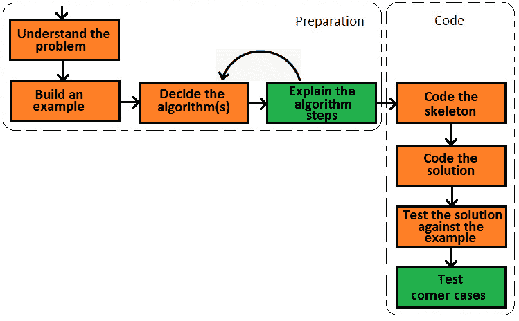

# 五、如何应对编码挑战

本章涵盖了*技术测验*和*编码挑战*，这是技术面试中常用的。

编码挑战是面试中最重要的部分。此部分可以由单个会话或多个会话组成。一些公司更喜欢将技术面试分为两部分：第一部分是技术测试，第二部分是一个或多个编码挑战。在本章中，我们将详细讨论这两个主题：

*   技术测验
*   编码挑战

在本章结束时，你应该能够草拟一份自己的技术面试计划。你将知道如何处理面试过程中的关键时刻，面试官希望看到和听到你的什么，以及当你对答案/解决方案一无所知时，如何处理阻碍面试的时刻。

# 技术问答

技术测试可以采用问答形式与技术面试官进行，也可以是现场测试。通常，它包含 20-40 个问题，所需时间不到一小时。

当技术面试官进行此过程时，你必须提供免费答案，时间可能会有所不同（例如，30-45 分钟）。非常重要的是要清晰、简洁，并且始终围绕主题。

通常情况下，当技术面试官进行面试时，这些问题被描述为需要你做出决定或选择的情景。例如，一个问题听起来可能是这样的：*我们需要一种节省空间的算法，能够以相当数量的误报极为迅速地搜索数百万条记录。你给我们推荐什么？最可能的是，预期的答案是类似的，我将考虑 Bloom 过滤器家族 To3 T3 的算法。如果您在以前的项目中遇到过类似的情况，那么您可以这样说：*我们在一个关于流数据的项目中有相同的场景，我们决定使用 Bloom filter 算法*。*

另一类问题是简单地检查您的技术知识。这些问题不在场景或项目的上下文中；例如，*您能告诉我 Java 中线程的生命周期状态是什么吗？*期望的答案是，*在任何时刻，Java 线程都可能处于以下状态之一：***新建**、**可运行、****运行**、**阻塞**、**睡眠**、**等待**/**定时/等待**、*或***终止**。

通常，回答技术性问题是一种三步方法，如下图所示。首先，你应该理解这个问题。如果您有任何疑问，请要求澄清。其次，你必须知道面试官希望你在回答中找出几个关键词或关键点。这就像一个清单。这意味着您必须知道答案中应该突出显示的关键内容。第三，您只需将关键字/关键点包装在一个逻辑和有意义的答案中：

图 5.1–应对技术测验的过程

从[*第 6 章*](06.html#_idTextAnchor080)*、面向对象编程*开始，您将看到大量的示例。

根据经验，你的答案应该是技术性的，以简洁而全面的方式表达，并自信地与人沟通。害羞的人的一个常见错误是给出一个听起来像问题的答案。他们的语气就像他们在要求确认每一个字。当你的回答听起来像一个问题时，面试官可能会告诉你不要问他就直接给出答案。

重要提示

当你只能部分回答一个问题时，不要急于回答或说你不知道。试着向面试官询问更多细节和/或 20 秒的思考时间。有时，这将帮助您提供一个不完整但体面的答案。例如，面试官可能会问你，*Java*中检查异常和未检查异常的主要区别是什么？如果您不知道差异，那么您可以给出这样的回答，*选中的异常是 Exception 的子类，而未选中的异常是 RuntimeException*的子类。你实际上没有回答这个问题，但这比说，*我不知道*要好！或者，你可以提出这样一个问题，*你指的是我们被迫抓住的例外情况吗？*通过这样做，你可以从面试官那里得到更多细节。注意，不要这样问：*你指的是我们被迫捕获的异常，还是我们不被迫捕获的异常？*您可能会收到简短的回答，例如*是*。这对你没有帮助！另一方面，如果你真的对答案/解决方案一无所知，那么最好说，*我不知道*。这不一定是对你的打击，而试图用太多的口吃来迷惑面试官肯定是对你的打击。

有些公司更喜欢现场选择题测验。在这种情况下，没有人工协助，您必须在固定时间内（例如，30 分钟内）完成测验。尽可能多地回答问题是很重要的。如果你不知道一个问题，那么继续下一个问题。时钟在滴答作响！在结束时（最后 2-3 分钟），你可以回来尝试回答你提出的问题。

然而，有些平台不允许您在问题之间来回导航。在这种情况下，当你不知道一个问题的答案时，你被迫冒着风险去猜测答案。花大量时间回答一个问题会导致最后的分数很低。理想情况下，你应该试着在每个问题上花费相同的时间。例如，如果您有 20 个问题要在 30 分钟内回答，那么您可以为每个问题分配 30/20=1.5 分钟的时间。

进行技术测试（无论是哪种类型的测试）的最佳技巧之一是进行几次*模拟*面试。找一个朋友，让他担任面试官。把问题放在碗里，让他一个接一个地随机选择。回答问题，表现得像在真正的面试官面前一样。

# 编码挑战

编码挑战是任何技术面试的高潮。这是您可以展示所有编码技能的时刻。是时候证明你能胜任这项工作了。拥有工作和干净的代码可以帮助你给人留下深刻的印象。一个好的印象可能会填补你在面试其他阶段留下的空白。

编码挑战是一把双刃剑，可能会从根本上改变面试的最终结果。一个优势可以使你与该计划脱节，而另一个优势可以给你带来一份工作，尽管还有其他缺点。

然而，由于各种原因，这些编码挑战所特有的问题确实很难解决。这些将在下一节中介绍。

## 编码挑战特有的问题意味着困难

你有没有见过一个特定于编码挑战阶段的问题，发现它奇怪、愚蠢，或者毫无意义，与实际问题无关？如果是这样，那么您已经看到了编码挑战阶段特有的一个优秀问题。

为了更好地了解如何为此类问题做好准备，了解其特点和要求非常重要。那么，让我们来看看它们：

*   **它们不是真实世界的问题**：通常，真实世界的问题需要大量时间进行编码，因此它们不是编码挑战的好候选。面试官会要求你解决可以在合理时间内解释和编码的问题，而这些问题通常不是现实世界中的问题。
*   **他们可能非常愚蠢**：经常会看到一些非常愚蠢的问题，看起来它们只是为了让你的生活复杂化而被发明出来的。它们似乎对某些事情或目标没有用处。这是正常的，因为大多数时候，它们不是现实世界中的问题。
*   **它们相当复杂**：即使它们可以很快解决，也不容易！很可能，您会被要求编写一个方法或类，但这并不意味着这很容易。通常，它们需要各种技巧，它们是在开玩笑，和/或利用编程语言不太知名的特性（例如，使用 bits）。
*   **解决方案不明显**：由于这些问题相当复杂，因此这些问题的解决方案不明显。不要期望马上找到解决方案！几乎没有人这样做！这些问题是专门为了解您如何处理无法立即看到解决方案的情况而设计的。这就是为什么你可能有几个小时来解决它（最常见的是，在 1 到 3 个小时之间）。
*   **禁止公共解决路径**：大多数情况下，此类问题都有明确的条款禁止使用公共解决路径。例如，您可能会遇到如下问题：*编写一个方法，在给定位置之间提取字符串的子字符串，而不使用诸如 string#substring（）之类的内置方法。*像这样的例子不胜枚举。只需选择一个或多个可以在相对较短的时间内实现的内置 Java 方法（例如，实用方法）并对其进行公式化；例如，*编写一个不使用内置解决方案（如 Y【T5）】而执行 X 的方法。探索 API 源代码、参与开源项目以及实践这些问题对于解决这些问题非常有用。*
*   **They are meant to place you in an exclusive range of candidates that receive offers**: The difficulty of these coding challenges is calibrated to place you in an exclusive percentage of candidates. Some companies are making offers to less than 5% of candidates. If a certain problem can be easily solved by most candidates, then it will be replaced.

    重要提示

    特定于编码挑战的问题意味着困难，通常按困难的升序提出。很可能，要想通过这些编码挑战，您的经验和编码技能还不够。所以，尽管你知道，但如果你不能马上找到解决方案，不要感到沮丧。许多这样的问题都是为了测试您找到不常见场景解决方案的能力和测试您的编码技能。他们可能有荒谬的子句和/或模糊的解决方案，利用编程语言的不寻常特性。它们可能包含愚蠢的需求和/或虚拟案例。只关注如何解决这些问题，并始终按照规则行事。

大多数情况下，面试官只需一次编码挑战课程就足够了。然而，在某些情况下，你必须通过两次甚至三次这样的挑战。关键是要尽可能多地练习。下一节将向您展示如何处理编码挑战问题。

## 解决编码挑战问题

在我们讨论解决编码挑战问题的过程之前，让我们快速为编码挑战设置一个可能的环境。主要有两个坐标定义了这种环境：编码挑战中面试官的在场和纸笔与计算机的对比。

### 面试官在编码挑战中的在场情况

最常见的情况是，在编码挑战期间，面试官（通过电话屏幕或亲自）在场。它们将评估您的最终结果（代码），但它们并不只是因为这个原因而存在。仅仅衡量你的编码能力并不需要他们在场，通常在编程竞赛中遇到。面试编码挑战不是编程竞赛。面试官希望在整个面试过程中见到你，以便分析你的行为和沟通技巧。他们想知道你是否有解决问题的计划，你的行为是有组织的还是混乱的，你是否编写了难看的代码，你是否愿意交流你的行为，或者你是否内向。此外，他们希望帮助和指导你。当然，你需要努力不寻求指导或尽可能少地寻求指导，但对指导的适当反应也是值得赞赏的。然而，不寻求指导并不意味着你不应该与面试官互动。

#### 继续说！

与面试官的互动是一个重要因素。下表说明了互动计划的几个方面：

*   **在编码之前解释你的解决方案**：在开始编码之前，从面试官那里挤出一些有价值的信息是很重要的。向他们描述你想如何解决问题，你想遵循什么步骤，以及你将使用什么。例如，您可以说，*我认为哈希集是正确的选择，因为插入顺序不相关，我们不需要重复的值*。你会得到赞许或一些指导或建议，帮助你获得预期的结果。
*   **解释编码时你在做什么**：编码时，向面试官解释。例如，您可以说，*首先，我将创建 ArrayList*的实例，或者，*在这里，我将文件从本地文件夹加载到内存*。
*   **提出适当的问题**：只要你知道并尊重限制，你可以提出可以节省时间的问题。例如，可以问，*我记不起来了——默认的 MySQL 端口是 3308 还是 3306？*但是，不要夸大这些问题！
*   **提及重要的方面**：如果您知道与问题相关的其他信息，请与面试官分享。这是一个很好的机会来展示您的编程知识、您的想法以及您对这个问题的想法。

如果你遇到一个你已经知道的问题（也许你在练习这些问题时已经解决了），那么不要脱口而出。这不会给面试官留下深刻印象，你可能会遇到另一个编码挑战。最好遵循与处理任何其他问题相同的流程。在我们介绍这个过程之前，让我们再讨论一下面试环境的另一个方面。

### 纸笔与计算机方法

如果编码挑战是通过电话屏幕进行的，那么面试官会要求你在你最喜欢的**集成开发环境**（**IDE**中分享你的屏幕和代码。这样，面试官也可以看到您如何利用 IDE 帮助（例如，他们可以看到您是否使用 IDE 生成 getter 和 setter，或者您是否手工编写它们）。

重要提示

避免在每行代码之后运行应用程序。相反，在每个逻辑代码块之后运行应用程序。进行更正，然后再次运行。利用 IDE 调试工具。

如果你亲自见到面试官，你可能会被要求使用纸张或白板进行编码。这一次，可以使用 Java 甚至伪代码进行编码。由于您的代码无法编译和执行，您必须手动测试它。通过示例并将其传递给您的代码来证明您的代码是有效的，这一点很重要。

重要提示

避免在混沌方法中出现过多的写-删除代码周期。三思而后行！否则，你会让面试官头疼。

现在，让我们看一下旨在提供解决问题的方法论和逻辑方法的一般步骤。

### 处理编码挑战问题的过程

处理编码挑战问题的过程可以在一系列步骤中完成，这些步骤应该按顺序应用。下图显示了这些步骤：

图 5.2–解决编码挑战问题的过程

现在，让我们详细介绍一下这些步骤。在应用这个问题解决过程时，不要忘记交互组件。

#### 理解问题

理解这个问题是非常重要的。不要基于假设或对问题的部分理解开始解决问题。这道题至少读两遍！不要依赖于单一的阅读，因为在大多数情况下，这些问题包含隐藏和模糊的需求或细节，很容易遗漏。

不要犹豫，就这个问题向面试官提问。有些情况下，为了测试您发现潜在问题的能力，故意忘记了细节。

重要提示

只有你理解了这个问题，你才有机会解决它。

接下来，是构建一个示例的时候了。如果您成功地构建了一个示例，那么这是一个明确的信号，表明您已经理解了这个问题。

#### 树立榜样

正如他们所说，*一张图片抵得上千言万语*，但我们可以对一个例子说同样的话。

勾勒出问题并举例说明，将澄清任何遗留的误解。它将使您有机会通过方法学方法（逐步）详细发现问题。一旦你有了一个有效的例子，你应该开始看到整体的解决方案。这对于测试最终代码也很有用。

重要提示

草图和示例有助于巩固您对问题的理解。

现在，是时候考虑整体解决方案并决定要使用的算法了。

#### 决定要使用的算法并对其进行解释

此时，您已经理解了问题，甚至创建了一个示例。现在，是时候形成一个整体解决方案，并将其分为步骤和算法。

这是一个耗时的过程。在这一点上，重要的是应用*沟通您的想法*方法。如果你什么都不说，那么面试官就不知道你是无知还是头脑风暴。例如，你可以说，*我想我可以使用一个列表来存储电子邮件。。。六羟甲基三聚氰胺六甲醚。。。不，这不好，因为列表接受重复项。*当你说话时（即使看起来你是在和自己说话），面试官可以判断你推理的正确性，可以看到你的知识水平，并可以为你提供一些提示。面试官可能会这样回答：*是的，这是一个很好的观点**，但是，不要忘记你需要保持插入顺序*。

大多数情况下，问题需要某种形式的数据（字符串、数字、位、对象等）处理，如排序、排序、过滤、反转、展平、搜索、计算等。有数据的地方也有数据结构（数组、列表、集合、地图、树等等）。诀窍是在您需要的数据操作和数据结构之间找到适当的匹配。通常，适当的匹配意味着：

*   您可以轻松地对数据结构应用某些操作。
*   您可以获得良好的性能（大 O–参见[*第 7 章*](07.html#_idTextAnchor135)*、大 O 算法分析*）。
*   您可以保持所用数据结构之间的协调。这意味着您不需要繁重或复杂的算法，也不需要执行转换来在数据结构之间移动/利用数据。

这些是拼图的大拼图。找到合适的匹配项是工作的一半。另一半是将这些片段组合在一起形成解决方案。换句话说，你需要把逻辑引入等式。

在阅读问题之后，或者在理解问题并在脑海中形成解决方案的大局之后，立即开始编码是非常诱人的。*别这样！*通常，这会导致一连串的失败，让你发脾气。很快，你所有的想法都会被不信任的迷雾所包围，你会开始匆忙地编写代码，即使有荒谬的错误。

重要提示

在开始编写代码之前，请慢慢思考解决方案。

现在，是时候开始编码你的解决方案了，并用你的编码技巧给面试官留下深刻印象。

#### 骨架编码

开始用骨架对解决方案进行编码。更准确地说，定义您的类、方法和接口而无需实现（行为/操作）。在下一步中，您将用代码填充它们。这样，你就向面试官展示了你的编码阶段遵循的是一条清晰的道路。不要太匆忙地跳入代码？此外，尊重编程的基本原则，如**单一责任、开放-封闭、Liskov 替换、接口分离、依赖倒置**（**固态**）和**不要重复自己**（**干式**）。很可能，面试官会注意这些原则。

重要提示

编写解决方案的框架有助于面试官轻松了解你，更好地理解你的推理。

此时，你得到了面试官的注意。现在，是时候让你的骨架复活了。

#### 对解决方案进行编码

现在，是时候对解决方案进行编码了。当你这样做的时候，向面试官解释你写的主要代码行。注意并尊重众所周知的 Java 编码风格（例如，遵循 Google.github.io/styleguide/javaguide.html 上的*Google Java 风格指南*。

重要提示

遵循著名的 Java 编码风格并将您的行为传达给面试官将是最终结果的一大优势。

一旦完成了解决方案的核心实现，就应该提高代码的健壮性。因此，作为最后一点，不要忽略异常处理和验证（例如，验证方法的参数）。另外，确保您已经涵盖了问题的所有需求，并且使用了正确的数据类型。最后，是时候祈祷代码通过测试步骤了。

测试解决方案是该过程的最后一步。

#### 测试解决方案

在这个过程的第二步中，您构建了一个示例。现在，是时候向面试官展示您的代码是如何工作的了，方法是将示例传递给面试官。*证明您的代码至少在本例*中有效非常重要。它可能会转到第一个键，或者在修复了一些小错误后成功运行，但最后，它的工作非常重要。

别放松！你赢得了这场战斗，但不是这场战争！通常，面试官会希望看到你的代码也适用于角落案例或特殊案例。通常，此类特殊情况涉及伪值、边界值、不正确的输入、强制异常的操作等。如果您的代码不够健壮，并且这些尝试都失败了，那么面试官会认为这正是您编写生产应用程序的方式。另一方面，如果你的代码行得通，那么面试官会印象深刻。

重要提示

有效的代码应该让面试官脸上带着微笑。至少，你会觉得他们对你更友好、更放松。

如果你给面试官留下了好印象，那么面试官可能会问你一些额外的问题。您应该会被问及代码的性能和替代解决方案。当然，您可以不经询问就提供此类信息。面试官会很高兴看到你可以用多种方式解决问题，并且你了解每个解决方案和决定的利弊。

### 被卡住会让你冻僵

首先，卡住是正常的。不要惊慌！不要灰心！不要放弃！

如果你陷入困境，那么参加面试的其他人也可能陷入困境。主要问题是如何处理这种堵塞，而不是堵塞本身。您必须保持冷静，并尝试执行以下操作：

*   **回到你的例子**：有时候，详述你的例子或者再看一个例子是很有帮助的。有两个例子可以帮助你在头脑中形成一般情况，并理解问题的支柱。
*   **在示例**中隔离问题：每个示例都有一套步骤。确定你遇到的问题，并将其作为一个单独的问题来关注。有时候，把问题从上下文中抽出来可以让你更好地理解它并解决它。
*   **尝试不同的方法**：有时候，解决方法是从不同的角度解决问题。不同的视角可以给你一个新的视角。也许另一种数据结构、Java 的隐藏特性、蛮力方法等都能有所帮助。一个丑陋的解决方案总比没有解决方案好！
*   **嘲笑或推迟问题**：为解决一个步骤而苦苦挣扎很长时间可能会导致你无法按时完成问题的不愉快局面。有时，最好是模仿或推迟给你带来麻烦的步骤，然后继续其他步骤。最终，当您回到这一步时，您可能会对它有一个更清晰的了解，并知道如何编写代码。
*   **寻求指导**：这应该是你的最后手段，但在危机中，你必须采用绝望的解决方案。你可以问这样的问题，*我对这方面感到困惑，因为……*（并解释；尝试证明你的困惑是正确的）。*你能给我一个关于我在这里遗漏了什么的提示吗？*

面试官知道这一步的难度，所以他们不会对你被卡住感到惊讶。他们会欣赏你的毅力、分析能力和冷静，即使你没有找到解决方案。面试官知道你在日常工作中会遇到类似的情况，在这种情况下最重要的是保持冷静，寻找解决方案。

# 总结

在本章中，我们讨论了解决编码挑战问题的过程。除了我们前面列举的步骤——理解问题、构建示例、决定和解释算法、编写框架代码、编写和测试解决方案——还有一个步骤将成为后面章节的目标：实践大量问题！在下一章中，我们将从编程的基本概念开始。