*第 13 章*：

# 树与图

本章涵盖了采访中最棘手的话题之一：树和图。虽然与这两个主题相关的问题很多，但在采访中实际遇到的问题却寥寥无几。因此，对树和图中最常见的问题进行优先级排序是非常重要的。

在本章中，我们将从树和图的简要概述开始。稍后，我们将讨论 IT 巨头（如亚马逊、微软、Adobe 和其他公司）面试中遇到的最常见和最具挑战性的问题。在本章结束时，您将了解如何以高效、全面的方式回答面试问题并解决有关树和图形的编码难题。

本章涵盖以下主题：

*   简言之，树木
*   简而言之，图
*   编码挑战

那么，让我们开始吧！

# 技术要求

本章中的所有代码都可以在 GitHub 的[上找到 https://github.com/PacktPublishing/The-Complete-Coding-Interview-Guide-in-Java/tree/master/Chapter13](https://github.com/PacktPublishing/The-Complete-Coding-Interview-Guide-in-Java/tree/master/Chapter13) 。

# 简言之，树木

树是一种非线性数据结构，它在节点中分层组织数据，并且不能包含循环。树的特定术语可能略有不同，但通常采用以下概念：

*   **根**是最上面的节点。
*   **边缘**是两个节点之间的链接或连接。
*   **父**是一个节点，它与子节点有一条边。
*   **子**是一个有父节点的节点。
*   **叶**是一个节点，没有子节点。
*   **高度**是叶片最长路径的长度。
*   **深度**是指向其根部的路径的长度。

下图举例说明了在树上使用的这些术语：

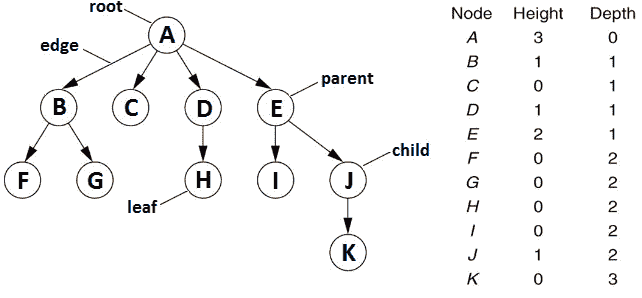

图 13.1–树术语

通常，任何树都可以有根。树的节点可以遵循特定的顺序（或不遵循），可以存储任何类型的数据，并且可以具有指向其父节点的链接。

树编码挑战充斥着不明确的细节和/或不正确的假设。为了消除歧义，与面试官澄清每一个细节是非常重要的。其中一个最重要的方面涉及到树的类型。让我们来看看最常见的树木类型。

## 普通树

粗略地说，我们可以将树分为二叉树和其余允许的树。二叉树是每个节点最多有两个子节点的树。在下图中，左侧图像为非二叉树，而右侧图像为二叉树：


图 13.2–非二叉树与二叉树

在代码方面，二叉树可以按如下方式成形（此实现稍后在*编码挑战*部分中使用，因此请记住）：

```java
private class Node {
  private Node left;
  private Node right;
  private final T element;
  public Node(T element) {
    this.element = element;
    this.left = null;
    this.right = null;
  }
  public Node(Node left, Node right, T element) {
    this.element = element;
    this.left = left;
    this.right = right;
  }
  // operations
}
```

如您所见，每个**节点**保留对另外两个**节点**元素的引用，以及一个通用数据（元素）。左侧和右侧节点代表当前节点的子节点。访谈中遇到的大多数树编码挑战都使用二叉树，因此它们值得特别注意。二叉树可以分类如下。

### 了解二叉树遍历

在参加技术面试之前，你必须知道如何遍历二叉树。通常，遍历二叉树本身并不是问题，但您必须熟悉的**广度优先搜索**（**BFS**）和的**深度优先搜索**（**DFS**算法，以及它们的三种变体：**预排序**，**依次为**和**后序**，下图为各遍历类型的结果：


图 13.3–二叉树遍历

让我们简要介绍一下 BFS 和 DFS 算法。

#### 树的广度优先搜索（BFS）

树的 BFS 也称为水平顺序遍历。其主要思想是维护一个节点队列，以确保遍历顺序。最初，队列仅包含根节点。算法步骤如下：

1.  将队列中的第一个节点作为当前节点弹出。
2.  访问当前节点。
3.  如果当前节点有一个左节点，则将该左节点排队。
4.  如果当前节点有一个右节点，则将该右节点排队。
5.  从*步骤 1*重复，直到队列为空。

在代码方面，我们有以下内容：

```java
private void printLevelOrder(Node node) {
  Queue<Node> queue = new ArrayDeque<>();
  queue.add(node);
  while (!queue.isEmpty()) {
    // Step 1
    Node current = queue.poll();
    // Step 2
    System.out.print(" " + current.element);
    // Step 3
    if (current.left != null) {
      queue.add(current.left);
    }
    // Step 4
    if (current.right != null) {
      queue.add(current.right);
    }
  }
}
```

接下来，让我们关注 DFS。

#### 树的深度优先搜索（DFS）

树的 DFS 有三种变体：**预订单**、**顺序**和**后订单**。

预序遍历在子节点之前访问当前节点，如下**（根|左子树|右子树）**：

```java
private void printPreOrder(Node node) {
  if (node != null) {
    System.out.print(" " + node.element);
    printPreOrder(node.left);
    printPreOrder(node.right);
  }
}
```

按顺序遍历访问左分支，然后访问当前节点，最后访问右分支，如下**（左子树|根|右子树）**：

```java
private void printInOrder(Node node) {
  if (node != null) {
    printInOrder(node.left);
    System.out.print(" " + node.element);
    printInOrder(node.right);
  }
}
```

Post Order 在其子节点之后访问当前节点，如下图**（左子树|右子树|根）**：

```java
private void printPostOrder(Node node) {
  if (node != null) {
    printPostOrder(node.left);
    printPostOrder(node.right);
    System.out.print(" " + node.element);
  }
}
```

完整的应用程序是称为*二进制树四层结构*。除了前面的示例之外，完整的代码还包含返回**列表**和**迭代器**的 BFS 和 DFS 实现。

## 二叉搜索树

**二叉搜索树**（**BST**是遵循排序规则的二叉树。通常，在 BST 中，左侧子体（根左侧的所有元素）小于或等于根元素，右侧子体（根右侧的所有元素）大于根元素。但是，这个顺序并不适用于根元素。它适用于每个节点*n*，因此，在 BST 中，*n*的左后代≤ *n*<*对**n*的后代。在下图中，左侧的图像是二叉树，而右侧的图像是 BST：


图 13.4–二叉树与 BST

通常，BST 不接受副本，但当它接受副本时，副本可以在一侧（例如，仅在左侧）或两侧。副本也可以存储在单独的哈希映射中，或者通过计数器直接存储在树的结构中。注意并与面试官澄清这些细节。在亚马逊、Flipkart 和微软的采访中，在 BST 中处理重复数据是一个问题，这就是为什么在*编码挑战*部分中要解决这个问题。

在本书附带的代码中，您可以找到一个名为*BinarySearchTreeTraversal*的应用程序，公开了以下一组方法：**插入（T 元素）**、**包含（T 元素）**、**删除（T 元素）**、**最小（）**、**最大（）**，**root（）**、**size（）**和**height（）**。此外，它还包含一个 BFS 和 DFS 的实现，用于打印节点以及作为**列表**或**迭代器**返回节点。慢慢来，仔细分析代码。

## 平衡和非平衡二叉树

当一个二叉树保证插入和查找操作的次数为 O（logn）时，我们可以说我们有一个*平衡的*二叉树，但它不一定是平衡的。当树中任意节点的左、右子树高度差不大于 1 时，则树为*高度平衡*。下图中，左侧树为非平衡二叉树，中间树为平衡二叉树但不平衡高度，右侧树为平衡高度树：


图 13.5-不平衡二叉树与平衡二叉树与高度平衡二叉树

有两种类型的平衡树：红黑树和 AVL 树。

### 红黑树

红黑树是一个自平衡 BST，其中每个节点都受到以下规则的影响：

*   每个节点不是红色就是黑色
*   根节点始终为黑色
*   每片叶子（空）都是黑色的
*   红色节点的两个子节点都是黑色的
*   从一个节点到一个空节点的每个路径都有相同数量的黑色节点

下图表示一棵红黑树：


图 13.6–红黑树示例

红黑相间的树永远不会失去平衡。如果所有节点均为黑色，则该树将成为一棵*完全平衡树*。当红黑树最长路径中的节点为黑色和红色交替节点时，红黑树将成为其最大高度。黑红树的高度始终小于或等于 2log2（n+1），因此其高度始终为 O（logn）。

由于它们的复杂性和实施时间，涉及红黑树的问题在采访中并不常见。但是，当它们发生时，问题可能会要求您实现插入、删除或查找操作。在本书附带的代码中，您可以找到一个红黑树实现，它显示了这些操作的工作原理。花点时间研究代码，熟悉红黑树的概念。该应用程序名为*RedBlackTreeImpl*。

您可能想查看更多的实现，请访问[github.com/williamfiset/data-structures/blob/master/com/williamfiset/datastructures/balancedtree/RedBlackTree.java](http://github.com/williamfiset/data-structures/blob/master/com/williamfiset/datastructures/balancedtree/RedBlackTree.java)和[algs4.cs.princeton.edu/33balanced/redblackst.java.html](http://algs4.cs.princeton.edu/33balanced/RedBlackBST.java.html)。对于一个图形化的可视化，请考虑 ORT T4，www. cas.ufc.EdU/~ Gale/Visual/RealBr.HTML。

如果您需要深入研究这个主题，我强烈建议您阅读一本专门介绍数据结构的书，因为这是一个非常广泛的主题。

### 平衡二叉树

一棵**AVL**树（以其发明者**A**delson-**V**elsky 和**L**andis 命名）是一种自平衡 BST，它遵守以下规则：

*   子树的高度最多相差 1。
*   一个节点（*n*的平衡因子（*BN*为-1、0 或 1，定义为高度（*h*差：*BN=h*（*右子树*（*n*）*-h*（*左子树*（*n*）*）或*BN=h*（*左 _ 子树*（*n*））*-h*（*右 _ 子树（n*）。*

 *下图表示 AVL 树：

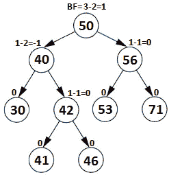

图 13.7–AVL 树示例

AVL 树允许所有操作（插入、删除、查找最小值、查找最大值等）在 O（日志 n）中执行，其中*n*是节点数。

由于 AVL 树的复杂性和实现时间，涉及 AVL 树的问题在访谈中并不常见。但是，当它们发生时，问题可能会要求您实现插入、删除或查找操作。在本书附带的代码中，您可以找到一个 AVL 树实现，它显示了这些工作中的操作。花点时间学习代码，熟悉 AVL 树的概念。应用程序被称为*AVLTREimpl*。

您可能想查看更多的实现，请访问[github.com/williamfiset/data-structures/blob/master/com/williamfiset/datastructures/balancedtree/AVLTreeRecursiveOptimized.java](http://github.com/williamfiset/data-structures/blob/master/com/williamfiset/datastructures/balancedtree/AVLTreeRecursiveOptimized.java)和[algs4.cs.princeton.edu/code/edu/princeton/cs/algs4/AVLTreeST.java.html](http://algs4.cs.princeton.edu/code/edu/princeton/cs/algs4/AVLTreeST.java.html)。对于一个图形化的可视化，请考虑 ORT T4。www. cas.ufca. EdU/~ Gale/Visual/avl Tr.HTML。

如果您需要深入研究这个主题，我强烈建议您阅读一本专门介绍数据结构的书，因为这是一个非常广泛的主题。

## 完全二叉树

一个完整的二叉树是一个二叉树，其中每一级，可能除了最后一级，都是完全填充的。此外，所有节点都尽可能地位于左侧。在下图中，左侧显示非完整二叉树，而右侧显示完整二叉树：


图 13.8–非完整二叉树与完整二叉树

完整的二叉树必须从左到右填充，因此上图中显示的左侧树不完整。具有*n*个节点的完整二叉树总是具有 O（logn）高度。

## 全二叉树

完整二叉树是一种二叉树，其中每个节点都有两个子节点或没有子节点。换句话说，一个节点不能只有一个子节点。在下图中，左侧显示非完整二叉树，而右侧显示完整二叉树：


图 13.9–非完整二叉树与完整二叉树

上图中的左侧树未满，因为节点 68 有一个子节点。

## 完美二叉树

一个完美的二叉树是同时完整的。下图显示了一个这样的树：


图 13.10–完美二叉树

因此，在一个完美的二叉树中，所有的叶节点都在同一个层次上。这意味着最后一级包含最大数量的节点。这种树在采访中非常罕见。

重要提示

注意这样的问题：考虑到你已经得到了一棵二叉树。写一段代码，让。。。不要对给定的二叉树做任何假设！经常向面试官询问更多细节，例如*这是一棵平衡树吗？它是一个完整的二叉树吗？它是一个 BST 吗？*。换句话说，不要将你的解决方案建立在对给定的二叉树可能不正确的假设上。

现在，让我们更详细地讨论二进制堆。

## 二进制堆

简言之，二进制堆是一个完整的二叉树，具有*堆属性*。当元素按升序排列时（heap 属性表示每个节点的元素大于或等于其父节点的元素），我们有一个最小二进制堆（最小元素是根元素），而当元素按降序排列时（heap 属性表示每个节点的元素小于或等于其父节点的元素），我们有一个最大二进制堆（最大元素是根元素）。

下图显示了完整的二叉树（左侧）、最小二进制堆（中间）和最大二进制堆（右侧）：


图 13.11–完整的二叉树以及最小和最大堆

二进制堆未排序。它是部分订购的。任何给定级别上的节点之间都没有关系。

二进制堆通常表示为一个数组（让我们将其表示为*堆*，其根位于*堆*[0]。更重要的是，对于*堆**i*，我们有以下内容：

*   *堆*[（*i*-1）/2]：返回父节点
*   *heap*[（2**i*）+1]：返回左侧子节点
*   *heap*[（2**i*）+2]：返回正确的子节点

通过数组实现的最大二进制堆如下所示：

```java
public class MaxHeap<T extends Comparable<T>> {
  private static final int DEFAULT_CAPACITY = 5;
  private int capacity;
  private int size;
  private T[] heap;
  public MaxHeap() {
    capacity = DEFAULT_CAPACITY;
    this.heap = (T[]) Array.newInstance(
      Comparable[].class.getComponentType(),DEFAULT_CAPACITY);
  }
  // operations
}
```

与堆一起使用的常见操作有**add（）**、**poll（）**和**peek（）**。添加或轮询元素后，我们必须修复堆，使其尊重 heap 属性。此步骤通常被引用为*堆化*堆。

向堆中添加元素是一个 O（logn）时间操作。新元素添加到堆树的末尾。如果新元素比其父元素小，那么我们不需要做任何事情。否则，我们必须向上遍历堆以修复违反的 heap 属性。此操作称为*heapify up*。*heapify up*背后的算法有两个步骤：

1.  从堆的末尾开始作为当前节点。
2.  当当前节点具有父节点且父节点小于当前节点时，交换这些节点。

从堆轮询元素也是一种 O（logn）时间操作。在轮询堆的根元素之后，我们必须修复堆，使其尊重 heap 属性。此操作称为*heapify down*。*heapify down*后面的算法有三个步骤：

1.  从堆的根开始作为当前节点。
2.  确定当前节点的子节点之间的最大节点。
3.  如果当前节点小于其最大的子节点，则交换这两个节点并从*步骤 2*重复；否则，就没有别的事可做了，所以停下来。

最后，窥视是一个 O（1）操作，返回堆的根元素。

在本书附带的代码中，您可以找到一个名为*MaxHeap*的应用程序，它公开了以下方法集：**添加（T 元素）**、**peek（）**和**轮询（）**。

重要提示

树的一个特例被称为树。也被称为的*数字树*或*前缀树*Trie 是一种有序树结构，通常用于存储字符串。它的名字来源于 Trie 是一个 re*Trie*val 数据结构。它的性能优于二叉树。Trie 在我的书*Java 编码问题*（[中有详细介绍 https://www.packtpub.com/programming/java-coding-problems](https://www.packtpub.com/programming/java-coding-problems) ），紧挨着其他数据结构，如元组、不相交集、二元索引树（Fenwick 树）和 Bloom 过滤器。

接下来，让我们简要概述一下图。

# 简而言之，图

图是一种数据结构，用于表示可以与边连接的节点集合。例如，一个图可以用来表示社交媒体平台上的成员网络，因此它是表示现实生活中的联系的一个很好的数据结构。树（如前一节所述）是一种特殊类型的图。换句话说，树是一个没有圈的图。在图的术语中，没有圈的图被称为无圈图。

图形的特定术语包括两个主要术语：

*   **顶点**表示信息（例如，成员、狗或值）
*   **边**是两个顶点之间的连接或关系

连接可以是单向的（如二叉树的情况）或双向的。当连接是双向的（例如双向街道）时，该图被称为*无向图*，它具有*无向边*。当连接是单向的（例如单向街道）时，则该图称为*有向图*，并且它具有*有向边*。

图形的边可以承载称为权重的信息（例如，道路长度）。在这种情况下，这些图被称为*加权图*。当一个图有一条边指向同一个顶点时，它被称为*自循环图*。下图提供了每种图形类型的表示形式：


图 13.12–图形类型

与二叉树不同，通过节点链接表示图是不实际的。在计算机中，图形通常通过邻接矩阵或邻接列表来表示。让我们来解决前者；即邻接矩阵。

## 邻接矩阵

邻接矩阵由大小为*n*x*n*的布尔二维数组（或只包含 0 和 1 的整数二维数组）表示，其中*n*是顶点数。如果我们将这个二维数组表示为一个*矩阵，*那么*矩阵**i**j*是真的（或者 1）如果从顶点*i*到顶点*j*有一条边；否则，它为 false（或 0）。下图显示了无向图的邻接矩阵示例：


图 13.13–无向图的邻接矩阵

为了节省空间，还可以使用位矩阵。

在加权图的情况下，邻接矩阵可以存储边的权重，而 0 可以用来表示没有边。

基于邻接矩阵实现一个图可以如下所示（我们所需要的只是顶点列表，因为边被传递给每个必须作为邻接矩阵遍历图的方法）：

```java
public class Graph<T> {
  // the vertices list
  private final List<T> elements;
  public Graph() {
    this.elements = new ArrayList<>();
  }
  // operations
}
```

另一种在计算机中表示图形的方法是邻接表。

## 邻接表

邻接列表是列表的数组，其大小等于图中的顶点数。每个顶点都存储在此数组中，并存储相邻顶点的列表。换句话说，数组的索引*i*处的列表包含索引*i*处数组中存储的顶点的相邻顶点。下图显示了无向图的邻接列表示例：


图 13.14–无向图的邻接列表

基于邻接列表实现一个图可以如下所示（这里，我们使用**映射**来实现邻接列表）：

```java
public class Graph<T> {
  // the adjacency list is represented as a map
  private final Map<T, List<T>> adjacencyList;
  public Graph() {
    this.adjacencyList = new HashMap<>();
  }
  // operations
}
```

接下来，让我们简要介绍图的遍历。

## 图遍历

两种最常见的遍历图形的方法是通过**深度优先搜索**（**DFS**）和**广度优先搜索**（**BFS**）。让我们对每一个都做一个简要介绍。**BFS**主要用于图形。

在图的情况下，我们必须考虑图可能有周期。一个普通的 BFS 实现（正如您在二叉树中看到的）没有考虑循环，因此我们在遍历 BFS 队列时冒着无限循环的风险。可以通过保存访问节点的附加集合来消除此风险。该算法的步骤如下：

1.  将开始节点（当前节点）标记为已访问（将其添加到已访问节点的集合中），并将其添加到 BFS 队列中。
2.  从队列中弹出当前节点。
3.  访问当前节点。
4.  获取当前节点的相邻节点。
5.  Loop the adjacent nodes. For each non-null and unvisited node, do the following:

    A.将其标记为已访问（将其添加到已访问节点的集合中）。

    B 将其添加到队列中。

6.  从*步骤 2*重复，直到队列为空。

### 图的深度优先搜索（DFS）

对于图，我们可以通过递归或迭代实现 DFS 算法。

#### 图的递归 DFS

通过递归实现图的 DFS 算法的步骤如下：

1.  从当前节点（给定节点）开始，将当前节点标记为已访问（将其添加到已访问节点的集合）。
2.  访问当前节点。
3.  通过递归遍历未访问的相邻顶点。

#### 图的 DFS–迭代实现

DFS 算法的迭代实现依赖于**堆栈**。步骤如下：

1.  从当前节点（给定节点）开始，将当前节点推入**栈**。
2.  While **Stack** is not empty, do the following:

    A.从**堆栈中弹出当前节点。**

    B 访问当前节点。

    C 将当前节点标记为已访问（将其添加到已访问节点的集合中）。

    D 将未访问的相邻顶点推入**堆栈**。

在本书附带的代码中，您可以找到一个基于邻接矩阵的图形实现，称为*GraphadJacyMatrixTraversal。*您还可以根据名为*GraphAdjacencyListTraversal 的邻接列表找到一个。*两个应用程序都包含 BFS 和 DFS 实现。

# 编码挑战

既然我们已经对树和图有了一个简要的概述，现在是时候用在这些主题的采访中遇到的 25 个最流行的编码问题来挑战我们自己了。

和往常一样，世界顶级公司通常会遇到各种各样的问题，包括亚马逊、Adobe 和谷歌等 IT 巨头。那么，让我们开始吧！

## 编码挑战 1–两个节点之间的路径

问题 T1：考虑到你已经给出了有向图。编写一段代码，如果两个给定节点之间存在路径（路由），则返回**true**。

我们可以考虑下面图表中所示的有向图：


图 13.15–从 D 到 E 的路径，反之亦然

如果我们考虑节点 T0、D、D、T1、T 和 T2，则可以看出，从 To.t4，D，T5，To 到 T6，T7，有三条路径，而从 T8 到 T9 到 St10，没有一条。因此，如果我们从*D*开始并遍历图（通过 BFS 或 DFS），那么在某一点上，我们必须通过节点*E*，否则*D*和*E*之间将没有路径。因此，这个问题的解决方案包括从一个给定节点开始，遍历图，直到到达第二个给定节点，或者直到不再有有效的移动。例如，我们可以通过 BFS 进行如下操作：

```java
public boolean isPath(T from, T to) {
  Queue<T> queue = new ArrayDeque<>();
  Set<T> visited = new HashSet<>();
  // we start from the 'from' node
  visited.add(from);
  queue.add(from);
  while (!queue.isEmpty()) {
    T element = queue.poll();
    List<T> adjacents = adjacencyList.get(element);
    if (adjacents != null) {
      for (T t : adjacents) {
        if (t != null && !visited.contains(t)) {
          visited.add(t);
          queue.add(t);
          // we reached the destination (the 'to' node)
          if (t.equals(to)) {
            return true;
          }
        }
      }
    }
  }
  return false;
}
```

完整的应用程序被称为*DirectedGraphPath。*

## 编码挑战 2–排序数组到最小 BST

**亚马逊**、**谷歌**

问题 T1：考虑到你已经给出了一个排序（升序）整数数组。编写一段代码，从该数组创建最小 BST。我们将最小 BST 定义为具有最小高度的 BST。

Po.T0.解决方案 T1：将给定的数组考虑为{ 2, 3, 4，6, 7, 8，12, 23, 90 }。可以从此阵列创建的最小 BST 如下所示：

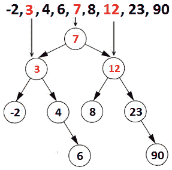

图 13.16–按最小 BST 排序的阵列

为了获得最小高度的 BST，我们必须努力在左、右子树中分配相等数量的节点。记住这句话，请注意，我们可以选择排序数组的中间部分作为根。中间左侧的数组元素比中间的元素小，因此它们可以形成左子树。中间右侧的数组元素大于中间的元素，因此它们可以形成右侧的子树。

因此，我们可以选择 7 作为树的根。接下来，-2、3、4 和 6 应构成左子树，而 8、12、23 和 90 应构成右子树。然而，我们知道我们不能简单地将这些元素添加到左或右子树中，因为我们必须尊重 BST 属性：在 BST 中，对于每个节点，*n*，n 的*左后代≤ n<n*的右后裔。

然而，我们可以简单地遵循相同的技术。如果我们把- 2, 3, 4 和 6 看作一个数组，则它的中间是 3，如果我们考虑 8, 12, 24，而 90 作为数组，则它的中间是 12。所以，3 是包含-2 的左子树的根，右子树是包含 4 和 6 的子树。类似地，12 是包含 8 的左子树的根，右子树是包含 24 和 90 的子树。

嗯，我认为我们有足够的经验直觉地认为，在我们处理完所有子阵列之前，同样的技术也可以应用。此外，它是相当直观的，这个解决方案可以通过递归实现（如果你不考虑递归的一个你的最高技能，审查 ALE T1）T2 T2 第 8 章 AUTT3。因此，我们可以通过四个步骤恢复我们的算法：

1.  将数组的中间元素插入树中。
2.  将左子数组的元素插入左子树。
3.  将右侧子数组的元素插入右侧子树。
4.  触发递归调用。

以下实现将这些步骤编入代码：

```java
public void minimalBst(T m[]) {       
  root = minimalBst(m, 0, m.length - 1);
}
private Node minimalBst(T m[], int start, int end) {
  if (end < start) {
    return null;
  }
  int middle = (start + end) / 2;
  Node node = new Node(m[middle]);
  nodeCount++;
  node.left = minimalBst(m, start, middle - 1);
  node.right = minimalBst(m, middle + 1, end);
  return node;
}
```

完整的应用程序称为*SorterDarrayTominBinarySearchtree。*

## 编码挑战 3–每个级别的列表

问题是：考虑到一个二叉树，你已经知道了。编写一段代码，为树的每个级别创建一个元素列表（例如，如果树的深度为*d*，那么您将拥有*d*列表）。

我们可以考虑下面图表中所示的二叉树：

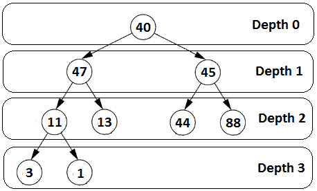

图 13.17–每级列表

我们有一个深度为 3 的二叉树。深度为 0 时，我们有根，40。在深度 1，我们有 47 和 45。在深度 2 上，我们有 11、13、44 和 88。最后，在深度 3 上，我们有 3 和 1。

这样想很直观：如果我们逐级遍历二叉树，那么我们可以为每个级别创建一个元素列表。换句话说，我们可以调整 BFS 算法（也称为级别顺序遍历），以便在每个遍历级别捕获元素。更准确地说，我们从遍历根开始（并创建包含此元素的列表），继续遍历级别 1（并创建包含此级别元素的列表），等等。

当我们到达级别*i*时，我们将已经完全访问了上一级别*i*-1 上的所有节点。这意味着要获得级别*i*上的元素，我们必须遍历上一级别*i*-1 节点的所有子节点。以下解决方案在 O（n）时间内运行：

```java
public List<List<T>> fetchAllLevels() {
  // each list holds a level
  List<List<T>> allLevels = new ArrayList<>();
  // first level (containing only the root)
  Queue<Node> currentLevelOfNodes = new ArrayDeque<>();
  List<T> currentLevelOfElements = new ArrayList<>();
  currentLevelOfNodes.add(root);
  currentLevelOfElements.add(root.element);
  while (!currentLevelOfNodes.isEmpty()) {
    // store the current level as the previous level
    Queue<Node> previousLevelOfNodes = currentLevelOfNodes;
    // add level to the final list
    allLevels.add(currentLevelOfElements);
    // go to the next level as the current level
    currentLevelOfNodes = new ArrayDeque<>();
    currentLevelOfElements = new ArrayList<>();
    // traverse all nodes on current level
    for (Node parent : previousLevelOfNodes) {
      if (parent.left != null) {
        currentLevelOfNodes.add(parent.left);                    
        currentLevelOfElements.add(parent.left.element);
      }
      if (parent.right != null) {
        currentLevelOfNodes.add(parent.right);                      
        currentLevelOfElements.add(parent.right.element);
      }
    }
  }
  return allLevels;
}
```

完整的应用程序称为*ListPerBinaryTreeLevel。*

## 编码挑战 4–子树

**Adobe**、**微软**、**Flipkart**

问题 T1：考虑到你已经得到了两个二叉树，Po.T3，P，T4，和 T5。如果*q*是*p*的子树，则编写一段返回**true**的代码。

解决方案：考虑下面的图表：


图 13.18–另一棵二叉树的二叉树子树

正如我们所看到的，中间的二叉树，即 To0t}q qTyt1，是一个子树，它是一个二叉树（左手边），但不是一个子树，它是一个二叉树（右手边）。

此外，该图显示了两种情况：

*   如果*p*的根与*q*的根匹配（*p.root.element==q.root.element*，那么问题将简化为检查*q*的右子树是否与*p 的右子树相同，*还是*q*的左子树相同与*p*的左子树相同。
*   如果*p*的根与*q*的根不匹配（*p.root.element！=q.root.element*，那么问题将简化为检查*p*的左子树是否与*q、*相同，或者*p*的右子树是否与*q 相同*。

为了实现第一个项目，我们需要两种方法。为了更好地理解为什么我们需要两种方法，请查看下图：


图 13.19–根和叶匹配，但中间节点不匹配

如果*p*和*q*的根匹配，但是左/右子树中的一些节点不匹配，那么我们必须返回到我们从*p*和*q*开始的地方，检查*q*是否是*p*的子树。第一种方法是在树根相同的情况下检查树木是否相同。第二种方法应该处理这样的情况，即我们发现树不是相同的，而是从某个节点开始的。注意这一点，因为许多候选人没有考虑到这一点。

因此，在代码方面，我们有以下内容（对于*n*节点，它在 O（n）时间内运行）：

```java
public boolean isSubtree(BinaryTree q) {
  return isSubtree(root, q.root);
}
private boolean isSubtree(Node p, Node q) {
  if (p == null) {
    return false;
  }
  // if the roots don't match
  if (!match(p, q)) {
    return (isSubtree(p.left, q) || isSubtree(p.right, q));
  }
  return true;
}
private boolean match(Node p, Node q) {
  if (p == null && q == null) {
    return true;
  }
  if (p == null || q == null) {
    return false;
  }
  return (p.element == q.element
      && match(p.left, q.left)
      && match(p.right, q.right));
}
```

该应用程序被称为*二进制树子树**。*

## 编码挑战 5–着陆预定系统

**亚马逊**、**Adobe**、**微软**

问题 T1：考虑 T2 T2 机场单跑道。该机场接收来自不同飞机的着陆请求。着陆请求包含着陆时间（例如，9:56）和完成程序所需的时间（例如，5 分钟）。我们将其表示为 9:56（5）。编写一段代码，使用 BST 设计此预订系统。由于只有一条跑道，代码应拒绝任何与现有跑道重叠的着陆请求。请求的顺序决定了保留的顺序。

我们考虑了着陆时间线的时间截图（着陆请求的顺序是 10:10（3）、10:14（3）、9:55（2）、10:18（1）、9:58（5）、9:47（2）、9:41（2）、10:22（1）、9:50（6）和 10:04（4）。

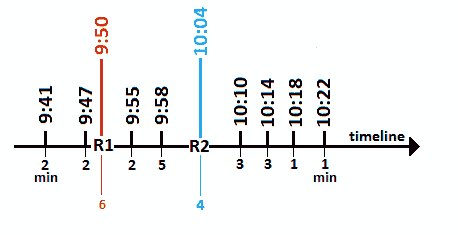

图 13.20–时间轴屏幕截图

因此，我们已经做了几项预定，如下所示：9:41，一架飞机将着陆，需要 2 分钟来完成程序；9 点 47 分和 9 点 55 分，还有两架飞机需要 2 分钟才能完成着陆；9 点 58 分，我们有一架飞机需要 5 分钟才能完成着陆；等等此外，我们还有两个新的着陆请求，在图中表示为*R1*和*R2*。

请注意，我们无法批准*R1*着陆请求。着陆时间是 9:50，需要 6 分钟才能完成，所以 9:56 结束。然而，在 9:56，我们已经有飞机从 9:55 在跑道上。由于我们只有一条跑道，我们拒绝了这个着陆请求。我们认为这种情况是重叠的。

另一方面，我们批准了*R2*着陆请求。请求时间为 10:04，需要 4 分钟才能完成，因此在 10:08 结束。10 点 08 分，跑道上没有其他飞机，因为下一次着陆时间是 10 点 10 分。

请注意，我们必须使用 BST 来解决此问题，但使用数组（排序或未排序）或链表（排序或未排序）也是一种有效的方法。使用未排序的数组（或链表）将需要 O（1）时间来插入登录请求，O（n）时间来检查潜在的重叠。如果我们使用排序数组（或链表）和二进制搜索算法，那么我们可以检查 O（logn）中的潜在重叠。然而，要插入着陆请求，我们需要 O（n），因为我们必须将所有元素从插入位置移到右侧。

使用 BST 怎么样？首先，让我们将前面的时间线截图表示为 BST。查看下图（着陆请求的顺序为 10:10（3）、10:14（3）、9:55（2）、10:18（1）、9:58（5）、9:47（2）、9:41（2）、10:22（1）、*9:50（6）*和 10:04（4））：

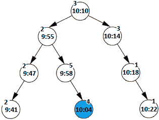

图 13.21–作为 BST 的时间线屏幕截图

这一次，对于每个着陆请求，我们只需扫描树的一半。这是使用 BST 的结果（左侧的所有节点都比右侧的所有节点小，因此着陆请求时间只能在左侧或右侧的子树中）。例如，10:04 的着陆请求小于根（10:10），因此它位于左子树中。如果在任何给定的着陆请求中，我们遇到重叠，那么我们只返回，而不将相应的节点插入树中。我们可以在 O（h）中找到潜在的重叠，其中*h*是 BST 的高度，我们可以在 O（1）时间中插入它。

下面的简单计算给出了一个重叠（我们使用的是 Java 8 日期时间 API，但您也可以将其简化为简单整数–如果您不熟悉 Java 8 日期时间 API，那么我强烈建议您购买我的书，*Java 编码问题*，由 Packt（[出版） https://www.packtpub.com/programming/java-coding-problems](https://www.packtpub.com/programming/java-coding-problems) 。这本书有一个关于这个主题的令人惊讶的章节，这是任何候选人必须阅读的*：*

 *```java
long t1 = Duration.between(current.element.
  plusMinutes(current.time), element).toMinutes();
long t2 = Duration.between(current.element,   
  element.plusMinutes(time)).toMinutes();
if (t1 <= 0 && t2 >= 0) {
    // overlapping found
}
```

因此，在*t1*中，我们计算当前节点完成所需的*落地时间*+*时间与当前请求的*落地时间*之间的时间。在*t2*中，我们计算当前节点*落地时间*与（*当前请求落地时间*+*完成*所需的时间）之间的时间。如果*t1*小于或等于*t2*，则我们发现了重叠，因此我们拒绝当前的着陆请求。让我们看看完整的代码：*

```java
public class BinarySearchTree<Temporal> {
  private Node root = null;
  private class Node {
    private Node left;
    private Node right;
    private final LocalTime element;
    private final int time;
    public Node(LocalTime element, int time) {
      this.time = time;
      this.element = element;
      this.left = null;
      this.right = null;
    }
    public Node(Node left, Node right, 
            LocalTime element, int time) {
      this.time = time;
      this.element = element;
      this.left = left;
      this.right = right;
    }
  }
  public void insert(LocalTime element, int time) {
    if (element == null) {
      throw new IllegalArgumentException("...");
    }
    root = insert(root, element, time);
  }
  private Node insert(Node current, 
          LocalTime element, int time) {
    if (current == null) {
      return new Node(element, time);
    }
    long t1 = Duration.between(current.element.
        plusMinutes(current.time), element).toMinutes();
    long t2 = Duration.between(current.element, 
        element.plusMinutes(time)).toMinutes();
    if (t1 <= 0 && t2 >= 0) {
      System.out.println("Cannot reserve the runway at "
        + element + " for " + time + " minutes !");
      return current;
    }
    if (element.compareTo(current.element) < 0) {
      current.left = insert(current.left, element, time);
    } else {
      current.right = insert(current.right, element, time);
    }
    return current;
  }
  public void printInOrder() {
    printInOrder(root);
  }
  private void printInOrder(Node node) {
    if (node != null) {
      printInOrder(node.left);
      System.out.print(" " + node.element
        + "(" + node.time + ")");
      printInOrder(node.right);
    }
  }
}
```

请注意我们可以使用 BST 的顺序遍历轻松打印时间线。完整的应用程序称为*BinaryTreeLandingReservation。*

## 编码挑战 6–平衡二叉树

**亚马逊**、**微软**

问题 T1：考虑到你已经得到了一个二叉树。如果任何节点的两个子树的高度相差不超过一个（这就是所谓的高度平衡二叉树），我们认为它是平衡的。编写一段代码，如果二叉树是平衡的，则返回**true**。

**解决方案**：因此，为了有一个平衡的二叉树，对于每个节点，两个子树的高度差不能超过一个。与此声明一致，右侧的图像表示平衡二叉树，而左侧的图像表示不平衡二叉树：


图 13.22–不平衡和平衡二叉树

左侧的二叉树是不平衡的，因为节点 40（根）和节点 30 对应的左子树与右子树的高度差大于 1（例如，*左高*（40）=4，而*右高*（40）=2）。

右侧二叉树是平衡的，因为对于每个节点，左侧子树和右侧子树之间的高度差不大于 1。

基于这个例子，我们可以直觉地知道一个简单的解决方案由一个递归算法组成。我们可以遍历每个节点并计算左、右子树的高度。如果这些高度之间的差值大于 1，则返回**false**。就代码而言，这非常简单：

```java
public boolean isBalanced() {
  return isBalanced(root);
}
private boolean isBalanced(Node root) {
  if (root == null) {
    return true;
  }
  if (Math.abs(height(root.left) - height(root.right)) > 1) {
    return false;
  } else {
    return isBalanced(root.left) && isBalanced(root.right);
  }
}
private int height(Node root) {
  if (root == null) {
    return 0;
  }
  return Math.max(height(root.left), height(root.right)) + 1;
}
```

这种方法在 O（nlogn）时间内执行，因为在每个节点上，我们通过其整个子树应用递归。因此，问题在于**height（）**调用的数量。此时，**height（）**方法仅计算高度。但也可以改进以检查树是否平衡。我们所需要做的就是通过一个错误代码向一个不平衡的子树发送信号。另一方面，对于平衡树，我们返回相应的高度。我们可以使用**Integer.MIN_ 值**代替错误代码，如下所示：

```java
public boolean isBalanced() {
  return checkHeight(root) != Integer.MIN_VALUE;
}
private int checkHeight(Node root) {
  if (root == null) {
    return 0;
  }
  int leftHeight = checkHeight(root.left);
  if (leftHeight == Integer.MIN_VALUE) {
    return Integer.MIN_VALUE; // error 
  }
  int rightHeight = checkHeight(root.right);
  if (rightHeight == Integer.MIN_VALUE) {
    return Integer.MIN_VALUE; // error 
  }
  if (Math.abs(leftHeight - rightHeight) > 1) {
    return Integer.MIN_VALUE; // pass error back
  } else {
    return Math.max(leftHeight, rightHeight) + 1;
  }
}
```

此代码在 O（n）时间和 O（h）空间中运行，其中*h*是树的高度。该应用程序称为*二进制树平衡。*

## 编码挑战 7–二叉树是 BST

**亚马逊**、**谷歌**、**Adobe**、**微软**、**Flipkart**

问题 T1：考虑到你已经得到了一个可以包含重复数据的二叉树。如果此树是**二元搜索树**（**BST**，请编写一段代码，返回**true**。

**解决方案**：从一开始，我们就注意到问题明确提到给定的二叉树可能包含重复项。为什么这很重要？因为如果二叉树不允许重复，那么我们可以依靠简单的顺序遍历和数组。如果我们将每个遍历的元素添加到一个数组中，那么只有当二叉树是 BST 时，才会对结果数组进行排序。让我们通过下图来阐明这一方面：

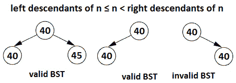

图 13.23–有效和无效的 BST

我们知道，BST 属性表示，对于 BST 的每个节点*n*，*留下 n 的后代≤ n<n*的右后裔。这意味着前一个图中显示的前两个二叉树是有效的 BST，而最后一个二叉树不是有效的 BST。现在，将中间和最后一个二叉树的元素添加到数组中将得到一个[40,40]的数组。这意味着我们无法基于此数组验证或使 BST 无效，因为我们无法区分树。因此，总之，如果给定的二叉树不接受重复项，那么您应该依赖这个简单的算法。

现在，是时候更进一步了。让我们来看看 n 的*左后代≤ 如下二叉树中 n*语句的 n<右后代：

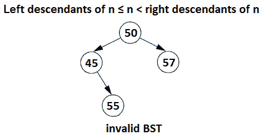

图 13.24–无效的 BST

看看这个！对于每个节点，*n*，我们可以将其写入*n≤ n<n.对*，但很明显 55 放错了地方。因此，让我们强调一下，当前节点的所有左侧节点都应该小于或等于当前节点，而当前节点必须小于所有右侧节点。

换句话说，仅验证当前节点的左侧和右侧节点是不够的。我们必须根据一系列节点验证每个节点。更准确地说，左或右子树的所有节点都应根据最小可接受元素（分别为最大可接受元素）（*min，max*）限定的范围进行验证。让我们考虑下面的树：

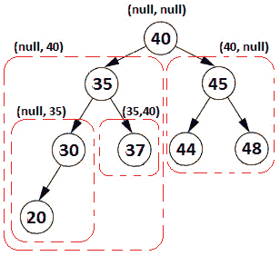

图 13.25–验证 BST

我们从根（40）开始，我们考虑（So.t0，min，T1，Tube＝NULL，Ont2，席 max，T3，Tube＝NULL），所以 40 满足条件，因为没有最小或最大极限。接下来，我们转到左子树（让我们将此子树表示为 40 左子树）。左 40 子树中的所有节点应介于（null，40）之间。接下来，我们再次转到左边，我们遇到 35 个左子树，它的范围应该在（null，35）之间。基本上，我们继续向左走，直到没有节点为止。在这一点上，我们开始向右，因此 35 右的子树应该在（35，40）之间，40 右的子树应该在（40，null）之间，依此类推。所以，当我们向左移动时，最大值会被更新。当我们向右移动时，最小值会被更新。如果出现任何问题，我们将停止并返回**false**。让我们看看基于此算法的代码：

```java
public boolean isBinarySearchTree() {
  return isBinarySearchTree(root, null, null);
}
private boolean isBinarySearchTree(Node node, 
        T minElement, T maxElement) {
  if (node == null) {
    return true;
  }
  if ((minElement != null && 
    node.element.compareTo(minElement) <= 0)
       || (maxElement != null && node.element.
              compareTo(maxElement) > 0)) {
    return false;
  }
  if (!isBinarySearchTree(node.left, minElement, node.element)
          || !isBinarySearchTree(node.right, 
                node.element, maxElement)) {
    return false;
  }
  return true;
}
```

完整的应用程序称为*二进制树 BST。*

## 编码质询 8–后续节点

**谷歌**、**微软**

问题 T1：考虑到你已经得到了一个 T2 的二叉搜索树，即 T4（To.T5，BST，OutT6）和这个树上的一个节点。编写一段代码，在顺序遍历上下文中打印给定节点的后续节点。

**解决方案**：让我们回忆一下二叉树的顺序遍历。此**深度优先搜索**（**DFS**风格）遍历左子树，然后遍历当前节点，然后遍历右子树。现在，假设我们从 BST 中任意选择一个节点（将其表示为*n*），并希望在顺序遍历的上下文中找到其后续节点（将其表示为*s*）。

让我们考虑下面的图表作为给定的 BST，我们可以用它来区分可能的情况：


图 13.26–具有开始和后续节点的 BST 示例

如上图所示，我们将两种主要情况表示为（a）和（b）。在情况（a）中，节点*n*具有正确的子树。在情况（b）中，节点*n*不包含正确的子树。

以左侧 BST 为例的情况（a）表明，如果节点*n*具有右子树，则后续节点*s*是该右子树的最左侧节点。例如，对于*n*=50，后续节点为 54。

案例（b）有两个子案例：简单案例和复杂案例。上图中显示的中间 BST 举例说明了简单的情况。当节点*n*不包含右子树且*n*为其父节点的左子节点时，则后续节点为该父节点。例如，对于*n*=40，后续节点为 50。这是（b）的简单子情况。

上图所示的右侧 BST 举例说明了（b）的复杂子情况。当节点*n*不包含右子树且*n*是其父节点的右子节点时，我们必须向上遍历，直到*n*成为其父节点的左子节点。完成后，我们将返回此父级。例如，如果*n*=59，则后继节点为 60。

此外，我们必须考虑，如果 Tr1 T1 n n Ty2 T2 是遍历中的最后一个节点，那么我们返回根的父节点，它可以是 NULL。

如果我们将这些案例粘在一起形成一些伪代码，那么我们会得到以下结果：

```java
Node inOrderSuccessor(Node n) {
  if (n has a right sub-tree) {
    return the leftmost child of right sub-tree
  } 
  while (n is a right child of n.parent) {
    n = n.parent; // traverse upwards 
  }
  return n.parent; // parent has not been traversed
}
```

现在，我们可以将这个伪代码翻译成代码，如下所示：

```java
public void inOrderSuccessor() {
  // choose the node
  Node node = ...;
  System.out.println("\n\nIn-Order:");
  System.out.print("Start node: " + node.element);
  node = inOrderSuccessor(node);
  System.out.print(" Successor node: " + node.element);
}
private Node inOrderSuccessor(Node node) {
  if (node == null) {
    return null;
  }
  // case (a)
  if (node.right != null) {
    return findLeftmostNode(node.right);
  }
  // case (b)
  while (node.parent != null && node.parent.right == node) {
    node = node.parent;
  }
  return node.parent;
}
```

完整的应用程序称为*BinarySearchTreeSuccessor**。*此应用程序也包含相同的问题，但通过预订单和后订单遍历解决。在检查预排序和后排序上下文的解决方案之前，您应该通过确定可能的情况和绘制伪代码及其实现来挑战自己。

## 编码挑战 9–拓扑排序

**亚马逊**、**谷歌**、**Adobe**、**微软**、**Flipkart**

问题 T1：考虑到你已经得到了一个 T3 的有向非循环图，T4（To.T5，DAG，OT6）。也就是说，一个没有圈的有向图。编写一段代码，返回顶点的线性排序，这样对于每个有向边，*XY*，顶点*X*在排序中位于*Y*之前。换句话说，对于每条边，源节点位于目标节点之前。这也称为拓扑排序，仅适用于 DAG。

**解决方案**：让我们通过以下 DAG 深入探讨这个问题：


图 13.27–有向无环图（DAG）

让我们从顶点 D 开始拓扑排序。在顶点 D 之前，没有其他顶点（没有边），因此我们可以将 D 添加到结果（D）。从 D，我们可以到 B 或 A。让我们到顶点 A。我们不能将 A 添加到结果中，因为我们没有处理边 BA 的顶点 B，所以让我们到顶点 B。在 B 之前，我们只有 D，它被添加到结果中，所以我们可以将 B 添加到结果中，（D，B）。从 B，我们可以到 A，E，C 和 F。我们不能到 C，因为我们没有处理 AC，我们不能到 F，因为我们没有处理 CF。但是，我们可以到 A，因为 DA 和 BA 已经处理，我们可以到 E，因为在 E 之前，只有 B，这是结果。请注意，拓扑排序可能会提供不同的结果。让我们转到 E。因此，E 被添加到结果（D，B，E）中。接下来，我们可以在结果中添加 A，这允许我们添加 C，这允许我们添加 F。因此，结果现在是（D，B，E，A，C，F）。从 F，我们可以到 G。由于 EG 已经被处理，我们可以把 G 加到结果中。最后，从 G 到 H，我们得到拓扑排序结果为（D，B，E，A，C，F，G，H）。

这种遍历只是一种任意的遍历，我们无法将其放入代码中。然而，我们知道图可以通过 BFS 和 DFS 算法进行遍历。如果我们尝试在 DFS 的上下文中思考，那么我们从节点 D 开始，遍历 B、A、C、F、G、H 和 E。在执行 DFS 遍历时，我们不能简单地将顶点添加到结果中，因为我们违反了问题要求（对于每个有向边，*XY*，顶点*X*在*Y*之前）在订单中）。但是，我们可以使用一个**堆栈**，并在遍历所有相邻顶点后将其推入该堆栈。这意味着 H 是第一个被推到堆栈中的顶点，然后是 G、F、C、A、E、B 和 D。现在，从堆栈中弹出，直到它为空，将为我们提供拓扑排序为 D、B、E、A、C、F、G 和 H。

因此，拓扑排序只是一种基于**堆栈**的 DFS 风格，可以实现如下：

```java
public Stack<T> topologicalSort(T startElement) {
  Set<T> visited = new HashSet<>();
  Stack<T> stack = new Stack<>();
  topologicalSort(startElement, visited, stack);
  return stack;
}
private void topologicalSort(T currentElement, 
      Set<T> visited, Stack<T> stack) {
  visited.add(currentElement);
  List<T> adjacents = adjacencyList.get(currentElement);
  if (adjacents != null) {
    for (T t : adjacents) {
      if (t != null && !visited.contains(t)) {
        topologicalSort(t, visited, stack);
        visited.add(t);
      }
    }
  }
  stack.push(currentElement);
}
```

完整的应用程序称为*GraphTopologicalSort。*

## 编码挑战 10–共同祖先

**亚马逊**、**谷歌**、**微软**、**Flipkart**

问题 T1：考虑到你已经得到了一个二叉树。编写一段代码，查找两个给定节点的第一个公共祖先。不能在数据结构中存储其他节点。

**解决方案**：分析此类问题的最佳方法是拿一些纸和笔，用一些样本画一棵二叉树。请注意，问题并不是说这是一个 BST。实际上，它可以是任何有效的二叉树。

在下图中，我们有三种可能的场景：

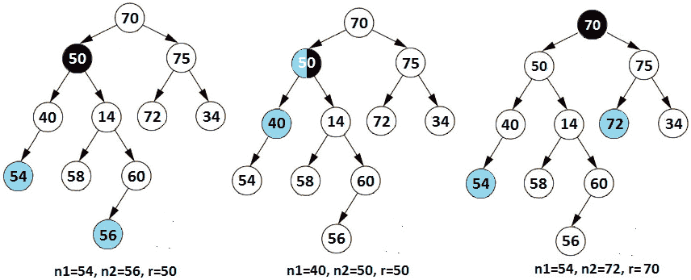

图 13.28–寻找第一个共同祖先

在这里，我们可以看到给定的节点可以位于不同的子树（左树和右树）或同一子树（中间树）中。因此，我们可以使用**公共祖先（Node root，Node n1，Node n2）**类型的方法从根开始遍历树，并返回如下（*n1*和*n2*是两个给定的节点）：

*   如果根的子树包含*n1*（不包含*n2*，则返回*n1*
*   如果根的子树包含*n2*（不包含*n1*，则返回*n2*
*   如果根的子树中既不存在*n1*也不存在*n2*，则返回**null**
*   否则返回*n1*和*n2*的共同祖先。

当**CommonSenator（n.left，n1，n2）**和**CommonSenator（n.right，n1，n2）**返回非空值时，这意味着*n1*和*n2*在不同的子树中，*n*是共同祖先。让我们从代码的角度来看：

```java
public T commonAncestor(T e1, T e2) {
  Node n1 = findNode(e1, root);
  Node n2 = findNode(e2, root);
  if (n1 == null || n2 == null) {
    throw new IllegalArgumentException("Both nodes 
             must be present in the tree");
  }
  return commonAncestor(root, n1, n2).element;
}
private Node commonAncestor(Node root, Node n1, Node n2) {
  if (root == null) {
    return null;
  }
  if (root == n1 && root == n2) {
    return root;
  }
  Node left = commonAncestor(root.left, n1, n2);
  if (left != null && left != n1 && left != n2) {
    return left;
  }
  Node right = commonAncestor(root.right, n1, n2);
  if (right != null && right != n1 && right != n2) {
    return right;
  }
  // n1 and n2 are not in the same sub-tree
  if (left != null && right != null) {
    return root;
  } else if (root == n1 || root == n2) {
    return root;
  } else {
    return left == null ? right : left;
  }
}
```

完整的应用程序被称为*二进制树公共祖先。*

## 编码挑战 11–国际象棋骑士

**亚马逊**、**微软**、**Flipkart**

问题是：你已经得到了一个棋盘和骑士。最初，骑士被放置在一个单元格（起始单元格）中。编写一段代码，计算将骑士从起始单元格移动到给定目标单元格所需的最小移动次数。

让我们考虑一个例子。棋盘大小为 8x8，骑士从单元格（1,8）开始。目标单元格为（8，1）。如下图所示，骑士需要至少移动 6 步才能从牢房（1,8）移动到牢房（8,1）：


图 13.29–将骑士从牢房（1,8）移动到牢房（8,1）

如图所示，骑士可以从一个（*r，c*）单元格移动到其他八个有效单元格，如下所示：（*r*+2*、c*+1）、（*r*+1*、c*+2）、（*r*-1*、c*+2】、（*r*-2*、c+T17】、*）r*-2*、c*-1）、（*r*-1*、c*-2）、（*r*+1*、c*-2）、（*r*+2*、c*-1）。因此，有八种可能的运动。如果我们将这些可能的移动视为方向（边），将细胞视为顶点，那么我们可以在图形的上下文中可视化这个问题。边是可能的移动，而顶点是骑士可能的单元。每次移动都会保持当前单元格到起始单元格的距离。对于每个移动，距离增加 1。因此，在图的上下文中，问题归结为在图中寻找最短路径。因此，我们可以使用 BFS 来解决这个问题。*

该算法的步骤如下：

1.  创建一个空队列。
2.  将起始单元格排队，使其与自身的距离为 0。
3.  As long as the queue is not empty, do the following:

    A.从队列中弹出下一个未访问的单元格。

    B 如果弹出的单元格是目标单元格，则返回其距离。

    C 如果弹出的单元格不是目标单元格，则将此单元格标记为已访问，并通过将距离增加 1 将八种可能的移动中的每种移动排队。

由于我们依赖于 BFS 算法，我们知道最短路径为 1 的所有单元都会首先访问。接下来，访问的小区是最短路径为 1+1=2 的相邻小区，依此类推；因此，其最短路径等于其父代+1 的*最短路径的任何单元。这意味着，当我们第一次遍历目标单元时，它会给出最终结果。这是最短路径。让我们看看代码：*

```java
private int countknightMoves(Node startCell, 
            Node targetCell, int n) {
  // store the visited cells
  Set<Node> visited = new HashSet<>();
  // create a queue and enqueue the start cell
  Queue<Node> queue = new ArrayDeque<>();
  queue.add(startCell);
  while (!queue.isEmpty()) {
    Node cell = queue.poll();
    int r = cell.r;
    int c = cell.c;
    int distance = cell.distance;
    // if destination is reached, return the distance
    if (r == targetCell.r && c == targetCell.c) {
      return distance;
    }
    // the cell was not visited
    if (!visited.contains(cell)) {
      // mark current cell as visited
      visited.add(cell);
      // enqueue each valid movement into the queue 
      for (int i = 0; i < 8; ++i) {
        // get the new valid position of knight from current
        // position on chessboard and enqueue it in the queue 
        // with +1 distance
        int rt = r + ROW[i];
        int ct = c + COL[i];
        if (valid(rt, ct, n)) {
          queue.add(new Node(rt, ct, distance + 1));
        }
      }
    }
  }
  // if path is not possible
  return Integer.MAX_VALUE;
}
// Check if (r, c) is valid    
private static boolean valid(int r, int c, int n) {
  if (r < 0 || c < 0 || r >= n || c >= n) {
    return false;
  }
  return true;
}
```

应用程序被称为*棋子骑士。*

## 编码挑战 12–打印二叉树角点

**亚马逊**、**谷歌**

问题 T1：考虑到你已经得到了一个二叉树。编写一段代码，在每个级别打印此树的各个角。

让我们考虑下面的树：

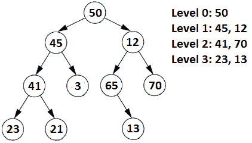

图 13.30–打印二叉树角点

因此，主要思想是在每个级别打印最左边和最右边的节点。这意味着级别顺序遍历（BFS）非常有用，因为我们可以遍历每个级别。我们所要做的就是确定每个级别上的第一个和最后一个节点。为此，我们需要通过添加一个用于确定当前节点是否表示角点的条件来调整经典的级别顺序遍历。《守则》不言自明：

```java
public void printCorners() {
  if (root == null) {
    return;
  }
  Queue<Node> queue = new ArrayDeque<>();
  queue.add(root);
  int level = 0;
  while (!queue.isEmpty()) {
    // get the size of the current level
    int size = queue.size();
    int position = size;
    System.out.print("Level: " + level + ": ");
    level++;
    // process all nodes present in current level
    while (position > 0) {
      Node node = queue.poll();
      position--;
      // if corner node found, print it
      if (position == (size - 1) || position == 0) {
        System.out.print(node.element + " ");
      }
      // enqueue left and right child of current node
      if (node.left != null) {
        queue.add(node.left);
      }
      if (node.right != null) {
        queue.add(node.right);
      }
    }
    // level done            
    System.out.println();
  }
}
```

应用程序被称为*二进制树。*

## 编码挑战 13–最大路径和

**亚马逊**、**谷歌**、**Adobe**、**微软**、**Flipkart**

问题 T1：考虑到你已经给出了一个非空二叉树。编写一段代码，计算最大路径和。路径被视为从树中的任何节点开始到树中的任何节点结束的任何节点序列，以及父子连接。路径必须至少包含一个节点，并且可以穿过树的根，也可以不穿过树的根。

**解决方案**：下图显示了最大路径和的三个示例：


图 13.31–最大路径和的三个示例

找到这个问题的解决方案需要我们确定当前节点可以成为最大路径一部分的方式的数量。通过检查前面的示例，我们可以分离出四种情况，如下图所示（慢慢看，看更多的示例，直到得出相同的结论）：


图 13.32–当前节点成为最大路径一部分的方式数量

因此，作为最大路径一部分的节点被放入以下四种情况之一：

1.  该节点是最大路径中的唯一节点
2.  该节点是其左子节点旁边的最大路径的一部分
3.  该节点是其右子节点旁边的最大路径的一部分
4.  该节点是其左侧和右侧子节点旁边的最大路径的一部分

这四个步骤让我们得出一个明确的结论：我们必须迭代树的所有节点。DFS 算法是一个不错的选择，但更准确地说，是后序树遍历，它将遍历顺序强制为**左子树****右子树****根**。当我们遍历树时，我们将树其余部分的最大值传递给父级。下图显示了此算法：

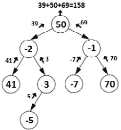

图 13.33–后序遍历和将树中的最大值传递给父级

因此，如果我们将此算法一步一步地应用到前面的图中，我们将得到以下结果（请记住，这是一个后序遍历）：

*   41 没有子项，因此将 41 添加到 max（0，0），41+max（0，0）=41。
*   3 只有左边的子项-5，因此 3 被添加到 max（-5，0），3+max（-5，0）=3。
*   -2 被添加到 max（41,3）子树中，因此-2+max（41,3）=39。
*   -7 没有子项，因此将-7 添加到 max（0，0），-7+max（0，0）=-7。
*   70 没有子对象，因此 70 被添加到 max（0，0），70+max（0，0）=70。
*   -1 被添加到最大（-7,70）子树，因此-1+70=69。
*   50 加到左（39）和右（69）子树的最大值上，因此 39+69+50=158（这是最大路径和）。

以下代码显示了此算法的实现：

```java
public int maxPathSum() {
  maxPathSum(root);
  return max;
}
private int maxPathSum(Node root) {
  if (root == null) {
    return 0;
  }
  // maximum of the left child and 0
  int left = Math.max(0, maxPathSum(root.left));
  // maximum of the right child and 0
  int right = Math.max(0, maxPathSum(root.right));
  // maximum at the current node (all four cases 1,2,3 and 4)
  max = Math.max(max, left + right + root.element);
  //return the maximum from left, right along with current               
  return Math.max(left, right) + root.element;
}
```

应用程序被称为*二进制树 XPathSUM。*

## 编码挑战 14–对角线遍历

**亚马逊**、**Adobe**、**微软**

问题 T1：考虑到你已经得到了一个非空二叉树。编写一段代码，打印每个负对角线（\）的所有节点。负对角线具有负斜率。

**解决方案**：如果您不熟悉二叉树负对角的概念，那么请确保与面试官澄清这一方面。他们可能会为您提供一个类似于下图所示的示例：


图 13.34–二叉树的负对角线

在上图中，我们有三条对角线。第一条对角线包含节点 50、12 和 70。第二条对角线包含节点 45、3、14 和 65。最后，第三对角线包含节点 41 和 11。

### 基于递归的解决方案

这个问题的一个解决方案是使用递归和*哈希*（如果您不熟悉哈希的概念，请阅读[*第 6 章*](06.html#_idTextAnchor080)*、面向对象编程*、*哈希表【T10 问题）。在 Java 中，我们可以通过内置的**HashMap**实现使用哈希，因此不需要从头开始编写哈希实现。但是这个**哈希映射**有什么用处呢？我们应该在这个映射的条目（键值对）中存储什么？*

我们可以将二叉树中的每个对角线与映射中的一个键相关联。由于每个对角线（键）包含多个节点，因此将值表示为**列表**非常方便。当我们遍历二叉树时，我们需要将当前节点添加到适当的**列表**，因此在适当的对角线下。例如，在这里，我们可以执行预顺序遍历。每次我们到左边的子树，我们增加对角线 1，每次到右边的子树，我们保持当前的对角线。通过这种方式，我们得到了类似于以下内容的结果：


图 13.35–左子对象的预顺序遍历和对角线增加 1

以下解的时间复杂度为 O（n logn），辅助空间为 O（n），其中*n*为树中的个节点数：

```java
// print the diagonal elements of given binary tree
public void printDiagonalRecursive() {
  // map of diagonals
  Map<Integer, List<T>> map = new HashMap<>();
  // Pre-Order traversal of the tree and fill up the map
  printDiagonal(root, 0, map);
  // print the current diagonal
  for (int i = 0; i < map.size(); i++) {
    System.out.println(map.get(i));
  }
}
// recursive Pre-Order traversal of the tree 
// and put the diagonal elements in the map
private void printDiagonal(Node node, 
        int diagonal, Map<Integer, List<T>> map) {
  if (node == null) {
    return;
  }
  // insert the current node in the diagonal
  if (!map.containsKey(diagonal)) {
    map.put(diagonal, new ArrayList<>());
  }
  map.get(diagonal).add(node.element);
  // increase the diagonal by 1 and go to the left sub-tree
  printDiagonal(node.left, diagonal + 1, map);
  // maintain the current diagonal and go 
  // to the right sub-tree
  printDiagonal(node.right, diagonal, map);
}
```

现在，让我们看看这个问题的另一个解决方案。

### 基于迭代的解

解决这个问题也可以迭代进行。这一次，我们可以采用水平顺序遍历，并使用**队列**将对角线的节点排队。此解决方案的主要伪代码可以编写如下：

```java
(first diagonal)
Enqueue the root and all its right children 
While the queue is not empty
	Dequeue (let's denote it as A)
	Print A
    (next diagonal)
	If A has a left child then enqueue it 
    (let's denote it as B)
		Continue to enqueue all the right children of B
```

当将此伪代码放入代码中时，我们得到以下结果：

```java
public void printDiagonalIterative() {
  Queue<Node> queue = new ArrayDeque<>();
  // mark the end of a diagonal via dummy null value
  Node dummy = new Node(null);
  // enqueue all the nodes of the first diagonal
  while (root != null) {
    queue.add(root);
    root = root.right;
  }
  // enqueue the dummy node at the end of each diagonal
  queue.add(dummy);
  // loop while there are more nodes than the dummy
  while (queue.size() != 1) {
    Node front = queue.poll();
    if (front != dummy) {
      // print current node
      System.out.print(front.element + " ");
      // enqueue the nodes of the next diagonal 
      Node node = front.left;
      while (node != null) {
        queue.add(node);
        node = node.right;
      }
    } else {
      // at the end of the current diagonal enqueue the dummy                 
      queue.add(dummy);
      System.out.println();
    }
  }
}
```

前面的代码以 O（n）时间运行，辅助空间为 O（n），其中*n*为树中的节点数。完整的应用程序称为*二进制树。*

## 编码挑战 15–在 BST 中处理重复项

**亚马逊**、**微软**、**Flipkart**

问题 T1：考虑到你已经有了一个允许重复的 BST。编写一个在处理重复项时支持插入和删除操作的实现。

**解决方案**：我们知道 BST 的属性声明对于每个节点*n*，我们知道*留下了 n 的后代≤ n<n*的右后裔。通常，涉及 BST 的问题不允许重复，因此无法插入重复项。但是，如果允许重复，那么我们的约定是将重复插入左子树。

但是，面试官可能希望看到一个实现，允许我们将计数与每个节点关联，如下图所示：

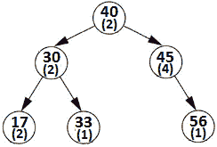

图 13.36–在 BST 中处理重复项

为了提供此实现，我们需要修改经典 BST 的结构，使其支持计数器：

```java
private class Node {
  private T element;
  private int count;
  private Node left;
  private Node right;
  private Node(Node left, Node right, T element) {
    this.element = element;
    this.left = left;
    this.right = right;
    this.count = 1;
  }
}
```

每次我们创建一个新节点（树中不存在的节点）时，计数器将等于 1。

插入节点时，需要区分新节点和重复节点。如果我们插入一个重复的节点，那么我们需要做的就是将该节点的计数器增加 1，而不创建一个新节点。此处列出了插入操作的相关部分：

```java
private Node insert(Node current, T element) {
  if (current == null) {
    return new Node(null, null, element);
  }
  // START: Handle inserting duplicates
  if (element.compareTo(current.element) == 0) {
    current.count++;
    return current;
  }
  // END: Handle inserting duplicates
...
}
```

删除节点遵循类似的逻辑。如果我们删除一个重复的节点，那么我们只需将其计数器减少一个。如果计数器已经等于 1，那么我们只删除节点。有关守则如下：

```java
private Node delete(Node node, T element) {
  if (node == null) {
    return null;
  }
  if (element.compareTo(node.element) < 0) {
    node.left = delete(node.left, element);
  } else if (element.compareTo(node.element) > 0) {
    node.right = delete(node.right, element);
  }
  if (element.compareTo(node.element) == 0) {
    // START: Handle deleting duplicates
    if (node.count > 1) {
      node.count--;
      return node;
    }
    // END: Handle deleting duplicates
    ...
}
```

完整的应用程序被称为*BinarySearchTreeDuplicates。*这个问题的另一个解决方案是使用哈希表来记录节点数。这样，就不会修改树结构。挑战自己并完成此实现。

## 编码挑战 16–二叉树的同构

**亚马逊**、**谷歌**、**微软**

问题 T1：考虑到你已经给出了两个二叉树。编写一段代码，确定这两个二叉树是否彼此同构。

**解决方案**：如果您不熟悉*同构*一词，那么您必须向面试官澄清。这个术语在数学中有很好的定义，但面试官可能不会给出数学解释/演示，而且，正如你所知，数学家有自己的语言，很难被认为是流利易懂的英语。此外，在数学中，同构的概念指的是任何两种结构，而不仅仅是二叉树。因此，面试官可能会给你一个解释，如下所示（让我们将树木表示为*T1*和*T2*：

**定义 1**：*如果可以通过多次交换子项将 T1 更改为 T2，则 T1 和 T2 是同构的。T1 和 T2 根本不必是相同的物理形状。*

**定义 2**：*T1 和 T2 是同构的，如果您可以在不丢失信息的情况下将 T1 翻译成 T2，将 T2 翻译成 T1。*

**定义 3**：*想想两个字符串，AAB 和 XXY。如果 A 转换成 X，B 转换成 Y，那么 AAB 变成 XXY，所以这两个字符串是同构的。所以，如果 T2 是 T1 的结构镜像，那么两个二叉树是同构的。*

不管你从面试官那里得到什么样的定义，我很肯定他们都会给你举个例子。下图显示了一组同构二叉树的示例：

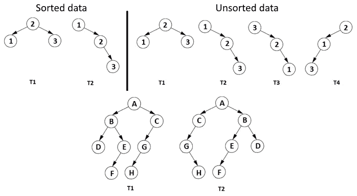

图 13.37–同构二叉树示例

根据前面的定义和示例，我们可以形成以下算法来确定两个二叉树是否同构：

1.  如果*T1*和*T2*为**null**，则同构，因此返回**true。**
2.  如果*T1*或*T2*为**null**，则它们不是同构的，因此返回**false。**
3.  如果*T1.data*不等于*T2.data，*则它们不是同构的，因此返回**false。**
4.  遍历*T1*的左子树和*T2*的左子树。
5.  Traverse the right sub-tree of *T1* and the right sub-tree of *T2*:

    A.如果*T1*和*T2*的结构相同，则返回**true。**

    B 如果*T1*和*T2*的结构不相同，则检查一棵树（或子树）是否镜像另一棵树（子树），

6.  遍历*T1*的左子树和*T2 的右子树。*
7.  Traverse the right sub-tree of *T1* and the left sub-tree of *T2*:

    A.如果结构被镜像，则返回**true**；否则返回**false。**

将此算法放入代码中，结果如下：

```java
private boolean isIsomorphic(Node treeOne, Node treeTwo) {
  // step 1
  if (treeOne == null && treeTwo == null) {
    return true;
  }
  // step 2
  if ((treeOne == null || treeTwo == null)) {
    return false;
  }
  // step 3
  if (!treeOne.element.equals(treeTwo.element)) {
    return false;
  }
  // steps 4, 5, 6 and 7
  return (isIsomorphic(treeOne.left, treeTwo.right)
    && isIsomorphic(treeOne.right, treeTwo.left)
    || isIsomorphic(treeOne.left, treeTwo.left)
    && isIsomorphic(treeOne.right, treeTwo.right));
}
.
```

完整的应用程序被称为*TwoBinaryTreesAreIsomorphic。*

## 编码挑战 17–二叉树右视图

**亚马逊**、**谷歌**、**Adobe**、**微软**、**Flipkart**

问题 T1：考虑到你已经得到了一个二叉树。编写一段代码，打印此树的右视图。打印*右视图*意味着打印从二叉树右侧查看时可以看到的所有节点。

**解决方案**：如果你不确定二叉树的正确视图是什么，那么请与面试官澄清。例如，下图突出显示了表示二叉树右视图的节点：

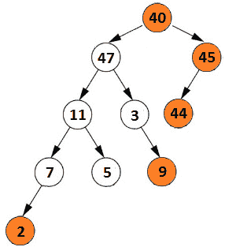

图 13.38–二叉树的右视图

因此，如果放置在该树的右侧，将只看到节点 40、45、44、9 和 2。如果我们考虑级别顺序遍历（BFS），我们将获得以下输出：

*   **40**、47、**45**、11、3、**44**、7、5、**9**、**2**

高亮显示的节点是表示右侧视图的节点。但是，这些节点中的每一个都表示树中每个级别上最右边的节点。这意味着我们可以调整 BFS 算法并打印每个级别的最后一个节点。

这是一个具有辅助 O（n）空间（由队列表示）的 O（n）复杂度时间算法，其中*n*是树中的节点数：

```java
private void printRightViewIterative(Node root) {
  if (root == null) {
    return;
  }
  // enqueue root node
  Queue<Node> queue = new ArrayDeque<>();
  queue.add(root);
  Node currentNode;
  while (!queue.isEmpty()) {
    // number of nodes in the current level is the queue size
    int size = queue.size();
    int i = 0;
    // traverse each node of the current level and enqueue its
    // non-empty left and right child
    while (i < size) {
      i++;
      currentNode = queue.poll();
      // if this is last node of current level just print it
      if (i == size) {
        System.out.print(currentNode.element + " ");
      }
      if (currentNode.left != null) {
        queue.add(currentNode.left);
      }
      if (currentNode.right != null) {
        queue.add(currentNode.right);
      }
    }
  }
}
```

在这里，我们也可以实现递归解决方案。

这是一个 O（n）复杂度时间算法，带有一个辅助 O（n）空间（由映射表示），其中*n*是树中的节点数。您可以在*BinaryTreeRightView*应用程序中与本书捆绑的代码中找到递归方法。挑战自己，实现二叉树的左视图。

## 编码挑战 18–第 k 个最大元素

**谷歌**、**Flipkart**

问题 T1：考虑到你已经给出了一个 BST.写的代码片段，它打印了不改变 BST 的第 3 个最大元素。

让我们考虑下面的 BST：

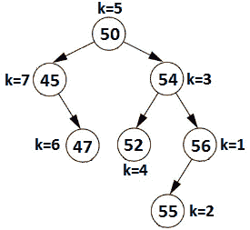

图 13.39–BST 中第 k 个最大元素

对于*k*=1，我们可以看到 56 是第一大元素。对于*k*=2，我们可以看到 55 是第二大元素，依此类推。

蛮力解决方案非常简单，将在 O（n）时间内运行，其中*n*是树中的节点数。我们所要做的就是提取一个数组，并将其按树的顺序遍历**（左子树【右子树】【根】）**：45、47、50、52、54、55、56。完成后，我们可以找到第*k*个元素作为*数组*[*n-k*。例如，对于*k*=3，第三个元素是*数组*[7-3]=*数组*[4]=54。如果愿意，您可以挑战自己并提供此实现。

然而，另一种在 O（k+h）复杂度时间内运行的方法，其中*h*是 BST 的高度，可以基于逆序遍历**（右子树|左子树|根）**来编写，它按降序给出元素：56、55、54、52、50、47、45。

代码本身就说明了问题（**c**变量统计访问的节点数）：

```java
public void kthLargest(int k) {
  kthLargest(root, k);
}
private int c;
private void kthLargest(Node root, int k) {
  if (root == null || c >= k) {
    return;
  }
  kthLargest(root.right, k);
  c++;
  // we found the kth largest value
  if (c == k) {
    System.out.println(root.element);
  }
  kthLargest(root.left, k);
}
```

完整的应用程序称为*BinarySearchTreeKthLargestElement。*

## 编码挑战 19–镜像二叉树

**亚马逊**、**谷歌**、**Adobe**、**微软**

问题是：考虑到一个二叉树，你已经知道了。编写一段代码来构造此树的镜像。

**解决方案**：镜像树的外观如下（右侧的树是左侧树的镜像版本）：


图 13.40–给定树和镜像树

因此，镜像树就像给定树的水平翻转。要创建树的镜像，我们必须决定是将镜像树作为新树返回，还是将给定树镜像到位。

### 在新树中镜像给定树

将镜像作为新树返回可以通过以下步骤的递归算法完成：


图 13.41-递归算法

在代码方面，我们有以下内容：

```java
private Node mirrorTreeInTree(Node root) {
  if (root == null) {
    return null;
  }
  Node node = new Node(root.element);
  node.left = mirrorTreeInTree(root.right);
  node.right = mirrorTreeInTree(root.left);
  return node;
}
```

现在，让我们试着在适当的位置镜像给定的树。

### 在适当位置镜像给定的树

也可以通过递归在适当的位置镜像给定的树。这一次，算法遵循以下步骤：

1.  镜像给定树的左子树。
2.  镜像给定树的右子树。
3.  交换左右两个子树（交换它们的指针）。

在代码方面，我们有以下内容：

```java
private void mirrorTreeInPlace(Node node) {
  if (node == null) {
    return;
  }
  Node auxNode;
  mirrorTreeInPlace(node.left);
  mirrorTreeInPlace(node.right);
  auxNode = node.left;
  node.left = node.right;
  node.right = auxNode;
}
```

完整的应用程序称为*MirrorBinaryTree。*

## 编码挑战 20–二叉树的螺旋级顺序遍历

**亚马逊**、**谷歌**、**微软**

问题 T1：考虑到你已经得到了一个二叉树。编写一段代码，打印此二叉树的螺旋级遍历。更准确地说，应该从左到右打印级别 1 上的所有节点，然后从右到左打印级别 2 上的所有节点，然后从左到右打印级别 3 上的所有节点，依此类推。所以，奇数级别应该从左到右打印，偶数级别应该从右到左打印。

**解决方案**：螺旋式水平穿越可采用两种方式表述，如下所示：

*   奇数级别应从左到右打印，偶数级别从右到左打印。
*   奇数级别应从右向左打印，偶数级别从左向右打印。

下图显示了这些语句：


图 13.42–螺旋顺序遍历

因此，在左侧上，我们得到 50、12、45、12、3、65、70、24 和 41。另一方面，在右边，我们得到 50，45，12，70，65，3，12，41 和 24。

### 递归方法

让我们试着从上图左侧实现螺旋顺序遍历。请注意，奇数级别应按从左到右的顺序打印，而偶数级别应按相反顺序打印。基本上，我们需要通过翻转偶数层的方向来调整众所周知的层顺序遍历。这意味着我们可以使用布尔变量来改变打印顺序。因此，如果布尔变量为**true**（或 1），则从左到右打印当前级别；否则，我们将从右向左打印它。在每个迭代（级别）中，我们翻转布尔值。

通过递归应用此功能可按如下方式进行：

```java
public void spiralOrderTraversalRecursive() {
  if (root == null) {
    return;
  }
  int level = 1;
  boolean flip = false;
  // as long as printLevel() returns true there 
  // are more levels to print
  while (printLevel(root, level++, flip = !flip)) {
    // there is nothing to do
  };
}
// print all nodes of a given level 
private boolean printLevel(Node root, 
      int level, boolean flip) {
  if (root == null) {
    return false;
  }
  if (level == 1) {
    System.out.print(root.element + " ");
    return true;
  }
  if (flip) {
    // process left child before right child
    boolean left = printLevel(root.left, level - 1, flip);
    boolean right = printLevel(root.right, level - 1, flip);
    return left || right;
  } else {
    // process right child before left child
    boolean right = printLevel(root.right, level - 1, flip);
    boolean left = printLevel(root.left, level - 1, flip);
    return right || left;
  }
}
```

此代码以 O（n2）时间运行，这是非常低效的。我们能更有效地做到这一点吗？是的–我们可以通过迭代方法在 O（n）时间内用额外的空间 O（n）完成。

### 迭代法

让我们尝试从给定图表的右侧执行螺旋顺序遍历。这次我们将通过迭代的方法来实现这一点。我们主要可以使用两个堆栈（**堆栈**）或一个双端队列（**Deque**）。让我们学习如何通过两个堆栈来实现这一点。

使用两个堆栈的主要思想非常简单：我们使用一个堆栈打印从左到右的节点，另一个堆栈打印从右到左的节点。在每个迭代（或级别）中，我们在其中一个堆栈中有相应的节点。当我们从堆栈打印节点时，我们将下一级别的节点推送到另一个堆栈中。

以下代码将这些语句转换为代码形式：

```java
private void printSpiralTwoStacks(Node node) {
  if (node == null) {
    return;
  }
  // create two stacks to store alternate levels         
  Stack<Node> rl = new Stack<>(); // right to left         
  Stack<Node> lr = new Stack<>(); // left to right 
  // Push first level to first stack 'rl' 
  rl.push(node);
  // print while any of the stacks has nodes 
  while (!rl.empty() || !lr.empty()) {
    // print nodes of the current level from 'rl' 
    // and push nodes of next level to 'lr'
    while (!rl.empty()) {
      Node temp = rl.peek();
      rl.pop();
      System.out.print(temp.element + " ");
      if (temp.right != null) {
        lr.push(temp.right);
      }
      if (temp.left != null) {
        lr.push(temp.left);
      }
    }
    // print nodes of the current level from 'lr' 
    // and push nodes of next level to 'rl'
    while (!lr.empty()) {
      Node temp = lr.peek();
      lr.pop();
      System.out.print(temp.element + " ");
      if (temp.left != null) {
        rl.push(temp.left);
      }
      if (temp.right != null) {
        rl.push(temp.right);
      }
    }
  }
}
```

完整的应用程序称为*BinaryTreeSpiralTraversal。*在此应用程序中，您还可以找到基于**Deque**的实现。

## 编码挑战 21–距离叶子 k 处的节点

**亚马逊**、**谷歌**、**微软**、**Flipkart**

问题 T1：考虑到你已经得到了一个整数的二叉树和一个整数。编写一段代码，打印距离叶节点*k*的所有节点。

**解决方案**：我们可以凭直觉推断，距离叶子*k*的距离意味着叶子上方的*k*水平。但为了澄清任何疑问，让我们遵循经典方法，并尝试可视化一个示例。下图表示二叉树；高亮显示的节点（40、47 和 11）表示距离叶节点*k*=2 的节点：


图 13.43–距离叶节点 k=2 的节点

从上图中，我们可以得出以下观察结果：

*   节点 40 与叶 44 的距离为 2。
*   节点 47 与叶 9 和叶 5 的距离为 2。
*   节点 11 与叶 2 的距离为 2。

如果我们查看每个级别，则可以看到以下内容：

*   距离叶节点 1 的节点为 3、11、7 和 45。
*   距离叶节点 2 的节点分别为 11、47 和 40。
*   距离叶节点 3 处的节点分别为 40 和 47。
*   距离叶节点 4 处的节点为 40。

因此，根节点是离叶子的最大距离，*k*大于层数没有意义；就是 1。如果我们从根开始沿着树往下走，直到找到一片叶子，那么得到的路径应该包含一个节点，该节点与该叶子的距离为*k*。

例如，可能的路径是 40（根）、47、11、7 和 2（叶）。如果*k*=2，则节点 11 与叶片的距离为 2。另一个可能的路径是 40（根）、47、11 和 5（叶）。如果*k*=2，则节点 47 与叶片的距离为 2。另一条路径是 40（根）、47、3 和 9（叶）。如果*k*=2，则节点 47 与叶片的距离为 2。我们已经找到了这个节点；因此，我们现在必须注意并消除重复。

到目前为止列出的路径表明有树**（根【左子树】【右子树】**的预序遍历。在遍历过程中，我们必须跟踪当前路径。换句话说，构建的路径由预序遍历中当前节点的祖先组成。当我们找到一个叶节点时，我们必须打印出与该叶*k*距离的祖先。

为了消除重复，我们可以使用一个**集合**（我们将其表示为**节点列表**，如下代码所示：

```java
private void leafDistance(Node node, 
    List<Node> pathToLeaf, Set<Node> nodesAtDist, int dist) {
  if (node == null) {
    return;
  }
  // for each leaf node, store the node at distance 'dist'
  if (isLeaf(node) && pathToLeaf.size() >= dist) {
    nodesAtDist.add(pathToLeaf.get(pathToLeaf.size() - dist));
    return;
  }
  // add the current node into the current path        
  pathToLeaf.add(node);
  // go  to left and right subtree via recursion
  leafDistance(node.left, pathToLeaf, nodesAtDist, dist);
  leafDistance(node.right, pathToLeaf, nodesAtDist, dist);
  // remove the current node from the current path       
  pathToLeaf.remove(node);
}
private boolean isLeaf(Node node) {
  return (node.left == null && node.right == null);
}
```

前面的代码在 O（n）时间复杂度和辅助空间 O（n）中运行，其中*n*是树中的节点数。完整的应用程序称为*BinaryTreeDistanceFromLeaf。*

## 编码质询 22–给定和的配对

**亚马逊**、**谷歌**、**Adobe**、**微软**、**Flipkart**

问题 T1：考虑到你已经给出了一个 BST 和一个和。编写一段代码，如果有一对节点具有此和，则返回**true**。

我们在下面的图中示出 BST 和 SoT T2。


图 13.44–sum=74 的一对包含节点 6 和 68

因此，对于*和*=74，我们可以找到这对（6，68）。如果*和*=89，则该对为（43,46）。如果*和*=99，则该对为（50,49）。形成该对的节点可以来自相同的子树或不同的子树，也可以包括根节点和叶节点。

这个问题的一个解决方案依赖于*散列*和递归。主要是使用顺序遍历（**左子树****根****右子树**）遍历树，并将每个节点的元素插入一个集合（例如，插入一个**哈希集合**）。此外，在将当前节点插入集合之前，我们检查（*给定的和-当前节点的元素*是否存在于集合中。如果是，那么我们已经找到了一对，因此我们停止该过程并返回**true**。否则，我们将当前节点插入到集合中并继续此过程，直到找到一对，或者遍历完成。

此处列出了此操作的代码：

```java
public boolean findPairSum(int sum) {
  return findPairSum(root, sum, new HashSet());
}
private static boolean findPairSum(Node node, 
        int sum, Set<Integer> set) {
  // base case
  if (node == null) {
    return false;
  }
  // find the pair in the left subtree 
  if (findPairSum(node.left, sum, set)) {
    return true;
  }
  // if pair is formed with current node then print the pair      
  if (set.contains(sum - node.element)) {
    System.out.print("Pair (" + (sum - node.element) + ", "
      + node.element + ") = " + sum);
    return true;
  } else {
    set.add(node.element);
  }
  // find the pair in the right subtree 
  return findPairSum(node.right, sum, set);
}
```

此代码的运行时为 O（n），辅助空间为 O（n）。完整的应用程序称为*二进制搜索树。*

另一个解决方案，您可能喜欢考虑和挑战自己，从一个事实开始，BST，当遍历使用顺序遍历时，按排序顺序输出节点。这意味着，如果我们扫描 BST 并将输出存储在数组中，那么问题与在数组中查找给定和的对完全相同。但是这个解决方案需要对所有节点进行两次遍历，并需要一个辅助空间 O（n）。

另一种方法从 BST 属性开始：*n 的左后代≤ n<n*的右后裔。换句话说，树中的最小节点是最左边的节点（在本例中为 6），而树中的最大节点是最右边的节点（在本例中为 71）。现在，考虑树的两个遍历：

*   按顺序向前遍历（最左边的节点是第一个访问的节点）
*   顺序相反的遍历（最右边的节点是第一个访问的节点）

现在，让我们计算（*最小值+最大值*表达式：

*   如果（*最小值+最大值*<*和*，则转到下一个*最小值*（前向顺序遍历返回的下一个节点）。
*   如果（*最小值+最大值*>*和*，则转到下一个*最大值*（逆序遍历返回下一个节点）。
*   如果（*最小值+最大值*＝*和*，则返回**true。**

这里的主要问题是我们需要管理这两个遍历。一种方法可以依赖于两个堆栈。在一个堆栈中，我们按顺序存储正向遍历的输出，而在另一个堆栈中，我们按顺序存储反向遍历的输出。当我们到达*最小值*（最左侧）和*最大值*（最右侧）节点时，我们必须弹出堆栈顶部，并对给定的*和*执行相等性检查。

此相等性检查通过前面的一个检查（由前面的三个项目符号给出），并解释如下：

*   如果（*最小值+最大值*<*和*，则我们通过前向顺序遍历进入弹出节点的右子树。这就是我们如何找到下一个最伟大的元素。
*   如果（*最小值+最大值*>*和*，则按相反顺序遍历到弹出节点的左子树。这就是我们如何找到下一个最小元素的方法。
*   如果（*最小值+最大值*＝*和*，那么我们已经找到一对验证给定*和*。

只要按序向前和按序反向遍历不满足要求，则该算法按应用。让我们看看这方面的代码：

```java
public boolean findPairSumTwoStacks(int sum) {
  return findPairSumTwoStacks(root, sum);
}
private static boolean findPairSumTwoStacks(
              Node node, int sum) {
  Stack<Node> fio = new Stack<>(); // fio - Forward In-Order
  Stack<Node> rio = new Stack<>(); // rio - Reverse In-Order
  Node minNode = node;
  Node maxNode = node;
  while (!fio.isEmpty() || !rio.isEmpty()
           || minNode != null || maxNode != null) {
    if (minNode != null || maxNode != null) {
      if (minNode != null) {
        fio.push(minNode);
        minNode = minNode.left;
      }
      if (maxNode != null) {
        rio.push(maxNode);
        maxNode = maxNode.right;
      }
    } else {
      int elem1 = fio.peek().element;
      int elem2 = rio.peek().element;
      if (fio.peek() == rio.peek()) {
        break;
      }
      if ((elem1 + elem2) == sum) {
        System.out.print("\nPair (" + elem1 + ", " 
             + elem2 + ") = " + sum);
        return true;
      }
      if ((elem1 + elem2) < sum) {
        minNode = fio.pop();
        minNode = minNode.right;
      } else {
        maxNode = rio.pop();
        maxNode = maxNode.left;
      }
    }
  }
  return false;
}
```

此代码的运行时为 O（n），辅助空格为 O（n）。完整的应用程序称为*二进制搜索树。*

## 编码挑战 23–二叉树中的垂直和

**亚马逊**、**谷歌**、**Flipkart**

问题 T1：考虑到你已经得到了一个二叉树。编写一段代码，计算此二叉树的垂直和。

**解决方案**：为了清楚地了解这个问题，绘制一个有意义的图表是非常重要的。使用带有正方形的笔记本（数学笔记本）将非常有用。这很有用，因为必须以 45 度角绘制节点之间的边；否则，可能无法正确看到节点的垂直轴。通常，当我们绘制二叉树时，我们并不关心节点之间的角度，但在这种情况下，这是理解问题并找到解决方案的一个重要方面。

下图是二叉树的示意图。它显示了一些有助于我们找到解决方案的里程碑：

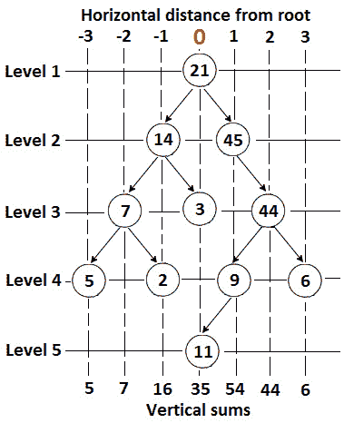

图 13.45–二叉树中的垂直和

如果我们从左边到右边扫描这棵树，我们可以识别出七个垂直轴，它们的总和是 5、7、16、35、54、44 和 6。在图的顶部，我们添加了每个节点到根节点的水平距离。如果我们认为根节点具有距离 0，那么我们可以很容易地通过减小根的左或右唯一地识别每个垂直轴，分别增加 1、3、-2、-1, 0（根）、1, 2, 3。

每个轴都是通过其与根的距离来唯一标识的，每个轴都包含我们必须求和的节点。如果我们将一个轴的唯一距离作为一个键，将该轴上的节点数之和作为一个值来考虑，那么我们可以直觉地认为这个问题可以通过*散列*来解决（如果您不熟悉散列的概念，那么请看[*第 6 章*](06.html#_idTextAnchor080)*，面向对象编程*，*哈希表*问题）。在 Java 中，我们可以通过内置的**HashMap**实现使用哈希，因此不需要从头开始编写哈希实现。

但是我们怎么填这张地图呢？很明显，我们在填地图时必须穿过这棵树。我们可以从根开始，将键添加到地图中，作为 0（0 对应于包含根的轴），将值添加到根（21）。接下来，我们可以使用递归将到根的距离减少 1，从而转到根的左轴。我们还可以使用递归通过根的右轴，将与根的距离增加 1。在每个节点上，我们更新地图中与标识当前轴的键相对应的值。因此，如果我们递归地遵循路径**根****左子树****右子树**，那么我们使用二叉树的预序遍历。

最后，我们的映射应该包含以下键值对：（-3,5），（-2,7），（-1,16），（0,35），（1,54），（2,44）和（3,6）。

将此算法放入代码中，结果如下（**映射**包含垂直和）：

```java
private void verticalSum(Node root, 
        Map<Integer, Integer> map, int dist) {
  if (root == null) {
    return;
  }
  if (!map.containsKey(dist)) {
    map.put(dist, 0);
  }

  map.put(dist, map.get(dist) + root.element);        
  // or in functional-style
  /*
  BiFunction <Integer, Integer, Integer> distFunction
    = (distOld, distNew) -> distOld + distNew;
  map.merge(dist, root.element, distFunction);
  */
  // decrease horizontal distance by 1 and go to left
  verticalSum(root.left, map, dist - 1);
  // increase horizontal distance by 1 and go to right
  verticalSum(root.right, map, dist + 1);
}
```

前面的代码以 O（n logn）时间运行，辅助空间为 O（n），其中*n*是树的节点总数。添加到映射的时间复杂度为 O（logn），因为我们对树的每个节点进行了添加，这意味着我们得到了 O（nlogn）。对于面试来说，这里给出的解决方案应该足够了。但是，您可以通过使用额外的双链接列表来挑战自己，并将时间复杂性降低到 O（n）。主要是，您需要将每个垂直和存储在链表的一个节点中。首先，将包含根的轴对应的垂直和添加到链接列表中。然后，链表的*node.next*和*node.prev*应该存储根轴左右的轴的垂直和。最后，在遍历树时，依靠递归更新链表。

完整的应用程序称为*BinaryTreeVerticalSum。*

## 编码挑战 23–将最大堆转换为最小堆

**亚马逊**、**谷歌**、**Adobe**、**微软**、**Flipkart**

问题 T1：考虑阿纳尔 T2。你已经得到了一个表示 Min 二进制堆的数组。编写一段代码，将给定的最小二进制堆在线性时间内转换为最大二进制堆，而无需额外空间。

**解决方案**：该问题的解决方案受到*堆排序*算法的启发（该算法在[*第 14 章*](14.html#_idTextAnchor340)*排序和搜索中介绍）。*

 *起初，这个问题听起来可能很复杂，但经过几分钟的思考，您可能会得出结论，这个问题可以简化为从未排序的数组构建 Max 二进制堆。因此，给定数组是否是最小二进制堆这一事实并不重要。我们可以通过以下两个步骤从任何数组（已排序或未排序）构建所需的最大二进制堆：

1.  从给定数组的最右、最底节点（最后一个内部节点）开始。
2.  *通过自底向上技术对*所有节点进行加密。

《守则》不言自明：

```java
public static void convertToMinHeap(int[] maxHeap) {
  // build heap from last node to all 
  // the way up to the root node
  int p = (maxHeap.length - 2) / 2;
  while (p >= 0) {
    heapifyMin(maxHeap, p--, maxHeap.length);
  }
}
// heapify the node at index p and its two direct children    
private static void heapifyMin(int[] maxHeap,
      int p, int size) {
  // get left and right child of node at index p
  int left = leftChild(p);
  int right = rightChild(p);
  int smallest = p;
  // compare maxHeap[p] with its left and 
  // right child and find the smallest value
  if ((left < size) && (maxHeap[left] < maxHeap[p])) {
    smallest = left;
  }
  if ((right < size) 
      && (maxHeap[right] < maxHeap[smallest]))  {
    smallest = right;
  }
  // swap 'smallest' with 'p' and heapify
  if (smallest != p) {
    swap(maxHeap, p, smallest);
    heapifyMin(maxHeap, smallest, size);
  }
}
/* Helper methods */
private static int leftChild(int parentIndex) {
  return (2 * parentIndex + 1);
}
private static int rightChild(int parentIndex) {
  return (2 * parentIndex + 2);
}
// utility function to swap two indices in the array
private static void swap(int heap[], int i, int j) {
  int aux = heap[i];
  heap[i] = heap[j];
  heap[j] = aux;
}
```

此代码的运行时为 O（n），不需要额外空间。完整的应用程序称为*MaxHeapToMinHeap。*它还包含从最小二进制堆到最大二进制堆的转换。

## 编码挑战 24–找出二叉树是否对称

**亚马逊**、**谷歌**、**Adobe**、**微软**、**Flipkart**

问题是：考虑到一个二叉树，你已经知道了。编写一段代码，如果此二叉树是对称的（自身是否镜像；左子树和右子树是彼此的镜像），则返回**true**。

首先，让我们来看看包含对称和非对称二叉树的图。标记为（a）、（b）和（d）的二叉树是不对称的，而标记为（c）、（e）和（f）的二叉树是对称的。请注意，如果结构和数据都是对称的，则二叉树是对称的：


图 13.46–对称和非对称二叉树示例

我们可以将此问题视为镜像*root.left*并检查它是否与*root.right*相同。如果它们相同，则二叉树是对称的。但是，我们也可以通过三个条件来表示两个二叉树的对称性，如下所示（理解这些条件的最简单方法是获取每个条件并将它们传递给上图中所示的示例）：

1.  根节点的元素相同。
2.  左树的左子树和右树的右子树必须是镜像。
3.  左树的右子树和右树的左子树必须是镜像。

我认为我们有足够的经验认识到这些条件可以通过递归实现，如下所示：

```java
private boolean isSymmetricRecursive(
      Node leftNode, Node rightNode) {
  boolean result = false;
  // empty trees are symmetric
  if (leftNode == null && rightNode == null) {
    result = true;
  }
  // conditions 1, 2, and 3 from above
  if (leftNode != null && rightNode != null) {
    result = (leftNode.element.equals(rightNode.element))
      && isSymmetricRecursive(leftNode.left, rightNode.right)
      && isSymmetricRecursive(leftNode.right, rightNode.left);
  }
  return result;
}
```

该代码的时间复杂度为 O（n）和 O（h）额外空间，其中*h*是树的高度。迭代实现怎么样？我们可以通过队列提供迭代实现。以下代码是对这种方法的最好解释：

```java
public boolean isSymmetricIterative() {        
  boolean result = false;
  Queue<Node> queue = new LinkedList<>();
  queue.offer(root.left);
  queue.offer(root.right);
  while (!queue.isEmpty()) {
    Node left = queue.poll();
    Node right = queue.poll();
    if (left == null && right == null) {
      result = true;
    } else if (left == null || right == null 
                || left.element != right.element) {
      result = false;
      break;
    } else {
      queue.offer(left.left);
      queue.offer(right.right);
      queue.offer(left.right);
      queue.offer(right.left);
    }
  }
  return result;
}
```

该代码的时间复杂度为 O（n）和 O（h）额外空间，其中*h*是树的高度。完整的应用程序称为*二叉树。*

## 编码挑战 25–以最低成本连接*n*绳索

**亚马逊**、**谷歌**、**Adobe**、**微软**、**Flipkart**

问题 T1：考虑到你已经得到了一个数组，包含了长度为 3 的 3 个阿纳尔 T4 绳索，我们需要把所有这些绳索连接到一根绳子上。考虑连接两条绳索的成本等于它们的长度之和。编写一段代码，以最低成本将所有绳索连接到单个绳索。

让我们考虑，我们有四条绳子，长度是 1, 3, 4，6。让我们先把最短的两根绳子连接起来。这意味着我们需要连接绳索 1 和绳索 3，其成本为 1+3=4。继续使用相同的逻辑，接下来的两条绳子是 4（我们刚刚得到的那条），长度是 4。成本为 4+4=8，因此总成本为 4+8=12。我们还有两条绳子，长度分别是 8 和 6。连接它们的成本为 8+6=14。因此，总成本和最终成本为 12+14=26。

现在，让我们尝试另一种策略。让我们先把最长的两根绳子连接起来。这意味着我们需要连接绳索 4 和 6，其成本为 4+6=10。按照同样的逻辑，接下来的两条绳子是 10（我们刚刚得到的那条）和 3 的长度。成本为 10+3=13，因此总成本为 10+13=23。我们还有两条绳子，长度分别是 13 和 1。连接它们的成本为 13+1=14。因此，总成本和最终成本为 23+14=37。

由于 37>26，显然第一种方法比第二种方法好。但问题是什么？好吧，如果你还没有注意到的话，连接的绳子的长度首先出现在其余的连接处。例如，当我们连接绳索 1 和绳索 3 时，我们写出 1+3=4。到目前为止，4 是总成本。接下来，我们添加 4+4=8，因此新的总成本是之前的总成本+8，即 4+8，但 4 是从 1+3 中获得的，因此 1+3 再次出现。最后，我们连接 8+6=14。新的总成本是以前的成本+14，即 12+14，但 12 是从 4+8 获得的，4 是从 1+3 获得的，因此 1+3 再次出现。

通过分析前面的陈述，我们可以得出这样的结论：如果重复添加的绳索最小，那么连接所有绳索的成本最小，依此类推。换言之，我们可以将其算法考虑如下：

1.  按长度按降序排列绳子。
2.  连接前两条绳索并更新部分最低成本。
3.  将前两条绳索更换为产生的绳索。
4.  从*步骤 1*重复，直到剩下一根绳子（连接所有绳子的结果）。

在实现该算法后，我们应该得到最终的最小成本。如果我们尝试通过排序算法（如快速排序或合并排序）来实现该算法，那么结果将在 O（n2 logn）时间内执行。从[*第 7 章*](07.html#_idTextAnchor135)*算法的大 O 分析可知，这些排序算法在 O（n logn）时间内执行，但每次连接两根绳子时，我们都要对数组进行排序。*

 *我们能做得更好吗？是的，我们可以！在任何时候，我们只需要两条最小长度的绳子；我们不关心阵列的其余部分。换言之，我们需要一个数据结构，使我们能够有效地访问最小元素。因此，答案是最小二进制堆。从最小二进制堆添加和删除是一个 O（logn）复杂度时间操作。其算法可表示为：

1.  从绳子长度数组（O（logn））创建最小二进制堆。
2.  轮询最小二进制堆的根，这将为我们提供最小的 rope（O（logn））。
3.  再次轮询根，这将给我们第二条最小的绳子（O（logn））。
4.  连接两条绳子（将它们的长度相加），并将结果放回最小二进制堆。
5.  从*步骤 2*开始重复，直到剩下一根绳索（连接所有绳索的结果）。

因此，在 O（n logn）复杂度时间内执行的算法如下：

```java
public int minimumCost(int[] ropeLength) {
  if (ropeLength == null) {
    return -1;
  }
  // add the lengths of the ropes to the heap
  for (int i = 0; i < ropeLength.length; i++) {           
    add(ropeLength[i]);
  }
  int totalLength = 0;
  while (size() > 1) {         
    int l1 = poll();
    int l2 = poll();
    totalLength += (l1 + l2);
    add(l1 + l2);
  }
  return totalLength;
}
```

完整的应用程序称为*HeapConnectRopes。*

# 高级主题

从一开始，你就应该知道在技术面试中很少遇到以下主题。首先，让我列举这些主题作为一个非详尽的列表：

*   AVL 树（本书附带的代码中提供了简要说明和实现）
*   红黑树（本书附带的代码中提供了简要说明和实现）
*   Dijkstra 算法
*   拉宾-卡普子串搜索
*   贝尔曼-福特算法
*   Floyd-Warshall 算法
*   间隔树
*   最小生成树
*   B-树
*   二部图
*   图着色
*   P、 NP，和 NP 完全
*   组合与概率
*   正则表达式
*   A*

如果你已经掌握了本书中涉及的所有问题，那么我强烈建议你继续学习上述主题。如果你不这样做，那么请考虑所有问题比这些主题具有更高的优先级。

这里概述的大多数主题可能会在采访中被问到，也可能不会被问到。它们代表了你知道或不知道的复杂算法——面试官不能仅仅因为你能够重现一个著名的算法就真正了解你的逻辑和思维能力。面试官希望看到你有能力利用自己的知识。这些算法不会显示您解决以前从未见过的问题的能力。很明显，你无法凭直觉理解如此复杂的算法，因此你的足迹几乎微不足道。如果你不知道这些算法，不要担心！它们不会让你看起来更聪明或更愚蠢！此外，由于它们是复杂的，因此需要大量的时间来实施，而且在面试中，时间是有限的。

然而，多学习并没有坏处！这是一条规则，所以如果你有时间，那么也可以看看这些高级主题。

# 总结

这是本书中艰难的章节之一，任何技术面试都必须阅读*。树和图形是如此广泛、美妙和富有挑战性的主题，以至于整本书都致力于它们。然而，当你必须为面试做准备时，你没有时间去读大量的书和深入研究每一个话题。这正是这一章的魅力所在：这一章（就像整本书一样）完全集中于一个事实，即你必须实现你的目标：在技术面试中取得优异成绩。*

换句话说，本章包含了技术访谈中可能遇到的最常见的树和图问题，以及有意义的数字、全面的解释和清晰明了的代码。

在下一章中，我们将处理与排序和搜索相关的问题。****