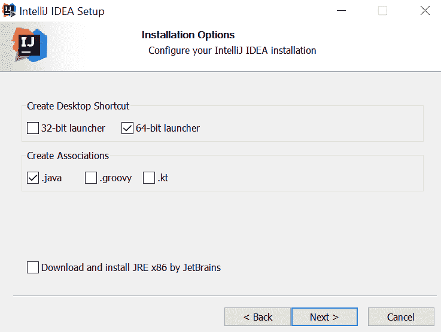
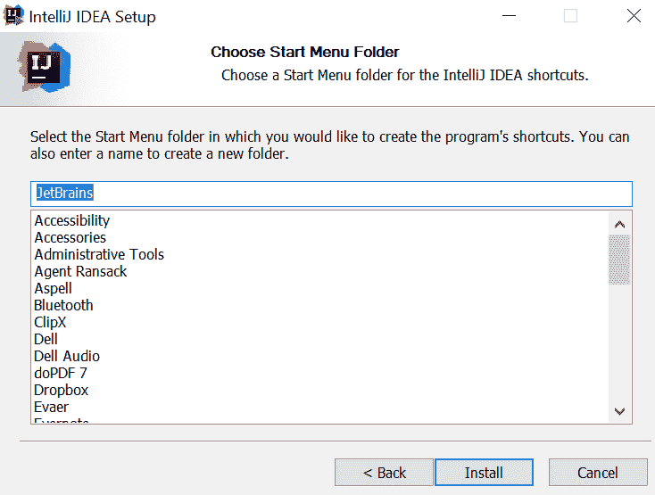

# 您的开发环境设置

到目前为止，您可能已经对如何在计算机上编译和执行 Java 程序有了相当好的了解。现在，是学习如何编写程序的时候了。这一章是你做这件事之前的最后一步。因为您需要首先设置开发环境，所以本章将解释什么是开发环境，以及为什么需要它。然后，它将指导您完成配置和调优，包括类路径的设置。在此过程中，将提供流行编辑的概述和 IntelliJ IDEA 的具体建议。

在本章中，我们将介绍以下主题：

*   什么是开发环境？
*   设置类路径
*   IDEs 概述
*   如何安装和配置 IntelliJ IDEA
*   练习-安装 NetBeans

# 什么是发展环境？

开发环境是安装在计算机上的一组工具，允许您为其编写 Java 程序（应用程序）和测试，与同事共享源代码，编译源代码并运行。在本章中，我们将讨论每个开发工具和开发过程的各个阶段。

# Java 编辑器是您的主要工具

Java 支持编辑器是开发环境的中心。原则上，您可以使用任何文本编辑器编写程序并将其存储在`.java`文件中。不幸的是，常规文本编辑器不会警告您 Java 语言语法错误。这就是为什么支持 Java 的专用编辑器是编写 Java 程序的更好选择。

现代 Java 语言编辑器不仅仅是一种书写工具。它还能够与安装在同一台计算机上的 JVM 集成，并使用它编译应用程序、执行应用程序等等。这就是为什么它不仅被称为编辑器，而且被称为 IDE。它还可以与其他开发工具集成，因此您不需要退出 IDE 就可以将源代码存储在源代码管理系统的远程服务器上。

JavaIDE 的另一个巨大优势是，它们可以提醒您语言的可能性，并帮助您找到更好的方法来实现所需的功能。

IDE 还支持代码重构。这个术语意味着在不影响其功能的情况下，为了更好的可读性、可重用性或可维护性而进行的代码更改。例如，如果有一个代码块在几个方法中使用，则可以在单独的方法中提取它并在任何地方使用，而不是复制代码。另一个例子是当类、方法或变量的名称更改为更具描述性的名称时。使用常规编辑器需要您找到手动使用旧名称的所有位置。IDE 可以为您实现这一点。

IDE 的另一个有用特性是能够生成类的样板代码和标准方法，如构造函数、getter、setter 或`toString()`方法。它通过让程序员专注于重要的事情来提高他们的工作效率。

因此，请确保您对所选择的 IDE 感到满意。作为程序员，您将在大部分工作时间使用 IDE 编辑器。

# 源代码编译

IDE 使用安装在计算机上的`javac`编译器查找所有 Java 语言语法错误。早期发现此类错误比在应用程序已在生产环境中运行后发现此类错误更容易纠正。

并非所有的编程语言都可以通过这种方式得到支持。对于 Java 来说这是可能的，因为 Java 是一种严格类型化的语言，这意味着它需要为每个变量声明一个类型，然后才能使用它。您在[第 2 章](02.html)、*Java 语言基础*中的示例中看到了`int`和`String`类型。在此之后，如果您尝试对声明类型的变量执行不允许的操作，或者尝试为其分配另一个类型，IDE 将警告您，您可以重新访问它，或者坚持您编写代码的方式（当您知道您正在做什么时）。

尽管名称相似，相比之下，JavaScript 是一种动态类型化语言，它允许在不定义变量类型的情况下声明变量。这就是为什么 Java 新手从一开始就可以开发更复杂、功能更全面的应用程序，而复杂的 JavaScript 代码仍然是一个挑战，即使对于有经验的程序员来说也是如此，而且还没有达到 Java 代码所能达到的复杂程度。

顺便说一下，java 的流行原因之一，虽然它比 C++引入得晚，但它却对对象类型的操作施加了限制。在 java 中，使难以跟踪的运行时错误的风险比 C++中的要小得多。运行时错误是 IDE 在编译时无法发现的代码问题，仅基于语言语法。

# 代码共享

IDE 也与代码共享系统集成。同一代码上的协作需要将代码放置在一个公共共享位置，称为**源代码存储库**或版本控制存储库，所有团队成员都可以在该位置访问该代码。最著名的共享存储库之一是基于 web 的版本控制存储库 GitHub（[https://github.com/](https://github.com/) ）。基于 Git 版本控制系统（[https://en.wikipedia.org/wiki/Git](https://en.wikipedia.org/wiki/Git) ）。其他流行的源代码控制系统包括 CVS、ClearCase、Subversion 和 Mercurial 等。

对此类系统的概述和指导不在本书范围之内。我们之所以提到它们，是因为它们是发展环境的重要组成部分。

# 代码和测试执行

使用 IDE，您甚至可以执行应用程序或其测试。为此，IDE 首先使用`javac`工具编译代码，然后使用 JVM（即`java`工具）执行代码。

IDE 还允许我们在调试模式下运行应用程序，此时可以在任何语句处暂停执行。它允许程序员检查变量的当前值，这通常是发现可怕的运行时错误的最有效方法。此类错误通常是由执行期间为变量指定的意外中间值引起的。调试模式允许我们缓慢地沿着攻击性执行路径行走，并查看导致问题的条件。

IDE 功能最有用的方面之一是它维护类路径或管理依赖关系的能力，我们将在下一节中讨论。

# 设置类路径

为了`javac`编译代码和`java`执行代码，他们需要知道组成应用程序的文件的位置。在[第 2 章](02.html)*Java 语言基础*中，在解释`javac`和`java`命令的格式时，我们描述了`-classpath`选项如何允许您列出应用程序正在使用的所有类和第三方库（或者换句话说，取决于这些类和库）。现在，我们将讨论设置此列表。

# 手动设置

有两种设置方法：

*   通过`-classpath`命令行选项
*   通过`CLASSPATH`环境变量

我们将首先描述如何使用`-classpath`选项。在`javac`和`java`命令中具有相同的格式：

```java
-classpath dir1;dir2\*;dir3\alibrary.jar  (for Windows)

javac -classpath dir1:dir2/*:dir3/alibrary.jar   (for Lunix)
```

在上例中，`dir1`、`dir2`和`dir3`是包含应用程序文件和应用程序依赖的第三方`.jar`文件的文件夹。每个目录也可以包含一个目录路径。路径可以是绝对路径，也可以是相对于运行此命令的当前位置的路径。

如果文件夹不包含`.jar`文件（例如，它只有`.class`文件），只列出文件夹名称就足够了。搜索特定文件时，`javac`和`java`这两个工具都会查看文件夹内部。`dir1`文件夹提供了这样一个示例。

如果文件夹包含`.jar`文件（其中包含`.class`文件），则可以执行以下两项操作之一：

*   指定通配符`*`，以便在该文件夹中的所有`.jar`文件中搜索请求的`.class`文件（前面的`dir2`文件夹就是这样一个示例）
*   分别列出每个`.jar`文件（例如存储在`dir3`文件夹中的`alibrary.jar`文件）

`CLASSPATH`环境变量的作用与`-classpath`命令选项相同。指定为`CLASSPATH`变量值的文件位置列表的格式与前面描述的使用`-classpath`选项设置的列表相同。如果您使用`CLASSPATH`，您可以在不使用`-classpath`选项的情况下运行`javac`和`java`命令。如果两者都使用，则忽略`CLASSPATH`的值。

要查看`CLASSPATH`变量的当前值，请打开命令提示符或终端，在 Windows 操作系统中键入`echo %CLASSPATH%`或在 Linux 中键入`echo $CLASSPATH`。你很可能什么也得不到，这意味着你的计算机上没有使用`CLASSPATH`变量。您可以使用`set`命令为其赋值。

可以在`-classpath`选项中包含`CLASSPATH`值：

```java
-classpath %CLASSPATH%;dir1;dir2\*;dir3\alibrary.jar (for Windows)

-classpath $CLASSPATH:dir1:dir2/*:dir3/alibrary.jar (for Lunix)
```

注意，`javac`和`java`工具是 JDK 的一部分，因此它们知道在哪里可以找到 JDK 附带的 Java 标准库，并且不需要在类路径上指定标准库的`.jar`文件。

有关如何设置类路径的 Oracle 教程，请参见[https://docs.oracle.com/javase/tutorial/essential/environment/paths.html](https://docs.oracle.com/javase/tutorial/essential/environment/paths.html) 。

# 在类路径上搜索

无论使用`-classpath`还是`CLASSPATH`，classpath 值都会显示`.class`和`.jar`文件的列表。`javac`和`java`工具总是从左到右搜索列表。如果同一个`.class`文件多次列出（例如，在多个文件夹或`.jar`文件中），则只会找到其第一个副本。如果类路径中包含同一库的多个版本，则可能会导致问题。例如，如果库的较新版本列在较旧版本之后的类路径中，则可能永远找不到该库的较新版本。

此外，库本身也可以依赖于其他`.jar`文件及其特定版本。两个不同的库可能需要相同的`.jar`文件，但版本不同。

正如您所看到的，由于类路径上列出了许多文件，它们的管理可以很快成为一项全职工作。好消息是您可能不需要担心它，因为 IDE 将为您设置类路径。

# IDE 自动设置类路径

正如我们已经提到的，`javac`和`java`工具知道在哪里可以找到 JDK 安装附带的标准库。如果您的代码使用其他库，您需要告诉 IDE 您需要哪些库，以便 IDE 可以找到它们并设置类路径。

为了实现这一点，IDE 使用依赖项管理工具。当今最流行的依赖项管理工具是 Maven 和 Gradle。由于 Maven 的存在时间比 Gradle 长，所有主要的 IDE 都有这个工具，无论是内置的还是通过插件集成的。插件是一种可以添加到应用程序（本例中为 IDE）以扩展其功能的软件。

Maven 拥有一个广泛的在线存储库，存储了几乎所有现有的库和框架。要告诉具有内置 Maven 功能的 IDE 您的应用程序需要哪些第三方库，您必须在名为`pom.xml`的文件中识别它们。IDE 从`pom.xml`文件中读取您需要的内容，并将所需库从 Maven 存储库下载到您的计算机上。然后，IDE 可以在执行`javac`或`java`命令时在类路径上列出它们。我们将向您展示如何在[第 4 章](04.html)中编写`pom.xml`内容，*您的第一个 Java 项目*。

现在是选择、安装和配置 IDE 的时候了。在下一节中，我们将描述最流行的 IDE。

# 外面有很多 IDE

您可以免费使用许多 IDE：NetBeans、Eclipse、IntelliJ IDEA、BlueJ、DrJava、JDeveloper、JCreator、jEdit、JSource、jCRASP 和 jEdit 等等。他们每个人的追随者都相信他们的选择是最好的，所以我们不打算争论。毕竟，这是一个偏好的问题。我们将集中讨论三种最流行的工具：NetBeans、Eclipse 和 IntelliJ IDEA。我们将使用 IntelliJ IDEA 免费社区版进行演示。

我们建议您在做出最终选择之前，阅读关于这些 IDE 和其他 IDE 的文档，甚至试用它们。对于您的初步研究，您可以使用位于[的维基百科文章 https://en.wikipedia.org/wiki/Comparison_of_integrated_development_environments#Java](https://en.wikipedia.org/wiki/Comparison_of_integrated_development_environments#Java) ，其中有一个表格，比较了许多现代 IDE。

# 网虫

NetBeans 最早创建于 1996 年，当时是布拉格查尔斯大学的一个 JavaIDE 学生项目。1997 年，围绕该项目成立了一家公司，并生产了 NetBeans IDE 的商业版本。1999 年，它被太阳微系统公司收购。2010 年，在甲骨文收购 Sun Microsystems 后，NetBeans 成为甲骨文生产的开放源码 Java 产品的一部分，并得到了大量开发人员的贡献。

NetBeans IDE 成为 Java8 的官方 IDE，可以与 JDK8 一起在同一个包中下载；参见[http://www.oracle.com/technetwork/java/javase/downloads/jdk-netbeans-jsp-142931.html](http://www.oracle.com/technetwork/java/javase/downloads/jdk-netbeans-jsp-142931.html) 。

在 2016，Oracle 决定将 NETBeS 项目捐赠给 Apache 软件基金会，声明它是开放的 NETBeaS 治理模型，通过 java 9 和 NETBeaS 9 的发布以及超越 Ty1 T1，使 NETBESE 组件在项目的方向和未来的成功中具有更大的发言权。

有用于 Windows、Linux、Mac 和 Oracle Solaris 的 NetBeans IDE 版本。它支持对所有 Java 应用程序类型（JavaSE、JavaFX、JavaME、web、EJB 和移动应用程序）进行编码、编译、分析、运行、测试、评测、调试和部署。除了 Java，它还支持多种编程语言，特别是 C/C++、XML、HTML5、PHP、Groovy、Javadoc、JavaScript 和 JSP。因为编辑器是可扩展的，所以可以插入对许多其他语言的支持。

它还包括一个基于 Ant 的项目系统、对 Maven 的支持、重构、版本控制（支持 CVS、Subversion、Git、Mercurial 和 ClearCase），并可用于处理云应用程序。

# 日食

Eclipse 是使用最广泛的 JavaIDE。它有一个广泛的插件系统，该系统一直在增长，因此不可能列出它的所有功能。它的主要用途是开发 Java 应用程序，但插件也允许我们在艾达、ABC、C、C++、C 语言、COBOL、D、FORTRAN、Haskell、JavaScript、朱丽亚、LasSO、Lua、自然、Perl、PHP、Prolog、Prthon、R、Ruby、Ruby、Scala、Crojuejava、Groovy、Strand 和 Erlang 编写代码。开发环境包括用于 Java 和 Scala 的 Eclipse**Java 开发工具**（**JDT**），用于 C/C++的 Eclipse CDT，以及用于 PHP 的 Eclipse PDT 等。

名称*Eclipse*是为了与 Microsoft Visual Studio 竞争而发明的，Eclipse 就是 Eclipse。随后的版本以木星木卫四、木卫二和木卫三的卫星命名。随后出现了以这些卫星的发现者伽利略命名的版本。然后，使用了希腊神话中两个以太阳为主题的名字 Helios 和七种彩虹颜色之一的靛蓝（由太阳产生）。之后的版本“朱诺”有三层含义：一个罗马神话人物、一颗小行星和一艘前往木星的宇宙飞船。开普勒、月球和火星延续了天文学的主题，然后氖和氧来自化学元素的名称。光子表示返回以太阳为主题的名称。

Eclipse 还支持所有 Java 应用程序类型和所有主要平台的编码、编译、分析、运行、测试、评测、调试和部署。它还支持 Maven、重构、主要版本控制系统和云应用程序。

各种各样的可用插件对新手来说可能是一个挑战，有时甚至对更有经验的用户来说也是一个挑战，原因有两个：

*   通过组合不同作者的类似插件，通常有多种方法向 IDE 添加相同的功能

*   有些插件是不兼容的，这可能会产生一个难以解决的问题，迫使我们重新构建 IDE 安装，尤其是在新版本发布时

# 智能思想

IntelliJ IDEA 付费版本绝对是当今市场上最好的 Java IDE。但即使是免费社区版也在三大主流 IDE 中占据了强势地位。在下面的维基百科文章中，您可以看到一个表格，很好地总结了付费终极版和免费社区版之间的差异：[https://en.wikipedia.org/wiki/IntelliJ_IDEA](https://en.wikipedia.org/wiki/IntelliJ_IDEA)

它由 JetBrains（前身为 IntelliJ）软件公司开发，该公司在布拉格、圣彼得堡、莫斯科、慕尼黑、波士顿和新西伯利亚的六个办事处拥有约 700 名员工（截至 2017 年）。第一个版本于 2001 年 1 月发布，是最早提供的具有集成高级代码导航和代码重构功能的 JavaIDE 之一。此后，正如作者在其网站[上描述产品功能时所述，该 IDE 以其*对代码*的深刻洞察而闻名 https://www.jetbrains.com/idea/features](https://www.jetbrains.com/idea/features) 。

与前面描述的其他两个 IDE 一样，它支持所有 Java 应用程序类型和所有主要平台的编码、编译、分析、运行、测试、评测、调试和部署。与前面两个 IDE 一样，它还支持 Ant、Maven 和 Gradle，以及重构、主要版本控制系统和云应用程序。

在下一节中，我们将引导您完成 IntelliJ IDEA 社区版的安装和配置。

# 安装和配置 IntelliJ IDEA

下面的步骤和屏幕截图将演示在 Windows 上安装 IntelliJ IDEA 社区版，尽管 Linux 或 macOS 的安装没有太大不同。

# 下载和安装

您可以从[下载 IntelliJ IDEA 社区版安装程序 https://www.jetbrains.com/idea/download](https://www.jetbrains.com/idea/download) 。下载安装程序后，通过双击或右键单击并从菜单中选择“打开”选项来启动安装程序。然后，浏览以下屏幕，通过单击下一步>按钮接受所有默认设置，除非您需要执行其他操作。这是第一个屏幕：


您可以使用浏览。。。按钮并选择目标文件夹的任何位置，或者只需单击下一步>并在以下屏幕上接受默认位置：


检查 64 位启动器（除非您的计算机仅支持 32 位）和以下屏幕上的`.java`：



我们假设您已经安装了 JDK，因此不需要在上一个屏幕截图上检查下载和安装 JRE。如果您还没有安装 JDK，您可以检查下载并安装 JRE，或者按照[第 1 章](01.html)、*Java Virtual**l 计算机（JVM）中描述的步骤在您的计算机*上安装 JDK。

以下屏幕允许您自定义“开始”菜单中的条目，或者单击“安装”按钮即可接受默认选项：



安装程序需要一些时间才能完成安装。以下屏幕上的进度条将为您提供完成流程所需的时间：


安装完成后，下一步>按钮可单击，使用它进入下一屏幕。

选中下一屏幕上的 Run IntelliJ IDEA 框，然后单击 Finish 按钮：


安装完成了，我们现在可以开始配置 IDE 了。

# 配置 IntelliJ IDEA

当 IntelliJ IDEA 第一次启动时，它会询问您在以前的 IDE 版本中可能具有的设置：


由于这是您第一次安装 IntelliJ IDEA，请单击“不导入设置”。

在新安装的 IDE 首次启动时，下一个或两个屏幕也只显示一次。他们会询问您是否接受 JetBrains 隐私政策，以及您是否愿意支付许可证费用，还是愿意继续使用免费社区版或免费试用版（这取决于您获得的特定下载）。以您喜欢的方式回答问题，如果您接受隐私政策，下面的屏幕将要求您选择白色（*IntelliJ*主题）或黑色（*Darcula*主题）。

我们选择了黑暗主题，您将在演示屏幕上看到。但您可以选择您喜欢的任何内容，然后，如果您愿意，可以稍后更改：


在上面的屏幕底部，您可以看到两个按钮：跳过剩余和设置 deafolts，以及下一步：默认插件。如果单击“跳过剩余”并设置默认值，您将跳过现在配置某些设置的机会，但您可以稍后再进行配置。对于这个演示，我们将单击 Next:defaultplugins 按钮，然后向您展示如何在以后重新访问设置。

以下是带有默认设置选项的屏幕：


您可以单击任何自定义。。。链接上一屏幕，查看可能的选项，然后返回。我们将只使用三个版本控制工具。我们将通过单击“自定义…”开始构建工具：


我们将保持 Maven 选项处于选中状态，但是如果您希望稍后探索相关功能，其他检查的存在不会有任何影响，甚至可以提供帮助。

单击保存更改并返回，然后单击自定义。。。版本控制符号下的链接：


稍后我们将讨论一些源代码控制工具（或者也叫版本控制工具），但是对这个主题的全面讨论超出了本书的范围。在前面的屏幕上，您可以选中您知道将要使用的版本控制系统的复选框。否则，请选中所有复选框，以便在打开从列出的工具之一签出的代码源代码树时，版本控制系统将自动集成。

单击保存更改并返回，然后单击自定义。。。测试工具符号下的链接：


在前面的屏幕上，我们将只选中 JUnit 复选框，因为我们希望演示配置中没有不必要的干扰。但是你可以把一切都检查好。有其他选择没有坏处。此外，您可能决定在将来使用其他选项。

正如您所看到的，原则上，我们不需要更改任何默认设置。我们这样做只是为了向您展示可用的功能。

单击保存更改并返回，然后单击下一步：特色插件按钮，然后单击开始使用 IntelliJ IDEA 按钮。

如果您在安装时未配置 IDE，或者执行了其他操作，并且希望更改配置，则可以稍后再进行更改。

我们将在[第 4 章](04.html)、*您的第一个 Java 项目*中解释安装后如何访问 IntelliJ IDEA 中的配置设置，并提供相应的屏幕截图。

# 练习-安装 NetBeans IDE

下载并安装 NetBeans IDE。

# 答复

截至撰写本文时，用于下载最新版本 NetBeans 的页面为[https://netbeans.org/features/index.html](https://netbeans.org/features/index.html) 。

下载完成后，启动安装程序。您可能会收到一条消息，建议您在启动安装程序时使用`--javahome`选项。找到相应的安装说明，然后执行此操作。NetBeans 版本需要特定版本的 Java，不匹配可能会导致安装或运行问题。

如果安装程序在没有警告的情况下启动，您只需按照向导操作，直到屏幕显示安装已成功完成，并显示“完成”按钮。单击 Finish 按钮，然后运行 NetBeans。您已经准备好开始使用 NetBeans IDE 编写 Java 代码了。在阅读了[第 4 章](04.html)之后，*您的第一个 Java 项目*，尝试在 NetBeans 中创建一个类似的项目，看看与 IntelliJ IDEA 相比您有多喜欢它。

# 总结

现在您知道了开发环境是什么，以及您的计算机上需要什么工具来开始编码。您已经了解了如何配置 IDE 以及它在幕后为您做了什么。现在，您已经知道在选择 IDE 时要查找什么了。

在下一章中，您将开始使用它来编写和编译代码，并对其进行测试。您将了解什么是 Java 项目，如何创建和配置 Java 项目，以及如何在不离开 IDE 的情况下执行和测试代码，这意味着您将成为一名 Java 程序员。