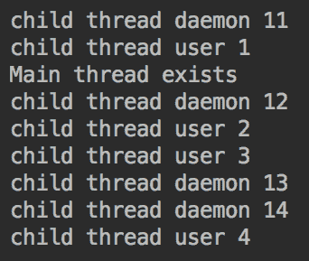
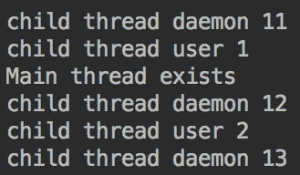
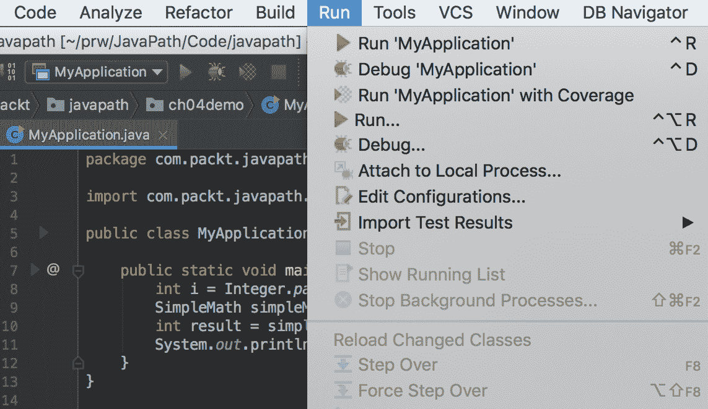
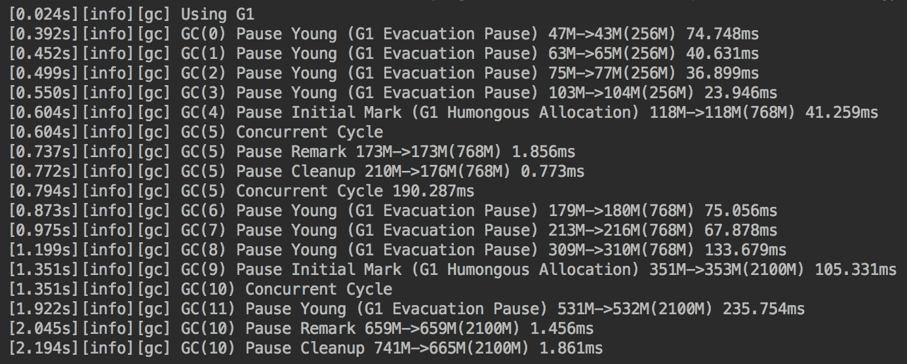

# JVM 进程和垃圾收集

本章允许读者深入了解 JVM，并了解其流程。JVM 的结构和行为比仅仅根据编码逻辑执行一系列指令更复杂。JVM 发现并将应用程序请求的`.class`文件加载到内存中，验证它们，解释字节码（将它们转换为特定于平台的二进制代码），并将生成的机器代码传递给中央处理器（或多个处理器）执行，除应用程序线程外，还使用多个服务线程。其中一个称为垃圾收集的服务线程执行从未使用对象释放内存的重要任务。

在本章中，我们将介绍以下主题：

*   什么是 JVM 进程？
*   JVM 体系结构
*   垃圾收集
*   线程
*   练习–运行应用程序时监视 JVM

# 什么是 JVM 进程？

正如我们已经在[第 1 章](01.html)、*您计算机上的 Java 虚拟机（JVM）*中确定的，JVM 对 Java 语言和源代码一无所知。它只知道如何读取字节码。它从`.class`文件中读取字节码和其他信息，对其进行解释（将其转换为特定于 JVM 运行的特定微处理器的二进制代码指令序列），并将结果传递给执行它的计算机。

在谈到 JVM 时，程序员经常将 JVM 称为*JVM 实例*或*进程*。这是因为每次执行一个`java`命令时，JVM 的一个新*实例*就会启动，专用于在一个单独的进程中使用分配的内存大小（默认或作为命令选项传入）运行特定的应用程序。在这个 JVM 进程中，多个线程正在运行，每个线程都有自己分配的内存；一些是由 JVM 创建的服务线程，而另一些是由应用程序创建和控制的应用程序线程。

线程是轻量级进程，需要的资源分配比 JVM 执行进程少。

这就是 JVM 执行编译代码的大图。但是，如果仔细阅读 JVM 规范，就会发现与 JVM 相关的单词 process 被多次重载。JVM 规范标识了 JVM 中运行的几个其他进程，程序员通常不会提及这些进程，除了类加载进程。

这是因为，在大多数情况下，人们可以成功地编写和执行 Java 程序，而不必了解更多关于 JVM 的知识。但偶尔，对 JVM 内部工作的一些一般性了解有助于确定某些相关问题的根本原因。这就是为什么在本节中，我们将简要概述 JVM 内部发生的所有进程。然后，在下面的部分中，我们将更详细地讨论 JVM 的内存结构和 JVM 功能的一些其他方面，这些方面可能对程序员有用。

有两个子系统运行所有 JVM 内部进程：

*   Classloader，它读取`.class`文件并用类相关数据填充 JVM 内存中的方法区域：
    *   静态场
    *   方法字节码
    *   描述类的类元数据
*   执行引擎，使用以下方式执行字节码：
    *   对象实例化的堆区域
    *   Java 和本机方法堆栈，用于跟踪调用的方法
    *   回收内存的垃圾收集过程

在主 JVM 进程内运行的进程列表包括：

*   类加载器执行的进程：
    *   类加载
    *   类链接
    *   类初始化
*   执行引擎执行的进程：
    *   类实例化
    *   方法执行
    *   垃圾收集
    *   应用程序终止

JVM 体系结构可以描述为有两个子系统：类加载器和执行引擎，它们使用运行时数据内存区域运行服务进程和应用程序线程：方法区域、堆和应用程序线程堆栈。

上面的列表可能给您的印象是这些过程是按顺序执行的。在某种程度上，如果我们只谈论一门课，这是正确的。在加载之前，不可能对类执行任何操作。Аn 只有在所有之前的过程完成后，才能开始执行方法。但是，例如，垃圾收集不会在对象停止使用后立即发生（请参见以下章节，*垃圾收集*。此外，当发生未处理的异常或其他错误时，应用程序可以随时退出。

只有类加载器进程受 JVM 规范的控制。执行引擎的实现在很大程度上取决于每个供应商。它基于语言语义和实现作者设定的性能目标。

执行引擎的进程不受 JVM 规范的约束。有常识、传统、已知和经验证的解决方案，以及可以指导 JVM 供应商实施决策的 Java 语言规范，但没有单一的管理文档。好消息是，最受欢迎的 JVM 使用类似的解决方案，或者至少从入门课程的高层次来看是这样的。有关特定于供应商的详细信息，请参见 Wikipedia 上的*Java 虚拟机比较*（[https://en.wikipedia.org/wiki/Comparison_of_Java_virtual_machines](https://en.wikipedia.org/wiki/Comparison_of_Java_virtual_machines) ）和互联网上的其他来源。

考虑到这一点，让我们更详细地描述前面列出的七个过程中的每一个。

# 加载

根据 JVM 规范，加载阶段包括按名称查找`.class`文件并在内存中创建其表示。

要加载的第一个类是在命令行中传递的类，其中包含方法`main(String[])`。我们之前在[第 4 章](04.html)*您的第一个 Java 项目*中对其进行了描述。类加载器读取`.class`文件，根据内部数据结构对其进行解析，并用静态字段和方法字节码填充方法区域。它还创建了一个描述该类的`java.lang.Class`实例。然后，类加载器链接（参见*链接*一节）并初始化（参见*初始化*一节）类，并将其传递给执行引擎以运行其字节码。

在[第 4 章](04.html)中的第一个项目*您的第一个 Java 项目*中，`main(String[])`方法没有使用任何其他方法或类。但在实际应用程序中，`main(String[])`方法是进入应用程序的入口。如果它调用另一个类的方法，则必须在类路径上找到该类并进行读取、解析和初始化；只有这样，它的方法才能被执行。等等这就是 Java 应用程序启动和运行的方式。

在下一节*如何执行 main（String[]）方法*中，我们将展示几种启动 Java 应用程序的方法，包括使用带清单的可执行`.jar`文件。

每个类都被允许有一个`main(String[])`方法，并且经常这样做。此类方法用于作为独立应用程序独立运行类，以进行测试或演示。这种方法的存在并不会使类成为 main。只有在`java`命令行或`.jar`文件清单中标识该类时，该类才成为主类。

也就是说，让我们继续讨论加载过程。

如果您查看`java.lang.Class`的 API，您将不会在那里看到公共构造函数。类加载器自动创建它的实例，顺便说一下，它是由`getClass()`方法返回的同一个实例，您可以在任何对象上调用该方法。它不携带类静态数据（在方法区域中维护）或状态（它们在执行期间创建的对象中）。它也不包含方法字节码（也存储在方法区域中）。相反，`Class`实例提供元数据来描述类的名称、包、字段、构造函数、方法签名等。这就是为什么它不仅对 JVM 有用，而且对应用程序代码也有用，正如我们已经在一些示例中看到的那样。

由类加载器在内存中创建并由执行引擎维护的所有数据称为该类型的二进制表示。

如果`.class`文件有错误或不符合特定格式，则进程终止。这意味着加载过程会对加载的类格式及其字节码进行一些验证。但更多的验证将在下一个过程开始时进行，称为**链接**。

下面是加载过程的高级描述。它执行三项任务：

*   查找并读取`.class`文件
*   根据内部数据结构将其解析到方法区域
*   创建携带类元数据的`java.lang.Class`实例

# 连接

根据 JVM 规范，链接是解析加载类的引用，因此可以执行类的方法。

尽管 JVM 可以合理地预期`.class`文件是由 Java 编译器生成的，并且所有指令都满足语言的约束和要求，但无法保证加载的文件是由已知的编译器实现或编译器生成的。这就是为什么链接过程的第一步是*验证*，它确保类的二进制表示在结构上是正确的：每个方法调用的参数与方法描述符兼容，返回指令与其方法的返回类型匹配，等等。

验证成功后，下一步-*准备-*如下。接口或类（静态）变量在方法区域中创建，并初始化为其类型的默认值。其他类型的初始化—程序员指定的显式赋值和静态初始化块—延迟到名为**初始化**的过程中（参见下一节*初始化*。

如果加载的字节码引用其他方法、接口或类，则符号引用将解析为指向方法区域的具体引用，这是通过*解析*过程完成的。如果引用的接口和类尚未加载，类加载器将找到它们并根据需要加载它们。

下面是链接过程的高级描述。它执行三项任务：

*   验证类或接口的二进制表示形式
*   方法区内静电场的制备
*   将符号引用解析为指向方法区域的具体引用

# 初始化

根据 JVM 规范，初始化是通过执行类初始化方法来完成的。

这是在执行程序员定义的初始化（在静态块和静态分配中）时，除非该类已经在另一个类的请求下初始化。

此语句的最后一部分很重要，因为不同（已加载）方法可能会多次请求该类，而且 JVM 进程由不同的线程执行（请参阅*线程*一节中的线程定义），并且可以并发访问同一类。因此，需要在不同线程之间进行协调（也称为同步），这使 JVM 实现变得非常复杂。

# 实例化

从技术上讲，由操作员`new`触发的实例化过程是执行的第一步，该部分可能不存在。但是如果`main(String[])`方法（是静态的）只使用其他类的静态方法，则不会发生实例化。这就是为什么将此过程与执行分开是合理的。此外，这项活动还有非常具体的任务：

*   为堆区域中的对象（其状态）分配内存
*   将实例字段初始化为默认值
*   为 Java 和本机方法创建线程堆栈

当第一个不是构造函数的方法准备好执行时，执行开始。对于每个应用程序线程，都会创建一个专用的运行时堆栈，其中每个方法调用都会捕获到堆栈框架中。如果发生异常，我们在调用方法`printStackTrace()`时从当前堆栈帧获取数据。

# 处决

第一个应用程序线程（称为*主*线程）是在`main(String[])`方法开始执行时创建的。它可以创建其他应用程序线程。执行引擎读取字节码，对其进行解释，并将二进制码发送给微处理器执行。它还保存每个方法被调用的次数和频率的计数。如果计数超过某个阈值，执行引擎将使用名为 JIT 编译器的编译器，该编译器将方法字节码编译为本机代码。下次调用该方法时，它将准备就绪，无需解释。它大大提高了代码性能。

当前正在执行的指令和下一条指令的地址保存在**P****程序计数器**（**PC**寄存器中。每个线程都有自己的专用 PC 寄存器。它还可以提高性能并跟踪执行情况。

# 垃圾收集

**垃圾收集器**（**GC**运行标识不再引用的对象的进程，因此可以从内存中删除这些对象。有一个 Java 静态方法`System.gc()`，可以通过编程方式使用它来触发垃圾收集，但不能保证立即执行。每个 GC 周期都会影响应用程序性能，因此 JVM 必须在内存可用性和足够快地执行字节码的能力之间保持平衡。

# 应用程序终止

有几种方法可以通过编程方式终止应用程序（并停止 JVM）：

*   无错误状态代码的正常终止
*   由于未处理的异常或带有或不带有错误状态代码的强制程序退出而导致异常终止

如果没有异常和无限循环，`main(String[])`方法通过一条`return`语句或在执行其最后一条语句后完成。一旦发生这种情况，主应用程序线程就会将控制流返回给 JVM，JVM 也停止执行。

这就是大团圆结局，许多应用程序在现实生活中都很享受。我们的大多数例子，除了那些演示了异常或无限循环的例子外，都成功地结束了。

然而，Java 应用程序还有其他退出方式，其中一些方式也非常优雅。其他人——没有那么多。

如果主应用程序线程创建了子线程，或者换句话说，程序员编写了生成其他线程的代码，那么即使优雅地退出也可能不那么容易。这完全取决于所创建的子线程的类型。如果其中任何一个是`user`线程（默认），那么 JVM 实例即使在主线程退出后也会继续运行。

只有在所有`user`线程完成后，JVM 实例才会停止。主线程可以请求子线程`user`完成（我们将在下一节*线程*中讨论）。但在退出之前，JVM 将继续运行，这意味着应用程序也仍在运行。

但是，如果所有子线程都是`daemon`线程（请参见下面的章节*线程*），或者没有子线程在运行，则 JVM 实例会在主应用程序线程退出后立即停止运行。

如果没有强制终止，JVM 实例将继续运行，直到主应用程序线程和所有子`user`线程完成。在没有子`user`线程或所有子线程都是`daemon`的情况下，JVM 会在主应用程序线程退出后立即停止运行。

异常情况下应用程序如何退出取决于代码设计。在上一章中，我们讨论了异常处理的最佳实践。如果线程捕获了`main(String[])`中`try...catch`块或类似的高级方法中的所有异常，那么控制流将返回到应用程序代码，并且取决于应用程序（以及编写代码的程序员）如何继续—尝试恢复、记录错误并继续或退出。

另一方面，如果异常保持未处理状态并传播到 JVM 代码中，则线程（异常发生的地方）停止执行并退出。然后，将发生以下情况之一：

*   如果没有其他线程，JVM 将停止执行并返回错误代码和堆栈跟踪
*   如果包含未处理异常的线程不是主线程，则其他线程（如果存在）将继续运行
*   如果主线程抛出了未处理的异常，并且子线程（如果存在）是守护进程，那么它们也将退出
*   如果至少有一个用户子线程，JVM 将继续运行，直到所有用户线程退出

还有一些方法可以通过编程强制应用程序停止：

*   `System.exit(0);`
*   `Runtime.getRuntime().exit(0);`
*   `Runtime.getRuntime().halt(0);`

前面的所有方法都强制 JVM 停止执行任何线程，并以状态代码作为参数（在我们的示例中为 0）退出：

*   零表示正常终止
*   非零值表示异常终止

如果 Java 命令是由某个脚本或另一个系统启动的，则状态代码的值可用于下一步决策的自动化。但这已经超出了应用程序和 Java 代码的范围。

前两种方法功能相同，因为`System.exit()`是如何实现的：

```java
public static void exit(int status) {
  Runtime.getRuntime().exit(status);
}
```

要在 IDE 中查看源代码，只需单击该方法。

当某个线程调用`Runtime`或`System`类的`exit()`方法，或`Runtime`类的`halt()`方法，并且安全管理器允许退出或停止操作时，Java 虚拟机退出。

`exit()`和`halt()`之间的区别在于`halt()`强制 JVM 立即退出，而`exit()`执行可以使用`Runtime.addShutdownHook()`方法设置的附加动作。

但所有这些选项很少在主流编程中使用，因此我们已经远远超出了本书的范围。

# JVM 体系结构

JVM 体系结构可以用内存中的运行时数据结构和使用运行时数据的两个子系统——类加载器和执行引擎来描述。

# 运行时数据区

JVM 内存的每个运行时数据区域都属于以下两个类别之一：

*   共享区域，包括以下内容：
    *   **方法区**：类元数据、静态字段、方法字节码
    *   **堆区**：对象（状态）
*   非共享区域，专用于每个应用程序线程，包括以下内容：
    *   **Java 堆栈**：当前帧和调用方帧，每个帧保持 Java（非本机）方法调用的状态：
        *   局部变量的值
        *   方法参数值
        *   中间计算的操作数值（操作数堆栈）
        *   方法返回值（如果有）
    *   **程序计数器（PC）寄存器**：下一条要执行的指令
    *   **本机方法栈**：本机方法调用的状态

我们已经讨论过，程序员在使用引用类型时必须小心，除非需要修改对象本身。在多线程应用程序中，如果可以在线程之间传递对对象的引用，则必须格外小心，因为可能同时修改相同的数据。

从好的方面来看，这样一个共享区域可以并且经常被用作线程之间的通信手段。我们将在接下来的*线程*部分中讨论这一点。

# 类别载入器

类加载器执行以下三个功能：

*   读取`.class`文件
*   填充方法区域
*   初始化程序员未初始化的静态字段

# 执行引擎

执行引擎执行以下操作：

*   实例化堆区域中的对象
*   使用程序员编写的初始化器初始化静态字段和实例字段
*   在 Java 堆栈中添加/删除帧
*   用下一条要执行的指令更新 PC 寄存器
*   维护本机方法堆栈
*   保持方法调用的计数并编译常用的方法调用
*   完成对象
*   运行垃圾收集
*   终止应用程序

# 线程

正如我们已经提到的，主应用程序线程可以创建其他子线程并让它们并行运行，或者通过时间切片共享同一个核心，或者为每个线程使用专用 CPU。可以使用实现功能接口`Runnable`的类`java.lang.Thread`完成。如果接口只有一个抽象方法，则称为函数接口（我们将在[第 17 章](17.html)、*Lambda 表达式和函数编程*中讨论函数接口）。`Runnable`接口包含一个方法`run()`。

有两种方法可以创建新线程：

*   扩展`Thread`类
*   实现`Runnable`接口，将实现对象传递给`Thread`类的构造函数

# 扩展线程类

无论使用什么方法，我们最终都会得到一个具有方法`start()`的`Thread`类对象。此方法调用启动线程执行。让我们看一个例子。让我们创建一个名为`AThread`的类，该类扩展`Thread`并重写其`run()`方法：

```java
public class AThread extends Thread {
  int i1, i2;
  public AThread(int i1, int i2) {
    this.i1 = i1;
    this.i2 = i2;
  }
  public void run() {
    for (int i = i1; i <= i2; i++) {
      System.out.println("child thread " + (isDaemon() ? "daemon" : "user") + " " + i);
      try {
        TimeUnit.SECONDS.sleep(1);
      } catch (InterruptedException e) {
        e.printStackTrace();
      }
    }
  }
}
```

重写`run()`方法很重要，因为否则线程将什么也不做。`Thread`类实现了`Runnable`接口，并有`run()`方法的实现，但如下所示：

```java
public void run() {
  if (target != null) {
    target.run();
  }
}
```

变量`target`保存在构造函数中传递的值：

```java
public Thread(Runnable target) {
  init(null, target, "Thread-" + nextThreadNum(), 0);
}
```

但是我们的`AThread`类没有向父类`Target`传递任何值；变量目标是`null`，因此`Thread`类中的`run()`方法没有任何作用。

现在让我们使用新创建的线程。我们希望它将变量`i`从`i1`递增到`i2`（这些是通过构造函数传递的参数），并将其值与`isDaemon()`方法返回的布尔值一起打印，然后等待（睡眠）1 秒，再次递增变量`i`。

# 什么是守护进程？

daemon 一词起源于古希腊，意思是介于神与人之间的神性或超自然存在，以及内在或伴随的精神或鼓舞人心的力量。但在计算机科学中，这一术语有着更为普通的用法，用于指作为后台进程运行的计算机程序，而不是由交互用户直接控制的程序。这就是为什么 Java 中有两种类型的线程：

*   用户线程（默认），由应用程序启动（主线程就是这样一个示例）
*   后台工作以支持用户线程活动的守护进程线程（垃圾收集是守护进程线程的一个示例）

这就是为什么所有守护进程线程在最后一个用户线程退出后立即退出，或者在未处理的异常后被 JVM 终止。

# 运行线程扩展线程

让我们用我们的新类`AThread`来演示我们描述的行为。下面是我们将首先运行的代码：

```java
Thread thr1 = new AThread(1, 4);
thr1.start();

Thread thr2 = new AThread(11, 14);
thr2.setDaemon(true);
thr2.start();

try {
  TimeUnit.SECONDS.sleep(1);
} catch (InterruptedException e) {
  e.printStackTrace();
}
System.out.println("Main thread exists");

```

在前面的代码中，我们创建并立即启动两个线程——一个用户线程`thr1`和一个守护进程线程`thr2`。实际上，还有一个名为`main`的用户线程，所以我们运行两个用户线程和一个守护进程线程。每个子线程将打印递增的数字四次，每次打印后暂停 1 秒。这意味着每个线程将运行 4 秒。主线程也将暂停 1 秒，但仅暂停一次，因此它将运行大约 1 秒。然后，它打印`Main thread exists`并存在。如果运行此代码，我们将看到以下输出：



我们在一个共享 CPU 上执行此代码，因此，尽管所有三个线程都同时运行，但它们只能按顺序使用 CPU。因此，它们不能并行运行。在多核计算机上，每个线程可能在不同的 CPU 上执行，输出可能略有不同，但相差不大。在任何情况下，您都会看到主线程首先退出（大约 1 秒后），子线程运行到完成，每个线程总共大约 4 秒。

让我们让用户线程仅运行 2 秒：

```java
Thread thr1 = new AThread(1, 2);
thr1.start();

```

结果是：



如您所见，守护进程线程没有运行完整的进程。它成功地打印了 13，可能只是因为它在 JVM 响应最后一个用户线程退出之前将消息发送到了输出设备。

# 实现可运行

创建线程的第二种方法是使用实现`Runnable`的类。以下是此类类的一个示例，其功能几乎与类`AThread`完全相同：

```java
public class ARunnable implements Runnable {
  int i1, i2;

  public ARunnable(int i1, int i2) {
    this.i1 = i1;
    this.i2 = i2;
  }

  public void run() {
    for (int i = i1; i <= i2; i++) {
      System.out.println("child thread "  + i);
      try {
        TimeUnit.SECONDS.sleep(1);
      } catch (InterruptedException e) {
        e.printStackTrace();
      }
    }
  }
}
```

唯一的区别是`Runnable`接口中没有`isDaemon()`方法，因此无法打印线程是否为守护进程。

# 运行线程实现 Runnable

下面是如何使用该类创建两个子线程—一个是用户线程，另一个是守护进程线程—正如我们之前所做的：

```java
Thread thr1 = new Thread(new ARunnable(1, 4));
thr1.start();

Thread thr2 = new Thread(new ARunnable(11, 14));
thr2.setDaemon(true);
thr2.start();

try {
  TimeUnit.SECONDS.sleep(1);
} catch (InterruptedException e) {
  e.printStackTrace();
}

System.out.println("Main thread exists");
```

如果我们运行前面的代码，结果将与基于扩展了`Thread`的类运行线程相同。

# 扩展线程与实现可运行线程

实现`Runnable`具有允许实现扩展另一个类的优点（在某些情况下是唯一可能的选择）。当您希望将类似线程的行为添加到现有类时，它特别有用：

```java
public class BRunnable extends SomeClass implements Runnable {
  int i; 
  BRunnable(int i, String s) {
    super(s);
    this.i = i;
  }
  public int calculateSomething(double x) {
    //calculate result
    return result;
  }
  public void run() {
    //any code you need goes here
  }
}
```

您甚至可以直接调用方法`run()`，而无需将对象传递给线程构造函数：

```java
BRunnable obj = new BRunnable(2, "whatever");
int i = obj.calculateSomething(42d);
obj.run(); 
Thread thr = new Thread (obj);
thr.start(); 
```

在前面的代码片段中，我们展示了许多不同的方法来执行实现`Runnable`的类的方法。因此，实现`Runnable`允许更灵活的使用。但除此之外，与`Thread`的扩展相比，在功能上没有区别。

`Thread`类有几个构造函数，允许设置线程名称及其所属的组。线程分组有助于在多个线程并行运行的情况下管理它们。`Thread`类还有几个方法，提供有关线程状态和属性的信息，并允许我们控制其行为。

线程和任何相关对象也可以使用基类`java.lang.Object`的方法`wait()`、`notify()`和`notifyAll()`相互对话。

但所有这些都已经超出了入门课程的范围。

# 如何执行 main（String[]）方法

在深入研究垃圾收集过程之前，我们想回顾并总结一下如何从命令行运行应用程序。在 Java 中，以下语句用作同义词：

*   运行/执行主类
*   运行/执行/启动应用程序
*   运行/执行/启动主方法
*   运行/执行/启动/启动 JVM 或 Java 进程

原因是，每次执行其中一个操作时，都会发生列出的每个操作。还有几种方法可以做到这一点。我们已经向您展示了如何使用 IntelliJ IDEA 和`java`命令行运行`main(String[])`方法。现在，我们将重复已经说过的一些内容，并添加可能对您有帮助的其他变体。

# 使用 IDE

任何 IDE 都允许运行 main 方法。在 IntelliJ IDEA 中，可以通过三种方式完成：

*   单击方法名称旁边的绿色箭头
*   从下拉菜单中选择类名（在绿色箭头左侧的顶行），然后单击菜单右侧的绿色箭头：


*   通过使用运行菜单并选择类的名称：



在前面的屏幕截图中，您还可以看到编辑配置选项。我们已经使用它来设置可以在开始时传递给 main 方法的参数。但还有更多可能的设置：


如您所见，还可以设置：

*   VM 选项：Java 命令选项（我们将在下一节中进行此操作）
*   环境变量：使用`System.getenv()`方法设置一些参数的方法，这些参数不仅可以在主方法中读取，而且可以在应用程序的任何地方读取

例如，请查看以下屏幕截图：


我们已经设置了`java`命令选项`-Xlog:gc`和环境变量`myprop1=whatever`。IDE 将使用这些设置来形成以下`java`命令：

```java
java -Xlog:gc -Dmyprop1=whatever com.packt.javapath.ch04demo.MyApplication 2
```

选项`-Xlog:gc`告诉 JVM 显示来自垃圾收集进程的日志消息。我们将在下一节中使用此选项来演示垃圾收集是如何工作的。可以使用以下语句在应用程序中的任何位置检索变量`myprop1`的值：

```java
String myprop = System.getenv("myprop1");     //returns: "whatever"
```

我们已经了解了如何在 main 方法中读取参数 2，如下所示：

```java
public static void main(String[] args) {
  String p1 = args[0];          //returns: "2"
}
```

# 类路径上有类的命令行

让我们使用我们在[第 4 章](04.html)中创建的第一个程序*您的第一个 Java 项目*，来演示如何使用命令行。下面是我们当时编写的程序：

```java
package com.packt.javapath.ch04demo;
import com.packt.javapath.ch04demo.math.SimpleMath;
public class MyApplication {
  public static void main(String[] args) {
    int i = Integer.parseInt(args[0]);
    SimpleMath simpleMath = new SimpleMath();
    int result = simpleMath.multiplyByTwo(i);
    System.out.println(i + " * 2 = " + result);
  }
}
```

要从命令行运行它，必须首先使用`javac`命令对其进行编译。使用 Maven 的 IDE 将`.class`文件放在目录`target/classes`中。如果进入项目的根目录或只需单击 Terminal（IntelliJ IDEA 中的左下角），则可以运行以下命令：

```java
java -cp target/classes com.packt.javapath.ch04demo.MyApplication 2
```

结果应显示为`2 * 2 = 4`。

# 类路径上带有.jar 文件的命令行

要使用编译的应用程序代码创建一个`.jar`文件，请转到项目根目录并运行以下命令：

```java
cd target/classes
jar -cf myapp.jar com/packt/javapath/ch04demo/**
```

创建了一个类为`MyApplication`和`SimpleMath`的`.jar`文件。现在，我们可以将其放在类路径上并再次运行应用程序：

```java
java -cp myapp.jar com.packt.javapath.ch04demo.MyApplication 2
```

结果将以相同方式显示；`2 * 2 = 4`。

# 带有可执行的.jar 文件的命令行

可以避免在命令行中指定主类。相反，可以创建一个“可执行”`.jar`文件。它可以通过将需要运行的主类的名称（包含 main 方法）放入清单文件中来实现。以下是步骤：

*   创建一个文本文件`manifest.txt`（名称实际上并不重要，但它清楚地表明了意图），其中包含以下一行：`Main-Class: com.packt.javapath.ch04demo.MyApplication`。冒号（`:`后面必须有一个空格，结尾必须有一个不可见的新行符号，因此请确保您已按下*回车*键，并且光标已跳到下一行的开头。
*   执行命令`cd target/classes`进入目录`classes`。
*   执行以下命令：`jar -cfm myapp.jar manifest.txt com/packt/javapath/ch04demo/**`。

注意`jar`命令选项`fm`的顺序和以下文件的顺序；`myapp.jar manifest.txt`。它们必须是相同的，因为`f`代表`jar`命令将要创建的文件，`m`代表清单源。如果将选项设置为`mf`，则必须将文件列为`manifest.txt myapp.jar`。

现在，运行以下命令：

```java
java -jar  myapp.jar  2
```

结果将再次是`2 * 2 = 4`。

掌握了如何运行应用程序的知识后，我们现在可以继续下一节，在那里需要它。

# 垃圾收集

自动内存管理是 JVM 的一个重要方面，它使程序员不再需要以编程方式进行管理。在 Java 中，清理内存并允许重用内存的过程称为**垃圾收集**（**GC**。

# 响应能力、吞吐量和阻止世界

GC 的有效性影响两个主要的应用程序特性—响应性和吞吐量。响应性是通过应用程序响应请求（提供必要数据）的速度来衡量的。例如，网站返回页面的速度，或桌面应用程序响应事件的速度。响应时间越短，用户体验越好。另一方面，吞吐量表示应用程序在单位时间内可以完成的工作量。例如，一个 web 应用程序可以服务多少请求，或者一个数据库可以支持多少事务。数字越大，应用程序可能产生的价值就越大，它可以支持的用户请求也就越多。

同时，GC 需要四处移动数据，这在允许数据处理的同时是不可能实现的，因为引用将发生变化。这就是为什么 GC 需要在一段称为 stop the world 的时间内停止应用程序线程偶尔执行一次。这些时间越长，GC 完成其工作的速度就越快，应用程序冻结的时间也就越长，这最终会发展到足以影响应用程序的响应性和吞吐量。幸运的是，可以使用`java`命令选项调整 GC 行为，但这超出了本书的范围，本书更多的是介绍，而不是解决复杂问题。因此，我们将集中于 GC 主要活动的高级视图；检查堆中的对象并删除任何线程堆栈中没有引用的对象。

# 对象年龄和世代

基本 GC 算法确定每个对象的年龄。期限是指对象存活下来的收集周期数。JVM 启动时，堆是空的，分为三个部分：年轻一代、老一代或终身一代，以及容纳 50%标准区域大小或更大的对象的巨大区域。

年轻一代有三个区域，一个伊甸园空间和两个幸存者空间，如幸存者 0（*S0*）和幸存者 1（*S1*）。新创建的对象将放置在 Eden 中。当它充满时，一个次要的 GC 过程开始。它移除未引用和循环引用的对象，并将其他对象移动到*S1*区域。在下一个小集合中，*S0*和*S1*切换角色。参照对象从伊甸园和*S1*移动到*S0*。

在每个小集合中，已达到一定年龄的对象都会移动到老一代。该算法的结果是，旧一代包含的对象的年龄超过了某个年龄。这个区域比年轻一代大，因此，这里的垃圾收集成本更高，不像年轻一代那样频繁。但最终会被检查（在几次小收集之后）；从中删除未引用的对象，并对内存进行碎片整理。这种对老一代的清洁被认为是一个主要的收藏。

# 什么时候停止世界是不可避免的

旧一代中的某些对象集合是同时完成的，有些是使用停止世界暂停完成的。这些步骤包括：

*   使用“停止世界暂停”（stop the world pause）完成对可能引用旧代对象的幸存区域（根区域）的初始标记
*   在应用程序继续运行时，同时扫描幸存者区域以查找对旧代的引用
*   在应用程序继续运行的同时，在整个堆上并发标记活动对象
*   备注–使用“停止世界暂停”完成活动对象的标记
*   清理–计算活动对象的年龄并释放区域（使用“停止世界”）并将其返回到“自由”列表（同时）

前面的序列可能会与年轻一代的疏散交错在一起，因为大多数对象都是短期的，更频繁地扫描年轻一代更容易释放大量内存。还有一个混合阶段（当 G1 收集年轻人和老年人已经标记为垃圾的区域时）和巨大的分配阶段（大型物体被移动到巨大的区域或从巨大的区域撤离）。

为了演示 GC 的工作原理，让我们创建一个程序，该程序产生的垃圾比我们通常的示例多：

```java
public class GarbageCollectionDemo {
  public static void main(String... args) {
    int max = 99888999;
    List<Integer> list = new ArrayList<>();
    for(int i = 1; i < max; i++){
      list.add(Integer.valueOf(i));
    }
  }
}
```

这个程序生成近 100000000 个对象，这些对象占用了堆的一大块，并迫使 GC 将它们从 Eden 移动到 S0、S1 等等。正如我们已经提到的，要查看来自 GC 的日志消息，`java`命令中必须包含选项`-Xlog:gc`。我们选择使用 IDE，正如我们在上一节中所述：


然后，我们运行了程序`GarbageCollectionDemo`并得到以下输出（我们只显示它的开始）：



正如您所看到的，GC 过程会循环并根据需要移动对象，并暂停一小段时间。我们希望您了解 GC 的工作原理。我们唯一想提及的是，在某些情况下，使用“停止世界暂停”执行完全 GC：

*   **并发故障**：如果在打标阶段旧一代已满。
*   **提升失败**：如果在混合阶段，老一代空间不足。
*   **疏散失败**：收集器无法将物品提升到幸存者空间和老一代。
*   **巨大的分配**：当应用程序试图分配一个非常大的对象时。如果调整得当，应用程序应该避免完全 GC。

为了帮助 GC 调优，JVM 为垃圾收集器、堆大小和运行时编译器提供了依赖于平台的默认选择。但幸运的是，JVM 供应商一直在改进和调优 GC 过程，因此大多数应用程序都可以很好地使用默认的 GC 行为。

# 练习–运行应用程序时监视 JVM

阅读 Java 官方文档，并列举一些 JDK 安装附带的工具，这些工具可用于监视 JVM 和 Java 应用程序。

# 答复

例如，Jcmd、JavaVisualVM 和 JConsole。Jcmd 特别有用，因为它易于记忆，并提供当前正在运行的所有 Java 进程的列表。只需在终端窗口中键入`jcmd`。这是一个不可或缺的工具，以防您正在试验几个 Java 应用程序，而其中一些应用程序可能不会退出，无论是因为缺陷还是因为这样的预期设计。Jcmd 为每个正在运行的 Java 进程显示一个**进程 ID**（**PID**），如果需要，您可以通过键入命令`kill -9 <PID>`来停止它。

# 总结

在本章中，您了解了支持任何应用程序执行的主要 Java 进程、程序执行步骤以及构成执行环境的 JVM 体系结构的主要组件；运行时数据区域、类加载器和执行引擎。您还了解了称为线程的轻量级进程，以及如何将它们用于并发处理。运行 Java 应用程序的方法和垃圾收集过程的主要特性总结了关于 JVM 的讨论。

在下一章中，我们将介绍几种常用的库——标准库（JDK 附带的）和外部开源库。很快，你就会非常了解其中的大多数，但要达到这一点，你需要开始，我们将通过我们的评论和示例帮助你。