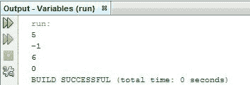
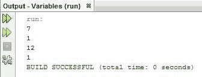
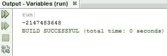
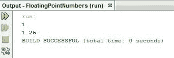
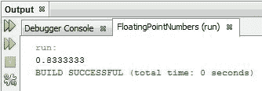
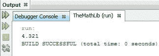
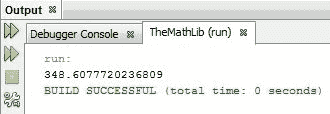
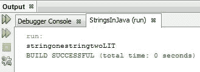
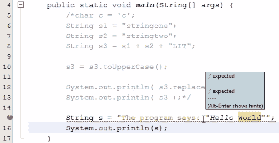
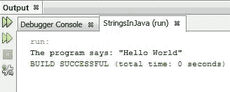

# 理解类型化变量

为了创建即使是普通的 Java 程序，我们需要一种存储和操作信息的方法。当我们这样做的时候，我们的主要资源是变量，这就是我们在本章要看的。我们将研究 Java 中的不同数据类型以及如何在程序中使用它们。我们还将看到`Math`类库及其函数之一。

具体来说，我们将浏览以下主题：

*   变量介绍以及为什么需要变量
*   整数变量
*   浮点变量
*   `Math`类库及其`pow()`功能
*   字符变量
*   `String`类及其方法

# 整数变量

首先，让我们在 NetBeans 中创建一个新项目。我将调用我的`Variables`，这次我们将允许 NetBeans 为我们创建主类，以便我们能够尽快开始编码。我们需要在创建新项目时删除 NetBeans 自动创建的所有注释，以便尽可能保持所有内容的可读性，然后我们就可以开始了：


最早的计算机不过是计算器，Java 当然保留了这一功能。例如，Java 可以评估`1+1`，当然，它会评估为`2`。然而，Java 非常复杂，设计用于做很多不同的事情，所以我们需要为我们的命令提供上下文。在这里，我们告诉 Java 我们希望它打印`1+1`的结果：

```
package variables; 

public class Variables { 

    public static void main(String[] args) { 
        System.out.println(1+1); 
    } 

} 
```

我们前面的程序将按预期运行：


除了其他一些，Java 还可以执行所有基本的算术运算。它可以做加法、减法、乘法（我们在键盘上使用`*`，而不是`X`）和除法。如果我们使用`2`和`3`的输入运行以下程序，我们将看到四个`println()`命令，所有这些命令都将给出正确的计算结果。当然，我们可以将这些数字更改为我们认为合适的任何数字组合：

```
package variables; 

public class Variables { 

    public static void main(String[] args) { 
        System.out.println(2+3); 
        System.out.println(2-3); 
        System.out.println(2*3); 
        System.out.println(2/3); 
    } 
} 
```

以下是上述代码的输出：


手动更改这些行是一种痛苦，如果我们正在编写非常复杂的程序或接受用户输入的动态程序，很快就变得不可行。

# 变量的求解

幸运的是，编程为我们提供了一种存储和检索数据的方法；这称为**变量**。要在 Java 中声明变量，首先必须指定要使用的变量类型。变量有许多不同的类型。在本例中，我们满足于使用整数，即没有指定小数位数且不是分数的数字。此外，在本例中，使用 Java 的一种基本类型是合适的。这些基本上是 Java 编程语言中的基本信息；我们在 Java 中处理的几乎所有其他东西都是由基本类型构建的。

为了声明整数原语类型的变量，即整数，我们使用`int`关键字 all 小写。一旦我们这样做了，我们需要给我们的变量一个名称。这是一个唯一的标识符，我们将来将使用它来访问这段信息。本地程序中的每个变量都应该有自己的名称。我们将第一个变量称为`x`，第二个变量称为`y`：

```
package variables; 

public class Variables { 

    public static void main(String[] args) { 
        int x; 
        int y; 

        System.out.println(2+3); 
        System.out.println(2-3); 
        System.out.println(2*3); 
        System.out.println(2/3); 
    } 
} 
```

我们刚刚编写了两行完全合法的 Java 代码。如果我们现在运行程序，我们将看到与以前相同的输出：



然而，在幕后，Java 也将为我们的`x`和`y`变量留出内存空间。此分配不会影响我们的`println`命令，因为变量尚未在其中引用。

让我们在变量中存储一些信息。一旦我们创建了一个变量，我们就可以简单地通过该变量的名称来引用它。重要的是，我们不要通过再次键入`int x`来引用变量，因为这是 Java 创建全新变量`x`的命令，而不是访问现有变量`x`：


一旦引用了变量，就可以使用等号更改其值。因此，让我们将`x`设置为`4`，将`y`设置为`3`。我们的`println`命令目前使用两个显式声明的整数进行操作：数字`2`和`3`。由于`x`和`y`也是整数，因此我们可以简单地用变量`x`和`y`替换现有的数字：

```
package variables; 

public class Variables { 

    public static void main(String[] args) { 
        int x; 
        int y; 
        x = 4; 
        y = 3; 
        System.out.println(x+y); 
        System.out.println(x-y); 
        System.out.println(x*y); 
        System.out.println(x/y); 
    } 
} 
```

以下是上述代码的输出：



当我们的 Java 代码涉及到变量`x`和`y`时，它将查看它们当前给出的整数值。它将找到编号`4`和`3`。因此，如果我们运行我们的程序，我们应该期望第一个`println`语句`x+y`求值为`4+3`，然后求值为`7`。这正是发生的情况。

这里有一些有趣的事情。我们程序的最后一行，我们用`x`除以`y`，并不像我们在数学上预期的那样进行计算。在这行代码中，`x`有值`4`，而`y`有值`3`，现在`4`除以`3`等于 1.3，但我们的程序只是输出`1`。这是因为 1.3 不是有效的整数值。整数只是整数，而不是分数或十进制数。因此，为了让我们继续使用整数，Java 只需将任何包含小数部分的计算取整为最接近的整数。如果我们想在一个可以得到分数结果的环境中工作，我们需要使用除整数之外的基元类型。

不管怎样，现在我们已经设置了`println`命令来接受整数变量输入而不是显式数字，我们可以通过简单地更改这些整数变量的值来修改所有四行计算的行为。例如，如果我们想让我们的程序在输入值`-10`和`5`上运行（整数可以是负数；它们不能有分数成分），我们需要做的就是更改我们给变量`x`和`y`的值：

```
package variables; 

public class Variables { 

    public static void main(String[] args) { 
        int x; 
        int y; 

        x = -10; 
        y = 5; 

        System.out.println(x+y); 
        System.out.println(x-y); 
        System.out.println(x*y); 
        System.out.println(x/y); 
    } 
} 
```

如果我们快速运行前面的代码，我们将看到预期的结果：


令人惊叹的您刚刚学习了在 Java 中使用整数和变量的基本知识。

# 整数变量的内存分配

让我们看一个 edge 案例，进一步了解 Java 是如何思考的。您可能还记得，在前面，我谈到了 Java 在声明新变量时是如何留出内存的。这是使用高级编程语言（如 Java）的巨大优势之一。Java 为我们抽象或自动处理大部分内存管理。通常，这会使编写程序变得更简单，我们可以编写更短、更清晰、更易于阅读的代码。当然，重要的是我们要了解幕后发生的事情，以免我们遇到问题。

例如，每当 Java 为整型变量留出内存时，它也会为所有整型变量留出相同的内存量。这意味着 Java 可以在整数变量中存储最大值和最小值。最大整数值为`2147483647`，最小整数值为`2147483648`。

让我们做一个实验。如果我们试图存储并打印一个大于最大值一的整数变量，会发生什么情况？首先，让我们简化程序。我们只是给变量`x`分配一个比可能高的值：


当我们尝试这样做时，NetBeans 会对我们大喊大叫。它有一些内在的逻辑，试图阻止我们犯这个非常基本和常见的错误。如果我们试图编译这个程序，我们也会得到一个错误。

然而，我们想以科学的名义犯这个错误，所以我们要欺骗 NetBeans。我们将把变量`x`的值设置为可能的最大整数值，然后在代码的下一行中，我们将`x`的值设置为比`x`当前值高一个的值，即`x=x+1`。实际上，我们可以用一个漂亮的小速记：`x=x+1`相当于`x++`。好的，当我们运行这个程序时，它将被编译器和 NetBeans 潜入，并在运行时进行加法，我们试图打印出一个整数值，即 1 加上 Java 可以存储在内存位置的最高整数值：

```
package variables; 

public class Variables { 

    public static void main(String[] args) { 
        int x; 

        x = 2147483647; 

        x++; 
        System.out.println(x); 

    } 
} 
```

当我们运行前面的程序时，我们得到以下负数：



这个数字恰好是我们可以存储在整数中的最小数字。这有一定的视觉意义。我们已经走到了正数，或者向右，在整数线上，我们已经到达了最左边或者最负的点。当然，从数学意义上讲，这可能会很快变得相当混乱。

我们不太可能编写需要大于此值的整数的程序。然而，如果我们这样做了，我们当然需要意识到这个问题并绕过它，使用可以处理较大值的变量类型。`long`变量类型就像一个整数，但我们需要为它分配更多内存：

```
package variables; 

public class Variables { 

    public static void main(String[] args) { 
        long x; 

        x = 2147483647; 

        x++; 
        System.out.println(x); 

    } 
} 
```

当我们运行上述程序时，我们将得到数学上精确的结果：


# 浮点变量

当我们简单地计算和操作整个对象时，整数是非常棒的。然而，有时我们需要在更数学的意义上处理数字，我们需要一种能够让我们表达不完全是整数的想法的数据类型。浮点数（float）是一种 Java 原语类型，允许我们表示具有小数点和分数的数字。在本节中，我们将并排修改一些浮点和整数变量，以了解它们的相似性和不同性。

让我们创建一个新的 Java 项目（您现在已经知道了演练），并将其命名为`FloatingPointNumbers`。让我们先声明两个变量：一个整数（`iNumber`）和一个浮点（`fNumber`）。正如我们所知，一旦我们声明了这些变量，我们就可以在以后的 Java 程序中自由地修改它们并为它们赋值。这一次，让我向您展示，我们还可以在声明这些变量的同一行中修改和分配这些变量。因此，在我声明我的`iNumber`整数变量的地方，我可以立即给它`5`的值：

```
package floatingpointnumbers; 

public class FloatingPointNumbers { 

    public static void main(String[] args) { 
        int iNumber = 5; 
        float fNumber; 
    } 
} 
```

请注意，如果我们尝试对我们的 float 变量执行非常类似的操作，NetBeans 将通过在左侧显示一个灯泡和红点来对我们大喊大叫：


事实上，如果我们试图编译我们的程序，我们将得到一条合法的编译器错误消息：


让我们分析一下为什么会发生这种情况。当我们在 Java 中使用显式数字时，也就是说，键入数字而不是使用变量时，Java 仍然会为该显式数字提供一个类型。所以当我们输入一个没有小数点的数字时，这个数字的类型被认为是一个整数。所以我们的任务非常有效。但是，假设小数点后的数字属于这种类型，称为`double`；它是`float`数据类型的姊妹类型，但不完全相同。我们稍后再谈`double`。现在，我们需要做的是告诉 Java 将`5.5`视为`float`类型编号，而不是`double`。要做到这一点，我们只需在数字后面加上`f`，如下所示：

```
float fNumber = 5.5f; 
```

你会看到灯泡和红点都消失了。为了确保语法正确，让我们为程序提供一些超基本的功能。让我们使用`System.out.println()`依次打印整数和浮点数变量：

```
System.out.println(iNumber); 
System.out.println(fNumber); 
```

当我们构建这个程序时，我们的编译器错误消失了，当我们运行它时，我们看到了预期的两个赋值。没有什么太激动人心的：


# 整数和浮点数据类型之间的行为差异

现在，我们不必为变量指定显式值，而是做一些基本的算术，这样我们就可以看到在 Java 中修改整数和浮点时，它们的行为是如何不同的。在 Java 中，`float`和`int`都是基本类型，是编程语言的逻辑构建块。这意味着我们可以使用数学运算符（如除法）对它们进行比较和修改。

我们知道，如果我们试图用一个整数除以另一个整数，我们总是会得到一个整数，即使标准数学的规则不能使其成为预期的结果。但是，如果我们将一个浮点数除以另一个浮点数，我们将得到更精确的数学结果：

```
package floatingpointnumbers; 

public class FloatingPointNumbers { 

    public static void main(String[] args) { 
        int iNumber = 5/4; 
        float fNumber = 5.0f/4.0f; 
        System.out.println(iNumber); 
        System.out.println(fNumber); 
    } 
} 
```

以下是上述代码的输出：



有时候，Java 会让我们做一些不太好的事情。例如，Java 允许我们将浮点变量`fNumber`的值设置为一个整数除以另一个整数，而不是一个浮点数除以另一个：

```
int iNumber = 5/4; 
float fNumber = 5/4; 
```

因为等号右边的计算发生在浮点变量`fNumber`的值改变之前，我们将在`5/4`的两个计算中看到相同的输出。这是因为 5 和 4 都是整数变量。因此，当我们运行程序时，即使`fNumber`仍然是一个浮点数（我们可以看出，因为它是用小数点打印出来的），它的值仍然被设置为`5/4`的四舍五入整数：


解决这个问题相当简单；我们只需将一个整数值加上`f`即可将其更改为浮点数：

```
int iNumber = 5/4; 
float fNumber = 5/4.0f; 
```

现在，计算将知道如何进行小数位除法：


当我们停止使用显式声明的数字并开始使用变量时，正确导航就变得更为棘手和重要。

现在让我们声明两个整数变量。我就打电话给他们`iNumber1`和`iNumber2`。现在，我们将其值设置为`iNumber1/iNumber2`，而不是试图将`fNumber`的值设置为一个明确声明的数字除以另一个数字，我们将只打印存储在`fNumber`中的结果：

```
package floatingpointnumbers; 

public class FloatingPointNumbers { 

    public static void main(String[] args) { 
        int iNumber1 = 5; 
        int iNumber2 = 6; 
        float fNumber = iNumber1/iNumber2; 

        System.out.println(fNumber); 
    } 
} 
```

当我们运行这个程序时，因为我们再次将一个整数除以另一个整数，我们将看到舍入现象。我们的浮点变量中存储的值为`0.0`，四舍五入结果为`5/6`：


如果我们使用显式声明的数字，我们可以通过将两个整数中的一个改为浮点数来解决这个问题，只需在后面加一个小数位和`f`。在这种情况下，使用`iNumber2f`不是一种选择，因为 Java 现在不认为我们要求它将`iNumber2`视为浮点数，而是认为它正在寻找一个名为`iNumber2f`的变量，在这种情况下，它肯定不存在。

# 类型铸造

不过，我们可以通过使用所谓的**模式**来获得类似的结果。这是一个命令，其中我们要求 Java 将一种类型的变量视为另一种类型。在这里，我们绕过了 Java 将`iNumber1`和`iNumber2`视为整数的自然倾向。我们介入并说，“你知道什么是 Java，在这里把这个数字当作一个浮点数，”我们在这样做的时候承担了一些责任。Java 会尝试按照我们的要求去做，但如果我们选择得不好，并且试图将一个对象转换成一个它不能转换的对象，我们的程序就会崩溃。

幸运的是，我们在这里使用的是原语，并且原语类型知道如何像其他类型一样工作。因此，我们可以通过在变量`iNumber1`前面加上`(float)`，将其强制转换为一个浮点数：

```
float fNumber = (float)iNumber1/iNumber2; 
```

现在如果我们运行我们的程序，我们将看到`5/6`的预期结果：



这是对浮点数的一个非常扎实的介绍，我们将在任何时候使用浮点数，我们想在数学意义上处理数字，而不是作为整数来计算整个对象。

# 双重数据类型

让我们快速讨论一下`double`数据类型。它是`float`的姐妹类型。它提供了更高的分辨率：`double`数字可以有更多的小数位数。但它们会占用更多的内存。此时，使用 double 或 float 几乎总是一种风格或个人偏好决定。除非您使用的是必须以最高内存效率运行的复杂软件，否则 double 所占用的额外内存空间不是很重要。

为了说明`double`的工作原理，让我们将`FloatingPointNumbers.java`程序中的两个整数更改为`double`数据类型。当我们只改变变量的名称时，我们程序的逻辑根本不会改变。但是，当我们将这些变量的声明从声明整数更改为双精度时，逻辑确实发生了变化。无论如何，当我们显式声明一个带小数点的数字时，它默认为`double`：


我们现在需要纠正错误。发生此错误是因为将一个`double`数据类型除以另一个数据类型将返回一个`double`结果。我们可以通过两种方式解决这个问题：

1.  首先，我们可以将`dNumber1`和`dNumber2`强制转换为浮点数，然后将它们除以：

```
float fNumber = (float) dNumber1/ (float) dNumber2; 
```

2.  然而，将我们的两个双数除以对方是完全合法的操作。那么，为什么不让这种情况自然发生，然后将结果的双精度转换为浮点数，从而保持更高的分辨率呢。就像在代数中一样，我们可以使用括号将程序的概念块分解为我们希望在另一个块之前出现的块：

```
float fNumber = (float) (dNumber1/dNumber2); 
```

现在如果我们运行这个程序，我们会得到预期的结果：


# 数学类库

我们在任何软件开发项目上的大部分时间都将用于教授我们的程序，以解决它经常遇到的问题类型。作为程序员，我们也会一次又一次地遇到某些问题。有时，我们需要为这些问题编写自己的解决方案，并希望将它们保存起来供以后使用。然而，很多时候，有些人以前遇到过这些问题，如果他们已经公开了他们的解决方案，我们的选择之一就是利用他们的解决方案为我们自己谋利。

在本节中，我们将使用与 JDK 捆绑在一起的`Math`类库为我们解决一些数学问题。要开始本节，请创建一个全新的 NetBeans 项目（我将其命名为`TheMathLib`，并输入`main()`函数。我们将编写一个非常简单的程序。让我们声明一个浮点数变量并给它一个值（不要忘记显式数字末尾的`f`字母，让 Java 知道我们声明了一个浮点数），然后使用`System.out.println()`将该值打印到屏幕上：

```
package themathlib; 

public class TheMathLib { 
    public static void main(String[] args) { 
        float number = 4.321f; 
        System.out.println(number); 
    } 
} 
```

好了，我们开始：



现在，有了这个程序，我们可以很容易地将浮点数提高到各种幂次。所以，如果我们只是想将这个数字平方，我想我们可以打印出`number*number`的值。如果我们想把它分成立方体，我们可以打印出`number*number*number`。如果我们想把它提高到六的幂，我们可以把它自己乘以六倍。当然，这很快就会变得笨拙，当然还有更好的方法。

让我们利用 Java`Math`类库来帮助我们将数字提高到不同的指数幂。现在，我已经告诉你，我们正在寻找的功能存在于`Math`类库中。这是一种向正确方向推进的方式，你应该期望从谷歌搜索中获得，或者如果你是一名经验丰富的软件开发人员，你可以实现一个特定的 API。不幸的是，这些信息还不足以让我们开始使用这个类库的功能。我们不知道它是如何工作的，甚至不知道它到底提供了什么功能。

为了找到答案，我们必须查看它的文档。以下是 Oracle 为 Java 开发工具包中的库管理的文档网页：[docs.Oracle.com/javase/7/docs/api/](http://docs.oracle.com/javase/7/docs/api/)。页面上显示的库中有`java.lang`。当我们选择它时，我们将在类摘要下找到我们一直在寻找的`Math`类。一旦我们导航到`Math`类库页面，我们会得到两样东西。首先，我们得到一些关于图书馆的人性化文本，它的历史，它的预期用途是什么，非常元级的东西。如果向下滚动，我们会看到库实现的功能和方法。这就是我们想要达到的本质：


# 使用 pow（）函数

这些功能中有一个应该为我们突出，那就是`pow()`或功率功能。它将第一个参数（`double a`的值提升为第二个参数（`double b`的幂）。简言之，它将允许我们将数字提高到任意的水平：


让我们回到编码上来。好的，在声明变量`number`后，让我们使用这个`pow()`函数来修改它的值。我们将按照`number = pow`的思路做一些事情，但我们需要更多的信息：


我们究竟如何使用这个`pow()`功能？好的，如果我们点击我们的文档，我们会看到当`pow()`函数被声明时，除了它的名称之外，括号之间还指定了两个参数。这些参数`double a`和`double b`是函数在按预期操作之前请求的两条信息。

为了使用这个函数，我们的工作是用实际变量或显式值替换请求`double a`和`double b`，以便`pow()`函数能够完成它的任务。我们的文档告诉我们，`double a`应该替换为我们希望提升为`double b`幂的变量或值。

让我们用变量`number`替换第一个类型参数，这是我们想要提升到任意幂的。注意，`number`不是`double`，这会给我们带来一些麻烦，除非我们简单地将其改为`double`。那我们就这么做吧。对于第二个参数，我们没有一个预先创建的变量来替换`double b`，所以我们只使用一个显式值，例如`4.0`：


请注意，我在调用`pow()`函数时去掉了`double`说明符。这个说明符的存在只是为了让我们知道 Java 所期望的类型。

从理论上讲，`pow()`函数现在已经具备了继续运行所需的所有信息，并将数字变量的值提高到 4 的幂。然而，NetBeans 仍然在向我们发出红色警告信号。现在，这是因为 NetBeans 和 Java 扩展不知道在哪里可以找到这个`pow`关键字。出于同样的原因，我们需要指定到`System.out.println()`的完整路径，我们需要指定一个完整路径，它可以在其中找到 Java 的`pow()`函数。这与我们在文档中获取`pow()`函数所遵循的路径相同。因此，让我们在代码中指定`java.lang.Math.pow()`作为其路径：

```
package themathlib; 

public class TheMathLib { 
    public static void main(String[] args) { 
        double number = 4.321; 
        number = java.lang.Math.pow(number, 4.0); 
        System.out.println(number); 
    } 
} 
```

现在我们可以走了。让我们在`println`语句中使用一次`number`变量，那么我们应该能够运行我们的程序：



如果我们愿意的话，我们可以把它插入计算器，但是我很有信心我们的程序已经输出了 4.321 的值，提高到 4 的幂。

这太棒了！我们刚刚使用了外部代码，这不仅使我们的程序更容易编写，而且还使它保持非常人性化的可读性。它需要的代码行比其他情况下少得多。

# 导入类库

关于我们的程序，有一点是人类无法理解的，那就是通往`pow()`和`println()`等函数的长路径。有没有办法缩短它们？当然有。如果 Java 制造商愿意的话，他们可以允许我们通过在所有实例中键入`Math.pow()`来调用此函数。不幸的是，这会产生一些意想不到的副作用。例如，如果有两个库链接到 Java，并且它们都声明了一个`Math.pow()`函数，Java 将不知道使用哪一个。因此，默认情况下，我们需要直接和显式地链接到库。

因此，如果我们只想输入类似于`Math.pow()`的内容，我们可以将一个库导入到我们正在工作的本地空间中。我们只需要在类和函数声明上方执行一个`import`命令。import 命令作为输入的所有内容都是我们希望 Java 在遇到它无法立即识别的关键字（如`pow()`）时查找的路径。为了让我们在程序中使用更简单的语法`Math.pow()`，我们只需键入`import java.lang.Math`：

```
package themathlib; 

import java.lang.Math; 

public class TheMathLib { 
    public static void main(String[] args) { 
        double number = 4.321; 
        number = java.lang.Math.pow(number, 4.0); 
        System.out.println(number); 
    } 
} 
```

导入有一些特殊的语法。假设我们想要导入`java.lang`中的所有类库。要做到这一点，我们可以将`.Math`替换为`.*`，并将其转换为`java.lang.*`，即“从`java.lang`包导入每个库”。我可能应该告诉您，对于我们这些在 NetBeans 中工作的人，此导入是默认完成的。但是，在本例中，我们将显式地执行此操作，因为在其他 Java 环境中工作时可能也必须执行此操作。

# 字符变量

操作数字的程序都很好，但我们经常希望能够处理文本和单词。为了帮助我们做到这一点，Java 定义了字符，或者`char`，原语类型。字符是可以在计算机上使用的最小文本实体。我们可以把它们看作是以单个字母开头的。

让我们创建一个新项目；我们称之为`Characters.java`。我们将通过简单地定义一个字符开始我们的程序。我们将其命名为`character1`，并为其指定大写字母`H`的值：

```
package characters; 

public class Characters { 
    public static void main(String[] args) { 
        char character1 = 'H'; 
    } 
} 
```

正如在显式定义浮点数时必须使用一些额外的语法一样，在定义字符时也需要一些额外的语法。为了告诉 Java 我们在这里显式声明一个字符值，我们用两个单引号将要分配给变量的字母括起来。单引号，而不是双引号，让 Java 知道我们使用的是一个字符或一个字母，而不是试图使用整个字符串。字符只能具有单个实体值。如果我们试图将`Hi`的值赋给`character1`，NetBeans 和 Java 都会告诉我们这不是一个有效的选项：


现在，让我们继续写一个有点复杂的程序，尽管如此，对于我们的示例来说，它仍然可以很好地工作。让我们定义五个字符。我们将通过`character5`给他们打电话`character1`。我们将按顺序为每个单词指定“Hello”五个字母中的一个。当这些字符一起打印时，我们的输出将显示`Hello`。在我们程序的第二部分，让我们使用`System.out.print()`在屏幕上显示这些字母。`System.out.print()`代码的工作原理与`System.out.println()`相同，只是它没有在我们行的末尾添加回车符。让我们将最后一个命令设置为`println`，以便将输出与控制台中显示的所有其他文本分开：

```
package characters; 

public class Characters { 

    public static void main(String[] args) { 
        char character1 = 'H'; 
        char character2 = 'e'; 
        char character3 = 'l'; 
        char character4 = 'l'; 
        char character5 = 'o'; 
        System.out.print(character1); 
        System.out.print(character2); 
        System.out.print(character3); 
        System.out.print(character4); 
        System.out.println(character5); 
    } 
} 
```

如果我们运行这个程序，它会欢迎我们。上面写着`Hello`，然后还有一些额外的文字：


这很简单。

现在让我向你们展示一些东西，让我们了解一下我们的计算机是如何看待角色的。事实证明，我们不仅可以通过在两个单引号之间显式声明大写字母`H`来设置`character1`的值，还可以通过给它一个整数值来设置它。每个可能的字符值都有一个相应的数字，我们可以用它来代替它。如果我们将`H`替换为`72`的值，我们仍将打印出`Hello`。如果我们使用大于`72`的值`73`，而不是大写字母`H`，我们现在将得到大写字母`I`，因为我是 H 后面的字母。

我们必须确保不将`72`放在单引号之间。最好的情况是，Java 识别出`72`不是一个有效的字符，并且它看起来更像两个字符，那么我们的程序将无法编译。如果我们使用一个被单引号包围的一位数字，我们的程序可以正常编译，但是我们会得到完全出乎意料的输出`7ello`。

那么我们如何计算字符的数值呢？嗯，有一个通用的查找表，**ASCII**表，它将字符映射到它们的数值：


在本节中，我们讨论了第 1 列（**Dec**）和第 5 列（**Chr**），这两列都有十进制数和它们映射到的字符。您会注意到，虽然这些字符中有许多是字母，但也有一些是键盘符号、数字和其他东西，例如制表符。就编程语言而言，新行、制表符和空格都是字符元素。

为了看到这一点，让我们尝试用十进制值`9`替换程序中的一些字符，它应该对应于制表符。如果我们将单词的中间三个字母替换为制表符，作为输出，我们应该期待`H`、三个制表符和`o`：

```
package characters; 

public class Characters { 

    public static void main(String[] args) { 
        char character1 = 'H'; 
        char character2 = 9; 
        char character3 = 9; 
        char character4 = 9; 
        char character5 = 'o'; 
        System.out.print(character1); 
        System.out.print(character2); 
        System.out.print(character3); 
        System.out.print(character4); 
        System.out.println(character5); 
    } 
```

以下是上述代码的输出：


# 串

让我们谈谈 Java 中的字符串。首先，创建一个新的 NetBeans 项目，将其命名为`StringsInJava`，然后输入`main()`函数。然后，声明两个变量：一个名为`c`的字符和一个名为`s`的`String`字符。马上，我们就明白了`String`有点不同。您会注意到，NetBeans 并没有选择将`String`关键字用蓝色编码，如果我们声明一个原语类型的变量，就会这样做：


这是因为`String`与`char`不同，它不是原始类型。`String`就是我们所说的课堂。类是面向对象编程的主干。正如我们可以声明原语类型的变量一样，我们也可以声明类的变量，这些变量称为实例。在我们的程序中，变量`s`是`String`类的一个实例。与原语类型的变量不同，类的实例可以包含它们自己的特殊方法和它们作为实例的类声明的函数。在本节中，我们将使用一些特定于字符串的方法和函数来操作文本。

但是首先，让我们来看看什么使 To.T0.类如此特殊。正如我们所知，我们几乎可以互换地使用我们的字符变量和字符文本，就像我们可以互换任何其他基本类型一样。`String`类还可以与字符串文字互换映射，字符串文字类似于字符文字，但使用双引号，可以包含许多字符，也可以不包含任何字符。大多数 Java 类不映射到任何类型的文本，而我们通过`String`类操纵字符串文本的能力正是它如此有价值的原因。

# 串联运算符

字符串可以做的另一件事是使用加法符号（`+`）操作符，而大多数 Java 类都不能。如果我们声明三个字符串（例如，`s1`、`s2`和`s3`），我们可以将第三个字符串的值设置为一个字符串加上另一个字符串。我们甚至可以在混合中添加字符串文字。然后，我们打印`s3`：

```
package stringsinjava; 

public class StringsInJava { 

    public static void main(String[] args) { 
        char c = 'c'; 
        String s1 = "stringone"; 
        String s2 = "stringtwo"; 
        String s3 = s1+s2+"LIT"; 
        System.out.println(s3); 
    } 
} 
```

当我们运行此程序时，我们将看到这三个字符串以我们预期的方式添加在一起：



# toUpperCase（）函数

因此，我向您保证字符串具有在简单原语类型中所没有的功能。为了使用这个方法，让我们导航到 Java 文档中的`String`类，网址为[docs.oracle.com/javase/7/docs/api/](http://docs.oracle.com/javase/7/docs/api/)。选择 Packages 下显示的 java.lang，然后向下滚动并从 ClassSummary 中选择 String。与所有 Java 类的文档一样，字符串文档包含方法摘要，它将告诉我们可以在现有的`String`对象上调用的所有函数。如果我们在方法摘要中向下滚动，我们将看到将字符串中的所有字符转换为大写字母的`toUpperCase()`函数：


现在让我们使用这个函数。回到 NetBeans，我们现在需要确定程序中使用`toUpperCase()`函数的最佳位置：

```
package stringsinjava; 
public class StringsInJava { 
    public static void main(String[] args) { 
        char c = 'c'; 
        String s1 = "stringone"; 
        String s2 = "stringtwo"; 
        String s3 = s1 + s2 + "LIT"; 
        System.out.println(s3); 
    } 
} 
```

我们知道在我们的`StringsInJava.java`程序中完成`s3`的值后，我们需要在`s3`字符串上使用`toUpperCase()`函数。我们可以做以下两件事之一：

*   完成`s3`的值后立即在线使用该功能（只需输入`s3.toUpperCase();`。
*   调用该函数作为输出`s3`值的行的一部分。我们不需要打印出`s3`的值，只需打印出`s3.toUpperCase()`的值，如下代码块所示：

```
package stringsinjava; 

public class StringsInJava { 

   public static void main(String[] args) { 
      char c = 'c'; 
      String s1 = "stringone"; 
      String s2 = "stringtwo"; 
      String s3 = s1+s2+"LIT"; 

      System.out.println(s3.toUpperCase()); 
   } 
} 
```

如果您还记得我们的文档，`toUpperCase()`函数不需要参数。它知道`s3`正在调用它，这就是它所需要的全部知识，但我们仍然提供了双空括号，以便 Java 知道我们实际上正在进行函数调用。如果现在运行此程序，我们将获得字符串的大写版本，如预期的那样：


但是，重要的是我们要了解这里的幕后情况。`System.out.println(s3.toUpperCase());`代码行没有修改`s3`的值，然后打印出该值。相反，`println`语句计算`s3.toUpperCase()`，然后输出该函数返回的字符串。为了查看`s3`的实际值没有被这个函数调用修改，我们可以再次打印`s3`的值：

```
System.out.println(s3.toUpperCase()); 
System.out.println(s3); 
```

我们可以看到，`s3`保留了小写部分：


如果我们想永久修改`s3`的值，我们可以在前一行进行修改，我们可以将`s3`的值设置为函数的结果：

```
package stringsinjava; 

public class StringsInJava { 
    public static void main(String[] args) { 
        char c = 'c'; 
        String s1 = "stringone"; 
        String s2 = "stringtwo"; 
        String s3 = s1 + s2 + "LIT"; 

        s3 = s3.toUpperCase(); 

        System.out.println(s3); 
        System.out.println(s3); 
    } 
} 
```

以下是上述代码的输出：


# replace（）函数

为了确认我们都在同一页上，让我们使用`String`类中的另一个方法。如果我们返回文档并向上滚动，我们可以找到字符串的`replace()`方法：


与我们的`toUpperCase()`方法不接受参数不同，`replace()`将两个字符作为参数。函数将返回一个新字符串，其中我们作为参数给出的第一个字符（`oldChar`的所有实例将替换为我们作为参数给出的第二个字符（`newChar`）。

让我们在`StringsInJava.java`中的第一行`println()`中使用此函数。我们将键入`s3.replace()`并为函数指定两个字符作为参数。让我们将字符`g`替换为字符`o`：

```
package stringsinjava; 

public class StringsInJava { 
    public static void main(String[] args) { 
       char c = 'c'; 
        String s1 = "stringone"; 
        String s2 = "stringtwo"; 
        String s3 = s1 + s2 + "LIT"; 

        s3 = s3.toUpperCase(); 

        System.out.println(s3.replace('g', 'o')); 
        System.out.println(s3); 
    } 
} 
```

当然，如果我们运行程序，什么也不会发生。这是因为当我们到达 print 语句时，`s3`中没有小写的`g`字符，也没有小写的`g`字符；只有大写的`G`字符。因此，让我们尝试替换大写的`G`字符：

```
System.out.println(s3.replace('G', 'o')); 
System.out.println(s3); 
```

现在如果我们运行我们的程序，我们会看到替换发生在`println`的第一个实例上，而不是第二个实例上。这是因为我们实际上没有更改`s3`的值：


杰出的现在，只要手头有 Java 文档，您就可以调用各种`String`方法。

# 逃逸序列

但是，如果您花费大量时间处理字符串，我预计您将遇到一个常见问题。让我们快点看一看。我打算在这里写一个全新的程序。我要声明一个字符串，然后让我们的程序将字符串打印到屏幕上。但是我要分配给这个字符串的值有点棘手。我希望我们的程序打印出`The program says: "Hello World"`（我希望`Hello World`用双引号括起来）：



这里的问题是，在字符串文本中添加双引号会混淆 Java，如前面的屏幕截图所示。当它读取我们的程序时，它看到的第一个完整字符串是`"The program says:"`，它告诉 Java 我们已经结束了字符串。当然，这不是我们想要的。

幸运的是，我们有一个系统可以告诉 Java，我们希望一个字符被视为一个字符文本，而不是它可能具有的特殊功能。为此，我们在角色前面加一个反斜杠。这称为转义序列：

```
String s= "The program says: \"Hello World\""; 
System.out.println(s); 
```

现在，当 Java 读取这个字符串时，它将读取`The program says:`，然后看到反斜杠，并知道如何将双引号视为双引号，即字符，而不是环绕字符串的双引号。当我们运行程序时，我们不会看到反斜杠；他们本身就是特殊人物：



如果我们确实希望在字符串中看到反斜杠，则需要在其前面加上反斜杠：

```
String s= "The program says: \\ \"Hello World\""; 
System.out.println(s); 
```


那是弦 101！

# 总结

在本章中，我们解释了什么是变量，以及它们对于创建更好的程序有多重要。我们详细研究了 Java 的一些原始数据类型，即`int`、`long`、`float`、`char`和`double`。我们还看到了`String`类及其两种操作方法。

在下一章中，我们将研究 Java 中的分支语句。