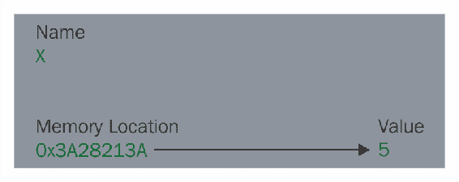
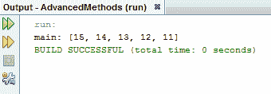

# 功能

在本章中，我们将首先讨论 Java 程序基础中使用的一些基本概念和术语。您将通过简单的程序学习所有这些概念。您将了解非常重要的 Java 方法。如果你是一个有经验的程序员，你可能在过去运行过函数。随着这些基本概念的学习，您将掌握更多关于高级 Java 函数的知识。以下是我们计划在本章中介绍的主题：

*   Java 函数的基础知识
*   方法
*   高级 Java 函数
*   操作 Java 变量

# Java 函数的基础知识

在 Java 中，“函数”和“方法”这两个术语基本上可以互换使用，“方法”是您将在文档中看到的技术上更正确的术语。

# 方法

**方法**是一种允许我们中断程序控制流的工具。它们让我们声明小的**子例程**，或者有时我们可以将它们看作更小的程序，我们可以在程序中引用它们，这样我们就不必在一个块中编写程序的所有逻辑代码：

```
public class TemperatureConverter { 
    public static void main(String[] args) { 
        Scanner reader = new Scanner(System.in); 
        char inputType; 
        char outputType; 
        float inputValue; 
        float returnValue; 

        System.out.print("Input type (F/C/K): "); 
        inputType = reader.next().charAt(0); 
        System.out.print("Output type (F/C/K): "); 
        outputType = reader.next().charAt(0); 
        System.out.print("Temperature: "); 
        inputValue = reader.nextFloat(); 
    } 
} 
```

方法的一个例子是在`Scanner`类中找到的`.next`方法。我不必教我们的`Scanner`对象如何在我编写的程序中获取下一组用户输入，我只需从其他人以前编写的类中调用`next`方法即可。在一个大约有 22 行代码的程序中，大概总共会有 22 行代码。

通过编写我们自己的方法，我们可以通过将复杂的挑战分解为更小、更易于管理的部分来应对它们。适当模块化并使用方法的程序也更具可读性。这是因为我们可以给我们的方法起自己的名字，这样我们的程序就可以更加自我解释，并使用更多的英语（或任何你母语的语言）单词。为了从一开始就向大家展示方法的威力，我计划了一个非常复杂的程序，我们今天要编写。

# 温度转换程序

我们的目标是创建一个温度转换程序，我已经为我们设置了该程序的输入部分：

```
public class TemperatureConverter { 
    public static void main(String[] args) { 
        Scanner reader = new Scanner(System.in); 
        char inputType; 
        char outputType; 
        float inputValue; 
        float returnValue; 

        System.out.print("Input type (F/C/K): "); 
        inputType = reader.next().charAt(0); 
        System.out.print("Output type (F/C/K): "); 
        outputType = reader.next().charAt(0); 
        System.out.print("Temperature: "); 
        inputValue = reader.nextFloat(); 
    } 
} 
```

到目前为止，这个程序从用户那里获取了三条信息。第一种是温度类型：`F`表示华氏温度，`C`表示摄氏温度，`K`表示开尔文温度。然后是另一种温度类型。这是我们的用户希望我们转换为的类型；再一次，温度可能是华氏度、摄氏度或开尔文。最后，我们从用户处获取初始温度值。有了这三个输入，我们的程序将把给定的温度值从华氏度、摄氏度或开尔文转换成用户想要的温度类型。

这是一项具有挑战性的计划，原因有二：

*   首先，有六种可能的控制流情况，因为有两组三个用户输入。这意味着在最坏的情况下，我们可能不得不写六个`if...else`块，这将很快变得非常笨拙。
*   第二个挑战是进行实际转换。我已经查了三种温度转换的转换数学，即华氏度到摄氏度，摄氏度到开尔文，开尔文到华氏度：

```
package temperatureconverter; 

import java.util.*; 

// F to C: ((t-32.0f)*5.0f)/9.0f 
// C to K: t+273.15f 
// K to F: (((t-273.15f)*9.0f)/5.0f)+32.0f 

public class TemperatureConverter { 
    public static void main(String[] args) { 
        Scanner reader = new Scanner(System.in); 
        char inputType; 
        char outputType; 
        float inputValue; 
        float returnValue; 
```

正如你所看到的，虽然这不是一个很难的数学问题，但如果我们开始复制和粘贴公式（如前面的注释所示），它肯定会很笨拙，我们的程序看起来会很疯狂。您还应该注意，通过前面注释部分中的三个转换，我们可以进行该程序将被要求进行的任何可能的转换。这是因为这三个转换创建了一个转换循环，在这个循环中，我们可以通过一个过渡方程从一个特定类型转换到任何其他类型。

说了这么多，做了这么多，让我们直接开始编写我们的程序吧。

# 设置控制流

我们需要做的第一件事是设置一些控制流。正如我前面提到的，有六种可能的情况，对于输入和输出类型的每一种可能的配对，可能只需要设置六个`if`语句。不过这会有点笨拙，所以我有一个稍微不同的计划。我要做的第一件事不是为每个可能的类型配对处理不同的情况，而是将用户给定的初始温度值转换为摄氏度值。完成此操作后，我们将把该摄氏度值转换为用户最初寻找的任何类型。这可以使用以下代码块完成：

```
System.out.print("Input type (F/C/K): "); 
inputType = reader.next().charAt(0); 
System.out.print("Output type (F/C/K): "); 
outputType = reader.next().charAt(0); 
System.out.print("Temperature: "); 
inputValue = reader.nextFloat(); 
```

设置控制流的优点是允许我们完全隔离地处理两个用户输入。它使我们的程序更加模块化，因为我们在开始下一项任务之前先开始并完成一项任务。

因此，为了进行初始转换，我们将用户提供的任何内容作为输入，并将其转换为摄氏值，我们需要使用一个`switch`语句：

```
public static void main(String[] args) { 
    Scanner reader = new Scanner(System.in); 
    char inputType; 
    char outputType; 
    float inputValue; 
    float returnValue; 

    System.out.print("Input type (F/C/K): "); 
    inputType = reader.next().charAt(0); 
    System.out.print("Output type (F/C/K): "); 
    outputType = reader.next().charAt(0); 
    System.out.print("Temperature: "); 
    inputValue = reader.nextFloat(); 

    switch(inputType) 
} 
```

我们将切换`inputType`字符变量，该变量告诉我们用户给我们的温度是华氏度、摄氏度还是开尔文。在`switch`语句中，我们将操作`inputValue`，其中存储该温度的值。

# 探索不同的案例-C、K 和 F

所以我想我们需要对每种可能的或有效的输入类型使用单独的案例，也就是说，大写字母`F`表示华氏温度，`C`表示摄氏温度，`K`表示开尔文。我们可能还应该处理一个`default`案件。让我们从写`default`案例开始。我们将使用`System.exit`并使用`1`退出，这在技术上是一个错误代码：

```
switch(inputType) 
{ 
    case 'F': 
    case 'C': 
    case 'K': 
    default: 
        System.exit(1); 
```

`System.exit` basically quits our program. It tells it to stop executing and passes to the operating system or whatever's up in the hierarchy.

在这种情况下，程序将停止。因为是`default`案例，所以我们只希望在用户没有输入`F`、`C`或`K`的情况下输入，这是我们的有效输入类型。现在，让我们继续处理这些输入类型。

# 摄氏型

在所有情况下，我们都将使用摄氏度作为我们的第一个转换点，因此如果我们的用户输入了摄氏度值，我们可以继续并打破这种情况，因为`inputValue`的值对我们来说已经可以了：

```
switch(inputType) 
{ 
    case 'F': 
    case 'C': 
        break; 
    case 'K': 
        default: 
            System.exit(1); 
```

如果用户给了我们一个华氏值怎么办？好吧，让我们滚动到代码的顶部；您将看到，我们有一个从华氏到摄氏的显式转换：

```
// F to C: ((t-32.0f)*5.0f)/9.0f 
// C to K: t+273.15f 
// K to F: (((t-273.15f)*9.0f)/5.0f)+32.0f 
```

我们可以使用前面的代码块，我已经使它非常 Java 友好，只需将这个输入变量的值更改为在其值上运行的转换语句。因此，我们将用输入变量替换`t`占位符：

```
switch(inputType) 
{ 
    case 'F': 
        inputValue = ((inputValue-32.0f)*5.0f)/9.0f; 
        break; 
    case 'C': 
        break; 
    case 'K': 
    default: 
        System.exit(1); 
} 
```

这将在该变量中正确存储与原始华氏温度值相当的摄氏度。

# 开尔文型

我们可以对开尔文案做类似的处理。我们没有从开尔文到摄氏度的明确转换，但我们知道如何将开尔文转换为华氏度，然后如何将华氏度转换为摄氏度。因此，我们可以通过以下方式逃脱：

```
switch(inputType) 
{ 
     case 'F': 
         inputValue = ((inputValue-32.0f)*5.0f)/9.0f; 
         break; 
     case 'C': 
         break; 
     case 'K': 
         inputValue = ((((((inputValue-273.15f)*9.0f)/5.0f)+32.0f) -   
         32.0f)*5.0f)/9.0f; 
     default: 
         System.exit(1); 
} 
```

在前面的代码中，我们将开尔文值转换为华氏值，用括号括起来，并对其进行华氏到摄氏的转换。

从技术上讲，这是一行功能代码。如果我们运行程序并输入一个开尔文输入框，它会将开尔文值正确地转换为摄氏值。但是，让我说，如果我是一名程序员，在工作中遇到这样一行代码，特别是这样一行代码，没有任何注释解释，我不会很高兴。这里有很多神奇的数字，数字通常是真正的信息；这一点都不是不言自明的。当然，作为最初的程序员，至少在编写它时，我们要记住，我们的目标是将开尔文值转换为摄氏值；然而，对于那些没有时间坐下来仔细检查整个过程的人来说，这真的是不可理解的。那么，有没有更好的方法？是的，肯定有。

# 华氏型

现在让我们试着了解华氏温度的情况。考虑下面的代码：

```
inputValue = ((inputValue-32.0f)*5.0f)/9.0f; 
```

前一行代码比我们的开尔文案例要好一点，因为它包含的数字更少，但从任何意义上讲，它仍然不利于程序员。那么，如果在我们这个程序的初始实现中，我们可以提供对程序员来说非常好的通信呢？如果我们不在那里打印方程，而是把方程放在程序的其他地方，调用华氏温度到摄氏温度的函数，会怎么样？

```
inputValue = fToC(inputValue); 
```

我们现在只需输入`fToC`以保持简短。这对正在看我们节目的人来说更有意义。

对于开尔文案例，我们可以做一些非常类似的事情：

```
inputValue = fToC(kToF(inputValue)) 
```

我们可以调用开尔文到摄氏度函数（`kToC`），如果我们想，或者我们甚至不想写它，我们可以在`inputValue`变量上调用开尔文到华氏度函数，然后在上面调用`fToC`函数。这就是我们最初在概念上对所有数学所做的，除了我们所做的将这些数字抽象出来，并将它们放在程序中的其他地方。这对程序员来说要友好得多。假设我们在数学上犯了一个错误，另一个程序员想检查一下。他们所需要做的就是找到我们将要编写的函数，比如`fToC`和`kToF`，然后他们就可以在那里深入了解它们所有的肮脏细节。当然，我们确实需要编写这些函数。

当我们创建一个新函数时，我们实际上要在我们当前使用的函数或方法之外执行它：

```
public static void main(String[] args) { 
```

目前，我们使用程序的`main`方法，这是程序开始执行的一种特殊方法。所以，为了编写华氏温度到摄氏温度的函数，我们将退出该方法，并声明一个全新的方法；本质上，我们正在教我们的程序如何运行一个名为`fToC`的新程序：

```
public static fToC() 
```

现在，继续使用方法前面的`public static`关键字。一旦我们真正了解 Java 的面向对象特性，这些关键字将非常重要，但是现在，我们将在我们声明的所有方法中使用它们。

为了更详细地解释我们计划下一步对程序做什么，让我们试着通过将程序进一步分为两部分来更详细地了解情况。

# 执行程序的第一部分

您的标准 Java 方法在实际命名之前还有一个关键字，这就是该方法将返回的信息类型：

```
public static float fToC() 
{ 
} 
```

例如，我们希望能够调用开尔文到华氏温度函数的`fToC`。当我们这样做的时候，我们基本上把开尔文到华氏度函数的结果作为它自己的浮点变量来处理。这是一个很好的迹象，表明我们在这些函数中寻找的返回类型是`float`数据类型。这意味着当这些小程序完成执行时，它们将向我们的`main`方法抛出一个浮点值，该方法调用了它们。命名一个函数后，在它前面的函数声明中用两个括号括起来。在这些括号之间，我们将告诉我们的程序运行这个函数需要什么信息。我们基本上通过创建一些变量来实现这一点，如以下代码块所示：

```
public static float fToC(fVal) 
```

我们需要一个变量，我只调用`fVal`，因为我们从华氏值开始。在每个输入变量之前，我们还需要告诉我们的程序将会是什么类型的信息；这样，人们就不能不正确地调用我们的函数并传入字符串之类的内容，这是毫无意义的：

```
public static float fToC(float fVal) 
{ 
} 
```

所以，我们要告诉我们的函数，为了运行它，需要调用一条`float`信息作为输入。在我们以前编写的函数中，它们实际上存在于程序中。你会看到我们这样做了：我们提供了`inputValue`，或者用户最初给我们的温度值，作为这些函数的输入。

现在，我们需要我们的`fToC`函数，我们的华氏温度到摄氏温度函数，对代码中的`fVal`变量执行一些计算，其中将包含用户输入的温度值。由于我们要从华氏温度到摄氏温度，我们只需再次复制并粘贴程序顶部的字符串，并用`t`替换`fVal`：

```
public static float fToC(float fVal) 
{ 
    fVal = ((fVal-32.0f)*5.0f)/9.0f; 
} 
```

现在，我们可能会要求函数执行此操作来更改此变量的值。虽然我们当然可以这样做，但这不会给我们带来我们所需要的结果。当我们的程序点击`inputValue = fToC(inputValue);`代码行并运行`fToC`函数时，将`inputValue`作为其输入变量，该变量实际上不会下降到函数的代码行。相反，Java 只是复制`inputValue`的值并将其存储在我们的新变量中，正如您在下面的代码块中所看到的：

```
public static float fToC(float fVal) 
{ 
    fVal = ((fVal-32.0f)*5.0f)/9.0f; 
} 
```

所以我们对这个`fVal`变量所做的更改不会映射到我们的`inputValue`变量。幸运的是，我们显式地将`inputValue`的值更改为我们正在编写的函数现在返回的值。一旦我们准备退出函数的执行，我们就可以让它抛出与我们告诉 Java 这个函数将返回的值类型等价的任何值。我们使用`return`关键字执行此操作，后跟任何计算为浮点值的语句。因此，当我们的`fToC`函数在`inputValue`上运行时，它将打印出一个浮点数，该浮点数等于我们存储在输入变量中的初始华氏温度值的摄氏值：

```
public static float fToC(float fVal) 
{ 
    return ((fVal-32.0f)*5.0f)/9.0f; 
} 
```

一旦我们编写了其中一个函数，编写其他类似的函数就变得相当容易了。要编写开尔文到华氏度的函数，我们只需要做同样的事情，但在本例中，我们将开尔文到华氏度的转换方程，并更改变量的名称。如果我们想，我们可以称之为`fVal`-`kVal`更具解释性，并返回该结果：

```
public static float fToC(float fVal) 
{ 
    return ((fVal-32.0f)*5.0f)/9.0f; 
} 
public static float kToF(float kVal) 
{ 
    return (((kVal-273.15f)*9.0f)/5.0f)+32.0f; 
} 
```

这是我们程序的前半部分，我们将用户给我们的任何东西转换成摄氏值。到目前为止，这比六条`if`语句要优雅得多，但我们只编写了一半的程序。

# 执行程序的第二部分

完成摄氏度转换后，我们将使用另一个`switch`语句。这一次，我们将在`outputType`上使用它，用户告诉我们他们希望看到的温度类型的等效值，或者在中看到的等效值。我们的案例将与我们`switch`陈述的前半部分非常相似；然而这里不是把所有的东西都转换成摄氏度，我们总是从摄氏度转换。再一次，这意味着案例`C`可以简单地在任何情况下打破，我们已经转换为摄氏度，然后我们不再需要从摄氏度转换：

```
// F to C: ((t-32.0f)*5.0f)/9.0f 
// C to K: t+273.15f 
// K to F: (((t-273.15f)*9.0f)/5.0f)+32.0f 
```

现在，我们明确的例子是摄氏度到开尔文的转换。我们知道这个公式，多亏了代码顶部漂亮的备忘单；我们可以构建一个函数来快速完成这项工作。我们将此函数称为`cToK`；这是我们的变量名，这是逻辑：

```
public static float fToC(float fVal) 
{ 
    return ((fVal-32.0f)*5.0f)/9.0f; 
} 
public static float kToF(float kVal) 
{ 
    return (((kVal-273.15f)*9.0f)/5.0f)+32.0f; 
} 
public static float cToK(float cVal) 
{ 
    return cVal+273.15f; 
} 
```

一旦我们声明了我们的`cToK`函数，我们就可以在`inputValue`上调用它，因为`inputValue`现在存储修改后的原始输入值，它将是一个摄氏数，以转换为开尔文值：

```
case 'K': 
    inputValue = cToK(inputValue); 
```

类似于我们加倍从开尔文到华氏度再到摄氏度的转换，当我们把所有的东西都变成摄氏度时，我们可以通过从摄氏度得到开尔文值得到华氏度输出。然后，我们可以使用开尔文到华氏度函数将该开尔文值转换为华氏度：

```
case 'F': 
    inputValue = kToF(cToK(inputValue)); 
    break; 
case 'C': 
    break; 
case 'K': 
    inputValue = cToK(inputValue); 
    break; 
default: 
    System.exit(1);  
```

这是我们节目的后半部分。尽管如此，只有两行真正的代码可能会导致任何人暂停，而且它们是非常不言自明的。然而，我们程序的所有逻辑和功能仍然可以被好奇的程序员访问，他们希望重新访问它们：

```
    } 
    System.out.println(inputValue); 
} 
```

# 程序的最后一步

我们可以在这里使用`println`来完成我们的程序，抛出`inputValue`，现在应该包含正确的转换。让我们运行这个程序，并给出一些输入和输出，看看我们是如何做到的：


所以，当我们运行我们的程序时，它会问我们要给它什么。让我们给它一个华氏值。现在假设我们想要得到一个摄氏值作为输出。让我们看看`32`华氏度的摄氏值是多少。我们看到，`0`的输出结果。`32`华氏度是`0`摄氏度，这是个好兆头。让我们试试更多的边缘案例。如果我们尝试将摄氏度转换为摄氏度，我们会得到与以下屏幕截图所示相同的值，这是我们所期望的：


让我们看看`1`度开尔文的华氏值是多少：


好消息是，这也是前面截图中的预期值。我们使用函数使原本非常复杂且难以阅读的程序更易于管理。我们在这里编写的程序有点复杂。它做了一些数学和多功能的陈述，所以如果你第一次没有 100%的支持我们，我鼓励你回去看看是什么绊倒了你。还有其他方法来解决这个问题，如果你有灵感，我鼓励你去探索。

# 高级 Java 函数

在本节中，我希望您深入了解 Java 方法，并了解一些关于编程语言如何思考和操作信息的真正有价值的东西。为了帮助我们做到这一点，我想运行一个类似的实验，为了开始这个实验，我编写了一个非常基本的 Java 程序：

```
package advancedmethods; 

public class AdvancedMethods { 
    public static void main(String[] args) { 
        int x = 5; 
        magic(x); 
        System.out.println("main: " + x); 
    } 
    public static void magic(int input) 
    { 
        input += 10; 
    } 
} 
```

这个 Java 程序的核心是`magic`方法，它是用户根据`main`方法定义的。当我们遇到一个新的 Java 方法时，有三件事我们应该注意：

1.  首先，我们应该问，“它的输入值是什么？”。在我们的`magic`方法中，它只需要一个整数作为输入。
2.  然后，我们可能想问，“这个方法返回什么？”。在我们的例子中，方法被标记为返回`void`。Void 方法实际上根本不返回任何值；他们只需执行代码并完成。您会注意到，当我们在程序的主要部分引用`magic`时，我们不会尝试将其返回值存储在任何位置。当然，这是因为存储时没有返回值。
3.  然后，关于我们的方法要注意的第三件事是“它做什么？”。在我们的`magic`方法中，我们只需将得到的值作为`input`并将该值增加`10`。

我想让你们现在做的是花一分钟的时间看看这个程序，试着弄清楚当我们达到这个`println`语句时，程序的输出会是什么。这里的挑战性问题是，当我们运行`magic(x)`行代码并调用`magic`方法时，变量`x`的值会发生什么变化？当我们将变量`x`作为值传递给`magic`方法时，变量`x`是否保持不受影响，或者变量`x`是否被`magic`方法中的代码输入行修改，以便我们打印出值`15`而不是打印出`5`？

为了回答这个问题，我们只需要运行我们的程序，如果我们这样做，我们将看到我们得到了`5`的值，让我们知道运行`magic`方法并没有在我们的主方法的上下文中修改变量`x`的值：


事实上，如果我们根本不运行`magic`方法，我们将得到相同的输出。那么这告诉我们什么呢？这使我们对 Java 如何处理方法输入有了非常重要的了解。为了完全理解这里发生了什么，我们需要深入了解 Java 变量是如何操作的。

# 操作 java 变量

下面是我们的变量`x`存储的信息的表示，即我们 Java 程序的`main`方法中的变量：



您会注意到这个变量有三个核心组件；让我们快速浏览一下：

*   在左边，我把这个变量的名称和一个内存位置放在一起，它是我们用来在作用域中引用它的关键字。我们的变量指向一个内存位置，在这个内存位置中，我们存储变量的值。
*   我们可以认为名称和内存位置是非常静态的；在整个程序的执行过程中，对于这个单独的变量标识符，它们实际上不会改变。但是，我们可以并且经常可以自由地更改存储在变量引用内存位置中的值。

那么为什么这很重要呢？在我们的程序中，我们必须将存储在变量`x`中的信息转换为存储在变量输入中的信息，我们的`magic`方法试图利用这些信息。如果我们仔细观察变量是如何设置的，我们很快就会发现有两种可能的方法可以做到这一点：

1.  First, we can simply create a brand new variable named `input` with its own unique memory location, then simply place the same value that we found in the memory location referenced by `x` as the value in that memory location:

    

当我们将变量`x`传递给一个方法时，这是 Java 用来创建变量`input`的技术，我们可以说 Java 已经通过值传递了变量`x`。这是因为在创建新变量的过程中只保留值。

2.  另一个选项是我们创建一个全新的变量`input`，但我们可以使`input`引用与`x`相同的内存位置，而不是简单地将变量`x`的值复制到变量`input`。这将被称为通过引用传递变量`x`。在这种情况下，由于`x`和`input`将共享一个存储其值的内存位置，因此修改变量`input`的值也将修改变量`x`的值。

因此，根据您刚刚了解的 Java 变量，并考虑到在`magic(x)`代码行上执行`magic`方法不会修改变量`x`的值，我们可以正确地得出结论，Java 选择通过值而不是引用将变量传递给其方法。

然而，这并不是故事的真正结局，或者更确切地说，这一事实的影响可能不会立即显现出来。如果我们重写我们的程序，使我们的`magic`方法可以接受字符输入、布尔输入或任何其他基本类型，我们将看到我们已经看到的相同行为。即使我们在`magic`方法的范围内修改该`input`变量的值，也不会在`main`方法的范围内修改该`x`变量的值。所以，事情并不总是那么简单。

# 在程序中使用变量

为了了解这一点，让我们创建一个全新的方法，在其声明中，我们将使用与现有的`magic`方法相同的方法。但是，我们不会将单个整数作为输入，而是将其作为整数数组中的输入提供：

```
package advancedmethods;
public class AdvancedMethods {
    public static void main(String[] args) {
        int[] x = 5;
        magic(x);
        System.out.println("main: " + x);
    }

    public static void magic(int input)
    {
        input += 10;
    }
    public static void magic(int[] input)
    {
        input += 10;
    }
}
```

请记住，我们的数组将被命名为单个变量，因此我们需要做的就是让 Java 知道我们想要将数组传递给函数，告诉它给定的变量是某种类型的数组。您还将注意到，我们的程序中现在有两个名为`magic`的方法。这被称为**方法重载**，只要 Java 有一种区分方法的方法，这样做是完全合法的。在这种情况下，Java 可以区分这两个方法，因为这两个方法将被赋予不同的对象作为输入。

如果给`magic`调用的输入是一个整数，我们的`magic`方法之一将执行；如果给该方法的输入是一个整数数组，我们的新`magic`方法将执行。现在，让我们编写一个快速的`for`循环，这样我们新的`magic`方法将把输入数组中包含的每个整数的值增加`10`：

```
public static void magic(int[] input) 
{ 
    for(int i = 0; i < input.length; i++) 
    input[i] += 10; 
} 
```

这与我们最初编写的`magic`方法极为相似，不同的是它不会对单个整数进行运算，而是对任意数量的整数进行运算。然而，当我们修改`main`方法以利用`magic`方法的新实现时，可能会出现一些奇怪的情况。为了实现这一点，我们需要对程序进行一些快速修改。

让我们将变量`x`从整数改为整数数组，这样我们的程序将知道如何使用新编写的`magic`方法，该方法在我们将整数数组作为输入时运行：

```
package advancedmethods; 

import java.util.*; 

public class AdvancedMethods { 
    public static void main(String[] args) { 
        int[] x = {5,4,3,2,1}; 
        magic(x); 
        System.out.println("main: " + Arrays.toString(x)); 
    } 
    public static void magic(int input) 
    { 
        input += 10; 
    } 
    public static void magic(int[] input) 
    { 
        for(int i = 0; i < input.length; i++) 
        input[i] += 10; 
    } 
} 
```

我们还需要修改`println`语句以使用`Arrays.toString`，以便正确显示`x`数组中存储的值。我们将导入`java.util`以便 Java 了解`Arrays`库：

```
import java.util.*; 

public class AdvancedMethods { 
    public static void main(String[] args) { 
        int[] x = {5,4,3,2,1}; 
        magic(x); 
        System.out.println("main: " + Arrays.toString(x)); 
    } 
```

现在是时候问我们自己另一个问题了：当我们在一个整数数组上运行`magic`函数时，我们会看到与在一个整数值（一种基本类型）上运行`magic`函数时相同的结果吗？为了回答这个问题，我们需要做的就是运行我们的程序，我们将很快看到存储在`x`数组中的输出或最终值与我们最初分配给`x`数组的值不同：



这让我们知道我们的`magic`方法确实在修改这些值。所以这有点奇怪。为什么我们的`magic`方法的操作会有所不同，这取决于我们是给它一个单一的基元类型作为输入，还是给它一个基元类型数组作为输入？为了回答这个问题，让我们看看变量阿纳尔 T2A.当它被声明为整数数组时，而不是像我们以前所用的整数那样。


注意，`x`作为一个整数数组，与单个原语类型相反，仍然会获得一个名称和内存位置来标识它以及它可以居住的地方；但是，它的值字段看起来与以前大不相同。当`x`只是一个整数时，我们可以在`x`的值字段中简单地存储一个显式整数，但作为一个数组，`x`意味着能够引用多个不同的值；这就是它成为数据结构的原因。为了实现这一点，数组和其他比原语更复杂的元素指向内存中的某个位置，而不是单个显式值。对于数组，我们需要做的就是指向内存中数组的 0 索引。然后，通过遵循该索引，我们可以存储许多不同的值，我们的变量`x`知道如何访问这些值。那么为什么这很重要呢？

# 了解通过参数

让我们来看看当我们通过值将方法传递给一个方法时会发生什么。正如我们所知，当我们按值传递变量时，我们告诉 Java 在方法的上下文中创建一个新变量，该变量将有自己的唯一名称和内存位置：


然而，在我们的例子中，这个新变量`input`-将旧变量中的值作为自己的值。当我们处理基元类型时，这些值是完全独立的，但是现在`input`和`x`在内存中都有相同位置的值。因此，虽然修改输入值不会改变`x`的值，但修改输入指向的内存位置仍会在`x`查看时改变内存位置。

在一个方法的上下文中，如果我们显式引用一个输入变量，然后修改该变量，我们将只修改函数上下文中的变量，就像我们在第一个`magic`方法中所做的那样。但是，如果我们必须采取额外的步骤来访问我们正在修改的值，就像我们在声明数组索引时必须做的那样，那么我们可能必须通过内存位置或引用来修改它。在这种情况下，我们可能会影响为函数变量提供值的变量：

```
package advancedmethods; 

import java.util.*; 

public class AdvancedMethods { 
    public static void main(String[] args) { 
        int[] x = {5,4,3,2,1}; 
        magic(x); 
        System.out.println("main: " + Arrays.toString(x)); 
    } 
    public static void magic(int input) 
    { 
        input += 10; 
    } 
    public static void magic(int[] input) 
    { 
        input = new int[] {2,2,2,2,2}; 
    } 
} 
```

如果接受数组的`magic`函数只是尝试将整数数组的值设置为一组全新的整数值，并且具有全新的起始内存位置，那么我们将看到，当我们在其上运行此函数时，我们将不再修改`x`的值：


这是因为创建新的整数数组导致我们显式更改输入的值。在这行代码之后，`input`和`x`不再共享一个值。非常感谢您抽出时间。我希望你学到了一些东西。

# 总结

你还和我们在一起吗？如果是，祝贺你。我们从一些基本的 Java 函数开始，比如方法，然后继续了解高级 Java 函数。这是我们刚刚讨论过的一些复杂问题。当您成为一名经验丰富的程序员时，您将开始内化这些概念，并且在编写日常代码时不必真正明确地考虑它们。不过，就目前而言，我们可以使用一些逻辑捷径来避免被绊倒。

在下一章中，您将详细了解使用面向对象 Java 程序进行建模。