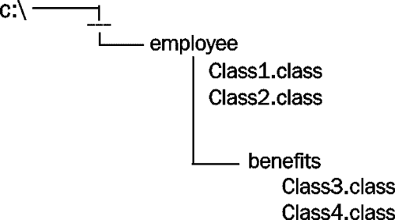
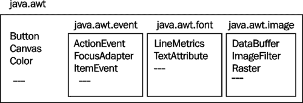
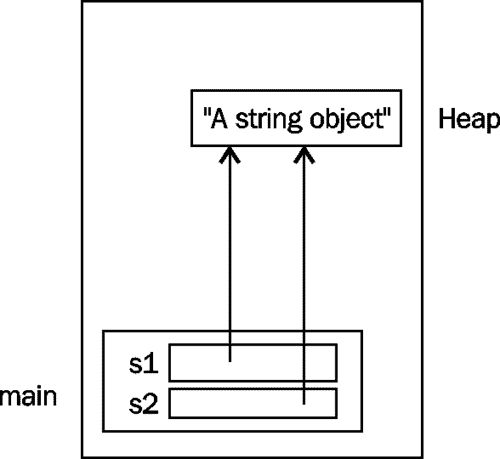
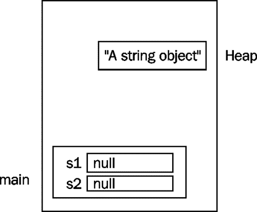
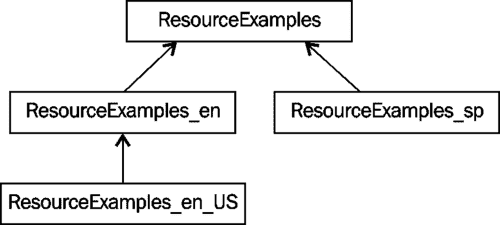

# 九、Java 应用

在本章中，我们将从包的角度研究 Java 应用的结构。将介绍包和导入语句的使用，以及用于包的底层目录结构。

我们还将看到 Java 如何通过使用区域设置和资源包来支持国际化。将介绍 JDBC 的使用，以及如何回收未使用的对象。这通常被称为**垃圾收集**。

# 代码组织

代码的组织是应用的重要组成部分。我们甚至可以说，正是这个组织（以及数据组织）决定了应用的质量。

Java 应用是围绕包组织的。包包含类。类包含数据和代码。代码可以在初始值设定项列表或方法中找到。该基本组织如下图所示：


代码在本质上可以被认为是静态和动态的。Java 程序的组织是围绕包、类、接口、初始值设定项列表和方法静态构建的。该组织中唯一的变化来自于执行程序的不同版本。然而，当一个程序执行时，无数不同的可能执行路径会导致一个复杂的执行序列。

JavaAPI 被组织成数百个类的许多包。定期添加新的包和类，这使得跟上 Java 的所有功能变得非常困难。

然而，正如[第 7 章](07.html "Chapter 7. Inheritance and Polymorphism")*继承和多态*中*对象类*部分所述，Java 中的所有类都有一个基类-`java.lang`。`Object`-直接或间接。在您定义的类中，如果不显式扩展另一个类，Java 将自动从`Object`类扩展该类。

## 包装

包的目的是将相关类和其他元素组合在一起。理想情况下，它们形成一组内聚的类和接口。包可以包括：

*   类别
*   接口
*   枚举数
*   例外情况

很自然，具有类似功能的类应该以某种方式组合在一起。大多数 Java 的 IO 类都被分组在`java.io`或`java.nio`相关包中。所有 Java 的网络类都可以在`java.net`包中找到。这种分组机制为我们提供了一种更易于讨论和使用的单一逻辑分组。

所有类都属于一个包。如果未指定包，则该类属于未命名的默认包。此包由目录中未声明为属于包的所有类组成。

## 包的目录/文件组织

要在包中放置类，必须：

*   在类源文件中使用 package 语句
*   将对应的`.class`文件移动到包目录

package 语句必须是类的源文件中的第一条语句。该语句由关键字`package`组成，后跟包的名称。下面的示例声明类`Phone`属于`acme.telephony`包：

```java
package acme.telephony;

class Phone {
   …
}
```

Java 源代码文件放在一个文件中，该文件与使用`.java`扩展名的类同名。如果文件中保存了多个类，则只能将一个类声明为公共类，并且文件必须以该公共类命名。`java.lang`包包含许多常用类，并自动包含在每个应用中。

第二个要求是将类文件移动到适当的包目录。在系统的某个地方必须存在一个反映包名的目录结构。例如，对于包名`employee.benefits`，需要有一个名为`employee`的目录，该目录的子目录名为`benefits`。`employee`包的所有类文件都放在`employee`目录中。`employee.benefits`包的所有类文件都放在`benefits`子目录中。如下图所示，目录和文件位于`C`驱动器的某个地方：



您还可能会发现，包的目录和类被压缩到一个**Java 归档**（**JAR**）或`.jar`文件中。I 如果您在目录系统中查找特定的包结构，您可能会找到一个 JAR 文件。通过将包压缩到 JAR 文件中，可以最小化内存。如果发现这样的文件，不要解压缩它们，因为 Java 编译器和 JVM 希望它们位于 JAR 文件中。

大多数 IDE 都会将源文件与类文件分开放置在不同的目录中。这种分离使它们更易于使用和部署。

## 进口声明

`import`语句向编译器提供了在哪里可以找到程序中使用的类的定义的信息。关于我们将审查的进口声明，有几个考虑因素：

*   它的使用是可选的
*   使用通配符
*   访问具有相同名称的多个类
*   静态导入语句

### 避免进口声明

`import`语句是可选语句。在下面的示例中，我们不使用`BigDecimal`类的`import`语句，而是直接在代码中显式使用包名：

```java
private java.math.BigDecimal balance;
     …
this.balance = new java.math.BigDecimal("0");
```

这更为冗长，但更具表现力。毫无疑问，`BigDecimal`类就是在`java.math`包中找到的。然而，如果我们在程序中多次使用该类，那么这将成为一个麻烦。通常使用`import`语句。

### 使用导入语句

为了避免必须在每个类前面加上它的包名，`import`语句可用于向编译器指示在哪里可以找到该类。在本例中，可以使用`java.io`包的类`BufferedReader`，而无需在每次使用类名之前加上其包名：

```java
import java.io.BufferReader;
   …
   BufferedReader br = new BufferedReader();
```

### 使用通配符

如果需要使用多个类，并且在同一个包中找到它们，则可以使用星号，而不是包含多个导入语句，每个类一个。例如，如果我们需要在应用中同时使用`BufferedReader`和`BufferedWriter`类，我们可以使用两个导入语句，如下所示：

```java
import java.io.BufferedReader;
import java.io.BufferedWriter;
```

通过显式列出每个类，代码的读者将立即知道在哪里可以找到该类。否则，当通配符与多个导入语句一起使用时，读者可能会猜测类来自哪个包。

虽然每个类的显式导入都是更好的文档，但导入列表可能会很长。大多数 IDE 都支持折叠或隐藏列表的功能。

另一种方法是使用一条带星号的导入语句，如下所示：

```java
import java.io.*;
```

现在可以使用包的所有元素，而无需使用包名称。然而，这并不意味着子包的类可以以相同的方式使用。例如，有许多以`java.awt`开头的包。下图显示了其中一些及其部分元素：



当针对“基本”包使用时，通配符似乎应该包括这些附加包中的类，如以下代码所示：

```java
import java.awt.*;
```

但是，它只导入`java.awt`包中的类，而不导入`java.awt.font`或类似包中的类。为了同时引用`java.awt.font`的所有类别，还需要第二条导入语句：

```java
import java.awt.*;
import java.awt.font.*;
```

### 多个同名类

由于在不同的包中可能有多个具有相同名称的类，因此 import 语句用于指定要使用的类。但是，第二个类需要显式使用包名。

例如，假设我们在`com.company.account`包中创建了一个`BigDecimal`类，我们需要使用它和`java.math.BigDecimal`类。我们不能对这两个类使用导入，如下面的代码段所示，因为这将生成语法错误，导致名称冲突。

```java
import java.math.BigDecimal;
import com.company.customer.BigDecimal;
```

相反，我们需要：

*   Declare one using the import statement and explicitly prefix the class name of the second when we use it, or

    D 根本不使用 import 语句，并在使用这两个类时显式地为它们加前缀

假设我们使用`import`语句和`java.math`类，我们在代码中使用这两个类，如下所示：

```java
this.balance = new BigDecimal("0");
com.company.customer.BigDecimal secondary = 
   new com.company.customer.BigDecimal();
```

请注意，我们必须在第二条语句中为`BigDecimal`的两个用法加前缀，否则它会假定未加前缀的用法在生成类型不匹配语法错误的`java.math`包中。

### 静态导入语句

静态导入语句可用于简化方法的使用。这通常与`println`方法结合使用。在下面的示例中，我们多次使用`println`方法：

```java
System.out.println("Employee Information");
System.out.println("Name: ");
System.out.println("Department: ");
System.out.println("Pay grade: ");
```

在每种情况下，都需要类名`System`。但是，如果我们使用下面的`import`语句添加`static`关键字，我们将不需要使用`System`类名：

```java
import static java.lang.System.out;
```

以下代码语句序列可获得相同的结果：

```java
out.println("Employee Information");
out.println("Name: ");
out.println("Department: ");
out.println("Pay grade: ");   
```

虽然这种方法可以节省键入的时间，但对于不了解静态导入语句用法的任何人来说，都可能会感到困惑。

## 垃圾收集

Java 执行自动垃圾收集。当使用`new`关键字分配内存时，从程序堆获取内存。这是程序堆栈上方的内存区域。分配的对象由程序保留，直到程序将其释放。这是通过删除对对象的所有引用来完成的。一旦释放，垃圾收集例程最终将运行并回收对象分配的内存。

下面的代码序列说明了如何创建`String`对象。然后将其分配给第二个参考变量：

```java
String s1 = new String("A string object");
String s2 = s1;
```

此时，`s1`和`s2`都引用字符串对象。下图说明了`s1`和`s2`的内存分配：



在这种情况下使用了`new`关键字，以确保从堆中分配字符串对象。如果我们使用了字符串文字，如下图所示，对象被分配到一个内部池，如[第 2 章](02.html "Chapter 2. Java Data Types and Their Usage")*Java 数据类型及其用法*中的*字符串比较*部分所述：

```java
String s1 = "A string object";
```

下面两条语句说明了如何删除对对象的引用：

```java
s1 = null;
s2 = null;
```

下图显示了执行这些语句后应用的状态：



存在一个 JVM 后台线程，它定期执行以回收未使用的对象。在将来的某个点，线程将执行。当对象准备好回收时，线程将执行以下操作：

*   执行方法的`finalize`方法
*   回收内存以供堆管理器重用

`finalize`方法通常不是由开发人员实现的。它的最初意图是对应于 C++等语言中的析构函数。它们被用来执行清理活动。

在 Java 中，您不应该依赖该方法来执行。对于小程序，垃圾收集例程可能永远不会运行，因为程序可能会在有机会执行之前终止。在过去的几年中，已经有人尝试为程序员提供强制执行方法的能力。这些尝试都没有成功。

# 资源包和 Locale 类

`Locale`类是用来代表世界的一部分。与区域设置关联的是一组与诸如控制货币或日期显示方式等活动有关的约定。区域设置的使用有助于应用的国际化。开发人员指定区域设置，然后在应用的各个部分中使用该区域设置。

除了`Locale`类之外，我们还可以使用资源束。它们提供了一种方法，可以根据除数字和日期以外的数据类型的区域设置自定义外观。它在处理基于区域设置更改的字符串时特别有用。

例如，GUI 应用将具有不同的可视组件，在世界不同地区使用时，这些组件的文本应该不同。在西班牙，文本和货币应以西班牙语显示。在中国，应该使用汉字和惯例。使用地区可以简化应用适应世界不同地区的过程。

在本节中，我们将讨论用于支持应用国际化的三种方法：

*   使用`Locale`类
*   使用属性资源文件
*   使用`ListResourceBundle`类

## 使用 Locale 类

为了说明语言环境的使用，我们首先创建一个`Locale`类的实例。此类具有许多预定义的区域设置常量。在以下示例中，我们将为美国创建一个区域设置，然后显示该区域设置：

```java
Locale locale;

locale = Locale.US;
System.out.println(locale);
```

输出如下所示：

```java
en_US

```

第一部分`en_`是英语的缩写。第二部分具体说明我们。如果我们将区域设置更改为德国，如下所示：

```java
locale = Locale.GERMANY;
System.out.println(locale);
```

您将获得以下输出：

```java
de_DE

```

您可以使用区域设置来格式化货币值。在下面的示例中，我们使用静态`getCurrencyInstance`方法返回一个`NumberFormat`类的实例，该类使用美国的语言环境。然后使用`format`方法`format`生成一个双倍数字：

```java
NumberFormat currencyFormatter = 
   NumberFormat.getCurrencyInstance(Locale.US);
System.out.println(currencyFormatter.format(23.45));
```

输出如下所示：

```java
$23.45

```

如果我们使用德国语言环境，我们将得到以下输出：

```java
23,45 €

```

日期也可以根据区域设置进行格式化。下面的代码片段中使用了`DateFormat`类“`getDateInstance`方法，语言环境为 US。`format`方法使用`Date`对象获取日期的字符串表示，如以下代码段所示：

```java
DateFormat dateFormatter = 
   DateFormat.getDateInstance(DateFormat.LONG, Locale.US);
System.out.println(dateFormatter.format(new Date()));
```

输出类似于以下输出：

```java
May 2, 2012

```

在以下代码片段中，我们将使用法国的语言环境：

```java
dateFormatter = DateFormat.getDateInstance(
   DateFormat.LONG, Locale.FRANCE);
System.out.println(dateFormatter.format(new Date()));
```

此示例的输出如下所示：

```java
2 mai 2012

```

## 使用资源包

资源束是由区域设置组织的对象的集合。例如，我们可能有一个资源包，其中包含英语使用者的字符串和 GUI 组件，另一个资源包包含西班牙语使用者的字符串和 GUI 组件。这些语言群体可进一步分为语言亚群体，如美国和加拿大英语使用者。

资源束可以存储为文件，也可以定义为类。属性资源束存储在`.properties`文件中，并且仅限于字符串。`ListResourceBundle`是一个类，可以容纳字符串和其他对象。

### 使用属性资源包

属性资源包是由一组键值字符串对组成的文件，其中文件名以`.properties`结尾。字符串键用于标识特定的字符串值。例如，`WINDOW_CAPTION`键可以与字符串值`Editor`关联。`ResourceExamples.properties`文件的内容如下：

```java
WINDOW_CAPTION=Editor
FILE_NOT_FOUND=The file could not be found
FILE_EXISTS=The file already exists
UNKNOWN=Unknown problem with application

```

要访问资源文件中的值，我们需要创建一个`ResourceBundle`类的实例。我们可以使用`ResourceBundle`类的静态`getBundle`方法来实现这一点，如下面的代码片段所示。请注意，资源文件名用作该方法的参数，但不包括文件扩展名。如果我们知道该键，我们可以使用`getString`方法返回其对应值：

```java
ResourceBundle bundle = ResourceBundle.getBundle(
      "ResourceExamples");
System.out.println("UNKNOWN" + ":" +
      bundle.getString("UNKNOWN"));
```

输出将如下所示：

```java
UNKNOWN:Unknown problem with application

```

我们可以使用`getKeys`方法获得`Enumeration`对象。如以下代码段所示，使用枚举来显示文件的所有键值对：

```java
ResourceBundle bundle = ResourceBundle.getBundle(
      "ResourceExamples");

Enumeration keys = bundle.getKeys();
while (keys.hasMoreElements()) {
   String key = (String) keys.nextElement();
   System.out.println(key + ":" + bundle.getString(key));
}
```

该序列的输出如下所示：

```java
FILE_NOT_FOUND:The US file could not be found
UNKNOWN:Unknown problem with application
FILE_EXISTS:The US file already exists
WINDOW_CAPTION:Editor
```

请注意，输出与`ResourceExamples.properties`文件的顺序或内容不匹配。顺序由枚举控制。对于`FILE_NOT_FOUND`和`FILE_EXISTS`键，内容不同。这是因为它实际上使用了一个不同的文件，`ResourceExamples_en_US.properties`。属性资源束之间存在层次关系。代码序列是使用默认的 US 语言环境执行的。系统查找`ResourceExamples_en_US.properties`文件，因为它表示特定于该语言环境的字符串。资源文件中任何缺少的元素都从其“基本”文件继承。

我们将创建四个不同的资源束文件，以说明资源束的使用以及它们之间的层次关系：

*   `ResourceExamples.properties`
*   `ResourceExamples_en.properties`
*   `ResourceExamples_en_US.properties`
*   `ResourceExamples_sp.properties`

如下图所示，它们在层次上相互关联：



这些文件将包含下表中总结的四个键的字符串：

<colgroup><col style="text-align: left"> <col style="text-align: left"> <col style="text-align: left"></colgroup> 
| 

文件

 | 

钥匙

 | 

价值

 |
| --- | --- | --- |
|   | `WINDOW_CAPTION` | 编辑 |
| `FILE_NOT_FOUND` | 找不到该文件 |
| `FILE_EXISTS` | 该文件已存在 |
| `UNKNOWN` | 应用中的未知问题 |
| `en` | `WINDOW_CAPTION` | 编辑 |
| `FILE_NOT_FOUND` | 找不到英文文件 |
| `UNKNOWN` | 应用中的未知问题 |
| `en_US` | `WINDOW_CAPTION` | 编辑 |
| `FILE_NOT_FOUND` | 找不到美国文件 |
| `FILE_EXISTS` | 美国文件已经存在 |
| `UNKNOWN` | 应用中的未知问题 |
| `sp` | `FILE_NOT_FOUND` | 埃尔阿奇沃无东南普多中心酒店 |
| `FILE_EXISTS` | 艾尔阿奇沃酒店 |
| `UNKNOWN` | 关于 aplicación 的描述问题 |

`en`条目缺少`FILE_EXISTS`键的值，`sp`条目缺少`WINDOW_CAPTION`键值。它们将继承默认资源文件的值，如下所示的`en`语言环境：

```java
bundle = ResourceBundle.getBundle("ResourceExamples",
      new Locale("en"));
System.out.println("en");
keys = bundle.getKeys();
while (keys.hasMoreElements()) {
   String key = (String) keys.nextElement();
   System.out.println(key + ":" + bundle.getString(key));
}
```

输出列出了`FILE_EXISTS`的值，即使在`ResourceExamples_en.properties`文件中找不到该值：

```java
en
WINDOW_CAPTION:Editor
FILE_NOT_FOUND:The English file could not be found
UNKNOWN:Unknown problem with application
FILE_EXISTS:The file already exists

```

这些文件的继承行为允许开发人员基于基本文件名创建资源文件的层次结构，然后通过添加区域设置后缀来扩展它们。这将导致自动使用特定于当前区域设置的字符串。如果需要默认语言环境以外的语言环境，则可以指定特定的语言环境。

### 使用 ListResourceBundle 类

`ListResourceBundle`类也用于存放资源。它不仅可以容纳字符串，还可以容纳其他类型的对象。但是，键仍然是字符串值。为了演示这个类的使用，我们将创建从下面列出的`ListResourceBundle`类派生的`ListResource`类。创建包含键值对的静态二维对象数组。请注意，最后一对包含一个`ArrayList`。类“`getContents`方法将资源作为二维对象数组返回：

```java
public class ListResource extends ListResourceBundle {

   @Override
   protected Object[][] getContents() {
      return resources;
   }

   static Object[][] resources = {
      {"FILE_NOT_FOUND", "The file could not be found"},
      {"FILE_EXISTS", "The file already exists"},
      {"UNKNOWN", "Unknown problem with application"},
      {"PREFIXES",new 
            ArrayList(Arrays.asList("Mr.","Ms.","Dr."))}

   };
}
```

创建的`ArrayList`用于存储各种名称前缀。它是使用`asList`方法创建的，该方法被传递一个可变数量的字符串参数，并将`List`返回给`ArrayList`构造器。

下面的代码演示了如何使用`ListResource`。创建一个`ListResource`实例，然后使用字符串键执行`getString`方法。对于`PREFIXES`键，使用`getObject`方法：

```java
System.out.println("ListResource");
ListResource listResource = new ListResource();

System.out.println(
   listResource.getString("FILE_NOT_FOUND"));
System.out.println(
   listResource.getString("FILE_EXISTS"));
System.out.println(listResource.getString("UNKNOWN"));
ArrayList<String> salutations = 
       (ArrayList)listResource.getObject("PREFIXES");
for(String salutation : salutations) {
   System.out.println(salutation);
}

```

该序列的输出如下：

```java
ListResource
The file could not be found
The file already exists
Unknown problem with application
Mr.
Ms.
Dr.
```

# 使用 JDBC

JDBC 用于连接数据库并操作数据库中的表。使用 JDBC 的过程包括以下步骤：

1.  连接到数据库
2.  创建要提交到数据库的 SQL 语句
3.  处理结果和可能产生的任何异常

在 Java7 中，JDBC 的使用得到了增强，添加了 try with resources 块，简化了连接的打开和关闭。在第 8 章中的*使用 try with resource block*一节中可以找到此块的详细说明。

## 连接到数据库

连接到数据库需要两个步骤：

1.  装载合适的驱动器
2.  建立联系

这假设数据库已设置且可访问。在下面的示例中，我们将使用 MySQL 版本 5.5。MySQL 附带了`Sakila`模式，其中包含一个`customer`表。我们将使用此表演示各种 JDBC 技术。

### 加载合适的驱动器

首先我们需要加载一个驱动程序。JDBC 支持许多驱动程序，如[所述 http://developers.sun.com/product/jdbc/drivers](http://developers.sun.com/product/jdbc/drivers) 。在这里，我们将使用`MySQLConnector/J`驱动程序。我们使用`Class`类的`forName`方法加载驱动程序，如下代码片段所示：

```java
try {
   Class.forName(
            "com.mysql.jdbc.Driver").newInstance();
} catch (InstantiationException | 
         IllegalAccessException |
         ClassNotFoundException e) {
   e.printStackTrace();
}
```

该方法抛出了几个需要捕获的异常。

请注意，从 JDBC4.0 开始，假设使用的 JDBC 驱动程序支持 JDBC4.0，则不再需要上述序列。MySQL 5.5 版使用的 MySQL 驱动程序就是这样。这里使用此序列是因为您可能会在较旧的程序中遇到此方法。

### 建立连接

接下来，需要建立到数据库的连接。`java.sql.Connection`表示与数据库的连接。`DriverManager`类的静态`getConnection`方法将返回到数据库的连接。其论据包括：

*   表示数据库的 URL
*   用户 ID
*   密码

以下代码序列将使用 try with resources 块建立到数据库的连接。第一个参数是 MySQL 特定的连接字符串。连接字符串是特定于供应商的：

```java
try (Connection connection = DriverManager.getConnection(
      "jdbc:mysql://localhost:3306/", "id", "password")) {
         ...
} catch (SQLException e) {
   e.printStackTrace();
}
```

## 创建 SQL 语句

接下来，我们需要创建一个用于执行查询的对象。`Connection`类的`createStatement`方法将返回一个`Statement`对象。我们将其添加到“尝试使用资源”块以创建对象：

```java
try (Connection connection = DriverManager.getConnection(
      "jdbc:mysql://localhost:3306/", "root", "explore");
     Statement statement = connection.createStatement()) {
      ...
} catch (SQLException e) {
   e.printStackTrace();
}
```

然后形成一个查询字符串，用于选择`customer`表中`address_id`小于 10 的客户的名字和姓氏。我们选择此查询以最小化结果集的大小。`executeQuery` 方法用于执行查询并返回一个`ResultSet`对象，该对象保存与所选查询匹配的表行：

```java
try (Connection connection = DriverManager.getConnection(
      "jdbc:mysql://localhost:3306/", "root", "explore");
     Statement statement = connection.createStatement()) {
      String query = "select first_name, last_name"
         + " from sakila.customer "
         + "where address_id < 10";
      try (ResultSet resultset = 
                        statement.executeQuery(query)) {
         ...
      }
         ...
} catch (SQLException e) {
   e.printStackTrace();
}
```

## 处理结果

最后一步是使用 while 循环迭代结果集并显示返回的行。在以下示例中，`next`方法将在`resultset`中从一行前进到另一行。`getString`方法返回与指定要访问的列的方法参数对应的值：

```java
try (Connection connection = DriverManager.getConnection(
      "jdbc:mysql://localhost:3306/", "root", "explore");
     Statement statement = connection.createStatement()) {
      String query = "select first_name, last_name"
         + " from sakila.customer "
         + "where address_id < 10";
      try (ResultSet resultset = 
                        statement.executeQuery(query)) {
         while (resultset.next()) {
            String firstName = 
                       resultset.getString("first_name");
            String lastName = 
                       resultset.getString("last_name");
            System.out.println(firstName + " " + lastName);
         }
      }
} catch (SQLException e) {
   e.printStackTrace();
}
```

结果如下：

```java
MARY SMITH
PATRICIA JOHNSON
LINDA WILLIAMS
BARBARA JONES
ELIZABETH BROWN

```

JDBC 支持使用其他 SQL 语句，如`update`和`delete`。此外，它还支持使用参数化查询和存储过程。

# 总结

在本章中，我们重新检查了 Java 应用的总体结构。我们检查了`import`和`package`语句的使用，并讨论了包库与其支持的目录/文件基础之间的关系。我们学习了如何在`import`语句中使用星号通配符。此外，我们还看到了静态导入语句的使用。

我们讨论了初始值设定项列表的使用以及垃圾收集在 Java 中的工作方式。此过程可在不再需要对象时自动恢复对象。

从`Locale`类开始，然后从资源束开始，探索为国际化提供的支持。财产资源包和`ListResourceBundle`类都包括在内。我们了解了当使用一致的命名约定进行组织时，继承如何与属性资源束一起工作。

最后，我们介绍了 JDBC 的使用。我们了解了如何需要驱动程序来建立与数据库的连接，以及如何使用`Statement`类检索`ResultSet`对象。这个对象允许我们遍历`select`查询返回的行。

# 涵盖的认证目标

本章涵盖的认证目标包括：

*   定义 Java 类的结构
*   基于区域设置选择资源包
*   使用适当的 JDBCAPI 提交查询并从数据库读取结果。

# 测试你的知识

1.  Which of the following will compile without an error?

    A.`package somepackage;`

    `import java.nio.*;`

    `class SomeClass {}`

    B`import java.nio.*;`

    `package somepackage;`

    `class SomeClass {}`

    C`/*This is a comment */`

    `package somepackage;`

    `import java.nio.*;`

    `class SomeClass {}`

2.  For a hierarchy of a resource property file, if a key is missing from one of the derived files, which of the following are true about the value returned, based on a missing key?

    A.返回值将是一个空字符串

    B 返回值将为空值

    C 返回值将是基本资源束中的字符串

    D 将引发运行时异常

3.  Which exception is not thrown by the `forName` method:

    A.`InstantiationException`

    B`ClassNotFoundException`

    C`ClassDoesNotExistException`

    D`IllegalAccessException`