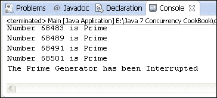
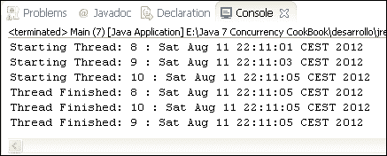
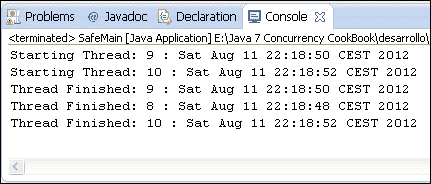

# 第一章线程管理

在本章中，我们将介绍：

*   创建和运行线程
*   获取和设置线程信息
*   中断线程
*   控制线程的中断
*   睡眠和恢复线程
*   正在等待线程的终结
*   创建和运行守护进程线程
*   在线程中处理非受控异常
*   使用局部线程变量
*   将线程分组为一个组
*   在一组线程中处理非受控异常
*   通过工厂创建线程

# 导言

在计算机世界中，当我们谈论**并发**时，我们谈论的是在计算机中同时运行的一系列任务。如果计算机有多个处理器或多核处理器，这种同时性可能是真实的；如果计算机只有一个核心处理器，这种同时性可能是明显的。

所有现代操作系统都允许执行并发任务。你可以一边听音乐，一边阅读网页上的新闻，一边阅读电子邮件。可以说这种并发是一种**进程级**并发。但在一个过程中，我们也可以同时执行各种任务。在进程内运行的并发任务称为**线程**。

与并发相关的另一个概念是**并行**。并发概念有不同的定义和关系。一些作者谈到在单核处理器中使用多个线程执行应用程序时的并发性，因此您可以同时看到程序的执行情况。此外，当您在多核处理器或具有多个处理器的计算机中使用多个线程执行应用程序时，您还可以讨论并行性。其他作者讨论了应用程序线程在没有预定义顺序的情况下执行时的并发性，以及使用各种线程简化问题解决方案时的并行性，其中所有这些线程都是按顺序执行的。

本章介绍了一些说明如何使用 Java7API 对线程执行基本操作的方法。您将看到如何在 Java 程序中创建和运行线程，如何控制线程的执行，以及如何将一些线程分组以作为一个单元进行操作。

# 创建并运行线程

在这个配方中，我们将学习如何在 Java 应用程序中创建和运行线程。与 Java 语言中的每个元素一样，线程是**对象**。我们有两种在 Java 中创建线程的方法：

*   扩展`Thread`类并重写`run()`方法
*   构建一个实现`Runnable`接口的类，然后创建一个`Thread`类的对象，将`Runnable`对象作为参数传递

在此配方中，我们将使用第二种方法创建一个简单的程序，该程序创建并运行 10 个线程。每个线程计算并打印 1 到 10 之间的数字的乘法表。

## 准备好了吗

此配方的示例已使用 EclipseIDE 实现。如果您使用 Eclipse 或其他 IDE（如 NetBeans），请打开它并创建一个新的 Java 项目。

## 怎么做。。。

按照以下步骤来实现该示例：

1.  创建一个名为`Calculator`的类来实现`Runnable`接口。

    ```java
    public class Calculator implements Runnable {
    ```

2.  声明名为`number`的`private``int`属性，并实现初始化其值的类的构造函数。

    ```java
      private int number;
      public Calculator(int number) {
        this.number=number;
      }
    ```

3.  执行`run()`方法。此方法将执行我们正在创建的线程的指令，因此此方法将计算数字的乘法表。

    ```java
      @Override
      public void run() {
        for (int i=1; i<=10; i++){
          System.out.printf("%s: %d * %d = %d\n",Thread.currentThread().getName(),number,i,i*number);
        }
      }
    ```

4.  现在，实现应用程序的主类。创建一个名为`Main`的类，该类包含`main()`方法。

    ```java
    public class Main {
      public static void main(String[] args) {
    ```

5.  在`main()`方法内部，创建一个包含 10 次迭代的`for`循环。在循环内部，创建一个`Calculator`类的对象，一个`Thread`类的对象，将`Calculator`对象作为参数传递，调用 thread 对象的`start()`方法。

    ```java
        for (int i=1; i<=10; i++){
          Calculator calculator=new Calculator(i);
          Thread thread=new Thread(calculator);
          thread.start();
        }
    ```

6.  运行程序并查看不同线程如何并行工作。

## 它是如何工作的。。。

下面的屏幕截图显示了程序的部分输出。我们可以看到，我们创建的所有线程都并行运行以完成其工作，如以下屏幕截图所示：


每个 Java 程序至少有一个执行线程。当您运行程序时，JVM 运行这个调用程序的`main()`方法的执行线程。

当我们调用`Thread`对象的`start()`方法时，我们正在创建另一个执行线程。我们的程序将拥有与调用`start()`方法一样多的执行线程。

Java 程序在其所有线程完成时结束（更具体地说，在其所有非守护进程线程完成时）。如果初始线程（执行`main()`方法的线程）结束，其余线程将继续执行，直到完成。如果其中一个线程使用`System.exit()`指令结束程序的执行，则所有线程都将结束其执行。

创建`Thread`类的对象不会创建新的执行线程。此外，调用实现`Runnable`接口的类的`run()`方法不会创建新的执行线程。只有调用`start()`方法才能创建新的执行线程。

## 还有更多。。。

正如我们在介绍本配方时提到的，还有另一种创建新执行线程的方法。您可以实现一个扩展`Thread`类并重写该类的`run()`方法的类。然后，您可以创建这个类的一个对象，并调用`start()`方法来拥有一个新的执行线程。

## 另见

*   [第一章](1.html "Chapter 1. Thread Management")*线程管理*中的*通过工厂*配方创建线程

# 获取和设置线程信息

`Thread`类保存了一些信息属性，这些属性可以帮助我们识别线程、了解其状态或控制其优先级。这些属性是：

*   **ID**：此属性为每个`Thread`存储一个唯一的标识符。
*   **名称**：此属性存储`Thread`的名称。
*   **优先级**：该属性存储`Thread`对象的优先级。线程的优先级可以在 1 到 10 之间，其中 1 是最低优先级，10 是最高优先级。不建议更改线程的优先级，但如果需要，也可以使用。
*   **状态**：该属性存储`Thread`的状态。在 Java 中，`Thread`可以处于以下六种状态之一：`new`、`runnable`、`blocked`、`waiting`、`time``waiting`或`terminated`。

在这个配方中，我们将开发一个程序，为 10 个线程建立名称和优先级，然后显示它们的状态信息，直到它们完成。线程将计算一个数字的乘法表。

## 准备好了吗

此配方的示例已使用 EclipseIDE 实现。如果您使用 Eclipse 或其他 IDE（如 NetBeans），请打开它并创建一个新的 Java 项目。

## 怎么做。。。

按照以下步骤执行示例：

1.  创建一个名为`Calculator`的类，并指定它实现`Runnable`接口。

    ```java
    public class Calculator implements Runnable {
    ```

2.  声明名为`number`的`int``private`属性，并实现初始化该属性的类的构造函数。

    ```java
      private int number;
      public Calculator(int number) {
        this.number=number;
      }
    ```

3.  `run()`实现方法。此方法将执行我们正在创建的线程的指令，因此此方法将计算并打印一个数字的乘法表。

    ```java
      @Override
      public void run() {
        for (int i=1; i<=10; i++){
          System.out.printf("%s: %d * %d = %d\n",Thread.currentThread().getName(),number,i,i*number);
        }
      }
    ```

4.  现在，我们实现这个示例的主类。创建一个名为`Main`的类并实现`main()`方法。

    ```java
    public class Main {
      public static void main(String[] args) {
    ```

5.  创建一个 10`threads`和 10`Thread.State`的数组来存储我们要执行的线程及其状态。

    ```java
        Thread threads[]=new Thread[10];
        Thread.State status[]=new Thread.State[10];
    ```

6.  创建 10 个`Calculator`类的对象，每个对象用不同的数字初始化，10 个`threads`运行它们。将其中五个的优先级设置为最大值，将其余优先级设置为最小值。

    ```java
        for (int i=0; i<10; i++){
          threads[i]=new Thread(new Calculator(i));
          if ((i%2)==0){
            threads[i].setPriority(Thread.MAX_PRIORITY);
          } else {
            threads[i].setPriority(Thread.MIN_PRIORITY);
          }
          threads[i].setName("Thread "+i);
        }
    ```

7.  创建一个`PrintWriter`对象，将线程状态的演变写入文件。

    ```java
        try (FileWriter file = new FileWriter(".\\data\\log.txt");
    PrintWriter pw = new PrintWriter(file);){
    ```

8.  在该文件上写入 10`threads`的状态。现在变成了`NEW`。

    ```java
          for (int i=0; i<10; i++){
    pw.println("Main : Status of Thread "+i+" : "  +             threads[i].getState());
            status[i]=threads[i].getState();
          }
    ```

9.  开始执行 10`threads`。

    ```java
          for (int i=0; i<10; i++){
            threads[i].start();
          }
    ```

10.  直到 10`threads`结束，我们将检查他们的状态。如果我们检测到线程状态的变化，我们会将它们写入文件中。

    ```java
          boolean finish=false;
          while (!finish) {
            for (int i=0; i<10; i++){
              if (threads[i].getState()!=status[i]) {
                writeThreadInfo(pw, threads[i],status[i]);
                status[i]=threads[i].getState();
              }
            }      
            finish=true;
            for (int i=0; i<10; i++){
    finish=finish &&(threads[i].getState()==State.TERMINATED);
            }
          }
    ```

11.  实现写入`Thread`的 ID、名称、优先级、旧状态、新状态的`writeThreadInfo()`方法。

    ```java
      private static void writeThreadInfo(PrintWriter pw, Thread thread, State state) {
    pw.printf("Main : Id %d - %s\n",thread.getId(),thread.getName());
    pw.printf("Main : Priority: %d\n",thread.getPriority());
    pw.printf("Main : Old State: %s\n",state);
    pw.printf("Main : New State: %s\n",thread.getState());
    pw.printf("Main : ************************************\n");
      }
    ```

12.  运行该示例并打开`log.txt`文件以查看 10`threads`的演变。

## 它是如何工作的。。。

下面的屏幕截图显示了执行此程序时`log.txt`文件的一些行。在这个文件中，我们可以看到优先级最高的线程在优先级最低的线程之前结束。我们还可以看到每个线程状态的演变。


控制台中显示的程序是由线程计算的乘法表和文件`log.txt`中不同线程状态的演变。通过这种方式，您可以更好地看到线程的演变。

类`Thread`具有存储线程所有信息的属性。JVM 使用线程的优先级来选择每时每刻使用 CPU 的线程，并根据其情况实现每个线程的状态。

如果没有为线程指定名称，JVM 会自动为其分配一个名称，格式为 thread XX，其中 XX 是一个数字。不能修改线程的 ID 或状态。`Thread`类没有实现`setId()`和`setStatus()`方法来允许修改它们。

## 还有更多。。。

在这个配方中，您学习了如何使用`Thread`对象访问信息属性。但您也可以从`Runnable`接口的实现中访问这些属性。您可以使用`Thread`类的静态方法`currentThread()`访问运行`Runnable`对象的`Thread`对象。

您必须考虑到，如果您试图建立一个不在 1 和 10 之间的优先级，那么`setPriority()`方法可能会抛出一个`IllegalArgumentException`异常。

## 另见

*   [第一章](1.html "Chapter 1. Thread Management")*线程管理*中的*中断线程*配方

# 中断线程

具有多个执行线程的 Java 程序仅在其所有线程的执行结束时完成（更具体地说，当其所有非守护进程线程结束其执行或其中一个线程使用`System.exit()`方法时）。有时，您需要完成一个线程，因为您想要终止一个程序，或者当程序的用户想要取消`Thread`对象正在执行的任务时。

Java 提供了中断机制来向线程指示我们要完成它。该机制的一个特点是`Thread`必须检查它是否被中断，并且它可以决定它是否响应终结请求。`Thread`可以忽略它并继续执行。

在本配方中，我们将开发一个程序，创建`Thread`，并在 5 秒后使用中断机制强制其完成。

## 准备好了吗

此配方的示例已使用 EclipseIDE 实现。如果您使用 Eclipse 或其他 IDE（如 NetBeans），请打开它并创建一个新的 Java 项目。

## 怎么做。。。

按照以下步骤来实现该示例：

1.  创建一个名为`PrimeGenerator`的类来扩展`Thread`类。

    ```java
    public class PrimeGenerator extends Thread{
    ```

2.  覆盖`run()`方法，包括将无限期运行的循环。在这个循环中，我们将处理从 1 开始的连续数字。对于每个数字，我们将计算它是否是素数，在这种情况下，我们将把它写入控制台。

    ```java
      @Override
      public void run() {
        long number=1L;
        while (true) {
          if (isPrime(number)) {
            System.out.printf("Number %d is Prime",number);
          }
    ```

3.  处理号后，调用`isInterrupted()`方法检查线程是否中断。如果此方法返回`true`，我们将编写一条消息并结束线程的执行。

    ```java
          if (isInterrupted()) {
            System.out.printf("The Prime Generator has been Interrupted");
            return;
          }
          number++;
        }
      }
    ```

4.  执行`isPrime()`方法。它返回一个`boolean`值，指示作为参数接收的数字是否为质数（`true`）或非质数（`false`）。

    ```java
      private boolean isPrime(long number) {
        if (number <=2) {
          return true;
        }
        for (long i=2; i<number; i++){
          if ((number % i)==0) {
            return false;
          }
        }
        return true;
      }
    ```

5.  现在，通过实现一个名为`Main`的类并实现`main()`方法来实现示例的主类。

    ```java
    public class Main {
      public static void main(String[] args) {
    ```

6.  创建并启动`PrimeGenerator`类的对象。

    ```java
        Thread task=new PrimeGenerator();
        task.start();
    ```

7.  等待 5 秒，中断`PrimeGenerator`线程。

    ```java
        try {
          Thread.sleep(5000);
        } catch (InterruptedException e) {
          e.printStackTrace();
        }
    task.interrupt();
    ```

8.  运行示例并查看结果。

## 它是如何工作的。。。

下面的屏幕截图显示了上一个示例的执行结果。我们可以看到`PrimeGenerator`线程如何写入消息，并在检测到消息被中断时结束其执行。请参阅以下屏幕截图：



`Thread`类有一个属性，该属性存储一个`boolean`值，该值指示线程是否被中断。调用线程的`interrupt()`方法时，将该属性设置为`true.`，而`isInterrupted()`方法只返回该属性的值。

## 还有更多。。。

`Thread`类有另一种方法来检查`Thread`是否被中断。静态方法`interrupted()`检查当前执行的线程是否被中断。

### 注

`isInterrupted()`和`interrupted()`方法之间有一个重要的区别。第一个不改变`interrupted`属性的值，但第二个将其设置为`false`。由于`interrupted()`法为静态法，建议采用`isInterrupted()`法。

正如我前面提到的，`Thread`可以忽略其中断，但这不是预期的行为。

# 控制线程的中断

在上一个配方中，学习了如何中断线程的执行，以及如何控制`Thread`对象中的中断。如果可以中断的线程很简单，则可以使用上一个示例中所示的机制。但是，如果线程实现了一个分为若干方法的复杂算法，或者它有带递归调用的方法，那么我们可以使用更好的机制来控制线程的中断。Java 为此提供了`InterruptedException`异常。当您检测到线程的中断并在`run()`方法中捕获它时，您可以抛出此异常。

在此配方中，我们将实现在文件夹及其所有子文件夹中查找具有确定名称的文件的`Thread`，以展示如何使用`InterruptedException`异常来控制线程的中断。

## 准备好了吗

此配方的示例已使用 EclipseIDE 实现。如果您使用 Eclipse 或其他 IDE（如 NetBeans），请打开它并创建一个新的 Java 项目。

## 怎么做。。。

按照以下步骤来实现该示例：

1.  创建一个名为`FileSearch`的类，并指定它实现`Runnable`接口。

    ```java
    public class FileSearch implements Runnable {
    ```

2.  声明两个`private`属性，一个用于我们要搜索的文件名，另一个用于初始文件夹。实现类的构造函数，该构造函数初始化这些属性。

    ```java
      private String initPath;
      private String fileName;
      public FileSearch(String initPath, String fileName) {
        this.initPath = initPath;
        this.fileName = fileName;
      }
    ```

3.  实现`FileSearch`类的`run()`方法。它检查属性`fileName`是否是目录，如果是，则调用方法`processDirectory()`。这个方法会抛出一个`InterruptedException`异常，所以我们必须捕获它们。

    ```java
      @Override
      public void run() {
        File file = new File(initPath);
        if (file.isDirectory()) {
          try {
            directoryProcess(file);
          } catch (InterruptedException e) {
            System.out.printf("%s: The search has been interrupted",Thread.currentThread().getName());
          }
        }
      }
    ```

4.  执行`directoryProcess()`方法。此方法将获取文件夹中的文件和子文件夹并对其进行处理。对于每个目录，该方法将进行递归调用，并将目录作为参数传递。对于每个文件，该方法将调用`fileProcess()`方法。处理完所有文件和文件夹后，该方法检查`Thread`是否被中断，在本例中，抛出`InterruptedException`异常。

    ```java
      private void directoryProcess(File file) throws InterruptedException {
        File list[] = file.listFiles();
        if (list != null) {
          for (int i = 0; i < list.length; i++) {
            if (list[i].isDirectory()) {
              directoryProcess(list[i]);
            } else {
              fileProcess(list[i]);
            }
          }
        }
        if (Thread.interrupted()) {
          throw new InterruptedException();
        }
      }
    ```

5.  执行`processFile()`方法。此方法将比较正在处理的文件名与正在搜索的文件名。如果名称相等，我们将在控制台中写入消息。在这个比较之后，`Thread`将检查它是否被中断，在这种情况下，它抛出一个`InterruptedException`异常。

    ```java
      private void fileProcess(File file) throws InterruptedException {
        if (file.getName().equals(fileName)) {
          System.out.printf("%s : %s\n",Thread.currentThread().getName() ,file.getAbsolutePath());
        }
        if (Thread.interrupted()) {
          throw new InterruptedException();
        }
      }
    ```

6.  现在，让我们实现示例的主类。实现一个名为`Main`的类，该类包含`main()`方法。

    ```java
    public class Main {
      public static void main(String[] args) {
    ```

7.  创建并初始化`FileSearch`类和`Thread`的对象以执行其任务。然后，开始执行`Thread`。

    ```java
        FileSearch searcher=new FileSearch("C:\\","autoexec.bat");
        Thread thread=new Thread(searcher);
        thread.start();
    ```

8.  等待 10 秒并中断`Thread`。

    ```java
        try {
          TimeUnit.SECONDS.sleep(10);
        } catch (InterruptedException e) {
          e.printStackTrace();
        }
        thread.interrupt();
      }
    ```

9.  运行示例并查看结果。

## 它是如何工作的。。。

下面的屏幕截图显示了执行此示例的结果。您可以看到`FileSearch`对象在检测到被中断时是如何结束其执行的。请参阅以下屏幕截图：


在本例中，我们使用 Java 异常来控制`Thread`的中断。当您运行该示例时，程序通过检查文件夹中是否有该文件来开始遍历文件夹。例如，如果您在文件夹`\b\c\d`中输入，程序将对`processDirectory()`方法进行三次递归调用。当它检测到它被中断时，它抛出一个`InterruptedException`异常，并在`run()`方法中继续执行，无论进行了多少次递归调用。

## 还有更多。。。

`InterruptedException`异常是由一些与并发 API 相关的 Java 方法引发的，如`sleep()`。

## 另见

*   [第一章](1.html "Chapter 1. Thread Management")*线程管理*中的*中断线程配方*

# 睡眠和恢复线程

有时，您会有兴趣在确定的时间段内中断`Thread`的执行。例如，程序中的线程每分钟检查一次传感器状态。其余时间，线程什么也不做。在此期间，线程不使用计算机的任何资源。在此之后，当 JVM 选择执行线程时，线程将准备好继续执行。为此，您可以使用`Thread`类的`sleep()`方法。此方法接收一个整数，因为参数指示线程暂停执行的毫秒数。当休眠时间结束时，当 JVM 为其分配 CPU 时间时，`sleep()`方法调用后，线程继续在指令中执行。

另一种可能性是使用`TimeUnit`枚举元素的`sleep()`方法。此方法使用`Thread`类的`sleep()`方法将当前线程置于睡眠状态，但它接收以其表示的单位表示的参数并将其转换为毫秒。

在此配方中，我们将开发一个程序，使用`sleep()`方法每秒写入实际日期。

## 准备好了吗

此配方的示例已使用 EclipseIDE 实现。如果您使用 Eclipse 或其他 IDE（如 NetBeans），请打开它并创建一个新的 Java 项目。

## 怎么做。。。

按照以下步骤来实现该示例：

1.  创建一个名为`FileClock`的类，并指定它实现`Runnable`接口。

    ```java
    public class FileClock implements Runnable {
    ```

2.  执行`run()`方法。

    ```java
      @Override
      public void run() {
    ```

3.  写一个 10 次迭代的循环。在每次迭代中，创建一个`Date`对象，将其写入文件，并调用`TimeUnit`类的`SECONDS`属性的`sleep()`方法暂停线程执行一秒钟。使用此值，线程将休眠大约一秒钟。由于`sleep()`方法可以抛出`InterruptedException`异常，因此我们必须包含捕获该异常的代码。一个很好的做法是包含代码，在线程被中断时释放或关闭线程正在使用的资源。

    ```java
        for (int i = 0; i < 10; i++) {
          System.out.printf("%s\n", new Date());
          try {
            TimeUnit.SECONDS.sleep(1);
          } catch (InterruptedException e) {
            System.out.printf("The FileClock has been interrupted");
          }
        }
      }
    ```

4.  我们已经实现了线程。现在，让我们实现示例的主类。创建一个名为`FileMain`的类，该类包含`main()`方法。

    ```java
    public class FileMain {
      public static void main(String[] args) {
    ```

5.  创建一个`FileClock`类的对象和一个线程来执行它。然后，开始执行`Thread`。

    ```java
        FileClock clock=new FileClock();
        Thread thread=new Thread(clock);
        thread.start();
    ```

6.  调用主`Thread`中`TimeUnit`类的秒属性的`sleep()`方法等待 5 秒。

    ```java
        try {
          TimeUnit.SECONDS.sleep(5);
        } catch (InterruptedException e) {
          e.printStackTrace();
        };
    ```

7.  中断`FileClock`线程。

    ```java
        thread.interrupt();
    ```

8.  运行示例并查看结果。

## 它是如何工作的。。。

当您运行该示例时，您可以看到程序是如何每秒写入一个`Date`对象的，然后是指示`FileClock`线程已中断的消息。

调用`sleep()`方法时，`Thread`离开 CPU 并停止执行一段时间。在此期间，它不会占用 CPU 时间，因此 CPU 可以执行其他任务。

当`Thread`处于睡眠状态且被中断时，该方法立即抛出`InterruptedException`异常，并且不等待睡眠时间结束。

## 还有更多。。。

Java 并发 API 有另一种方法可以使`Thread`对象离开 CPU。这是`yield()`方法，它向 JVM 指示`Thread`对象可以离开 CPU 执行其他任务。JVM 不保证它将遵守此请求。通常，它仅用于调试目的。

# 等待线程的终结

在某些情况下，我们将不得不等待线程的终结。例如，我们可能有一个程序，它将在继续执行其余的执行之前开始初始化它所需的资源。我们可以以线程的形式运行初始化任务，并在继续程序的其余部分之前等待其完成。

为此，我们可以使用`Thread`类的`join()`方法。当我们使用 thread 对象调用此方法时，它将暂停调用线程的执行，直到被调用的对象完成其执行。

在本配方中，我们将通过初始化示例学习此方法的使用。

## 准备好了吗

此配方的示例已使用 EclipseIDE 实现。如果您使用 Eclipse 或其他 IDE（如 NetBeans），请打开它并创建一个新的 Java 项目。

## 怎么做。。。

按照以下步骤来实现该示例：

1.  创建一个名为`DataSourcesLoader`的类，并指定它实现`Runnable`接口。

    ```java
    public class DataSourcesLoader implements Runnable {
    ```

2.  执行`run()`方法。它写入一条消息以指示开始执行，休眠 4 秒，并写入另一条消息以指示结束执行。

    ```java
      @Override
      public void run() {
        System.out.printf("Beginning data sources loading: %s\n",new Date());
        try {
          TimeUnit.SECONDS.sleep(4);
        } catch (InterruptedException e) {
          e.printStackTrace();
        }
        System.out.printf("Data sources loading has finished: %s\n",new Date());
      }
    ```

3.  创建一个名为`NetworkConnectionsLoader`的类，并指定它实现`Runnable`接口。实施`run()`方法。它将与`DataSourcesLoader`类的`run()`方法相同，但将休眠 6 秒。
4.  现在，创建一个名为`Main`的类，其中包含`main()`方法。

    ```java
    public class Main {
      public static void main(String[] args) {
    ```

5.  创建一个`DataSourcesLoader`类的对象并`Thread`运行它。

    ```java
        DataSourcesLoader dsLoader = new DataSourcesLoader();
        Thread thread1 = new Thread(dsLoader,"DataSourceThread");
    ```

6.  创建一个`NetworkConnectionsLoader`类的对象并`Thread`运行它。

    ```java
        NetworkConnectionsLoader ncLoader = new NetworkConnectionsLoader();
        Thread thread2 = new Thread(ncLoader,"NetworkConnectionLoader");
    ```

7.  调用两个`Thread`对象的`start()`方法。

    ```java
        thread1.start();
        thread2.start(); 
    ```

8.  使用`join()`方法等待两个线程的终结。这个方法可以抛出一个`InterruptedException`异常，所以我们必须包含捕获它的代码。

    ```java
        try {
          thread1.join();
          thread2.join();
        } catch (InterruptedException e) {
          e.printStackTrace();
        }
    ```

9.  编写一条消息以指示程序结束。

    ```java
        System.out.printf("Main: Configuration has been loaded: %s\n",new Date());
    ```

10.  运行程序并查看结果。

## 它是如何工作的。。。

运行此程序时，可以看到两个`Thread`对象是如何开始执行的。首先，`DataSourcesLoader`线程完成其执行。然后，`NetworkConnectionsLoader`类完成其执行，此时，主`Thread`对象继续执行并写入最终消息。

## 还有更多。。。

Java 提供了两种额外形式的`join()`方法：

*   联接（长毫秒）
*   联接（长毫秒，长纳秒）

在`join()`方法的第一个版本中，调用线程不是无限期地等待被调用线程的终结，而是等待指定为该方法参数的毫秒。例如，如果对象`thread1`有代码`thread2.join(1000)`，线程`thread1`将暂停执行，直到这两个条件之一为真：

*   `thread2`执行完毕
*   已经过了 1000 毫秒

当这两个条件之一为真时，`join()`方法返回。

`join()`方法的第二个版本与第一个类似，但接收毫秒数和纳秒数作为参数。

# 创建并运行守护进程线程

Java 有一种特殊的线程，称为**守护进程**线程。这类线程的优先级非常低，通常仅在同一程序的其他线程未运行时执行。当守护进程线程是程序中运行的唯一线程时，JVM 结束程序并完成这些线程。

有了这些特性，守护进程线程通常被用作在同一程序中运行的正常（也称为用户）线程的服务提供者。它们通常有一个无限循环，等待服务请求或执行线程的任务。他们不能做重要的工作，因为我们不知道他们什么时候有 CPU 时间，如果没有其他线程运行，他们可以随时完成。这类线程的一个典型示例是 Java 垃圾收集器。

在这个配方中，我们将学习如何创建一个守护进程线程，并开发一个具有两个线程的示例；一个用户线程在队列上写入事件，一个守护进程清理队列，删除 10 秒前生成的事件。

## 准备好了吗

此配方的示例已使用 EclipseIDE 实现。如果您使用 Eclipse 或其他 IDE（如 NetBeans），请打开它并创建一个新的 Java 项目。

## 怎么做。。。

按照以下步骤来实现该示例：

1.  创建`Event`类。此类仅存储有关程序将处理的事件的信息。声明两个私有属性，一个称为`java.util.Date`类型的`date`，另一个称为`String`类型的`event`。生成写入和读取其值的方法。
2.  创建`WriterTask`类并指定其实现`Runnable`接口。

    ```java
    public class WriterTask implements Runnable {
    ```

3.  声明存储事件的队列并实现初始化该队列的类的构造函数。

    ```java
    private Deque<Event> deque;
      public WriterTask (Deque<Event> deque){
        this.deque=deque;
      }
    ```

4.  执行本任务的`run()`方法。此方法将有一个 100 次迭代的循环。在每次迭代中，我们创建一个新的`Event`，将其保存在队列中，然后休眠一秒钟。

    ```java
      @Override
      public void run() {
        for (int i=1; i<100; i++) {
          Event event=new Event();
          event.setDate(new Date());
          event.setEvent(String.format("The thread %s has generated an event",Thread.currentThread().getId()));
          deque.addFirst(event);
          try {
            TimeUnit.SECONDS.sleep(1);
          } catch (InterruptedException e) {
            e.printStackTrace();
          }
        }
      }
    ```

5.  创建`CleanerTask`类并指定它扩展`Thread`类。

    ```java
    public class CleanerTask extends Thread {
    ```

6.  声明存储事件的队列并实现初始化此队列的类的构造函数。作为守护进程，在【T3 方法】中标记为`setDaemon()`。

    ```java
      private Deque<Event> deque;
      public CleanerTask(Deque<Event> deque) {
        this.deque = deque;
        setDaemon(true);
      }
    ```

7.  `run()`实现方法。它有一个无限循环，获取实际日期并调用`clean()`方法。

    ```java
      @Override
      public void run() {
        while (true) {
          Date date = new Date();
          clean(date);
        }
      }
    ```

8.  执行`clean()`方法。它获取最后一个事件，如果它是在 10 秒前创建的，它将删除它并检查下一个事件。如果删除了一个事件，它会写入该事件的消息和队列的新大小，这样您就可以看到它的演变。

    ```java
      private void clean(Date date) {
        long difference;
        boolean delete;

        if (deque.size()==0) {
          return;
        }
        delete=false;
        do {
          Event e = deque.getLast();
          difference = date.getTime() - e.getDate().getTime();
          if (difference > 10000) {
            System.out.printf("Cleaner: %s\n",e.getEvent());
            deque.removeLast();
            delete=true;
          }  
        } while (difference > 10000);
        if (delete){
          System.out.printf("Cleaner: Size of the queue: %d\n",deque.size());
        }
      }
    ```

9.  现在，实现主类。使用`main()`方法创建一个名为`Main`的类。

    ```java
    public class Main {
      public static void main(String[] args) {
    ```

10.  使用`Deque`类创建队列来存储事件。

    ```java
        Deque<Event> deque=new ArrayDeque<Event>();
    ```

11.  创建并启动三个`WriterTask`线程和一个`CleanerTask`。

    ```java
        WriterTask writer=new WriterTask(deque);
        for (int i=0; i<3; i++){
          Thread thread=new Thread(writer);
          thread.start();
        }
        CleanerTask cleaner=new CleanerTask(deque);
        cleaner.start();
    ```

12.  运行程序并查看结果。

## 它是如何工作的。。。

如果程序的输出在 30 和 30 之间变化，那么您将看到它的输出在 30 和 30 之间变化。

程序以三个`WriterTask`线程开始。每个`Thread`写入一个事件并休眠一秒钟。在前 10 秒之后，队列中有 30 个线程。在这 10 秒内，`CleanerTasks`一直在执行，而三个`WriterTask`线程处于睡眠状态，但它没有删除任何事件，因为它们都是在不到 10 秒前生成的。在其余执行期间，`CleanerTask`每秒删除三个事件，三个`WriterTask`线程再写入三个事件，因此队列大小在 27 到 30 个事件之间变化。

你可以一直玩到`WriterTask`线程进入睡眠状态。如果使用较小的值，您将看到`CleanerTask`的 CPU 时间较少，队列的大小将增加，因为`CleanerTask`没有删除任何事件。

## 还有更多。。。

在调用`start()`方法之前，只能调用`setDaemon()`方法。线程一旦运行，就不能修改其守护进程状态。

您可以使用`isDaemon()`方法检查线程是守护进程线程（该方法返回`true`）还是用户线程（该方法返回`false)`）。

# 在线程中处理非受控异常

Java 中有两种类型的异常：

*   **检查异常**：这些异常必须在方法的`throws`子句中指定或捕获。例如，`IOException`或`ClassNotFoundException`。
*   **未检查的异常**：不必指定或捕获这些异常。例如，`NumberFormatException`。

当在`Thread`对象的`run()`方法中抛出检查异常时，我们必须捕获并处理它们，因为`run()`方法不接受`throws`子句。当在`Thread`对象的`run()`方法中引发未经检查的异常时，默认行为是在控制台中写入堆栈跟踪并退出程序。

幸运的是，Java 为我们提供了一种机制来捕获和处理`Thread`对象中抛出的未检查异常，以避免程序结束。

在这个食谱中，我们将通过一个例子来学习这个机制。

## 准备好了吗

此配方的示例已使用 EclipseIDE 实现。如果您使用 Eclipse 或其他 IDE（如 NetBeans），请打开它并创建一个新的 Java 项目。

## 怎么做。。。

按照以下步骤来实现该示例：

1.  首先，我们必须实现一个类来处理未检查的异常。此类必须实现`UncaughtExceptionHandler`接口，并实现该接口中声明的`uncaughtException()`方法。在我们的例子中，调用这个类`ExceptionHandler`并创建方法来编写抛出它的`Exception`和`Thread`的信息。代码如下：

    ```java
    public class ExceptionHandler implements UncaughtExceptionHandler {
      public void uncaughtException(Thread t, Throwable e) {
        System.out.printf("An exception has been captured\n");
        System.out.printf("Thread: %s\n",t.getId());
        System.out.printf("Exception: %s: %s\n",e.getClass().getName(),e.getMessage());
        System.out.printf("Stack Trace: \n");
        e.printStackTrace(System.out);
        System.out.printf("Thread status: %s\n",t.getState());
      }
    }
    ```

2.  现在，实现一个抛出未检查异常的类。调用该类`Task`，指定该类实现`Runnable`接口，实现`run()`方法，强制异常，例如尝试将`string`值转换为`int`值。

    ```java
    public class Task implements Runnable {
      @Override
      public void run() {
        int numero=Integer.parseInt("TTT");
      }
    }
    ```

3.  现在，实现示例的主类。使用`main()`方法实现一个名为`Main`的类。

    ```java
    public class Main {
      public static void main(String[] args) {
    ```

4.  创建一个`Task`对象并`Thread`运行它。使用`setUncaughtExceptionHandler()`方法设置未检查的异常处理程序，并开始执行`Thread`。

    ```java
        Task task=new Task();
        Thread thread=new Thread(task);
        thread.setUncaughtExceptionHandler(new ExceptionHandler());
        thread.start();
        }
    }
    ```

5.  运行示例并查看结果。

## 它是如何工作的。。。

在下面的屏幕截图中，您可以看到示例的执行结果。异常由处理程序抛出并捕获，该处理程序在控制台中写入关于抛出异常的`Exception`和`Thread`的信息。请参阅以下屏幕截图：


当一个异常被抛出到一个线程中并且没有被捕获时（它必须是一个未检查的异常），JVM 会检查该线程是否有一个由相应方法设置的未捕获异常处理程序。如果有，JVM 将使用`Thread`对象和`Exception`作为参数调用此方法。

如果线程没有未捕获的异常处理程序，JVM 将在控制台中打印堆栈跟踪并退出程序。

## 还有更多。。。

`Thread`类还有另一个与未捕获异常处理相关的方法。静态方法`setDefaultUncaughtExceptionHandler()`为应用程序中的所有`Thread`对象建立异常处理程序。

当在`Thread`中抛出未捕获的异常时，JVM 会为该异常寻找三个可能的处理程序。

首先，它查找`Thread`对象的未捕获异常处理程序，正如我们在本配方中所了解的。如果此处理程序不存在，则 JVM 将为`Thread`对象中的`ThreadGroup`查找未捕获的异常处理程序，如*处理一组线程*中的非受控异常中所述。如果此方法不存在，JVM 将查找默认的未捕获异常处理程序，正如我们在本配方中所了解的那样。

如果没有任何处理程序退出，JVM 将在控制台中写入异常的堆栈跟踪并退出程序。

## 另见

*   [第一章](1.html "Chapter 1. Thread Management")*线程管理*中的*处理一组线程*配方中的非受控异常

# 使用局部线程变量

并发应用程序最关键的方面之一是共享数据。这在扩展`Thread`类或实现`Runnable`接口的对象中特别重要。

如果您创建实现`Runnable`接口的类的对象，然后使用相同的`Runnable`对象启动各种`Thread`对象，则所有线程共享相同的属性。这意味着，如果更改线程中的属性，所有线程都将受到此更改的影响。

有时，您会对运行同一对象的所有线程之间不共享的属性感兴趣。Java 并发 API 提供了一种称为线程局部变量的干净机制，具有非常好的性能。

在这个配方中，我们将开发一个在第一段中暴露了问题的程序，以及另一个使用线程局部变量机制解决这个问题的程序。

## 准备好了吗

此配方的示例已使用 EclipseIDE 实现。如果您使用 Eclipse 或其他 IDE（如 NetBeans），请打开它并创建一个新的 Java 项目。

## 怎么做。。。

按照以下步骤来实现该示例：

1.  首先，我们将实施一个程序，该程序之前已经暴露了问题。创建一个名为`UnsafeTask`的类，并指定它实现`Runnable`接口。声明一个`private``java.util.Date`属性。

    ```java
    public class UnsafeTask implements Runnable{
      private Date startDate;
    ```

2.  实现`UnsafeTask`对象的`run()`方法。此方法将初始化`startDate`属性，将其值写入控制台，随机休眠一段时间，然后再次写入`startDate`属性的值。

    ```java
      @Override
      public void run() {
        startDate=new Date();
        System.out.printf("Starting Thread: %s : %s\n",Thread.currentThread().getId(),startDate);
        try {
          TimeUnit.SECONDS.sleep( (int)Math.rint(Math.random()*10));
        } catch (InterruptedException e) {
          e.printStackTrace();
        }
        System.out.printf("Thread Finished: %s : %s\n",Thread.currentThread().getId(),startDate);
      }
    ```

3.  现在，让我们实现这个有问题的应用程序的主类。使用`main()`方法创建一个名为`Main`的类。此方法将创建一个`UnsafeTask`类的对象，并使用该对象启动三个线程，每个线程之间休眠 2 秒。

    ```java
    public class Core {
      public static void main(String[] args) {
        UnsafeTask task=new UnsafeTask();
        for (int i=0; i<10; i++){
          Thread thread=new Thread(task);
          thread.start();
          try {
            TimeUnit.SECONDS.sleep(2);
          } catch (InterruptedException e) {
            e.printStackTrace();
          }
        }
      }
    }
    ```

4.  In the following screenshot, you can see the results of this program's execution. Each `Thread` has a different start time but, when they finish, all have the same value in its `startDate` attribute.

    

5.  如前所述，我们将使用线程局部变量机制来解决这个问题。
6.  创建一个名为`SafeTask`的类，并指定它实现`Runnable`接口。

    ```java
    public class SafeTask implements Runnable {
    ```

7.  声明一个`ThreadLocal<Date>`类的对象。此对象将有一个包含方法`initialValue()`的隐式实现。此方法将返回实际日期。

    ```java
      private static ThreadLocal<Date> startDate= new ThreadLocal<Date>() {
        protected Date initialValue(){
          return new Date();
        }
      };
    ```

8.  执行`run()`方法。它的功能与`UnsafeClass`的`run()`方法相同，但它改变了访问`startDate`属性的方式。

    ```java
      @Override
      public void run() {
        System.out.printf("Starting Thread: %s : %s\n",Thread.currentThread().getId(),startDate.get());
        try {
          TimeUnit.SECONDS.sleep((int)Math.rint(Math.random()*10));
        } catch (InterruptedException e) {
          e.printStackTrace();
        }
        System.out.printf("Thread Finished: %s : %s\n",Thread.currentThread().getId(),startDate.get());
      }
    ```

9.  此示例的主类与不安全示例相同，更改了`Runnable`类的名称。
10.  运行示例并分析差异。

## 它是如何工作的。。。

在下面的屏幕截图中，可以看到安全样本的执行结果。现在，三个`Thread`对象都有自己的`startDate`属性值。请参阅以下屏幕截图：



线程局部变量为每个使用这些变量之一的`Thread`存储一个属性值。您可以使用`get()`方法读取值，并使用`set()`方法更改值。第一次访问线程局部变量的值时，如果它调用的`Thread`对象没有值，线程局部变量将调用`initialValue()`方法为该`Thread`赋值并返回初始值。

## 还有更多。。。

thread local 类还提供了`remove()`方法，该方法删除它所调用线程的线程局部变量中存储的值。

Java 并发 API 包括`InheritableThreadLocal`类，该类为从线程创建的线程提供值继承。如果线程 a 在线程局部变量中有一个值，并且它创建了另一个线程 B，那么线程 B 将与线程局部变量中的线程 a 具有相同的值。您可以重写调用的`childValue()`方法，以初始化线程局部变量中子线程的值。它接收线程局部变量中父线程的值作为参数。

# 将线程分组

Java 的并发 API 提供的一个有趣的功能是对线程进行分组的能力。这允许我们将组的线程视为单个单元，并提供对属于组的`Thread`对象的访问，以便对其执行操作。例如，您有一些线程执行相同的任务，并且您希望控制它们，无论有多少线程仍在运行，每个线程的状态都将通过一个调用中断所有线程。

Java 提供了`ThreadGroup`类来处理线程组。一个`ThreadGroup`对象可以由`Thread`对象和另一个`ThreadGroup`对象组成，生成一个线程树结构。

在这个配方中，我们将学习如何使用`ThreadGroup`对象开发一个简单的示例。我们将有 10 个线程在一段随机时间内休眠（例如模拟搜索），当其中一个线程完成时，我们将中断其余线程。

## 准备好了吗

此配方的示例已使用 EclipseIDE 实现。如果您使用 Eclipse 或其他 IDE（如 NetBeans），请打开它并创建一个新的 Java 项目。

## 怎么做。。。

按照以下步骤来实现该示例：

1.  首先，创建一个名为`Result`的类。它将存储先结束的`Thread`的名称。声明名为`name`的`private``String`属性以及读取和设置该值的方法。
2.  创建一个名为`SearchTask`的类，并指定它实现`Runnable`接口。

    ```java
    public class SearchTask implements Runnable {
    ```

3.  声明`Result`类的`private`属性，并实现初始化该属性的类的构造函数。

    ```java
      private Result result;
      public SearchTask(Result result) {
        this.result=result;
      }
    ```

4.  执行`run()`方法。它将调用`doTask()`方法并等待它完成或等待`InterruptedException`异常。该方法将写入消息以指示此`Thread`的开始、结束或中断。

    ```java
      @Override
      public void run() {
        String name=Thread.currentThread().getName();
        System.out.printf("Thread %s: Start\n",name);
        try {
          doTask();
          result.setName(name);
        } catch (InterruptedException e) {
          System.out.printf("Thread %s: Interrupted\n",name);
          return;
        }
        System.out.printf("Thread %s: End\n",name);
      }
    ```

5.  执行`doTask()`方法。它将创建一个`Random`对象来生成一个随机数，并使用该随机数调用`sleep()`方法。

    ```java
      private void doTask() throws InterruptedException {
        Random random=new Random((new Date()).getTime());
        int value=(int)(random.nextDouble()*100);
        System.out.printf("Thread %s: %d\n",Thread.currentThread().getName(),value);
        TimeUnit.SECONDS.sleep(value);
      }
    ```

6.  现在，通过创建一个名为`Main`的类来创建示例的主类，并实现`main()`方法。

    ```java
    public class Main {
      public static void main(String[] args) {
    ```

7.  首先，创建一个`ThreadGroup`对象并调用它们`Searcher`。

    ```java
        ThreadGroup threadGroup = new ThreadGroup("Searcher");
    ```

8.  然后，创建一个`SearchTask`对象和一个`Result`对象。

    ```java
        Result result=new Result();
        SearchTask searchTask=new SearchTask(result);
    ```

9.  现在，使用`SearchTask`对象创建 10 个`Thread`对象。调用`Thread`类的构造函数时，将其作为`ThreadGroup`对象的第一个参数传递。

    ```java
        for (int i=0; i<5; i++) {
          Thread thread=new Thread(threadGroup, searchTask);
          thread.start();
          try {
            TimeUnit.SECONDS.sleep(1);
          } catch (InterruptedException e) {
            e.printStackTrace();
          }
        }
    ```

10.  使用`list()`方法写入关于`ThreadGroup`对象的信息。

    ```java
        System.out.printf("Number of Threads: %d\n",threadGroup.activeCount());
        System.out.printf("Information about the Thread Group\n");
        threadGroup.list();
    ```

11.  使用`activeCount()`和`enumerate()`方法了解有多少`Thread`对象与`ThreadGroup`对象关联，并获取它们的列表。例如，我们可以使用此方法获取每个`Thread`的状态。

    ```java
        Thread[] threads=new Thread[threadGroup.activeCount()];
        threadGroup.enumerate(threads);
        for (int i=0; i<threadGroup.activeCount(); i++) {
          System.out.printf("Thread %s: %s\n",threads[i].getName(),threads[i].getState());
        }
    ```

12.  调用方法`waitFinish()`。我们稍后将实现此方法。它将等待`ThreadGroup`对象的一个线程结束。

    ```java
        waitFinish(threadGroup);
    ```

13.  使用`interrupt()`方法中断组中的其余线程。

    ```java
        threadGroup.interrupt();
    ```

14.  执行`waitFinish()`方法。它将使用`activeCount()`方法控制其中一个线程的结束。

    ```java
      private static void waitFinish(ThreadGroup threadGroup) {
        while (threadGroup.activeCount()>9) {
          try {
            TimeUnit.SECONDS.sleep(1);
          } catch (InterruptedException e) {
            e.printStackTrace();
          }
        }
      }
    ```

15.  运行示例并查看结果。

## 它是如何工作的。。。

在下面的屏幕截图中，您可以看到`list()`方法的输出以及我们写入每个`Thread`对象状态时生成的输出，如下面的屏幕截图所示：


`ThreadGroup`类存储`Thread`对象和与之关联的其他`ThreadGroup`对象，因此它可以访问它们的所有信息（例如状态）并对其所有成员执行操作（例如中断）。

## 还有更多。。。

`ThreadGroup`类有更多的方法。查看 API 文档以获得所有这些方法的完整解释。

# 在一组线程中处理非受控异常

在每种编程语言中，一个非常重要的方面是在应用程序中提供错误情况管理的机制。与几乎所有现代编程语言一样，Java 语言实现了一种基于异常的机制来管理错误情况。它提供了许多类来表示不同的错误。当检测到错误情况时，Java 类会抛出这些异常。您还可以使用这些异常或实现自己的异常来管理类中产生的错误。

Java 还提供了捕获和处理这些异常的机制。有些异常必须使用方法的`throws`子句捕获或重新抛出。这些异常称为检查异常。有些异常不必指定或捕获。这些是未经检查的例外情况。

在*控制线程*中断的配方中，您学习了如何使用通用方法处理`Thread`对象中抛出的所有未捕获异常。

另一种可能性是建立一种方法来捕获`ThreadGroup`类的任何`Thread`抛出的所有未捕获异常。

在本食谱中，我们将学习使用示例设置此处理程序。

## 准备好了吗

此配方的示例已使用 EclipseIDE 实现。如果您使用 Eclipse 或其他 IDE（如 NetBeans），请打开它并创建一个新的 Java 项目。

## 怎么做。。。

按照以下步骤来实现该示例：

1.  首先，我们必须通过创建一个从`ThreadGroup`扩展而来的名为`MyThreadGroup`的类来扩展`ThreadGroup`类。我们必须用一个参数声明一个构造函数，因为`ThreadGroup`类没有一个没有它的构造函数。

    ```java
    public class MyThreadGroup extends ThreadGroup {
      public MyThreadGroup(String name) {
        super(name);
      }
    ```

2.  覆盖`uncaughtException()`方法。当`ThreadGroup`类的一个线程中抛出异常时，调用此方法。在这种情况下，此方法将在控制台中写入有关异常和抛出异常并中断`ThreadGroup`类中其余线程的`Thread`的信息。

    ```java
      @Override
      public void uncaughtException(Thread t, Throwable e) {
        System.out.printf("The thread %s has thrown an Exception\n",t.getId());
        e.printStackTrace(System.out);
        System.out.printf("Terminating the rest of the Threads\n");
        interrupt();
      }
    ```

3.  创建一个名为`Task`的类，并指定它实现`Runnable`接口。

    ```java
    public class Task implements Runnable {
    ```

4.  执行`run()`方法。在这种情况下，我们将引发`AritmethicException`异常。为此，我们将在随机数之间除以 1000，直到随机生成器生成零并抛出异常。

    ```java
      @Override
      public void run() {
        int result;
        Random random=new Random(Thread.currentThread().getId());
        while (true) {
          result=1000/((int)(random.nextDouble()*1000));
          System.out.printf("%s : %f\n",Thread.currentThread().getId(),result);
          if (Thread.currentThread().isInterrupted()) {
            System.out.printf("%d : Interrupted\n",Thread.currentThread().getId());
            return;
          }
        }
      }
    ```

5.  现在，我们将通过创建一个名为`Main`的类来实现示例的主类，并实现`main()`方法。

    ```java
    public class Main {
      public static void main(String[] args) {
    ```

6.  创建一个`MyThreadGroup`类的对象。

    ```java
        MyThreadGroup threadGroup=new MyThreadGroup("MyThreadGroup");
    ```

7.  创建一个`Task`类的对象。

    ```java
        Task task=new Task();
    ```

8.  使用此`Task`创建两个`Thread`对象并启动它们。

    ```java
        for (int i=0; i<2; i++){
          Thread t=new Thread(threadGroup,task);
          t.start();
        }
    ```

9.  运行示例并查看结果。

## 它是如何工作的。。。

当您运行示例时，您将看到一个`Thread`对象如何抛出异常，而另一个对象如何被中断。

当在`Thread`中抛出未捕获的异常时，JVM 会为该异常寻找三个可能的处理程序。

首先，它查找线程的未捕获异常处理程序，正如在线程配方中的*处理非受控异常中所解释的。如果这个处理程序不存在，那么 JVM 将为线程的`ThreadGroup`类寻找未捕获的异常处理程序，正如我们在本配方中所了解的那样。如果此方法不存在，JVM 将查找默认的未捕获异常处理程序，如线程*配方中的*处理非受控异常中所述。*

如果没有任何处理程序退出，JVM 将在控制台中写入异常的堆栈跟踪并退出程序。

## 另见

*   [第一章](1.html "Chapter 1. Thread Management")*线程管理*中的*处理线程*配方中的非受控异常

# 通过工厂创建线程

工厂模式是面向对象编程世界中最常用的设计模式之一。它是一种创造模式，其目标是开发一个对象，其任务是创建一个或多个类的其他对象。然后，当我们想要创建其中一个类的对象时，我们使用工厂而不是`new`操作符。

使用此工厂，我们集中创建对象，具有以下优点：

*   更改所创建对象的类别或创建这些对象的方式很容易。
*   为有限的资源限制对象的创建很容易。例如，我们只能有一个类型的*n*对象。
*   生成有关对象创建的统计数据很容易。

Java 提供了一个接口，`ThreadFactory`接口来实现`Thread`对象工厂。Java 并发 API 的一些高级实用程序使用线程工厂来创建线程。

在这个配方中，我们将学习如何实现一个`ThreadFactory`接口来创建具有个性化名称的`Thread`对象，同时保存创建的`Thread`对象的统计信息。

## 准备好了吗

此配方的示例已使用 EclipseIDE 实现。如果您使用 Eclipse 或其他 IDE（如 NetBeans），请打开它并创建一个新的 Java 项目。

## 怎么做。。。

按照以下步骤来实现该示例：

1.  创建一个名为`MyThreadFactory`的类，并指定它实现`ThreadFactory`接口。

    ```java
    public class MyThreadFactory implements ThreadFactory {
    ```

2.  声明三个属性：一个名为`counter`的整数，我们将使用它存储创建的`Thread`对象的数量；一个名为`name`的`String`称为`name`，其中包含每个创建的`Thread`的基本名称；以及一个名为`stats`的`String`对象的`List`，用于保存创建的`Thread`对象的统计数据。我们还实现了初始化这些属性的类的构造函数。

    ```java
      private int counter;
      private String name;
      private List<String> stats;

      public MyThreadFactory(String name){
        counter=0;
        this.name=name;
        stats=new ArrayList<String>();
      }
    ```

3.  执行`newThread()`方法。此方法将接收一个`Runnable`接口，并为此`Runnable`接口返回一个`Thread`对象。在本例中，我们生成`Thread`对象的名称，创建新的`Thread`对象，并保存统计信息。

    ```java
      @Override
      public Thread newThread(Runnable r) {
        Thread t=new Thread(r,name+"-Thread_"+counter);
        counter++;
        stats.add(String.format("Created thread %d with name %s on %s\n",t.getId(),t.getName(),new Date()));
        return t;
      }
    ```

4.  实现方法`getStatistics()`，返回一个包含所有创建的`Thread`对象统计数据的`String`对象。

    ```java
      public String getStats(){
        StringBuffer buffer=new StringBuffer();
        Iterator<String> it=stats.iterator();

        while (it.hasNext()) {
          buffer.append(it.next());
          buffer.append("\n");
        }

        return buffer.toString();
      }
    ```

5.  创建一个名为`Task`的类，并指定它实现`Runnable`接口。在这个例子中，这些任务除了睡一秒钟之外什么都不做。

    ```java
    public class Task implements Runnable {
      @Override
      public void run() {
        try {
          TimeUnit.SECONDS.sleep(1);
        } catch (InterruptedException e) {
          e.printStackTrace();
        }
      }
    }
    ```

6.  创建示例的主类。创建一个名为`Main`的类并实现`main()`方法。

    ```java
    public class Main {
      public static void main(String[] args) {
    ```

7.  创建一个`MyThreadFactory`对象和一个`Task`对象。

    ```java
        MyThreadFactory factory=new MyThreadFactory("MyThreadFactory");
        Task task=new Task();
    ```

8.  使用`MyThreadFactory`对象创建 10 个`Thread`对象并启动它们。

    ```java
        Thread thread;
        System.out.printf("Starting the Threads\n");
        for (int i=0; i<10; i++){
          thread=factory.newThread(task);
          thread.start();
        }
    ```

9.  在控制台中写入线程工厂的统计信息。

    ```java
        System.out.printf("Factory stats:\n");
        System.out.printf("%s\n",factory.getStats());
    ```

10.  运行示例并查看结果。

## 它是如何工作的。。。

`ThreadFactory`接口只有一个名为`newThread`的方法。它接收一个`Runnable`对象作为参数，并返回一个`Thread`对象。当您实现`ThreadFactory`接口时，您必须实现该接口并重写此方法。最基本的`ThreadFactory`，只有一行。

```java
return new Thread(r);
```

您可以通过以下方式添加一些变体来改进此实现：

*   创建个性化线程，如示例中所示，使用名称的特殊格式，甚至创建我们自己的继承 Java`Thread`类的`thread`类
*   保存线程创建统计信息，如前一示例所示
*   限制创建的线程数
*   正在验证线程的创建
*   还有你能想象的任何事情

使用工厂设计模式是一种很好的编程实践，但是，如果您实现一个`ThreadFactory`接口来集中线程的创建，那么您必须检查代码，以确保所有线程都是使用该工厂创建的。

## 另见

*   *在[第 7 章](7.html "Chapter 7. Customizing Concurrency Classes")、*定制并发类*中实现 ThreadFactory 接口生成自定义线程*配方
*   *在[第 7 章](7.html "Chapter 7. Customizing Concurrency Classes")*定制并发类*中的执行器对象*配方中使用我们的 ThreadFactory