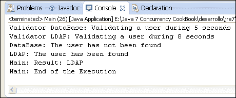
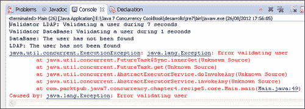

# 第 4 章线程执行器

在本章中，我们将介绍：

*   创建线程执行器
*   创建固定大小的线程执行器
*   在返回结果的执行器中执行任务
*   运行多个任务并处理第一个结果
*   运行多个任务并处理所有结果
*   延迟后在执行器中运行任务
*   在一个周期性运行的任务中
*   取消执行器中的任务
*   在执行器中控制任务完成
*   在执行器中分离任务的启动及其结果的处理
*   控制被拒绝的执行者任务

# 导言

通常，当您用 Java 开发一个简单的并发编程应用程序时，您会创建一些`Runnable`对象，然后创建相应的`Thread`对象来执行它们。如果您必须开发一个运行大量并发任务的程序，这种方法有以下缺点：

*   您必须实现所有与代码相关的信息来管理`Thread`对象（创建、结束、获取结果）。
*   每个任务创建一个`Thread`对象。如果必须执行大量任务，这可能会影响应用程序的吞吐量。
*   您必须有效地控制和管理计算机资源。如果创建的线程太多，可能会使系统饱和。

自 Java5 以来，Java 并发 API 提供了一种旨在解决问题的机制。该机制称为**执行器框架**，围绕`Executor`接口、其子接口`ExecutorService`和实现这两个接口的`ThreadPoolExecutor`类展开。

该机制将任务的创建和执行分开。对于执行器，您只需实现`Runnable`对象并将其发送给执行器即可。它负责它们的执行、实例化和使用必要的线程运行。但它超越了这一点，并使用线程池提高了性能。当您将任务发送给执行器时，它会尝试使用池线程来执行此任务，以避免线程的持续繁殖。

Executor 框架的另一个重要优点是`Callable`接口。与`Runnable`接口类似，但有两个改进，如下所示：

*   此接口的主方法名为`call()`，可以返回结果。
*   当您向执行器发送`Callable`对象时，您会得到一个实现`Future`接口的对象。您可以使用此对象来控制`Callable`对象的状态和结果。

本章介绍了 11 个方法，向您展示了如何使用前面提到的类和 Java 并发 API 提供的其他变体来使用 Executor 框架。

# 创建线程执行器

使用 Executor 框架的第一步是创建`ThreadPoolExecutor`类的对象。您可以使用该类提供的四个构造函数，也可以使用名为`Executors`的工厂类创建`ThreadPoolExecutor`。一旦有了执行器，就可以发送要执行的`Runnable`或`Callable`对象。

在本配方中，您将了解这两个操作如何实现一个示例，该示例将模拟 web 服务器处理来自不同客户端的请求。

## 准备好了吗

您应该阅读[第一章](1.html "Chapter 1. Thread Management")中的*创建和运行线程*配方，了解 Java 中创建线程的基本机制。您可以比较这两种机制，并根据问题选择最佳机制。

此配方的示例已使用 EclipseIDE 实现。如果您使用 Eclipse 或其他 IDE（如 NetBeans），请打开它并创建一个新的 Java 项目。

## 怎么做。。。

按照以下步骤实现示例：

1.  首先，您必须实现将由服务器执行的任务。创建一个名为`Task`的类来实现`Runnable`接口。

    ```java
    public class Task implements Runnable {
    ```

2.  声明一个名为`initDate`的`Date`属性来存储任务的创建日期，声明一个名为`name`的`String`属性来存储任务的名称。

    ```java
      private Date initDate;
      private String name;
    ```

3.  实现初始化这两个属性的类的构造函数。

    ```java
      public Task(String name){
        initDate=new Date();
        this.name=name;
      }
    ```

4.  执行`run()`方法。

    ```java
       @Override
      public void run() {
    ```

5.  首先，向控制台写入`initDate`属性和实际日期，即任务的开始日期。

    ```java
        System.out.printf("%s: Task %s: Created on: %s\n",Thread.currentThread().getName(),name,initDate);
        System.out.printf("%s: Task %s: Started on: %s\n",Thread.currentThread().getName(),name,new Date());
    ```

6.  然后，让任务在一段随机时间内休眠。

    ```java
        try {
          Long duration=(long)(Math.random()*10);
          System.out.printf("%s: Task %s: Doing a task during %d seconds\n",Thread.currentThread().getName(),name,duration);
          TimeUnit.SECONDS.sleep(duration);
        } catch (InterruptedException e) {
          e.printStackTrace();
        }
    ```

7.  最后，向控制台写入任务的完成日期。

    ```java
        System.out.printf("%s: Task %s: Finished on: %s\n",Thread.currentThread().getName(),name,new Date());
    ```

8.  现在，实现`Server`类，该类将使用 executor 执行它接收到的每个任务。创建一个名为`Server`的类。

    ```java
    public class Server {
    ```

9.  声明名为`executor`的`ThreadPoolExecutor`属性。

    ```java
      private ThreadPoolExecutor executor;
    ```

10.  使用`Executors`类实现初始化`ThreadPoolExecutor`对象的类的构造函数。

    ```java
      public Server(){
      executor=(ThreadPoolExecutor)Executors.newCachedThreadPool();
      }
    ```

11.  执行的`executeTask()`方法。它接收一个`Task`对象作为参数，并将其发送给执行器。首先，向控制台写入一条消息，指示新任务已到达。

    ```java
      public void executeTask(Task task){
        System.out.printf("Server: A new task has arrived\n");
    ```

12.  然后，调用执行器的`execute()`方法将任务发送给它。

    ```java
        executor.execute(task);
    ```

13.  最后，将一些执行器数据写入控制台以查看其状态。

    ```java
        System.out.printf("Server: Pool Size: %d\n",executor.getPoolSize());
        System.out.printf("Server: Active Count: %d\n",executor.getActiveCount());
        System.out.printf("Server: Completed Tasks: %d\n",executor.getCompletedTaskCount());
    ```

14.  执行`endServer()`方法。在此方法中，调用执行器的`shutdown()`方法来完成其执行。

    ```java
      public void endServer() {
        executor.shutdown();
      }
    ```

15.  最后，通过创建名为`Main`的类来实现示例的主类，并实现`main()`方法。

    ```java
    public class Main {

      public static void main(String[] args) {
        Server server=new Server();
        for (int i=0; i<100; i++){
          Task task=new Task("Task "+i);
          server.executeTask(task);
        }
        server.endServer();
      }
    }
    ```

## 它是如何工作的。。。

本例的关键是`Server`类。此类创建并使用`ThreadPoolExecutor`执行任务。

第一个重要的点是在`Server`类的构造函数中创建`ThreadPoolExecutor`。`ThreadPoolExecutor`类有四个不同的构造函数，但由于它们的复杂性，Java 并发 API 提供了`Executors`类来构造执行器和其他相关对象。虽然我们可以直接使用其构造函数之一创建`ThreadPoolExecutor`，但建议使用`Executors`类。

在本例中，您已经使用`newCachedThreadPool()`方法创建了一个缓存线程池。此方法返回一个`ExecutorService`对象，因此它被强制转换为`ThreadPoolExecutor`以访问其所有方法。如果需要执行新任务，您创建的缓存线程池将创建新线程，如果现有线程已完成正在运行的任务的执行，则将重用现有线程，这些线程现在可用。线程的重用有一个优点，即它减少了创建线程所需的时间。但是，缓存的线程池有一个缺点，就是新任务的线程数量是固定的，因此，如果向该执行器发送太多任务，可能会导致系统过载。

### 注

只有在线程数量合理或持续时间较短的情况下，才可以使用`newCachedThreadPool()`方法创建的执行器。

创建执行器后，可以使用`execute()`方法发送`Runnable`或`Callable`类型的任务以执行。在本例中，您发送实现`Runnable`接口的`Task`类的对象。

您还打印了一些包含执行器信息的日志消息。具体而言，您使用了以下方法：

*   `getPoolSize()`：此方法返回执行器池中的实际线程数
*   `getActiveCount()`：此方法返回执行器中正在执行任务的线程数
*   `getCompletedTaskCount()`：此方法返回执行者完成的任务数

`ThreadPoolExecutor`类和一般执行器的一个关键方面是，必须显式结束它。如果不这样做，执行器将继续执行，程序将不会结束。如果执行器没有要执行的任务，它将继续等待新任务，并且不会结束执行。Java 应用程序在其所有非守护进程线程完成执行之前不会结束，因此，如果不终止执行器，应用程序将永远不会结束。

要向执行者表明您想要完成它，您可以使用`ThreadPoolExecutor`类的`shutdown()`方法。当执行器完成所有挂起任务的执行时，它将完成其执行。调用`shutdown()`方法后，如果您尝试向执行者发送另一个任务，该任务将被拒绝，执行者将抛出`RejectedExecutionException`异常。

以下屏幕截图显示了此示例的一次执行的一部分：


当最后一个任务到达服务器时，执行器有一个包含 100 个任务和 97 个活动线程的池。

## 还有更多。。。

`ThreadPoolExecutor`类提供了许多方法来获取有关其状态的信息。在本例中，我们使用了`getPoolSize()`、`getActiveCount()`和`getCompletedTaskCount()`方法来获取有关池大小、线程数量和执行器已完成任务数量的信息。您还可以使用`getLargestPoolSize()`方法，该方法返回一次池中已存在的最大线程数。

`ThreadPoolExecutor`类还提供了与执行器的终结相关的其他方法。这些方法是：

*   `shutdownNow()`：此方法立即关闭执行器。它不执行挂起的任务。它返回一个包含所有这些挂起任务的列表。调用此方法时正在运行的任务将继续执行，但该方法不会等待任务完成。
*   `isTerminated()`：如果您调用了`shutdown()`或`shutdownNow()`方法，并且执行者完成了关闭该方法的过程，则该方法返回`true`。
*   `isShutdown()`：如果调用了执行者的`shutdown()`方法，则此方法返回`true`。
*   `awaitTermination(long``timeout,``TimeUnit``unit)`：此方法阻塞调用线程，直到执行者的任务结束或超时发生。`TimeUnit`类是具有以下常量的枚举：`DAYS`、`HOURS`、`MICROSECONDS`、`MILLISECONDS`、`MINUTES`、`NANOSECONDS`和`SECONDS`。

### 注

如果您想等待任务的完成，不管任务的持续时间如何，请使用较大的超时，例如，`DAYS`。

## 另见

*   [第 4 章](4.html "Chapter 4. Thread Executors")、*线程执行器*中配方的*控制被拒绝的任务*
*   [第 8 章](8.html "Chapter 8. Testing Concurrent Applications")*测试并发应用程序*中的*监控执行器框架*配方

# 创建固定大小的线程执行器

使用`Executors`类的`newCachedThreadPool()`方法创建的 basic`ThreadPoolExecutor`时，执行器一次运行的线程数可能会有问题。执行器会为接收到的每个任务创建一个新线程（如果没有池线程空闲），因此，如果发送大量任务且任务持续时间较长，则可能会导致系统过载，并导致应用程序性能低下。

如果您想避免这个问题，`Executors`类提供了一个创建固定大小线程执行器的方法。此执行器具有最大线程数。如果发送的任务数超过线程数，则执行器将不会创建额外的线程，剩余的任务将被阻止，直到执行器有空闲线程为止。通过这种行为，您可以保证执行者不会导致应用程序性能低下。

在这个配方中，您将学习如何创建一个固定大小的线程执行器，修改本章第一个配方中实现的示例。

## 准备好了吗

您应该阅读本章中的*创建线程执行器*配方，并实现其中解释的示例，因为您将修改此示例。

此配方的示例已使用 EclipseIDE 实现。如果您使用 Eclipse 或其他 IDE（如 NetBeans），请打开它并创建一个新的 Java 项目。

## 怎么做。。。

按照以下步骤来实现该示例：

1.  实施本章第一个配方中描述的示例。打开`Server`类并修改其构造函数。使用`newFixedThreadPool()`方法创建执行器，并将编号`5`作为参数传递。

    ```java
    public Server(){
    executor=(ThreadPoolExecutor)Executors.newFixedThreadPool(5);
    }
    ```

2.  修改`executeTask()`方法，增加一行日志消息。调用`getTaskCount()`方法获取已发送给执行者的任务数。

    ```java
        System.out.printf("Server: Task Count: %d\n",executor.getTaskCount());
    ```

## 它是如何工作的。。。

在本例中，您使用了`Executors`类的`newFixedThreadPool()`方法来创建执行器。此方法创建具有最大线程数的执行器。如果发送的任务数超过线程数，则剩余的任务将被阻止，直到有空闲线程处理这些任务。此方法将最大线程数作为您希望在执行器中包含的参数接收。在本例中，您创建了一个具有五个线程的执行器。

以下屏幕截图显示了此示例的一次执行的部分输出：


为了编写程序的输出，您使用了`ThreadPoolExecutor`类的一些方法，包括：

*   `getPoolSize()`：此方法返回执行器池中的实际线程数
*   `getActiveCount()`：此方法返回执行器中正在执行任务的线程数

您可以看到这些方法的输出是如何为**5**，表示执行器有五个线程。它不超过设定的最大线程数。

当您将最后一个任务发送给执行器时，它只有**5**个活动线程。其余 95 个任务正在等待空闲线程。我们使用`getTaskCount()`方法来显示您已向执行人发送了多少。

## 还有更多。。。

`Executors`类还提供了`newSingleThreadExecutor()`方法。这是固定大小线程执行器的极端情况。它创建一个只有一个线程的执行器，因此一次只能执行一个任务。

## 另见

*   [第 4 章](4.html "Chapter 4. Thread Executors")*线程执行器*中的*创建线程执行器*配方
*   [第 8 章](8.html "Chapter 8. Testing Concurrent Applications")*测试并发应用程序*中的*监控执行器框架*配方

# 在返回结果的执行器中执行任务

Executor 框架的优点之一是可以运行返回结果的并发任务。Java 并发 API 通过以下两个接口实现：

*   `Callable`：此接口有`call()`方式。在这种方法中，您必须实现任务的逻辑。`Callable`接口是一个参数化接口，这意味着您必须指明`call()`方法将返回的数据类型。
*   `Future`：这个接口有一些方法来获取`Callable`对象生成的结果并管理其状态。

在本食谱中，您将学习如何实现返回结果的任务并在执行器上运行它们。

## 准备好了。。。

此配方的示例已使用 EclipseIDE 实现。如果您使用 Eclipse 或其他 IDE（如 NetBeans），请打开它并创建一个新的 Java 项目。

## 怎么做。。。

按照以下步骤来实现该示例：

1.  创建一个名为`FactorialCalculator`的类。指定实现用`Integer`类型参数化的`Callable`接口。

    ```java
    public class FactorialCalculator implements Callable<Integer> {
    ```

2.  `Declare`一个名为`number`的私有`Integer`属性，用于存储此任务将用于计算的数字。

    ```java
      private Integer number;
    ```

3.  实现初始化类属性的类的构造函数。

    ```java
      public FactorialCalculator(Integer number){
        this.number=number;
      }
    ```

4.  执行`call()`方法。此方法返回`FactorialCalculator`的`number`属性的阶乘。

    ```java
       @Override
      public Integer call() throws Exception {
    ```

5.  首先，创建并初始化方法中使用的内部变量。

    ```java
           int result = 1;  
    ```

6.  如果编号为`0`或`1`，则返回`1`。否则，计算数字的阶乘。在两次乘法之间，出于教育目的，将此任务休眠 20 毫秒。

    ```java
        if ((num==0)||(num==1)) {
          result=1;
        } else {
          for (int i=2; i<=number; i++) {
            result*=i;
            TimeUnit.MILLISECONDS.sleep(20);
          }
        }
    ```

7.  向控制台写入一条包含操作结果的消息。

    ```java
        System.out.printf("%s: %d\n",Thread.currentThread().getName(),result);
    ```

8.  返回操作的结果。

    ```java
        return result;
    ```

9.  通过创建名为`Main`的类来实现示例的主类，并实现`main()`方法。

    ```java
    public class Main {
      public static void main(String[] args) {
    ```

10.  创建`ThreadPoolExecutor`以使用`Executors`类的`newFixedThreadPool()`方法运行任务。通过`2`作为参数。

    ```java
        ThreadPoolExecutor executor=(ThreadPoolExecutor)Executors.newFixedThreadPool(2);
    ```

11.  创建一个`Future<Integer>`对象列表。

    ```java
        List<Future<Integer>> resultList=new ArrayList<>();
    ```

12.  使用`Random`类创建一个随机数生成器。

    ```java
        Random random=new Random();
    ```

13.  生成 10 个介于 0 和 10 之间的新随机整数。

    ```java
        for (int i=0; i<10; i++){
          Integer number= random.nextInt(10);
    ```

14.  创建一个将此随机数作为参数传递的`FactorialCaculator`对象。

    ```java
          FactorialCalculator calculator=new FactorialCalculator(number);
    ```

15.  调用执行者的`submit()`方法将`FactorialCalculator`任务发送给执行者。此方法返回一个`Future<Integer>`对象来管理任务，并最终得到其结果。

    ```java
          Future<Integer> result=executor.submit(calculator);
    ```

16.  将`Future`对象添加到之前创建的列表中。

    ```java
          resultList.add(result);
        }
    ```

17.  创建一个`do`循环来监控执行器的状态。

    ```java
        do {
    ```

18.  首先，使用执行器的`getCompletedTaskNumber()`方法向控制台写入一条消息，指示已完成任务的数量。

    ```java
          System.out.printf("Main: Number of Completed Tasks: %d\n",executor.getCompletedTaskCount());
    ```

19.  然后，对于列表中的 10 个`Future`对象，使用`isDone()`方法编写一条消息，指示其管理的任务是否已完成。

    ```java
          for (int i=0; i<resultList.size(); i++) {
            Future<Integer> result=resultList.get(i);
            System.out.printf("Main: Task %d: %s\n",i,result.isDone());
          }
    ```

20.  将线程休眠 50 毫秒。

    ```java
          try {
            TimeUnit.MILLISECONDS.sleep(50);
          } catch (InterruptedException e) {
            e.printStackTrace();
          }
    ```

21.  当执行器完成的任务数少于 10 时，重复此循环。

    ```java
        } while (executor.getCompletedTaskCount()<resultList.size());
    ```

22.  将每个任务获得的结果写入控制台。对于每个`Future`对象，使用`get()`方法获取其任务返回的`Integer`对象。

    ```java
        System.out.printf("Main: Results\n");
        for (int i=0; i<resultList.size(); i++) {
          Future<Integer> result=resultList.get(i);
          Integer number=null;
          try {
            number=result.get();
          } catch (InterruptedException e) {
            e.printStackTrace();
          } catch (ExecutionException e) {
            e.printStackTrace();
          }
    ```

23.  然后，将号码打印到控制台。

    ```java
          System.out.printf("Main: Task %d: %d\n",i,number);
        }
    ```

24.  最后，调用执行器的`shutdown()`方法来完成其执行。

    ```java
        executor.shutdown();
    ```

## 它是如何工作的。。。

在这个配方中，您已经学习了如何使用`Callable`接口启动返回结果的并发任务。您已经实现了`FactorialCalculator`类，该类以`Integer`作为结果的类型来实现`Callable`接口。因此，它在`call()`方法的类型之前返回。

这个例子的另一个关键点是在`Main`类中。您使用`submit()`方法发送一个`Callable`对象以在执行器中执行。此方法接收一个`Callable`对象作为参数，并返回一个`Future`对象，可用于两个主要目标：

*   您可以控制任务的状态：您可以取消任务并检查任务是否已完成。为此，您已使用`isDone()`方法检查任务是否已完成。
*   您可以通过`call()`方法得到返回的结果。为此，您使用了`get()`方法。此方法等待直到`Callable`对象完成`call()`方法的执行并返回其结果。如果线程在`get()`方法等待结果时被中断，则抛出`InterruptedException`异常。如果`call()`方法引发异常，则此方法引发`ExecutionException`异常。

## 还有更多。。。

当您调用`Future`对象的方法且该对象控制的任务尚未完成时，该方法将阻塞，直到任务完成。`Future`接口提供了`get()`方法的另一个版本。

*   `get(long``timeout,``TimeUnit``unit)`：此版本的 get 方法，如果任务结果不可用，则等待指定时间。如果指定的时间段过去了，结果还不可用，则该方法返回一个`null`值。`TimeUnit`类是具有以下常量的枚举：`DAYS`、`HOURS`、`MICROSECONDS`、`MILLISECONDS`、`MINUTES`、`NANOSECONDS`和`SECONDS`。

## 另见

*   [第 4 章](4.html "Chapter 4. Thread Executors")*线程执行器*中的*创建线程执行器*配方
*   *运行多个任务并处理[第 4 章](4.html "Chapter 4. Thread Executors")中的第一个结果*配方*线程执行器*
*   *运行多个任务并处理[第 4 章](4.html "Chapter 4. Thread Executors")中的*配方*线程执行器*

# 运行多个任务并处理第一个结果

并发编程中的一个常见问题是，当您有解决问题的各种并发任务时，您只对这些任务的第一个结果感兴趣。例如，您想要对数组进行排序。您有各种排序算法。您可以启动所有这些函数，并获得第一个对它们进行排序的函数的结果，即给定数组的最快排序算法。

在此配方中，您将学习如何使用`ThreadPoolExecutor`类实现此场景。您将实现一个示例，其中用户可以通过两种机制进行验证。如果其中一个机制对用户进行验证，则将对其进行验证。

## 准备好了吗

此配方的示例已使用 EclipseIDE 实现。如果您使用 Eclipse 或其他 IDE（如 NetBeans），请打开它并创建一个新的 Java 项目。

## 怎么做。。。

按照以下步骤来实现该示例：

1.  创建一个名为`UserValidator`的类，该类将实现用户验证过程。

    ```java
    public class UserValidator {
    ```

2.  声明名为`name`的私有`String`属性，该属性将存储用户验证系统的名称。

    ```java
      private String name;
    ```

3.  实现初始化其属性的类的构造函数。

    ```java
      public UserValidator(String name) {
        this.name=name;
      }
    ```

4.  执行`validate()`方法。它接收两个`String`参数，其中包含要验证的用户的名称和密码。

    ```java
      public boolean validate(String name, String password) {
    ```

5.  创建一个名为`random`的`Random`对象。

    ```java
        Random random=new Random();
    ```

6.  等待一段随机时间来模拟用户验证过程。

    ```java
        try {
          long duration=(long)(Math.random()*10);
          System.out.printf("Validator %s: Validating a user during %d seconds\n",this.name,duration);
          TimeUnit.SECONDS.sleep(duration);
        } catch (InterruptedException e) {
          return false;
        }
    ```

7.  返回一个随机的`Boolean`值。该方法在验证用户时返回一个`true`值，在未验证用户时返回一个`false`值。

    ```java
        return random.nextBoolean();
       }
    ```

8.  执行`getName()`方法。此方法返回 name 属性的值。

    ```java
      public String getName(){
        return name;
      }
    ```

9.  现在，创建一个名为`TaskValidator`的类，该类将以`UserValidation`对象作为并发任务执行验证过程。指定实现用`String`类参数化的`Callable`接口。

    ```java
    public class TaskValidator implements Callable<String> {
    ```

10.  声明名为`validator`的私有`UserValidator`属性。

    ```java
      private UserValidator validator;
    ```

11.  声明两个名为`user`和`password`的私有`String`属性。

    ```java
      private String user;
      private String password;
    ```

12.  实现将初始化所有属性的类的构造函数。

    ```java
      public TaskValidator(UserValidator validator, String user, String password){
        this.validator=validator;
        this.user=user;
        this.password=password;
      }
    ```

13.  实现返回`String`对象的`call()`方法。

    ```java
      @Override
      public String call() throws Exception {
    ```

14.  如果用户未被`UserValidator`对象验证，则向控制台写入一条消息，指示此情况，并引发`Exception`异常。

    ```java
        if (!validator.validate(user, password)) {
          System.out.printf("%s: The user has not been found\n",validator.getName());
          throw new Exception("Error validating user");
        }
    ```

15.  否则，向控制台写入一条消息，指示用户已被验证，并返回`UserValidator`对象的名称。

    ```java
        System.out.printf("%s: The user has been found\n",validator.getName());
        return validator.getName();
    ```

16.  现在，通过创建一个名为`Main`的类来实现示例的主类，并向其添加`main()`方法。

    ```java
    public class Main {
      public static void main(String[] args) {
    ```

17.  创建两个名为`user`和`password`的`String`对象，并用`test`值初始化它们。

    ```java
        String username="test";
        String password="test";
    ```

18.  创建两个名为`ldapValidator`和`dbValidator`的`UserValidator`对象。

    ```java
        UserValidator ldapValidator=new UserValidator("LDAP");
        UserValidator dbValidator=new UserValidator("DataBase");
    ```

19.  创建两个名为`ldapTask`和`dbTask`的`TaskValidator`对象。分别用`ldapValidator`和`dbValidator`进行初始化。

    ```java
        TaskValidator ldapTask=new TaskValidator(ldapValidator, username, password);
        TaskValidator dbTask=new TaskValidator(dbValidator,username,password);
    ```

20.  创建一个`TaskValidator`对象列表，并将您创建的两个对象添加到其中。

    ```java
        List<TaskValidator> taskList=new ArrayList<>();
        taskList.add(ldapTask);
        taskList.add(dbTask);
    ```

21.  使用`Executors`类的`newCachedThreadPool()`方法和名为`result`的`String`对象创建一个新的`ThreadPoolExecutor`对象。

    ```java
        ExecutorService executor=(ExecutorService)Executors.newCachedThreadPool();
        String result;
    ```

22.  调用`executor`对象的`invokeAny()`方法。此方法接收`taskList`作为参数，并返回`String`。同时，它将此方法返回的`String`对象写入控制台。

    ```java
        try {
          result = executor.invokeAny(taskList);
          System.out.printf("Main: Result: %s\n",result);
        } catch (InterruptedException e) {
          e.printStackTrace();
        } catch (ExecutionException e) {
          e.printStackTrace();
        }
    ```

23.  使用`shutdown()`方法终止执行器，并向控制台写入一条消息，表明程序已结束。

    ```java
        executor.shutdown();
        System.out.printf("Main: End of the Execution\n");
    ```

## 它是如何工作的。。。

示例的键在`Main`类中。`ThreadPoolExecutor`类的`invokeAny()`方法接收任务列表，启动它们，并返回第一个任务的结果，该任务完成后不会引发异常。此方法返回的数据类型与您启动的任务的`call()`方法返回的数据类型相同。在这种情况下，它返回一个`String`值。

以下屏幕截图显示了当一个任务验证用户时示例执行的输出：



该示例有两个返回随机`boolean`值的`UserValidator`对象。每个`UserValidator`对象由`TaskValidator`类实现的`Callable`对象使用。如果`UserValidator`类的`validate()`方法返回`false`值，`TaskValidator`类抛出`Exception`。否则返回`true`值。

因此，我们有两个任务可以返回`true`值或抛出`Exception` 异常。您可以有以下四种可能性：

*   两个任务都返回`true`值。`invokeAny()`方法的结果是首先完成的任务的名称。
*   第一个任务返回`true`值，第二个任务抛出`Exception`。`invokeAny()`方法的结果是第一个任务的名称。
*   第一个任务抛出`Exception`，第二个任务返回`true`值。`invokeAny()`方法的结果是第二个任务的名称。
*   两个任务都抛出`Exception`。在该类中，`invokeAny()`方法抛出一个`ExecutionException`异常。

如果您多次运行示例，您将得到四种可能的解决方案。

以下屏幕截图显示了当两个任务都引发异常时应用程序的输出：



## 还有更多。。。

`ThreadPoolExecutor`类提供了`invokeAny()`方法的另一个版本：

*   `invokeAny(Collection<?``extends``Callable<T>>``tasks,``long``timeout,``TimeUnit``unit)`：如果在给定的超时时间之前完成，则此方法执行所有任务并返回第一个完成的任务的结果，而不抛出异常。`NANOSECONDS`和【T18】是`MICROSECONDS`，且`SECONDS`是`SECONDS`，且`SECONDS`是`SECONDS`类。

## 另见

*   *运行多个任务并处理[第 4 章](4.html "Chapter 4. Thread Executors")中的*配方*线程执行器*

# 运行多个任务并处理所有结果

Executor 框架允许您执行并发任务，而无需担心线程的创建和执行。它为您提供`Future`类，您可以使用该类来控制状态并获取在执行器中执行的任何任务的结果。

如果要等待任务完成，可以使用以下两种方法：

*   如果任务执行完毕，`Future`接口的`isDone()`方法返回`true`。
*   `ThreadPoolExecutor`类的`awaitTermination()`方法将线程置于睡眠状态，直到调用`shutdown()`方法后所有任务都完成执行。

这两种方法都有一些缺点。对于第一个，您只能控制任务的完成，而对于第二个，您必须关闭执行器以等待线程，否则方法的调用将立即返回。

`ThreadPoolExecutor`类提供了一种方法，允许您向执行者发送任务列表，并等待列表中所有任务的完成。在本配方中，您将通过实现一个示例来学习如何使用此功能，该示例中执行了三个任务，并在任务完成后打印出结果。

## 准备好了吗

此配方的示例已使用 EclipseIDE 实现。如果您使用 Eclipse 或其他 IDE（如 NetBeans），请打开它并创建一个新的 Java 项目。

## 怎么做。。。

按照以下步骤来实现该示例：

1.  创建一个名为`Result`的类来存储在本例的并发任务中生成的结果。

    ```java
    public class Result {
    ```

2.  声明两个私有属性。一个名为`name`的`String`属性和一个名为`value`的`int`属性。

    ```java
      private String name;
      private int value;
    ```

3.  实现对应的`get()`和`set()`方法，设置并返回名称和值属性的值。

    ```java
      public String getName() {
        return name;
      }
      public void setName(String name) {
        this.name = name;
      }
      public int getValue() {
        return value;
      }
      public void setValue(int value) {
        this.value = value;
      }
    ```

4.  创建一个名为`Task`的类，该类实现了用`Result`类参数化的`Callable`接口。

    ```java
    public class Task implements Callable<Result> {
    ```

5.  声明名为`name`的私有`String`属性。

    ```java
      private String name;
    ```

6.  实现初始化其属性的类的构造函数。

    ```java
      public Task(String name) {
        this.name=name;
      }
    ```

7.  实现类的`call()`方法。在这种情况下，此方法将返回一个`Result`对象。

    ```java
      @Override
      public Result call() throws Exception {
    ```

8.  首先，向控制台写入一条消息，指示任务正在启动。

    ```java
        System.out.printf("%s: Staring\n",this.name);
    ```

9.  然后，等待一段随机的时间。

    ```java
        try {
          long duration=(long)(Math.random()*10);
          System.out.printf("%s: Waiting %d seconds for results.\n",this.name,duration);
          TimeUnit.SECONDS.sleep(duration);
        } catch (InterruptedException e) {
          e.printStackTrace();
        }
    ```

10.  要在`Result`对象中生成要返回的`int`值，请计算五个随机数之和。

    ```java
        int value=0;
        for (int i=0; i<5; i++){
          value+=(int)(Math.random()*100);

        }
    ```

11.  创建一个`Result`对象并使用此任务的名称和前面完成的操作的结果对其进行初始化。

    ```java
        Result result=new Result();
        result.setName(this.name);
        result.setValue(value);
    ```

12.  向控制台写入消息以指示任务已完成。

    ```java
        System.out.println(this.name+": Ends");
    ```

13.  返回`Result`对象。

    ```java
        return result;
      }
    ```

14.  最后，通过创建一个名为`Main`的类来实现示例的主类，并向其添加`main()`方法。

    ```java
    public class Main {

      public static void main(String[] args) {
    ```

15.  使用`Executors`类的`newCachedThreadPool()`方法创建一个`ThreadPoolExecutor`对象。

    ```java
        ExecutorService executor=(ExecutorService)Executors.newCachedThreadPool();
    ```

16.  创建一个`Task`对象列表。创建三个`Task`对象并保存在该列表中。

    ```java
        List<Task> taskList=new ArrayList<>();
        for (int i=0; i<3; i++){
          Task task=new Task(i);
          taskList.add(task);
        }
    ```

17.  创建一个`Future`对象列表。这些对象通过`Result`类参数化。

    ```java
        List<Future<Result>>resultList=null;
    ```

18.  调用`ThreadPoolExecutor`类的`invokeAll()`方法。此类将返回先前创建的`Future`对象列表。

    ```java
        try {
          resultList=executor.invokeAll(taskList);
        } catch (InterruptedException e) {
          e.printStackTrace();
        }
    ```

19.  使用`shutdown()`方法确定执行器。

    ```java
        executor.shutdown();
    ```

20.  将任务处理结果写入`Future`对象列表。

    ```java
        System.out.println("Main: Printing the results");
        for (int i=0; i<resultList.size(); i++){
          Future<Result> future=resultList.get(i);
          try {
            Result result=future.get();
            System.out.println(result.getName()+": "+result.getValue());
          } catch (InterruptedException | ExecutionException e) {
            e.printStackTrace();
          }
        }
    ```

## 它是如何工作的。。。

在这个配方中，您已经学会了如何向执行者发送任务列表，并使用`invokeAll()`方法等待所有任务的完成。此方法接收`Callable`对象列表，并返回`Future`对象列表。此列表中每个任务都有一个`Future`对象。`Future`对象列表中的第一个对象将是控制`Callable`对象列表中第一个任务的对象，依此类推。

需要考虑的第一点是，在存储结果对象的列表声明中，用于参数化`Future`接口的数据类型必须与用于参数化`Callable`对象的数据类型兼容。在本例中，您使用了相同类型的数据：`Result`类。

关于`invokeAll()`方法的另一个要点是，您将只使用`Future`对象来获得任务的结果。由于该方法在所有任务完成后完成，如果调用返回的`Future`对象的`isDone()`方法，则所有调用都会返回`true`值。

## 还有更多。。。

`ExecutorService`类提供了`invokeAll()`方法的另一个版本：

*   `invokeAll(Collection<?``extends``Callable<T>>``tasks,``long``timeout,``TimeUnit``unit)`：如果任务在给定的超时时间之前完成，则此方法执行所有任务，并在所有任务完成后返回执行结果。`NANOSECONDS`和【T18】是`MICROSECONDS`，且`SECONDS`是`SECONDS`，且`SECONDS`是`SECONDS`类。

## 另见

*   执行器中的*执行任务，返回[第 4 章](4.html "Chapter 4. Thread Executors")、*线程执行器*中的*配方结果
*   *运行多个任务并处理[第 4 章](4.html "Chapter 4. Thread Executors")中的第一个结果*配方*线程执行器*

# 延迟后在执行器中运行任务

Executor framework 为`ThreadPoolExecutor`类提供了一个线程池来执行`Callable`和`Runnable`任务，避免了所有的线程创建操作。当您向执行器发送任务时，它会根据执行器的配置尽快执行。在一些用例中，您对尽快执行任务不感兴趣。您可能希望在一段时间后执行任务或定期执行任务。出于这些目的，Executor 框架提供了`ScheduledThreadPoolExecutor`类。

在本食谱中，您将学习如何创建`ScheduledThreadPoolExecutor`，以及如何使用它在给定时间段后安排任务的执行。

## 准备好了吗

此配方的示例已使用 EclipseIDE 实现。如果您使用 Eclipse 或其他 IDE（如 NetBeans），请打开它并创建一个新的 Java 项目。

## 怎么做。。。

按照以下步骤实现示例：

1.  创建一个名为`Task`的类，该类实现了用`String`类参数化的`Callable`接口。

    ```java
    public class Task implements Callable<String> {
    ```

2.  声明一个名为`name`的私有`String`属性，该属性将存储任务的名称。

    ```java
      private String name;
    ```

3.  实现初始化`name`属性的类的构造函数。

    ```java
      public Task(String name) {
        this.name=name;
      }
    ```

4.  执行`call()`方法。在控制台上写一条带有实际日期的消息并返回文本，例如，`Hello, world`。

    ```java
      public String call() throws Exception {
        System.out.printf("%s: Starting at : %s\n",name,new Date());
        return "Hello, world";
      }
    ```

5.  通过创建一个名为`Main`的类并向其添加`main()`方法来实现示例的主类。

    ```java
    public class Main {
      public static void main(String[] args) {
    ```

6.  以`Executors`类的`newScheduledThreadPool()`方法通过`1`作为参数，创建`ScheduledThreadPoolExecutor`类的执行器。

    ```java
        ScheduledThreadPoolExecutor executor=(ScheduledThreadPoolExecutor)Executors.newScheduledThreadPool(1); 
    ```

7.  使用`ScheduledThreadPoolExecutor`实例的`schedule()`方法初始化并启动几个任务（本例中为五个）。

    ```java
        System.out.printf("Main: Starting at: %s\n",new Date());
        for (int i=0; i<5; i++) {
          Task task=new Task("Task "+i);
          executor.schedule(task,i+1 , TimeUnit.SECONDS);
        }
    ```

8.  使用`shutdown()`方法请求最终确定执行人。

    ```java
        executor.shutdown();
    ```

9.  使用执行者的`awaitTermination()`方法等待所有任务的完成。

    ```java
        try {
          executor.awaitTermination(1, TimeUnit.DAYS);
        } catch (InterruptedException e) {
          e.printStackTrace();
        }
    ```

10.  编写一条消息，指示程序完成的时间。

    ```java
        System.out.printf("Main: Ends at: %s\n",new Date());
    ```

## 它是如何工作的。。。

本例的重点是`Main`类和`ScheduledThreadPoolExecutor`的管理。与类`ThreadPoolExecutor`一样，为了创建计划执行器，Java 建议使用`Executors`类。在这种情况下，您必须使用`newScheduledThreadPool()`方法。您已将编号`1`作为参数传递给此方法。此参数是希望池中包含的线程数。

要在一段时间后在此计划执行器中执行任务，必须使用`schedule()`方法。此方法接收以下三个参数：

*   要执行的任务
*   您希望任务在执行前等待的时间段
*   时间段的单位，指定为`TimeUnit`类的常数

在这种情况下，每个任务将等待相当于其在任务数组中的位置加上一的秒数（`TimeUnit.SECONDS`。

### 注

如果要在给定时间执行任务，请计算该日期与当前日期之间的差值，并将该差值用作任务的延迟。

以下屏幕截图显示了此示例的执行输出：


您可以看到任务是如何每秒执行一次的。所有任务都会在时间发送给执行者，但每个任务都比前一个任务延迟 1 秒。

## 还有更多。。。

您也可以使用`Runnable`接口来实现任务，因为`ScheduledThreadPoolExecutor`类的`schedule()`方法接受这两种类型的任务。

尽管`ScheduledThreadPoolExecutor`类是`ThreadPoolExecutor`类的子类，因此继承了它的所有特性，但 Java 建议只在计划任务中使用`ScheduledThreadPoolExecutor`。

最后，当您调用`shutdown()`方法并且有等待延迟时间结束的挂起任务时，您可以配置`ScheduledThreadPoolExecutor`类的行为。默认行为是，尽管执行器已完成，但仍将执行这些任务。您可以使用`ScheduledThreadPoolExecutor`类的`setExecuteExistingDelayedTasksAfterShutdownPolicy()`方法来更改此行为。使用`false`，在`shutdown()`时，将不会执行挂起的任务。

## 另见

*   执行器中的*执行任务，返回[第 4 章](4.html "Chapter 4. Thread Executors")、*线程执行器*中的*配方结果

# 定期在执行器中运行任务

Executor 框架提供了`ThreadPoolExecutor`类来使用线程池执行并发任务，避免了所有线程创建操作。当您向执行器发送任务时，根据其配置，执行器会尽快执行该任务。当任务结束时，将从执行器中删除该任务，如果要再次执行，则必须再次将其发送给执行器。

但是 Executor 框架提供了通过`ScheduledThreadPoolExecutor`类执行周期性任务的可能性。在本食谱中，您将学习如何使用该类的此功能来安排定期任务。

## 准备好了吗

此配方的示例已使用 EclipseIDE 实现。如果您使用 Eclipse 或其他 IDE（如 NetBeans），请打开它并创建一个新的 Java 项目。

## 怎么做。。。

按照以下步骤来实现该示例：

1.  创建一个名为`Task`的类，并指定它实现`Runnable`接口。

    ```java
    public class Task implements Runnable {
    ```

2.  声明一个名为`name`的私有`String`属性，该属性将存储任务的名称。

    ```java
      private String name;
    ```

3.  实现初始化该属性的类的构造函数。

    ```java
      public Task(String name) {
        this.name=name;
      }
    ```

4.  执行`run()`方法。将带有实际日期的消息写入控制台，以验证任务是否在指定的时间段内执行。

    ```java
      @Override
      public String call() throws Exception {
        System.out.printf("%s: Starting at : %s\n",name,new Date());
        return "Hello, world";
      }
    ```

5.  通过创建名为`Main`的类来实现示例的主类，并在其中实现`main()`方法。

    ```java
    public class Main {
      public static void main(String[] args) {
    ```

6.  使用`Executors`类的`newScheduledThreadPool()`方法创建`ScheduledThreadPoolExecutor`。将数字作为参数传递给该方法。

    ```java
        ScheduledExecutorService executor=Executors.newScheduledThreadPool(1);
    ```

7.  在控制台上写一条带有实际日期的消息。

    ```java
        System.out.printf("Main: Starting at: %s\n",new Date());
    ```

8.  创建一个新的`Task`对象。

    ```java
        Task task=new Task("Task");
    ```

9.  使用`scheduledAtFixRate()`方法发送给执行人。将前面创建的任务、数字 1、数字 2 和常量`TimeUnit.SECONDS`用作参数。此方法返回一个`ScheduledFuture`对象，可用于控制任务的状态。

    ```java
        ScheduledFuture<?> result=executor.scheduleAtFixedRate(task, 1, 2, TimeUnit.SECONDS);
    ```

10.  创建一个包含 10 个步骤的循环，以写入下一次执行任务的剩余时间。在循环中，使用`ScheduledFuture`对象的`getDelay()`方法获取距离下一次执行任务的毫秒数。

    ```java
        for (int i=0; i<10; i++){
          System.out.printf("Main: Delay: %d\n",result.getDelay(TimeUnit.MILLISECONDS));
    Sleep the thread during 500 milliseconds.
          try {
            TimeUnit.MILLISECONDS.sleep(500);
          } catch (InterruptedException e) {
            e.printStackTrace();
          }
        }
    ```

11.  使用`shutdown()`方法完成执行器。

    ```java
        executor.shutdown();
    ```

12.  将线程休眠 5 秒钟，以验证周期性任务是否已完成。

    ```java
        try {
          TimeUnit.SECONDS.sleep(5);
        } catch (InterruptedException e) {
          e.printStackTrace();
        }
    ```

13.  编写一条消息以指示程序结束。

    ```java
        System.out.printf("Main: Finished at: %s\n",new Date());
    ```

## 它是如何工作的。。。

当您想要使用 Executor 框架执行周期性任务时，您需要一个`ScheduledExecutorService`对象。为了创建它（和每个执行器一样），Java 建议使用`Executors`类。此类用作 executor 对象的工厂。在这种情况下，您应该使用`newScheduledThreadPool()`方法创建一个`ScheduledExecutorService`对象。该方法接收池的线程数作为参数。由于在本例中您只有一个任务，因此您已将值`1`作为参数传递。

一旦有了执行定期任务所需的执行者，就可以将任务发送给执行者。您已经使用了`scheduledAtFixedRate()`方法。此方法接受四个参数：要定期执行的任务、任务第一次执行之前的时间延迟、两次执行之间的时间间隔以及第二个和第三个参数的时间单位。这是`TimeUnit`类的常数。`TimeUnit`类是一个枚举，具有以下常量：`DAYS`、`HOURS`、`MICROSECONDS`、`MILLISECONDS`、`MINUTES`、`NANOSECONDS`和`SECONDS`。

要考虑的一个重要点是两个执行之间的时间段是这两个执行开始之间的时间段。如果您有一个周期性任务，需要 5 秒来执行，并且您放置了一个 3 秒的周期，那么一次将执行两个任务实例。

方法`scheduleAtFixedRate()`返回一个`ScheduledFuture`对象，该对象扩展了`Future`接口，具有处理计划任务的方法。`ScheduledFuture`是一个参数化接口。在本例中，由于任务是未参数化的`Runnable`对象，因此必须使用`?`符号作为参数对其进行参数化。

您已经使用了`ScheduledFuture`接口的一种方法。`getDelay()`方法返回下一次执行任务之前的时间。此方法接收一个`TimeUnit`常量，其中包含您希望接收结果的时间单位。

以下屏幕截图显示了示例执行的输出：


您可以看到每 2 秒执行一次任务（以`Task:`前缀表示），每 500 毫秒在控制台中写入一次延迟。这就是主线睡眠的时间。当您关闭 executor 时，计划任务将结束其执行，并且在控制台中看不到更多消息。

## 还有更多。。。

`ScheduledThreadPoolExecutor`提供了其他方法来安排周期性任务。这是`scheduleWithFixedRate()`方法。它的参数与`scheduledAtFixedRate()`方法相同，但有一点值得注意。在`scheduledAtFixedRate()`方法中，第三个参数确定两次执行开始之间的时间段。在`scheduledWithFixedRate()`方法中，参数确定任务执行结束到下一次执行开始之间的时间段。

您还可以使用`shutdown()`方法配置`ScheduledThreadPoolExecutor`类实例的行为。默认行为是，当您调用该方法时，计划任务完成。您可以使用具有`true`值的`ScheduledThreadPoolExecutor`类的`setContinueExistingPeriodicTasksAfterShutdownPolicy()`方法更改此行为。调用`shutdown()`方法后，周期性任务不会完成。

## 另见

*   [第 4 章](4.html "Chapter 4. Thread Executors")*线程执行器*中的*创建线程执行器*配方
*   [第 4 章](4.html "Chapter 4. Thread Executors")*线程执行器*中的*延迟*配方后在执行器中运行任务

# 取消执行器中的任务

当您与执行器一起工作时，您不必管理线程。您只执行`Runnable`或`Callable`任务并发送给执行者。执行者负责创建线程，在线程池中管理线程，并在不需要时完成线程。有时，您可能希望取消发送给执行者的任务。在这种情况下，您可以使用`Future`的`cancel()`方法进行取消操作。在此配方中，您将学习如何使用此方法取消发送给执行者的任务。

## 准备好了吗

此配方的示例已使用 EclipseIDE 实现。如果您使用 Eclipse 或其他 IDE（如 NetBeans），请打开它并创建一个新的 Java 项目。

## 怎么做。。。

按照以下步骤来实现该示例：

1.  创建一个名为`Task`的类，并指定它实现用`String`类参数化的`Callable`接口。实施`call()`方法。向控制台写入消息，并在无限循环中使其休眠 100 毫秒。

    ```java
    public class Task implements Callable<String> {
      @Override
      public String call() throws Exception {
        while (true){
          System.out.printf("Task: Test\n");
          Thread.sleep(100);
        }
      }
    ```

2.  通过创建一个名为`Main`的类并向其添加`main()`方法来实现示例的主类。

    ```java
    public class Main {
      public static void main(String[] args) {
    ```

3.  使用`Executors`类的`newCachedThreadPool()`方法创建`ThreadPoolExecutor`对象。

    ```java
        ThreadPoolExecutor executor=(ThreadPoolExecutor)Executors.newCachedThreadPool();
    ```

4.  创建一个新`Task`对象。

    ```java
        Task task=new Task();
    ```

5.  使用`submit()`方法将任务发送给执行者。

    ```java
        System.out.printf("Main: Executing the Task\n");
        Future<String> result=executor.submit(task);
    ```

6.  将主任务置于睡眠状态 2 秒钟。

    ```java
        try {
          TimeUnit.SECONDS.sleep(2);
        } catch (InterruptedException e) {
          e.printStackTrace();
        }
    ```

7.  使用`submit()`方法返回的名为`result`的`Future`对象的`cancel()`方法取消任务的执行。将`true`值作为`cancel()`方法的参数传递。

    ```java
        System.out.printf("Main: Canceling the Task\n");
        result.cancel(true);
    ```

8.  将调用方法`isCancelled()`和`isDone()`的结果写入控制台，以验证任务已被取消，因此已完成。

    ```java
        System.out.printf("Main: Canceled: %s\n",result.isCanceled());
        System.out.printf("Main: Done: %s\n",result.isDone());
    ```

9.  使用`shutdown()`方法完成 executor，并编写一条消息，指示程序完成。

    ```java
        executor.shutdown();
        System.out.printf("Main: The executor has finished\n");
    ```

## 它是如何工作的。。。

当您想要取消发送给执行者的任务时，使用`Future`界面的`cancel()`方法。根据`cancel()`方法的参数和任务的状态，此方法的行为不同：

*   如果任务已完成或已提前取消，或者由于其他原因无法取消，则该方法将返回`false`值，任务不会被取消。
*   如果任务正在执行器中等待获取将执行它的`Thread`对象，则该任务将被取消，并且永远不会开始执行。如果任务已在运行，则取决于方法的参数。作为参数`cancel()`接收。如果该参数的值为`true`且任务正在运行，则该任务将被取消。如果参数值为`false`且任务正在运行，则不会取消。

以下屏幕截图显示了此示例的执行输出：


## 还有更多。。。

如果使用控制已取消任务的`Future`对象的方法`get()`，则`get()`方法将抛出`CancellationException`异常。

## 另见

*   执行器中的*执行任务，返回[第 4 章](4.html "Chapter 4. Thread Executors")、*线程执行器*中的*配方结果

# 在执行器中控制任务完成

`FutureTask`类提供了一个名为`done()`的方法，允许您在执行器中执行的任务完成后执行一些代码。可以进行一些后期处理操作，生成报告，通过电子邮件发送结果，或者发布一些资源。当`FutureTask`对象控制的任务执行完成时，`FutureTask`类在内部调用此方法。无论任务是否已取消或正常完成，在设置任务结果并将其状态更改为`isDone`状态后调用该方法。

默认情况下，此方法为空。您可以重写`FutureTask`类并实现此方法来更改此行为。在此配方中，您将学习如何在任务完成后重写此方法以执行代码。

## 准备好了吗

此配方的示例已使用 EclipseIDE 实现。如果您使用 Eclipse 或其他 IDE（如 NetBeans），请打开它并创建一个新的 Java 项目。。

## 怎么做。。。

按照以下步骤来实现该示例：

1.  创建一个名为`ExecutableTask`的类，并指定它实现用`String`类参数化的`Callable`接口。

    ```java
    public class ExecutableTask implements Callable<String> {
    ```

2.  声明名为`name`的私有`String`属性。它将存储任务的名称。执行方法`getName()`返回该属性的值。

    ```java
      private String name;
      public String getName(){
        return name;
      }
    ```

3.  实现类的构造函数，初始化任务名称。

    ```java
      public ExecutableTask(String name){
        this.name=name;
      }
    ```

4.  执行`call()`方法。将任务置于随机休眠状态一段时间，并返回一条包含任务名称的消息。

    ```java
      @Override
      public String call() throws Exception {
        try {
          long duration=(long)(Math.random()*10);
          System.out.printf("%s: Waiting %d seconds for results.\n",this.name,duration);
          TimeUnit.SECONDS.sleep(duration);
        } catch (InterruptedException e) {
        }    
        return "Hello, world. I'm "+name;
      }
    ```

5.  实现一个名为`ResultTask`的类，该类扩展了用`String`类参数化的`FutureTask`类。

    ```java
    public class ResultTask extends FutureTask<String> {
    ```

6.  声明名为`name`的私有`String`属性。它将存储任务的名称。

    ```java
      private String name;
    ```

7.  实现类的构造函数。它必须接收一个`Callable`对象作为参数。调用父类的构造函数，并使用接收到的任务的属性初始化`name`属性。

    ```java
      public ResultTask(Callable<String> callable) {
        super(callable);
        this.name=((ExecutableTask)callable).getName();
      }
    ```

8.  覆盖`done()`方法。检查`isCancelled()`方法的值，并根据返回的值向控制台写入不同的消息。

    ```java
      @Override
      protected void done() {
        if (isCancelled()) {
          System.out.printf("%s: Has been canceled\n",name);
        } else {
          System.out.printf("%s: Has finished\n",name);
        }
      }
    ```

9.  通过创建名为`Main`的类来实现示例的主类，并向其添加`main()`方法。

    ```java
    public class Main {
      public static void main(String[] args) {
    ```

10.  使用`Executors`类的`newCachedThreadPool()`方法创建`ExecutorService`。

    ```java
        ExecutorService executor=(ExecutorService)Executors.newCachedThreadPool();
    ```

11.  创建一个数组来存储五个`ResultTask`对象。

    ```java
        ResultTask resultTasks[]=new ResultTask[5];
    ```

12.  初始化对象。对于数组中的每个位置，首先必须使用该对象创建`ExecutorTask`，然后创建`ResultTask`。然后，使用`submit()`方法发送给执行人`ResultTask`。

    ```java
        for (int i=0; i<5; i++) {
          ExecutableTask executableTask=new ExecutableTask("Task "+i);
          resultTasks[i]=new ResultTask(executableTask);
          executor.submit(resultTasks[i]);
        }
    ```

13.  将主线程休眠 5 秒钟。

    ```java
        try {
          TimeUnit.SECONDS.sleep(5);
        } catch (InterruptedException e1) {
          e1.printStackTrace();
        }
    ```

14.  取消发送给执行者的所有任务。

    ```java
        for (int i=0; i<resultTasks.length; i++) {
          resultTasks[i].cancel(true);
        }
    ```

15.  使用`ResultTask`对象的`get()`方法将尚未取消的任务的结果写入控制台。

    ```java
        for (int i=0; i<resultTasks.length; i++) {
          try {
            if (!resultTasks[i].isCanceled()){
              System.out.printf("%s\n",resultTasks[i].get());
            }
          } catch (InterruptedException | ExecutionException e) {
            e.printStackTrace();
          }    }
    ```

16.  使用`shutdown()`方法完成执行器。

    ```java
        executor.shutdown();
      }
    }
    ```

## 它是如何工作的。。。

当被控制的任务完成其执行时，`FutureTask`类调用`done()`方法。在本例中，您实现了一个`Callable`对象、`ExecutableTask`类，然后是控制`ExecutableTask`对象执行的`FutureTask`类的子类。

`done()`方法在建立返回值并将任务状态更改为`isDone`状态后，由`FutureTask`类内部调用。您不能更改任务的结果值或更改其状态，但可以关闭任务使用的资源、写入日志消息或发送通知。

## 另见

*   执行器中的*执行任务，返回[第 4 章](4.html "Chapter 4. Thread Executors")、*线程执行器*中的*配方结果

# 在执行器中分离任务的启动及其结果的处理

通常情况下，当您使用执行器执行并发任务时，您会向执行器发送`Runnable`或`Callable`任务，并获取`Future`对象来控制该方法。您可以找到需要在一个对象中将任务发送给执行者并在另一个对象中处理结果的情况。对于这种情况，Java 并发 API 提供了`CompletionService`类。

这个`CompletionService`类有一个将任务发送给执行者的方法和一个为下一个已完成其执行的任务获取`Future`对象的方法。在内部，它使用一个`Executor`对象来执行任务。这种行为的优点是共享一个`CompletionService`对象，并将任务发送给执行者，以便其他人可以处理结果。限制是第二个对象只能获取已经完成执行的任务的`Future`对象，因此这些`Future`对象只能用于获取任务的结果。

在此配方中，您将学习如何使用`CompletionService`类将 executor 中的启动任务与其结果的处理分开。

## 准备好了吗

此配方的示例已使用 EclipseIDE 实现。如果您使用 Eclipse 或其他 IDE（如 NetBeans），请打开它并创建一个新的 Java 项目。

## 怎么做。。。

按照以下步骤来实现该示例：

1.  创建一个名为`ReportGenerator`的类，并指定它实现用`String`类参数化的`Callable`接口。

    ```java
    public class ReportGenerator implements Callable<String> {
    ```

2.  声明两个名为`sender`和`title`的私有`String`属性，它们将表示报表的数据。

    ```java
      private String sender;
      private String title;
    ```

3.  实现初始化这两个属性的类的构造函数。

    ```java
      public ReportGenerator(String sender, String title){
        this.sender=sender;
        this.title=title;
      }
    ```

4.  执行`call()`方法。首先，让线程随机休眠一段时间。

    ```java
      @Override
      public String call() throws Exception {
        try {
          Long duration=(long)(Math.random()*10);
          System.out.printf("%s_%s: ReportGenerator: Generating a report during %d seconds\n",this.sender,this.title,duration);
          TimeUnit.SECONDS.sleep(duration);
        } catch (InterruptedException e) {
          e.printStackTrace();
        }
    ```

5.  然后，将报告生成为具有发件人和标题属性的字符串，并返回该字符串。

    ```java
        String ret=sender+": "+title;
        return ret;
      }
    ```

6.  创建一个名为`ReportRequest`的类，并指定它实现`Runnable`接口。此类将模拟一些报告请求。

    ```java
    public class ReportRequest implements Runnable {
    ```

7.  声明一个名为`name`的私有`String`属性来存储`ReportRequest`的名称。

    ```java
      private String name;
    ```

8.  声明名为`service`的私有`CompletionService`属性。`CompletionService`接口为参数化接口。使用`String`类。

    ```java
      private CompletionService<String> service;
    ```

9.  实现初始化这两个属性的类的构造函数。

    ```java
      public ReportRequest(String name, CompletionService<String> service){
        this.name=name;
        this.service=service;
      }
    ```

10.  执行`run()`方法。创建三个`ReportGenerator`对象，并使用`submit()`方法将它们发送给`CompletionService`对象。

    ```java
      @Override
      public void run() {

          ReportGenerator reportGenerator=new ReportGenerator(name, "Report");
          service.submit(reportGenerator);

      }
    ```

11.  创建一个名为`ReportProcessor`的类。本课程将获得`ReportGenerator`任务的结果。指定实现`Runnable`接口。

    ```java
    public class ReportProcessor implements Runnable {
    ```

12.  声明名为`service`的私有`CompletionService`属性。由于`CompletionService`接口是参数化接口，所以使用`String`类作为该`CompletionService`接口的参数。

    ```java
      private CompletionService<String> service;
    ```

13.  声明一个名为`end`的私有`boolean`属性。

    ```java
      private boolean end;
    ```

14.  实现类的构造函数来初始化这两个属性。

    ```java
      public ReportProcessor (CompletionService<String> service){
        this.service=service;
        end=false;
      }
    ```

15.  执行`run()`方法。当属性`end`为`false`时，调用`CompletionService`接口的`poll()`方法，获取已完成的完成服务执行的下一个任务的`Future`对象。

    ```java
        @Override
      public void run() {
        while (!end){
          try {
            Future<String> result=service.poll(20, TimeUnit.SECONDS);
    ```

16.  然后，使用`Future`对象的`get()`方法获取任务的结果，并将这些结果写入控制台。

    ```java
            if (result!=null) {
              String report=result.get();
              System.out.printf("ReportReceiver: Report Received: %s\n",report);
            }      
          } catch (InterruptedException | ExecutionException e) {
            e.printStackTrace();
          }
        }
        System.out.printf("ReportSender: End\n");
      }
    ```

17.  实现修改 end 属性值的`setEnd()`方法。

    ```java
      public void setEnd(boolean end) {
        this.end = end;
      }
    ```

18.  通过创建一个名为`Main`的类来实现示例的主类，并向其添加`main()`方法。

    ```java
    public class Main {
      public static void main(String[] args) {
    ```

19.  使用`Executors`类的`newCachedThreadPool()`方法创建`ThreadPoolExecutor`。

    ```java
        ExecutorService executor=(ExecutorService)Executors.newCachedThreadPool();
    ```

20.  使用前面创建的执行器作为构造函数的参数创建`CompletionService`。

    ```java
        CompletionService<String> service=new ExecutorCompletionService<>(executor);
    ```

21.  创建两个`ReportRequest`对象和执行它们的线程。

    ```java
        ReportRequest faceRequest=new ReportRequest("Face", service);
        ReportRequest onlineRequest=new ReportRequest("Online", service);  
        Thread faceThread=new Thread(faceRequest);
        Thread onlineThread=new Thread(onlineRequest);
    ```

22.  创建一个`ReportProcessor`对象和执行它的线程。

    ```java
        ReportProcessor processor=new ReportProcessor(service);
        Thread senderThread=new Thread(processor);
    ```

23.  开始三个线程。

    ```java
        System.out.printf("Main: Starting the Threads\n");
        faceThread.start();
        onlineThread.start();
        senderThread.start();
    ```

24.  等待`ReportRequest`线程的终结。

    ```java
        try {
          System.out.printf("Main: Waiting for the report generators.\n");
          faceThread.join();
          onlineThread.join();
        } catch (InterruptedException e) {
          e.printStackTrace();
        }
    ```

25.  使用`shutdown()`方法完成执行器，并等待使用`awaitTermination()`方法完成任务的。

    ```java
        System.out.printf("Main: Shutting down the executor.\n");
        executor.shutdown();
        try {
          executor.awaitTermination(1, TimeUnit.DAYS);
        } catch (InterruptedException e) {
          e.printStackTrace();
        }
    ```

26.  完成`ReportSender`对象的执行，将其 end 属性的值设置为`true`。

    ```java
        processor.setEnd(true);
        System.out.println("Main: Ends");
    ```

## 它是如何工作的。。。

在本例的主类中，您已经使用`Executors`类的`newCachedThreadPool()`方法创建了`ThreadPoolExecutor`。然后，您使用该对象初始化了一个`CompletionService`对象，因为完成服务使用一个执行器来执行它的任务。要使用完成服务执行任务，请使用`ReportRequest`类中的`submit()`方法。

当完成服务完成其执行时执行其中一个任务时，完成服务将用于控制其执行的`Future`对象存储在队列中。`poll()`方法访问该队列以查看是否有任何任务已完成其执行，如果有，则返回该队列的第一个元素，即已完成其执行的任务的`Future`对象。当`poll()`方法返回`Future`对象时，它会将其从队列中删除。在本例中，您向该方法传递了两个属性，以指示在包含已完成任务结果的队列为空的情况下，您希望等待任务完成的时间。

创建`CompletionService`对象后，您将创建两个`ReportRequest`对象，分别执行`CompletionService`中的三个`ReportGenerator`任务，以及一个`ReportSender`任务，该任务将处理两个`ReportRequest`对象发送的任务生成的结果。

## 还有更多。。。

`CompletionService`类可以执行`Callable`或`Runnable`任务。在本例中，您使用了`Callable`，但也可以发送`Runnable`对象。由于`Runnable`对象不会产生结果，`CompletionService`类的原理不适用于此类情况。

此类还提供了另外两种方法来获取已完成任务的`Future`对象。这些方法如下：

*   `poll()`：不带参数的`poll()`方法版本检查队列中是否有`Future`对象。如果队列为空，则立即返回`null`。否则，它将返回其第一个元素并将其从队列中移除。
*   `take()`：此方法不带参数，检查队列中是否有`Future`对象。如果为空，它将阻塞线程，直到队列中有一个元素。当队列包含元素时，它返回并从队列中删除其第一个元素。

## 另见

*   执行器中的*执行任务，返回[第 4 章](4.html "Chapter 4. Thread Executors")、*线程执行器*中的*配方结果

# 控制执行者被拒绝的任务

当您想要完成某个执行者的执行时，您可以使用`shutdown()`方法指示它应该完成。执行者等待完成正在运行或等待执行的任务，然后完成其执行。

如果在`shutdown()`方法和执行结束之间向执行者发送任务，则该任务将被拒绝，因为执行者不再接受新任务。`ThreadPoolExecutor`类提供了一种机制，当任务被拒绝时调用该机制。

在本配方中，您将学习如何在使用`RejectedExecutionHandler`实现的执行器中管理拒绝任务。

## 准备好了吗

此配方的示例已使用 EclipseIDE 实现。如果您使用 Eclipse 或其他 IDE（如 NetBeans），请打开它并创建一个新的 Java 项目。

## 怎么做。。。

按照以下步骤实现示例：

1.  创建一个名为`RejectedTaskController`的类来实现`RejectedExecutionHandler`接口。实现该接口的`rejectedExecution()`方法。向控制台写入已被拒绝的任务的名称以及执行者的名称和状态。

    ```java
    public class RejectedTaskController implements RejectedExecutionHandler {
      @Override
      public void rejectedExecution(Runnable r, ThreadPoolExecutor executor) {
        System.out.printf("RejectedTaskController: The task %s has been rejected\n",r.toString());
        System.out.printf("RejectedTaskController: %s\n",executor.toString());
        System.out.printf("RejectedTaskController: Terminating: %s\n",executor.isTerminating());
        System.out.printf("RejectedTaksController: Terminated: %s\n",executor.isTerminated());
      }
    ```

2.  实现一个名为`Task`的类，并指定它实现`Runnable`接口。

    ```java
    public class Task implements Runnable{
    ```

3.  声明名为`name`的私有`String`属性。它将存储任务的名称。

    ```java
      private String name;
    ```

4.  实现类的构造函数。它将初始化类的属性。

    ```java
      public Task(String name){
        this.name=name;
      }
    ```

5.  执行`run()`方法。向控制台写入一条消息以指示该方法的启动。

    ```java
       @Override
      public void run() {
        System.out.println("Task "+name+": Starting");
    ```

6.  等待一段随机时间。

    ```java
        try {
          long duration=(long)(Math.random()*10);
          System.out.printf("Task %s: ReportGenerator: Generating a report during %d seconds\n",name,duration);
          TimeUnit.SECONDS.sleep(duration);
        } catch (InterruptedException e) {
          e.printStackTrace();
        }
    ```

7.  向控制台写入一条消息以指示方法的终结。

    ```java
        System.out.printf("Task %s: Ending\n",name);
      }
    ```

8.  覆盖`toString()`方法。返回任务的名称。

    ```java
      public String toString() {
        return name;
      }
    ```

9.  通过创建一个名为`Main`的类并向其添加`main()`方法来实现示例的主类。

    ```java
    public class Main {
      public static void main(String[] args) {
    ```

10.  创建一个`RejectedTaskController`对象来管理被拒绝的任务。

    ```java
        RejectecTaskController controller=new RejectecTaskController();
    ```

11.  使用`Executors`类的`newCachedThreadPool()`方法创建`ThreadPoolExecutor`。

    ```java
        ThreadPoolExecutor executor=(ThreadPoolExecutor) Executors.newCachedThreadPool();
    ```

12.  建立执行者的被拒绝任务控制器。

    ```java
        executor.setRejectedExecutionHandler(controller);
    ```

13.  创建三个任务并将它们发送给执行者。

    ```java
        System.out.printf("Main: Starting.\n");
        for (int i=0; i<3; i++) {
          Task task=new Task("Task"+i);
          executor.submit(task);
        }
    ```

14.  使用`shutdown()`方法关闭执行器。

    ```java
        System.out.printf("Main: Shutting down the Executor.\n");
        executor.shutdown();
    ```

15.  创建另一个任务并将其发送给执行者。

    ```java
        System.out.printf("Main: Sending another Task.\n");
        Task task=new Task("RejectedTask");
        executor.submit(task);
    ```

16.  向控制台写入一条消息，指示程序已完成。

    ```java
        System.out.println("Main: End");
        System.out.printf("Main: End.\n");
    ```

## 它是如何工作的。。。

在下面的屏幕截图中，您可以看到执行示例的结果：


您可以看到，当执行被关闭时，任务被拒绝，`RejectecTaskController`向控制台写入关于任务和执行者的信息。

要为执行者管理被拒绝的任务，您应该创建一个实现`RejectedExecutionHandler`接口的类。此接口有一个名为`rejectedExecution()`的方法，有两个参数：

*   存储已拒绝任务的`Runnable`对象
*   存储拒绝任务的执行者的`Executor`对象

对于被执行者拒绝的每个任务，都会调用此方法。您需要使用`Executor`类的`setRejectedExecutionHandler()`方法建立被拒绝的任务的处理程序。

## 还有更多。。。

当执行器收到要执行的任务时，它会检查是否调用了`shutdown()`方法。如果是，它将拒绝该任务。首先，它寻找用`setRejectedExecutionHandler()`建立的处理程序。如果有，则调用该类的`rejectedExecution()`方法，否则抛出`RejectedExecutionExeption`。这是一个运行时异常，所以您不需要放置一个`catch`子句来控制它。

## 另见

*   [第 4 章](4.html "Chapter 4. Thread Executors")*线程执行器*中的*创建线程执行器*配方