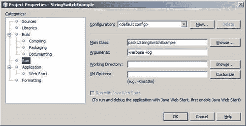
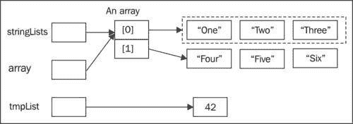
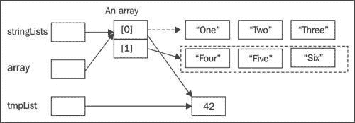

# 第一章 Java 语言的改进

在本章中，我们将介绍以下内容：

*   在 switch 语句中使用字符串文字
*   在文字中使用下划线提高代码可读性
*   使用 try with resources 块改进异常处理代码
*   创建一个可与 try with resources 技术一起使用的资源
*   捕获多个异常类型以改进类型检查
*   在 Java7 中重新抛出异常
*   使用菱形运算符进行构造函数类型推断
*   使用@SafeVarargs 注释

# 导言

**Java 7**于 2011 年 7 月发布，并引入了许多新功能。在 Java SDK 文档中，您可能会看到它被称为**Java 1.7。**本章将重点关注那些被归为项目币一部分的货币（[http://openjdk.java.net/projects/coin/](http://openjdk.java.net/projects/coin/) ）。**Project Coin**指 Java 7 中的一些小的语言更改，这些更改旨在尽可能删除额外的文本，从而使程序更具可读性。对语言的更改不涉及修改**Java 虚拟机**（**JVM**）。这些新功能包括：

*   在 switch 语句中使用字符串
*   添加二进制文字以及在数字文字中插入下划线的功能
*   多挡块的使用
*   try with resources 块
*   使用菱形运算符改进类型推断
*   使用参数数量可变的方法的改进

自 Java 诞生以来，只有整数值可以用来控制 switch 语句。现在可以使用字符串，并且可以提供更方便的技术来控制基于字符串的执行流。*在 switch 语句*中使用字符串文字说明了这一特性。

下划线现在可以与文本一起使用，如配方*中所述，在文本中使用下划线以提高代码可读性*。这些可以使程序更具可读性和可维护性。此外，现在可以使用二进制文本。例如，可以使用文字位模式，而不是使用十六进制文字。

Java7 的新功能是改进的 try-catch 块机制。其中包括从单个 catch 块捕获多个异常的能力，以及异常抛出方式的改进。*捕获多个异常类型以改进类型检查*方法研究了这些增强。

异常处理的另一个改进涉及自动关闭资源。在 Java 的早期版本中，当在一个 try 块中打开多个资源时，当出现异常时，可能很难有效地关闭资源。Java7 提供了一种新的技术，正如在*中所讨论的，它使用 try with resources 块来改进异常处理代码*配方。

为了利用这种技术，表示资源的类必须实现新的 `java.lang.AutoCloseable`接口。这个接口由一个方法组成， `close`在实现时，应该根据需要释放资源。为此，许多核心 Java 类都进行了扩充。配方：*创建一个可以与资源试用技术*一起使用的资源说明了如何对非核心类执行此操作。

Java7 提供了以灵活的方式重新抛出异常的功能。它提供了一种更精确的抛出异常的方法，并且在 try/catch bock 中处理异常的方式更灵活。Java7 配方中的*重新抛出异常说明了此功能。*

当泛型在**Java 1.5**中引入时，编写代码来解决许多类似问题变得更加容易。然而，它的使用有时会变得有些冗长。 `diamond`运算符的引入减轻了这一负担，并在*中使用菱形运算符进行构造函数类型推断*配方中进行了说明。

当方法使用数量可变的泛型参数时，有时会生成无效警告。引入了 `@SafeVarargs`注释，以将方法标记为安全的。这个问题与堆污染有关，在*中使用@SafeVarargs 注释*方法进行了讨论。

### 注

在本章和其他章节中，大多数代码示例将被编写为在主方法中执行。尽管使用 Java 7 的新功能不需要特定的**集成开发环境**（**IDE**），但除非另有说明，本书中的示例是使用**NetBeans 7.0.1**和**Windows 7**开发的。至少需要一个版本的**Java 开发工具包**（**JDK**）**1.7**或更高版本。

另外，请注意，提供的代码示例不包括 `import`语句。这里不显示这些代码是为了减少代码行数。大多数 IDE 使插入这些导入变得很容易，但是您需要小心使用正确的导入。

# 在 switch 语句中使用字符串文字

在 switch 语句中使用字符串文字的能力对 Java7 来说是新的。以前， `switch`语句中只有整数值是有效参数。通常需要根据字符串值做出决策，使用 `switch`语句执行此任务可以简化需要的 `if`语句系列。这可以产生更可读、更高效的代码。

## 准备好了吗

应用程序中可能会出现基于字符串值的选择。一旦发现此类情况，请执行以下操作：

1.  通过 `switch`语句创建要处理的 `String`变量。
2.  使用 case 子句的字符串文本创建 `switch`块。
3.  使用 `String`变量控制 `switch`语句。

## 怎么做。。。

这里演示的示例将使用 `switch`语句处理应用程序的命令行参数。创建一个新的控制台应用程序。在 `main`方法中，我们将使用 `args`参数来处理应用程序的命令行参数。许多应用程序允许命令行参数自定义或以其他方式影响应用程序的操作。在本例中，我们的应用程序将支持详细模式、日志记录，并提供有关应用程序的有效命令行参数的帮助消息。

1.  在本例中，创建一个名为 `StringSwitchExample`的类，该类拥有三个由命令行参数设置的实例变量，如下所示：

    ```java
    public class StringSwitchExample {
    private static boolean verbose = false;
    private static boolean logging = false;
    private static boolean displayHelp = false;
    }

    ```

    ### 提示

    **下载示例代码**

    您可以下载您在 [账户购买的所有包装书籍的示例代码文件 http://www.packtpub.com](http://www.packtpub.com) 如果您在其他地方购买了本书，您可以访问 [http://www.packtpub.com/support](http://www.packtpub.com/support) 并注册，将文件直接通过电子邮件发送给您。

2.  接下来，添加以下 `main`方法，该方法将根据提供的命令行参数设置这些变量：

    ```java
    public static void main(String[] args) {
    for (String argument : args) {
    switch (argument) {
    case "-verbose":
    case "-v":
    verbose = true;
    switch statementsstring literals, usingbreak;
    case "-log":
    logging = true;
    break;
    case "-help":
    displayHelp = true;
    break;
    default:
    System.out.println("Illegal command line argument");
    }
    }
    displayApplicationSettings();
    }

    ```

3.  添加以下助手方法显示应用设置：

    ```java
    private static void displayApplicationSettings() {
    System.out.println("Application Settings");
    System.out.println("Verbose: " + verbose);
    System.out.println("Logging: " + logging);
    System.out.println("Help: " + displayHelp);
    }

    ```

4.  使用以下命令行执行应用程序：

    ```java
    java StringSwitchExample -verbose -log

    ```

5.  If you are using an IDE, then there is usually a way to set the command line arguments. For example, in NetBeans, right-clicking on the project name in the **Project** window, and selecting **Properties** menu will open a **Project Properties** dialog box. In the **Run** category, the **Arguments** textbox allows you to set the command line arguments, as shown in the following screenshot:

    

6.  When the application is executed, your output should appear as follows:

    **应用设置**

    **详细：正确**

    **日志记录：真**

    **帮助：假**

## 它是如何工作的。。。

应用设置变量均初始化为 `false`。for-each 循环遍历每个命令行参数。 `switch`语句使用特定的命令行参数打开应用程序设置。 `switch`语句的行为类似于早期的 Java `switch`语句。

### 注

有趣的是，Java 虚拟机（JVM）目前不直接支持使用字符串进行切换。Java 编译器负责将 `switch`语句中的字符串转换为适当的字节码。

当 for 循环完成时，调用 `displayApplicationSettings`方法。这将显示当前应用程序设置，反映由命令行参数指定的配置。

然而，需要注意的是， `String`变量可以传递给 `switch`语句，就像 `switch`语句中使用的其他数据类型一样，case 子句中使用的字符串必须是字符串文字。使用字符串文字时，有关 `switch`语句的一般规则适用。 `switch`块中的每个语句必须有一个有效的非空标签，两个标签不能完全相同，并且每个 `switch`块只能关联一个默认标签。

## 还有更多。。。

使用字符串时，需要注意以下两个问题：

*   字符串的空值
*   字符串的大小写

使用分配了空值的字符串引用变量将导致 `java.lang.NullPointerException`。有关如何处理 `NullPointerException`的更多信息，请参见[第 11 章](11.html "Chapter 11. Odds and Ends")*零碎品*中的*处理空引用*配方。与 `switch`语句一起使用时也是如此。此外，在 `switch`语句中，对大小写表达式的求值是区分大小写的。在上一个示例中，如果命令行参数与 case 表达式中显示的参数不同，则跳过 case。如果我们使用了以下命令行，其中我们将单词 verbose 大写：

```java
java StringSwitchExample -Verbose -log

```

然后将不再使用详细模式，如以下输出中所示：

**应用设置**

**详细：假**

**日志记录：真**

**帮助：假**

# 在文字中使用下划线以提高代码可读性

在 Java 7 中，数字文字可以包含下划线字符（389;）。这是为了提高代码的可读性，通过在几乎任何满足开发人员需求的任意位置将文字的数字分成重要的组。下划线可以应用于任何支持的基（二进制、八进制、十六进制或十进制）中的基本数据类型，也可以应用于整数和浮点文本。

## 准备好了吗

第一步是确定开发人员以这种方式格式化文本将受益的实例。通常，您需要识别较长的号码或在其外部形式中具有重要部分的号码，例如借记卡号。基本步骤包括：

1.  标识要与下划线一起使用的文字。
2.  在文本中的适当位置插入下划线，以使文本更具可读性。

## 怎么做。。。

此示例演示了如何使用下划线来澄清大多数借记卡号中存在的固有差距，并演示了它们与浮点数的用法。

1.  新建控制台应用，添加 `main`方法如下：

    ```java
    public static void main(String[] args) {
    long debitCard = 1234_5678_9876_5432L;
    System.out.println("The card number is: " + debitCard);
    System.out.print("The formatted card number is:");
    printFormatted(debitCard);
    float minAmount = 5_000F;
    float currentAmount = 5_250F;
    float withdrawalAmount = 500F;
    if ((currentAmount - withdrawalAmount) < minAmount) {
    System.out.println("Minimum amount limit exceeded " + minAmount);
    }
    }

    ```

2.  添加一种方法，显示正确格式化的信用卡号以供输出，如下所示：

    ```java
    private static void printFormatted(long cardNumber) {
    String formattedNumber = Long.toString(cardNumber);
    for (int i = 0; i < formattedNumber.length(); i++) {
    if (i % 4 == 0) {
    System.out.print(" ");
    }
    System.out.print(formattedNumber.charAt(i));
    }
    System.out.println();
    }

    ```

3.  Execute the application. The output will appear as follows:

    **卡号为：1234567898765432**

    **格式化卡号为：12345678 9876 5432**

    **最低限额超过 5000.0**

请注意，在第一个输出行中，显示的数字不包含下划线，但第二行的格式为使用下划线所在的空格。这是为了说明数字内部外观与外部显示所需格式之间的差异。

## 它是如何工作的。。。

借记卡示例将数字分为四个部分，使其更具可读性。由于借记卡号的长度，需要一个 `long`变量。

其次，对银行账户中的金额设定了最低限额。类型为 `float`的变量 `minAmount`被设置为 5000.00，使用下划线表示逗号的位置。另外两个名为 `currentAmount`和 `withdrawalAmount`的 `float`分别声明并设置为 5250.00 和 500.00。然后，代码确定是否可以从 `currentAmount`中减去 `withdrawalAmount`，并且仍然保持高于 `minAmount`的平衡。如果没有，则会显示一条类似的消息。

### 注

在大多数涉及货币的应用程序中， `java.util.Currency`类将是一个更合适的选择。上一个示例仅使用浮点文本来解释下划线的用法。

下划线的唯一用途是使代码对开发人员更具可读性。编译器在代码生成和任何后续变量操作期间忽略下划线。连续的下划线被视为一个，编译器也会忽略它。如果变量的输出格式很重要，则必须单独处理。

## 还有更多。。。

下划线可以用于 10 个以上的基本文字。此外，下划线可能被误用。在这里，我们将解决以下问题：

*   简单下划线用法错误
*   使用带十六进制文字的下划线
*   将下划线与二进制文字一起使用

### 简单下划线用法错误

下划线通常可以在文本中任意放置，但有一些准则限制了它们的使用。当在 `float`或 `double`中使用时，在数字的开头或结尾，在 D、F 或 L 后缀之前，或在需要数字串的地方，在小数点附近加下划线是无效的。

以下是无效下划线用法的示例：

```java
long productKey = _12345_67890_09876_54321L;
float pi = 3._14_15F;
long licenseNumber = 123_456_789_L;

```

这些将生成语法错误，**错误：非法下划线**。

### 使用带十六进制文字的下划线

下划线在处理以十六进制或二进制表示的二进制数据时特别有用。在以下示例中，表示要发送到数据端口的命令的整数值表示为十六进制和二进制文字：

```java
int commandInHex = 0xE_23D5_8C_7;
int commandInBinary = 0b1110_0010001111010101_10001100_0111;

```

这两个数字是一样的。它们只在不同的基础上表达。这里，我们使用了基数 2 和基数 16。在本示例中，基 16 表示可能更具可读性。下一节将更深入地讨论基本 2 文本。

下划线用于更清楚地标识命令的各个部分。假设命令的前四位表示运算符，而下 16 位表示操作数。接下来的 8 位和 4 位可能代表命令的其他方面。

### 使用带二进制文字的下划线

我们还可以将下划线与二进制文本一起使用。例如，要初始化设备，我们可能需要向数据端口发送特定的 8 位序列。该序列可以组织为前两位指定操作（读、写等），后三位指定设备资源，后三位表示操作数。我们可以使用带下划线的二进制文字对该序列进行编码，如下所示：

```java
byte initializationSequence = 0b10_110_010;

```

使用下划线可以清楚地标识每个字段。虽然不需要使用变量 `initializationSequence`，但它允许我们在程序中的多个位置使用序列。另一个示例定义了一个掩码，在这种情况下，前三位在**和**操作期间被消除，如下所示：

```java
result = inputValue & 0b000_11111;

```

在按位“与”运算中，操作数的每一位都是“与”运算。这些示例如下所示：

```java
byte initializationSequence = (byte) 0b01_110_010;
byte inputValue = (byte) 0b101_11011;
byte result = (byte) (inputValue & (byte) 0b000_11111);
System.out.println("initializationSequence: " +
Integer.toBinaryString(initializationSequence));
System.out.println("result: " + Integer.toBinaryString(result));

```

执行此序列时，我们得到以下输出：

**初始化顺序：1110010**

**结果：11011**

需要字节转换运算符，因为二进制文本默认为类型 `int`。另外，请注意， `toBinaryString`方法不显示前导零。

# 使用 try with resources 块改进异常处理代码

在 Java7 之前，正确打开和关闭资源所需的代码（如 `java.io.InputStream`或 `java.nio.Channel`）非常冗长且容易出错。添加 try with resources 块是为了简化错误处理并使代码更加简洁。使用 try with resources 语句会导致 try 块退出时自动关闭其所有资源。使用 try with Resources 块声明的资源必须实现接口 `java.lang.AutoCloseable`。

这种方法实现了更好的编程风格，因为它避免了嵌套和过多的 try-catch 块。它还确保了准确的资源管理，您可以看到在文献中称为**自动资源管理**（**ARM**）。

## 准备好了吗

当使用需要打开和关闭的资源时， `try-with-resource`块通过以下方式实现：

1.  创建 try 块并声明要管理的资源。
2.  使用 try 块中的资源。

## 怎么做。。。

1.  创建一个控制台应用程序，并向其添加以下 `main`方法。在工作目录中创建一个名为 `users.txt`的文本文件，并将名称列表添加到该文件中。本例打开该文件并创建备份，同时演示了使用 `try-with-resources`技术，其中使用 try 块创建 `java.io.BufferedReader`和 `java.io.BufferedWriter`对象：

    ```java
    public static void main(String[] args) {
    try (BufferedReader inputReader = Files.newBufferedReader(
    Paths.get(new URI ("file:///C:/home/docs/users.txt")),
    Charset.defaultCharset());
    BufferedWriter outputWriter = Files.newBufferedWriter(
    Paths.get(new URI("file:///C:/home/docs/users.bak")),
    Charset.defaultCharset())) {
    String inputLine;
    while ((inputLine = inputReader.readLine()) != null) {
    outputWriter.write(inputLine);
    outputWriter.newLine();
    }
    System.out.println("Copy complete!");
    }
    catch (URISyntaxException | IOException ex) {
    ex.printStackTrace();
    }
    }

    ```

2.  Execute the application. The output should be as follows:

    **复制完成！**

## 它是如何工作的。。。

要管理的资源在 `try`关键字和 try 块的大括号之间的一组括号内声明和初始化。在这种情况下，将创建两个资源。第一个是与 `users.txt`文件关联的 `BufferedReader`对象，第二个是与 `users.bak`文件关联的 `BufferedWriter`对象。使用 `java.nio.file.Path`接口的新 IO 技术在[第 6 章](06.html "Chapter 6. Stream IO in Java 7")、*Java7*中的流 IO 中进行了讨论。

然后逐行读取第一个文件并将其写入第二个文件。退出 try 块时，两个 IO 流将自动关闭。然后会显示一条消息，表明复制操作已完成。

请注意，在捕捉块中使用了垂直条。这是 Java7 的新特性，允许我们在单个 catch 块中捕获多个异常。在*捕获多个异常类型以改进类型检查*方法中讨论了此运算符的使用。

请记住，使用 try with resources 块声明的资源用分号分隔。否则将导致编译时错误。此外，无论 try 块是否正常完成，都将尝试关闭资源。如果无法关闭资源，则通常会引发异常。

无论资源是否关闭，catch 和 finally 块始终执行。但是，仍然可以从这些块抛出异常。这在*创建一个可与资源试用技术*配方一起使用的资源中有更详细的讨论。

## 还有更多。。。

为了完成对 `try-with-resources`技术的理解，我们需要解决以下两个问题：

*   理解被抑制的例外
*   使用 `try-with-resources`技术时的结构问题

### 理解被抑制的异常

为了支持这种方法，在 `java.lang.Exception`类中添加了一个新的构造函数以及两个方法： `addSuppressed`和 `getSuppressed`。抑制异常是指未明确报告的异常。在 try with resources try 块的情况下，可能会从 try 块本身或 try 块创建的资源关闭时引发异常。当抛出多个异常时，可能会抑制异常。

在 try with resources 块的情况下，当从块本身抛出异常时，将抑制与关闭操作相关联的任何异常。这一点在*创建一个可与资源尝试技术*配方一起使用的资源中得到了证明。

可以使用 `getSuppressed`方法检索被抑制的异常。程序员创建的异常可以使用 `addSuppressed`方法将异常指定为已抑制。

### 使用 try with resources 技术时的结构问题

当使用单个资源时，可能不希望使用此技术。我们将展示一系列代码的三种不同实现，以显示 `users.txt`文件的内容。第一个，如下面的代码所示，使用 try with resources 块。但是，有必要在该块之前添加一个 try 块来捕获 `java.net.URISyntaxException:`

```java
Path path = null;
try {
path = Paths.get(new URI("file:///C:/home/docs/users.txt"));
}
catch (URISyntaxException e) {
System.out.println("Bad URI");
}
try (BufferedReader inputReader = Files.newBufferedReader(path, Charset.defaultCharset())) {
String inputLine;
while ((inputLine = inputReader.readLine()) != null) {
System.out.println(inputLine);
}
}
catch (IOException ex) {
ex.printStackTrace();
}

```

这个例子是基于捕捉 `URISyntaxException`的需要而建立的。这可以通过在 `get`方法内部创建 `java.net.URI`对象来避免，如下所示。然而，这确实使代码更难阅读：

```java
try (BufferedReader inputReader = Files.newBufferedReader(
Paths.get(new URI("file:///C:/home/docs/users.txt")), Charset.defaultCharset())) {
String inputLine;
while ((inputLine = inputReader.readLine()) != null) {
System.out.println(inputLine);
}
}
catch (IOException | URISyntaxException ex) {
ex.printStackTrace();
}

```

请注意，如*捕获多个异常类型以改进类型检查*方法中所述，使用了多个 catch 块。另一种方法是使用带有 `String`参数的 `get`方法来完全避免 `URI`对象，如下所示：

```java
try {
Path path = Paths.get("users.txt");
BufferedReader inputReader =
Files.newBufferedReader(path, Charset.defaultCharset());
String inputLine;
while ((inputLine = inputReader.readLine()) != null) {
System.out.println(inputLine);
}
}
catch (IOException ex) {
ex.printStackTrace();
}

```

使用的方法和代码的结构会影响代码的可读性和可维护性。在代码序列中消除 `URI`对象或类似对象的使用可能可行，也可能不可行。然而，仔细考虑替代方法可以大大改进应用程序。

## 另见

*捕获多个异常类型以改进类型检查*配方和*创建一个可与资源试用技术*配方一起使用的资源，进一步介绍了 Java 7 中的异常处理。

# 创建一个可与资源试用技术一起使用的资源

Java 库中有很多资源，可以作为 `try-with-resource`技术的一部分使用。但是，有时您可能希望创建自己的资源，以便使用此技术。本配方中举例说明了如何进行此操作。

## 准备好了吗

要创建可与 `try-with-resources`技术一起使用的资源：

1.  创建一个实现 `java.lang.AutoCloseable`接口的类。
2.  覆盖 `close`方法。
3.  实现特定于资源的方法。

使用 try with resources 块创建的任何对象都必须实现 `AutoCloseable`接口。该接口只有一种方法，即 `close`。

## 怎么做。。。

在这里，我们将通过创建三个类来说明这种方法：

*   一个包含 `main`方法的类
*   实现 `AutoCloseable`接口的两个类

1.  创建两个名为 `FirstAutoCloseableResource`和 `SecondAutoCloseableResource`的类。在这些类中，实现一个 `manipulateResource`和 `close`方法，如下所示：

    ```java
    public class FirstAutoCloseableResource implements AutoCloseable {
    @Override
    public void close() throws Exception {
    // Close the resource as appropriate
    System.out.println("FirstAutoCloseableResource close method executed");
    throw new UnsupportedOperationException(
    "A problem has occurred in FirstAutoCloseableResource");
    }
    public void manipulateResource() {
    // Perform some resource specific operation
    System.out.println("FirstAutoCloseableResource manipulateResource method executed");
    try-with-resource blockresource, creating}
    }
    public class SecondAutoCloseableResource implements AutoCloseable {
    @Override
    public void close() throws Exception {
    // Close the resource as appropriate
    System.out.println("SecondAutoCloseableResource close method executed");
    throw new UnsupportedOperationException(
    "A problem has occurred in SecondAutoCloseableResource");
    }
    public void manipulateResource() {
    // Perform some resource specific operation
    System.out.println("SecondAutoCloseableResource manipulateResource method executed");
    }
    }

    ```

2.  接下来，将以下代码添加到 `main`方法中。我们对这两个资源使用 `try-with-resources`技术，然后调用它们的 `manipulateResource`方法：

    ```java
    try (FirstAutoCloseableResource resource1 = new FirstAutoCloseableResource();
    SecondAutoCloseableResource resource2 = new SecondAutoCloseableResource()) {
    resource1.manipulateResource();
    resource2.manipulateResource();
    }
    catch (Exception e) {
    e.printStackTrace();
    for(Throwable throwable : e.getSuppressed()) {
    System.out.println(throwable);
    }
    }

    ```

3.  When the code executes, the `close` methods throw an `UnsupportedOperationException` shown as follows:

    **第一个自动关闭资源操纵器资源方法已执行**

    **已执行第二个自动关闭资源操纵器资源方法**

    **已执行第二个自动关闭资源关闭方法**

    **已执行第一个自动关闭资源关闭方法**

    **java.lang.UnsupportedOperationException:SecondAutoCloseableResource**出现问题

    **在 packt.SecondAutoCloseableResource.close（SecondAutoCloseableResource.java:9）**

    **在 packt.tryWithResourcesSample.DisplayAutoCloseTableExample（tryWithResourcesSample.java:30）**

    **在 packt.tryWithResourcesSample.main（tryWithResourcesSample.java:22）**

    **已抑制：java.lang.UnsupportedOperationException:FirstAutoCloseableResource**中出现问题

    **在 packt.FirstAutoCloseableResource.close（FirstAutoCloseableResource.java:9）**

    **。。。2 更多**

    **java.lang.UnsupportedOperationException:FirstAutoCloseableResource**出现问题

## 它是如何工作的。。。

在资源类中，创建了 `manipulateResource`方法来执行某些特定于资源的操作。资源类被声明为 try 块的一部分，并调用了 `manipulateResource`方法。输出的第一部分对此进行了说明。已突出显示输出，以澄清流程。

当 try 块终止时， `close`方法被执行。他们的执行顺序与预期相反。这是应用程序堆栈工作方式的结果。

在 catch 块中，堆栈被转储。此外，我们使用 `getSuppressed`方法返回并显示被抑制的方法。Java7 中引入了对抑制异常的支持。这些类型的异常将在*中讨论，使用 try with resource 块来改进异常处理代码*配方以及本配方后面的内容。

## 还有更多。。。

在 `close`方法中，以下三个动作之一是可能的：

*   如果没有要关闭的内容，请不要执行任何操作，否则资源将始终关闭
*   关闭资源并返回，无错误
*   尝试关闭资源，但失败时引发异常

前两个条件很容易处理。在最后一个例子中，有几件事需要记住。

始终执行 `close`方法，并提供特定的例外情况。这为用户提供了关于潜在问题的更有意义的反馈。另外，不要抛出一个 `InterruptedException`。如果 `InterruptedException`已被抑制，则可能发生运行时问题。

`close`方法不要求是幂等的。**幂等元**方法是重复执行该方法不会导致问题的方法。例如，从同一文件读取两次不一定会导致问题。然而，将相同的数据写入文件两次可能会导致错误。 `close`方法不必是幂等的，但是，建议它应该是幂等的。

## 另见

*使用 try with resources 块改进异常处理代码*配方涵盖了此类 try 块的使用。

# 捕获多个异常类型以改进类型检查

在一个 try 块中，可以生成并抛出多个异常。相应的一系列 catch 块用于捕获并处理异常。通常，处理一个异常所需的操作与处理其他异常所需的操作相同。这方面的一个例子是在执行异常日志记录时。

在 Java7 中，现在可以在单个 catch 块中处理多个异常。这种能力可以减少代码的重复。在 Java 的早期版本中，通常有一种诱惑，就是通过捕获更高级别的异常类并处理该块中的多个异常来解决这个问题。现在不太需要这种方法了。

## 准备好了吗

使用单个 catch 块捕获多个异常是通过以下方式实现的：

1.  添加捕捉块
2.  在 catch 块的括号内包含多个异常，由竖条分隔

## 怎么做。。。

在本例中，我们希望通过记录异常来处理来自用户的无效输入。这是一种简单的方法，足以解释如何处理多个异常。

1.  创建一个包含两个类的应用程序： `MultipleExceptions`和 `InvalidParameter`。 `InvalidParameter`类用于处理无效的用户输入， `MultipleExceptions`类包含 `main`方法和示例代码。
2.  创建 `InvalidParameter`类如下：

    ```java
    public class InvalidParameter extends java.lang.Exception {
    public InvalidParameter() {
    super("Invalid Parameter");
    }
    }

    ```

3.  接下来，用一个 `java.util.logging.Logger`对象创建 `MultipleExceptions`类，如下所示：

    ```java
    public class MultipleExceptions {
    private static final Logger logger = Logger.getLogger("log.
    txt");
    public static void main(String[] args) {
    System.out.print("Enter a number: ");
    try {
    Scanner scanner = new Scanner(System.in);
    int number = scanner.nextInt();
    if (number < 0) {
    throw new InvalidParameter();
    }
    System.out.println("The number is: " + number);
    }
    catch (InputMismatchException | InvalidParameter e) {
    logger.log(Level.INFO, "Invalid input, try again");
    }
    }

    ```

4.  Execute the program using a variety of input. Using a valid number, such as **12**, results in the following output:

    **输入号码：12**

    **编号为：12**

5.  Using invalid input like a non-numeric value, such as **cat**, or a negative number, such as **-5**, will result in the following output:

    **输入一个编号：cat**

    **输入无效，请重试**

    **2011 年 8 月 28 日下午 1:48:59 打包。多重异常主**

    **信息：输入无效，请重试**

    **输入一个数字：-5**

    **输入无效，请重试**

    **2011 年 8 月 28 日下午 1:49:20 打包。多重异常主控**

    **信息：输入无效，请重试**

## 它是如何工作的。。。

已创建记录器，当发生异常时，在记录器文件中创建一个条目。使用 NetBeans 创建的输出也会在日志消息出现时显示这些日志消息。

抛出异常时，输入 catch 块。请注意，此处关注的两个异常 `java.util.InputMismatchException`和 `InvalidParameter`出现在同一 catch 语句中，并用竖线分隔。另外，请注意，只有一个变量 `e`用于表示异常。

当我们需要处理一些特定的异常，并且需要以相同的方式处理它们时，这种方法非常有用。当 catch 块处理多个异常时，catch 块参数隐式为 final。这意味着无法为参数指定新值。以下内容是非法的，使用它将导致语法错误：

```java
}
catch (InputMismatchException | InvalidParameter e) {
e = new Exception(); // multi-catch parameter e may not be assigned
logger.log(Level.INFO, "Invalid input, try again");
}

```

除了比使用多个 catch 块更具可读性和简洁性之外，生成的字节码也更小，并且不会导致生成重复代码。

## 还有更多。。。

一组异常的基类影响何时使用 catch 块捕获多个异常。此外，断言在创建健壮的应用程序时也很有用。这些问题处理如下：

*   使用公共异常基类和 `java.lang.ReflectiveOperationException`
*   在 Java7 中使用 `java.lang.AssertionError`类

### 公共异常基类和 ReflectiveOperationException 的使用

当需要以相同的方式处理不同的异常时，在同一 catch 块中捕获多个异常非常有用。但是，如果多个异常共享一个公共基类异常，那么捕获基类异常可能更简单。许多 `IOException`派生类就是这种情况。

例如， `Files`类的 `delete`方法可能抛出以下四种不同的异常之一：

*   `java.nio.file.NoSuchFileException`
*   `java.nio.file.DirectoryNotEmptyException`
*   `java.io.IOException`
*   `java.lang.SecurityException`

其中， `NoSuchFileException`和 `DirectoryNotEmptyException`最终源自 `IOException`。因此，捕捉到 `IOException`可能就足够了，如以下代码所示：

```java
public class ReflectiveOperationExceptionExample {
public static void main(String[] args) {
try {
Files.delete(Paths.get(new URI("file:///tmp.txt")));
}
catch (URISyntaxException ex) {
ex.printStackTrace();
}
catch (IOException ex) {
ex.printStackTrace();
}
}
}

```

在本例中，请注意 `URI`构造函数可能会引发 `URISyntaxException`异常。在[第 4 章](04.html "Chapter 4. Managing Files and Directories")*管理文件和目录*中，配方*删除文件或目录*详细说明了 `delete`方法的使用。

在 Java 7 中， `java.lang`包中添加了一个新的异常 `ReflectiveOperationException`。它是以下异常的基类：

*   `ClassNotFoundException`
*   `IllegalAccessException`
*   `InstantiationException`
*   `InvocationTargetException`
*   `NoSuchFieldException`
*   `NoSuchMethodException`

这个异常类可以简化反射类型异常的处理。多异常捕获机制的使用更适合于那些没有公共基类的异常集。

### 注

一般来说，最好捕获尽可能特定于问题的异常。例如，在处理丢失的文件时，最好捕获一个 `NoSuchFileException`，而不是更广泛的 `Exception`。这提供了有关异常的更多详细信息。

### 在 Java 7 中使用 AssertionError 类

断言在构建更健壮的应用程序时非常有用。有关此主题的详细介绍，请参见[http://download.oracle.com/javase/1.4.2/docs/guide/lang/assert.html](http://download.oracle.com/javase/1.4.2/docs/guide/lang/assert.html) 。在 Java7 中，添加了一个新的构造函数，允许将消息附加到用户生成的断言错误。此构造函数有两个参数。第一个是与 `AssertionError`关联的消息，第二个是 `Throwable`子句。

在本配方前面开发的 `MultipleExceptions`类中，我们测试了数字是否小于零，如果小于零，我们抛出了一个异常。这里，如果数字大于 10，我们将通过抛出一个 `AssertionError`来说明 `AssertionError`构造函数的用法。

在编号原始测试附近的 `main`方法中添加以下代码：

```java
if(number>10) {
throw new AssertionError("Number was too big",new Throwable("Throwable assertion message"));
}

```

执行程序并再次输入**12**。您的结果应类似于以下内容：

**输入号码：12**

**线程“main”java.lang.AssertionError 中出现异常：数字太大**

**在 packt.MultipleExceptions.main（MultipleExceptions.java:28）**

**原因：java.lang.Throwable:Throwable 断言消息**

**。。。1 更多**

**Java 结果：1**

在 Java 7 之前，无法将消息与用户生成的 `AssertionError`关联。

## 另见

`Files`类的使用详见[第 4 章](04.html "Chapter 4. Managing Files and Directories")、*管理文件和目录*。

# Java 7 中的重试异常

当在 catch 块中捕获异常时，有时需要重新触发该异常。这允许当前方法和调用当前方法的方法处理异常。

然而，在 Java7 之前，只有基类异常可以被重新调用。当需要重试多个异常时，您只能在方法声明中声明公共基类。现在，可以对方法抛出的异常进行更严格的限制。

## 准备好了吗

为了在 Java 中重新显示异常，必须首先捕获它们。在 catch 块中，使用 `throw`关键字抛出异常。Java 7 中的新 rethrow 技术要求您：

*   在 catch 块中使用基类异常类
*   使用 `throw`关键字从 catch 块抛出派生类异常
*   修改方法的签名以引发派生异常

## 怎么做。。。

1.  我们将修改*捕获多个异常类型中开发的 `ReflectiveOperationExceptionExample`类，以改进类型检查*方法。修改 `main`方法调用 try 块中的 `deleteFile`方法，如下代码所示：

    ```java
    public class ReflectiveOperationExceptionExample {
    public static void main(String[] args) {
    try {
    deleteFile(Paths.get(new URI("file:///tmp.txt")));
    }
    catch (URISyntaxException ex) {
    ex.printStackTrace();
    }
    catch (IOException ex) {
    ex.printStackTrace();
    }
    }

    ```

2.  增加 `deleteFile`方式，如下图：

    ```java
    private static void deleteFile(Path path) throws NoSuchFileException, DirectoryNotEmptyException {
    Java 7exceptions, rethrowingtry {
    Files.delete(path);
    }
    catch (IOException ex) {
    if(path.toFile().isDirectory()) {
    throw new DirectoryNotEmptyException(null);
    }
    else {
    throw new NoSuchFileException(null);
    }
    }
    }
    }

    ```

3.  Execute the application using a file that does not exist. The output should be as follows:

    **java.nio.file.NoSuchFileException**

    **在 packt.ReflectiveOperationExceptionExample.deleteFile（ReflectiveOperationExceptionExample.java:33）**

    **在 packt.ReflectiveOperationExceptionExample.main（ReflectiveOperationExceptionExample.java:16）**

## 它是如何工作的。。。

`main`方法调用并处理 `deleteFile`调用生成的异常。该方法声明它可以抛出一个 `NoSuchFileException`和一个 `DirectoryNotEmptyException`。请注意，基类 `IOException`用于捕获异常。在 catch 块中，使用 `File`类的 `isDirectory`方法进行测试以确定异常的原因。一旦确定了异常的根本原因，就会抛出相应的异常。 `Files`类的使用详见[第 4 章](04.html "Chapter 4. Managing Files and Directories")*管理文件和目录*。

通过精确地指定该方法可以引发哪些异常，我们可以清楚地知道该方法的调用方可以期望什么。此外，它还可以防止从该方法意外抛出其他 `IOException`派生的异常。这个例子的缺点是，如果另一个异常，例如 `FileSystemException`是根本原因，那么我们将错过它。它将在 `deleteFile`方法中捕获，因为它是从 `IOException`派生的。但是，我们无法在方法中处理它或将其传递给调用方法。

## 另见

前面的三个方法提供了 Java 7 中异常处理的更多内容。

# 使用菱形运算符进行构造函数类型推断

菱形操作符的使用简化了创建对象时泛型的使用。它避免了程序中未经检查的警告，并通过不需要参数类型的显式重复规范减少了一般性的冗长。相反，编译器推断类型。动态类型语言一直都在这样做。虽然 Java 是静态类型的，但使用菱形运算符可以比以前进行更多的推断。结果编译后的代码没有差别。

编译器将推断构造函数的参数类型。这是约定优于配置的示例（[http://en.wikipedia.org/wiki/Convention_over_configuration](http://en.wikipedia.org/wiki/Convention_over_configuration) ）。通过让编译器推断参数类型（约定），我们避免了对象的显式规范（配置）。Java 还在许多领域使用注释来影响这种方法。类型推断现在可用，而它以前仅对方法可用。

## 准备好了吗

要使用菱形操作符，请执行以下操作：

1.  创建对象的泛型声明。
2.  使用菱形运算符`<>`指定要使用的类型推断。

## 怎么做。。。

1.  使用 `main`方法创建一个简单的 Java 应用程序。将下面的代码示例添加到 `main`方法中，查看它们是如何工作的。例如，要声明一个 `java.util.List`字符串，我们可以使用以下命令：

    ```java
    List<String> list = new ArrayList<>();

    ```

2.  标识符 `list`被声明为字符串列表。菱形操作符`<>`用于推断 `List`类型为 `String`。没有为此代码生成任何警告。

## 它是如何工作的。。。

如果在未指定数据类型的情况下创建对象，则称为原始类型。例如，下面在实例化标识符时使用原始类型， `list:`

```java
List<String> list = new ArrayList(); // Uses raw type

```

编译代码时，将生成以下警告：

**注意：packt\Bin.java 使用未经检查或不安全的操作**。

**注意：使用-Xlint 重新编译：未选中详细信息**。

将生成未选中的警告。通常希望在应用程序中消除未检查的警告。当使用**-Xlint:unchecked**时，我们得到以下结果：

**packt\Bin.java:26:警告：[未选中]未选中转换**

**列表<字符串>arrayList=新建 arrayList（）**；

**^**

**必填项：列表<字符串>**

**发现：ArrayList**

**1 警告**

在 Java 7 之前，我们可以通过显式使用如下参数类型来解决此警告：

```java
List<String> list = new ArrayList<String>();

```

在 Java7 中，菱形操作符使这个过程更短、更简单。该运算符对于更复杂的数据类型更为有用，例如， `Map`对象的 `List`如下所示：

```java
List<Map<String, List<String>> stringList = new ArrayList<>();

```

## 还有更多。。。

应讨论类型推断的其他几个方面：

*   类型不明显时使用菱形运算符
*   抑制未检查的警告
*   理解擦除

### 类型不明显时使用菱形运算符

Java 7 及更高版本支持类型推断，只有在构造函数的参数类型明显时才支持。例如，如果我们使用菱形运算符而没有为如下所示的标识符指定类型，我们将得到一系列警告：

```java
List arrayList = new ArrayList<>();
arrayList.add("First");
arrayList.add("Second");

```

使用**-Xlint:未选中**编译程序会导致以下警告：

**。。。packt\Bin.java:29:警告：[未选中]未选中的将（E）添加为原始类型 ArrayList**成员的调用

**阵列列表。添加（“第一”）**；

**其中 E 为类型变量：**

**E 扩展类 ArrayList**中声明的对象

**\packt\Bin.java:30:警告：[未选中]未选中的将（E）添加为原始类型 ArrayList**成员的调用

**阵列列表。添加（“第二”）**；

**其中 E 为类型变量：**

**E 扩展类 ArrayList**中声明的对象

**2 个警告**

如果按以下方式指定数据类型，则这些警告将消失：

```java
List<String> arrayList = new ArrayList<>();

```

### 抑制未检查的警告

虽然不一定需要，但可以使用 `@SuppressWarnings`注释来抑制由于未能使用菱形运算符而产生的未检查异常。下面是一个例子：

```java
@SuppressWarnings("unchecked")
List<String> arrayList = new ArrayList();

```

### 理解擦除

使用泛型时会发生擦除。声明中使用的数据类型在运行时不可用。这个语言设计决策是在 Java1.5 引入泛型时做出的，以使代码向后兼容。

考虑以下三种方法。它们的区别仅在于 `arrayList`变量的声明：

```java
private static void useRawType() {
List<String> arrayList = new ArrayList();
arrayList.add("First");
arrayList.add("Second");
System.out.println(arrayList.get(0));
}
private static void useExplicitType() {
List<String> arrayList = new ArrayList<String>();
arrayList.add("First");
arrayList.add("Second");
System.out.println(arrayList.get(0));
}
private static void useImplicitType() {
List<String> arrayList = new ArrayList<>();
arrayList.add("First");
arrayList.add("Second");
System.out.println(arrayList.get(0));
}

```

编译这些方法时，编译时可用的类型信息将丢失。如果我们检查这三种方法的编译字节码，就会发现它们之间没有区别。

使用以下命令将显示程序的字节码：

```java
javap -v -p packt/Bin

```

对于这三种方法，生成的代码是相同的。 `useImplicitType`的代码如下所示。与其他两种方法相同；

```java
private static void useImplicitType();
flags: ACC_PRIVATE, ACC_STATIC
Code:
stack=3, locals=1, args_size=0
0: new #5 // class java/util/ArrayList
3: dup
4: invokespecial #6 // Method java/util/ArrayList."<in
it>":()V
7: astore_0
8: aload_0
9: ldc #7 // String First
11: invokevirtual #8 // Method java/util/ArrayList.add:
(Ljava/lang/Object;)Z
14: pop
15: aload_0
16: ldc #9 // String Second
18: invokevirtual #8 // Method java/util/ArrayList.add:
(Ljava/lang/Object;)Z
21: pop
22: getstatic #10 // Field java/lang/System.out:Ljav
a/io/PrintStream;
25: aload_0
26: iconst_0
27: invokevirtual #11 // Method java/util/ArrayList.get:
(I)Ljava/lang/Object;
30: checkcast #12 // class java/lang/String
33: invokevirtual #13 // Method java/io/PrintStream.prin
tln:(Ljava/lang/String;)V
36: return

```

# 使用@SafeVarargs 注释

`@SafeVarargs`和 `@SuppressWarnings`注释可用于处理通常无害的各种警告。顾名思义， `@SuppressWarnings`注释将抑制特定类型的警告。

Java7 中引入的 `@SafeVarargs`注释用于指定某些使用可变数量参数的方法和构造函数为安全的。方法可以通过可变数量的参数传递。这些参数可能是泛型的。如果是，则可能需要使用 `@SafeVarargs`注释抑制无害警告。

## 准备好了吗

`@SafeVarargs`注释用于构造函数和方法。要使用 `@SafeVarargs`注释，需要遵循以下步骤：

1.  创建使用数量可变的泛型参数的方法或构造函数。
2.  在方法声明之前添加 `@SafeVarargs`注释。

在 Java7 中，强制编译器警告是使用泛型变量参数方法或构造函数生成的。当这些方法或构造函数被认为是无害的时， `@SafeVarargs`注释的使用会抑制警告。

## 怎么做。。。

1.  To demonstrate the `@SafeVarargs` annotation, create an application with a method called `displayElements` as follows. The method displays information about each parameter and its value:

    ```java
    package packt;
    import java.util.ArrayList;
    public class SafeVargExample {
    public static void main(String[] args) {
    }
    @SafeVarargs
    public static <T> void displayElements(T... array) {
    for (T element : array) {
    System.out.println(element.getClass().getName() + ": " + element);
    }
    }
    }

    ```

    该方法使用数量可变的泛型参数。Java 以对象数组的形式实现了数量可变的参数，这些对象只包含可修改的类型。在*如何工作*一节中讨论了**可偿还**类型。

2.  在 `main`方法中增加以下代码对该方法进行测试：

    ```java
    ArrayList<Integer> a1 = new ArrayList<>();
    a1.add(new Integer(1));
    a1.add(2);
    ArrayList<Float> a2 = new ArrayList<>();
    a2.add(new Float(3.0));
    a2.add(new Float(4.0));
    displayElements(a1, a2, 12);

    ```

3.  Execute the application. The output should appear as follows:

    **java.util.ArrayList:[1,2]**

    **java.util.ArrayList:[3.0,4.0]**

    **java.lang.Integer:12**

4.  注意在 `java.util.ArrayList`的声明中使用了菱形操作符`<>`。此运算符是 Java 7 中的新运算符，并在配方中进行了讨论：*使用菱形运算符进行构造函数类型推断*。

## 它是如何工作的。。。

在 Java 中，使用 `..`创建具有可变参数数的方法或构造函数。 `displayElements`方法中使用的符号。在本例中，元素类型是泛型。

基本问题是泛型和数组无法很好地协同工作。当泛型在 1.5 中被添加到 Java 语言中时，它们被实现为与早期代码向后兼容。这意味着它们是使用擦除实现的。也就是说，编译时可用的任何类型的信息都会在运行时被删除。该数据被称为**不可偿还。**

数组被具体化。有关数组元素类型的信息将保留，并可在运行时使用。注意，不可能声明泛型数组。可以创建一个简单的字符串数组，如下所示：

```java
String arr[] = {"First", "Second"};

```

但是，我们无法创建泛型数组，例如：

```java
List<String> list1 = new ArrayList<String>();
list1.add("a");
List<String> list2 = new ArrayList<String>();
list2.add("b");
List<String> arr[] = {list1, list2}

```

此代码将生成以下错误消息：

**无法创建列表<字符串>**的泛型数组

使用可变数量参数的方法实现为对象数组。它只能处理可恢复类型。当调用使用可变数量参数的方法时，将创建一个数组来保存这些参数。

由于我们使用的方法具有可变数量的泛型参数，因此可能会出现称为**堆污染的运行时问题。**当一个参数化类型的变量被指定了一个不同于用来定义它的类型时，就会发生堆污染。在运行时，这将显示为未检查的警告。在运行时，它将导致一个 `java.lang.ClassCastException`。使用 `@SafeVarargs`注释将方法指定为避免堆污染的方法。

使用数量可变的泛型参数的方法将导致编译时警告。但是，并非所有使用数量可变的泛型参数的方法都会导致运行时异常。 `@SafeVarargs`用于将安全方法标记为安全。如果可能发生运行时异常，则不应使用注释。这将在下一节中进一步探讨。

请注意，如果未使用 `@SafeVarargs`注释，则将生成以下警告：

**警告：[未选中]是否为 ArrayList<类型的 varargs 参数创建未选中的泛型数组？扩展 INT#1>【】**

**警告：[未选中]参数化 vararg 类型 T**可能造成堆污染

第一个警告应用于 `displayElements`调用，第二个警告应用于实际方法。代码没有任何错误，因此抑制这些警告是完全可以接受的。

我们可以使用 `@SuppressWarnings("unchecked")`注释来抑制方法声明时的警告，但是警告仍然是使用它们的用法生成的。使用 `@SafeVarargs`可抑制两处的警告。

## 还有更多。。。

同样令人感兴趣的是：

*   `@SafeVarargs`注释在 Java 核心库中的使用
*   堆污染的一个例子

### Java 核心库中@SafeVarargs 注释的使用

JDK1.7 库包含了 `@SafeVarargs`注释。其中包括以下内容：

*   `public static <T> List<T> java.util.Arrays.asList(T... a)`
*   `public static <T> boolean java.util.Collections.addAll(Collection<? super T> c, T... elements)`
*   `public static <E extends Enum<E>> java.util.EnumSet<E> EnumSet.of(E first, E... rest)`
*   `protected final void javax.swing.SwingWorker.publish(V... chunks)`

这些方法被标记为 `@SafeVarargs`注释，以表明它们不会造成堆污染。这些方法被认为是安全的。

### 堆污染实例

一些方法不应该被标记为安全的，如以下代码所示，这些代码改编自 `@SafeVarargs`注释（[的 javadoc 描述 http://download.oracle.com/javase/7/docs/api/index.html `java.lang.SafeVarargs`注释文件下的](http://download.oracle.com/javase/7/docs/api/index.html)。

将以下方法添加到代码中：

```java
@SafeVarargs // Not actually safe!
static void merge(List<String>... stringLists) {
Object[] array = stringLists;
List<Integer> tmpList = Arrays.asList(42);
array[0] = tmpList; // Semantically invalid, but compiles without warnings
String element = stringLists[0].get(0); // runtime ClassCastException
}

```

使用以下代码测试该方法：

```java
List<String> list1 = new ArrayList<>();
list1.add("One");
list1.add("Two");
list1.add("Three");
List<String> list2 = new ArrayList<>();
list2.add("Four");
list2.add("Five");
list2.add("Six");
merge(list1,list2);

```

执行程序。您应该会收到以下错误消息：

**线程“main”java.lang.ClassCastException 中的异常：java.lang.Integer 无法转换为 java.lang.String**

字符串列表被传递给方法并分配给标识符 `stringList`。接下来，一个对象数组被声明并分配给 `stringList`引用的同一个对象。此时， `stringList`和 `array`引用了同一个对象，一个由字符串组成的 `java.util.List`。以下说明了此时内存的配置：



与以下任务：

```java
array[0] = tmpList

```

数组的第一个元素被重新分配给 `tmpList`。此重新分配如下图所示：



此时，我们已经有效地将一个 `Integer`对象分配给一个 `String`参考变量。已将其分配给由 `stringLists`和 `array`引用的数组的第一个元素。虚线显示旧的参考，该参考已替换为该线。当在运行时尝试将此 `Integer`对象分配给 `String`参考变量时， `ClassCastException`发生。

此方法会导致堆污染，不应使用 `@SafeVarargs`注释，因为它不安全。允许将 `tmpList`赋值给数组的第一个元素，因为我们只是将 `List<Integer>`对象赋值给 `Object`参考变量。这是一个**向上投射**的例子，在 Java 中是合法的。

## 另见

前面的配方*使用菱形运算符进行构造函数类型推断，解释了泛型*使用的改进。