# 第 7 章图形用户界面改进

在本章中，我们将介绍以下内容：

*   混合重量级和轻型组件
*   管理窗口类型
*   管理窗口的不透明度
*   创建渐变渐变半透明窗口
*   管理窗口的形状
*   在 Java7 中使用新的边框类型
*   在 FileDialog 类中处理多个文件选择
*   控制打印对话框类型
*   对密码字段使用新的 JLayer decorator

# 导言

Java 7 增强了开发具有**图形用户界面**（**GUI**界面）的应用程序的能力。其中一些是小的改进，将在本简介中讨论。其他的，比如使用 `javax.swing.JLayer`装饰类，则更为复杂，在单独的食谱中讨论。

现在可以在应用程序中混合使用重量级和轻量级组件，而无需添加特殊代码使其按需工作。这种改进对 Java7 的用户来说是透明的。然而，这种方法的本质以及可能因其使用而产生的特殊情况在*混合重型和轻型组件*配方中有详细说明。

为了简化应用程序的开发，引入了三种基本窗口类型。这些应该简化某些类型应用程序的创建，并在*管理窗口类型*配方中讨论。

应用程序的整体外观可能包括不透明度和形状等特征。*管理窗口不透明度*配方说明了如何控制窗口的不透明度，*创建渐变半透明窗口*配方探讨了如何为此类窗口创建渐变。控制窗户的形状，如使其呈圆形或不规则形状，详见*管理窗户形状*配方。

半透明相关功能最初是作为**Java6 更新 10**版本的一部分添加的。但是，它们是作为私有 `com.sun.awt.AWTUtilities`类的一部分实现的。此功能已移至 `java.awt`包中。

`Javax.swing.JComponents`具有外观可控制的边框。在 Java7 中，添加了几个新的边框。这些在使用 Java7 配方中的新边框类型的*中进行了说明。*

文件对话框和打印对话框的使用也有所改进。这些增强分别在控制打印对话框类型配方的 FileDialog 类和*中的*处理多个文件选择中讨论。**

增加了在 `JComponent`上绘制的能力。这允许使用特殊效果，这在早期版本的 Java 中不容易实现。*使用新的 JLayer decorator 作为密码字段*配方说明了此过程，并演示了如何为 windows 创建水印。

本章的所有配方均使用 `JFrame-based`应用程序。下面是用于开发基于窗口的最小应用程序的代码，菜谱的示例基于此。 `ApplicationDriver`类用于启动和显示 `JFrame-derived ApplicationWindow`类。 `ApplicationDriver`类如下图所示：

```java
public class ApplicationDriver {
public static void main(String[] args) {
SwingUtilities.invokeLater(new Runnable() {
@Override
public void run() {
ApplicationWindow window = new ApplicationWindow();
window.setVisible(true);
}
});
}
}

```

`invokeLater`方法使用内部类创建并显示 `ApplicationWindow`。此窗口是在其构造函数中设置的。这是一个简单的窗口，有一个**退出**按钮，我们将使用该按钮关闭应用程序，并在后面的食谱中进行增强：

```java
public class ApplicationWindow extends JFrame {
public ApplicationWindow() {
this.setTitle("Example");
this.setSize(200, 100);
this.setLocationRelativeTo(null);
this.setDefaultCloseOperation(JFrame.EXIT_ON_CLOSE);
JButton exitButton = new JButton("Exit");
exitButton.addActionListener(new ActionListener() {
public void actionPerformed(ActionEvent event) {
System.exit(0);
}
});
this.add(exitButton);
}
}

```

执行此代码时，输出应如以下屏幕截图所示：


Java7 中引入了一些小的改进。例如，受保护的静态 `java.awt.Cursor`数组已被弃用。相反，使用 `getPredefinedCursor`方法。此方法接受整数参数并返回一个 `Cursor`对象。

在 `java.swing.JColorChooser`对话框中引入了一个新的**HSV**选项卡。如以下屏幕截图所示：

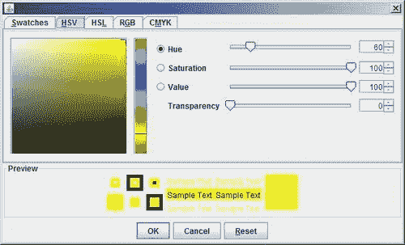

同样在 Java7 中，可以自定义被拖动的 JApplet 的标题，并指定它是否应该被修饰。这是通过 `script`标记完成的，如下所示：

```java
<script src="http://javascript source file"></script>
<script>
var attributes = { code:'AppletName', width:100, height:100 };
var parameters = {jnlp_href: 'appletname.jnlp',
java_decorated_frame: 'true',
java_applet_title: 'A Custom Title'
};
deployJava.runApplet(attributes, parameters, '7'7);
</script>

```

将 `java_decorated_frame`参数设置为 `true`以指定窗口应进行装饰。使用 `java_applet_title`参数指定窗口的标题。

本例改编自[http://download.oracle.com/javase/tutorial/deployment/applet/draggableApplet.html](http://download.oracle.com/javase/tutorial/deployment/applet/draggableApplet.html) 。有关如何创建可拖动小程序的更多详细信息，请访问该网站。

需要注意几个杂项更改。**光环外观**已从 `com.sun.java.swing`包装移至 `javax.swing`包装。 `isValidateRoot`方法已添加到 `Applet`类中，以指示容器是有效的根。最后，添加了基于**X11 XRender**扩展的新**Java2D**图形管道，以更好地访问**图形处理单元**（**GPU**。

# 混合重型和轻型组件

Java 为开发 GUI 应用程序提供了两组基本组件：**抽象窗口工具包**（**AWT**）和**Swing**。AWT 依赖于本机系统的底层代码，因此这些组件被称为重量级组件。另一方面，Swing 组件完全独立于本机系统运行，完全用 Java 代码实现，因此被称为轻量级组件。在以前的 Java 版本中，混合使用重量级和轻量级组件效率低下，而且很麻烦。在 `Java 6 Update 12`中，继续到 Java7，JVM 处理重量级和轻量级组件的混合。

## 准备好了吗

如果您使用的代码同时实现了重量级和轻量级组件，则无需对代码进行任何更改，因为 Java7 会自动处理这些组件。我们将从本章开始修改代码，以演示这一点：

1.  使用简介部分的代码示例创建一个新的应用程序。
2.  修改代码以同时使用重量级和轻量级示例。
3.  使用较旧版本的 Java 运行应用程序，然后再次使用 Java 7。

## 怎么做。。。

1.  按照本章引言中的说明创建新的窗口应用程序。将以下代码段添加到 `ApplicationWindow`构造函数中：

    ```java
    JMenuBar menuBar = new JMenuBar();
    JMenu menu = new JMenu("Overlapping Menu");
    JMenuItem menuItem = new JMenuItem("Overlapping Item");
    menu.add(menuItem);
    menuBar.add(menu);
    this.setJMenuBar(menuBar);
    this.validate();

    ```

2.  接下来，修改**退出**按钮的声明，使您现在使用的是重量级 `Button`而不是轻量级 `JButton`，如下所示：

    ```java
    Button exitButton = new Button("Exit");

    ```

3.  Execute the application. You need to run the application using a version of Java prior to **Java 6 Build 10** or the overlapping issue will not display. When the window opens, click on the menu and notice that, although the menu item overlaps the **Exit** button, the button shows through and covers the menu text. The following is an example of the overlap:

    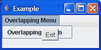

4.  现在，使用 Java7 再次运行应用程序。当您这次点击菜单时，您应该注意到重叠问题已经解决，如以下屏幕截图所示：

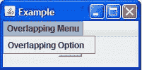

## 它是如何工作的。。。

JVM 自动处理组件的混合。在本例中，我们创建了一个场景来说明重叠问题，然后展示了如何在最新的 Java 版本中解决该问题。但是，在顶层框架上调用 `validate`方法是一种很好的做法，以确保正确地重新绘制所有形状。还有一种可能性是，可能需要取消以前混合成分的工作方法。

## 还有更多。。。

以下是使用 java 7：混合 T0 的混合组件时需要考虑的一些特定领域

*   高级 swing 事件可能无法正常工作，尤其是由 `javax.swing.InputMap`维护的事件。
*   不支持旨在允许重量级组件通过其可见的部分透明轻质组件。重量级项目将不会显示在半透明像素下。
*   重量级组件必须作为框架或小程序过程的一部分创建。
*   如果应用程序中已经处理了重量级和轻量级组件的混合，并且 Java 7 的添加导致了问题，那么可以使用 private `sun.awt.disableMixing`系统属性关闭混合支持。

# 管理窗口类型

`JFrame`类支持 `setType`方法，该方法将窗口的一般外观配置为三种类型之一。这可以简化窗口外观的设置。在本食谱中，我们将研究这些类型及其在 Windows 和 Linux 平台上的外观。

## 准备好了吗

要设置窗口类型，请将 `setType`方法与三种窗口类型之一结合使用，如 `java.awt.Window`类中的所示

*   `Type.NORMAL:`这表示一个正常窗口，是窗口的默认值
*   `Type.POPUP:`这是一个临时窗口，用于小面积区域，如刀尖
*   `Type.UTILITY:`这也是一个对象的小窗口，例如调色板

## 怎么做。。。

1.  按照本章引言中的说明创建新的窗口应用程序。在**退出**按钮创建之前添加以下语句：

    ```java
    this.setType(Type.POPUP);

    ```

2.  执行应用程序。在 Windows 系统上，窗口应显示如下：


## 它是如何工作的。。。

该方法的使用非常简单。在 `java. awt`包中找到 `Type`枚举。在 Windows 上，窗口显示如下屏幕截图所示。普通样式和弹出样式具有相同的外观。实用程序类型缺少最小化和最大化按钮：

下面的屏幕截图显示了窗口类型 `Type.NORMAL:`的示例


下面的屏幕截图显示了窗口类型 `Type.POPUP:`的示例

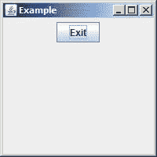

下面的屏幕截图显示了窗口类型 `Type.UTILITY:`的示例

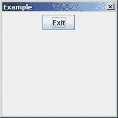

在 Ubuntu 上，窗口显示如下屏幕截图所示。普通和实用程序具有相同的外观，而弹出类型缺少按钮：

下面的屏幕截图显示了窗口类型 `Type.NORMAL:`的示例


下面的屏幕截图显示了窗口类型 `Type.POPUP:`的示例

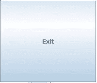

下面的屏幕截图显示了窗口类型 `Type.UTILITY:`的示例

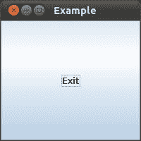

# 管理窗口的不透明度

窗口的不透明度是指窗口的透明度。当一个窗口完全不透明时，屏幕上的窗口后面什么都看不见。部分不透明的窗口允许背景透过。在本食谱中，我们将学习如何控制窗口的不透明度。

## 准备好了吗

要控制窗口的不透明度，请使用带有浮点数的 `JFrame`类“ `setOpacity`方法，该浮点数表示窗口的不透明程度。

## 怎么做。。。

1.  创建一个新的标准 GUI 应用程序，如本章引言中所述。将 `invokeLater`方法调用替换为以下代码：

    ```java
    JFrame.setDefaultLookAndFeelDecorated(true);
    SwingUtilities.invokeLater(new Runnable() {
    @Override
    public void run() {
    ApplicationWindow window = new ApplicationWindow();
    window.setOpacity(0.75f);
    window.setVisible(true);
    }
    });

    ```

2.  执行应用程序。该窗口应显示如下：

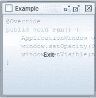

请注意此应用程序后面的窗口是如何显示的。在本例中，背景是应用程序的代码。

## 它是如何工作的。。。

`setOpacity`使用 `0.75f`设置窗口的不透明度。这导致了 75%的透明性，这可以从代码中看出。

不透明度的值范围为 0.0f 到 1.0f。值 1.0f 表示完全不透明的窗口，值 0.0f 表示完全透明的窗口。如果不透明度设置为 0.0f，则可能启用或不启用鼠标。这是由底层系统决定的。要将值设置为小于 1.0f，请执行以下操作：

*   必须支持半透明
*   窗户必须没有装饰
*   该窗口不能处于全屏模式

下一节将介绍确定是否支持半透明的步骤。 `getOpacity`方法可用于确定当前不透明度水平。

## 还有更多。。。

为了确定平台是否支持不透明性，我们需要使用 `java.awt.GraphicsDevice`类的实例。 `java.awt.GraphicsEnvironment`类包含当前平台的 `GraphicsDevice`对象列表。 `GraphicsDevice`通常指可用的屏幕，但可以包括打印机或图像缓冲区。每个 `GraphicsDevice`还可以包含一组 `GraphicsConfiguration`对象，用于指定设备可能的配置，例如其分辨率和支持的颜色模型。

在下面的代码序列中，我们得到一个 `GraphicsEnvironment`对象的实例，然后使用其 `getDefaultScreenDevice`方法得到一个 `GraphicsDevice`对象。针对 `GraphicsDevice`对象使用 `isWindowTranslucencySupported`方法来确定是否支持透明度：

```java
GraphicsEnvironment graphicsEnvironment =
GraphicsEnvironment.getLocalGraphicsEnvironment();
GraphicsDevice graphicsDevice = graphicsEnvironment.getDefaultScreenDevice();
if (!graphicsDevice.isWindowTranslucencySupported(
GraphicsDevice.WindowTranslucency.TRANSLUCENT)) {
System.err.println(
"Translucency is not supported on this platform");
System.exit(0);
}

```

`GraphicsDevice.WindowTranslucency`枚举表示平台可能支持的透明度类型。其值汇总如下表所示。alpha 值表示透明度级别：

<colgroup><col width="1.8875" style="text-align: left"> <col width="3.60555555555556" style="text-align: left"></colgroup> 
| 

价值

 | 

意思

 |
| --- | --- |
| `PERPIXEL_TRANSLUCENT` | 表示系统支持使用可能不同的 alpha 值设置某些像素 |
| `PERPIXEL_TRANSPARENT` | 表示系统支持将所有像素设置为 0.0f 或 1.0f |
| `TRANSLUCENT` | 表示系统支持使用 alpha 值设置所有像素 |

## 另见

*使用新的 JLayer Decorator 作为密码字段*配方解决了如何在 `JComponent`顶部绘制。

# 创建渐变半透明窗口

在某些情况下，应用程序窗口可以通过添加特殊的图形功能在美学上得到增强。Java7 支持使用渐变半透明窗口，半透明既可以是视觉上有趣的，也可以是功能性的。

此配方将演示如何在窗口上同时使用透明度功能和颜色渐变。

## 准备好了吗

要创建半透明渐变色窗口，您需要：

1.  执行检查以确保系统环境支持每像素半透明。
2.  设置背景色，使窗口最初完全透明。
3.  创建一个 `java.awt.GradientPaint`对象来指定渐变的颜色和位置。

## 怎么做。。。

1.  创建一个新的标准 GUI 应用程序，如本章引言中所述。在线程开始之前，将以下代码添加到 `ApplicationDriver`类：

    ```java
    GraphicsEnvironment envmt =
    GraphicsEnvironment.getLocalGraphicsEnvironment();
    GraphicsDevice device = envmt.getDefaultScreenDevice();
    if (!device.isWindowTranslucencySupported (WindowTranslucency.PERPIXEL_TRANSLUCENT)) {
    System.out.println("Translucent windows are not supported on your system.");
    System.exit(0);
    }
    JFrame.setDefaultLookAndFeelDecorated(true);

    ```

2.  接下来，将 `ApplicationWindow`构造器的主体替换为以下代码序列：

    ```java
    this.setTitle("Gradient Translucent Window");
    setBackground(new Color(0, 0, 0, 0));
    this.setSize(500, 700);
    this.setLocationRelativeTo(null);
    this.setDefaultCloseOperation(JFrame.EXIT_ON_CLOSE);
    JPanel panel = new JPanel() {
    @Override
    protected void paintComponent(Graphics gradient) {
    if (gradient instanceof Graphics2D) {
    final int Red = 120;
    final int Green = 50;
    final int Blue = 150;
    Paint paint = new GradientPaint(0.0f, 0.0f,
    new Color(Red, Green, Blue, 0),
    getWidth(), getHeight(),
    new Color(Red, Green, Blue, 255));
    Graphics2D gradient2d = (Graphics2D) gradient;
    gradient2d.setPaint(paint);
    gradient2d.fillRect(0, 0, getWidth(), getHeight());
    }
    }
    };
    this.setContentPane(panel);
    this.setLayout(new FlowLayout());
    JButton exitButton = new JButton("Exit");
    this.add(exitButton);
    exitButton.addActionListener(new ActionListener() {
    public void actionPerformed(ActionEvent event) {
    System.exit(0);
    }
    });

    ```

3.  执行应用程序。您的窗口应如下所示：

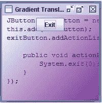

## 它是如何工作的。。。

首先，我们在 `ApplicationDriver`类中添加了代码，以测试系统是否支持每像素半透明。在我们的示例中，如果不支持它，应用程序将退出。这在*中有更详细的讨论，还有更多。。*。*部分管理窗口*配方的不透明度。

不应在装饰过的窗户上使用渐变。我们调用了 `setDefaultLookAndFeelDecorated`方法来确保使用默认的外观。在 Windows 7 上执行时，这将导致未装饰的窗口。

在 `ApplicationDriver`类中，我们首先设置窗口的背景色。我们使用 `(0, 0, 0, 0)`来指定每种颜色（红色、绿色和蓝色）的饱和度水平，以及 alpha 值为零。颜色值可以是 0 到 255 之间的任何整数，但我们希望在启动窗口时不使用任何颜色。alpha 值为零意味着我们的窗口将是完全透明的。

接下来，我们创建了一个新的 `JPanel`。在 `JPanel`中，我们超越了 `paintComponent`方法，创建了一个新的 `GradientPaint`对象。 `GradientPaint`类有四个构造函数。我们选择使用需要浮点数的渐变点的 X 和 Y 坐标，以及 `Color`对象来指定渐变的颜色。您还可以选择传递 `Point2D`对象而不是浮点数。

通过浮点数或 `Point2D`对象指定的第一个点表示渐变的开始。在我们的示例中，第二个两个由 `getWidth`和 `getHeight`方法确定，确定梯度的终点。在我们的示例中，结果是一个渐变，它从左上角的灯光开始，向下和向右移动时逐渐变暗。

最后，我们将渐变投射为 `Graphics2D`对象，并调用 `setPaint`和 `fillRect`方法来绘制窗口的渐变。

## 另见

使用 `GraphicsDevice`对象确定透明度支持的级别在*中有更多详细讨论。。*。*部分管理窗口*配方的不透明度。

# 管理窗口的形状

在应用程序开发中，有时创建特殊形状的窗口是有趣和有用的。从第 7 版开始，Java 现在就提供了此功能。在此配方中，我们将开发一个停止标志形状窗口，以确保用户希望继续某些操作。

## 准备好了吗

要创建特殊形状的窗口，您必须：

1.  验证给定系统是否支持每像素半透明。
2.  创建一个组件侦听器来捕获 `componentResized`事件。
3.  创建一个形状实例并将其传递给 `setShape`方法。

## 怎么做。。。

1.  创建一个新的标准 GUI 应用程序，如本章引言中所述。在 `main`方法中，在开始螺纹之前，通过添加以下代码进行测试，以确保成型窗口在系统上得到支持：

    ```java
    GraphicsEnvironment envmt =
    GraphicsEnvironment.getLocalGraphicsEnvironment();
    GraphicsDevice device = envmt.getDefaultScreenDevice();
    if (!device.isWindowTranslucencySupported(
    WindowTranslucency.PERPIXEL_TRANSLUCENT)) {
    System.out.println("Shaped windows not supported");
    System.exit(0);
    }

    ```

2.  创建一个从 `JPanel`派生的名为 `StopPanel`的新类，并向其添加以下构造函数：

    ```java
    public StopPanel() {
    this.setBackground(Color.red);
    this.setForeground(Color.red);
    this.setLayout(null);
    JButton okButton = new JButton("YES");
    JButton cancelButton = new JButton("NO");
    okButton.setBounds(90, 225, 65, 50);
    cancelButton.setBounds(150, 225, 65, 50);
    okButton.addActionListener(new ActionListener() {
    public void actionPerformed(ActionEvent event) {
    System.exit(0);
    }
    });
    cancelButton.addActionListener(new ActionListener() {
    public void actionPerformed(ActionEvent event) {
    System.exit(0);
    }
    });
    this.add(okButton);
    this.add(cancelButton);
    }

    ```

3.  您还需要为 `StopPanel`类实现 `paintComponent`方法。它负责向我们的窗口显示文本。以下是实现此方法的一种方式：

    ```java
    @Override
    public void paintComponent(Graphics g) {
    super.paintComponent(g);
    Graphics2D g2d = (Graphics2D) g;
    int pageHeight = this.getHeight();
    int pageWidth = this.getWidth();
    int bigHeight = (pageHeight+80)/2;
    int bigWidth = (pageWidth-305)/2;
    int smallHeight = (pageHeight+125)/2;
    int smallWidth = (pageWidth-225)/2;
    Font bigFont = new Font("Castellar", Font.BOLD, 112);
    Font smallFont = new Font("Castellar", Font.PLAIN, 14);
    g2d.setFont(bigFont);
    g2d.setColor(Color.white);
    g2d.drawString("STOP", bigWidth, bigHeight);
    g2d.setFont(smallFont);
    g2d.drawString("Are you sure you want to continue?", smallWidth, smallHeight);
    }

    ```

4.  在 `ApplicationWindow`类中，在**退出**按钮创建之前，创建一个 `StopPanel`的新实例。接下来，创建一个 `Shape`的新实例。在我们的示例中，我们使用 `getPolygon`方法创建了一个 `Polygon`对象，如下所示：

    ```java
    this.add(new StopPanel());
    final Polygon myShape = getPolygon();

    ```

5.  然后在代码前面添加一个 `componentListener`按钮，创建**退出**按钮，捕捉 `componentResized`事件。在侦听器中，针对 `Shape`对象调用 `setShape`方法。我们还将在此处设置前景色和背景色：

    ```java
    this.addComponentListener(new ComponentAdapter() {
    @Override
    public void componentResized(ComponentEvent e) {
    setShape(myShape);
    ((JFrame) e.getSource()).setForeground(Color.red);
    ((JFrame) e.getSource()).setBackground(Color.red);
    }
    });

    ```

6.  添加对 `setUndecorated`方法的调用，并将属性设置为 `true:`

    ```java
    setUndecorated(true);

    ```

7.  接下来，将 `getPolygon`方法添加到类中。此方法使用两个整数数组结合 `Polygon`类的 `addPoint`方法

    ```java
    private Polygon getPolygon() {
    int x1Points[] = {0, 0, 100, 200, 300, 300, 200, 100};
    int y1Points[] = {100, 200, 300, 300, 200, 100, 0, 0};
    Polygon polygon = new Polygon();
    for (int i = 0; i < y1Points.length; i++) {
    polygon.addPoint(x1Points[i], y1Points[i]);
    }
    return polygon;
    }

    ```

    创建一个八角形
8.  执行应用程序时，您应该会看到一个八角形窗口，其格式如下：


## 它是如何工作的。。。

我们的初始测试验证了每像素的半透明性，这使我们能够根据应用程序运行的系统的需要定制应用程序。在我们的示例中，如果不支持该属性，我们只需退出应用程序，尽管在现实环境中，您可能希望打开一个不太复杂的窗口。检测操作系统支持在*中有更详细的讨论。。*。*部分管理窗口*配方的不透明度。

`StopPanel`类实现了 `JPanel`接口，并允许我们添加在窗口中使用的自定义文本和按钮。因为我们的窗口使用了一种特殊的形状，所以我们选择用一个参数 `null`调用 `setLayout`方法，这反过来允许我们使用 `setBounds`方法明确地将按钮放置在窗口上我们想要的位置。需要注意的是，尽管窗口显示为八角形或您选择的任何其他形状，但实际上窗口仍然是一个矩形，如 `setSize`方法所指定。因此，按钮和其他对象可以放置在窗口上，但如果它们位于形状设置的边界之外，则不可见。

使用 `paintComponent`方法自定义窗口上的文本。在这个方法中，我们设置文本的大小、样式和位置，并调用 `drawString`方法将其实际绘制到屏幕上。

为了实际创建一个八角形窗口，我们创建了 `getPolygon`方法并手动绘制多边形。但是，如果您想使用一个具有已由实现 `Shape`接口的类定义的形状的窗口，则不需要创建单独的方法。您只需将 `Shape`对象传递给 `setShape`方法。如果 `setShape`方法的参数为 `null`，则窗口将调整为给定系统的默认值，通常为矩形。

在 `componentResized`事件中执行 `setShape`方法非常重要。这样可以确保在重新绘制窗口时，将调用 `setShape`方法并保持形状。调用 `setUndecorated`方法也很重要，因为目前，特殊形状的窗户将丢失装饰。此外，窗口可能未处于全屏模式。

## 另见

使用 `GraphicsDevice`对象确定透明度支持的级别在*中有更多详细讨论。。*。*部分管理窗口*配方的不透明度。

# 在 Java 7 中使用新的边框类型

边框用于 swing 组件的轮廓。在 Java7 中，有几个新的边框选项可用。在这个配方中，我们将开发一个简单的应用程序来演示如何创建边界以及这些边界是如何显示的。

## 准备好了吗

要创建和使用边框：

1.  使用 `javax.swing.BorderFactory`方法创建新边框。
2.  将 border 对象用作针对 `JComponent`对象应用的 `setBorder`方法的参数。

## 怎么做。。。

1.  创建一个新的标准 GUI 应用程序，如本章引言中所述。修改 `ApplicationWindow`类以替换以下行：

    ```java
    JButton exitButton = new JButton("Exit");
    this.add(exitButton);

    ```

2.  代码如下：

    ```java
    JPanel panel = new JPanel();
    panel.setBorder(BorderFactory.createRaisedSoftBevelBorder());
    this.setLayout(new FlowLayout());
    JButton exitButton = new JButton("Exit");
    panel.add(exitButton);
    this.add(panel);

    ```

3.  Execute the application. The window should appear as follows:

    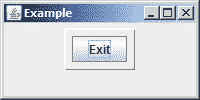

## 它是如何工作的。。。

`setBorder`方法将 `JPanel`的边框改为凸起的软斜面边框。 `BorderFactory`方法拥有许多创建边界的静态方法。下表总结了 Java 7 中可用的新边框：

<colgroup><col width="3.14513888888889" style="text-align: left"> <col width="2.34791666666667" style="text-align: left"></colgroup> 
| 

方法

 | 

视觉效果

 |
| --- | --- |
| 默认边框 | 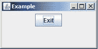 |
| `createRaisedSoftBevelBorder()` |  |
| `createLineBorder(Color.BLACK, 1, true)`第一个参数是边框的颜色。第二个参数是它的厚度，而第三个参数指定是否应该圆角。 | 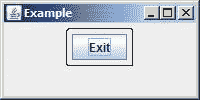 |
| `createLoweredSoftBevelBorder()` | 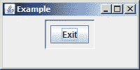 |
| `createSoftBevelBorder(BevelBorder.LOWERED)`这与 `createLoweredSoftBevelBorder()`具有相同的效果 |  |
| `createSoftBevelBorder(BevelBorder.RAISED)`这与 `createRaisedSoftBevelBorder()`具有相同的效果 |  |
| `createSoftBevelBorder(BevelBorder.LOWERED, Color.lightGray, Color.yellow)`第一个参数是边框的类型： `RAISED`或 `LOWERED.`第二个参数是外部高亮显示区域的颜色第三个参数是内边缘的颜色 |  |
| `createSoftBevelBorder(BevelBorder.RAISED,Color.lightGray, Color.yellow)`与 `createSoftBevelBorder`相同的参数 | 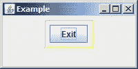 |
| `createSoftBevelBorder(BevelBorder.LOWERED, Color.lightGray, Color.lightGray, Color.white, Color.orange)`参数用于边框高亮显示和阴影区域的内边缘和外边缘 | 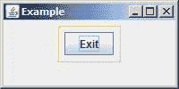 |
| `createStrokeBorder(new BasicStroke(1.0f))`第二个重载方法将 `Paint`对象作为第二个参数，用于生成颜色 | 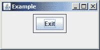 |
| `createDashedBorder(Color.red)` | 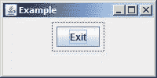 |
| `createDashedBorder(Color.red, 4.0f, 1.0f)`第二个参数是虚线的相对长度，第三个参数是空间的相对长度。 | 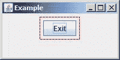 |
| `createDashedBorder(Color.red, 2.0f, 10.0f, 1.0f, true)`第二个参数指定线条的厚度。第三个和第四个参数分别指定长度和间距，而最后一个布尔参数确定端点是否为圆角。 | 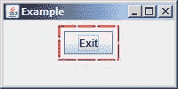 |

任何 `JComponent`类的边框都可以更改。但是，外观并不总是可以接受的。正如我们在本例中所做的那样，有时更改封闭的 `JPanel`对象上的边框会更好。

# 在 FileDialog 类中处理多个文件选择

使用*Ctrl*和/或*Shift*键结合鼠标，可以在文件对话框中选择两个或多个文件或目录。在 Java 7 中，文件对话框使用 `java.awt.FileDialog`类的 `setMultipleMode`方法启用或禁用此功能。这个简单的增强在这个配方中有说明。

## 准备好了吗

要在打印对话框中启用或禁用多个文件的选择：

1.  创建一个新的 `FileDialog`对象。
2.  使用其 `setMultipleMode`方法确定其行为。
3.  显示对话框。
4.  使用返回值确定选择了哪些文件。

## 怎么做。。。

1.  创建一个新的标准 GUI 应用程序，如本章引言中所述。修改 `ApplicationWindow`类，添加一个按钮，显示一个文件对话框，如下代码所示。在匿名内部类中，我们将显示对话框：

    ```java
    public ApplicationWindow() {
    this.setTitle("Example");
    this.setSize(200, 100);
    this.setLocationRelativeTo(null);
    this.setDefaultCloseOperation(JFrame.EXIT_ON_CLOSE);
    this.setLayout(new FlowLayout());
    final FileDialog fileDialog = new FileDialog(this, "FileDialog");
    fileDialog.setMultipleMode(true);
    JButton fileDialogButton = new JButton("File Dialog");
    fileDialogButton.addActionListener(new ActionListener() {
    public void actionPerformed(ActionEvent event) {
    fileDialog.setVisible(true);
    }
    });
    this.add(fileDialogButton);
    JButton exitButton = new JButton("Exit");
    exitButton.addActionListener(new ActionListener() {
    public void actionPerformed(ActionEvent event) {
    System.exit(0);
    }
    });
    this.add(exitButton);
    }

    ```

2.  Execute the application. The application window should appear as follows:

    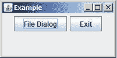

3.  Select the **File Dialog** button and the following dialog box should appear. Navigate to a directory and select a few files. In the window that follows, two files of the `/home/music` directory have been selected:

    

## 它是如何工作的。。。

`fileDialog`类的 `setMultipleMode`方法是在参数为 `true`的情况下执行的。这启用了文件的多个选择。创建了一个匿名内部类来处理文件按钮事件的选择。在 `actionPerformed`方法中，对话框是可见的。

## 还有更多。。。

要确定选择了哪些文件，我们可以使用 `fileDialog`类的 `getFiles`方法。在 `fileDialog`类 `setVisible`方法后添加以下代码：

```java
File files[] = fileDialog.getFiles();
for (File file : files) {
System.out.println("File: " + file.getName());
}

```

该方法返回一个 `File`对象数组。使用 for-each 循环，我们可以显示所选每个文件的名称。执行应用程序并选择几个文件。所选音乐文件的输出应如下所示：

**文件：未来设置 A.mp3**

**文件：太空机 A.mp3**

# 控制打印对话框类型

`java.awt.PrintJob`类中的标准打印对话框允许使用通用对话框和本机对话框。这提供了根据平台更好地定制应用程序的能力。对话框类型的规范很简单。

## 准备好了吗

要指定打印对话框类型并使用打印对话框，需要遵循以下步骤：

1.  创建一个 `javax.print.attribute.PrintRequestAttributeSet`对象。
2.  为此对象指定所需的对话框类型。
3.  创建一个 `PrinterJob`对象。
4.  使用 `PrintRequestAttributeSet`对象作为 `PrinterJob`类的 `printDialog`方法的参数。

## 怎么做。。。

1.  创建一个新的标准 GUI 应用程序，如本章引言中所述。修改 `ApplicationWindow`类，添加一个按钮，显示如下所示的打印对话框。在匿名内部类中，我们将显示一个打印机对话框：

    ```java
    public ApplicationWindow() {
    this.setTitle("Example");
    this.setSize(200, 100);
    this.setLocationRelativeTo(null);
    this.setDefaultCloseOperation(JFrame.EXIT_ON_CLOSE);
    this.setLayout(new FlowLayout());
    JButton printDialogButton = new JButton("Print Dialog");
    printDialogButton.addActionListener(new ActionListener() {
    public void actionPerformed(ActionEvent event) {
    final PrintRequestAttributeSet attributes = new HashPrintRequestAttributeSet();
    attributes.add(DialogTypeSelection.COMMON);
    PrinterJob printJob = PrinterJob.getPrinterJob();
    printJob.printDialog(attributes);
    }
    });
    this.add(printDialogButton);
    JButton exitButton = new JButton("Exit");
    exitButton.addActionListener(new ActionListener() {
    public void actionPerformed(ActionEvent event) {
    System.exit(0);
    }
    });
    this.add(exitButton);
    }

    ```

2.  执行应用程序并选择**打印**按钮。出现的对话框应使用常见的外观类型，如以下屏幕截图所示：

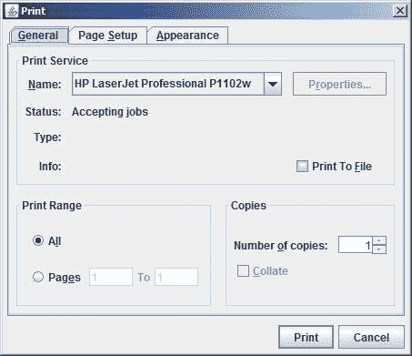

## 它是如何工作的。。。

创建了一个新的**打印**按钮，允许用户显示打印对话框。在用于处理按钮动作事件的匿名内部类中，我们基于 `javax.print.attribute.HashPrintRequestAttributeSet`类创建了一个 `PrintRequestAttributeSet`对象。这允许我们将 `DialogTypeSelection.NATIVE`属性添加到集合中。 `DialogTypeSelection`类是 Java 7 的新类，它提供了两个字段： `COMMON`和 `NATIVE`。

接下来，我们创建了一个 `PrinterJob`对象，并对该对象执行 `printDialog`方法。然后显示“打印”对话框。如果我们使用了 `NATIVE`类型，如下所示：

```java
attributes.add(DialogTypeSelection.NATIVE);

```

然后，打印对话框将在 Windows 平台上显示如下：


# 使用新的 JLayer decorator 作为密码字段

Java7 支持 GUI 组件的装饰，如文本框和面板。装饰是在构件顶部绘制以赋予其特殊外观的过程。例如，我们可能希望对一个界面添加水印，以显示它是 beta 版本，或者可能在文本字段中提供图形 X 的错误指示，否则是不可能的。

`javax.swing.JLayer`类提供了一种连接显示器组件、在组件上绘制额外图形以及截取事件的方法。事件和显示的处理委托给 `javax.swing.plaf.LayerUI`派生对象。当事件发生时，将执行处理该事件的方法。绘制组件时，将执行 `LayerUI`派生对象的 `paint`方法，根据需要显示图形。

在本食谱中，我们将学习 Java 如何支持此功能。在第一节中，我们将演示如何显示密码字段的错误消息。在*中还有更多。。*。第节，我们将演示如何为窗口创建水印。

## 准备好了吗

要装饰组件：

1.  创建要装饰的构件。
2.  创建一个实现装饰图形操作的 `LayerUI`派生类。
3.  基于组件和 `LayerUI`派生类创建 `JLayer`对象。
4.  将 `JLayer`对象添加到应用程序中。

## 怎么做。。。

1.  创建一个新的标准 GUI 应用程序，如本章引言中所述。使用以下 `ApplicationWindow`。在其构造函数中，我们将使用 `getPanel`方法执行基本步骤，以返回密码 `JPanel`对象。当用户输入密码时，窗口将显示一条提示密码太短的消息，直到输入至少六个字符：

    ```java
    public ApplicationWindow() {
    this.setTitle("Example");
    this.setSize(300, 100);
    this.setLocationRelativeTo(null);
    this.setDefaultCloseOperation(JFrame.EXIT_ON_CLOSE);
    LayerUI<JPanel> layerUI = new PasswordLayerUI();
    JLayer<JPanel> jlayer = new JLayer<JPanel>(getPanel(), layerUI);
    this.add(jlayer);
    }
    private JPanel getPanel() {
    JPanel panel = new JPanel(new BorderLayout());
    JPanel gridPanel = new JPanel(new GridLayout(1, 2));
    JLabel quantityLabel = new JLabel("Password");
    gridPanel.add(quantityLabel);
    JPasswordField passwordField = new JPasswordField();
    gridPanel.add(passwordField);
    panel.add(gridPanel, BorderLayout.CENTER);
    JPanel buttonPanel = new JPanel(new FlowLayout(FlowLayout.LEFT));
    JButton okButton = new JButton("OK");
    buttonPanel.add(okButton);
    JButton cancelButton = new JButton("Cancel");
    buttonPanel.add(cancelButton);
    panel.add(buttonPanel, BorderLayout.SOUTH);
    return panel;
    }

    ```

2.  接下来，创建 `PasswordLayerUI`类，如下代码所示。 `paint`方法将执行实际的装饰。其余方法用于启用键盘事件并在事件发生时进行处理：

    ```java
    class PasswordLayerUI extends LayerUI<JPanel> {
    private String errorMessage = "Password too short";
    @Override
    public void paint(Graphics g, JComponent c) {
    FontMetrics fontMetrics;
    Font font;
    int height;
    int width;
    super.paint(g, c);
    Graphics2D g2d = (Graphics2D) g.create();
    int componentWidth = c.getWidth();
    int componentHeight = c.getHeight();
    // Display error message
    g2d.setFont(c.getFont());
    fontMetrics = g2d.getFontMetrics(c.getFont());
    height = fontMetrics.getHeight();
    g2d.drawString(errorMessage,
    componentWidth / 2 + 10, componentHeight / 2 + height);
    g2d.dispose();
    }
    @Override
    public void installUI(JComponent component) {
    super.installUI(component);
    ((JLayer) component).setLayerEventMask(AWTEvent.KEY_EVENT_MASK);
    }
    @Override
    public void uninstallUI(JComponent component) {
    new JLayer decoratorusingsuper.uninstallUI(component);
    ((JLayer) component).setLayerEventMask(0);
    }
    protected void processKeyEvent(KeyEvent event, JLayer layer) {
    JTextField f = (JTextField) event.getSource();
    if (f.getText().length() < 6) {
    errorMessage = "Password too short";
    }
    else {
    errorMessage = "";
    }
    layer.repaint();
    }
    }

    ```

3.  Execute the application. Enter a few characters in the textbox. Your window should appear similar to the following:

    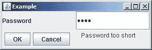

4.  输入至少六个字符。此时，装饰应消失，如下所示：


## 它是如何工作的。。。

在 `ApplicationWindow`中，我们创建了 `PasswordLayerUI`类的一个实例。我们使用这个对象以及 `getPanel`方法返回的 `JPanel`来创建 `JLayer`对象。然后将 `JLayer`对象添加到窗口中。

注意对 `LayerUI`和 `JLayer`对象使用泛型。这是用来确保所有元素都兼容的。我们使用了 `JPanel`，因为这是我们正在装饰的复合组件。

`JLayer`类提供了一种将密码框、错误消息的显示和密钥事件的截获捆绑在一起的方法。关键事件的处理和错误消息的显示委托给了 `PasswordLayerUI`对象。当按下一个键时，执行 `processKeyEvent`方法。绘制组件时，执行 `paint`方法，通过密码框显示错误消息。

在 `PasswordLayerUI`类中，我们声明了一个私有 `String`变量来保存错误消息。它是在这个级别声明的，因为它在多个方法中使用。

`paint`方法进行实际装饰。它被传递了一个表示我们可以绘制到的区域的 `Graphics`对象和一个 `JComponent`组件，在本例中是一个 `JPanel`。在 `paint`方法中，我们使用了组件的字体，还为错误消息创建了一个新的 `font`。计算组件的 `height`和 `width`以及错误字符串，并用于定位显示的错误字符串。

`installUI`和 `uninstallUI`方法涉及执行装饰所需的任何初始化。在本例中，它们用于使类能够拦截和处理键盘事件。 `setLayerEventMask`方法与 `AWTEvent.KEY_EVENT_MASK`参数一起使用，以启用键盘事件的处理。 `processKeyEvent`方法执行键盘事件的实际处理。在此方法中，密码文本字段内容的长度用于确定要显示的错误消息。

## 还有更多。。。

可以想象，可以使用标签来执行该示例。然而，本例旨在提供如何使用装饰的简单演示。如果不使用 `JLayer`和 `LayerUI`类，其他装饰（如水印）的创建就不那么容易。

在 `dispose`方法之前添加以下代码。此序列将向窗口添加水印，表明这是该界面的测试版。 `Castellar`字体用于为文本提供更加模版化的外观。 `Composite`对象用于更改字符串的 alpha 值。这将有效地控制所显示字符串的透明度。 `getComposite`方法用于获取窗口的当前组合，然后用于确定所使用的规则。该规则与α值 `0.25f`一起用于允许水印淡入背景，如下所示：

```java
// Display watermark
String displayText = "Beta Version";
font = new Font("Castellar",Font.PLAIN, 16);
fontMetrics = g2d.getFontMetrics(font);
g2d.setFont(font);
width = fontMetrics.stringWidth(displayText);
height = fontMetrics.getHeight();
Composite com = g2d.getComposite();
AlphaComposite ac = AlphaComposite.getInstance(
((AlphaComposite)com).getRule(),0.25f);
g2d.setComposite(ac);
g2d.drawString(displayText,
(componentWidth - width) / 2,
(componentHeight - height) / 2);

```

执行时，应用程序应与以下屏幕截图类似。请注意，水印位于所有封口中。这是使用 `Castellar`字体的结果，这是一种全大写字母字体，仿照罗马柱上用于奥古斯都的字母。

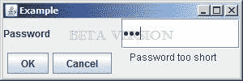