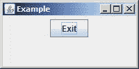
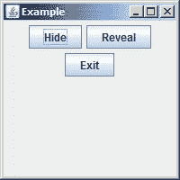
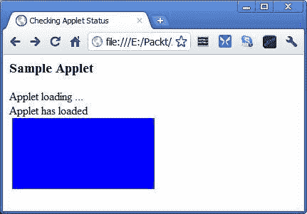

# 第八章事件处理

在本章中，我们将介绍以下内容：

*   管理额外的鼠标按钮和高分辨率鼠标滚轮
*   显示窗口时控制焦点
*   使用次回路模拟模态对话框
*   处理伪线程唤醒
*   使用事件处理程序处理小程序初始化状态

# 导言

Java7 中添加了一些处理事件或与事件相关的内容。这包括处理鼠标事件，其中为检测鼠标按钮和使用高分辨率鼠标滚轮提供了增强支持，我们将在*管理额外鼠标按钮和高分辨率鼠标滚轮*配方中看到。

当使用 `setVisible`或 `toFront`方法使窗口可见时，我们现在可以控制它们是否应该获得焦点。某些窗口可能出于信息或状态目的而显示，不一定需要或保证焦点。如何控制这种行为在*控制自动请求聚焦*配方中进行了解释。

读者应该熟悉模态对话框的行为。基本上，模式对话框在关闭之前不会将焦点返回到主窗口。有时，不使用对话框就可以模拟这种行为。例如，选择执行相对较长运行计算的按钮可能会从该行为中受益。*使用二次回路模拟模态对话框*的方法研究了如何实现这一点。

虽然不常见，但使用 `wait`方法时可能会发生虚假中断。 `java.awt.event.InvocationEvent`类的 `isDispatched`方法可用于处理虚假中断，详见*处理虚假线程唤醒*配方。

小程序还增强了与 JavaScript 代码通信的能力。使用事件处理程序处理小程序初始化状态的*配方描述了如何让 JavaScript 代码知道并利用知道小程序何时加载的优势。*

Java 7 中其他与事件相关的小改进（不保证配方）包括访问扩展密钥代码的可用性和为 `JSlider`类实现 `java.awt.iamg.ImageObserver`接口。

`KeyEvent`类已通过两种新方法进行了扩充： `getExtendedKeyCode`和 `getExtendedKeyCodeForChar`。第一种方法返回键的唯一整数，但与 `getKeyCode`方法不同，其值取决于键盘当前的配置方式。第二个方法返回给定 Unicode 字符的扩展密钥代码。

`imageUpdate`方法已添加到 `JSlider`类中。这允许类监视正在加载的映像的状态，尽管此功能可能最好用于派生自 `JSlider`的类。

# 管理额外的鼠标按钮和高分辨率鼠标滚轮

Java7 提供了更多处理鼠标事件的选项。 `java.awt.Toolkit`类“ `areExtraMouseButtonsEnabled`方法允许您确定系统是否支持超过标准设置的按钮。 `java.awt.event.MouseWheelEvent`类“ `getPreciseWheelRotation`方法可用于控制高分辨率鼠标滚轮上的动作。在这个配方中，我们将编写一个简单的应用程序来确定启用的鼠标按钮数并测试鼠标滚轮的旋转。

## 准备好了吗

首先，使用[第 7 章](07.html "Chapter 7. Graphical User Interface Improvements")、*图形用户界面改进*中的入门类 `ApplicationWindow`和 `ApplicationDriver`创建一个新的应用程序。

1.  实现 `MouseListener`和 `MouseWheelListener`接口捕获鼠标事件。
2.  使用 `areExtraMouseButtonsEnabled`和 `getPreciseWheelRotation`方法确定有关鼠标的特定信息。

## 怎么做。。。

1.  首先，我们将使用以下代码示例设置我们正在创建的 `JFrame`的基本信息：

    ```java
    public class ApplicationWindow extends JFrame {
    public ApplicationWindow() {
    this.setTitle("Example");
    this.setSize(200, 100);
    this.setLocationRelativeTo(null);
    this.setDefaultCloseOperation(JFrame.EXIT_ON_CLOSE);
    this.setLayout(new FlowLayout());
    JButton exitButton = new JButton("Exit");
    this.add(exitButton);
    }
    }

    ```

2.  接下来，我们想收集一些关于鼠标的信息。我们执行 `getNumberOfButtons`方法来确定鼠标上有多少个按钮。然后我们使用 `areExtraMouseButtonsEnabled`方法来确定鼠标上有多少个按钮可供我们使用。我们将此信息打印到控制台，如下所示：

    ```java
    int totalButtons = MouseInfo.getNumberOfButtons();
    System.out.println(Toolkit.getDefaultToolkit().areExtraMouseButtonsEnabled());
    System.out.println("You have " + totalButtons + " total buttons");

    ```

3.  接下来，我们启用侦听器：

    ```java
    this.addMouseListener(this);
    this.addMouseWheelListener(this);
    exitButton.addActionListener(new ActionListener() {
    public void actionPerformed(ActionEvent event) {
    System.exit(0);
    }
    });

    ```

4.  在 `mousePressed`事件方法中，使用 `getButton`方法简单打印出按下的按钮编号，如下所示：

    ```java
    public void mousePressed(MouseEvent e) {
    System.out.println("" + e.getButton());
    }

    ```

5.  实现其余的 `MouseListener`接口方法。在 `mouseWheelMoved`事件方法中，同时使用 `getPreciseWheelRotation`和 `getWheelRotation`方法打印出鼠标滚轮移动的具体信息：

    ```java
    public void mouseWheelMoved(MouseWheelEvent e) {
    System.out.println("" + e.getPreciseWheelRotation() +
    " - " + e.getWheelRotation());
    }

    ```

6.  Execute the application. You should see a `JFrame` window similar to the following:

    

7.  When you click in the window, you will see varying output in your console depending upon your mouse, which button you click, and in which direction you move your mouse wheel. Here is one possible output:

    **正确**

    **您总共有 5 个按钮**

    **1**

    **2**

    **3**

    **4**

    **5**

    **0.75-0**

    **1.0-1**

    **1.0-1**

    **1.116667-1**

    **-1.0-0**

    **-1.0--1**

    **-1.2916666667--1**

    **-1.225--1**

## 它是如何工作的。。。

`getNumberOfButtons`方法返回鼠标上的按钮总数。在上一个示例中，有五个按钮，但是如果应用程序在没有鼠标的系统上执行，它将返回一个 `-1`。在我们的 `mousePressed`方法中，我们打印了 `getButton`方法返回的单击按钮的名称。

我们执行了 `areExtraMouseButtonsEnabled`方法，以确定实际上支持并允许向 `EventQueue`添加额外的按钮。如果您想更改此的值，必须在初始化 `Toolkit`类之前进行更改，如*中所述，还有更多。。*。部分

由于启用了多个鼠标按钮，因此我们的输出显示了所有五个鼠标按钮的编号。在大多数情况下，鼠标滚轮也被视为按钮，并包含在计数中。

上一个控制台输出的最后几行是鼠标滚轮移动的指示。第一个，**0.75-0**表示鼠标滚轮向后移动或朝向用户。从 `getPreciseWheelRotation`方法的返回值 0.75 和 `getWheelRotation`方法的返回值 0 可以看出这一点。输出的最后一行**-1.225--1**相反地表示鼠标滚轮向前移动或远离用户。这由两种方法的负返回值表示。

此应用程序是使用高分辨率鼠标滚轮执行的。分辨率较低的鼠标滚轮将仅返回整数值。

## 还有更多。。。

有两种方法可以控制是否启用额外的鼠标按钮。第一种技术是使用以下命令行启动应用程序，并将 `sun.awt.enableExtraMouseButtons`属性设置为 `true`或 `false:`

```java
java -Dsun.awt.enableExtraMouseButtons=false ApplicationDriver

```

`D`选项使用 `false`值，指定不启用额外的鼠标按钮。第二种方法是在初始化 `Toolkit`类之前设置相同的属性。这可以通过以下代码完成：

```java
System.setProperty("sun.awt.enableExtraMouseButtons", "true");

```

# 显示窗口时控制焦点

`setAutoRequestFocus`方法已添加到 `java.awt.Window`类中，用于指定窗口在使用 `setVisible`或 `toFront`方法显示时是否应接收焦点。有时可能会使窗口可见，但我们不希望窗口具有焦点。例如，如果正在显示的窗口包含状态信息，使其可见就足够了。给它焦点可能没有意义，可能会迫使用户将焦点更改回原始窗口，从而使用户感到沮丧。

## 准备好了吗

当窗口可见时，为了控制焦点，我们将调用 `setAutoRequestFocus`方法，如果它应该接收焦点，则调用 `true`，否则调用 `false`值。

## 怎么做。。。

1.  为了演示此技术，我们将创建两个窗口。一个窗口将用于隐藏然后显示第二个窗口。通过在第二个窗口中使用 `setAutoRequestFocus`方法，我们可以控制它是否接收到焦点。
2.  首先使用以下驱动程序创建一个新项目。在驱动程序中，我们将创建如下第一个窗口：

    ```java
    public class ApplicationDriver {
    public static void main(String[] args) {
    SwingUtilities.invokeLater(new Runnable() {
    @Override
    public void run() {
    ApplicationWindow window = new ApplicationWindow();
    window.setVisible(true);
    }
    });
    }
    }

    ```

3.  接下来，添加 `ApplicationWindow`类。在这个类中，我们添加了两个按钮来隐藏和显示第二个窗口，第三个按钮用于退出应用程序，如下所示：

    ```java
    public class ApplicationWindow extends JFrame {
    private SecondWindow second;
    public ApplicationWindow() {
    this.setTitle("Example");
    this.setBounds(100, 100, 200, 200);
    this.setDefaultCloseOperation(JFrame.EXIT_ON_CLOSE);
    this.setLayout(new FlowLayout());
    second = new SecondWindow();
    second.setVisible(true);
    JButton secondButton = new JButton("Hide");
    this.add(secondButton);
    secondButton.addActionListener(new ActionListener() {
    public void actionPerformed(ActionEvent event) {
    second.setVisible(false);
    });
    JButton thirdButton = new JButton("Reveal");
    this.add(thirdButton);
    thirdButton.addActionListener(new ActionListener() {
    public void actionPerformed(ActionEvent event) {
    second.setVisible(true);
    }
    });
    JButton exitButton = new JButton("Exit");
    this.add(exitButton);
    exitButton.addActionListener(new ActionListener() {
    public void actionPerformed(ActionEvent event) {
    System.exit(0);
    }
    });
    }
    }

    ```

4.  下一步添加 `SecondWindow`类。这个简单的窗口除了使用 `setAutoRequestFocus`方法来控制其行为外什么都不做：

    ```java
    public class SecondWindow extends JFrame {
    public SecondWindow() {
    this.setTitle("Second Window");
    this.setBounds(400, 100, 200, 200);
    this.setDefaultCloseOperation(JFrame.EXIT_ON_CLOSE);
    this.setAutoRequestFocus(false);
    }
    }

    ```

5.  Execute the application. Both windows should appear with the focus on the first window, as shown in the following screenshot:

    

6.  The second window appears as follows:

    

7.  选择**隐藏**按钮。第二个窗口应该消失。接下来，选择**显示**按钮。第二个窗口应重新出现，且不应有焦点。这是 `setAutoRequestFocus`方法的效果，当与 `false`值一起使用时。
8.  停止应用程序并将 `setAutoRequestFocus`方法的参数更改为 `true`。重新执行应用程序，隐藏然后显示第二个窗口。当它被显示时，第二个窗口应该接收焦点。

## 它是如何工作的。。。

应用程序驱动程序显示应用程序窗口。在 `ApplicationWindow`类中，创建并显示了第二个窗口。此外，还创建了三个按钮，并创建了内部类来影响它们的每个操作。向 `setAutoRequestFocus`方法传递了一个 `false`值，以指定在显示窗口时不保留焦点。

## 还有更多。。。

这种方法对于从系统托盘运行的应用程序可能很有用。

### 注

请注意， `isAutoRequestFocus`方法可用于确定 `autoRequestFocus`值的值。

# 使用二次回路模拟模态对话框

`java.awt.EventQueue`类的 `SecondaryLoop`接口为模拟模态对话框的行为提供了一种方便的技术。模态对话框有两种行为。第一个是从用户的角度。在对话框完成之前，不允许用户与主窗口交互。第二个角度是从程序执行的角度。调用对话框的线程将被阻止，直到对话框关闭。

`SecondaryLoop`允许在阻塞当前线程的同时执行某些任务，直到二次循环完成。它可能没有关联的用户界面。如果用户选择的按钮不显示对话框，但涉及长时间运行的计算，则此选项非常有用。在此配方中，我们将演示如何使用二次循环并检查其行为。

## 准备好了吗

要创建和使用二次循环，需要遵循以下步骤：

1.  获取应用程序的默认 `java.awt.Toolkit`实例。
2.  使用此选项可获取对系统事件队列的引用。
3.  使用事件队列创建一个 `SecondaryLoop`对象。
4.  使用 `SecondaryLoop`接口的 `enter`方法启动循环。
5.  在二次循环中实现所需的行为。
6.  使用 `SecondaryLoop`接口的 `exit`方法终止循环。

## 怎么做。。。

1.  使用以下 `ApplicationDriver`类创建一个新的应用程序。它只显示应用程序的窗口，如下所示：

    ```java
    public class ApplicationDriver {
    public static void main(String[] args) {
    SwingUtilities.invokeLater(new Runnable() {
    @Override
    public void run() {
    ApplicationWindow window = new ApplicationWindow();
    window.setVisible(true);
    }
    });
    }
    }

    ```

2.  添加以下 `ApplicationWindow`类。它创建两个按钮，用于演示二次回路的行为：

    ```java
    public class ApplicationWindow extends JFrame implements ActionListener {
    private JButton firstButton;
    private JButton secondButton;
    public ApplicationWindow() {
    this.setTitle("Example");
    this.setBounds(100, 100, 200, 200);
    this.setDefaultCloseOperation(JFrame.EXIT_ON_CLOSE);
    this.setLayout(new FlowLayout());
    firstButton = new JButton("First");
    this.add(firstButton);
    firstButton.addActionListener(this);
    secondButton = new JButton("Second");
    this.add(secondButton);
    secondButton.addActionListener(this);
    }
    }

    ```

3.  接下来，添加以下 `actionPerformed`方法。创建一个 `SecondaryLoop`对象，并且根据所选的按钮，创建 `WorkerThread`对象如下：

    ```java
    @Override
    public void actionPerformed(ActionEvent e) {
    Thread worker;
    JButton button = (JButton) e.getSource();
    Toolkit toolkit = Toolkit.getDefaultToolkit();
    EventQueue eventQueue = toolkit.getSystemEventQueue();
    SecondaryLoop secondaryLoop = eventQueue.createSecondaryLoop();
    Calendar calendar = Calendar.getInstance();
    String name;
    if (button == firstButton) {
    name = "First-"+calendar.get(Calendar.MILLISECOND);
    }
    else {
    name = "Second-"+calendar.get(Calendar.MILLISECOND);
    }
    worker = new WorkerThread(secondaryLoop, name);
    worker.start();
    if (!secondaryLoop.enter()) {
    System.out.println("Error with the secondary loop");
    }
    else {
    System.out.println(name + " Secondary loop returned");
    }
    }

    ```

4.  添加以下 `WorkerThread`类作为内部类。其构造函数保存 `SecondaryLoop`对象，并向其传递消息。该信息将用于帮助我们解释结果。 `run`方法显示睡眠两秒前后的消息：

    ```java
    class WorkerThread extends Thread {
    private String message;
    private SecondaryLoop secondaryLoop;
    public WorkerThread(SecondaryLoop secondaryLoop, String message) {
    this.secondaryLoop = secondaryLoop;
    this.message = message;
    }
    @Override
    public void run() {
    System.out.println(message + " Loop Sleeping ... ");
    try {
    Thread.sleep(2000);
    }
    catch (InterruptedException ex) {
    ex.printStackTrace();
    }
    System.out.println(message + " Secondary loop completed with a result of " +
    secondaryLoop.exit());
    }
    }

    ```

5.  Execute the application. The following window should appear. It has been resized here:

    

6.  Next, select the **First** button. The following console output should illustrate the execution of the secondary loop. The number following **First-** will probably differ from your output:

    **第一-433 环路睡眠。。。**

    **第一-433 二次回路完成，结果为真**

    **第一-433 二次回路返回**

7.  While a secondary loop blocks the current thread, it does not prevent the window from continuing to execute. The window's UI thread is still active. To demonstrate this, restart the application and select the **First** button. Before two seconds have elapsed, select the **Second** button. The console output should be similar to the following:

    **First-360 循环睡眠。。。**

    **第二个 416 环路睡眠。。。**

    **First-360 二次回路完成，结果为真**

    **二次-416 二次回路完成，结果为真**

    **二次-416 二次回路返回**

    **First-360 二次回路返回**

这说明了二次回路的两个方面。第一个是应用程序仍然可以与用户交互，第二个是同时执行两个辅助循环的行为。具体地说，如果在第一个次级循环完成之前启动了第二个次级循环，则第一个次级循环将不会继续，直到嵌套（第二个）次级循环终止。

请注意，应用程序仍然响应用户输入。另外，请注意，**第二个-416**循环在**第一个-360**之后开始执行。然而，尽管**First-360**在**Second-416**之前完成，正如您所料，**First-360**循环没有返回并恢复阻塞线程的执行，直到**Second-416**循环返回之后。如果在两秒钟内选择两次**第一个**按钮，我们将看到相同的行为。

## 它是如何工作的。。。

在 `ApplicationWindow`中，我们创建了两个按钮。按钮被添加到应用程序中，然后与应用程序的 `ActionListener`接口实现相关联。我们使用**第一个**按钮来说明二次循环的执行。

在 `actionPerformed`方法中，我们使用 `Toolkit`类的 `getSystemEventQueue`方法来获取 `EventQueue`的一个实例。然后，该队列与 `createSecondaryLoop`方法一起用于创建二次循环。

为了跟踪潜在的多个二次循环，我们创建了一个 `Calendar`类的实例，并创建了一个唯一的名称，该名称派生自**First-**或**Second-**，后缀为以毫秒为单位的当前时间。虽然这种技术不能保证名称的唯一性，但两个循环不太可能具有相同的名称，对于我们的示例来说，这就足够了。

根据按下的按钮，使用 `secondaryLoop`对象和唯一名称创建 `WorkerThread`的实例。然后启动工作线程，并对 `secondaryLoop`执行 `enter`方法。

此时，次级循环将执行，当前线程将被阻塞。在 `WorkerThread`类中，会显示一条消息，指示执行了哪个二次循环。然后，它被暂停两秒钟，随后出现第二条消息，表明二次循环与 `exit`方法返回值一起完成。

`actionPerformed`方法的线程随后被解除阻塞，并显示最后一条消息，指示二次循环已完成，通知该线程已阻塞，直到二次循环完成。

这从应用程序的角度模拟了模式对话框的行为。创建次循环的线程将被阻塞，直到循环完成。虽然可以使用其他线程方法来实现类似的结果，但这种方法方便且易于使用。

## 还有更多。。。

如果一个 `SecondaryLoop`对象已处于活动状态，则不可能使用同一个 `SecondaryLoop`对象启动新循环。任何这样做的尝试都会导致 `enter`方法返回 `false`的值。但是，循环完成后，可以将该循环重新用于其他循环。这意味着随后可以针对相同的 `SecondaryLoop`对象执行 `enter`方法。

## 另见

参见[第 7 章](07.html "Chapter 7. Graphical User Interface Improvements")*图形用户界面改进*中的*使用新的 JLayer Decorator 的密码字段*配方。如果需要创建计时器小时沙漏类型的动画，可以在指示长时间运行过程的按钮上显示，则此配方非常有用。

# 处理伪线程唤醒

当使用多个线程时，一个线程可能需要等待一个或多个其他线程完成。必要时，一种方法是使用 `Object`类的 `wait`方法等待其他线程完成。这些其他线程需要使用 `Object`类的 `notify`或 `notifyAll`方法来允许等待继续的线程。

但是，在某些情况下可能会发生虚假唤醒调用。在 Java7 中，引入了 `java.awt.event.InvocationEvent`类的 `isDispatched`方法来解决这个问题。

## 准备好了吗

为避免虚假唤醒呼叫：

1.  添加一个同步块。
2.  根据特定于应用程序的条件和 `isDispatched`方法的结果创建 `while`循环。
3.  在循环体中使用 `wait`方法。

## 怎么做。。。

1.  由于虚假中断的性质，创建一个能够持续演示此行为的演示应用程序是不可行的。建议处理 a `wait`的方式如下所示：

    ```java
    synchronized (someObject) {
    Toolkit toolkit = Toolkit.getDefaultToolkit();
    EventQueue eventQueue = toolkit.getSystemEventQueue();
    while(someCondition && !eventQueue.isDispatchThread()) {
    try {
    wait();
    }
    catch (InterruptedException e) {
    }
    }
    // Continue processing
    }

    ```

2.  这种方法将消除虚假中断。

## 它是如何工作的。。。

首先，我们对正在处理的对象使用了一个同步块。接下来，我们获得一个 `EventQueue`的实例。 `while`循环将测试特定于应用程序的条件，以确定其是否应处于 `wait`状态。这可能只是一个布尔变量，指示队列已准备好进行处理。当条件为 `true`且 `isDispatched`方法返回 `false`时，循环将继续执行。这意味着如果该方法返回 `true`，那么该事件实际上是从事件队列中调度的。 `EventQueue.invokeAndWait`方法也会出现这种情况。

线程可能会无缘无故地从 `wait`方法中唤醒。可能未调用 `notify`或 `notifyAll`方法。这可能是由于 JVM 外部的条件导致的，这些条件通常是低级和微妙的。

在早期版本的**Java 语言规范**中，没有提到这个问题。然而，在 Java5 中， `wait`方法文档包含了对这个问题的讨论。Java 语言规范第三版**第 17.8.1 节**对该问题进行了澄清，见[http://java.sun.com/docs/books/jls/third_edition/html/memory.html#17.8.1](http://java.sun.com/docs/books/jls/third_edition/html/memory.html#17.8.1) 。

# 使用事件处理程序处理小程序初始化状态

JavaScript 代码能够调用 applet 方法。但是，在小程序初始化之前，这是不可能的。在加载小程序之前，任何与小程序通信的尝试都将被阻止。为了确定小程序何时加载，Java7 引入了一个加载状态变量，可以从 JavaScript 代码访问该变量。我们将探索如何设置一个 HTML 文件来检测和响应这些事件。

## 准备好了吗

要使用小程序的加载状态：

1.  创建 JavaScript 函数以处理小程序加载事件。
2.  部署小程序，将参数 `java_status_events`设置为 `true`。

## 怎么做。。。

1.  为 Java 小程序创建一个新的应用程序。在 `java.applet.Applet`类的 `init`方法中，我们将创建一个 `Graphics`对象来显示一个简单的蓝色矩形，然后休眠两秒钟。此延迟将模拟小程序的加载：

    ```java
    public class SampleApplet extends Applet {
    BufferedImage image;
    Graphics2D g2d;
    public void init() {
    int width = getWidth();
    int height = getHeight();
    image = new BufferedImage(width, height, BufferedImage.TYPE_INT_RGB);
    g2d = image.createGraphics();
    g2d.setPaint(Color.BLUE);
    g2d.fillRect(0, 0, width, height);
    try {
    Thread.sleep(2000);
    }
    catch (InterruptedException ie) {
    ie.printStackTrace();
    }
    }
    public void paint(Graphics g) {
    g.drawImage(image, 0, 0, this);
    }
    }

    ```

2.  将小程序打包到一个 `SampleApplet.jar`文件中。接下来，创建一个 HTML 文件，如下所示。第一部分包括声明标题和创建 `determineAppletState`函数，以检查小程序的加载状态，如下所示：

    ```java
    <HTML>
    <HEAD>
    <TITLE>Checking Applet Status</TITLE>
    <SCRIPT>
    function determineAppletState() {
    if (sampleApplet.status == 1) {
    document.getElementById("statediv").innerHTML = "Applet loading ...";
    sampleApplet.onLoad = onLoadHandler;
    }
    else if (sampleApplet.status == 2) {
    document.getElementById("statediv").innerHTML = "Applet already loaded";
    }
    else {
    document.getElementById("statediv").innerHTML = "Applet entered error while loading";
    }
    }
    function onLoadHandler() {
    document.getElementById("loadeddiv").innerHTML = "Applet has loaded";
    }
    </SCRIPT>
    </HEAD>

    ```

3.  接下来是 HTML 文件的主体。它使用 `onload`事件调用 `determineAppletState`函数。后面是一个标题字段和两个分区标记。分区将用于以下显示目的：

    ```java
    <BODY onload="determineAppletState()">
    <H3>Sample Applet</H3>
    <DIV ID="statediv">state</DIV>
    <DIV ID="loadeddiv"></DIV>

    ```

4.  使用 JavaScript 序列完成 HTML 文件，JavaScript 序列配置并执行小程序，如下所示：

    ```java
    <DIV>
    <SCRIPT src="http://www.java.com/js/deployJava.js"></SCRIPT>
    <SCRIPT>
    var attributes = {id:'sampleApplet', code:'SampleApplet.class', archive:'SampleApplet.jar', width:200,
    height:100};
    var parameters = {java_status_events: 'true'};
    deployJava.runApplet(attributes, parameters, '7'7);
    </SCRIPT>
    </DIV>
    </BODY>
    </HTML>

    ```

5.  将小程序加载到浏览器中。在这里，它被加载到 Chrome 中，如下所示：



## 它是如何工作的。。。

`SampleApplet`有两种方法： `init`和 `paint`。 `init`方法创建了一个 `BufferedImage`对象，用于显示一个蓝色正方形，其大小由分配给小程序的区域决定。最初，使用 `sleep`方法将加载延迟两秒钟，以模拟缓慢加载的小程序。 `paint`方法仅显示图像。当状态为加载时， `onLoadHandler`被指定为小程序完成加载时要调用的函数。当执行此功能时， `loadeddiv`分区元素中会显示一条相关信息。

在 HTML 文件的 body 标记中， `determineAppletState`函数被指定为将 HTML 加载到浏览器时要执行的函数。这确保了加载 HTML 文件时检查了加载状态。

将 `sampleApplet`ID 与 `SampleApplet`类关联的变量和属性。还指定了包含类和小程序大小的存档文件。为了利用此功能，小程序需要在部署时将 `java_status_events`参数设置为 `true`。

功能 `determineAppletState`使用负载状态变量 status 来显示负载过程的状态。HTML 分区元素中显示的消息显示了操作的顺序。

`deployJava.js`是**Java 部署工具包**的一部分，用于检测 JRE 的存在，必要时安装 JRE，然后运行小程序。也可用于其他**Web Start**节目。在本例中，它用于使用属性和参数以及要使用的 JRE 版本（即 Java 7）执行小程序。

### 注

有关使用 `deployJava.js`执行 Java 应用程序部署的更多信息，请参见[http://download.oracle.com/javase/7/docs/technotes/guides/jweb/index.html.](http://download.oracle.com/javase/7/docs/technotes/guides/jweb/index.html.)

有三个小程序状态值，详见下表：

<colgroup><col width="0.8875" style="text-align: left"> <col width="0.520833333333333" style="text-align: left"> <col width="2.04861111111111" style="text-align: left"></colgroup> 
| 

地位

 | 

价值

 | 

意思

 |
| --- | --- | --- |
| `LOADING` | *1* | 小程序正在加载 |
| `READY` | *2* | 小程序已加载 |