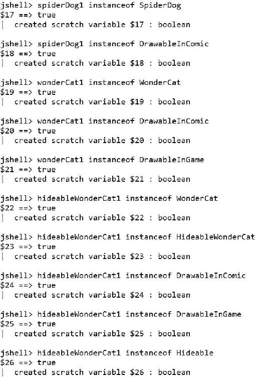
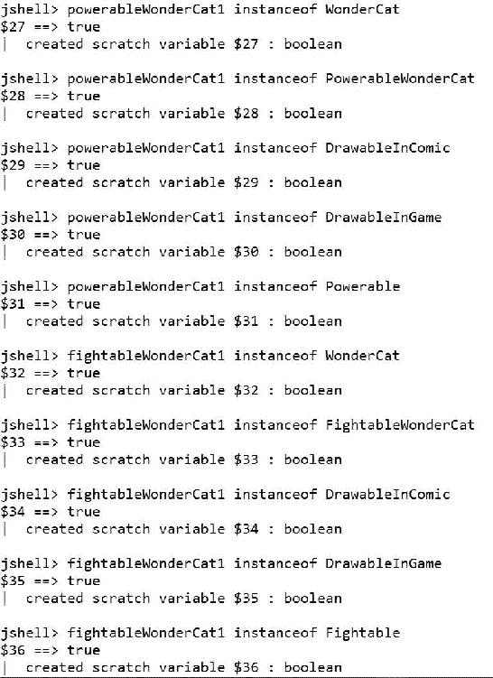

# 第 8 章带接口的合同编程

在本章中，我们将处理复杂的场景，其中必须使用属于多个蓝图的实例。我们将利用这些接口进行合同编程。我们将：

*   了解 Java9 中的接口
*   了解接口如何与类结合工作
*   在 Java9 中声明接口
*   声明实现接口的类
*   利用接口的多重继承
*   将类继承与接口相结合

# 了解接口如何与类结合工作

让我们想象一下，我们必须开发一个 Web 服务，其中我们必须处理两种不同类型的角色：漫画角色和游戏角色。

漫画人物必须可在漫画中绘制。喜剧角色必须能够提供昵称并执行以下任务：

*   绘制一个带有消息的语音气球，也称为语音气泡
*   画一个思想气球，也被称为思想泡泡，带有一条信息
*   绘制一个带有消息和另一个漫画人物（可在漫画中绘制）的演讲气球，作为目的地

游戏角色必须可在游戏场景中绘制。游戏角色必须能够提供全名及其当前分数。此外，游戏角色必须能够执行以下任务：

*   将其所需位置设置为由*x*和*y*坐标指示的特定 2D 位置
*   提供其*x*坐标的值
*   提供其*y*坐标的值
*   在当前位置绘制自身
*   检查它是否与另一个游戏角色相交，可在游戏场景中绘制

我们必须能够处理既可以是喜剧角色又可以是游戏角色的对象；也就是说，它们既可以在漫画中绘制，也可以在游戏场景中绘制。然而，我们也将处理那些仅仅是喜剧或游戏角色的对象；也就是说，它们可以在漫画或游戏场景中绘制。

我们不想编写一种执行前面描述的任务的通用方法。我们希望确保许多类能够使用公共接口执行这些任务。每一个在漫画中宣称自己是可画的对象都必须定义与语言和思想气球相关的任务。每个在游戏场景中声明自己为可绘制的对象必须定义如何设置其所需的 2D 位置、绘制自身，并检查其是否与另一个游戏角色相交（可在游戏场景中绘制）。

**蜘蛛狗**是一个漫画人物，可在漫画中绘制，有一种特定的方式来绘制语言和思想气球。**WonderCat**既是漫画角色又是游戏角色，可在漫画和游戏场景中绘制。因此，WonderCat 必须定义这两种字符类型所需的所有任务。

WonderCat 是一个多才多艺的角色，它可以使用不同的服装参与不同名称的游戏或漫画。WonderCat 还可以隐藏、供电或战斗：

*   可隐藏的角色能够被隐藏。它可以提供特定数量的眼睛，并且必须能够显示和隐藏自己。
*   可通电的角色能够通电。它可以提供一个法术能力得分值，并使用该法术能力使一个隐藏角色消失。
*   一个好战的角色能够战斗。它有一把剑，可以提供剑的力量和重量值。此外，一个可战斗的角色可以在有或没有可隐藏角色作为目标的情况下拔出他的剑。

让我们想象一下，Java9 提供了对多重继承的支持。我们需要基础蓝图来表现一个喜剧角色和一个游戏角色。然后，表示这些类型的字符的每个类都可以提供其方法的实现。在这种情况下，喜剧角色和游戏角色是非常不同的，他们不执行类似的任务，这可能会导致混乱和多重继承问题。因此，我们可以使用多重继承来创建一个实现漫画和游戏角色蓝图的`WonderCat`类。在某些情况下，多重继承并不方便，因为类似的蓝图可能有同名的方法，使用多重继承可能会非常混乱。

此外，我们可以使用多重继承将`WonderCat`类与`Hideable`、`Powerable`和`Fightable`组合起来。这样，我们将有一个`Hideable`+`WonderCat`、一个`Powerable`+`WonderCat`和一个`Fightable`+`WonderCat`。我们可以使用其中任何一个，`Hideable`+`WonderCat`、`Powerable`+`WonderCat`或`Fightable`+`WonderCat`作为喜剧或游戏角色。

我们的目标很简单，但我们面临一个小问题：Java9 不支持类的多重继承。相反，我们可以对接口使用多重继承，或者将接口与类组合。因此，我们将使用接口和类来满足前面的需求。

在前面的章节中，我们一直在处理抽象类和具体类。当我们编码抽象类时，我们声明了构造函数、实例字段、实例方法和抽象方法。抽象类具有混合了抽象方法的具体实例方法。

在这种情况下，我们不需要为任何方法提供实现；我们只需确保提供了具有特定名称和参数的适当方法。您可以将**接口**视为一组相关的抽象方法，类必须实现这些方法才能将其视为使用接口名称标识的类型的成员。Java9 不允许我们为接口中的构造函数或实例字段指定要求。同样重要的是要考虑到接口不是类。

### 注

在其他编程语言中，接口称为协议。

例如，我们可以创建一个`Hideable`接口，指定以下具有空实体的无参数方法：

*   `getNumberOfEyes()`
*   `appear()`
*   `disappear()`

定义接口后，我们将创建一个新类型。因此，我们可以使用接口名称为参数指定所需的类型。这样，我们将使用接口作为类型，而不是使用类作为类型，并且可以使用实现特定接口的任何类的实例作为参数。例如，如果我们使用`Hideable`作为参数的必需类型，我们可以将实现`Hideable` 接口的任何类的实例作为参数传递。

### 提示

我们可以声明从多个接口继承的接口；也就是说，接口支持多重继承。

然而，与抽象类相比，您必须考虑接口的一些限制。接口不能指定构造函数或实例字段的要求，因为接口与方法和签名有关。接口可以声明以下成员的需求：

*   类常数
*   静态方法
*   实例方法
*   默认方法
*   嵌套类型

### 注

Java8 增加了向接口添加默认方法的可能性。它们允许我们声明实际提供实现的方法。Java9 保持了这个特性的活力。

# 声明接口

是时候用 Java 9 编写必要的接口了。我们将对以下五个接口进行编码：

*   `DrawableInComic`
*   `DrawableInGame`
*   `Hideable`
*   `Powerable`
*   `Fightable`

### 提示

一些编程语言，如 C#，使用`I`作为接口的前缀。Java9 对接口名不使用这种命名约定。因此，如果您看到一个名为`IDrawableInComic`的接口，它可能是由有 C#经验的人编写的，并将命名约定转移到 Java 领域。

下面的 UML 图显示了五个接口，我们将使用图中包含的所需方法对它们进行编码。注意，在每个声明接口的图中，我们在类名之前包含了**<<接口>>**文本。


以下行显示`DrawableInComic`接口的代码。`public`修饰符，后跟`interface`关键字和接口名称`DrawableInComic`，构成接口声明。与类声明一样，接口主体被括在花括号中（`{}`。样本的代码文件包含在`example08_01.java`文件的`java_9_oop_chapter_08_01`文件夹中。

```
public interface DrawableInComic {
    String getNickName();
    void drawSpeechBalloon(String message);
    void drawSpeechBalloon(DrawableInComic destination, String message);
    void drawThoughtBalloon(String message);
}
```

### 提示

接口中声明的成员有一个隐式的`public`修饰符，因此，不需要为每个方法声明指定`public`。

`DrawableInComic`接口声明了`getNickName`方法需求、两次重载的`drawSpeechBalloon`方法需求和`drawThoughtBalloon`方法需求。接口只包含方法声明，因为实现`DrawableInComic`接口的类将负责提供`getNickName`方法、`drawThoughtBalloon`方法和`drawSpeechBalloon`方法的两个重载的实现。请注意，没有方法体，正如我们为抽象类声明抽象方法时所发生的那样。不需要使用`abstract`关键字来声明这些方法，因为它们是隐式抽象的。

以下几行显示了`DrawableInGame`接口的代码。样本的代码文件包含在`java_9_oop_chapter_08_01`文件夹中的`example08_01.java`文件中。

```
public interface DrawableInGame {
    String getFullName();
    int getScore();
    int getX();
    int getY();
    void setLocation(int x, int y);
    void draw();
    boolean isIntersectingWith(DrawableInGame otherDrawableInGame);
}
```

`DrawableInGame`接口声明包括七种方法要求：`getFullName`、`getScore`、`getX`、`getY`、`setLocation`、`draw`、`isIntersectingWith`。

以下几行显示了`Hideable`接口的代码。样本的代码文件包含在`java_9_oop_chapter_08_01`文件夹中的`example08_01.java`文件中。

```
public interface Hideable {
    int getNumberOfEyes();
    void show();
    void hide();
}
```

`Hideable`接口声明包括三种方法要求：`getNumberOfEyes`、`show`、`hide`。

以下几行显示了`Powerable`接口的代码。样本的代码文件包含在`java_9_oop_chapter_08_01`文件夹中的`example08_01.java`文件中。

```
public interface Powerable {
    int getSpellPower();
    void useSpellToHide(Hideable hideable);
}
```

`Powerable`接口声明包括`getSpellPower`和`useSpellToHide`两种方法要求。正如前面声明的接口中包含的其他方法需求声明中所发生的那样，我们使用接口名称作为方法声明中的参数的类型。在本例中，`useSpellToHide`方法声明的`hideable`参数为`Hideable`。因此，我们将能够使用实现`Hideable`接口的任何类调用该方法。

以下几行显示了`Fightable`接口的代码。样本的代码文件包含在`java_9_oop_chapter_08_01`文件夹中的`example08_01.java`文件中。

```
public interface Fightable {
    int getSwordPower();
    int getSwordWeight();
    void unsheathSword();
    void unsheathSword(Hideable hideable);
}
```

`Fightable`接口声明包括四个方法要求：`getSwordPower`、`getSwordWeight`和`unsheathSword`方法的两个重载。

# 声明实现接口的类

现在，我们将声明一个具体的类，该类指定它在 JShell 中的声明中实现`DrawableInComic`接口。类声明不指定超类，而是在类名（`SiperDog`和`implements`关键字之后包含先前声明的`DrawableInComic`接口的名称。我们可以将该类声明理解为“该`SpiderDog`类实现了`DrawableInComic` 接口”。该示例的代码文件包含在`java_9_oop_chapter_08_01`文件夹中的`example08_02.java`文件中。

```
public class SpiderDog implements DrawableInComic {
}
```

Java 编译器将生成错误，因为`SpiderDog`类被声明为一个具体类，并且不会覆盖`DrawableInComic`接口中声明的所有抽象方法。JShell 向我们显示以下错误，表明接口中的第一个方法声明未被重写：

```
jshell> public class SpiderDog implements DrawableInComic {
 ...> }
|  Error:
|  SpiderDog is not abstract and does not override abstract method drawThoughtBalloon(java.lang.String) in DrawableInComic

```

现在，我们将用一个试图实现`DrawableInComic`接口的类来替换前面的空`SuperDog`类声明，但它仍然没有实现它的目标。以下几行显示了`SuperDog`类的新代码。样本的代码文件包含在`example08_03.java`文件的`java_9_oop_chapter_08_01`文件夹中。

```
public class SpiderDog implements DrawableInComic {
    protected final String nickName;

    public SpiderDog(String nickName) {
        this.nickName = nickName;
    }

    protected void speak(String message) {
        System.out.println(
            String.format("%s -> %s",
                nickName,
                message));
    }

    protected void think(String message) {
        System.out.println(
            String.format("%s -> ***%s***",
                nickName,
                message));
    }

    @Override
    String getNickName() {
        return nickName;
    }

    @Override
    void drawSpeechBalloon(String message) {
        speak(message);
    }

    @Override
    void drawSpeechBalloon(DrawableInComic destination, 
        String message) {
        speak(String.format("message: %s, %s",
            destination.getNickName(),
            message));
    }

    @Override
    void drawThoughtBalloon(String message) {
        think(message);
    }
}
```

Java 编译器将生成许多错误，因为`SpiderDog` 具体类没有实现`DrawableInComic`接口。JShell 向我们显示以下错误消息，表明接口需要将许多方法声明为`public`方法。

```
|  Error:
|  drawThoughtBalloon(java.lang.String) in SpiderDog cannot implement drawThoughtBalloon(java.lang.String) in DrawableInComic
|    attempting to assign weaker access privileges; was public
|      @Override
|      ^--------...
|  Error:
|  drawSpeechBalloon(DrawableInComic,java.lang.String) in SpiderDog cannot implement drawSpeechBalloon(DrawableInComic,java.lang.String) in DrawableInComic
|    attempting to assign weaker access privileges; was public
|      @Override
|      ^--------...
|  Error:
|  drawSpeechBalloon(java.lang.String) in SpiderDog cannot implement drawSpeechBalloon(java.lang.String) in DrawableInComic
|    attempting to assign weaker access privileges; was public
|      @Override
|      ^--------...
|  Error:
|  getNickName() in SpiderDog cannot implement getNickName() in DrawableInComic
|    attempting to assign weaker access privileges; was public
|      @Override
|      ^--------...

```

public`DrawableInComic`接口指定了隐式公开的方法。因此，当我们声明一个没有将所需成员声明为`public`的类时，Java 编译器会生成错误，并指示我们无法尝试分配比接口所需权限弱的访问权限。

### 注

每当我们声明一个类来指定它实现一个接口时，它必须满足接口中指定的所有需求。如果没有，Java 编译器将生成错误，指出哪些需求没有得到满足，正如前面的示例中所发生的那样。当我们使用接口时，Java 编译器会确保在实现接口的任何类中都遵守接口中指定的要求。

最后，我们将用一个真正实现了`DrawableInComic` 接口的类替换`SpiderDog`类之前的声明。以下几行显示了`SpiderDog`类的新代码。样本的代码文件包含在`example08_04.java`文件的`java_9_oop_chapter_08_01`文件夹中。

```
public class SpiderDog implements DrawableInComic {
    protected final String nickName;

    public SpiderDog(String nickName) {
        this.nickName = nickName;
    }

    protected void speak(String message) {
        System.out.println(
            String.format("%s -> %s",
                nickName,
                message));
    }

    protected void think(String message) {
        System.out.println(
            String.format("%s -> ***%s***",
                nickName,
                message));
    }

    @Override
 public String getNickName() {
        return nickName;
    }

    @Override
 public void drawSpeechBalloon(String message) {
        speak(message);
    }

    @Override
 public void drawSpeechBalloon(DrawableInComic destination, 
 String message) {
        speak(String.format("message: %s, %s",
            destination.getNickName(),
            message));
    }

    @Override
 public void drawThoughtBalloon(String message) {
        think(message);
    }
}
```

`SpiderDog`类声明一个构造函数，该构造函数将所需的`nickName`参数的值分配给`nickName`不可变的受保护字段。该类实现了只返回`nickName`不可变保护字段的`getNickName`方法。该类声明了`drawSpeechBalloon`方法的两个版本的代码。这两种方法都调用受保护的`speak`方法，该方法以包含`nickName`值作为前缀的特定格式打印消息。此外，该类还为调用受保护的`think`方法的`drawThoughtBalloon`方法声明了代码，该方法还打印了一条包含`nickName`值作为前缀的消息。

`SpiderDog`类实现`DrawableInComic`接口中声明的方法。该类还声明了一个构造函数、一个`protected`不可变字段和两个`protected`方法。

### 提示

我们可以将[long]声明中所列的所有接口成员添加到类中所需的任何接口中。

现在，我们将声明另一个实现与`SpiderDog`类实现的接口相同的接口的类，即`DrawableInComic` 接口。以下几行显示了类的代码。样本的代码文件包含在`example08_04.java`文件的`java_9_oop_chapter_08_01`文件夹中。

```
public class WonderCat implements DrawableInComic {
    protected final String nickName;
    protected final int age;

    public WonderCat(String nickName, int age) {
        this.nickName = nickName;
        this.age = age;
    }

    public int getAge() {
        return age;
    }

    @Override
 public String getNickName() {
        return nickName;
    }

    @Override
 public void drawSpeechBalloon(String message) {
        String meow = 
            (age > 2) ? "Meow" : "Meeoow Meeoow";
        System.out.println(
            String.format("%s -> %s",
                nickName,
                meow));
    }

    @Override
 public void drawSpeechBalloon(DrawableInComic destination, 
 String message) {
        System.out.println(
            String.format("%s ==> %s --> %s",
                destination.getNickName(),
                nickName,
                message));
    }

    @Override
 public void drawThoughtBalloon(String message) {
        System.out.println(
            String.format("%s thinks: '%s'",
                nickName,
                message));
    }
}
```

`WonderCat`类声明了一个构造函数，该构造函数将所需的`nickName`和`age`参数的值分配给`nickName`和`age`不可变字段。该类声明了`drawSpeechBalloon`方法的两个版本的代码。当`age`值大于`2`时，只需要`message`参数的版本使用`age`属性的值生成不同的消息。此外，该类还声明了`drawThoughtBalloon`和`getNickName`方法的代码。

`WonderCat`类实现`DrawableInComic`接口中声明的方法。但是，该类还声明了接口不需要的附加不可变字段`age`和`getAge`方法。

### 提示

Java9 中的接口允许我们确保实现它们的类定义接口中指定的所有成员。如果没有，代码将无法编译。

# 利用接口的多重继承

Java9 不允许我们声明具有多个超类或基类的类，因此不支持类的多重继承。子类只能从一个类继承。但是，一个类可以实现一个或多个接口。此外，我们可以声明从超类继承的类并实现一个或多个接口。因此，我们可以将基于类的继承与接口的实现相结合。

我们希望`WonderCat`类同时实现`DrawableInComic`和`DrawableInGame`接口。我们希望能够使用任何`WonderCat`实例作为喜剧角色和游戏角色。为此，我们必须更改类声明，并将`DrawableInGame`接口添加到类实现的接口列表中，并在类内声明此添加接口中包含的所有方法。

以下几行显示了新的类声明，该声明指定`WonderCat`类同时实现`DrawableInComic`和`DrawableInGame`接口。类主体保持不变，因此，我们不重复代码。样本的代码文件包含在`example08_05.java`文件的`java_9_oop_chapter_08_01`文件夹中。

```
public class WonderCat implements 
    DrawableInComic, DrawableInGame {
```

在我们更改类声明后，Java 编译器将生成许多错误，因为新版本的`WonderCat`具体类没有实现`DrawableInGame`接口。JShell 向我们显示以下错误消息。

```
|  Error:
|  WonderCat is not abstract and does not override abstract method isIntersectingWith(DrawableInGame) in DrawableInGame
|  public class WonderCat implements
|  ^--------------------------------...

```

以下几行显示了真正实现了`DrawableInComic`和`DrawableInGame`接口的`WonderCat`类的新版本。更改将在下一个代码段中突出显示。样本的代码文件包含在`example08_06.java`文件的`java_9_oop_chapter_08_01`文件夹中。

```
public class WonderCat implements 
 DrawableInComic, DrawableInGame {
    protected final String nickName;
    protected final int age;
 protected int score;
 protected final String fullName;
 protected int x;
 protected int y;

 public WonderCat(String nickName, 
 int age, 
 String fullName, 
 int score, 
 int x, 
 int y) {
        this.nickName = nickName;
        this.age = age;
 this.fullName = fullName;
 this.score = score;
 this.x = x;
 this.y = y;
    }

    public int getAge() {
        return age;
    }

    @Override
    public String getNickName() {
        return nickName;
    }

    @Override
    public void drawSpeechBalloon(String message) {
        String meow = 
            (age > 2) ? "Meow" : "Meeoow Meeoow";
        System.out.println(
            String.format("%s -> %s",
                nickName,
                meow));
    }

    @Override
    public void drawSpeechBalloon(DrawableInComic destination, 
        String message) {
        System.out.println(
            String.format("%s ==> %s --> %s",
                destination.getNickName(),
                nickName,
                message));
    }

    @Override
    public void drawThoughtBalloon(String message) {
        System.out.println(
            String.format("%s thinks: '%s'",
                nickName,
                message));
    }

 @Override
 public String getFullName() {
 return fullName;
 }

 @Override
 public int getScore() {
 return score;
 }

 @Override
 public int getX() {
 return x;
 }

 @Override
 public int getY() {
 return y;
 }

 @Override
 public void setLocation(int x, int y) {
 this.x = x;
 this.y = y;
 System.out.println(
 String.format("Moving WonderCat %s to x:%d, y:%d",
 fullName,
 this.x,
 this.y));
 }

 @Override
 public void draw() {
 System.out.println(
 String.format("Drawing WonderCat %s at x:%d, y:%d",
 fullName,
 x,
 y));
 }

 @Override
 public boolean isIntersectingWith(
 DrawableInGame otherDrawableInGame) {
 return ((x == otherDrawableInGame.getX()) &&
 (y == otherDrawableInGame.getY()));
 }
}
```

新构造函数将所需的附加参数`fullName`、`score`、`x`和`y`的值分配给具有相同名称的字段。因此，每当我们想要创建`AngryCat`类的实例时，我们都需要指定这些附加参数。此外，该类还添加了`DrawableInGame`接口中指定的所有方法的实现。

# 结合类继承和接口

我们可以将类继承与接口的实现结合起来。下面的行显示了从`WonderCat`类继承并实现`Hideable`接口的新`HideableWonderCat`类的代码。注意，类声明包括`extends`关键字后面的超类（`WonderCat`）和`implements`关键字后面的实现接口（`Hideable`。样本的代码文件包含在`java_9_oop_chapter_08_01`文件夹中的`example08_07.java`文件中。

```
public class HideableWonderCat extends WonderCat implements Hideable {
    protected final int numberOfEyes;

    public HideableWonderCat(String nickName, int age, 
        String fullName, int score, 
        int x, int y, int numberOfEyes) {
        super(nickName, age, fullName, score, x, y);
        this.numberOfEyes = numberOfEyes;
    }

    @Override
    public int getNumberOfEyes() {
        return numberOfEyes;
    }

    @Override
    public void show() {
        System.out.println(
            String.format(
                "My name is %s and you can see my %d eyes.",
                getFullName(), 
                numberOfEyes));
    }

    @Override
    public void hide() {
        System.out.println(
            String.format(
                "%s is hidden.", 
                getFullName()));
    }
}
```

由于前面的代码，我们有了一个名为`HideableWonderCat`的新类，它实现了以下三个接口：

*   `DrawableInComic`：此接口由`WonderCat`超类实现，由`HideableWonderCat`继承
*   `DrawableInGame`：此接口由`WonderCat`超类实现，由`HideableWonderCat`继承
*   `Hideable`：此接口由`HideableWonderCat`实现

`HideableWonderCat`类中定义的构造函数将`numberOfEyes`参数添加到`WonderCat`超类中声明的构造函数中定义的参数列表中。在这种情况下，构造函数使用`super`关键字调用超类中定义的构造函数，然后使用`numberOfEyes`参数中接收的值初始化`numberOfEyes`不可变字段。类实现了`Hideable`接口所需的`getNumberOfEyes`、`show`和`hide`方法。

以下几行显示了从`WonderCat`类继承并实现`Powerable`接口的新`PowerableWonderCat`类的代码。注意，类声明包括`extends`关键字后面的超类（`WonderCat`）和`implements`关键字后面的实现接口（`Powerable`。样本的代码文件包含在`java_9_oop_chapter_08_01`文件夹中的`example08_07.java`文件中。

```
public class PowerableWonderCat extends WonderCat implements Powerable {
    protected final int spellPower;

    public PowerableWonderCat(String nickName, 
        int age, 
        String fullName, 
        int score, 
        int x, 
        int y, 
        int spellPower) {
        super(nickName, age, fullName, score, x, y);
        this.spellPower = spellPower;
    }

    @Override
    public int getSpellPower() {
        return spellPower;
    }

    @Override
    public void useSpellToHide(Hideable hideable) {
        System.out.println(
            String.format(
                "%s uses his %d spell power to hide the Hideable with %d eyes.",
                getFullName(),
                spellPower,
                hideable.getNumberOfEyes()));
    }
}
```

与`HideableWonderCat`类一样，新的`PowerableWonderCat`类实现了三个接口。其中两个接口由`WonderCat`超类实现，并由`HideableWonderCat`：`DrawableInComic`和`DrawableInGame`继承。`HideableWonderCat`类增加了`Powerable`接口的实现。

`PowerableWonderCat`类中定义的构造函数将`spellPower`参数添加到`WonderCat`超类中声明的构造函数中定义的参数列表中。在这种情况下，构造函数使用`super`关键字调用超类中定义的构造函数，然后使用`spellPower`参数中接收的值初始化`spellPower`不可变字段。类实现了`Powerable`接口所需的`getSpellPower`和`useSpellToHide`方法。

`hide`方法接收`Hideable`作为参数。因此，`HideableWonderCat`的任何实例都可以作为此方法的参数，也就是说，符合`Hideable`实例的任何类的任何实例。

以下几行显示了从`WonderCat`类继承并实现`Fightable`接口的新`FightableWonderCat`类的代码。注意，类声明包括`extends`关键字后面的超类（`WonderCat`），以及`implements`关键字后面的实现接口（`Fightable`）。样本的代码文件包含在`java_9_oop_chapter_08_01`文件夹中的`example08_07.java`文件中。

```
public class FightableWonderCat extends WonderCat implements Fightable {
    protected final int swordPower;
    protected final int swordWeight;

    public FightableWonderCat(String nickName, 
        int age, 
        String fullName, 
        int score, 
        int x, 
        int y, 
        int swordPower,
        int swordWeight) {
        super(nickName, age, fullName, score, x, y);
        this.swordPower = swordPower;
        this.swordWeight = swordWeight;
    }

    private void printSwordInformation() {
        System.out.println(
            String.format(
                "%s unsheaths his sword.", 
                getFullName()));
        System.out.println(
            String.format(
                "Sword power: %d. Sword weight: %d.", 
                swordPower,
                swordWeight));
    }

    @Override
    public int getSwordPower() {
        return swordPower;
    }

    @Override
    public int getSwordWeight() {
        return swordWeight;
    }

    @Override
    public void unsheathSword() {
        printSwordInformation();
    }

    @Override
    public void unsheathSword(Hideable hideable) {
        printSwordInformation();
        System.out.println(
            String.format("The sword targets a Hideable with %d eyes.",
                hideable.getNumberOfEyes()));
    }
}
```

正如两个先前编码的类继承自`WonderCat`类并实现了接口一样，新的`FightableWonderCat`类实现了三个接口。其中两个接口由`WonderCat` 超类实现，并由`FightableWonderCat`：`DrawableInComic`和`DrawableInGame`继承。`FightableWonderCat`类增加了`Fightable`接口的实现。

`FightableWonderCat`类中定义的构造函数将`swordPower`和`swordWeight`参数添加到`WonderCat`超类中声明的构造函数中定义的参数列表中。在这种情况下，构造函数使用`super`关键字调用超类中定义的构造函数，然后使用`swordPower`和`swordWeight`参数中接收的值初始化`swordPower`和`swordWeight`不可变字段。

类实现了`getSpellPower`、`getSwordWeight`以及`Fightable`接口所需的`unsheathSword`方法的两个版本。`unsheathSword`方法的两个版本调用受保护的`printSwordInformation`方法，重载版本接收一个`Hideable`实例作为参数，并打印一条附加消息，其中包含剑作为目标的`Hideable`实例的眼数。

下表总结了我们创建的每个类实现的接口：

<colgroup class="calibre15"><col class="calibre16"> <col class="calibre16"></colgroup> 
| 

类名

 | 

实现以下接口

 |
| --- | --- |
| `SpiderDog` | `DrawableInComic` |
| `WonderCat` | `DrawableInComic`和`DrawableInGame` |
| `HideableWonderCat` | `DrawableInComic`、`DrawableInGame`和`Hideable` |
| `PowerableWonderCat` | `DrawableInComic`、`DrawableInGame`和`Powerable` |
| `FightableWonderCat` | `DrawableInComic`、`DrawableInGame`和`Fightable` |

下面的简化 UML 图显示了类的层次结构树及其与接口的关系。该图不包括接口和类的任何成员，以便更容易理解这些关系。以箭头结尾的虚线表示该类实现了箭头指示的接口。


下面的 UML 图显示了接口和类及其所有成员。请注意，我们不会重复类实现的接口中声明的成员，以使关系图更简单并避免重复信息。我们可以使用该图来理解我们将根据这些类和先前定义的接口的使用情况在下一个代码示例中分析的所有内容：


以下几行创建了以前创建的每个类的一个实例。样本的代码文件包含在`example08_08.java`文件的`java_9_oop_chapter_08_01`文件夹中。

```
SpiderDog spiderDog1 = 
    new SpiderDog("Buddy");
WonderCat wonderCat1 = 
    new WonderCat("Daisy", 1, "Mrs. Daisy", 100, 15, 15);
HideableWonderCat hideableWonderCat1 =
    new HideableWonderCat("Molly", 5, "Mrs. Molly", 450, 20, 10, 3); 
PowerableWonderCat powerableWonderCat1 =
    new PowerableWonderCat("Princess", 5, "Mrs. Princess", 320, 20, 10, 7);
FightableWonderCat fightableWonderCat1 =
    new FightableWonderCat("Abby", 3, "Mrs. Abby", 1200, 40, 10, 7, 5);
```

下表总结了我们使用前面的代码段创建的实例的实例名及其类名：

<colgroup class="calibre15"><col class="calibre16"> <col class="calibre16"></colgroup> 
| 

实例名

 | 

类名

 |
| --- | --- |
| `spiderDog1` | `SpiderDog` |
| `wonderCat1` | `WonderCat` |
| `hideableWonderCat1` | `HideableWonderCat` |
| `powerableWonderCat1` | `PowerableWonderCat` |
| `fightableWonderCat1` | `FightableWonderCat` |

现在，我们将评估许多使用`instanceof`关键字的表达式，以确定实例是指定类的实例还是实现特定接口的类的实例。请注意，所有表达式的计算结果都是`true`，因为在每个实例的`instanceof`关键字后面右侧指定的类型是其主类、其超类或主类实现的接口。

例如，`powerableWonderCat1`是`PowerableWonderCat`的一个实例。此外，`powerableWonderCat1`属于`WonderCat`，因为`WonderCat`是`PowerableWonderCat`类的超类。当然，`powerableWonderCat1`实现了三个接口：`DrawableInComic`、`DrawableInGame`和`Powerable`。`PowerableWonderCat`的超类`WonderCat`实现了以下两个接口：`DrawableInComic`和`DrawableInGame`。因此，`PowerableWonderCat`继承了接口的实现。最后，`PowerableWonderCat`类不仅继承了`WonderCat`类，还实现了`Powerable`接口。

在[第 3 章](03.html#VF2I1-bc1530b4c4784270ae8a31a7038f8341 "Chapter 3. Classes and Instances")*类和实例*中，我们了解到`instanceof`关键字允许我们测试对象是否属于指定类型。此类型可以是类或接口。如果我们在 JShell 中使用多个表达式执行以下行，则所有这些表达式都将作为计算结果打印`true`。样本的代码文件包含在`example08_08.java`文件的`java_9_oop_chapter_08_01`文件夹中。

```
spiderDog1 instanceof SpiderDog
spiderDog1 instanceof DrawableInComic

wonderCat1 instanceof WonderCat
wonderCat1 instanceof DrawableInComic
wonderCat1 instanceof DrawableInGame

hideableWonderCat1 instanceof WonderCat
hideableWonderCat1 instanceof HideableWonderCat
hideableWonderCat1 instanceof DrawableInComic
hideableWonderCat1 instanceof DrawableInGame
hideableWonderCat1 instanceof Hideable

powerableWonderCat1 instanceof WonderCat
powerableWonderCat1 instanceof PowerableWonderCat
powerableWonderCat1 instanceof DrawableInComic
powerableWonderCat1 instanceof DrawableInGame
powerableWonderCat1 instanceof Powerable

fightableWonderCat1 instanceof WonderCat
fightableWonderCat1 instanceof FightableWonderCat
fightableWonderCat1 instanceof DrawableInComic
fightableWonderCat1 instanceof DrawableInGame
fightableWonderCat1 instanceof Fightable
```

以下两个屏幕截图显示了在 JShell 中评估之前表达式的结果：





# 测试你的知识

1.  类可以实现：
    1.  只有一个接口。
    2.  一个或多个接口。
    3.  最多两个接口。
2.  当类实现接口时：
    1.  它也可以从超类继承。
    2.  它不能从超类继承。
    3.  它只能从抽象超类继承，而不能从具体超类继承。
3.  接口：
    1.  可以从超类继承。
    2.  无法从超类或其他接口继承。
    3.  可以从另一个接口继承。
4.  以下哪一行声明了一个名为`WonderDog`的类，该类实现了`Hideable`接口：
    1.  `public class WonderDog extends Hideable {`
    2.  `public class WonderDog implements Hideable {`
    3.  `public class WonderDog: Hideable {`
5.  接口是：
    1.  一种方法。
    2.  A 型。
    3.  抽象类。

# 总结

在本章中，您学习了如何声明和组合多个蓝图以生成单个实例。我们声明了指定所需方法的接口。然后，我们创建了许多实现单个和多个接口的类。

我们将类继承与接口的实现相结合。我们意识到单个类可以实现多个接口。我们在 JShell 中执行代码，以了解单个实例属于类类型和接口类型。

现在您已经了解了接口和契约编程的基础知识，我们已经准备好使用高级契约编程场景，这是我们将在下一章中讨论的主题。