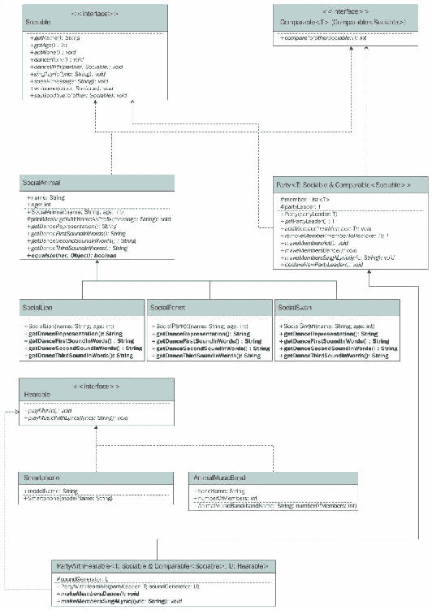
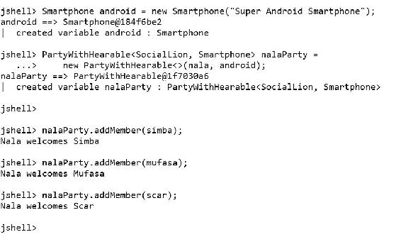
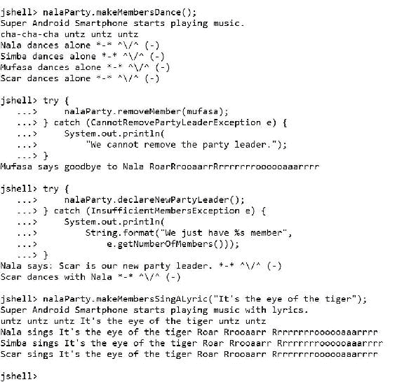

# 第 11 章高级仿制药

在本章中，我们将深入探讨参数多态性，以及 Java9 如何允许我们使用使用两种受约束泛型类型的类编写泛型代码。我们将：

*   使用更高级的场景，其中我们利用了参数多态性
*   创建一个新接口，用作第二个类型参数的约束
*   声明两个实现接口的类，以使用两个类型参数
*   声明一个使用两个受约束泛型类型的类
*   使用具有两个泛型类型参数的泛型类

# 创建新接口作为第二个类型参数的约束

到目前为止，我们一直在与党员是社交动物的政党合作。然而，没有音乐很难享受聚会。善于交际的动物需要听到一些东西，才能让它们跳舞并享受聚会。我们想创造一个由群居动物组成的聚会和一些可以听到的东西。

现在，我们将创建一个新接口，稍后当我们定义另一个类时，我们将使用该接口作为约束，该类利用具有两个受约束泛型类型的泛型。以下几行显示了`Hearable`接口的代码。这个接口指定了一个类型必须满足的要求，才能被认为是可听的，也就是说，在我们的应用程序域中，一个聚会的音乐生成器。`public`修饰符后跟`interface`关键字和接口名称`Hearable`，构成接口声明，如下所示。

样本的代码文件包含在`example11_01.java`文件的`java_9_oop_chapter_11_01`文件夹中。

```
public interface Hearable {
    void playMusic();
    void playMusicWithLyrics(String lyrics);
}
```

接口声明了两种方法要求：`playMusic`和`playMusicWithLyrics`。正如我们在前几章中了解到的，接口只包括方法声明，因为实现`Hearable`接口的类将负责提供这两个方法的实现。

# 声明两个实现接口的类，以使用两个类型参数

现在，我们将声明一个名为`Smartphone`的类，该类实现先前定义的`Hearable`接口。我们可以将类声明理解为“这个`Smartphone`类实现了`Hearable`接口。”下面几行显示了新类的代码。样本的代码文件包含在`java_9_oop_chapter_11_01`文件夹中的`example11_01.java`文件中。

```
public class Smartphone implements Hearable {
    public final String modelName;

    public Smartphone(String modelName) {
        this.modelName = modelName;
    }

    @Override
    public void playMusic() {
        System.out.println(
            String.format("%s starts playing music.",
                modelName));
        System.out.println(
            String.format("cha-cha-cha untz untz untz",
                modelName));
    }

    @Override
    public void playMusicWithLyrics(String lyrics) {
        System.out.println(
            String.format("%s starts playing music with lyrics.",
                modelName));
        System.out.println(
            String.format("untz untz untz %s untz untz",
                lyrics));
    }
}
```

`Smartphone`类声明了一个构造函数，该构造函数将所需的`modelName`参数的值分配给`modelName`不可变字段。此外，该类还实现了`Hearable`接口所需的两个方法：`playMusic`和`playMusicWithLyrics`。

`playMusic`方法打印一条消息，显示智能手机型号名称，并指示设备开始播放音乐。然后，该方法以单词形式打印多个声音。`playMusicWithLyrics`方法打印一条消息，显示智能手机型号名称，然后是另一条消息，其中包含单词中的声音和作为参数接收的歌词。

现在我们将声明一个名为`AnimalMusicBand`的类，该类也实现了先前定义的`Hearable`接口。我们可以将类声明理解为“这个`AnimalMusicBand`类实现了`Hearable`接口。”下面几行显示了新类的代码。样本的代码文件包含在`java_9_oop_chapter_11_01`文件夹中的`example11_01.java`文件中。

```
public class AnimalMusicBand implements Hearable {
    public final String bandName;
    public final int numberOfMembers;

    public AnimalMusicBand(String bandName, int numberOfMembers) {
        this.bandName = bandName;
        this.numberOfMembers = numberOfMembers;
    }

    @Override
    public void playMusic() {
        System.out.println(
            String.format("Our name is %s. We are %d.",
                bandName,
                numberOfMembers));
        System.out.println(
            String.format("Meow Meow Woof Woof Meow Meow",
                bandName));
    }

    @Override
    public void playMusicWithLyrics(String lyrics) {
        System.out.println(
            String.format("%s asks you to sing together.",
                bandName));
        System.out.println(
            String.format("Meow Woof %s Woof Meow",
                lyrics));
    }
}
```

`AnimalMusicBand`类声明了一个构造函数，该构造函数将所需的`bandName`和`numberOfMembers`参数的值分配给与这些参数同名的不可变字段。此外，该类还实现了`Hearable`接口所需的两个方法：`playMusic`和`playMusicWithLyrics`。

`playMusic`方法打印一条消息，向观众介绍动物乐队，并指示成员人数。然后，该方法以单词形式打印多个声音。`playMusicWithLyrics`方法打印一条消息，要求观众与动物乐队一起唱歌，然后再打印另一条消息，其中包含单词中的声音和作为论据接收的歌词。

# 声明一个与两个受约束泛型类型一起工作的类

以下几行声明了先前创建的`Party<T>`类的`PartyWithHearable`子类，该类利用泛型处理两个受约束的类型。类型约束声明包含在尖括号（`<>`中）。在本例中，我们有两个泛型类型参数：`T`和`U`。名为`T`的泛型类型参数必须同时实现`Sociable`和`Comparable<Sociable>`接口，就像发生在`Party<T>`超类中一样。名为`U`的泛型类型参数必须实现`Hearable`接口。请注意，类型参数后面的`extends`关键字允许我们向泛型类型参数和尖括号指定类继承自`Party<T>`超类后的相同关键字添加约束。这样，类为`T`和`U`泛型类型参数指定约束，并从`Party<T>`继承。示例的代码文件包含在`java_9_oop_chapter_11_01`文件夹中的`example11_01.java`文件中。

```
public class PartyWithHearable<T extends Sociable & Comparable<Sociable>, U extends Hearable> extends Party<T> {
 protected final U soundGenerator;

 public PartyWithHearable(T partyLeader, U soundGenerator) {
        super(partyLeader);
 this.soundGenerator = soundGenerator;
    }

    @Override
    public void makeMembersDance() {
 soundGenerator.playMusic();
        super.makeMembersDance();
    }

    @Override
    public void makeMembersSingALyric(String lyric) {
 soundGenerator.playMusicWithLyrics(lyric);
        super.makeMembersSingALyric(lyric);
    }
}
```

### 提示

当类型参数在 Java 中有约束时，它们也称为**有界类型参数**。此外，类型约束也被称为有界类型参数的**上限**，因为实现用作上限的接口的任何类或指示为上限的类的任何子类都可以用于类型参数。

现在我们将分析许多代码片段，以了解`PartyWithHearable<T, U>`类中包含的代码是如何工作的。以下行启动类主体并声明一个受保护的不可变的`soundGenerator`字段，其类型由`U`指定：

```
protected final U soundGenerator;
```

以下几行声明了一个初始值设定项，它接收两个参数`partyLeader`和`soundGenerator`，其类型为`T`和`U`。这些论据明确指出，第一位党的领导人也将成为该党的第一位党员，而声音发生器将使该党的党员起舞唱歌。构造函数使用`super`关键字调用其超类中定义的构造函数，并以`partyLeader`作为参数。

```
public PartyWithHearable(T partyLeader, U soundGenerator) {
    super(partyLeader);
    this.soundGenerator = soundGenerator;
}
```

以下几行声明了一个`makeMembersDance`方法，该方法使用超类中包含的相同声明重写该方法。代码先调用`soundGenetor.playMusic`方法，然后调用`super.makeMembersDance`方法，即`Party<T>`超类中定义的`makeMembersDance`方法，使用`super`关键字：

```
@Override
public void makeMembersDance() {
    soundGenerator.playMusic();
    super.makeMembersDance();
}
```

### 注

当我们重写子类中的方法时，我们可以调用超类中定义的方法，方法是使用`super`关键字，后跟一个点（`.`和方法名称，并将所需的参数传递给该方法。`super`关键字的使用允许我们调用已重写的超类中定义的实例方法。通过这种方式，我们可以向一个方法添加新特性，并且仍然可以调用基本方法。

最后，下面的行声明了一个`makeMembersSingALyric`方法，该方法使用超类中包含的相同声明重写该方法。代码以收到的`lyrics`作为参数调用`soundGenerator.playMusicWithLyrics`方法。然后，代码以接收到的`lyrics`为参数调用`super.makeMembersSingALyric`方法，即`Party<T>`超类中定义的`makeMembersSingALyric`方法：

```
@Override
public void makeMembersSingALyric(String lyric) {
    soundGenerator.playMusicWithLyrics(lyric);
    super.makeMembersSingALyric(lyric);
}
```

下面的 UML 图显示了我们将创建的接口和具体子类，包括所有字段和方法。



# 使用两个泛型类型参数创建泛型类的实例

我们可以通过将`T`和`U`泛型类型参数替换为符合`PartyWithHearable<T, U>`类声明中指定的约束或上限的任何类型名称，来创建`PartyWithHearable<T, U>`类的实例。我们有三个具体的类来实现`T`泛型类型参数所需的`Sociable`和`Comparable<Sociable>`接口：`SocialLion`、`SocialParrot`和`SocialSwan`。我们有两个类来实现`U`泛型类型参数所需的`Hearable`接口：`Smartphone`和`AnimalMusicBand`。

我们可以使用`SocialLion`和`Smartphone`创建`PartyWithHearable<SocialLion, Smartphone>`的一个实例，即社交狮子派对和智能手机。然后，我们可以使用`SocialParrot`和`AnimalMusicBand`创建`PartyWithHearable<SocialParrot, AnimalMusicBand>`的一个实例，即社交鹦鹉派对和动物乐队。

以下几行创建了一个名为`android`的`Smartphone`实例。然后，代码创建一个名为`nalaParty`的`PartyWithHearable<SocialLion, Smartphone>`实例，并将`nala`和`android`作为参数传递。我们利用类型推断，并使用在上一章[第 10 章](10.html#2KS221-bc1530b4c4784270ae8a31a7038f8341 "Chapter 10. Maximization of Code Reuse with Generics")*中学习的菱形符号，最大限度地利用泛型*实现代码重用。通过这种方式，我们创建了一个使用智能手机的社交狮子派对，`Nala`是该派对的领导者，`Super Android Smartphone`是可收听或音乐发生器。样本的代码文件包含在`example11_01.java`文件的`java_9_oop_chapter_11_01`文件夹中。

```
Smartphone android = new Smartphone("Super Android Smartphone");
PartyWithHearable<SocialLion, Smartphone> nalaParty = 
    new PartyWithHearable<>(nala, android);
```

对于类定义使用名为`T`的泛型类型参数的所有参数，`nalaParty`实例将只接受一个`SocialLion`实例。对于类定义使用名为`U`的泛型类型参数的所有参数，`nalaParty`实例将只接受一个`Smartphone`实例。以下几行通过调用`addMember`方法将先前创建的`SocialLion`的三个实例添加到该方。样本的代码文件包含在`example11_01.java`文件的`java_9_oop_chapter_11_01`文件夹中。

```
nalaParty.addMember(simba);
nalaParty.addMember(mufasa);
nalaParty.addMember(scar);
```

以下屏幕截图显示了在 JShell 中执行前面代码的结果：



下面的行调用`makeMembersDance`方法，让智能手机播放列表邀请所有狮子跳舞，让它们跳舞。然后，代码调用`removeMember`方法删除非党领袖的成员，使用`declareNewPartyLeader`方法宣布新领袖，最后调用`makeMembersSingALyric`方法使智能手机播放列表邀请所有狮子唱一首特定的歌词，并让它们唱这首歌词。请记住，我们在调用`removeMember`和`declareNewPartyLeader`之前添加了`try`关键字，因为这些方法可能引发异常。样本的代码文件包含在`java_9_oop_chapter_11_01`文件夹中的`example11_01.java`文件中。

```
nalaParty.makeMembersDance();
try {
    nalaParty.removeMember(mufasa);
} catch (CannotRemovePartyLeaderException e) {
    System.out.println(
        "We cannot remove the party leader.");
}
try {
    nalaParty.declareNewPartyLeader();
} catch (InsufficientMembersException e) {
    System.out.println(
        String.format("We just have %s member",
            e.getNumberOfMembers()));
}
nalaParty.makeMembersSingALyric("It's the eye of the tiger");
```

下面的屏幕截图显示了在 JShell 中执行前面代码的结果：



下面几行显示了在 JShell 中运行前面的代码段后的输出。然而，我们必须考虑到，新党领导人的选择是伪随机的，因此，每次执行的结果都会有所不同：

```
Nala welcomes Simba
Nala welcomes Mufasa
Nala welcomes Scar
Super Android Smartphone starts playing music.
cha-cha-cha untz untz untz
Nala dances alone *-* ^\/^ (-)
Simba dances alone *-* ^\/^ (-)
Mufasa dances alone *-* ^\/^ (-)
Scar dances alone *-* ^\/^ (-)
Mufasa says goodbye to Nala RoarRrooaarrRrrrrrrroooooaaarrrr
Nala says: Simba is our new party leader. *-* ^\/^ (-)
Simba dances with Nala *-* ^\/^ (-)
Super Android Smartphone starts playing music with lyrics.
untz untz untz It's the eye of the tiger untz untz
Nala sings It's the eye of the tiger Roar Rrooaarr Rrrrrrrroooooaaarrrr
Simba sings It's the eye of the tiger Roar Rrooaarr Rrrrrrrroooooaaarrrr
Scar sings It's the eye of the tiger Roar Rrooaarr Rrrrrrrroooooaaarrrr

```

下面的行创建了一个名为`band`的`AnimalMusicBand`实例。然后，代码创建一个名为`ramboParty`的`PartyWithHearable<SocialParrot, AnimalMusicBand>`实例，并将`rambo`和`band`作为参数传递。正如前一个例子中所发生的那样，我们利用了类型推断，并使用了在前一章[第 10 章](10.html#2KS221-bc1530b4c4784270ae8a31a7038f8341 "Chapter 10. Maximization of Code Reuse with Generics")*中学习的菱形表示法*最大限度地利用泛型实现代码重用。通过这种方式，我们创建了一个由社交鹦鹉组成的团队，该团队有一个由四只动物组成的乐队，`Rambo`是团队的领导者，`Black Eyed Paws`是可听到的或音乐发生器。样本的代码文件包含在`example11_02.java`文件的`java_9_oop_chapter_11_01`文件夹中。

```
AnimalMusicBand band = new AnimalMusicBand(
    "Black Eyed Paws", 4);
PartyWithHearable<SocialParrot, AnimalMusicBand> ramboParty = 
    new PartyWithHearable<>(rambo, band);
```

对于类定义使用名为`T`的泛型类型参数的所有参数，`ramboParty`实例将只接受一个`SocialParrot`实例。对于类定义使用名为`U`的泛型类型参数的所有参数，`ramboParty`实例将只接受一个`AnimalMusicBand`实例。以下几行通过调用`addMember`方法将先前创建的`SocialParrot`的三个实例添加到该方。样本的代码文件包含在`example11_02.java`文件的`java_9_oop_chapter_11_01`文件夹中。

```
ramboParty.addMember(rio);
ramboParty.addMember(woody);
ramboParty.addMember(thor);
```

下面的屏幕截图显示了在 JShell 中执行前面代码的结果。


下面的行调用`makeMembersDance`方法，让动物乐队邀请所有鹦鹉跳舞，告诉他们他们是乐队的四名成员，让他们跳舞。然后，代码调用`removeMember`方法移除非党领袖成员，使用`declareNewPartyLeader`方法宣布新领袖，最后调用`makeMembersSingALyric`方法让动物乐队邀请所有鹦鹉唱一首特定的歌词，让它们唱这首歌词。请记住，我们在调用`removeMember`和`declareNewPartyLeader`之前添加了`try`关键字，因为这些方法可能引发异常。样本的代码文件包含在`java_9_oop_chapter_11_01`文件夹中的`example11_02.java`文件中。

```
ramboParty.makeMembersDance();
try {
    ramboParty.removeMember(rio);
} catch (CannotRemovePartyLeaderException e) {
    System.out.println(
        "We cannot remove the party leader.");
}
try {
    ramboParty.declareNewPartyLeader();
} catch (InsufficientMembersException e) {
    System.out.println(
        String.format("We just have %s member",
            e.getNumberOfMembers()));
}
ramboParty.makeMembersSingALyric("Turn up the radio");
```

下面的屏幕截图显示了在 JShell 中执行前面代码的结果：


下面的行显示了在 JShell 中运行前面的代码片段后的输出。然而，我们必须考虑到，新党领导人的选择是伪随机的，因此，每次执行的结果都会有所不同：

```
Rambo welcomes Rio
Rambo welcomes Woody
Rambo welcomes Thor
Our name is Black Eyed Paws. We are 4.
Meow Meow Woof Woof Meow Meow
Rambo dances alone /|\ -=- % % +=+
Rio dances alone /|\ -=- % % +=+
Woody dances alone /|\ -=- % % +=+
Thor dances alone /|\ -=- % % +=+
Rio says goodbye to Rambo YeahYeeaahYeeeaaaah
Rambo says: Thor is our new party leader. /|\ -=- % % +=+
Thor dances with Rambo /|\ -=- % % +=+
Black Eyed Paws asks you to sing together.
Meow Woof Turn up the radio Woof Meow
Rambo sings Turn up the radio Yeah Yeeaah Yeeeaaaah
Woody sings Turn up the radio Yeah Yeeaah Yeeeaaaah
Thor sings Turn up the radio Yeah Yeeaah Yeeeaaaah

```

# 测试你的知识

1.  `PartyWithHearable<T extends Sociable & Comparable<Sociable>, U extends Hearable>`行表示：
    1.  泛型类型约束指定`T`必须实现`Sociable`或`Comparable<Sociable>`接口，`U`必须实现`Hearable`接口。
    2.  该类是`Sociable`、`Comparable<Sociable>`和`Hearable`类的子类。
    3.  泛型类型约束指定`T`必须同时实现`Sociable`和`Comparable<Sociable>`接口，`U`必须实现`Hearable`接口。
2.  以下哪一行相当于 Java 9 中的`PartyWithHearable<SocialLion, Smartphone>lionsParty = new PartyWithHearable<SocialLion, Smartphone>(nala, android);`：
    1.  `PartyWithHearable<SocialLion, Smartphone> lionsParty = new PartyWithHearable<>(nala, android);`
    2.  `PartyWithHearable<SocialLion, Smartphone> lionsParty = new PartyWithHearable(nala, android);`
    3.  `let lionsParty = new PartyWithHearable(nala, android);`
3.  当我们使用带`extends`关键字的有界类型参数时：
    1.  实现被指示为上限的接口的任何类都可以用于类型参数。如果指定的名称是类的名称，则其子类不能用于类型参数。
    2.  实现被指示为上限的接口的任何类或被指示为上限的类的任何子类都可以用于类型参数。
    3.  表示为上限的类的任何子类都可以用于类型参数。如果指定的名称是接口的名称，则实现该接口的类不能用于类型参数。
4.  当类型参数在 Java 中具有约束时，它们也称为：
    1.  灵活的类型参数。
    2.  无界类型参数。
    3.  有界类型参数。
5.  以下哪个代码段声明了一个类，其泛型类型约束指定`T`必须实现`Sociable`接口，`U`必须实现`Convertible`接口：
    1.  `public class Game<T: where T is Sociable, U: where U is Convertible>`
    2.  `public class Game<T extends Sociable> where U: Convertible`
    3.  `public class Game<T extends Sociable, U extends Convertible>`

# 总结

在本章中，您学习了通过编写能够使用两个类型参数的代码来最大化代码重用。我们处理更复杂的场景，这些场景涉及接口、泛型和具有约束的多个类型参数，也称为有界类型参数。

我们创建了一个新接口，然后声明了实现这个新接口的两个类。然后，我们声明了一个使用两个受约束泛型类型参数的类。我们将类继承和接口结合起来，以最大限度地提高代码的可重用性。我们可以让课程与许多不同的类型一起工作，我们可以用不同的音乐发生器对聚会的行为进行编码，然后可以重用这些音乐发生器，用智能手机创建狮子聚会，用动物乐队创建鹦鹉聚会。

Java9 允许我们处理更复杂的场景，在这些场景中，我们可以为泛型类型参数指定更多的限制或边界。然而，在大多数情况下，我们将处理本章和上一章中学习的示例所涵盖的案例。

现在您已经了解了参数多态性和泛型的高级用法，我们准备在 Java9 中结合面向对象编程和函数式编程，这是我们将在下一章中讨论的主题。