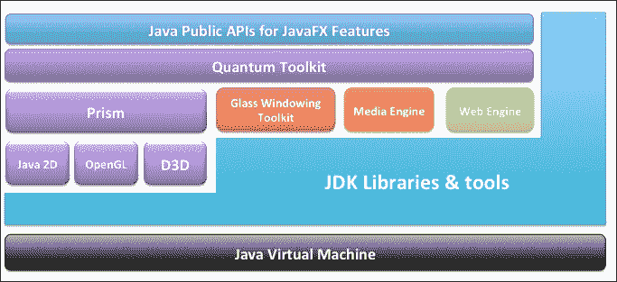
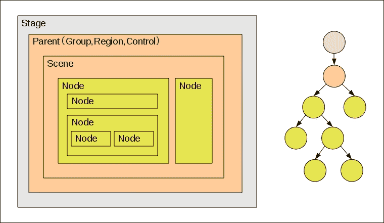
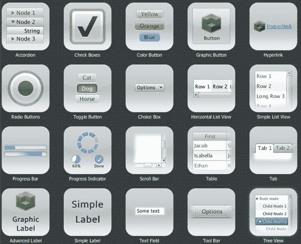
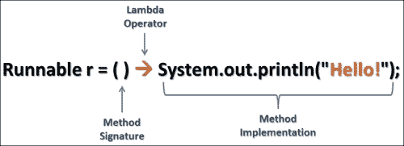
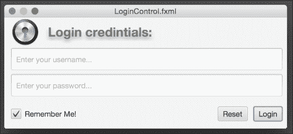
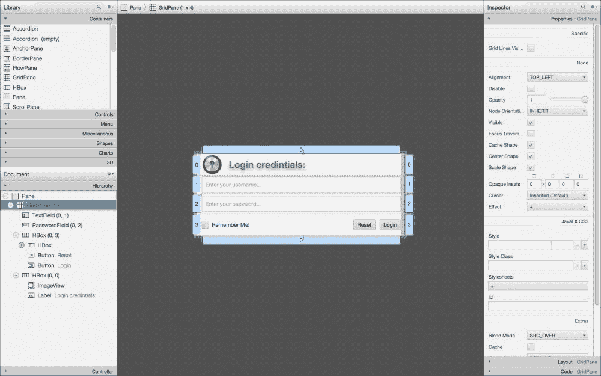
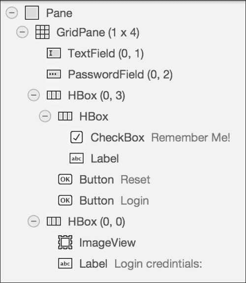
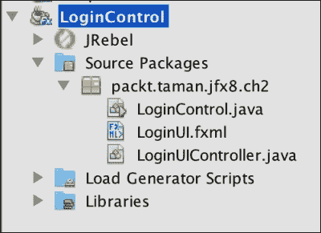

# 第 2 章 JavaFX 8 Essentials 和创建自定义 UI

了解 JavaFX 的要点肯定会帮助您轻松构建复杂的 UI 解决方案。

在本章中，您将简要介绍 JavaFX8 体系结构，从而了解 JavaFX 体系结构组件和引擎如何高效地与 JavaFX 应用程序互连并平滑地呈现其图形。

您将学习如何在 JavaFX 场景中渲染图形，为此，我们将使用场景、一些控件和样式创建一个基本应用程序。

我们将讨论 Java SE 8 特性的基本原理（例如**Lambda**和**功能接口**，以帮助提高代码可读性、质量和生产率。

一旦我们有了第一个结构化的 JavaFX8 应用程序，如果您可以在不改变其功能的情况下更改应用程序的 UI，那不是很好吗？通过浏览 JavaFXCSS 样式的基础知识，您将了解主题化。

最后，您将了解如何使用场景生成器以图形方式创建和定义 UI 屏幕，并将其保存为 JavaFXML 格式的文件。您将获得创建*自定义控件*的亲身体验。

在本章中，我们将介绍以下主题：

*   了解 JavaFX 体系结构组件
*   使用 JavaFX 组件设置 UI
*   使用 JavaSE8、Lambda 表达式和其他功能
*   将应用程序主题化以针对不同的平台
*   使用 CSS 自定义应用程序 UI
*   使用场景生成器工具以可视化方式创建 UI
*   使用 FXML 构建自定义 UI

# 快速回顾 JavaFX8 体系结构

为了更好地理解框架的组件和引擎如何相互作用以运行 JavaFX 应用程序，本节对 JavaFX 体系结构和生态系统进行了高层描述。

下图说明了 JavaFX 平台的体系结构组件。它显示每个组件以及它们之间的互连方式。

负责运行 JavaFX 应用程序代码的引擎位于 JavaFX 公共 API 下面。

该发动机由子部件组成。其中包括 JavaFX 高性能图形引擎**Prism**；玻璃工具箱，一个小型高效的窗口系统；媒体引擎；还有一个网络引擎。

### 注

虽然这些组件不是通过公共 API 公开的，但我们将对它们进行描述，以便您更好地了解是什么使 JavaFX 应用程序以高效的方式成功运行。



JavaFX 体系结构图

有关 JavaFX 体系结构和生态系统的更多信息和描述，请访问[http://docs.oracle.com/javase/8/javafx/get-started-tutorial/jfx-architecture.htm](http://docs.oracle.com/javase/8/javafx/get-started-tutorial/jfx-architecture.htm) 。

## 场景图

每个应用程序都有一个起始根点来构建 UI 层次结构，JavaFX 应用程序的起始点是*场景图*。在前面的屏幕截图中，它以蓝色显示为顶层的一部分。它是节点的根树，表示应用程序用户界面的所有可视元素。它还跟踪和处理任何用户输入，并且可以呈现，因为它本身就是一个 UI 节点。

*节点*是场景图树中的任意单个元素。默认情况下，每个节点都有这些属性–用于标识的 ID、用于更改其视觉属性的样式类列表以及用于与其他组件及其父布局容器节点内的场景正确匹配的边界体积（场景图的根节点除外）。

场景图树中的每个节点都有一个父节点，但可以有零个或多个子节点；但是，场景根没有父对象（为 null）。此外，JavaFX 有一种机制来确保一个节点只能有一个父节点；它还可以具有以下功能：

*   视觉效果，例如模糊和阴影
*   通过不透明度控制组件透明度
*   CPU 加速的二维变换、变换和旋转
*   三维变换，例如变换、缩放和旋转
*   事件处理程序（例如鼠标事件、按键事件或其他输入方法，例如触摸事件）
*   特定于应用程序的状态

下图显示了阶段、场景、UI 节点和图形树之间的关系：



JavaFXUI 树层次关系

除了图像、媒体、UI 控件和布局容器之外，图形原语也是 JavaFX 场景图的组成部分，例如线条、矩形和文本。

当为客户提供复杂而丰富的 UI 时，场景图简化了这项任务。此外，您还可以使用`javafx.animation`API 快速轻松地为场景图中的各种图形设置动画。

除了这些功能外，`javafx.scene`API 还允许创建和指定以下几种内容类型：

*   **节点**：表示为 UI 控件、图表、组、容器、嵌入式 web 浏览器、形状（二维和三维）、图像、媒体和文本的任何节点元素
*   **效果**：这些是简单的对象，当应用于 UI 节点时，会改变其在场景图节点上的外观，例如模糊、阴影和颜色调整
*   **状态**：任何特定于应用程序的状态，如变换（节点的定位和方向）和视觉效果

## 用于 JavaFX 功能的 Java 公共 API

这是您的 Swiss knife toolkit，作为支持富客户机应用程序开发的一整套 Java 公共 API 提供。

这些 API 为您提供了前所未有的灵活性，通过将 Java SE 平台的最佳功能与全面、沉浸式媒体功能结合到手边直观、全面的一站式开发环境中，来构建富客户机 UI 应用程序。

JavaFX 的这些 Java API 允许您执行以下操作：

*   使用 JavaSE 的强大功能，从泛型、注释和多线程到新的 Lambda 表达式（在 JavaSE8 中引入）。
*   为 web 开发人员使用其他基于 JVM 的动态语言（如*JavaScript*）中的 JavaFX 提供了一种更简单的方法。
*   通过集成其他系统语言，如*Groovy*，编写大型复杂的 JavaFX 应用程序。
*   将 UI 控件绑定到控制器属性，以便自动通知和更新从模型反映到绑定的 UI 节点。绑定包括对高性能延迟绑定、绑定表达式、绑定序列表达式和部分绑定重新评估的支持。我们将在[第 3 章](3.html#aid-PNV62 "Chapter 3. Developing a JavaFX Desktop and Web Application")*开发 JavaFX 桌面和 Web 应用程序*中看到这一点。
*   引入可观察列表和映射，允许应用程序将 UI 连接到数据模型，以观察这些数据模型中的变化，并通过扩展 Java 集合库相应地更新相应的 UI 控件。

## 图形系统

JavaFX 图形系统，如上图中紫色所示，支持 2D 和 3D 场景图，以便在 JavaFX 场景图层上平滑运行。由于这是该层下的实现细节，因此在没有足够的图形硬件支持硬件加速渲染的系统上运行时，它提供了渲染软件堆栈。

JavaFX 平台有两个图形加速管道，它们实现：

*   **棱镜**：这是处理所有渲染作业的引擎。它可以在硬件和软件渲染器上运行，包括 3D 渲染器。该引擎负责 JavaFX 场景的光栅化和渲染。根据所使用的设备，可以使用以下多个渲染路径：
    *   Windows XP 和 Vista 上的 DirectX 9 和 Windows 7 上的 DirectX 11
    *   Linux、Mac 和嵌入式系统上的 OpenGL
    *   无法进行硬件加速时的软件渲染
*   **Quantum Toolkit**：负责将 Prism 引擎和 Glass Windowing Toolkit 链接在一起，使它们在堆栈中的 JavaFX 层上可用。这是除了管理与渲染和事件处理相关的任何线程规则之外的。

## 玻璃开窗工具箱

在前面的图的中间部分，Glass Windowing Toolkit 表示了 Ty1 T1 的红色，它是将 JavaFX 平台连接到 java 操作系统的平台相关层。

由于其主要职责是提供本机操作服务，如管理计时器、窗口和曲面，因此其在渲染堆栈中的位置最低。

## JavaFX 线程

通常，系统在任何给定时间运行以下两个或更多线程：

*   **JavaFX 应用程序线程**：这个是 JavaFX 应用程序运行时使用的主线程和主线程。
*   **Prism 渲染线程**：此独立于事件调度器处理渲染。它在帧 N+1 准备下一个处理时渲染帧 N。它的最大优势是能够执行并发处理，特别是在具有多个处理器的现代系统上。
*   **媒体线程**：此在后台运行，使用 JavaFX 应用线程通过场景图同步最新帧。
*   **脉冲**：此使您能够异步处理事件。它可以帮助您管理 JavaFX 场景图元素状态和使用 Prism 引擎的场景图事件之间的同步。激发时，场景图上元素的状态与渲染层同步。

### 注

任何布局节点和 CSS 也与 pulse 事件关联。

*玻璃窗工具箱*使用高分辨率本机定时器执行所有脉冲事件，以执行。

## 媒体与图像

JavaFX`javafx.scene.media`API 提供媒体功能。JavaFX 支持视频和音频媒体。音频文件支持`MP3`、`AIFF`、`WAV`文件和`FLV`视频文件。

您可以通过 JavaFX media 提供的三个主要独立组件访问媒体功能，`Media`对象表示媒体文件，`MediaPlayer`播放媒体文件，`MediaView`是将媒体显示到场景图中的节点。

### 注

上图中以橙色显示的媒体引擎组件经过精心设计，考虑到稳定性和性能，可在所有受支持的平台上提供一致的行为。

## Web 组件

上图中以绿色显示的 web 引擎组件是最重要的 JavaFX UI 控件之一，基于 WebKit 引擎构建，WebKit 引擎是一个开源 web 浏览器引擎，支持 HTML5、JavaScript、CSS、DOM 呈现和 SVG 图形。它通过 API 提供 web 查看器和完整的浏览功能。在开发 Web 应用程序时，我们将在[第 3 章](3.html#aid-PNV62 "Chapter 3. Developing a JavaFX Desktop and Web Application")*开发 JavaFX 桌面和 Web 应用程序*中深入探讨这一点。

它允许您在 Java 应用程序中添加和实现以下功能：

*   从本地或远程 URL 呈现任何 HTML 内容
*   提供前后导航，并支持历史记录
*   重新加载任何更新的内容
*   为 web 组件设置动画并应用 CSS 效果
*   为 HTML 内容提供丰富的编辑控件
*   可以执行 JavaScript 命令并处理 web 控件事件

## 布局组件

当构建一个丰富而复杂的 UI 时，我们需要一种方法来允许 JavaFX 应用程序中 UI 控件的灵活和动态安排。这是使用布局容器或窗格的最佳位置。

布局 API 包括以下自动化常见布局 UI 模式的容器类：

*   **边框窗格**：此在顶部、底部、右侧、左侧或中心区域布置其内容节点
*   **HBox**：该将其内容节点水平排列成一行
*   **VBox**：该将其内容节点垂直排列在一列中
*   **StackPane**：此将其内容节点放置在窗格中心的前后单堆栈中
*   **GridPane**：此支持创建灵活的行和列网格，用于布局内容节点
*   **流程窗格**：此以水平或垂直流程排列其内容节点，以指定的宽度（用于水平）或高度（用于垂直）边界包裹
*   **TilePane**：此将其内容节点放置在大小一致的布局单元格或瓷砖中
*   **AnchorPane**：此允许在布局的顶部、底部、左侧或中心创建锚节点，我们可以自由定位其子节点

### 提示

不同的容器可以嵌套在 JavaFX 应用程序中；为了实现所需的布局结构，我们将在接下来开发自定义 UI 时看到这一点。

## JavaFX 控件

JavaFX 控件是 UI 布局的构建块，作为一组 JavaFXAPI 驻留在`javafx.scene.control`包中。它们是使用场景图中的节点构建的。它们可以通过 JavaFXCSS 设置主题和蒙皮。它们可在不同平台上移动*。他们充分利用了 JavaFX 平台丰富的视觉特性。*

 *此图显示了当前支持的一些 UI 控件，此处也没有显示更多控件：



JavaFXUI 控件示例

### 注

有关所有可用 JavaFXUI 控件的详细信息，请参阅官方教程[http://docs.oracle.com/javase/8/javafx/user-interface-tutorial/ui_controls.htm#JFXUI336](http://docs.oracle.com/javase/8/javafx/user-interface-tutorial/ui_controls.htm#JFXUI336) 和`javafx.scene.control`包的 API 文档。

# Java SE 8 特性

我们将深入了解 Java SE 8 的两个最重要的特性——lambda 或 lambda 表达式和函数接口，这使我们可以使用 lambda，以帮助编写更好、简洁、低模板的 JavaFX 8 代码。但是，请记住，我们不会在本书中讨论每个 lambda 细节，因为这不是一本 JavaSE8 书。

### 注

要更好地了解 Java 的 lambda 路线图，请访问以下官方教程：[http://docs.oracle.com/javase/tutorial/java/javaOO/lambdaexpressions.html](http://docs.oracle.com/javase/tutorial/java/javaOO/lambdaexpressions.html) 。

## Lambda 表达式

Java 语言中的**lambda**项目的主要目标是解决函数编程的不足，并提供一种通过创建匿名（未命名）函数来轻松进行函数编程的方法，方法与在 Java 中创建匿名对象而非方法类似。

正如您在[第 1 章](1.html#aid-DB7S1 "Chapter 1. Getting Started with JavaFX 8")*开始使用 JavaFX 8*的示例中所看到的，我们讨论了使用匿名内部类为 JavaFX 按钮上按下的事件定义处理程序的常用方法：

```java
btn.setOnAction(new EventHandler<ActionEvent>() {
   @Override
   public void handle(ActionEvent event) {
     message.setText("Hello World! JavaFX style :)");
   }
});
```

与在按钮操作中设置消息文本字段的`text`属性的单行代码相比，此代码非常冗长。如果能够重写包含逻辑的这段代码而不需要那么多样板代码，那不是很好吗？

Java SE 8 使用 Lambda 表达式解决此问题，如下所示：

```java
btn.setOnAction(event -> {
    message.setText("Hello World! JavaFX style :)");
});
```

除了使代码更简洁易读之外，lambda 表达式还使代码的性能更好。

### 语法

编写 lambda 表达式有两种方式，一般形式如下图所示：



Lambda 表达式通用形式–以创建新线程为例

这两种方式如下：

*   `(param1, param2, ...) -> expression;`
*   `(param1, param2, ...) -> { /* code statements */ };`

第一种形式是表达式形式，当我们只指定一行代码或一个简单表达式时使用。第二个是块形式，它是一个由一行或多行代码组成的体，带有一个 return 语句，因此我们需要用大括号将它们包装起来。

以下三种说法是等效的：

*   `btn.setOnAction((ActionEvent event) -> {message.setText("Hello World!");});`
*   `btn.setOnAction( (event) -> message.setText("Hello World!"));`
*   `btn.setOnAction(event -> message.setText("Hello World!"));`

### 提示

为了深入了解新的 lambda 表达式及其相关特性以及 JavaSE8 特性，我鼓励您尝试本系列文章–JavaSE8 新特性教程：[http://tamanmohamed.blogspot.com/2014/06/java-se-8-new-features-tour-big-change.html](http://tamanmohamed.blogspot.com/2014/06/java-se-8-new-features-tour-big-change.html)

## 功能接口

lambda 表达式非常棒，不是吗？但是您可能想知道它的确切类型是什么，所以可以将它分配给变量并传递给方法。

答案在于功能接口的威力。怎样 Java 语言设计者/架构师巧妙地将函数接口创建为闭包，使用了**单一抽象方法**（**SAM**的概念），提供了一个只包含一个抽象方法的接口和`@FunctionalInterface`注释。单一抽象方法模式是 JavaSE8 的 lambda 表达式不可分割的一部分。

让我们用一个例子来说明函数接口和 lambda 表达式的概念。我创建了一个名为`Calculator.java`的函数接口，其中包含一个抽象方法`calculate()`。创建后，可以声明变量并将其分配给 lambda 表达式。以下是功能界面：

```java
@FunctionalInterface
public interface Calculator {
    double calculate(double width, double height);
}
```

现在，我们已经准备好创建变量并为它们分配 lambda 表达式。以下代码创建 lambda 表达式并将其分配给函数接口变量：

```java
Calculator area = (width, height) -> width * height; //Area = w × h
//Perimeter = 2(w+h)
Calculator perimeter = (width, height) -> 2 * (height + width);
out.println("Rectangle area: "+ area.calculate(4, 5)+" cm.");
out.println("Rectangle perimeter: "+ perimeter.calculate(4, 5)+" cm.");
```

代码的输出应如下所示：

```java
Rectangle area: 20.0 cm.
Rectangle perimeter: 18.0 cm.
```

# 主题化

当与设计师和 UX/UI 专家合作时，您将听到应用程序蒙皮或更改其外观。这两个术语通常是可互换的，它们都反映了*主题化*的基本概念。

主题化的思想是通过改变其控件外观而不改变其底层功能来改变整个应用程序样式。

在 JavaFX 中，您可以创建、修改或使用现有主题来对应用程序、场景甚至只是 UI 控件进行蒙皮。

## CSS

JavaFX**级联样式表**（**CSS**可应用于 JavaFX 场景图中的任意节点；它们以异步方式应用于节点。还可以在运行时轻松地将样式指定给场景，从而允许应用程序的外观动态更改。

它基于 W3CCSS 版本 2.1 规范，目前与当前版本 3 工作中的一些新增内容兼容。JavaFXCSS 支持和扩展被设计为允许任何兼容的 CSS 解析器干净地解析 JavaFXCSS 样式表。这允许将 JavaFX 和其他用途（如 HTML 页面）的 CSS 样式混合到单个样式表中。

所有 JavaFX 属性名称的前缀都带有扩展名`-fx-`，包括那些看起来可能与标准 HTML CSS 兼容的名称，因为一些 JavaFX 值的语义与标准值略有不同。

### 注

有关 JavaFXCSS 的更多信息，请参阅[上的带 CSS 的 JavaFX 应用程序蒙皮文档和参考指南 http://docs.oracle.com/javase/8/javafx/api/javafx/scene/doc-files/cssref.html](http://docs.oracle.com/javase/8/javafx/api/javafx/scene/doc-files/cssref.html) 。

### 应用 CSS 主题

下面是一个自定义简单 JavaFX CSS 规则`ButtonStyle.css`，将在我们的主题化过程中用于对按钮进行主题化：

```java
/* ButtonStyle.css */
.button {
-fx-text-fill: SKYBLUE;
-fx-border-color: rgba(255, 255, 255, .80);
-fx-border-radius: 8;
-fx-padding: 6 6 6 6;
-fx-font: bold italic 20pt "Arial";
}
```

我们有两种方法可以应用 CSS 样式表来更改 JavaFX 应用程序的外观主题：

1.  Using a JavaFX Application (`javafx.application.Application`) class static method `setUserAgentStylesheet(String URL)` method, which styles all the application hierarchy, including every scene and all child nodes in a JavaFX application. It is used as follows:

    ```java
    Application.setUserAgentStylesheet(getClass().getResource("ButtonStyle.css").toExternalForm());
    ```

    现在您可以使用 JavaFX8 的两个样式表，即当前预交付的 Caspian 和 Modena，我们可以使用如下所示的相同方法在它们之间切换：

    ```java
    // Switch to JavaFX 2.x's CASPIAN Look and Feel.
    Application.setUserAgentStylesheet(STYLESHEET_CASPIAN);

    // Switch to JavaFX 8's Modena Look and Feel.
    Application.setUserAgentStylesheet(STYLESHEET_MODENA);
    ```

    ### 提示

    如果您通过传递空值来调用`setUserAgentStylesheet(null)`，则将加载默认外观（在本例中为 Modena），而如果您使用的是 JavaFX 2.x Caspian，则将加载默认外观。

2.  Using scene's `getStylesheets().add(String URL)` method will style the individual scene and its child node automatically as follows:

    ```java
    Application.setUserAgentStylesheet(null); // defaults to Modena
    // apply custom look and feel to the scene.
    scene.getStylesheets()
    .add(getClass().getResource("ButtonStyle.css")
    .toExternalForm());
    ```

    基本上，默认的主题（Modena）将被加载，正如`Application.setUserAgentStylesheet(null)`被调用一样。然后通过调用`getStylesheets().add()`方法设置场景的附加样式。

样式首先应用于父对象，然后应用于其子对象。将节点添加到场景图形后，无论是否显示，都会对其设置样式。

JavaFX CSS 实现应用以下优先顺序–来自用户代理样式表的样式的优先级低于来自代码的值集，后者的优先级低于场景或父样式表。

内联样式具有最高优先级。父实例中的样式表被认为比场景样式表中的样式更具体。

# 场景生成器

对于最复杂的和复杂的 UI 需求，设计师使用工具设计他们的 UI 时不需要编写任何代码，然后将结果（`FXML`文件）加载到他们的 JavaFX 应用程序逻辑中，不是更容易吗？

因此，您需要 JavaFX 场景生成器；它是一个可视化布局工具，允许您轻松地布局 UI 控件，以便您可以使用效果和动画快速创建应用程序原型。场景生成器（版本 2.0 以上）是 JavaFX8 的兼容版本。

在创建项目期间的任何时候，您都可以预览工作，以在部署工作之前检查其真实外观。

它是开源的，因此与大多数 IDE 集成，但与 NetBeans IDE 的集成更紧密。它也是一个跨平台、自包含的应用程序，在大多数平台上运行。

除了支持 CSS，它还允许您轻松地将自定义主题应用于原型。

## 下载并启动

2015 年初 Oracle 发布了 JavaFX Scene Builder 工具 2.0 版，并宣布不再提供 JavaFX Scene Builder 工具（编译形式）的版本。

一家名为**胶子**（[的公司 http://gluonhq.com](http://gluonhq.com) 理解工具可以创造或破坏编码体验。因此，他们决定开始提供构建，基于他们将在公共可访问存储库中维护的分支。

Glion 提供了 IDE 插件，以及基于 OpenJFX 最新来源的 JavaFX 场景生成器工具的改进版本，并基于社区参与和更好地支持第三方项目的愿望进行了额外的改进，如**ControlsFX**（ [http://www.controlsfx.org/](http://www.controlsfx.org/) 、**FXyz**（[https://github.com/FXyz/FXyz](https://github.com/FXyz/FXyz) 和**数据外汇**（[http://www.datafx.io/](http://www.datafx.io/) 。

首先，让我们从以下 URL[下载该工具 http://gluonhq.com/products/downloads/](http://gluonhq.com/products/downloads/) 。

下载版本 8.0 并安装后，启动它，场景生成器工具应打开，如下图所示：


JavaFX8 场景生成器工具。

## FXML

当添加组件并构建漂亮的 UI 布局时，Scene Builder under the hood 会自动为您生成一个基于 FXML 和 XML 的标记文件，稍后将用于将 UI 绑定到 Java 应用程序逻辑。

FXML 提供的主要优势之一是分离关注点，因为它将 UI 层（*视图*与逻辑（*控制器*分离）；这意味着您可以随时更改 UI，而无需更改底层逻辑。由于没有编译 FXML 文件，因此可以在运行时动态加载它，而无需进行任何必要的编译。这意味着它可以帮助您快速成型。

### 将 FXML 加载到 JavaFX 应用程序中

从 Scene Builder 工具生成 UI 设计后，添加它是一项非常简单的任务。这里显示的是以`start()`方法加载 FXML 文件的代码：

```java
BorderPane root = new BorderPane();
Parent content = FXMLLoader.load(getClass().getResource("filename.fxml"));
root.setCenter(content);
```

如您所见，我在`javafx.fxml.FXMLLoaderclass`上使用静态方法加载，`load()`方法将加载`deserialize`场景生成器工具创建的 FXML 文件。

# 开发定制用户界面

在本章的最后一部分，我们将基于 JavaFX8 内置控件开发一个自定义 UI 组件。

我们将使用前面讨论过的基于 FXML 的概念开发这个定制 UI；主要的优点是分离关注点，以便在以后定制组件，而不改变其功能和绑定到组件的任何其他逻辑。

## 登录对话框自定义界面

我们将使用之前介绍的大多数工具和技术来开发我们的自定义 UI：登录对话框，它是每个企业应用程序中的必要组件。我们的 UI 组件将如以下屏幕截图所示：



登录自定义 UI 组件

### 登录对话框自定义界面的结构

在基于 FXML 标记的自定义组件开发中，最常见的结构和阶段如下：

*   在场景生成器工具中开发 UI；然后将结果导出到基于 FXML 的文件中
*   从场景生成器中提取控制器骨架
*   创建一个将 UI（视图）绑定到其逻辑并扩展控件或布局的控制器
*   在控制器构造函数中加载 FXML 文件
*   创建一个初始化方法，确保所有 FXML 控件都已成功初始化和加载
*   公开公共属性以获取和设置需要实现逻辑的控制数据和操作方法
*   开发一个单独的 CSS 文件
*   在应用程序中使用自定义组件

### 对登录对话框自定义界面进行编码

让我们编码并开发我们的自定义 UI，登录对话框：

1.  Open the Scene Builder tool and create the UI. Its properties are as shown in the following figure:

    

2.  The login dialog layout hierarchy will be as shown here:

    

    它由窗格布局组成，作为顶部和底部布局节点。然后，使用`GridPane(1,4)`将控件布置在一列四行的网格中，使用以下各项：

    *   **第一**行包含位于位置（`0,0`的`HBox`布局控件，用于水平布局控件。它由`ImageView`控件组成，用于显示标题的徽标和标签。
    *   **第二行**在位置（`0,1`处）列出用户名属性的用户名`TextField`。
    *   **第三**行在`0,2`位置为密码属性设置密码`PasswordField`。
    *   位于位置（`0,3`的**最后一行**有一个根布局控件`HBox`，它布局了另一个 HBox，其中包含与左中对齐的`CheckBox`和`Label`（用于显示错误和其他消息）控件。然后我们有两个按钮控件，**重置**和**登录**，它们与右中对齐。
    *   在“代码”选项卡中，为对话框中的所有控件添加适当的**fx:id**名称，并为按钮和复选框事件添加`onAction`名称，如以下屏幕截图所示：

    

    登录按钮属性

3.  从场景生成器**预览**菜单中，选择**在 windows**中显示预览。您的布局将弹出。如果一切正常，并且您对结果设计感到满意，从菜单栏点击**文件**，然后**保存**，并输入文件名为`LoginUI.fxml`。祝贺您已经创建了第一个 JavaFXUI 布局。
4.  现在我们将打开 NetBeans 来设置一个 JavaFXML 项目，因此启动 NetBeans，并从**文件**菜单中选择**新项目**。
5.  In the **JavaFX** category, choose **JavaFX FXML Application**. Click on **Next**. Then name the project **LoginControl**, change **FXML name** to `LoginUI`, and click on **Finish**.

    ### 提示

    确保 JavaFX 平台是 JavaSE8。

6.  NetBeans will create a project structure as shown here:

    

    登录控制 NetBeans 项目结构。

    ### 注

    确保在运行项目之前*清理并构建*项目，以避免可能遇到的任何问题，尤其是在运行应用程序时，在运行期间加载`*.fxml`文件可能会返回`null`。

7.  转到场景生成器工具，从**视图**中选择**显示示例控制器骨架**。下面屏幕截图中显示的窗口将打开，我们将复制该窗口以替换`LoginUIController.java`（这将用 NetBeans 中复制的内容扩展`Pane`类内容代码），然后修复丢失的导入。
8.  将先前从场景生成器生成并保存的`LoginUI.fxml`文件替换为 NetBeans 已经创建的文件。
9.  右键点击`LoginController.java`文件，选择**重构**，然后**重命名**，重命名为`Main.java`。
10.  Finally, add the following code in the `start(Stage stage)` method of `Main.java class` as shown here. We are creating a new instance of the login component as a root node of our scene and adding it to the stage:

    ```java
    LoginUIController loginPane = new LoginUIController();

    stage.setScene(new Scene(loginPane));
    stage.setTitle("Login Dialog Control");
    stage.setWidth(500);
    stage.setHeight(220);
    stage.show();
    ```

    

11.  In the `LoginUIController.java` class, right-click under the class name and choose **Insert Code**; then choose **Constructor** and finally add the following code inside the constructor:

    ```java
    public LoginUIController() throws IOException {
      FXMLLoader fxmlLoader = new FXMLLoader(getClass().getResource("LoginUI.fxml"));
      fxmlLoader.setRoot(this);
      fxmlLoader.setController(this);
      fxmlLoader.load();
    }
    ```

    此代码加载我们的`LoginUI.fxml`文档，并将其作为窗格布局及其层次结构返回。然后将其绑定到当前控制器实例，同时作为控制器和根节点。注意，控制器将窗格扩展为`LoginUI.fxml`中的根元素定义。

12.  从 NetBeans 中，选择**清理并构建**，然后右键单击项目并选择**运行**。我们前面看到的屏幕应该会出现。
13.  While the program is running, enter any credentials and click on the **Login** button; an error message will appear in red as shown in the following screenshot:

    

    登录控制无效的登录。

14.  如果输入了正确凭证（用户：*塔曼*、通行证：*塔曼*），则绿色信息显示为“*有效凭证*”，如下图所示。
15.  If the **Reset** button is clicked, then all controls return to the default values.

    祝贺您已成功创建并实现了 UI 自定义控件。

    

# 总结

水果挞 java 的 8 个体系结构组件作为基础层，可以顺利高效地运行 java 应用程序。然后，我们探索了如何在场景中渲染图形，并简要介绍了最常见的布局和 UI 控件。

我们向您介绍了 JavaSE8 中的新特性，如 lambda 表达式和函数接口，并通过示例展示了它们的强大功能。

通过使用`setUserAgentStylesheet(String URL)`和`getStylesheets().add(String URL)`方法，您了解了如何使用自定义 CSS 文件为应用程序设置样式。接下来，您简要介绍了场景生成器以及如何将 FXML 加载到场景中。最后，您了解了 JavaFX 中的自定义 UI 组件以及如何创建它们。

在下一章中，您将学习如何创建由多个场景组成的桌面应用程序，以及如何对其进行打包。此外，我们将学习如何与 Web 交互，以及如何使用 JavaFX8 开发 Web 应用程序。*