# 第 6 章在 Raspberry Pi 上运行 JavaFX 应用程序

欢迎来到**物联网**（**物联网**世界。毫无疑问，你经常听到这个词。物联网最近成为一个热门话题，也是有理由的。据估计，目前连接的小型设备数量约为 90 亿台；预计到 2020 年，这一数字将跃升至 240 亿台。虽然预测各不相同，但评估结果却并非如此：就绝对数量而言，物联网将使以往任何计算模型相形见绌。

与 IOT 世界密切相关，我们有树莓 PI-A 信用卡大小的微型计算机，由 RasBuri Pi 基金会设计用于实验和教育。

关于覆盆子圆周率，你应该知道它只是一台小型计算机。功耗要求小，物理尺寸小，内存小，最重要的是设备成本低。它的一切都很小，但它仍然只是一台计算机，并且使用 Linux。

Java 从发明的第一天起就为物联网而制造。Java 的创建有一个清晰的愿景：控制电视机顶盒等小型设备。随着物联网的爆炸式发展，Java 回到了它的根。

你可能认为 JavaFX，一个富客户端开发平台，会错过物联网派对，但事实并非如此！根据 Oracle 技术网络上的*JavaFX 概述*页面：

> *“旨在提供一个轻量级、硬件加速的 Java UI 平台”*

这句话掌握了图形丰富且功能强大的 JavaFX 的关键：硬件加速和；幸运的是，覆盆子 Pi 配备了强大的 GPU。

在本章中，我们将了解：

*   购买、准备和配置 Raspberry Pi
*   为 JavaFX8 准备树莓 Pi
*   远程连接到覆盆子 Pi
*   在 Raspberry Pi 上安装和配置 JavaSE8
*   在 Raspberry Pi 上开发和运行 JavaFX8 应用程序
*   将 NetBeans 与覆盆子 Pi 结合使用

激动的需要有乐趣！好的，让我们直接跳进去玩我们的树莓皮。

### 注

自 2015 年 1 月发布 JDK 8u33 for ARM 版本以来，Oracle 已将 JavaFX Embedded 从 ARM 发行版中删除。参见[http://www.oracle.com/technetwork/java/javase/jdk-8u33-arm-relnotes-2406696.html#CACHGFJC](http://www.oracle.com/technetwork/java/javase/jdk-8u33-arm-relnotes-2406696.html#CACHGFJC) 和[http://jaxenter.com/jdk-arm-without-javafx-end-javafx-embedded-114212.html](http://jaxenter.com/jdk-arm-without-javafx-end-javafx-embedded-114212.html) 。

JavaFXEmbedded 的代码已提供给开源项目 OpenJFX（[https://wiki.openjdk.java.net/display/OpenJFX/Main](https://wiki.openjdk.java.net/display/OpenJFX/Main) ）。建议寻找 JavaFXEmbedded 替代方案的开发人员出来为项目做出贡献。

在本章中，我们将学习一些克服此问题的方法。

# 什么是树莓皮？

正如我们前面提到的，覆盆子圆周率是一种非常小且成本低廉的计算机。事实上，它大约相当于一张信用卡的大小。不要被它的大小所愚弄；正如我们所知道的，好的东西都是小包装的。然而，覆盆子皮根本没有包装。

它不是装在箱子里的，它的电路板和芯片是完全可见的，如下图所示。您可以将树莓 Pi 插入数字电视或显示器，并使用 USB 键盘和鼠标，使其非常易于使用。因为它体积小，你可以很容易地把它运到任何地方。

Raspberry Pi 是一款功能强大的设备，允许所有年龄段的人探索计算，并学习如何使用 Java、JavaFX、Python 和 Scratch 等语言编程。此外，它将完成台式电脑所能做的一切，从浏览互联网、播放高清视频或游戏，到使用电子表格或文字处理软件。


新的树莓 Pi-2 模型 B

## 你能用它做什么？

覆盆子圆周率让你有机会建立和控制一个设备，它可以做你想做的事情。例如，您可以部署自己的机器人手臂，由您编写的程序控制。您可以设计和创建自己的角色扮演游戏，或制作美丽的电脑艺术或音乐，所有这些都可以使用代码。

此外，树莓皮基金会的主要目标是让全世界的孩子都能从中获得乐趣，学会编程和理解计算机是如何工作的。

# 为什么覆盆子 Pi 非常适合 JavaFX？

那么是什么使树莓 Pi 如此适合 Java 和 JavaFX 呢？答案可以在以下几点中找到：

*   它的速度比规范所显示的要快。如上所述，Pi 的默认时钟速度为 900 MHz。但它的 900 兆赫时钟速度可以安全地超频到 1 千兆赫和 1 GB 内存，这台小型计算机可以运行真正更大和功能强大的应用程序。
*   非常明智地，基金会选择了带有浮点支持的 CPU，通常称为硬浮点，它提供了比所谓的软浮点仅芯片更大的性能。可用于 Pi 的操作系统利用了额外的功率和速度。
*   最后，Pi 有一个相当坚固的图形处理单元（GPU），具有快速 3D 核心，能够以 40 比特/秒的速度使用 H.264 进行模糊质量的播放（[https://www.raspberrypi.org/help/faqs/#generalSoCUsed](https://www.raspberrypi.org/help/faqs/#generalSoCUsed) ）。

# 您应该购买哪个模块？

在撰写本文时，树莓 Pi 共有五种型号：A、A+、B、B+，以及自 2015 年 2 月以来的新型号 Pi 2 型号 B。以下是 A+和 2 B 版本之间的比较。

<colgroup><col> <col></colgroup> 
| 

模型 A+

 | 

模式 2 B

 |
| --- | --- |
| 费用约 25 美元 | 费用约 35 美元 |
| 一个 USB 端口 | 四个 USB 端口 |
| 没有以太网 | 标准以太网连接 |
| 256 MB 内存 | 1GB 内存 |

型号 A+更便宜，但只有一个 USB 端口，没有以太网连接。这可能不是问题。如果您将带电源的 USB 集线器连接到型号 a+，然后使用 USB-to-WiFi 适配器，则您拥有型号 B+的所有网络功能。两种型号之间的一个主要区别是 RAM 的数量。型号 A+有 256 MB 的 RAM。型号 B+有一个 512 MB 的 RAM，2 B 有一个 1 GB 的 RAM。这两种型号都不能升级。

所有 Raspberry Pi 微型计算机都配有 SD 存储卡插槽、音频输出插孔、RCA 和 HDMI 视频端口，以及一排通用输入和输出引脚。显示器和照相机还有两个附加的连接器，但都需要高度专用的硬件。考虑到一个很小的价格差异，通常是 10 美元到 25 美元，我建议首先购买型号 2b。如果您为一个教室购买了多个，那么 a+型就足够了。

你可以从任何一家在线商店购买一套装备，所需费用不超过 100 美元，其中包括：

*   新的 Raspberry Pi 2（RPi2）四核 900 MHz 1GB RAM 和 CanaKit WiFi 适配器
*   优质 6 英尺 HDMI 电缆、GPIO 至试验板接口板、带状电缆、试验板、跳线、GPIO 快速参考卡和电阻器颜色快速参考卡
*   8 GB 三星 MicroSD 卡（Raspberry Pi Foundation 推荐的预装 NOOBS 的 MicroSD 卡）、高品质 Raspberry Pi 2 外壳和散热器
*   RGB LED、8 个 LED（蓝色/红色/黄色/绿色）、15 个电阻器、2 个按钮开关以及电子元件初学者通用指南
*   2.5A USB 电源，带有专为 Raspberry Pi 2（UL 认证）设计的 5 英尺微型 USB 电缆

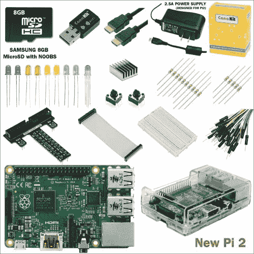

树莓皮 B 型 2 的典型套件组件

## 买树莓皮

英国树莓 Pi 基金会的树莓 Pi。不幸的是，它有被延期订购的历史。幸运的是，您可以从多家供应商处购买，其中一些供应商在[主页上列出 https://www.raspberrypi.org/](https://www.raspberrypi.org/) 。您也可以在[购买 http://www.amazon.com](http://www.amazon.com) ，尽管您需要多付一点。价格与你在这里看到的不同。

最后，请查看[http://www.adafruit.com](http://www.adafruit.com) 。他们是合理的价格，还携带一些有用的配件，您将需要在您未来的项目。在这些商店里，你还可以找到初学者工具包，包括覆盆子皮和必要的组件开始。

## 相关网站及文档

互联网上有大量关于树莓皮的信息。当你研究更高级的主题时，你会发现知道在哪里可以找到答案很有帮助。

树莓 Pi 基金会官方网站 To.T2A.http://www.rasberrypi.org 。它列出了购买覆盆子 Pi 微型计算机的来源。它有各种教程和有用的论坛。

有关在 Raspberry Pi 上运行的 Linux 版本的更多信息，请访问[http://elinux.org/index.php?title=RPi_Hub &重定向=否](http://elinux.org/index.php?title=RPi_Hub&redirect=no)。有关于通用和输入/输出引脚的信息；Raspbian Wheezy，为 Raspberry Pi 设计的 Linux 版本；和样本项目。您还可以找到其他嵌入式系统的相关信息，例如**Minnow board**和**BeagleBoard**。

尼尔·布莱克（Neil Black）为《覆盆子圆周率》（Raspberry Pi）创作了一本一流的初学者指南，值得大家鼓掌。请访问[http://neil-black.co.uk/the-updated-raspberry-pi-beginners-guide](http://neil-black.co.uk/the-updated-raspberry-pi-beginners-guide) 如果您在安装过程中感到困惑。

最后，访问[http://www.adafruit.com](http://www.adafruit.com) 购买覆盆子 Pi 以及电源、电机控制板和实验套件。如果您不能在当地购买零件，该集团是购买配件和其他部件的绝佳场所。

# 为 JavaFX 8 准备树莓皮

如果没有从 SD 卡加载的操作系统，您的 Raspberry Pi 将一事无成。我们需要一种与之交互的方式，首先安装受支持的操作系统，在我们的例子中是 Raspbian Wheezy；列出了 Pi 支持的所有官方操作系统，可从链接[下载 http://www.raspberrypi.org/downloads/](http://www.raspberrypi.org/downloads/) 。

然后，我们将为 Pi 配置网络设置以远程连接。最后，我们将检查默认安装的 JavaSE8 版本，并继续检查是否有更新，如果没有使用操作系统预先打包的话。

如前所述，上一次更新不包括 JavaFX，因此我们将找到添加它的方法。让我们开始准备我们的 SD 卡来安装 Raspbian Wheezy 操作系统，让 Raspberry Pi 启动并运行。

## 创建可引导 SD 卡

现在，我们将准备带有树莓喘息操作系统的 SD 卡，这将允许我们与树莓皮互动。这是非常重要的一步。有两种方法可以做到这一点：

### 使用 NOOBS

NOOBS 是一个包含 Raspbian 的简单操作系统安装程序。但是 lite 版本没有捆绑 Raspbian。它还提供了可供选择的操作系统，然后从 Internet 下载并安装。

初学者应该从 NOOBS 方法开始，但它需要具有良好速度的互联网连接才能下载首选操作系统。

如果您购买了预装 NOOBS SD 卡的套件，您可以跳到下一步。或者，如果您需要 SD 卡，您可以从[的 Swag 商店订购一张 http://swag.raspberrypi.org/products/noobs-8gb-sd-card](http://swag.raspberrypi.org/products/noobs-8gb-sd-card) 甚至可以自己下载并安装到 SD 卡上。所有步骤均在链接[处提供 http://www.raspberrypi.org/help/noobs-setup/](http://www.raspberrypi.org/help/noobs-setup/) 。

正在将 Raspbian 喘息操作系统刻录到 SD 卡：

这是我最喜欢的设置，因为我已经下载了操作系统，并将其直接刻录到我的 SD 卡上；以下是从 Mac OS X 执行此操作的步骤（请确保您拥有有效的 SD 卡，内存为 4/8/16 GB，级别为 10）：

我们需要用 FAT32 格式化 SD 卡。我们将使用适用于 Windows 或 Mac 的 SD Formatter 4.0 轻松实现这一点，该软件可从 SD 协会网站[下载 https://www.sdcard.org/downloads/formatter_4/eula_mac/index.html](https://www.sdcard.org/downloads/formatter_4/eula_mac/index.html) 。

按照说明安装软件包：

1.  将您的 SD 卡插入计算机或笔记本电脑的 SD 卡读卡器，并*记录分配给它的驱动器号*，例如，在我的情况下`/disk2`。
2.  In **SDFormatter**, select the drive letter for your SD card, go to **Format Option** and select **Overwrite format**, name it `RaspWheezy` (optional), and click on **Format**. It may take a while to format the SD depending on the size of the card.

    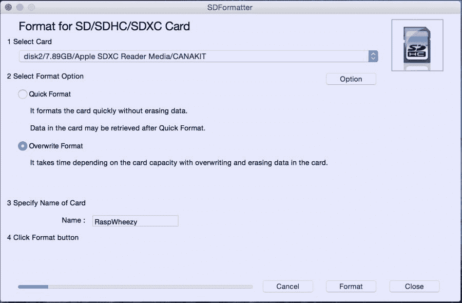

    使用 SDFormatter 应用程序格式化 SD 卡

3.  Once the format is completed, close SDFormatter. If you are on Mac or Linux, run the following command line from your terminal to check the disk letter and format type:

    ```java
    $ diskutil list

    ```

    此时 SD 卡为`/dev/disk2`，格式类型为`DOS_FAT_32`，名称为`RASPWHEEZY`。在窗户上。打开 Windows 资源管理器并检查驱动器。

    ### 注

    不要弄错了，否则您可能会破坏错误`disk/card/drive`上的所有数据。

4.  从链接[下载 Raspbian Wheezy 操作系统 http://downloads.raspberrypi.org/raspbian_latest](http://downloads.raspberrypi.org/raspbian_latest) 解压，你应该有`2015-02-16-raspbian-wheezy.img`文件。
5.  从 Mac 或 Linux 上的命令行，卸载磁盘，但不要弹出：

    ```java
    $ diskutil unmountDisk /dev/disk2

    ```

6.  Then write the image to the SD card with the `dd` command line:

    ```java
    $ sudo dd if=/path/to/2015-02-16-raspbian-wheezy.img of=/dev/rdisk2 bs=1m

    ```

    输入密码后，写入过程开始，您必须等待再次收到提示。由于这需要几分钟的时间，在 Windows 上，您可以使用 Win32DiskImager（可从[下载）http://www.raspberry-projects.com/pi/pi-operating-systems/win32diskimager](http://www.raspberry-projects.com/pi/pi-operating-systems/win32diskimager) ）。

7.  After the `dd` command finishes, eject the card:

    ```java
    $ sudo diskutil eject /dev/rdisk2

    ```

    ### 注

    注意`dd`在出现错误或完成之前不会反馈任何信息；将显示信息，完成后磁盘将重新装载。但是，如果您想查看进度，可以使用*Ctrl*+*T*快捷方式。这将生成您的`tty`的状态参数**SIGINFO**，并将显示有关流程的信息。

祝贺您，现在将 SD 卡安装到 Raspberry Pi 上，并将其连接到适当的显示器以启动它。

## 配置树莓 Pi

现在，我们需要为第一次启动设置 Pi，并配置一个静态 IP，以便从笔记本电脑远程连接到它：

1.  安装我们之前准备的 SD 卡。
2.  插入键盘、鼠标和显示器电缆。
3.  将 WiFi 适配器插入其中一个 USB 端口。
4.  现在，将电源线插入 Pi。
5.  在启动 Raspbian 操作系统的屏幕上应该会看到一些详细的输出。勇往直前，无所畏惧。
6.  在第一次启动时，Raspberry Pi 配置屏幕将显示，并将为您提供一系列可用于配置 Raspberry Pi 的选项。基本上，您需要设置时区和自己的语言环境配置。查看 CPU 和 GPU 之间内存拆分的设置，或启用 SSH。但在大多数情况下，您可以忽略它们，使用箭头键移动到最后一步，然后单击 Return。
7.  如果您在配置过程中选择了不喜欢的内容，您可以通过在控制台中键入`sudo raspi-config`来重新启动配置。
8.  如果 Raspberry Pi 配置正确，您将看到一系列 Linux 引导消息滚动，然后是登录请求。默认用户登录为`pi`，密码为`raspberry`。现在，您将看到一个标准的 Linux 道具。恭喜你，你的覆盆子圆周率已经开始运行了。
9.  Wheezy comes with a graphical user interface. Simply type `sudo startx` and you'll see a colorful user interface complete with games, word processors, and web browsers, as shown in the following screenshot:

    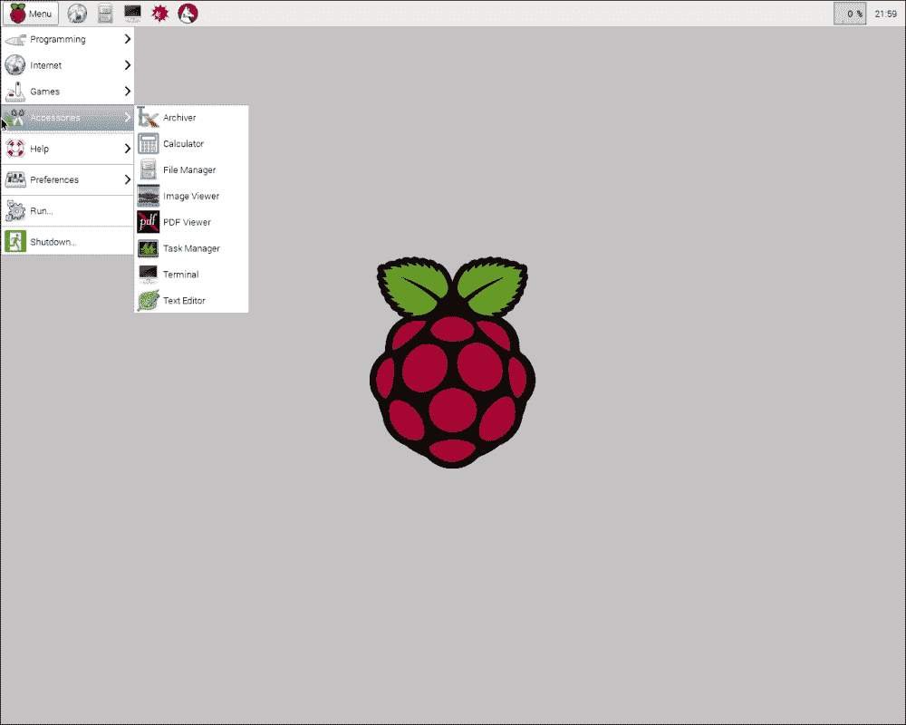

    树莓皮桌面

覆盆子 Pi 桌面是**轻量级 X11 桌面环境**（**LXDE**）。花点时间探索一下。你会发现它非常熟悉，尽管比你的高性能台式电脑慢一点。

使用完 LXDE 后，只需注销即可返回 Linux 提示符。为了查看 SD 卡上的信息，请优雅地关闭 Raspberry Pi。在拔出电源线之前，发出关机命令：

```java
$ Sudo shutdown -h now.

```

这将确保在关闭所有进程之前将所有内容写入 SD 卡。现在，您可以安全地拔出电源线，这就是 Raspberry Pi 的开/关开关范围。

恭喜你，你已经用你的树莓皮完成了你的第一个疗程。

## 远程连接到树莓 Pi

通常情况下，您会使用外围设备和显示器连接到 Raspberry Pi，但情况并非总是如此，因为在开发阶段或 Pi 本身被用作控制家用电器的酷服务器时，您需要从计算机、浏览器甚至移动设备控制 Pi。

没有必要给你的 Raspberry Pi 一个固定的网络地址，但强烈建议你这样做。这样做意味着您总是使用相同的地址（或名称，如果您在主机文件中创建了一个条目）连接到 Pi，因此它从您的开发过程中删除了一个潜在变量。

使用 Pi 的 IP 地址更新网络 DHCP 设备/路由器也是一个好主意，这样它就不会试图将其分配给网络上的其他设备。这样做所需的步骤因交换机/路由器制造商而异。

我们将在 Raspberry Pi 上安装 VNC 服务器。**虚拟网络计算**（**VNC**允许您通过网络从一台计算机控制另一台计算机。它提供了一个图形用户界面，包括鼠标和键盘。在我们的例子中，它将允许我们查看和使用 Raspberry Pi GUI，而不需要连接到 Raspberry Pi 的物理键盘和鼠标。

现在，这很方便，如果您对当前的鼠标、键盘和显示器设置满意，可以跳过这一部分。当您开始试验需要一个或多个 USB 端口的设备时，VNC 将成为一种必要。

设置 VNC 有五个步骤：

1.  连接到家庭 WiFi 互联网连接。
2.  在 Raspberry Pi 上安装 VNC。
3.  设置为启动时启动。
4.  设置一个静态 IP 地址。
5.  使用客户端连接到 VNC。

连接到 WiFi 互联网连接，Raspbian Wheezy 包括 WiFi 配置实用程序。此外，2012 年 10 月 28 日之后发布的所有 Raspbian 都预装了此实用程序。

### 注

设置 WiFi 需要路由器广播 SSID。确保在路由器上设置了*广播 SSID*！这不适用于专用 SSID 设置。

现在，让我们远程连接到树莓 Pi：

1.  From the Raspbian desktop, go to **Menu** | **Preferences** | **WiFi Configuration**, as shown in the following screenshot:

    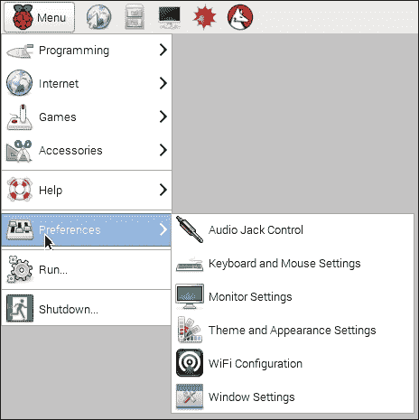

    选择 WiFi 配置实用程序

2.  Double-click on the icon and you will see the following window:

    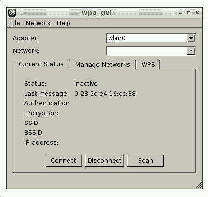

    WiFi 配置实用程序 GUI

3.  Click on the **Scan** button and a second window will open. Find your wireless access point in the list and double-click on it. This will open another window:

    

    接入点清单

4.  Enter your password in the `PSK` field and then click on **Add**. When you look at the first window, you should see that the connection is all set up for use.

    

    添加接入点时的最终状态

您可以使用按钮连接或断开连接。您可以在前面的屏幕截图中看到，Pi 的 IP 地址显示在窗口的底部。

请注意，在终端上设置 WiFi 连接有一个手动过程。这需要编辑`config`文件并手动添加网络的 SSID 和密码。有关更多信息，请访问[https://www.raspberrypi.org/documentation/configuration/wireless/wireless-cli.md](https://www.raspberrypi.org/documentation/configuration/wireless/wireless-cli.md) 。

祝贺您，您的 Pi 已连接到 Internet。现在让我们安装一个 VNC 服务器。

### 在树莓皮上安装 VNC

既然您已经有了互联网连接，您就可以在 Raspberry Pi 上安装 VNC 服务器了。如果你用的是拉斯宾哮喘病，这很简单。在命令提示下，输入以下行：

```java
$ sudo apt-get install tightvncserver

```

您将收到消息：**是否继续？是还是不是？**

让我们用大写的*Y*来回答，然后休息一下。安装完成后，输入以下命令：

```java
$ vncserver

```

您将被要求创建密码，我使用*树莓*。注意密码长度超过 8 个字符；继续并重新键入`raspberry`。接下来，您会被问到：**您想输入一个只查看的密码吗？**输入*N*作为编号。

恭喜你，你在你的树莓皮上运行 VNC。

#### 将 VNC 设置为启动时启动

随着您变得越来越高级，您可能并不总是需要 VNC，但让我们假设您希望 VNC 在每次启动 Raspberry Pi 时运行：

1.  使用来自 Pi**LX 终端**的以下命令编辑`rc.local`文件：

    ```java
    $ sudo nano /etc/rc.local

    ```

2.  滚动至底部并在`exit 0`上方添加以下行：

    ```java
    su -c "/usr/bin/tightvncserver -geometry 1280x1024" pi

    ```

3.  保存文件并使用以下命令重新启动 Raspberry Pi:

    ```java
    $ sudo shutdown -r now

    ```

4.  现在，每次你开始你的树莓皮，VNC 将可用。

### 设置静态 IP 地址

通过 VNC 连接 Raspberry Pi 需要一个静态 IP 地址，该地址不变。在接下来的几个步骤中，我将向您展示如何在有线和无线网络中实现这一点：

1.  If you are on a home network, you'll need to discover a usable IP address. To do this, turn to your Raspberry Pi, open Pi LX Terminal, and type:

    ```java
    mohamed_taman$ ifconfig –a

    ```

    然后，键入以下命令：

    ```java
    mohamed_taman$ netstat -nr

    ```

2.  收集以下信息：*当前 IP*（如果您想保留）、*网络掩码*、*网关*、*目的地*、*广播*。把这些写下来，你很快就会需要的！
3.  在 Pi 上，通过运行以下命令对`/etc/network/interfaces`进行备份：

    ```java
    $ sudo cp /etc/network/interfaces /etc/network/interfaces.org

    ```

4.  使用以下命令修改`interfaces`文件：

    ```java
    $ sudo nano /etc/network/interfaces

    ```

5.  Change the `interfaces` file from:

    

    编辑前的接口文件

6.  Select the IP numbers that suit your network; also change `wpa-ssid` to your wireless network name and `wpa-psk` to wireless password:

    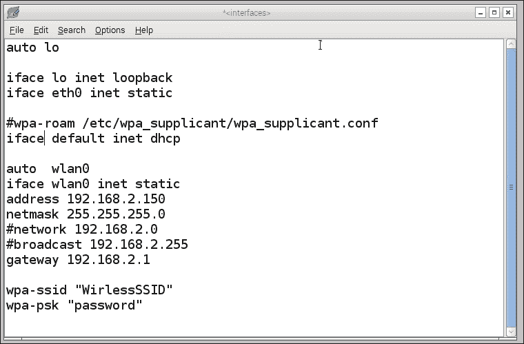

    编辑后的接口文件

7.  保存文件并重新启动 Raspberry Pi。这些设置适用于有线和无线连接。祝贺您，您现在可以使用 VNC 客户端连接到 Pi。

### 在树莓 Pi 中自动登录

像大多数人一样，你可能买了覆盆子圆周率（Raspberry Pi）来制造你自己的家用或办公设备。接下来要做的事情是设置 Raspberry Pi，连接外围设备，安装或开发必要的软件。

在项目结束时，您想要的是打开设备电源，让它向您展示您所期待的所有魔力。

当 Pi 引导到登录提示并等待您输入用户名和密码时，扰流板就会出现。那么，让我们自动化 Raspberry Pi 登录：

1.  从 Pi 中，打开一个终端并使用以下命令编辑`inittab`文件：

    ```java
    sudo nano /etc/inittab

    ```

2.  导航到`inittab`

    ```java
    1:2345:respawn:/sbin/getty 115200 tty1

    ```

    中的下一行，禁用`getty`程序
3.  在行首添加一个`#`注释掉，如下行所示：

    ```java
    #1:2345:respawn:/sbin/getty 115200 tty1

    ```

4.  在注释行

    ```java
    1:2345:respawn:/bin/login -f pi tty1 </dev/tty1 >/dev/tty1 2>&1

    ```

    下方的`inittab`中添加登录程序
5.  这将使用`pi`用户运行登录程序，无需任何身份验证。
6.  按*Ctrl*+*X*保存退出，然后按*Y*保存文件，然后按*Enter*确认文件名。

重新启动 Pi，它将直接引导到 shell 提示符`pi@raspberrypi`，而不提示您输入用户名或密码。

### 通过客户端连接到 VNC

在进一步讨论之前，让我们确保一切正常。为此，您需要一个 VNC 客户端。如果您使用的是 Macintosh 和最新版本的 MacOSX，这很简单。

转到**查找器****转到****连接到服务器**。输入`vnc://`和您为 Raspberry Pi 提供的 IP 地址。在我的例子中，它是 192.168.2.150，后跟一个冒号和数字 5901，如下面的屏幕截图所示。完整的 URL 应该是**vnc://192.168.2.150:5901** 。

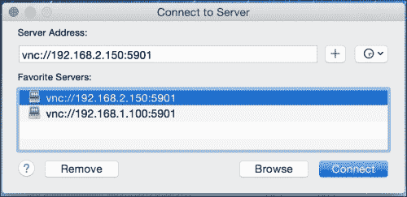

连接到 pivnc 服务器。

如图所示，`5901`是 Raspberry Pi VNC 服务器正在侦听的端口号。点击**连接**。不要担心屏幕共享加密，再次点击**连接**。现在输入您先前创建的密码（`raspberry`。如果一切正常，你会看到一个大树莓。祝贺

如果您不在 Macintosh 计算机上，则需要下载 VNC 客户端。您可以从[获得免费观众 http://realvnc.com/](http://realvnc.com/) 。有 Windows、iOS、Android 和 Chrome 浏览器的客户端。是的，你可以用手机控制你的树莓皮。

# JavaFX 8 开发先决条件

现在我们已经为开发设置并配置了 Raspberry Pi，我们需要在开发机器和 Pi 上安装相同的正确匹配 JDK 8 构建版本。这对于在运行 JavaFX8 应用程序时避免库/版本控制问题非常重要，这也是我们下一步要做的。

## 在 Raspberry Pi 上安装 Java SE 8

在撰写本文时，Raspbian 哮喘病已预装 JDK 8。要进行检查，只需在 Pi 命令提示符下键入以下内容：

```java
pi@raspberrypi ~ $ java –version

```

您将看到类似的内容，具体取决于当前安装和可访问的版本：


Raspbian Wheezy Java 版本在 Raspberry Pi 上

重要的一点是第二行：如果没有显示 1.8.n，则需要安装 JDK8。

## 安装 Java SE 8

我们之前已经安装了我们的 JDK 8，所有必要的步骤在[第一章](1.html#aid-DB7S1 "Chapter 1. Getting Started with JavaFX 8")*开始使用 JavaFX 8*中的*安装 JavaSE 8 JDK*一节中进行了描述。

## 添加 JavaFX

正如前面提到的一样，Oracle 已经撤销了对 JavaFX Embedded 的支持。如果您已经在 Raspbian Wheezy 上安装了 JDK 8u45 或预捆绑版本，则没有`jfxrt.jar`捆绑版本，因此我们需要提供它以便在我们的 Pi 上运行 JavaFX 应用程序。

一种方法是按照[中的教程进行操作 https://wiki.openjdk.java.net/display/OpenJFX/Cross+建筑+用于+手臂+硬+浮动](https://wiki.openjdk.java.net/display/OpenJFX/Cross+Building+for+ARM+Hard+Float)，交叉建筑 OpenJFX 用于手臂。这是为真正的高级开发人员准备的。

一种更简单的方法是下载一个预构建的发行版，比如托管在 JavaFXPorts 项目（[上的`armv6hf-sdk.zip`https://bitbucket.org/javafxports/arm/downloads](https://bitbucket.org/javafxports/arm/downloads) 。

下载`armv6hf-sdk.zip`后，将其解压并添加此命令行选项，以使用扩展机制将外部源附加到`classpath`：

```java
-Djava.ext.dirs=<path to armv6hf-sdk>/rt/lib/ext

```

或者，您可以将`rt/lib/ext`和`rt/lib/arm`的内容从此 zip 复制到 JVM 文件夹中，避免使用扩展机制。

## 为 Raspberry Pi 配置 NetBeans

NetBeans 8 增加了指向远程 JDK 并使用它远程调试和执行您在开发机器上本地编写的程序的功能。它甚至可以自动无缝地部署您的应用程序。正如 JoséPereda 在其文章[中所记录的那样 http://netbeans.dzone.com/articles/nb-8-raspberry-pi-end2end](http://netbeans.dzone.com/articles/nb-8-raspberry-pi-end2end) ，您可以通过以下步骤启用此功能：

1.  在您的计算机上启动 NetBeans。
2.  从菜单栏中选择**工具**，然后选择**Java 平台**。点击**添加平台**按钮。
3.  选择**远程 Java 标准版**单选按钮，点击**下一步**。
4.  Provide the following entries (shown in the following screenshot as an example):

    **平台名称**：`JavaFX on Raspberry Pi JDK 8`

    **主机**：输入您之前已经分配的树莓 Pi 的静态 IP 地址或主机名

    **用户名**：`pi`

    **密码**：`raspberry`

    **远程 JRE 路径**：`/usr/lib/jvm/jdk-8-oracle-arm-vfp-hflt/jre`

    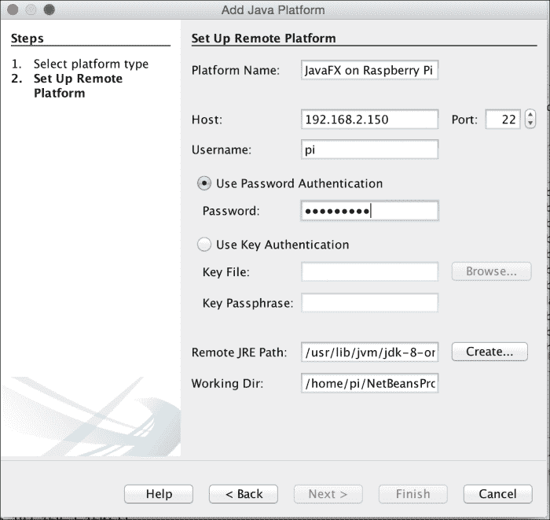

    为 Pi 建立远程平台

5.  点击**完成**按钮，等待 NetBeans 建立并配置远程 JDK 连接。
6.  远程 JDK 就位后，点击**关闭**按钮。

现在我们已经完成了设置，您应该拥有一个开发环境，该环境是为 Raspberry Pi 开发 JavaFX8 应用程序的最佳环境之一。让我们开始吧！

# 交换机应用

switch 应用程序本质上非常简单，但其思想主要分为两个要点：如何在 Raspberry Pi 上运行 JavaFX 8 应用程序，以及如何通过 Raspberry Pi**通用输入/输出**（**GPIO**控制外部世界。为此，我们将使用名为**Pi4j**的项目。

想法很简单；我们将创建一个 JavaFX 应用程序，该应用程序将作为开关控制器来控制与连接到 Raspberry Pi 的电路相关联的 LED。

以下屏幕截图显示应用程序处于打开和关闭状态：

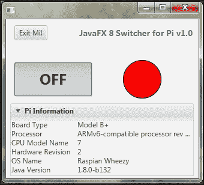

打开应用程序状态

.


关闭应用程序状态

## 什么是 Pi4J 库？

Pi4j 库（[http://pi4j.com](http://pi4j.com) 是项目，旨在在本机库和 Java 之间提供一座桥梁，以便完全访问 Raspberry Pi 功能和控件，因此您可以轻松访问 Java 项目的 GPIO 引脚。

访问[http://pi4j.com/pins/model-2b-rev1.html](http://pi4j.com/pins/model-2b-rev1.html) 用于树莓 Pi 2 型号 B（J8 头），用于 GPIO 引脚编号。此外，工具包的 GPIO 适配器可能附带 GPIO 头快速参考。

在本例中，您需要一些基本的电子元件，如 LED、电阻器和试验板。如果这些不包括在您的工具包中，您可以从网上商店购买。

### 电路设置

现在我们需要通过在试验板中添加一个带有 220 欧姆上拉电阻器的 LED 来设置电路，并将阳极连接到 GPIO 引脚#1，将阴极连接到 GPIO GND 引脚，如下图所示（CanaKit 附带了最常用电子部件的通用装配指南）：

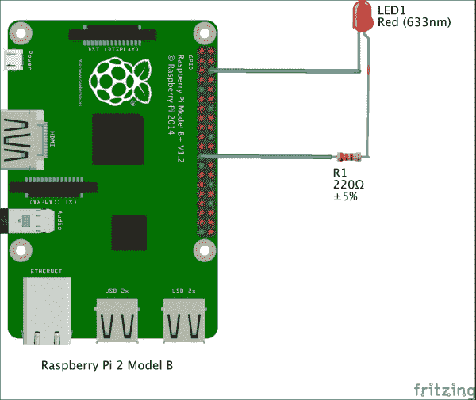

开关应用电路设置

## 申请

正如前面提到的，应用程序界面包含两个按钮。**离开我！**负责关闭 GPIO 控制器并关闭应用程序。第二个按钮是用作开关的切换按钮（**打开**/**关闭**。它有两种状态：选中时，其状态为 true，未选中时变为 false。此外，我们以编程方式更改其标签，以指示当前受控 LED 的状态。

此外，还有一个圆形模拟 LED 的物理状态。因此，当切换按钮打开时，圆圈将填充红色。禁用此选项将使其变为黑色，这是默认状态。

最后，在应用程序场景的底部，我们添加了一个`TitledPane`标记的 Pi 信息，显示一些树莓 Pi 信息。

通过查看`SwitchUIController.java`类，您会发现在与`Pi4J`库交互之前，我们有非常重要的字段要声明：

```java
private GpioController gpio;
private GpioPinDigitalOutput pin;
```

第一条行负责创建一个新的 GPIO 控制器实例，该实例通过`GpioFactory`在`initialize()`方法中完成，因为它包括一个创建 GPIO 控制器的`createInstance`方法：

```java
gpio = GpioFactory.getInstance();
```

### 注

您的项目应该只实例化一个 GPIO 控制器实例，该实例应该在整个项目中共享。

要访问 GPIO pin，必须首先设置 pin。配置根据您打算如何使用 pin 来配置 pin。设置可以自动导出 pin，设置其方向，并为基于中断的事件设置任何边缘检测：

```java
// provision gpio pin #01 as an output pin and turn on
pin = gpio.provisionDigitalOutputPin(GPIO_01);
```

这是如何设置输出引脚#1。您的程序将只能控制设置为输出管脚的管脚的状态。输出引脚用于控制继电器、LED 和晶体管。

现在我们要做的就是使用切换按钮控制应用程序中的 LED。这是通过注册用于切换按钮的`doOnOff()`事件函数完成的，如以下代码所示：

```java
    @FXML
    private void doOnOff(ActionEvent event) {
        if (switchTgl.isSelected()) {
            pin.high();
            led.setFill(RED);
            switchTgl.setText("OFF");
            System.out.println("Switch is On");
        } else {
            pin.low();
            led.setFill(BLACK);
            switchTgl.setText("ON");
            System.out.println("Switch is Off");
        }
    }
```

`P14J`库提供了许多方便的方法来控制或写入 GPIO 引脚的状态。在我们的应用中，我们使用`pin.high()`打开 LED，`pin.low()`关闭 LED。

最后，当应用程序退出时，我们必须关闭 GPIO 控制器。Pi4J 项目提供了一种在应用程序终止时自动将 GPIO 引脚状态设置为非活动的实现。

这有助于确保 GPIO 引脚状态未激活，或在程序关闭时保持某些活动处于激活状态。我们只需使用前面创建的 GPIO 实例中的以下代码行即可：

```java
gpio.shutdown();
```

当您按下切换按钮打开 LED 时，您将看到绿色 LED 发光。当它关闭时，您将看到 LED 已褪色。

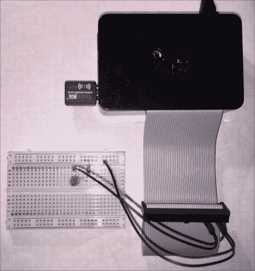

应用电路 LED 熄灭


应用电路 LED 亮起

接下来，让我们将项目配置为直接在 NetBeans 的 Raspberry Pi 上运行 JavaFX switch 应用程序。

# 将 NetBeans 与 Pi 一起使用

在讨论了我们的应用程序逻辑并了解了它是如何工作的之后，是时候进行最好的部分了：构建应用程序并使用 NetBeans 在 Raspberry Pi 上运行它。步骤如下：

1.  右键点击 NetBeans**项目**选项卡中的`Chapter6`项目，选择**属性**。
2.  From the **Project Properties** box, select **Run** from the **Categories** menu to the left. You will see a dialog similar to the following screenshot:

    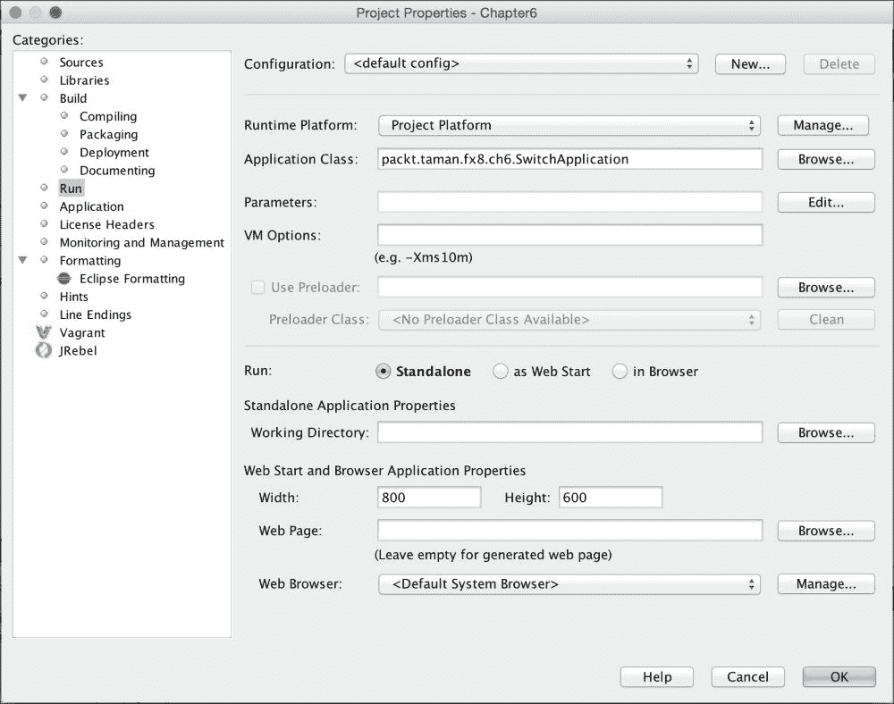

    “项目属性”对话框和运行化身

3.  Click on the **New** button to the right of the selected **Configuration**. Set a name for the **New Configuration** (`Pi Remote Config`) and click on the **OK** button, as shown in the following screenshot:

    

    新配置

4.  Now you have to associate a remote JDK with your remote configuration. To do so, click on the combo box labeled **Runtime Platform** and select `JavaFX on Raspberry Pi JDK 8` that you configured earlier. Don't forget to add the path for `jfxrt.jar` in **VM Options**:

    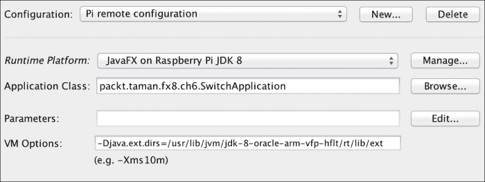

    远程 Pi-JDK 关联

5.  最后一步是构建应用程序并将其部署到 Raspberry Pi。要执行此操作，请转到**运行**菜单，选择**运行项目**并查看 NetBeans 输出窗口/选项卡。如果您在运行应用程序时关注 Pi 的屏幕，您将看到以下输出消息：

    ```java
    jfx-deployment-script:
    jfx-deployment:
    jar:
    Connecting to 192.168.2.150:22
    cmd : mkdir -p '/home/pi/NetBeansProjects/Chapter6/dist'
    Connecting to 192.168.2.150:22
    done.
    profile-rp-calibrate-passwd:
    Connecting to 192.168.2.150:22
    cmd : cd '/home/pi/NetBeansProjects/Chapter6';
    '/usr/lib/jvm/jdk-8-oracle-arm-vfp-hflt/jre/bin/java'  -Dfile.encoding=UTF-8 -jar /home/pi/NetBeansProjects/Chapter6/dist/Chapter6.jar
    ```

# 总结

在本章中，我们使用了一台信用卡大小的微型计算机，它不比一副扑克牌大，并将其转换为 JavaFX 开关控制器机器。在此过程中，您了解了 Raspberry Pi、如何创建可引导 SD 卡、如何为其安装操作系统、如何为其配置最佳性能和远程连接、如何为其提供固定网络（IP）地址以及如何从开发机器连接到 Pi。

我们还回顾了如何将 JDK 8/JavaFX 8 安装到 Raspberry Pi 和您的开发机器上，并且您学习了如何在您的开发机器上安装和配置 NetBeans，以便它可以使用 Pi 上的 JDK 作为调试和执行的远程平台。

在您的开发机器和 Raspberry Pi 准备就绪的情况下，我们讨论了使用 JavaFX 和一些精选工具/API（包括 Pi4j）来控制 GPIO，从 Raspberry Pi 开发一个简单但伟大的应用程序来控制外部世界所需的原则。

最后，您了解了如何将应用程序从 NetBeans 远程部署到 Raspberry Pi，只需单击几下即可完成。

在下一章中，我们将监控一个温度传感器，测量来自 Arduino 板的血液温度。