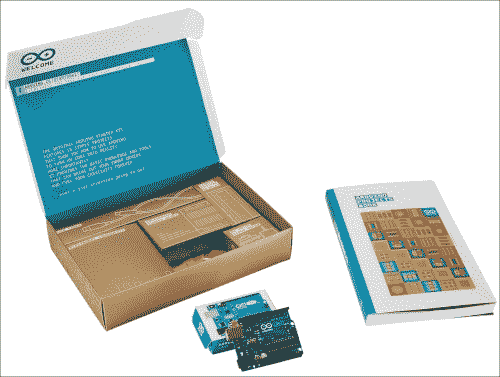
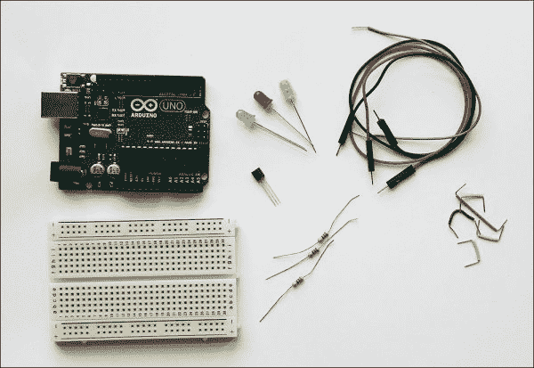
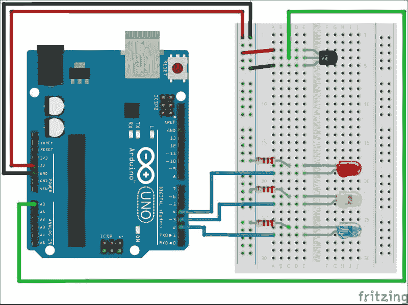
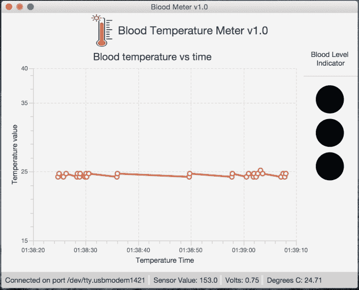
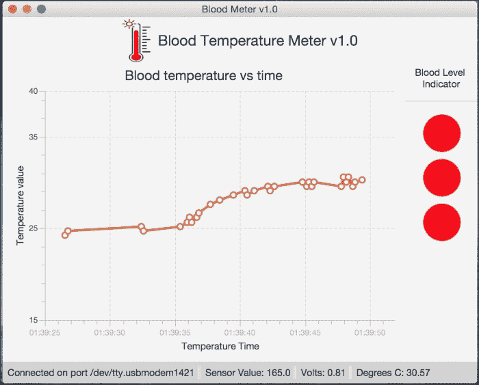

# 七、使用 JavaFX 监控 Arduino

**Arduino**是一款基于简单可编程微控制器板的开源电子工具，可使用免费开源 IDE 编程。它可以单独或连接到计算机，创建交互式设备，通过从各种开关或传感器获取输入进行感知，并通过控制各种灯光、电机和其他物理设备的输出进行操作。

作为首批**物联网**（**物联网**设备之一，创建于 2005 年。它从物联网概念一开始就存在于此。

Arduino 可以独立运行，也可以与计算机上运行的软件（Java、JavaFX、Python 等）进行通信，并且可以手动组装或购买预装配板。

事实上，Arduino 简化了使用微控制器的过程。此外，对于教师、学生和感兴趣的业余爱好者来说，它比其他系统更有利可图，因为它*便宜*——一块 Arduino 板的成本不到 50 美元。

一个简单、清晰、易于使用的编程环境；开源和可扩展的软件；开源和可扩展硬件这些特性使 Arduino 支持“自己动手”和“与他人一起动手”的概念，这些概念定义了创客运动。

本章将向您展示如何使用 JavaFX 和 Arduino 板开发一个桌面应用，以便监控来自真实世界温度传感器的数据并在图表上报告，*您真是热血沸腾！*

在本章中，您将：

*   熟悉 Arduino 板及其组件
*   安装并准备 Arduino 软件和环境、IDE 和驱动程序
*   开发 Arduino 血量计草图，以控制和监控电路
*   使用串行通信将 Arduino 数据读入 JavaFX 应用
*   使用 JavaFX 图表 API 显示数据

# 什么是 Arduino 板？

Arduino Uno 是最知名的 Arduino 板，是基于**ATmega328**数据表（[的微控制器板 http://www.atmel.com/dyn/resources/prod_documents/doc8161.pdf](http://www.atmel.com/dyn/resources/prod_documents/doc8161.pdf) ），这是董事会的大脑。它的尺寸约为 3 x 2 英寸。它有 14 个数字输入/输出引脚、6 个模拟输入引脚和 32KB 的闪存。

每个电路板包含一个复位按钮。此外，它还包括一个 USB 端口，因此当它连接到计算机时，它将成为电源和通信工具。如果未连接到计算机，则可以使用备用电源，如 AC 9 至 12 V DC 适配器，该适配器可通过将 2.1 mm 中心正极插头插入电路板的电源插座或 9 V 电池组进行连接。

数字旁边带有波浪符号的六个数字管脚是允许**脉冲宽度调制**（**PWM】**的管脚，这是一种控制电源和模拟数字输入管脚上模拟信号的技术。使用这些引脚的一个原因可能是为了控制 LED 的亮度。

Arduino Uno 的官方规格可在[上找到 http://arduino.cc](http://arduino.cc) 网站位于[http://arduino.cc/en/Main/ArduinoBoardUno](http://arduino.cc/en/Main/ArduinoBoardUno) 。访问[http://www.arduino.cc/en/Main/Products](http://www.arduino.cc/en/Main/Products) 查找其他 Arduino 板的信息，如**Mega**、**到期**或**Yun**以及以及下一个版本**Tre**和**Zero**。

下图显示了 Arduino Uno R3 板：


## 你能用它做什么？

你的 Arduino 板可能很小，但不要让它的大小欺骗你。它很强大，有很大的发展空间。它特别强大，因为它建立在开放硬件和开放软件平台上。我们不会花时间谈论开源；简言之，这意味着有关硬件和软件的信息是免费的，并且很容易找到。

Arduino 可以通过接收输入来感知环境。它还可以控制输出，如灯、电机、传感器等。

您可以使用开源 Arduino 编程语言对板上的微控制器进行编程。

### 相关网站及文档

开放源代码和开放硬件平台的一大优势是你可以在互联网上找到信息。

一个很好的开始寻找 Arduino 信息的地方是官方页面：[http://arduino.cc](http://arduino.cc) 网站位于[http://arduino.cc/en/Guide/HomePage](http://arduino.cc/en/Guide/HomePage) 。随着技能的提高，你会想研究更高级的主题，你会发现知道在哪里找到答案很有帮助。

另一个伟大的网站是[http://adafruit.com](http://adafruit.com) 。该网站有教程、示例、有用的论坛，以及一个可以购买所需零件的商店。

另一个有趣的儿童应用是将**乐高头脑风暴**传感器和电机与 Arduino 相结合。我推荐网站[http://wayneandlayne.com](http://wayneandlayne.com) ，因为它一直是我整合乐高和 Arduino 的灵感和出发点。如果你正在寻找零件和项目，这是一个很好的网站访问。

## 设置您的 Arduino

如果这是你第一次接触 Arduino，我强烈建议你从一个套件开始，而不是组装所有单独的组件。

本章中的大多数活动都可以使用 Arduino.cc 中名为 Arduino 初学者工具包的工具包来完成，如下图所示。它包括 Arduino Uno R3 和其他组件，以完成大多数预捆绑项目。有关工具包的完整说明，请访问[http://store.arduino.cc/product/K000007](http://store.arduino.cc/product/K000007) 。



Arduino 初学者工具包（工具包包括组件、电路板和项目手册）

### 购买 Arduino

虽然 Arduino Uno 售价约为 25 美元，但您可以从[购买不同的套件，包括从基本预算包（50 美元）到 Arduino 入门包（65 美元）的棋盘 http://adafruit.com](http://adafruit.com) 或[提供的初学者工具包（90 美元）http://arduino.cc](http://arduino.cc) 。这些套件的组件与预算包相同。但它们也包括一些额外的更高级的修补。

[的初学者工具包的一个很好的优势 http://arduino.cc](http://arduino.cc) 包括一本指南，介绍了 15 个不同技能水平的不同项目。

如果您是亚马逊用户，通常可以在他们的网站上找到相同的工具包，但价格可能会有所不同。

大多数板的核心部件位于相同的位置。因此，更先进的电路板已经在尺寸上加长，以容纳更多的组件。

以下是一些购买组件的网站和一些书籍：[http://arduino.cc](http://arduino.cc) 、[http://Adafruit.com](http://Adafruit.com) 、[http://makershed.com](http://makershed.com) 、[http://sparkfun.com](http://sparkfun.com) 和[http://Amazon.com](http://Amazon.com) 。

### 您需要的其他组件

除了 Arduino，您还需要一台带有 Windows、Mac OS 或 Linux 的计算机，并带有 USB 端口，以将您的计算机连接到主板。

对于血量计项目，您将需要 Arduino 初学者工具包中已有的一些组件。下面是一个简短的组件列表，您应该随身携带。

一台计算机带有 USB 端口、USB 电缆、无焊试验板、软电线、TMP36 温度传感器、三个 220 欧姆电阻器和三个 LED（黄色、蓝色和红色），如下图所示：



血液计项目工具和材料

### Arduino IDE

为了对 Arduino 微控制器进行交互和编程，我们需要下载并安装 Arduino 集成开发环境。

Arduino 软件包括编写代码所需的所有组件、文本编辑器和编译器，用于将代码转换为机器语言，并将其上载到主板并运行代码。

#### 下载 IDE

在撰写本文时，Arduino IDE 版本为 1.6.3，但您可以通过链接[获得 Arduino 软件的最新版本 http://www.arduino.cc/en/Main/Software](http://www.arduino.cc/en/Main/Software) 。除了下面屏幕截图中显示的 Arduino 版本外，单击首选操作系统链接；就我而言，我选择了 MacOSX。

从捐赠页面，要么捐赠，要么点击**刚下载**链接开始下载 IDE；就我而言，我选择了`arduino-1.6.4-macosx.zip`。

下载后，解压缩文件并将`Arduino.app`文件复制到 Mac 上的应用文件夹中，或将 Arduino 可执行文件链接到易于访问的位置。

下载 IDE 后，在开始编程之前，还需要处理一些硬件问题。


下载 Arduino IDE 1.6.4

#### 安装驱动器

首先，您需要使用 USB 电缆将 Arduino 板连接到您的计算机。绿色 LED 电源指示灯（标有 PWR 或 ON）应亮起。

##### Windows 安装

让我们在 Windows 中设置 Arduino：

1.  插入主板，等待 Windows 开始其驱动程序安装过程。
2.  点击**开始菜单**打开**控制面板**。
3.  从**控制面板**导航至**系统和安全**。接下来，点击**系统**。打开系统窗口后，选择**设备管理器**。
4.  在**端口（COM&LPT】**下查看。您应该会看到一个名为`Arduino UNO (COMxx)`的开放端口。如果没有**COM&LPT**部分，请在**其他设备**下查找**未知设备**。
5.  右键点击**Arduino UNO（COMxx）**端口，选择**更新驱动软件**选项。
6.  接下来选择**浏览我的电脑以查找驱动程序软件**选项。
7.  最后，导航并选择名为`arduino.inf`的驱动程序文件，该文件位于 Arduino 软件下载的`Drivers`文件夹中（而不是`FTDI USB Drivers`子目录）。
8.  Windows will finish the driver installation from there.

    ### 提示

    如果您有 Windows 8，并且驱动程序安装不好，请尝试禁用驱动程序签名强制。

##### Mac OS X 和 Linux 设置

对于 Mac OS X 和 Linux 操作系统，无需安装驱动程序。

对于 Mac OS X，当您连接 Arduino 板时，您应该会看到它列在`/dev/tty.usbmodemXXXX or /dev/tty.usbserialXXXX`下。

在 Linux 上，当您连接 Arduino 板时，您应该会看到它列在`/dev/ttyACMX or /dev/ttyUSBX`下。

#### 探索 IDE 和草图

假设您的安装成功结束，双击 Arduino 应用，您将看到以下屏幕：


Arduino IDE，首先使用空草图运行

你现在需要做两件重要的事情来正确连接草图并将其上传到 Arduino 板上。首先，通过导航到**工具**|**板**选择您的板。然后进入**工具****串口**选择 Arduino 板的串口。

最后的验证步骤是为 Arduino 运行一个`Hello world`，您可以通过打开**文件****示例****1.基础****闪烁**中的 LED 闪烁示例草图来完成。

现在，只需点击环境中的**上传**按钮即可。如果上传成功，状态栏会出现**上传完成**消息。

等待几秒钟，您将看到板上的**RX**和**TX**LED 闪烁。

如果您有任何问题，请在[查看故障排除建议 http://arduino.cc/en/Guide/Troubleshooting](http://arduino.cc/en/Guide/Troubleshooting) 。

祝贺您，您的 Arduino 已启动并运行！

## 血量计项目

在本项目中，我们将使用温度传感器测量您皮肤的温度，然后开始打开（或关闭）由温度指示的 LED。

首先，我们将修补我们的电路板，并使用前面在*中描述的组件准备项目。您将需要*部分中描述的其他组件。然后，我们将绘制草图以读取传感器数据，并根据您的皮肤温度数据，打开和关闭 LED。

最后，我们将为 JavaFX 应用提供温度传感器数据，并使用图表 API 显示结果，以指示您的皮肤温度水平。

### 修补电路

现在，我们将对下图所示的血量计电路进行修补。首先连接 Arduino UNO 和试验板之间的跨接导线。我已将 TMP36 温度传感器连接在试验板上，因此传感器的圆形部分朝向远离 Arduino 的方向。引脚的顺序非常重要！请注意，我们已将左侧引脚连接到电源，右侧引脚接地，提供电压输出的中心引脚连接到板上的模拟引脚 A0。截图如下：



血液计电路布局示例

最后，我连接了三个 LED 灯和电阻器，并用数字 PMW 引脚行的 Arduino 引脚 4、~3 和 2 将它们连接起来。

像往常一样，我已经将试验板+行连接到电源（5V），将-行连接到地（GND）。

### 注

在设置组件时，请记住保持电路板未插电。

#### 素描

在我们修补电路并配置好所有东西后，我们需要对微控制器进行编程。这就是草图发挥魔力的地方：

```java
/*
  Chapter 7 example
  Project  - Blood-Meter

  This sketch is written to accompany Project in the
  JavaFX 8 essentials book

  Parts required:
  1 TMP36 temperature sensor
  3 red LEDs
  3 220 ohm resistors

  Created 5 April 2015
  by Mohamed Mahmoud Taman
  */

// named constant for the pin the sensor is connected to
const int sensorPin = A0;
// Room temperature in Celsius
const float baselineTemp = 25.0;

void setup() {
  // open a serial connection to display values
  Serial.begin(9600);
  // set the LED pins as outputs
  // the for() loop saves some extra coding
  for (int pinNumber = 2; pinNumber < 5; pinNumber++) {
    pinMode(pinNumber, OUTPUT);
    digitalWrite(pinNumber, LOW);
  }
}

void loop() {
  // read the value on AnalogIn pin 0
  // and store it in a variable
  int sensorVal = analogRead(sensorPin);

  // send the 10-bit sensor value out the serial port
  Serial.print("Sensor Value: ");
  Serial.print(sensorVal);

  // convert the ADC reading to voltage
  float voltage = (sensorVal / 1024.0) * 5.0;

  // Send the voltage level out the Serial port
  Serial.print(", Volts: ");
  Serial.print(voltage);

  // convert the voltage to temperature in degrees C
  // the sensor changes 10 mV per degree
  // the datasheet says there's a 500 mV offset
  // ((voltage - 500mV) times 100)
  Serial.print(", degrees C: ");
  float temperature = (voltage - .5) * 100;
  Serial.println(temperature);

  // if the current temperature is lower than the baseline
  // turn off all LEDs
  if (temperature < baselineTemp) {
    digitalWrite(2, LOW);
    digitalWrite(3, LOW);
    digitalWrite(4, LOW);
  } // if the temperature rises 2-4 degrees, turn an LED on
  else if (temperature >= baselineTemp + 2 && temperature < baselineTemp + 4) {
    digitalWrite(2, HIGH);
    digitalWrite(3, LOW);
    digitalWrite(4, LOW);
  } // if the temperature rises 4-6 degrees, turn a second LED on
  else if (temperature >= baselineTemp + 4 && temperature < baselineTemp + 6) {
    digitalWrite(2, HIGH);
    digitalWrite(3, HIGH);
    digitalWrite(4, LOW);
  } // if the temperature rises more than 6 degrees, turn all LEDs on
  else if (temperature >= baselineTemp + 6) {
    digitalWrite(2, HIGH);
    digitalWrite(3, HIGH);
    digitalWrite(4, HIGH);
  }
  delay(100);
}
```

#### 它是如何工作的

如果您正在阅读每行的注释，您将理解代码。在不深入细节的情况下，以下是草图的要点。

每个 Arduino 草图都有两种主要方法：`setup()`和`loop()`。第一种方法是初始化管脚作为输入或输出，打开串行端口，设置其速度，等等。第二种方法在微控制器内重复执行任务。

开始时，我们有一对有用的常数：一个参考模拟输入，另一个保持基线温度。在该基线上方每*2 度*处，LED 将点亮。

在`setup()`方法中，我们将串行端口初始化为每秒 9600 位的期望速度，并使用`for`循环将一些管脚设置为方向（输出管脚）并将其关闭。

在`loop()`方法中，我们开始读取温度传感器作为 0 到 1023 之间的电压值，然后使用`Serial.print()`将传感器值发送到串行端口，以便任何连接的设备（例如，我们的计算机）都可以读取它们。如果触摸传感器，这些模拟读数测量房间或皮肤的温度。

我们需要使用以下等式将模拟传感器读数转换为电压值：

```java
voltage = (sensorVal / 1024.0) * 5.0
```

从数据表中，我们使用传感器规格，使用以下等式将电压转换为温度：

```java
temperature = (voltage - .5) * 100
```

根据实际温度，您可以设置`if else`语句来点亮 LED。以基准温度为起点，当温度高于基准温度时，每升高 2 度，就会点亮一个 LED。

当你在温标中移动时，你将寻找一系列的值。

**模数转换器**（**ADC**读取速度非常快（以微秒计），建议在`loop()`功能结束时延迟 1 毫秒。但考虑到这将被发送到串行端口，最终会设置 100 毫秒的延迟。

#### 测试、验证并将草图上传至 Arduino

代码上传到 Arduino 后，点击串行监视器图标，如下图所示：


Arduino IDE 工具栏图标

您应该看到一个值流出来，格式如下：

```java
Sensor Value: 158, Volts: 0.77, degrees C: 27.15
```

现在，当传感器插入试验板时，试着用手指触摸传感器，看看串行监视器中的值会发生什么变化。

记录传感器露天时的温度。关闭串行监视器并将`baselineTemp`常数更改为您之前观察到的值。再次上传代码并再次尝试握住传感器；随着温度的升高，你会看到 LED 一个接一个地亮起。

恭喜你，帅哥！

### 从串口读取数据

在 Java 中没有标准的读取串行端口的方法，因为这是一个硬件特定的任务，打破了 Java 多平台的概念。因此，我们需要一个第三方库来完成这项工作，它应该用 Java 编写，以便与我们的应用集成。

Arduino IDE 使用第一个库进行串行通信，称为**RXTX**。最初来自 Trent Jarvi，并在 LGPL v2.1+受控接口链接许可证下发布，它与 Arduino IDE 一起发布，直到 1.5.5 beta 版才与主板通信。但是，它的速度非常慢，现在已被弃用。

新的**Java 简单串行连接器**（**jSSC**库由 Alexey Sokolov 开发，并获得 GNU Lesser GPL 许可。自 1.5.6 测试版以来，Arduino IDE 使用新的库进行板上通信，因为它比以前的版本更快。

该库的另一大优点是它作为一个`jssc.jar`文件分发，其中包括所有平台的所有本机接口，以减少每个平台和操作系统本地安装的痛苦。它会在运行时将它们添加到`classpath`中，如以下屏幕截图所示：


jSSC 2.8.0 本机库

您可以从[下载最新版本 https://github.com/scream3r/java-simple-serial-connector/releases](https://github.com/scream3r/java-simple-serial-connector/releases) 。在撰写本文时，jSSC 版本是 2.8.0。

### JavaFX 血量计监测应用

我们将设计一个 JavaFX8 应用，从温度传感器获取读数，并在折线图中显示数值。我们还将使用一组模拟电路板 LED 的形状来显示电路板上的 LED 发生了什么。为了清楚起见，我们将使用两个类，一个用于串行阅读，另一个用于 JavaFXUI 和主应用`BloodMeterFX`文件，包括图表 API。

我们将使用包含从串行端口读取的最后一行的 StringProperty 绑定这些类（Serial 和 BloodMeterFX）。通过在 JavaFX 线程中监听此属性的更改，我们将知道何时有新的读数添加到图表中。

完整的项目代码可从*Packt Publishing*网站下载。

#### Java 中的串行通信

让我们先从解释`Serial.java`课程开始。该类代码主要取自*JavaFX 8 简介，示例为 Apress*，核心读取函数有所变化，如下代码片段所示：

如果您打算分发应用，您应该将`jSSC.jar`文件添加到 Linux 或 Windows 上的`<JAVA_HOME>/jre/lib/ext`（或 Mac 上的`/Library/Java/Extensions`），或者最好将其添加到您的项目库中，如前一屏幕截图所示。

为了能够读取串口，我们需要以下导入的 jSSC 类：

```java
import jssc.SerialPort;
import static jssc.SerialPort.*;
import jssc.SerialPortException;
import jssc.SerialPortList;
```

对于动态读取端口，如果您不知道通过此类构造函数设置的确切端口名，我们有一组端口名可帮助您选择 Arduino 板可以连接到的正确端口。

```java
private static final List<String> USUAL_PORTS = Arrays.asList(
  "/dev/tty.usbmodem", "/dev/tty.usbserial", //Mac OS X
  "/dev/usbdev", "/dev/ttyUSB", "/dev/ttyACM", "/dev/serial", //Linux
  "COM3", "COM4", "COM5", "COM6" //Windows
);

private final String ardPort;

public Serial() {
      ardPort = "";
}

public Serial(String port) {
      ardPort = port;
}
```

`connect()`方法在未设置 Arduino 板的情况下查找有效的串行端口。如果找到它，就会打开它并添加一个侦听器。每次从 Arduino 输出返回一行时，该侦听器负责从串行端口获取输入读数。`stringProperty`设置了该行。我们使用`StringBuilder`存储字符，并在发现`'\r\n'`时提取行内容。我们在这里使用了 lambda 表达式提供的集合上的批量操作，以使查找端口列表和返回有效端口变得简单，具体取决于操作系统。

通过`set()`方法将找到的每一行设置为`line`变量，以便通过`getLine()`方法公开的`line`变量的注册更改侦听器事件对图表进行必要的更改。代码如下：

```java
public boolean connect() {
  out.println("Serial port is openning now...");
  Arrays.asList(SerialPortList.getPortNames()).stream()
  .filter(name -> ((!ardPort.isEmpty() && name.equals(ardPort))|| (ardPort.isEmpty() && USUAL_PORTS.stream()
  .anyMatch(p -> name.startsWith(p)))))
  .findFirst()
  .ifPresent(name -> {
  try {
    serPort = new SerialPort(name);
      out.println("Connecting to " + serPort.getPortName());
      if (serPort.openPort()) {
        serPort.setParams(BAUDRATE_9600,
        DATABITS_8,
        STOPBITS_1,
        PARITY_NONE);
        serPort.setEventsMask(MASK_RXCHAR);
        serPort.addEventListener(event -> {
         if (event.isRXCHAR()) {
           try {
             sb.append(serPort.readString(event.getEventValue()));
             String ch = sb.toString();
             if (ch.endsWith("\r\n")) {
               line.set(ch.substring(0, ch.indexOf("\r\n")));
               sb = new StringBuilder();
             }
           } catch (SerialPortException e) {
             out.println("SerialEvent error:" + e.toString());
           }
         }
       });
     }
  } catch (SerialPortException ex) {
    out.println("ERROR: Port '" + name + "': " + ex.toString());
  }});
  return serPort != null;
}
```

最后，`disconnect()`方法负责从端口删除侦听器并关闭端口连接以释放应用使用的资源。代码如下：

```java
public void disconnect() {
  if (serPort != null) {
    try {
      serPort.removeEventListener();
      if (serPort.isOpened()) {
        serPort.closePort();
      }
      } catch (SerialPortException ex) {
      out.println("ERROR closing port exception: " + ex.toString());
    }
    out.println("Disconnecting: comm port closed.");
  }
}
```

#### 应用逻辑和图表 API

我们应用的主要组件是`LineChart< Number, Number>`图表类 API，它将用于绘制 Y 轴上的血液温度水平与 X 轴上的时间。

自 JavaFX2 以来，已经提供了具有两个轴的图表（如直线图、条形图和面积图），它们属于`Node`类，这使得将它们添加到`Scene`和其他节点一样容易。

在我们的应用中，我们将添加以下`createBloodChart()`方法，该方法负责创建和准备图表，并将其返回以添加到主应用场景中。

在应用开始时，我们有实例变量：一个处理 Arduino 连接和读取的`Serial`对象；`listener`向`Serial`行对象注册；`BooleanProperty`跟踪连接状态；和三个浮点属性，它们分别跟踪所有传感器数据的实际值、电压转换以及最终转换为温度的电压（以摄氏度为单位）。代码如下：

```java
private final Serial serial = new Serial();
private ChangeListener<String> listener;
private final BooleanProperty connection = new SimpleBooleanProperty(false);
private final FloatProperty bloodTemp = new SimpleFloatProperty(0);
private final FloatProperty volts = new SimpleFloatProperty(0);
private final FloatProperty sensorVal = new SimpleFloatProperty(0);
```

我们将添加`LineChart`以绘制来自温度传感器的温度水平，其中一个`Series`以成对数字绘制每个轴；这些是`NumberAxis`实例。将`XYChart.Data`作为一对*X*和*Y*值添加到序列数据中，以绘制读数。

当`Series`的大小大于 40 点时，为了提高内存效率，将删除第一个值。代码如下：

```java
private LineChart<Number, Number> createBloodChart() {
  final NumberAxis xAxis = new NumberAxis();
  xAxis.setLabel("Temperature Time");
  xAxis.setAutoRanging(true);
  xAxis.setForceZeroInRange(false);
  xAxis.setTickLabelFormatter(new StringConverter<Number>() {
    @Override
    public String toString(Number t) {
      return new SimpleDateFormat("HH:mm:ss").format(new Date(t.longValue()));
    }
    @Override
    public Number fromString(String string) {
      throw new UnsupportedOperationException("Not supported yet.");
    }
  });
  final NumberAxis yAxis = new NumberAxis("Temperature value", baselineTemp - 10, 40.0, 10);
  final LineChart<Number, Number> bc = new LineChart<>(xAxis, yAxis);
  bc.setTitle("Blood temperature vs time");
  bc.setLegendVisible(false);

  Series series = new Series();
  series.getData().add(new Data(currentTimeMillis(), baselineTemp));
  bc.getData().add(series);

  listener = (ov, t, t1) -> {
    runLater(() -> {
      String[] values = t1.split(",");
      if (values.length == 3) {
        sensorVal.set(parseFloat(values[0].split(":")[1].trim()));
        volts.set(parseFloat(values[1].split(":")[1].trim()));
        bloodTemp.set(parseFloat(values[2].split(":")[1].trim()));
        series.getData().add(new Data(currentTimeMillis(),
        bloodTemp.getValue()));

        if (series.getData().size() > 40) {
          series.getData().remove(0);
        }
      }

    });
  };
  serial.getLine().addListener(listener);

  return bc;
}
```

这里最有趣的部分是我们使用 lambda 表达式创建的变更监听器`listener = (ov, t, t1) -> {}`，它将注册到前面描述的`Serial`类`line`对象。这样，一旦检测到来自 Arduino 的任何输入，我们就能够更改图表数据。

为此，我们将*x*坐标值设置为以毫秒为单位添加读数时的时间（在图表上，它的格式将为*HH:MM:SS*，并且*y*坐标值是 Arduino 在字符串`t1`中报告的温度水平的浮点测量值。

### 注

`Platform.runLater()`的主要用途是将用传入的 Arduino 输入填充序列数据的任务放在 JavaFX 线程中，但它也为`Scene`图形提供了所需的时间来呈现图表，如果添加的值太快，则跳过这些值。

我已经添加了四种类型为`Circle`的形状，一旦通过更改侦听器对`FloatProperty``bloodTemp`进行任何更改，它们将用于根据温度水平模拟电路 LED 的打开和关闭。代码如下：

```java
Circle IndicatorLevel1 = new Circle(26.0, Color.BLACK);
bloodTemp.addListener((ol, ov, nv) -> {
  tempLbl.setText("Degrees C: ".concat(nv.toString()));

  // if the current temperature is lower than the baseline turn off all LEDs
  if (nv.floatValue() < baselineTemp +2) {
    IndictorLevel1.setFill(Paint.valueOf("Black"));
    IndictorLevel2.setFill(Paint.valueOf("Black"));
    IndictorLevel3.setFill(Paint.valueOf("Black"));
  } // if the temperature rises 1-3 degrees, turn an LED on
  else if (nv.floatValue() >= baselineTemp + 1 && nv.floatValue()< baselineTemp + 3) {
      IndictorLevel1.setFill(Paint.valueOf("RED"));
      IndictorLevel2.setFill(Paint.valueOf("Black"));
      IndictorLevel3.setFill(Paint.valueOf("Black"));
    } // if the temperature rises 3-5 degrees, turn a second LED on
    else if (nv.floatValue() >= baselineTemp + 4 && nv.floatValue() < baselineTemp + 6) {
      IndictorLevel1.setFill(Paint.valueOf("RED"));
      IndictorLevel2.setFill(Paint.valueOf("RED"));
      IndictorLevel3.setFill(Paint.valueOf("Black"));
    }//if the temperature rises more than 6 degrees, turn all LEDs on
    else if (nv.floatValue() >= baselineTemp + 6 {
    IndictorLevel1.setFill(Paint.valueOf("RED"));
    IndictorLevel2.setFill(Paint.valueOf("RED"));
    IndictorLevel3.setFill(Paint.valueOf("RED"));
  }
});
```

最后，通过`loadMainUI()`方法创建主 UI，负责创建整个 UI，并将所有需要的变量绑定到 UI 控件，以便与来自 Arduino 输入的事件进行动态交互。

一旦`loadMainUI()`准备并设置了场景根（`BorderPane`对象，我们将创建场景并将其添加到 stage，以便按如下方式运行我们的应用：

```java
Scene scene = new Scene(loadMainUI(), 660, 510);
stage.setTitle("Blood Meter v1.0");
stage.setScene(scene);
stage.show();
//Connect to Arduino port and start listening
connectArduino();
```

最后，继承自`Application`类的重写`stop()`方法将通过关闭`Serial`端口连接并从 line 对象中删除`listener`来处理任何资源释放。代码如下：

```java
@Override
public void stop() {
  System.out.println("Serial port is closing now...");
  serial.getLine().removeListener(listener);
  if (connection.get()) {
  serial.disconnect();
  connection.set(false);
}}
```

#### 运行应用

一切就绪-JavaFX 项目以及前面描述的类和添加到其中的`jSSC.jar`库在 Arduino 板连接到笔记本电脑/PC 时编译并运行应用。如果一切正常，您将看到以下屏幕截图，显示图表上的温度值和时间值，这取决于你的室温。

祝贺您，您现在正在监视 Arduino 输入，您可以通过`jSSC.jar`库与 Arduino 交互以控制它。



初始血量计应用读数，温度为 24.71 度

尝试用手指握住传感器并监控图表上的读数。就我而言，温度达到了 30.57 度。另外，观察工具栏上的指示灯级别和电路板上的指示灯。您应该会看到类似于以下屏幕截图的内容：



血液计应用读数，温度为 30.57 度

# 总结

在本章中，您了解了通过结合 Arduino 和 JavaFX 可以实现什么。您首先了解 Arduino、其不同的电路板、主要规格、购买地点及其组件。然后，我们讨论了更多项目灵感的网站。

接下来，您了解了如何下载并设置 Arduino IDE 以与 Arduino 通信。在学习了在 IDE 中加载示例之后，您有机会通过构建一个带有 Arduino Uno 和温度传感器的简单电路来亲自尝试，以创建草图并读取 IDE 串行监视器中的温度水平。

然后，您学习了如何使用 Java Simple 串行连接器库从计算机读取串行端口数据。

您学习了如何使用 JavaFX 折线图 API 来监视和显示 Arduino 读数。然后，您看到了一个示例，其中使用来自串行端口的一系列数据绘制 JavaFX 图表，使用 Arduino 板使用温度传感器测量血液温度水平。

在下一章中，您将了解无需任何输入设备（如键盘、鼠标，甚至只使用手势控制 JavaFX 应用的触摸设备）即可与计算机进行非接触式交互。