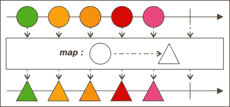
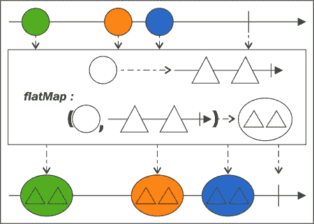
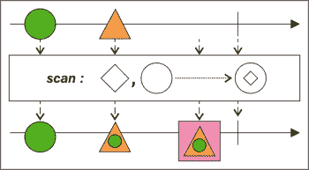

# 第四章。转换、过滤和积累您的数据

现在我们有了从各种源数据创建`Observable`实例的方法，是时候围绕这些实例构建编程逻辑了。我们将介绍用于实现逐步计算的基本反应运算符（处理数据的反应方式）。

我们将从变换开始，使用著名的`flatMap()`和`map()`运算符，以及一些不太常见的变换运算符。之后，我们将学习如何使用`filter()`操作符过滤数据，跳过元素，只在给定的时间位置接收元素。本章还将介绍与`scan`操作员积累数据。大多数操作员将使用*大理石图*进行演示。

本章涵盖以下主题：

*   大理石图和映射转换简介
*   过滤数据
*   使用`scan`运算符累积值

# 可观测变换

我们在前面的一些示例中使用了运算符。将输入值转换为其他值的**高阶函数**称为**转换**。可以在`Observable`实例上调用的高阶函数，从中生成新的`Observable`实例，称为运算符。**转换操作符**以某种方式转换源`Observable`实例发出的元素。

为了了解不同操作员的工作原理，我们将使用名为**大理石图**的图片。对于示例，此示例描述了`map`操作员：



图中中心的矩形表示运算符（函数）。它将其输入（圆）转换为其他内容（三角形）。矩形上方的箭头表示源`Observable`实例，其上的彩色圆圈表示及时发出的`OnNext`*通知*，末端的垂直线为`OnCompleted`*通知*。矩形下方的箭头是`Observable`实例及其转换元素的输出。

因此，`map()`运算符正是这样做的：它将源中的每个“*下一个*值转换为通过传递给它的函数定义的其他值。下面是一个小例子：

```java
Observable<String> mapped = Observable
  .just(2, 3, 5, 8)
  .map(v -> v * 3)
  .map(v -> (v % 2 == 0) ? "even" : "odd");
subscribePrint(mapped, "map");
```

第一个`map()`操作符将源发出的每个数字转换为自身，乘以三。第二个`map()`运算符将每个相乘的数字转换为字符串。如果数字为偶数，则字符串为“`even`”，否则为“`odd`”。

使用`map()`运算符，我们可以将每个发出的值转换为新值。还有更强大的转换运算符，它们看起来与`map()`运算符类似，但有自己的用法和用途。我们来看看。

## 使用各种 flatMap 运算符的变换

`flatMap`运算符与`map()`运算符类似，但有两个区别：

*   `flatMap`运算符的参数总是将值或值序列转换为`Observable`实例的形式，而不是接收将值转换为任意类型值的函数。
*   它合并那些产生的`Observable`实例发出的值。这意味着它不会将`Observable`实例作为值发出，而是发出它们的通知。

这是它的大理石图：


我们可以看到，源`Observable`实例中的每个值都被转换为`Observable`实例，最后，这些*导数观测值*的所有值都被生成的`Observable`实例发出。注意，得到的`Observable`实例可能以交错方式甚至无序地发出导数`Observable`实例的值。

`flatMap`运算符对于分叉逻辑非常有用。例如，如果一个`Observable`实例代表一个文件系统文件夹并从中发出文件，我们可以使用`flatMap`操作符将每个文件对象转换为一个`Observable`实例，并对这些*文件可观察对象*应用一些操作。结果将是这些操作的摘要。以下是从文件夹中读取一些文件并将其转储到标准输出的示例：

```java
Observable<Path> listFolder(Path dir, String glob) { // (1)
  return Observable.<Path>create(subscriber -> {
    try {
      DirectoryStream<Path> stream = Files.newDirectoryStream(dir, glob);
      subscriber.add(Subscriptions.create(() -> {
        try {
          stream.close();
        }
        catch (IOException e) {
          e.printStackTrace();
        }
      }));
      Observable.<Path>from(stream).subscribe(subscriber);
    }
    catch (DirectoryIteratorException ex) {
      subscriber.onError(ex);
    }
    catch (IOException ioe) {
      subscriber.onError(ioe);
    }
  });
}
Observable<String> from(final Path path) { // (2)
  return Observable.<String>create(subscriber -> {
    try {
      BufferedReader reader = Files.newBufferedReader(path);
      subscriber.add(Subscriptions.create(() -> {
        try {
          reader.close();
        }
        catch (IOException e) {
          e.printStackTrace();
        }
      }));
      String line = null;
      while ((line = reader.readLine()) != null && !subscriber.isUnsubscribed()) {
        subscriber.onNext(line);
      }
      if (!subscriber.isUnsubscribed()) {
        subscriber.onCompleted();
      }
    }
    catch (IOException ioe) {
      if (!subscriber.isUnsubscribed()) {
        subscriber.onError(ioe);
      }
    }
  });
}
Observable<String> fsObs = listFolder(
  Paths.get("src", "main", "resources"), "{lorem.txt,letters.txt}"
).flatMap(path -> from(path)); // (3)
subscribePrint(fsObs, "FS"); // (4)
```

这段代码介绍了处理文件夹和文件的两种方法。我们将简要介绍一下它们，以及在这个`flatMap`示例中如何使用它们：

1.  The first method, `listFolder()`, takes a folder in the form of a `Path` variable and a `glob` expression. It returns an `Observable` instance representing this folder. This `Observable` instance emits all the files in the folder, complying the `glob` expression as `Path` objects.

    该方法使用`Observable.create()`和`Observable.from()`运算符实现。这个实现的主要思想是，如果发生异常，应该由生成的`Observable`实例来处理和发出。

    注意使用`Subscriber.add()`操作符向订阅服务器添加一个新的`Subscription`实例，该实例是使用`Subscriptions.create()`操作符创建的。此方法使用操作创建一个`Subscription`实例。当`Subscription`实例*未订阅*时执行此动作，即本例中`Subscriber`实例*未订阅*时执行此动作。因此，这类似于在最后一块中关闭`stream`。

2.  The other method this example introduces is `Observable<String> from(Path)`.

    它逐行读取定位并传递给`path`实例的文件，并以`OnNext()`*通知*的形式发出这些行。该方法使用`Subscription`实例上的`Subscriber.add()`操作符关闭文件的`stream`。

3.  使用`flatMap`的示例使用`listFolder()`操作符从文件夹创建`Observable`实例，该操作符向文件发送两个`Path`参数。对每个文件使用`flatMap()`操作符，我们使用`from(Path)`操作符创建一个`Observable`实例，它以行的形式发送文件内容。
4.  前一个链的结果将是两个文件内容，打印在标准输出上。如果我们对每个可观察到的*文件路径*使用`Scheduler`实例（参见[第 6 章](6.html "Chapter 6. Using Concurrency and Parallelism with Schedulers")、*与调度器*使用并发和并行），则内容将*置乱*，因为`flatMap`操作符交错了`Observable`的通知它合并的实例。

### 注

介绍`Observable<String> from(final Path path)`方法的源代码可以在[找到 https://github.com/meddle0x53/learning-rxjava/blob/724eadf5b0db988b185f8d86006d772286037625/src/main/java/com/packtpub/reactive/common/CreateObservable.java#L61](https://github.com/meddle0x53/learning-rxjava/blob/724eadf5b0db988b185f8d86006d772286037625/src/main/java/com/packtpub/reactive/common/CreateObservable.java#L61) 。

包含`Observable<Path> listFolder(Path dir, String glob)`方法的源代码可在[查看/下载 https://github.com/meddle0x53/learning-rxjava/blob/724eadf5b0db988b185f8d86006d772286037625/src/main/java/com/packtpub/reactive/common/CreateObservable.java#L128](https://github.com/meddle0x53/learning-rxjava/blob/724eadf5b0db988b185f8d86006d772286037625/src/main/java/com/packtpub/reactive/common/CreateObservable.java#L128) 。

使用`flatMap`操作符的示例可在[查看/下载 https://github.com/meddle0x53/learning-rxjava/blob/master/src/main/java/com/packtpub/reactive/chapter04/FlatMapAndFiles.java](https://github.com/meddle0x53/learning-rxjava/blob/master/src/main/java/com/packtpub/reactive/chapter04/FlatMapAndFiles.java) 。

`flatMap`运算符有多个过载。以为例，有一个具有三个功能，一个用于`OnNext`，一个用于`OnError`，一个用于`OnComleted`。它还将*错误*或*完成的*事件转换为`Observable`实例，如果存在`OnError`或`OnCompleted`事件，则将其`Observable`实例转换合并到生成的`Observable`实例中，然后发出`OnCompleted`*通知*。以下是一个例子：

```java
Observable<Integer> flatMapped = Observable
  .just(-1, 0, 1)
  .map(v -> 2 / v)
  .flatMap(
 v -> Observable.just(v),
 e -> Observable.just(0),
 () -> Observable.just(42)
 );
subscribePrint(flatMapped, "flatMap");
```

其输出将为`-2(2/-1)`和`0`（由于`2/0`引起的错误）。由于*错误*，因此`1`不会发出，也不会到达`flatMap`操作员。

另一个有趣的重载是`Observable<R> flatMap(Func1<T, Observable<U>>, Func2<T, U, R>)`。这是它的大理石图：



这一个将源`Observable`实例中的项与这些源项触发的`Observable`实例相结合，并使用原始项和派生项对调用用户提供的函数。然后，`Observable`实例将发出此函数的结果。以下是一个例子：

```java
Observable<Integer> flatMapped = Observable
.just(5, 432)
.flatMap(
 v -> Observable.range(v, 2),
 (x, y) -> x + y);
subscribePrint(flatMapped, "flatMap");
```

输出为：

```java
flatMap : 10
flatMap : 11
flatMap : 864
flatMap : 865
flatMap ended!

```

这是因为源`Observable`实例发出的第一个元素是`5`，所以`flatMap`操作符使用`range()`操作符将其转换为`Observable`实例，该实例发出`5`和`6`。但是这个`flatMap`操作员并没有停在这里；对于此范围`Observable`实例发出的每个项目，它应用第二个函数，第一个参数为原始项目（`5`，第二个参数为范围发出的项目。所以我们有*5+5*和*5+6*。同样适用于源`Observable`实例`432`发出的第二项。变为*432+432=864*和*432+433=865*。

当所有派生项都需要访问其源项时，此重载非常有用，并且通常可以避免我们使用某种**元组**或**对**类，从而节省对内存和库的依赖性。在前面的文件示例中，我们可以在每个输出行前面加上文件名：

```java
CreateObservable.listFolder(
  Paths.get("src", "main", "resources"),
  "{lorem.txt,letters.txt}"
).flatMap(
 path -> CreateObservable.from(path),
 (path, line) -> path.getFileName() + " : " + line
);
```

运算符`flatMapIterable`不将 lambda 作为参数，lambda 将任意值作为参数，并返回一个`Observable`实例。相反，传递给它的 lambda 接受任意值并返回一个`Iterable`实例。所有这些`Iterable`实例都被展平为结果`Observable`实例发出的值。让我们看看下面的代码片段：

```java
Observable<?> fIterableMapped = Observable
.just(
  Arrays.asList(2, 4),
  Arrays.asList("two", "four"),
)
.flatMapIterable(l -> l);
```

这个简单的示例合并了源`Observable`实例发出的两个列表，结果发出四项。值得一提的是，调用`flatMapIterable(list -> list)`与调用`flatMap(l → Observable.from(l))`是一样的。

`flatMap`运算符的另一种形式是`concatMap`运算符。它的行为与原始的`flatMap`操作符类似，只是为了生成自己的序列，它连接而不是合并生成的`Observable`实例。下图显示了它的工作原理：


不同的*导数观测值*中的项与`flatMap`操作符一样不是交错的。`flatMap`和`concatMap`操作符之间的一个显著区别是`flatMap`操作符并行使用内部`Observable`实例，而`concatMap`操作符一次只订阅一个`Observable`实例。

最后一个类似于`flatMap`的操作符是`switchMap`。其大理石图如下所示：


其操作方式与`flatMap`操作符类似，除了每当源`Observable`实例发出新项目时，它停止镜像先前发出的项目生成的`Observable`实例，并开始仅镜像当前`Observable`实例。换句话说，当下一个*衍生*`Observable`实例开始发射其项目时，它会在内部取消当前*衍生*实例的订阅。以下是一个例子：

```java
Observable<Object> obs = Observable
.interval(40L, TimeUnit.MILLISECONDS)
.switchMap(v ->
 Observable
 .timer(0L, 10L, TimeUnit.MILLISECONDS)
 .map(u -> "Observable <" + (v + 1) + "> : " + (v + u)))
);
subscribePrint(obs, "switchMap");
```

源`Observable`实例正在使用`Observable.interval()`操作符每隔 40 毫秒发出序列号（以零开始）。使用`switchMap`操作符，为每个数字创建一个新的`Observable`实例，该实例发出另一个数字序列。第二个数字序列从传递给`switchMap`运算符的源编号开始（通过使用`map()`运算符将源编号与每个发出的编号相加来实现）。因此，每 40 毫秒，就会发出一个新的数字序列（每个数字间隔 10 毫秒）。

结果输出如下所示：

```java
switchMap : Observable <1> : 0
switchMap : Observable <1> : 1
switchMap : Observable <1> : 2
switchMap : Observable <1> : 3
switchMap : Observable <2> : 1
switchMap : Observable <2> : 2
switchMap : Observable <2> : 3
switchMap : Observable <2> : 4
switchMap : Observable <3> : 2
switchMap : Observable <3> : 3
switchMap : Observable <3> : 4
switchMap : Observable <3> : 5
switchMap : Observable <3> : 6
switchMap : Observable <4> : 3
.................

```

### 注

所有映射示例的源代码可在[下载/查看 https://github.com/meddle0x53/learning-rxjava/blob/master/src/main/java/com/packtpub/reactive/chapter04/MappingExamples.java](https://github.com/meddle0x53/learning-rxjava/blob/master/src/main/java/com/packtpub/reactive/chapter04/MappingExamples.java) 。

## 分组项目

项目可以按特定属性或键分组。

首先，我们来看看`groupBy()`操作符，一种将源`Observable`实例划分为多个`Observable`实例的方法。每个`Observable`实例根据分组函数发出一些源项。

`groupBy()`操作符返回一个发出`Observable`实例的`Observable`实例。这些`Observable`实例是特殊的；它们属于`GroupedObservable`类型，您可以使用`getKey()`方法检索它们的分组密钥。一旦使用了`groupBy()`操作员，就可以用不同或通用的方式处理不同的组。

注意，当`groupBy()`操作符创建一个发出`GroupedObservables`实例的可观察对象时，每个实例都缓冲其项。因此，如果我们忽略其中任何一个，这个缓冲区将出现潜在的内存泄漏。

`groupBy()`操作员的大理石图如下所示：


在这里，项目的形式被用作分组的共同特征。为了更好地理解该方法的思想，我们可以查看以下示例：

```java
List<String> albums = Arrays.asList(
  "The Piper at the Gates of Dawn",
  "A Saucerful of Secrets",
  "More", "Ummagumma",	"Atom Heart Mother",
  "Meddle", "Obscured by Clouds",
  "The Dark Side of the Moon",
  "Wish You Were Here", "Animals", "The Wall"
);
Observable
  .from(albums)
  .groupBy(album -> album.split(" ").length)
  .subscribe(obs ->
    subscribePrint(obs, obs.getKey() + " word(s)")
  );
```

该示例根据包含的单词数量，显示了平克·弗洛伊德的一些专辑标题和组合。例如`Meddle`和`More`在同一组中，键为`1`，而`A Saucerful of Secrets`和`Wish You Were Here`在同一组中，键为`4`。所有这些组都是由`GroupedObservable`实例表示的，所以我们可以在源`Observable`实例的`subscribe()`调用中订阅它们。不同的组根据其键使用不同的标签打印。这个小程序的输出如下：

```java
7 word(s) : The Piper at the Gates of Dawn
4 word(s) : A Saucerful of Secrets
1 word(s) : More
1 word(s) : Ummagumma
3 word(s) : Atom Heart Mother
1 word(s) : Meddle
3 word(s) : Obscured by Clouds
6 word(s) : The Dark Side of the Moon
4 word(s) : Wish You Were Here
1 word(s) : Animals
2 word(s) : The Wall

```

项目发出的顺序相同，但它们由不同的`GroupedObservable`实例发出。而且，所有的`GroupedObservable`实例都是在源代码完成后完成的。

`groupBy()`操作符还有一个重载，需要一秒钟的时间，转换函数以某种方式转换组中的每个项。以下是一个例子：

```java
Observable
.from(albums)
.groupBy(
 album -> album.replaceAll("[^mM]", "").length(),
 album -> album.replaceAll("[mM]", "*")
)
.subscribe(
  obs -> subscribePrint(obs, obs.getKey()+" occurences of 'm'")
);
```

专辑标题根据字母`m`在其中出现的次数进行分组。文本的转换方式是将字母的所有出现的替换为`*`。结果如下：

```java
0 occurences of 'm' : The Piper at the Gates of Dawn
0 occurences of 'm' : A Saucerful of Secrets
1 occurences of 'm' : *ore
4 occurences of 'm' : U**agu**a
2 occurences of 'm' : Ato* Heart *other
1 occurences of 'm' : *eddle
0 occurences of 'm' : Obscured by Clouds
1 occurences of 'm' : The Dark Side of the *oon
0 occurences of 'm' : Wish You Were Here
1 occurences of 'm' : Ani*als
0 occurences of 'm' : The Wall

```

### 注

示范使用`Observable.groupBy()`运算符的源代码可在[找到 https://github.com/meddle0x53/learning-rxjava/blob/master/src/main/java/com/packtpub/reactive/chapter04/UsingGroupBy.java](https://github.com/meddle0x53/learning-rxjava/blob/master/src/main/java/com/packtpub/reactive/chapter04/UsingGroupBy.java) 。

## 附加有用的变换运算符

还有几个值得一提的额外的*转换*。例如，有`cast()`操作符，是`map(v -> someClass.cast(v))`的快捷方式。

```java
List<Number> list = Arrays.asList(1, 2, 3);
Observable<Integer> iObs = Observable
  .from(list)
  .cast(Integer.class);
```

这里初始的`Observable`实例发出`Number`类型的值，但它们实际上是`Integer`实例，所以我们可以使用`cast()`操作符将它们表示为`Integer`实例。

另一个有用的操作符是`timestamp()`操作符。它通过将每个发出的值转换为`Timestamped<T>`类的实例，向其添加*时间戳*。例如，如果我们想要记录`Observable`的输出，这将非常有用，如下所示：

```java
List<Number> list = Arrays.asList(3, 2);
Observable<Timestamped<Number>> timestamp = Observable
  .from(list)
  .timestamp();
subscribePrint(timestamp, "Timestamps");
```

在本例中，每个数字都有时间戳。同样，可以使用`map()`操作符非常容易地实现这一点。前面示例的输出如下所示：

```java
Timestamps : Timestamped(timestampMillis = 1431184924388, value = 1)
Timestamps : Timestamped(timestampMillis = 1431184924394, value = 2)
Timestamps : Timestamped(timestampMillis = 1431184924394, value = 3)

```

类似的运算符是`timeInterval`运算符，但它将值转换为`TimeInterval<T>`运算符的实例。`TimeInterval<T>`实例表示`Observable`发出的项目，以及自发出前一个项目或（如果没有前一个项目）订阅以来经过的时间量。这可用于生成统计信息，例如：

```java
Observable<TimeInterval<Long>> timeInterval = Observable
  .timer(0L, 150L, TimeUnit.MILLISECONDS)
  .timeInterval();
subscribePrint(timeInterval, "Time intervals");
```

这将输出类似于以下内容的内容：

```java
Time intervals : TimeInterval [intervalInMilliseconds=13, value=0]
Time intervals : TimeInterval [intervalInMilliseconds=142, value=1]
Time intervals : TimeInterval [intervalInMilliseconds=149, value=2]
...................................................................

```

我们可以看到，不同的值大约在 150 毫秒时发出，它们应该是这样的。

`timeInterval`和`timestamp`操作员都在*即时*调度器上工作（参见[第 6 章](6.html "Chapter 6. Using Concurrency and Parallelism with Schedulers")，*使用与调度器*的并发性和并行性），他们都以毫秒为单位保存时间信息。

### 注

上述示例的源代码可在[中找到 https://github.com/meddle0x53/learning-rxjava/blob/master/src/main/java/com/packtpub/reactive/chapter04/VariousTransformationsDemonstration.java](https://github.com/meddle0x53/learning-rxjava/blob/master/src/main/java/com/packtpub/reactive/chapter04/VariousTransformationsDemonstration.java) 。

# 过滤数据

在第一章的无功和示例中，我们根据一种特殊模式过滤用户输入。例如，模式是*a:<编号>*。通常只从数据流中过滤感兴趣的数据位。例如，仅从所有按键关闭事件中筛选出*<输入>*按键关闭事件，或仅从文件中筛选出包含给定表达式的行是很有用的。这就是为什么不仅要能够转换我们的数据，而且还要学会如何过滤数据。

RxJava 中有很多过滤操作符。这些操作符中最重要的是`filter()`。其大理石图非常简单，如下所示：


它表明，`filter()`操作符通过某些属性过滤数据。在图中，它是元素的形式：它只过滤圆。与所有其他操作符一样，`filter()`从源创建一个新的`Observable`实例。此`Observable`实例仅发射符合`filter()`操作符定义的条件的项。以下代码说明了：

```java
Observable<Integer> numbers = Observable
  .just(1, 13, 32, 45, 21, 8, 98, 103, 55);
Observable<Integer> filter = numbers
  .filter(n -> n % 2 == 0);
subscribePrint(filter, "Filter");
```

由于过滤条件，这将只输出个*偶数*号（`32`、`8`和`98`）。

`filter()`操作符根据用户定义的函数过滤元素。还有很多额外的过滤操作符。为了理解它们，让我们看一些简单的例子：

```java
Observable<Integer> numbers = Observable
  .just(1, 13, 32, 45, 21, 8, 98, 103, 55);
Observable<String> words = Observable
  .just(
    "One", "of", "the", "few", "of",
    "the", "crew", "crew"
  );
Observable<?> various = Observable
  .from(Arrays.asList("1", 2, 3.0, 4, 5L));
```

我们在示例中定义了三个`Observable`实例。第一个发出九个数字。第二个是一个接一个地说出一个句子中的所有单词。第三个会发出不同类型的元素，包括字符串、整数、double 和 long。

```java
subscribePrint(numbers.takeLast(4), "Last 4");
```

`takeLast()`操作符返回一个新的`Observable`实例，该实例仅在完成时从源`Observable`实例发出最后的*n*项。此方法有一些重载。例如，有一个在指定的时间窗口内从源发射最后一个*N*或更少的项目。另一个可以接收一个`Scheduler`实例，以便在另一个线程上执行。

在本例中，只过滤并输出`Observable`实例的最后四项：

```java
Last 4 : 8
Last 4 : 98
Last 4 : 103
Last 4 : 55
Last 4 ended!

```

让我们看看下面的代码片段：

```java
subscribePrint(numbers.last(), "Last");
```

`last()`操作符创建的`Observable`实例，完成时只输出源`Observable`实例发出的*最后一项*。如果源没有发出项目，则会发出一个`NoSuchElementException`异常作为`OnError()`*通知*。它有一个重载，接收类型为`T->Boolean`的谓词参数。因此，它只发出源发出的最后一项，符合谓词定义的条件。在本例中，输出如下所示：

```java
Last : 55
Last ended!

```

`takeLastBuffer()`方法的行为与`takeLast()`方法非常相似，但它创建的`Observable`实例只会发出一个项—一个`List`实例，其中包含来自源的最后*N*项：

```java
subscribePrint(
  numbers.takeLastBuffer(4), "Last buffer"
);
```

它具有与`takeLast()`方法类似的重载。这里的输出如下：

```java
Last buffer : [8, 98, 103, 55]
Last buffer ended!

```

`lastOrDefault()`运算符的行为与`last()`运算符的行为类似，并且具有与谓词相同的重载：

```java
subscribePrint(
  numbers.lastOrDefault(200), "Last or default"
);
subscribePrint(
  Observable.empty().lastOrDefault(200), "Last or default"
);
```

但是，如果源没有发出任何信息，`lastOrDefault()`操作符发出默认值，而不是`OnError`*通知*。此示例的输出如下所示：

```java
Last or default : 55
Last or default ended!
Last or default : 200
Last or default ended!

```

`skipLast()`运算符与`takeLast()`方法正好相反；当它完成时，它从源中发出除最后一个*N*项之外的所有内容：

```java
subscribePrint(numbers.skipLast(4), "Skip last 4");
```

它有类似的重载。本例的输出如下：

```java
Skip last 4 : 1
Skip last 4 : 13

```

`skip()`方法与`skipLast()`方法相同，但跳过前*N*项，而不是最后一项：

```java
subscribePrint(numbers.skip(4), "Skip 4");
```

这意味着示例的输出如下所示：

```java
Skip 4 : 21
Skip 4 : 8
Skip 4 : 98
Skip 4 : 103
Skip 4 : 55
Skip 4 ended!

```

`take()`操作符与`takeLast()`操作符类似，但它不是源的最后*N*项，而是发出第一个*N*项。

```java
subscribePrint(numbers.take(4), "First 4");
```

这是一个常用的运算符，比`takeLast()`运算符便宜，因为`takeLast()`运算符缓冲其项并等待源完成。此运算符不缓冲其项，但在接收到它们时发出它们。它对于限制无限`Observable`实例非常有用。上述示例的输出如下所示：

```java
First 4 : 1
First 4 : 13
First 4 : 32
First 4 : 45
First 4 ended!

```

让我们看看下面的代码片段：

```java
subscribePrint(numbers.first(), "First");
```

`first()`运算符与`last()`运算符类似，但仅发射源发射的第一项。如果没有第一项，则发出相同的`OnError`*通知*。它的谓词形式有一个别名--`takeFirst()`操作符。该操作符还有一个`firstOrDefault()`操作符表单。此示例的输出很清楚：

```java
First : 1
First ended!

```

让我们看看下面的代码片段：

```java
subscribePrint(numbers.elementAt(5), "At 5");
```

`elementAt()`运算符类似于`first()`和`last()`运算符，但没有谓词形式。不过有一张表格。它只在项目序列中指定索引处发出元素，由源`Observable`实例发出。此示例输出以下内容：

```java
At 5 : 8
At 5 ended!

```

让我们看看下面的代码片段：

```java
subscribePrint(words.distinct(), "Distinct");
```

`distinct()`操作符生成的`Observable`实例从源中发出项目，重复的项目除外。有一个重载可以接收函数，返回一个键或散列码值，用于确定一个项是否与另一个项不同：

```java
Distinct : One
Distinct : of
Distinct : the
Distinct : few
Distinct : crew
Distinct ended!

```

```java
subscribePrint(
  words.distinctUntilChanged(), "Distinct until changed"
);
```

`distinctUntilChanged()`操作符类似于`distinct()`方法，但它返回的`Observable`实例会发出源`Observable`实例发出的所有项目，这些项目与它们的前一个不同。因此，在本例中，它将发出除最后一个单词`crew`之外的所有单词。

```java
subscribePrint( // (13)
  various.ofType(Integer.class), "Only integers"
);
```

`ofType()`操作符创建一个`Observable`实例，该实例只发出给定类型的源发出的项目。它基本上是这个呼叫的快捷方式：`filter(v -> Class.isInstance(v))`。在本例中，输出如下所示：

```java
Only integers : 2
Only integers : 4
Only integers ended!

```

### 注

所有这些示例的源代码可在[查看/下载 https://github.com/meddle0x53/learning-rxjava/blob/master/src/main/java/com/packtpub/reactive/chapter04/FilteringExamples.java](https://github.com/meddle0x53/learning-rxjava/blob/master/src/main/java/com/packtpub/reactive/chapter04/FilteringExamples.java) 。

这些是 RxJava 提供的最常用的*过滤*操作符。在后面的示例中，我们将大量使用其中的一些。

我们将在本章中讨论的`last`运算符是一个转换运算符，但有点特殊。它可以使用以前累积的状态！让我们进一步了解它。

# 积累数据

`scan(Func2)`运算符将具有两个参数的函数作为参数。其结果是一个`Observable`实例。`scan()`方法的结果发出的第一项是源`Observable`实例的第一项。通过将传递给`scan()`方法的函数应用于结果`Observable`实例发出的前一项和源`Observable`实例发出的第二项，创建了发出的第二项。由`scan()`方法结果发出的第三项是通过应用函数创建的，传递给`scan()`方法的前一项由其发出，第三项由源`Observable`实例发出。此模式继续以创建由`scan()`方法创建的`Observable`实例发出的序列的其余部分。传递给`scan()`方法的函数称为一个**累加器**。

我们来看看`scan(Func2)`方法的大理石图：



`scan()`方法发出的项可以通过累计状态生成。在图中，圆在三角形中累加，然后这个三角形圆在正方形中累加。

这意味着我们可以发出一系列整数的和，例如：

```java
Observable<Integer> scan = Observable
  .range(1, 10)
  .scan((p, v) -> p + v);
subscribePrint(scan, "Sum");
subscribePrint(scan.last(), "Final sum");
```

第一个*订阅*将输出所有排放：*1、3（1+2）、6（3+3）、10（6+4）。。55*。但在大多数情况下，我们只对最后一项感兴趣，即最终的总和。我们可以使用一个只发出最后一个元素的`Observable`实例，使用`last()`过滤操作符。值得一提的是，这里有一个`reduce(Func2)`操作符，是`scan(Func2).last()`的别名。

`scan()`操作员有一个过载，可与*种子/初始*参数一起使用。在这种情况下，传递给`scan(T, Func2)`运算符的函数将应用于源发出的第一项和该*种子*参数。

```java
Observable<String> file = CreateObservable.from(
  Paths.get("src", "main", "resources", "letters.txt")
);
scan = file.scan(0, (p, v) -> p + 1);
subscribePrint(scan.last(), "wc -l");
```

本例统计文件中的行数。文件`Observable`实例逐个发出给定路径指定的文件行。我们使用具有*种子*值`0`的`scan(T, Func2)`运算符，通过在每行的累积计数上加一来对行进行计数。

我们将用一个例子来结束本章，这个例子使用了本章中介绍的许多操作符。让我们来看看：

```java
Observable<String> file = CreateObservable.from(
  Paths.get("src", "main", "resources", "operators.txt")
);
Observable<String> multy = file
  .flatMap(line -> Observable.from(line.split("\\."))) // (1)
  .map(String::trim) // (2)
  .map(sentence -> sentence.split(" ")) // (3)
  .filter(array -> array.length > 0) // (4)
  .map(array -> array[0]) // (5)
  .distinct() // (6)
  .groupBy(word -> word.contains("'")) //(7)
  .flatMap(observable -> observable.getKey() ? observable : // (8)
    observable.map(Introspector::decapitalize))
  .map(String::trim) // (9)
  .filter(word -> !word.isEmpty()) // (10)
  .scan((current, word) -> current + " " + word) // (11)
  .last() // (12)
  .map(sentence -> sentence + "."); // (13)
subscribePrint(multy, "Multiple operators"); // (14)
```

这段代码使用大量运算符过滤并组合隐藏在文件中的句子。该文件由一个`Observable`实例表示，该实例一行一行地发出其中包含的所有行。

1.  我们不想只在不同的线路上运行；我们希望发出文件中包含的所有句子。因此，我们使用`flatMap`操作符创建一个`Observable`实例，该实例逐句发出文件语句（由`dot`确定）。
2.  我们使用`map()`操作符修剪这些句子。它们可能包含一些前导或尾随空格。
3.  我们希望对包含在句子项中的不同单词进行操作，因此我们使用`map()`操作符和`String::split`参数将它们转换为单词数组。
4.  我们不关心空句子（如果有），所以我们使用`filter()`操作符过滤掉它们。
5.  我们只需要句子中的第一个单词，所以我们使用`map()`操作符来获取它们。生成的`Observable`实例发出文件中每个句子的第一个单词。
6.  我们不需要重复的单词，所以我们使用`distinct()`操作符来去除它们。
7.  现在我们想用一种不同的方式来分支我们的逻辑，其中一些词被区别对待。因此，我们使用`groupBy()`操作符和`Boolean`键将单词分成两个`Observable`实例。所选单词的关键是`True`，其他所有单词的关键是`False`。
8.  使用`flatMap`操作符，我们将分开的单词连接起来，但只有选择的单词（键为`True`）保持不变。其余的被*斩首*。
9.  我们使用`map()`操作符从前导/尾随空格中修剪所有不同的单词。
10.  我们使用`filter()`操作符过滤掉空的。
11.  使用`scan()`操作符，我们用空格作为分隔符连接单词。
12.  使用`last()`操作符，我们得到的`Observable`实例将只发出最后一个串联，包含所有单词。
13.  最后一个对`map()`操作符的调用是通过添加一个点从我们连接的单词中创建一个句子。
14.  如果我们输出这个`Observable`实例发出的单个项目，我们将得到一个由初始文件中包含的所有句子的第一个单词组成的句子（跳过重复的单词）！

输出如下：

```java
Multiple operators : I'm the one who will become RX.
Multiple operators ended!

```

### 注

上述示例可在[中找到 https://github.com/meddle0x53/learning-rxjava/blob/master/src/main/java/com/packtpub/reactive/chapter04/VariousTransformationsDemonstration.java](https://github.com/meddle0x53/learning-rxjava/blob/master/src/main/java/com/packtpub/reactive/chapter04/VariousTransformationsDemonstration.java) 。

# 总结

本章结尾的示例演示了我们到目前为止学到的知识。我们可以通过使用各种操作符链接`Observable`实例来编写复杂的逻辑。我们可以使用`map()`或`flatMap()`运算符转换传入数据，并可以使用`groupBy()`或`filter()`运算符或不同的`flatMap()`运算符进行分支逻辑。我们可以使用`flatMap()`操作符再次加入这些分支。我们可以借助不同的过滤器选择部分数据，并使用`scan()`操作符进行累积。使用所有这些运算符，我们可以以可读且简单的方式编写相当不错的程序。程序的复杂性并不影响代码的复杂性。

下一步是学习如何以更直接的方式组合逻辑的分支。我们还将学习如何组合来自不同来源的数据。让我们继续下一章！