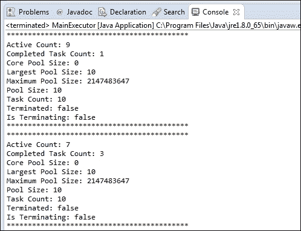
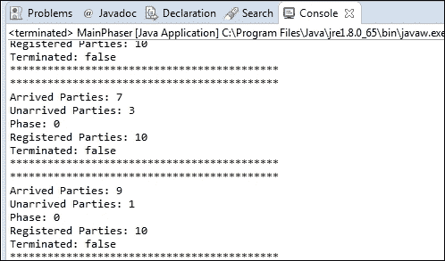
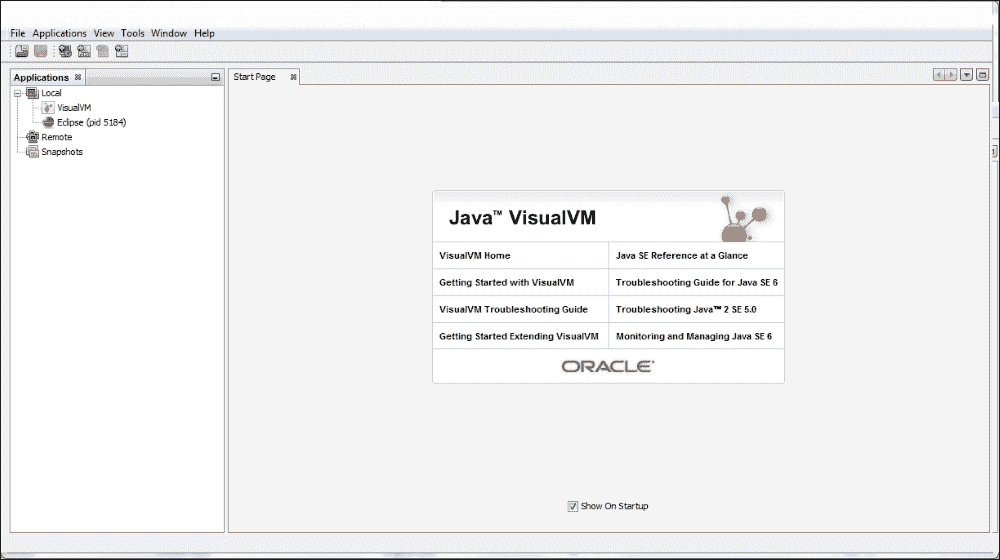
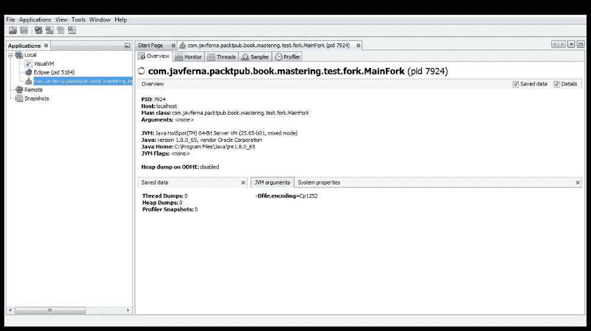
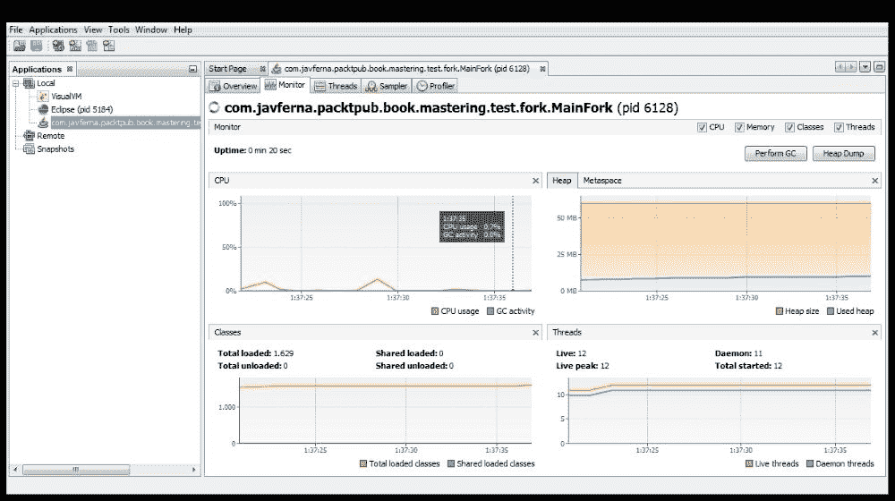
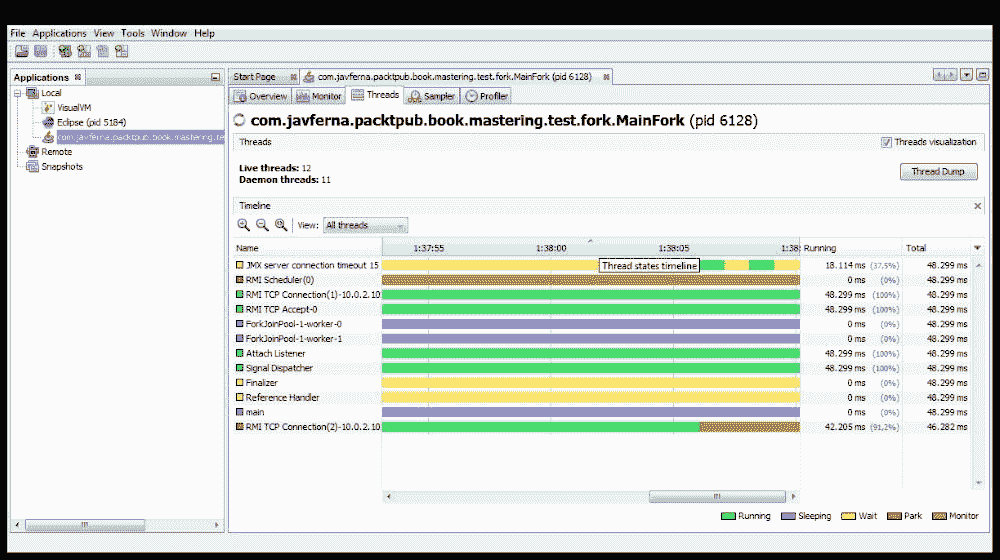
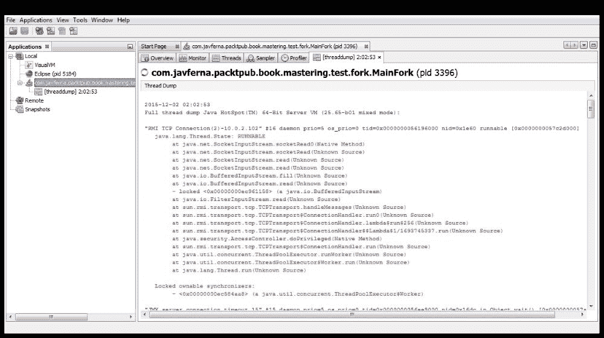
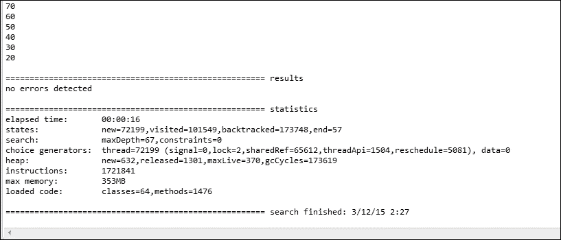
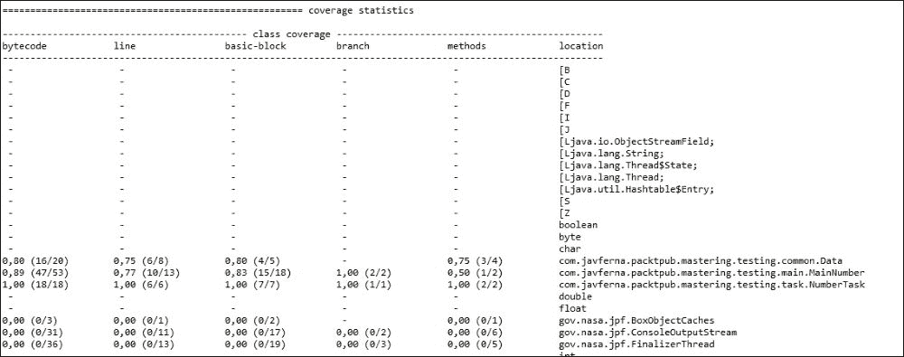

# 第 11 章测试和监控并发应用程序

**软件测试**是每个开发过程的关键任务。每个应用程序都必须满足最终用户的需求，测试阶段就是证明这一点的地方。它必须在可接受的时间内以指定的格式生成有效的结果。测试阶段的主要目标是检测软件中尽可能多的错误，以纠正错误并提高产品的整体质量。

传统上，在瀑布模型中，测试阶段在开发阶段非常高级时开始，但是现在越来越多的开发团队使用敏捷方法，其中测试阶段集成到开发阶段。主要目标是尽快测试软件，以便在过程的早期检测到错误。

在 Java 中，有很多工具，例如**JUnit**或**TestNG**来自动化测试的执行。其他工具如**JMeter**允许您测试有多少用户可以同时执行您的应用程序，还有其他工具如**Selenium**可用于在 web 应用程序中进行集成测试。

在并发应用程序中，测试阶段更为关键，也更为困难。您有两个或多个线程同时运行，但无法控制它们的执行顺序。您可以对应用程序进行大量测试，但不能保证不同线程的执行顺序不会引发争用条件或死锁。这种情况也会造成错误再现的困难。您可以找到仅在特定情况下发生的错误，因此很难找到其真正原因。在本章中，我们将介绍以下主题，以帮助您测试并发应用程序：

*   监视并发对象
*   监视并发应用程序
*   测试并发应用程序

# 监控并发对象

Java 并发 API 提供的大多数并发对象都包含了解其状态的方法。此状态可以包括正在执行的线程数、阻塞等待条件的线程数、执行的任务数等。在本节中，您将学习可以使用的最重要的方法以及可以从中获得的信息。这些信息对于检测错误的原因非常有用，尤其是在非常罕见的情况下。

## 监视线程

线程是 Java 并发 API 中最基本的元素。它允许您执行原始任务。您可以决定什么代码将在何时开始执行（扩展`Thread`类或实现`Runnable`接口），以及如何与应用程序的其他任务同步。`Thread`类提供了一些获取线程信息的方法。以下是最有用的方法：

*   `getId()`：此方法返回线程的标识符。它是一个`long`正数，并且是唯一的。
*   `getName()`：此方法返回线程的名称。默认格式为`Thread-xxx`，但可以在构造函数中修改，也可以使用`setName()`方法修改。
*   `getPriority()`：此方法返回线程的优先级。默认情况下，所有线程的优先级都为 5，但您可以使用`setPriority()`方法更改优先级。优先级较高的线程可能会优先于优先级较低的线程。
*   `getState()`：此方法返回线程的状态。返回一个值`Enum``Thread.State`，可以取以下值：`NEW`、`RUNNABLE`、`BLOCKED`、`WAITING`、`TIMED_WAITING`、`TERMINATED`。您可以查看 API 文档以了解每个状态的真正意义。
*   `getStackTrace()`：此方法将此线程的调用堆栈作为`StackTraceElement`对象数组返回。您可以打印此数组，以了解是什么调用导致了线程。

例如，您可以使用如下代码获取线程的所有相关信息：

```
    System.out.println("**********************");
    System.out.println("Id: " + thread.getId());
    System.out.println("Name: " + thread.getName());
    System.out.println("Priority: " + thread.getPriority());
    System.out.println("Status: " + thread.getState());
    System.out.println("Stack Trace");
    for(StackTraceElement ste : thread.getStackTrace()) {
      System.out.println(ste);
    }

    System.out.println("**********************\n");
```

使用这段代码，您将获得如下输出：


## 监控锁

**锁**是 Java 并发 API 提供的基本同步元素之一。它在`Lock`接口和`ReentrantLock`类中定义。基本上，锁允许您在代码中定义一个关键部分，但作为 synchronized 关键字，`Lock` 机制比其他机制更灵活（例如，您可以使用不同的锁来执行读写操作，或者使用非线性关键部分）。`ReentrantLock`类有一些方法可以让您了解`Lock`对象的状态：

*   `getOwner()`：此方法返回一个`Thread`对象，该对象包含当前拥有锁的线程，即执行临界段的线程。
*   `hasQueuedThreads()`：此方法返回一个`boolean`值，指示是否有线程等待获取此锁。
*   `getQueueLength()`：此方法返回一个`int`值，其中包含等待获取此锁的线程数。
*   `getQueuedThreads()`：此方法返回一个`Collection<Thread>` 对象，其中包含等待获取此锁的`Thread`对象。
*   `isFair()`：此方法返回一个`boolean`值，表示公平性属性的状态。此属性的值用于确定下一个获取锁的线程。您可以查看 JavaAPI 信息以获得此功能的详细描述。
*   `isLocked()`：此方法返回一个`boolean`值，指示此锁是否为线程所有。
*   `getHoldCount()`：此方法返回一个`int`值，该值表示该线程获取锁的次数。如果此线程未持有锁，则返回值为零。否则，它返回在当前线程中调用`lock()`方法的次数，该线程未调用匹配的`unlock()`方法。

`getOwner()` 和`getQueuedThreads()`方法受到保护，因此您无法直接访问它们。为了解决这个问题，您可以实现自己的`Lock`类，并实现提供这些信息的方法。

例如，您可以实现一个名为`MyLock`的类，如下所示：

```
public class MyLock extends ReentrantLock {

    private static final long serialVersionUID = 8025713657321635686L;

    public String getOwnerName() {
        if (this.getOwner() == null) {
            return "None";
        }
        return this.getOwner().getName();
    }

    public Collection<Thread> getThreads() {
        return this.getQueuedThreads();
    }
}
```

因此，您可以使用类似于此的代码片段来获取有关锁的所有相关信息：

```
    System.out.println("************************\n");
    System.out.println("Owner : " + lock.getOwnerName());
    System.out.println("Queued Threads: " + lock.hasQueuedThreads());
    if (lock.hasQueuedThreads()) {
        System.out.println("Queue Length: " + lock.getQueueLength());
        System.out.println("Queued Threads: ");
        Collection<Thread> lockedThreads = lock.getThreads();
        for (Thread lockedThread : lockedThreads) {
            System.out.println(lockedThread.getName());
        }
    }
    System.out.println("Fairness: " + lock.isFair());
    System.out.println("Locked: " + lock.isLocked());
    System.out.println("Holds: "+lock.getHoldCount());
    System.out.println("************************\n");
```

使用此代码块，您将获得类似以下内容的输出：


## 监控执行人

**executor framework**是一种机制，允许您执行并发任务，而不必担心线程的创建和管理。您可以将任务发送给执行者。它有一个内部线程池，可以重新利用这些线程执行任务。执行器还提供了一种机制来控制任务所消耗的资源，这样您就不会使系统过载。executor 框架提供了`Executor`和`ExecutorService`接口以及一些实现这些接口的类。实现它们的最基本类是`ThreadPoolExecutor`类。它提供了一些方法，允许您了解执行者的状态：

*   `getActiveCount()`：此方法返回执行器正在执行任务的线程数。
*   `getCompletedTaskCount()`：此方法返回执行者已经执行并完成执行的任务数。
*   `getCorePoolSize()`：此方法返回核心线程数。此数字确定池中的最小线程数。即使执行器中没有运行任务，池中的线程数也不会少于此方法返回的数。
*   `getLargestPoolSize()`：此方法返回执行器池中同时存在的最大线程数。
*   `getMaximumPoolSize()`：此方法返回池中可以同时存在的最大线程数。
*   `getPoolSize()`：此方法返回池中当前线程数。
*   `getTaskCount()`：此方法返回已发送给执行者的任务数，包括等待、运行和已完成的任务。
*   `isTerminated()`：如果`shutdown()` 或`shutdownNow()`方法已被调用，且`Executor`已完成其所有未决任务的执行，则此方法返回`true`。否则此方法返回`false`。
*   `isTerminating()`：如果`shutdown()`或`shutdownNow()`方法已被调用，但执行者仍在执行任务，则此方法返回`true`。

您可以使用类似于此的代码片段获取`ThreadPoolExecutor`的相关信息：

```
    System.out.println ("*******************************************");
    System.out.println("Active Count: "+executor.getActiveCount());
    System.out.println("Completed Task Count: "+executor.getCompletedTaskCount());
    System.out.println("Core Pool Size: "+executor.getCorePoolSize());
    System.out.println("Largest Pool Size: "+executor.getLargestPoolSize());
    System.out.println("Maximum Pool Size: "+executor.getMaximumPoolSize());
    System.out.println("Pool Size: "+executor.getPoolSize());
    System.out.println("Task Count: "+executor.getTaskCount());
    System.out.println("Terminated: "+executor.isTerminated());
    System.out.println("Is Terminating: "+executor.isTerminating());
    System.out.println ("*******************************************");
```

使用此代码块，您将获得类似以下内容的输出：



## 监控 Fork/Join 框架

**Fork/Join 框架**为可以使用分治技术实现的算法提供了一种特殊的执行器。它基于工作窃取算法。您创建了一个必须处理整个问题的初始任务。此任务创建处理问题较小部分的其他子任务，并等待问题的最终解决。每个任务都将其必须处理的子问题的大小与预定义的大小进行比较。如果大小小于预定义的大小，则直接解决问题。否则，它会将问题分解到其他子任务中，并等待它们返回结果。工作窃取算法利用正在执行任务的线程，这些线程正在等待其子任务的结果来执行其他任务。`ForkJoinPool`类提供了允许您获取其状态的方法：

*   `getParallelism()`：此方法返回为池建立的所需并行级别。
*   `getPoolSize()`：此方法返回池中的线程数。
*   `getActiveThreadCount()`：此方法返回池中当前正在执行任务的线程数。
*   `getRunningThreadCount()`：此方法返回未等待其子任务完成的线程数。
*   `getQueuedSubmissionCount()`：此方法返回已提交到尚未开始执行的池的任务数。
*   `getQueuedTaskCount()`：此方法返回此池的工作窃取队列中的任务数。
*   `hasQueuedSubmissions()`：如果已经提交到池中的任务尚未开始执行，则此方法返回`true`。否则返回`false`。
*   `getStealCount()`：此方法返回 Fork/Join 池执行工作窃取算法的次数。
*   `isTerminated()`：如果 Fork/Join 池执行完毕，则返回`true`。否则返回`false`。

您可以使用如下代码片段获取`ForkJoinPool`类的相关信息：

```
    System.out.println("**********************");
    System.out.println("Parallelism: "+pool.getParallelism());
    System.out.println("Pool Size: "+pool.getPoolSize());
    System.out.println("Active Thread Count: "+pool.getActiveThreadCount());
    System.out.println("Running Thread Count: "+pool.getRunningThreadCount());
    System.out.println("Queued Submission: "+pool.getQueuedSubmissionCount());
    System.out.println("Queued Tasks: "+pool.getQueuedTaskCount());
    System.out.println("Queued Submissions: "+pool.hasQueuedSubmissions());
    System.out.println("Steal Count: "+pool.getStealCount());
    System.out.println("Terminated : "+pool.isTerminated());
    System.out.println("**********************");
```

其中，`pool`是`ForkJoinPool`对象（例如，`ForkJoinPool.commonPool()`。使用此代码块，您将获得类似以下内容的输出：


## 监控移相器

**相位器**是一种同步机制，允许您执行可分为阶段的任务。此类还包括获取相量器状态的一些方法：

*   `getArrivedParties()`：此方法返回完成当前阶段的注册方数量。
*   `getUnarrivedParties()`：此方法返回当前阶段未完成的注册方数。
*   `getPhase()`：此方法返回当前相的编号。第一阶段的编号为`0`。
*   `getRegisteredParties()`：此方法返回相位器中注册方的数量。
*   `isTerminated()`：此方法返回一个`boolean`值，指示移相器是否已完成执行。

您可以使用如下代码片段来获取相位器的相关信息：

```
    System.out.println ("*******************************************");
    System.out.println("Arrived Parties: "+phaser.getArrivedParties());
    System.out.println("Unarrived Parties: "+phaser.getUnarrivedParties());
    System.out.println("Phase: "+phaser.getPhase());
    System.out.println("Registered Parties: "+phaser.getRegisteredParties());
    System.out.println("Terminated: "+phaser.isTerminated());
    System.out.println ("*******************************************");
```

使用这段代码，您将获得类似以下内容的输出：



## 监控流

流机制是 Java8 中引入的最重要的新特性之一。它允许您以并发的方式处理大量数据集合，转换这些数据，并以一种简单的方式实现 map 和 reduce 编程模型。该类不提供任何方法（除了在流是否并行时返回的`isParallel()`方法）来了解流的状态，但包含一个名为`peek()`的方法，您可以将该方法包含在方法管道中，以写入有关在流中执行的操作或转换的日志信息。

例如，此代码计算前 999 个数字的平方平均值：

```
double result=IntStream.range(0,1000)
    .parallel()
    .peek(n -> System.out.println (Thread.currentThread().getName()+": Number "+n))
    .map(n -> n*n)
    .peek(n -> System.out.println (Thread.currentThread().getName()+": Transformer "+n))
    .average()
    .getAsDouble();
```

第一个`peek()`方法写入流正在处理的数字，第二个方法写入这些数字的平方。如果执行此代码，当以并发方式执行流时，将获得类似以下内容的输出：


# 监控并发应用程序

当实现 Java 应用程序时，通常使用 Eclipse 或 NetBeans 等 IDE 来创建项目和编写源代码。但是**JDK**（是**Java 开发工具包**的缩写）包含了可用于编译、执行或生成 Javadoc 文档的工具。其中一个工具是**Java VisualVM**，它是一个图形化工具，向您显示在 JVM 中执行的应用程序的信息。您可以在 JDK 安装的 bin 目录（`jvisualvm.exe`中找到它。您还可以安装 Eclipse 插件（Eclipse launcher for VisualVM），以便在 Eclipse 上集成其功能。

如果执行，您将看到一个类似以下内容的窗口：



在屏幕的左侧，您可以看到**应用程序**选项卡，您将看到当前用户在您的系统中当前运行的所有 Java 应用程序。如果在其中一个应用程序中双击，您将看到五个选项卡：

*   **概述**：此页签显示应用程序的一般信息。
*   **监视器**：此选项卡显示应用程序使用的 CPU、内存、类和线程的图形信息。
*   **线程**：此选项卡显示应用程序线程随时间的演变。
*   **采样器**：此选项卡显示应用程序对内存和 CPU 的利用率信息。它类似于**探查器**选项卡，但获取数据的方式不同。
*   **探查器**：此选项卡显示应用程序对内存和 CPU 的利用率信息。类似于**采样器**选项卡，但获取数据的方式不同。

在接下来的部分中，您将了解在每个选项卡中可以获得哪些信息。您可以在[查阅有关此工具的完整文档 https://visualvm.java.net/docindex.html](https://visualvm.java.net/docindex.html) 。

## 概览页签

如前所述，此选项卡显示有关应用程序的一般信息。该信息包括：

*   **PID**：应用程序的进程 ID。
*   **主机**：执行应用程序的机器的名称。
*   **主类**：实现您正在执行的`main()`方法的类的全名。
*   **参数**：传递给应用程序的参数列表。
*   **JVM**：执行应用程序的 JVM 版本。
*   **Java**：您正在运行的 Java 版本。
*   **Java Home**：JDK 在系统中的位置。
*   **JVM 标志**：JVM 使用的标志。
*   **JVM 参数**：此选项卡显示我们（或 IDE）传递给 JVM 以执行应用程序的参数。
*   **系统属性**：此页签显示系统的属性和属性值。您可以使用`System.getProperties()`方法获取此信息。

它是访问应用程序数据时的默认选项卡，外观类似于以下屏幕截图：



## 监视器选项卡

正如我们前面提到的，这个选项卡显示了应用程序使用的 CPU、内存、类和线程的图形信息。您可以看到这些指标随时间的演变。此选项卡的外观与此类似：



在右上角，您有一些复选框来选择要查看的信息。**CPU**图形显示应用程序使用的 CPU 百分比。**堆**图形显示了堆的总大小以及应用程序使用的堆的大小。在这一部分中，您可以看到关于**元空间**（JVM 用于存储类的内存区域）的相同信息。**类**图形显示应用程序使用的类数，**线程**图形显示应用程序内部运行的线程数。您还可以在此选项卡中使用两个按钮：

*   **执行 GC**：立即在应用程序中执行垃圾收集
*   **堆转储**：保存应用程序的当前状态，以便以后检查

创建堆转储时，将有一个包含堆转储信息的新选项卡。其外观与此类似：


在进行堆转储时，您有不同的子选项卡来查看应用程序的状态。

## 螺纹标签

正如我们前面提到的，在**线程**选项卡中，您可以看到应用程序线程随时间的演变。它向您显示以下信息：

*   **活动线程**：应用程序中的线程数。
*   **守护进程线程**：应用程序中标记为守护进程线程的线程数。
*   **时间线**：线程随时间的演变，包括线程的状态（使用色码）、线程运行的时间以及线程存在的时间。在`Total`栏的右侧，您可以看到一个箭头。如果单击它，可以选择在此选项卡中看到的列。

其外观与此类似：



此选项卡还具有**线程转储**按钮。如果单击此按钮，您将看到一个新选项卡，其中包含应用程序中运行的每个线程的堆栈跟踪。其外观与此类似：



## 取样器标签

**采样器**选项卡显示应用程序的 CPU 和内存利用率信息。要获取此信息，它将获取应用程序的所有线程和转储的进程的转储。此选项卡类似于**探查器**选项卡，但正如您将在下一节中看到的，它们之间的区别在于用于获取信息的方式。

此选项卡的外观与此类似：


您有两个按钮：

*   **CPU**：此按钮用于获取 CPU 的使用信息。如果单击此按钮，您将看到两个子选项卡：
    *   **CPU 样本**：在此页签中，您将看到应用程序类的 CPU 利用率
    *   **线程 CPU 时间**：在此选项卡中，您将看到每个线程的 CPU 利用率
*   **内存**：此按钮用于获取内存使用信息。如果单击此按钮，您将看到另外两个子选项卡：
    *   **堆直方图**：在此页签中，您将看到按数据类型分配的字节数
    *   **每线程分配**：在此选项卡中，您可以看到每个线程使用的内存量

## 探查器选项卡

**探查器**选项卡显示了使用 instrumentation API 的应用程序的 CPU 和内存利用率信息。基本上，当 JVM 加载方法以获取此信息时，此 API 会向这些方法添加一些字节码。这些信息会随着时间的推移而更新。

此选项卡的外观与此类似：


默认情况下，此选项卡不获取任何信息。您必须启动分析会话。要做到这一点，您可以使用**CPU**按钮获取有关 CPU 利用率的信息。这包括每个方法的执行时间和调用这些方法的次数。您也可以使用**记忆**按钮。在本例中，您可以看到内存量和每个数据类型的对象数。

当您不需要获取更多信息时，可以使用**停止**按钮停止分析会话。

# 测试并发应用程序

测试并发应用程序是一项艰巨的任务。应用程序的线程在计算机中运行，但不保证其执行顺序（包括的同步机制除外），因此很难（大多数情况下不可能）测试所有可能发生的情况。您可能会出现无法重现的错误，因为它只发生在罕见或独特的情况下，或者由于 CPU 中的内核数量，错误只发生在一台机器上，而不会发生在其他机器上。要检测和再现这种情况，可以使用不同的工具：

*   **调试**：您可以使用调试器调试应用程序。如果应用程序中只有几个线程，并且必须一步一步地处理每个线程，那么这个过程将非常乏味。您可以配置 Eclipse 或 NetBeans 来测试并发应用程序。
*   **多线程 DC**：这是**谷歌代码**的存档项目，可用于强制并发应用程序中的执行顺序。
*   **Java PathFinder**：这是 NASA 用于验证 Java 程序的执行环境。它包括对验证并发应用程序的支持。
*   **单元测试**g：您可以创建一组单元测试（使用 JUnit 或 TestNG）并启动每个测试，例如 1000 次。如果每个测试都成功了，那么即使您的应用程序有竞争，他们的机会也不是很高，并且可能为生产所接受。您可以在代码中包含断言，以验证它没有任何竞争条件。

在以下各节中，您将看到使用多线程 DC 和 Java PathFinder 工具测试并发应用程序的基本示例。

## 使用多线程测试并发应用程序

MultithreadedTC 是一个存档项目，您可以从[下载 http://code.google.com/p/multithreadedtc/](http://code.google.com/p/multithreadedtc/) 。它的最新版本是 2007 年的，但您仍然可以使用它独立测试小型并发应用程序或大型应用程序的一部分。您不能使用它来测试真实的任务或线程，但可以使用它来测试不同的执行顺序，以检查它们是否会引发争用条件或死锁。

它基于一个内部时钟，该时钟与刻度一起工作，允许您控制不同线程的执行顺序，以测试该执行顺序是否会导致任何并发问题。

首先，您需要将两个库与项目关联：

*   **多线程数据库**：最新版本为 1.01 版本
*   **JUnit 库**：我们已经用 4.12 版本测试了这个示例

为了使用多线程 DC 库实现测试，您必须扩展扩展 JUnit 库`Assert`类的`MultithreadedTestCase`类。您可以实现以下方法：

*   `initialize()`：此方法将在测试执行开始时执行。如果需要为创建数据对象、数据库连接等执行初始化代码，则可以重写它。
*   `finish()`：此方法将在测试执行结束时执行。您可以重写它以实现测试的验证。
*   `threadXXX()`：您必须为测试中的每个线程实现一个名称以`thread`关键字开头的方法。例如，如果您想用三个线程进行测试，那么您的类中将有三个方法。

`MultithreadedTestCase`提供`waitForTick()`方法。此方法接收等待的刻度数作为参数。此方法使调用线程休眠，直到内部时钟到达该时钟。

第一个勾号是勾号`0`。MultithreadedTC 框架每次都会检查测试线程的状态。如果所有正在运行的线程都在`waitForTick()`方法中等待，它会增加勾号并唤醒所有正在等待该勾号的线程。

让我们看一个使用它的例子。假设您想要测试具有内部`int`属性的`Data`对象。您需要一个递增值的线程和一个递减值的线程。您可以创建一个名为`TestClassOk`的类来扩展`MultithreadedTestCase`类。我们对数据对象使用三个属性：我们将用于增加和减少数据的量以及数据的初始值：

```
public class TestClassOk extends MultithreadedTestCase {

    private Data data;
    private int amount;
    private int initialData;

    public TestClassOk (Data data, int amount) {
        this.amount=amount;
        this.data=data;
        this.initialData=data.getData();
    }
```

我们实现了两种方法来模拟两个线程的执行。第一个线程以`threadAdd()`方法实现：

```
    public void threadAdd() {
        System.out.println("Add: Getting the data");
        int value=data.getData();
        System.out.println("Add: Increment the data");
        value+=amount;
        System.out.println("Add: Set the data");
        data.setData(value);
    }
```

它读取数据的值，增加值，然后再次写入数据值。第二个线程以`threadSub()`方法实现：

```
    public void threadSub() {
        waitForTick(1);
        System.out.println("Sub: Getting the data");
        int value=data.getData();
        System.out.println("Sub: Decrement the data");
        value-=amount;
        System.out.println("Sub: Set the data");
        data.setData(value);
    }
}
```

首先，我们等待滴答声`1`。然后，我们得到数据的值，减小它的值，然后重写数据的值。

要执行测试，我们可以使用`TestFramework`类的`runOnce()`方法：

```
public class MainOk {

    public static void main(String[] args) {

        Data data=new Data();
        data.setData(10);
        TestClassOk ok=new TestClassOk(data,10);

        try {
            TestFramework.runOnce(ok);
        } catch (Throwable e) {
            e.printStackTrace();
        }

    }
}
```

当测试开始执行时，两个线程（`threadAdd()`和`threadSub()`以并发方式启动。`threadAdd()`开始执行其代码，`threadSub()`在`waitForTick()`方法中等待。当`threadAdd()`完成其执行时，多线程的内部时钟检测到`waitForTick()`方法中唯一正在运行的线程正在等待，因此它将 tick 值增加到`1`并唤醒执行其代码的线程。

在下面的屏幕截图中，您可以看到本例执行的输出。在这种情况下，一切都很顺利。


但是您可以更改线程的执行顺序以引发错误。例如，您可以执行以下顺序来引发竞争条件：

```
    public void threadAdd() {
        System.out.println("Add: Getting the data");
        int value=data.getData();
        waitForTick(2);
        System.out.println("Add: Increment the data");
        value+=amount;
        System.out.println("Add: Set the data");
        data.setData(value);
    }

    public void threadSub() {
        waitForTick(1);
        System.out.println("Sub: Getting the data");
        int value=data.getData();
        waitForTick(3);
        System.out.println("Sub: Decrement the data");
        value-=amount;
        System.out.println("Sub: Set the data");
        data.setData(value);
    }
```

在这种情况下，执行顺序确保两个线程首先读取数据的值，然后执行其操作，因此最终结果将不正确。

在下面的截图中，您可以看到本例执行的结果：


在这种情况下，`assertEquals()`方法抛出异常，因为预期值和实际值不相等。

该库的主要限制是，它仅用于测试基本并发代码，并且在实现测试时，不能用于测试真正的`Thread`代码。

## 使用 Java Pathfinder 测试并发应用程序

**Java Pathfinder**或 JPF 是美国宇航局提供的一个开源执行环境，可用于验证 Java 应用程序。它包含自己的虚拟机来执行 Java 字节码。在内部，它检测代码中可能有多个执行路径的点，并执行所有可能的操作。在并发应用程序中，这意味着它将在应用程序中运行的线程之间执行所有可能的执行顺序。它还包括允许您检测竞争条件和死锁的工具。

此工具的主要优点是，它允许您完全测试并发应用程序，以确保它没有竞争条件和死锁。此工具的不便之处在于：

*   您必须从其源代码安装它
*   如果您的应用程序很复杂，那么您将有数千条可能的执行路径，并且测试将非常长（如果应用程序很复杂，可能需要很多小时）

在以下部分中，我们将向您展示如何使用 Java Pathfinder 测试并发应用程序。

### 安装 Java Pathfinder

正如前面提到的，您必须从 JPF 的源代码安装它。该代码位于 Mercurial 存储库中，因此第一步是安装 Mercurial，正如我们将使用 EclipseIDE 一样，安装用于 Eclipse 的 Mercurial 插件。

您可以从[下载 Mercurialhttps://www.mercurial-scm.org/wiki/Download](https://www.mercurial-scm.org/wiki/Download) 。您可以下载安装程序，该程序提供在计算机中安装 Mercurial 的助手。安装 Mercurial 后，您可能需要重新启动系统。

您可以使用 Eclipse 菜单中的`Help > Install new software`并使用 URL[下载 Mercurial 插件 http://mercurialeclipse.eclipselabs.org.codespot.com/hg.wiki/update_site/stable](http://mercurialeclipse.eclipselabs.org.codespot.com/hg.wiki/update_site/stable) 作为查找软件的 URL。遵循与其他插件相同的步骤。

您还可以为 Eclipse 安装 JPF 插件。您可以从[下载 http://babelfish.arc.nasa.gov/trac/jpf/wiki/install/eclipse-plugin](http://babelfish.arc.nasa.gov/trac/jpf/wiki/install/eclipse-plugin) 。

现在，您可以访问 Mercurial repository explorer 透视图并添加 JavaPathfinder 的存储库。我们将只使用存储在[中的核心模块 http://babelfish.arc.nasa.gov/hg/jpf/jpf-core](http://babelfish.arc.nasa.gov/hg/jpf/jpf-core) 。访问存储库不需要用户名或密码。创建存储库后，您可以右键单击存储库并选择**克隆存储库**选项，在计算机中下载源代码。该选项将打开一个窗口选择一些选项，但您可以保留默认值并单击**下一步**按钮。然后，您必须选择要加载的版本。保留默认值，点击**下一步**按钮。最后，点击**完成**按钮完成下载过程。Eclipse 将自动运行`ant`来编译项目。如果您有任何编译问题，您必须解决它们并重新启动`ant`。

如果一切顺利，您的工作区中将有一个名为`jpf-core`的项目，如下图所示：


最后一个配置步骤是使用 JPF 的配置创建一个名为`site.properties`的文件。如果访问**窗口****首选项**中的配置窗口并选择**JPF 首选项**选项，您将看到 JPF 插件查找该文件的路径。如果你愿意，你可以改变路线。


由于我们将只使用核心模块，因此该文件将只包含到`jpf-core`项目的路径：

```
jpf-core = D:/dev/book/projectos/jpf-core
```

### 运行 Java Pathfinder

一旦我们安装了 JPF，让我们看看如何使用它来测试并发应用程序。首先，我们必须实现一个并发应用程序。在本例中，我们将使用一个具有内部`int`值的`Data`类。它将用`0`初始化，并将有一个`increment()`方法来增加值。

然后，我们将有一个名为`NumberTask`的任务，该任务实现`Runnable`接口，该接口将增加`Data`对象值的 10 倍。

```
public class NumberTask implements Runnable {

    private Data data;

    public NumberTask (Data data) {
        this.data=data;
    }

    @Override
    public void run() {

        for (int i=0; i<10; i++) {
            data.increment(10);
        }
    }

}
```

最后，我们有类来实现`main()`方法。我们将启动两个`NumberTasks`对象，它们将修改相同的`Data`对象。最后，我们将获得`Data`对象的最终值。

```
public class MainNumber {

    public static void main(String[] args) {
        int numTasks=2;
        Data data=new Data();

        Thread threads[]=new Thread[numTasks];
        for (int i=0; i<numTasks; i++) {
            threads[i]=new Thread(new NumberTask(data));
            threads[i].start();
        }

        for (int i=0; i<numTasks; i++) {
            try {
                threads[i].join();
            } catch (InterruptedException e) {
                e.printStackTrace();
            }
        }

        System.out.println(data.getValue());
    }

}
```

如果一切顺利，没有竞争条件发生，最终结果将是 200，但我们的代码没有使用任何同步机制，因此有可能发生这种情况。

如果我们想用 JPF 执行这个应用程序，我们需要在项目内部创建一个扩展名为`.jpf`的配置文件。例如，我们创建了`NumberJPF.jpf`文件，其中包含我们可以使用的最基本的配置文件：

```
+classpath=${config_path}/bin
target=com.javferna.packtpub.mastering.testing.main.MainNumber
```

我们修改了 JPF 的类路径，添加了我们项目的`bin`目录，并指明了我们应用程序的主类。现在，我们已经准备好通过 JPF 执行应用程序。为此，我们右键单击`.jpf` 文件并选择**验证**选项。我们将看到如何在控制台中看到大量输出消息。每个输出消息都来自应用程序的不同执行路径。


当 JPF 结束所有可能执行路径的执行时，它会显示有关执行的统计信息：



JPF 执行表示未检测到任何错误，但我们可以看到大多数结果与 200 不同，因此我们的应用程序具有我们预期的竞争条件。

在本节的介绍中，我们说过 JPF 提供了检测竞争条件和死锁的工具。JPF 将其实现为一种`Listener`机制，实现`Observer`模式以响应代码执行过程中发生的特定事件。例如，我们可以使用以下侦听器：

*   `PreciseRaceDetector`：使用此侦听器检测竞争条件
*   `DeadlockAnalyzer`：使用此侦听器检测死锁情况
*   `CoverageAnalyzer`：使用此侦听器在 JPF 执行结束时写入覆盖信息

您可以使用执行配置来配置要在`.jpf`文件中使用的侦听器。例如，我们在`NumberListenerJPF.jpf`文件中扩展了前面的测试，添加了`PreciseRaceDetector`和`CoverageAnalyzer`侦听器：

```
+classpath=${config_path}/bin
target=com.javferna.packtpub.mastering.testing.main.MainNumber
listener=gov.nasa.jpf.listener.PreciseRaceDetector,gov.nasa.jpf.li stener.CoverageAnalyzer
```

如果我们使用**验证**选项通过 JPF 执行此配置文件，当应用程序检测到控制台中显示的第一个竞态条件时，您将看到关于此情况的信息：


您还将看到`CoverageAnalyzer`侦听器如何写入信息：



JPF 是一个非常强大的应用程序，包括更多的侦听器和更多的扩展机制。您可以在[找到其全部文档 http://babelfish.arc.nasa.gov/trac/jpf/wiki](http://babelfish.arc.nasa.gov/trac/jpf/wiki) 。

# 总结

测试并发应用程序是一项非常艰巨的任务。线程的执行顺序无法保证（除非应用程序中引入了同步机制），因此您应该测试比串行应用程序中更多不同的情况。有时，您的应用程序中会出现可以重现的错误，因为这些错误只发生在非常罕见的情况下；有时，由于硬件或软件配置的原因，您的应用程序中会出现只发生在特定机器中的错误。

在本章中，您学习了一些可以帮助您更轻松地测试并发应用程序的机制。首先，您已经了解了如何获取 Java 并发 API 最重要组件的状态信息，如`Thread`、`Lock`、`Executor`或`Stream`。如果需要检测错误的原因，此信息可能非常有用。然后，您学习了如何使用 JavaVisualVM 来监视 Java 应用程序，尤其是并发应用程序。最后，您学习了使用两种不同的工具来测试并发应用程序。

通过本书的章节，您已经了解了如何使用 Java 并发 API 的最重要组件作为执行器框架、`Phaser`类、Fork/Join 框架、，Java8 中包含的新流 API 支持对实现机器学习、数据挖掘或自然语言处理领域的真实应用程序的元素流的函数式操作。您还学习了如何使用并发数据结构和同步机制，以及如何同步作为更大应用程序一部分的不同并发块。最后，您学习了并发应用程序的设计原则以及如何测试它们，这是确保成功使用此类应用程序的两个关键因素。

实现并发应用程序是一项艰巨的任务，但也是一项令人兴奋的挑战。我希望这本书有助于你成功地迎接这一挑战。